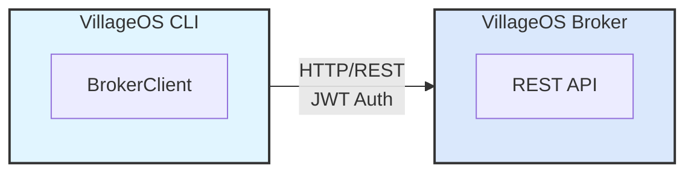

# VillageOS CLI - User Guide

## Table of Contents
- [Introduction](#introduction)
- [Getting Started](#getting-started)
- [Configuration](#configuration)
- [Command Reference](#command-reference)
- [Working with Things](#working-with-things)
- [Working with Relationships](#working-with-relationships)
- [Querying the Model](#querying-the-model)
- [Microservice Management](#microservice-management)
- [Model Import/Export](#model-importexport)
- [Testing](#testing)
- [Troubleshooting](#troubleshooting)

## Introduction

The VillageOS CLI is an interactive command-line interface for managing VillageOS temporal graph models. It communicates with the VillageOS Broker via HTTP API, providing a convenient way to:

- Create and manage Things (entities) and their properties
- Define Relationships between Things
- Query the model for statistics and data
- Import/export model data as JSON

### Architecture

The CLI operates as a remote client to the VillageOS Broker:



All operations are performed remotely on the Broker's model.

## Getting Started

### Prerequisites

- .NET 10.0 SDK or later
- A running VillageOS Broker instance

### Starting the CLI

**1. Start the Broker first:**
```bash
cd vos.Broker
dotnet run
```

The broker will start on `https://localhost:7243` by default.

**2. In a new terminal, start the CLI:**
```bash
cd vos.CLI
dotnet run
```

**Expected output:**
```
VillageOS Console - Connected to broker at https://localhost:7243
Type 'help' to see available commands.
Successfully authenticated with broker.

>
```

### Interactive Features

The CLI runs in interactive mode with the following features:

- **Command History**: Use the **Up/Down arrow keys** to recall previous commands
- **Line Editing**: Standard line editing with arrow keys, backspace, delete, home, end
- **Command history persists** during your session (cleared when you exit)

### Your First Commands

```bash
# Create a thing
> create thing Forest

# List all things
> list things

# Get help
> help

# Exit the CLI
> exit
```

## Configuration

### Authentication

The CLI requires an API key to communicate with the broker. On first broker start, an admin API key is logged at warning level — copy it from the broker output. You can also create new keys via the `POST /api/auth/keys` endpoint after logging in with `admin` / `admin`.

Provide the API key in two ways:

**1. Command-line argument (highest priority):**
```bash
dotnet run -- --api-key=vos_ak_...
# or
dotnet run -- --apikey=vos_ak_...
```

**2. Environment variable:**
```bash
export VOS_API_KEY=vos_ak_...
dotnet run
```

The API key is exchanged for a short-lived JWT via `POST /api/auth/token` with `X-API-Key` header. Tokens are cached for 4 minutes and refreshed automatically.

### Broker URL

The CLI needs to know where the Broker is running. You can configure this in three ways:

**1. Command-line argument (highest priority):**
```bash
dotnet run -- --broker-url=https://mybroker:8443
# or
dotnet run -- --broker=https://mybroker:8443
```

**2. Environment variable:**
```bash
export VOS_BROKER_URL=https://mybroker:8443
dotnet run
```

**3. Default:**
If neither is specified, the CLI uses `https://localhost:7243`

### Priority Order

Command-line args > Environment variables > Default

## Command Reference

### Quick Reference

| Command | Description |
|---------|-------------|
| `help` | Show available commands |
| `exit` | Exit the CLI |
| `create thing <name>` | Create a new thing |
| `create property <thing> <name> <type> <value>` | Add property |
| `create relation <subj> <pred> <target>` | Create relationship |
| `delete thing <thing>` | Delete a thing |
| `delete relationship <id>` | Delete a relationship |
| `delete property <thing> <name>` | Delete a property |
| `get thing <thing>` | Get thing details |
| `set <thing> <name> <value>` | Set property value |
| `find thing <pattern>` | Find things by name |
| `find relationships <thing>` | Find relationships for thing |
| `list things` | List all things |
| `list relations` | List all relationships |
| `list predicates` | List all predicates |
| `list handlers` | List all relationship services |
| `list services` | List all running microservices |
| `list daemons` | List all tracked daemons |
| `list agents` | List all agents (services + daemons) |
| `start service <handler>` | Start a registered microservice |
| `stop service <handlerId>` | Stop a running microservice |
| `stop daemon <key>` | Stop a lazy-started daemon |
| `clear model` | Clear all things and relationships |
| `shutdown` | Shut down the broker |
| `query property <name> <value>` | Find by property |
| `query predicate <name>` | Find relationships by predicate |
| `query stats` | Show statistics |
| `temporal snapshot [timestamp]` | Get model snapshot at time |
| `temporal at <thing> <timestamp>` | Get thing state at time |
| `temporal history <thing> <prop>` | Get property version history |
| `temporal mutations [target] [start] [end]` | Get property mutations |
| `range create <thing> <name> <criteria>` | Create an expected range |
| `range list <thing>` | List ranges for a thing |
| `range get <thing> <name>` | Get a specific range |
| `range delete <thing> <name>` | Delete a range |
| `range validate <criteria>` | Validate criteria syntax |
| `state <thing>` | Get current states for a thing |
| `state query <state-name>` | Find all things in a state |
| `serialize [file]` | Export model to JSON |
| `seed [file]` | Alias for serialize |
| `deserialize <file>` | Import model from JSON |
| `plant <file>` | Alias for deserialize |
| `pwd` | Show current directory |
| `cd <path>` | Change directory |

**Note:** Where `<thing>`, `<subj>`, `<pred>`, or `<target>` appears, you can use either a GUID or a unique name. Names are case-insensitive. If a name is ambiguous (multiple things have the same name), you must use the GUID.

### Output Options

All commands support the `--showguids` (or `-g`) flag to include GUIDs in the output. By default, output shows human-friendly names only.

| Flag | Description |
|------|-------------|
| `--showguids` | Show GUIDs alongside names in command output |
| `-g` | Short form of `--showguids` |

**Examples:**

```bash
# Default output (names only)
> list things
Things (3):
  Forest
  Watershed
  part_of

# With --showguids flag
> list things --showguids
Things (3):
  Forest (3fa85f64-5717-4562-b3fc-2c963f66afa6)
  Watershed (7c9e6679-7425-40de-944b-e07fc1f90ae7)
  part_of (9b1deb4d-3b7d-4bad-9bdd-2b0d7b3dcb6d)

# Short form works too
> list things -g
```

The flag can be placed anywhere in the command:

```bash
> list --showguids things
> --showguids list things
> list things --showguids
```

All commands that display things, relationships, or services support this flag:
- `list things`, `list relations`, `list predicates`, `list handlers`, `list services`
- `find thing`, `find relationships`
- `create thing`, `create relation`, `create property`
- `delete thing`, `delete relationship`, `delete property`
- `get thing`
- `set`
- `query property`, `query predicate`
- `start service`, `stop service`

### Name Resolution

Most commands that accept a thing ID also accept a thing name. The CLI resolves names as follows:

1. **GUID Check**: If the input is a valid GUID, it's used directly
2. **Name Lookup**: Otherwise, the CLI searches for things with that exact name (case-insensitive)
3. **Uniqueness Check**: If multiple things have the same name, an error is shown listing the matching IDs

**Examples:**
```bash
# Using GUID (always works)
> get thing 3fa85f64-5717-4562-b3fc-2c963f66afa6

# Using unique name (convenient)
> get thing Forest

# When a name is ambiguous
> get thing Tree
Error: Ambiguous name 'Tree': found 2 things with this name. Use the ID instead:
  3fa85f64-5717-4562-b3fc-2c963f66afa6 - Tree
  7c9e6679-7425-40de-944b-e07fc1f90ae7 - Tree
```

### Property Types

When creating properties, use these type names:

| Type | VOS Type | Example |
|------|----------|---------|
| `string` | vos.String | "Hello" |
| `int` | vos.Integer | 42 |
| `long` | vos.LongInteger | 9999999999 |
| `double` | vos.Double | 3.14 |
| `float` | vos.Float | 2.5 |
| `decimal` | vos.Decimal | 99.99 |
| `bool` | vos.Boolean | true |
| `datetime` | vos.DateTime | "2025-01-30" |
| `guid` | vos.Guid | "550e8400-e29b-41d4-a716-446655440000" |

## Working with Things

### Creating Things

```bash
# Create a simple thing
> create thing Forest
Created Thing: Forest

# Create another thing
> create thing Watershed
Created Thing: Watershed

# With --showguids to see the ID
> create thing Meadow --showguids
Created Thing: Meadow (aabbccdd-1122-3344-5566-778899aabbcc)
```

### Adding Properties

```bash
# Using the thing name
> create property Forest biomeType string Temperate

# Using the thing GUID
> create property 3fa85f64-5717-4562-b3fc-2c963f66afa6 carbonLevel int 30
```

### Getting Thing Details

```bash
# Using name
> get thing Forest
Name: Forest
Properties:
  biomeType: Temperate (string)
  carbonLevel: 30 (int)

# With --showguids to see the ID
> get thing Forest --showguids
Name: Forest (3fa85f64-5717-4562-b3fc-2c963f66afa6)
Properties:
  biomeType: Temperate (string)
  carbonLevel: 30 (int)

# Using GUID also works
> get thing 3fa85f64-5717-4562-b3fc-2c963f66afa6
```

### Setting Property Values

```bash
# Using name
> set Forest carbonLevel 35
Set carbonLevel = 35 on thing 'Forest'

# Using GUID
> set 3fa85f64-5717-4562-b3fc-2c963f66afa6 carbonLevel 40

# With --showguids
> set Forest carbonLevel 45 --showguids
Set carbonLevel = 45 on thing 'Forest' (3fa85f64-5717-4562-b3fc-2c963f66afa6)
```

### Finding Things

```bash
# Find by name pattern (case-insensitive)
> find thing forest
Found 1 thing(s) matching 'forest':
  Forest

# Find with partial match
> find thing For
Found 1 thing(s) matching 'For':
  Forest

# With --showguids to see IDs
> find thing For --showguids
Found 1 thing(s) matching 'For':
  Forest (3fa85f64-5717-4562-b3fc-2c963f66afa6)
```

### Listing Things

```bash
# Default output (names only)
> list things
Things (3):
  Forest
  Watershed
  part_of

# With --showguids to see IDs
> list things --showguids
Things (3):
  Forest (3fa85f64-5717-4562-b3fc-2c963f66afa6)
  Watershed (7c9e6679-7425-40de-944b-e07fc1f90ae7)
  part_of (9b1deb4d-3b7d-4bad-9bdd-2b0d7b3dcb6d)
```

### Deleting Things

```bash
# Using name
> delete thing Forest
Deleted thing 'Forest'

# Using GUID
> delete thing 3fa85f64-5717-4562-b3fc-2c963f66afa6
Deleted thing 'Forest'

# With --showguids
> delete thing Forest --showguids
Deleted thing 'Forest' (3fa85f64-5717-4562-b3fc-2c963f66afa6)
```

### Deleting Properties

```bash
# Using name for thing
> delete property Forest carbonLevel
Deleted property 'carbonLevel' from thing 'Forest'

# Using GUID for thing
> delete property 3fa85f64-5717-4562-b3fc-2c963f66afa6 carbonLevel
Deleted property 'carbonLevel' from thing 'Forest'

# With --showguids
> delete property Forest carbonLevel --showguids
Deleted property 'carbonLevel' from thing 'Forest' (3fa85f64-5717-4562-b3fc-2c963f66afa6)
```

## Working with Relationships

### Understanding Relationships

Relationships in VillageOS follow the Subject-Predicate-Target pattern:

```
Subject --[Predicate]--> Target
Forest  --[part_of]-->   Watershed
```

All three parts (Subject, Predicate, Target) are Things. The Predicate defines the type of relationship.

### Creating Relationships

**Step 1: Create the predicate thing:**
```bash
> create thing part_of
Created thing: part_of (id: 9b1deb4d-3b7d-4bad-9bdd-2b0d7b3dcb6d)
```

**Step 2: Create the relationship using names:**
```bash
# Using names (convenient)
> create relation Forest part_of Watershed
Created relationship: Forest --[part_of]--> Watershed

# Using GUIDs (also works)
> create relation 3fa85f64-5717-4562-b3fc-2c963f66afa6 9b1deb4d-3b7d-4bad-9bdd-2b0d7b3dcb6d 7c9e6679-7425-40de-944b-e07fc1f90ae7
Created relationship: Forest --[part_of]--> Watershed
```

### Listing Relationships

```bash
# Default output (names only)
> list relations
Relationships (1):
  Forest --[part_of]--> Watershed

# With --showguids
> list relations --showguids
Relationships (1):
  Forest (3fa85f64-5717-4562-b3fc-2c963f66afa6) --[part_of]--> Watershed (7c9e6679-7425-40de-944b-e07fc1f90ae7)
  [rel: abc123ef-5678-4321-abcd-ef1234567890]
```

### Finding Relationships

```bash
# Find all relationships for a thing by name
> find relationships Forest
Relationships for thing 'Forest':
  As Subject (1):
    Forest --[part_of]--> Watershed
  As Target (0):
    (none)

# Using GUID also works
> find relationships 3fa85f64-5717-4562-b3fc-2c963f66afa6

# With --showguids for full details
> find relationships Forest --showguids
Relationships for thing 'Forest' (3fa85f64-5717-4562-b3fc-2c963f66afa6):
  As Subject (1):
    Forest (3fa85f64-5717-4562-b3fc-2c963f66afa6) --[part_of]--> Watershed (7c9e6679-7425-40de-944b-e07fc1f90ae7)
  As Target (0):
    (none)
```

### Listing Predicates

```bash
# Default output (names only)
> list predicates
Predicates (3):
  part_of (2 relationship(s))
  adjacent_to (1 relationship(s))
  contains (1 relationship(s))

# With --showguids
> list predicates --showguids
Predicates (3):
  part_of [9b1deb4d-3b7d-4bad-9bdd-2b0d7b3dcb6d] (2 relationship(s))
  adjacent_to [abc123ef-5678-4321-abcd-ef1234567890] (1 relationship(s))
  contains [def456ab-9012-3456-cdef-789012345678] (1 relationship(s))
```

### Deleting Relationships

```bash
> delete relationship <relationship-id>
Deleted relationship: <relationship-id>
```

## Querying the Model

### Query by Property Value

```bash
# Find all things with a specific property value
> query property biomeType Temperate
Found 2 thing(s) with biomeType = 'Temperate':
  Forest
  Meadow

# With --showguids
> query property biomeType Temperate --showguids
Found 2 thing(s) with biomeType = 'Temperate':
  Forest (3fa85f64-5717-4562-b3fc-2c963f66afa6)
  Meadow (aabbccdd-1122-3344-5566-778899aabbcc)
```

### Model Statistics

```bash
> query stats
Model Statistics:
  Things: 15
  Relationships: 8
  Properties: 42
  Predicates: 4
    - part_of: 3 relationships
    - adjacent_to: 2 relationships
    - contains: 2 relationships
    - is: 1 relationship
```

### Temporal Queries

The CLI provides commands to query the temporal state of the model—viewing data as it existed at specific points in time.

#### Getting a Model Snapshot

Get the complete model state at a specific point in time:

```bash
# Current snapshot (equivalent to 'now')
> temporal snapshot
{
  "Timestamp": "2026-02-06T12:00:00Z",
  "Things": [...],
  "Relationships": [...]
}

# Snapshot at specific time
> temporal snapshot 2026-01-15T12:00:00Z

# Using 'now' explicitly
> temporal snapshot now
```

#### Getting a Thing's State at a Time

View a thing's properties and relationships as they existed at a specific time:

```bash
# Current state (using name)
> temporal at Forest now
{
  "Id": "3fa85f64-5717-4562-b3fc-2c963f66afa6",
  "Name": "Forest",
  "Timestamp": "2026-02-06T12:00:00Z",
  "Properties": {"carbonLevel": 30, "biomeType": "Temperate"},
  "OutgoingRelationships": [...],
  "IncomingRelationships": [...]
}

# State at specific time (using ID)
> temporal at 3fa85f64-5717-4562-b3fc-2c963f66afa6 2026-01-15T12:00:00Z
```

#### Viewing Property Version History

Get the change history of a property within a time range:

```bash
# Full history using thing name
> temporal history Forest carbonLevel
{
  "ThingId": "3fa85f64-5717-4562-b3fc-2c963f66afa6",
  "PropertyName": "carbonLevel",
  "StartTime": "2025-02-06T12:00:00Z",
  "EndTime": "2026-02-06T12:00:00Z",
  "Versions": [
    {"Timestamp": "2026-01-01T10:00:00Z", "Value": 25},
    {"Timestamp": "2026-01-15T14:30:00Z", "Value": 30},
    {"Timestamp": "2026-02-01T09:00:00Z", "Value": 35}
  ]
}

# History within specific time range (using ID)
> temporal history 3fa85f64-5717-4562-b3fc-2c963f66afa6 carbonLevel 2026-01-01T00:00:00Z 2026-01-31T23:59:59Z
```

#### Viewing Property Mutations

Get a log of all property value changes (mutations) across the model, for a specific thing, or for a relationship:

```bash
# All mutations in the model
> temporal mutations
{
  "StartTime": null,
  "EndTime": null,
  "ThingMutations": {
    "3fa85f64-5717-4562-b3fc-2c963f66afa6": {
      "ThingId": "3fa85f64-5717-4562-b3fc-2c963f66afa6",
      "ThingName": "Forest",
      "Mutations": [
        {"Timestamp": "2026-01-15T10:00:00Z", "PropertyName": "carbonLevel", "OldValue": 25, "NewValue": 30}
      ]
    }
  },
  "TotalMutations": 5
}

# Mutations for a specific thing (by name or ID)
> temporal mutations Forest
> temporal mutations thing Forest
> temporal mutations 3fa85f64-5717-4562-b3fc-2c963f66afa6
> temporal mutations thing 3fa85f64-5717-4562-b3fc-2c963f66afa6

# Mutations for a relationship (by ID only)
> temporal mutations rel 7c9e6679-7425-40de-944b-e07fc1f90ae7
> temporal mutations relationship 7c9e6679-7425-40de-944b-e07fc1f90ae7

# Mutations within a time range
> temporal mutations 2026-01-01T00:00:00Z 2026-01-31T23:59:59Z
> temporal mutations thing Forest 2026-01-01T00:00:00Z 2026-01-31T23:59:59Z
```

**Mutation targets:**
- `model` (or omit) - All mutations across the entire model
- `<name>` or `<guid>` - Mutations for a thing by name or ID
- `thing <name>` - Explicit thing mutations (by name or ID)
- `rel <id>` or `relationship <id>` - Mutations for a relationship (ID only)

#### Timestamp Format

All timestamps use ISO 8601 format: `YYYY-MM-DDTHH:mm:ssZ`

Examples:
- `2026-01-15T12:30:00Z` (UTC)
- `2026-01-15T12:30:00-05:00` (with timezone offset)
- `now` (current time)

**Important:** All timestamps in VillageOS are stored and compared using UTC. When querying without explicit timestamps, the default range is one year ago (UTC) to now (UTC). This ensures consistent behavior regardless of the server's local timezone.

**Note:** Property history requires properties to be in `FullHistory` mode. Properties in `CurrentOnly` mode do not maintain history.

## Expected Ranges & States

Expected ranges are named predicates that describe conditions on a thing's properties. When a range's criteria evaluates to true, the thing is considered to be "in that state". This enables emergent state tracking based on property values.

### Creating Ranges

Create an expected range on a thing with the `range create` command:

```bash
# Basic range with criteria
> range create Sensor overheating "temp > 100"
{
  "Name": "overheating",
  "Criteria": "temp > 100",
  "IsInherited": false
}

# Range with property and bounds
> range create Sensor nominal "temp >= 20 AND temp <= 80" --property temp --bounds-min 20 --bounds-max 80
{
  "Name": "nominal",
  "Criteria": "temp >= 20 AND temp <= 80",
  "Property": "temp",
  "BoundsDescription": "[20, 80]",
  "IsInherited": false
}
```

**Options:**
- `--property <name>` - Property this range describes (for deviation reporting)
- `--bounds-min <val>` - Minimum numeric bound
- `--bounds-max <val>` - Maximum numeric bound

### Criteria DSL

The criteria DSL supports various expressions:

| Expression | Example | Description |
|------------|---------|-------------|
| Comparison | `temp > 100` | Compare property to value |
| AND/OR | `temp > 100 AND rpm < 5000` | Logical operators |
| NOT | `NOT status = 'off'` | Negation |
| IN | `status IN ('active', 'pending')` | Membership test |
| MATCHES | `name MATCHES '^Sensor.*'` | Regex pattern match |
| Related ref | `[connected_to.Generator].temp > 50` | Related thing property |
| State check | `[powered_by].state HAS 'running'` | Check related thing's state |

**Examples:**
```bash
# Simple comparison
> range create Motor running "rpm > 0"

# Compound expression
> range create Motor stressed "temp > 80 AND rpm > 5000"

# Using related things
> range create Pump overloaded "[powered_by.Motor].stressed = true"

# State inheritance check
> range create System healthy "ALL [contains].state HAS 'nominal'"
```

### Validating Criteria

Validate criteria syntax without creating a range:

```bash
> range validate "temp > 100 AND rpm < 5000"
Criteria is valid.

> range validate "temp >> 100"
Invalid criteria: Parse error at position 5: Unexpected character '>'
```

### Listing Ranges

```bash
> range list Sensor
{
  "ThingId": "3fa85f64-5717-4562-b3fc-2c963f66afa6",
  "ThingName": "Sensor",
  "OwnRanges": [
    {"Name": "overheating", "Criteria": "temp > 100"},
    {"Name": "nominal", "Criteria": "temp >= 20 AND temp <= 80"}
  ],
  "InheritedRanges": []
}
```

### Getting a Specific Range

```bash
> range get Sensor overheating
{
  "Name": "overheating",
  "Criteria": "temp > 100",
  "IsInherited": false
}
```

### Deleting Ranges

```bash
> range delete Sensor overheating
Deleted range 'overheating'
```

### Getting Current States

Evaluate all ranges and see which are currently active:

```bash
> state Sensor
{
  "ThingId": "3fa85f64-5717-4562-b3fc-2c963f66afa6",
  "ThingName": "Sensor",
  "CurrentStates": ["overheating"],
  "RangeEvaluations": [
    {"RangeName": "overheating", "IsActive": true, "Criteria": "temp > 100"},
    {"RangeName": "nominal", "IsActive": false, "Criteria": "temp >= 20 AND temp <= 80"}
  ]
}

# Explicit get subcommand works too
> state get Sensor
```

The `CurrentStates` array shows which ranges currently evaluate to true. `RangeEvaluations` shows the evaluation result for each range.

### Querying by State

Find all things currently in a specific state:

```bash
> state query overheating
{
  "StateName": "overheating",
  "Things": [
    {"Id": "3fa85f64-5717-4562-b3fc-2c963f66afa6", "Name": "Sensor1"},
    {"Id": "7c9e6679-7425-40de-944b-e07fc1f90ae7", "Name": "Sensor3"}
  ]
}

# Using find alias
> state find nominal
```

### Range Inheritance

Ranges can be inherited from parent things via "is" relationships, similar to property inheritance:

```bash
# Create type with a range
> create thing SensorType
> range create SensorType nominal "temp >= 0 AND temp <= 100"

# Create instance that inherits
> create thing Sensor1
> create thing is
> create relation Sensor1 is SensorType

# Sensor1 now inherits ranges from SensorType (resolved at query time via "is" relationship)
> range list Sensor1
{
  "OwnRanges": [],
  "InheritedRanges": [
    {
      "SourceName": "SensorType",
      "Ranges": [{"Name": "nominal", "Criteria": "temp >= 0 AND temp <= 100", "IsInherited": true}]
    }
  ]
}
```

## Microservice Management

The CLI provides commands to monitor and manage microservices registered with the Broker.

### Understanding Services vs Daemons

VillageOS has two types of running processes:

| Type | Description | How Started |
|------|-------------|-------------|
| **Registered Services** | Explicitly registered with the Broker via the register endpoint | `POST /api/broker/register` |
| **Lazy-started Daemons** | Auto-started when relationships are created with predicates that have handlers | Triggered by relationship creation |

Use `list agents` to see both types together.

### Listing Running Services

```bash
# Default output (names only)
> list services
Microservices (2):
  Metabolism [Running]
    Endpoint: https://localhost:5100
    Health: Healthy
  PythonHandler [Stopped]
    Endpoint: https://localhost:5200
    Health: Unknown

# With --showguids to see handler IDs
> list services --showguids
Microservices (2):
  Metabolism (3fa85f64-5717-4562-b3fc-2c963f66afa6) [Running]
    Endpoint: https://localhost:5100
    Health: Healthy
  PythonHandler (7c9e6679-7425-40de-944b-e07fc1f90ae7) [Stopped]
    Endpoint: https://localhost:5200
    Health: Unknown
```

### Listing Daemons

```bash
> list daemons
Daemons (2):
  consumes:7102 [Running]
    Process ID: 12345
  produces:7103 [Stopped]
    Process ID: N/A
    Consecutive Failures: 3
    Last Failure: 1/30/2025 10:00 AM
```

Daemons are tracked by a key in the format `<predicate>:<port>`. The daemon info shows:
- **Process ID**: The system process ID if running
- **Consecutive Failures**: Number of recent startup failures (for cooldown tracking)
- **Last Failure**: Timestamp of the most recent failure

### Listing All Agents

To see both services and daemons together:

```bash
> list agents
Registered Services (1):
  Metabolism [Running]
    Endpoint: https://localhost:5100
    Health: Healthy

Lazy-started Daemons (2):
  consumes:7102 [Running]
    Process ID: 12345
  produces:7103 [Running]
    Process ID: 54321

# With --showguids
> list agents --showguids
Registered Services (1):
  Metabolism (3fa85f64-5717-4562-b3fc-2c963f66afa6) [Running]
    ...
```

### Starting a Service

```bash
# Start a service by handler name
> start service Metabolism
Service Metabolism started successfully

# Or by handler ID
> start service 3fa85f64-5717-4562-b3fc-2c963f66afa6
Service Metabolism started successfully

# With --showguids
> start service Metabolism --showguids
Service Metabolism (3fa85f64-5717-4562-b3fc-2c963f66afa6) started successfully
```

The handler must be registered with the Broker and have a valid `ExecutablePath` property.

### Stopping a Service

```bash
# Stop a service by name
> stop service Metabolism
Stop request sent to service 'Metabolism'

# Or by its handler ID
> stop service 3fa85f64-5717-4562-b3fc-2c963f66afa6
Stop request sent to service 'Metabolism'

# With --showguids
> stop service Metabolism --showguids
Stop request sent to service 'Metabolism' (3fa85f64-5717-4562-b3fc-2c963f66afa6)
```

The service will receive a cooperative shutdown request. If the service doesn't respond, use the Broker API for forceful termination.

### Stopping a Daemon

```bash
# Stop a daemon by key (use 'list daemons' to see available keys)
> stop daemon consumes:7102
Daemon 'consumes:7102' stopped

# If the daemon is not found or not running
> stop daemon nonexistent:1234
Daemon 'nonexistent:1234' not found or not running
```

Daemons are terminated immediately (killed). Use `list daemons` to see the available daemon keys.

### Clearing the Model

```bash
> clear model
Model cleared. All things and relationships have been removed.
```

This removes all things and relationships from the current model. Use with caution - this operation cannot be undone. The model structure remains, but all data is removed.

### Shutting Down the Broker

```bash
> shutdown
Broker shutdown initiated.
```

This gracefully shuts down the Broker and all registered services. The CLI will lose its connection after this command.

## Model Import/Export

### Exporting the Model

```bash
# Export to console
> serialize
{
  "Id": "abc123...",
  "Name": "MyModel",
  "Things": [...],
  "Relationships": [...]
}

# Export to file
> serialize mymodel.json
Model serialized to mymodel.json

# Export without extension (automatically adds .json)
> serialize backup
Model saved to backup.json

# Using seed alias
> seed mymodel.json
Model serialized to mymodel.json
```

### Importing a Model

```bash
# Import from file
> deserialize mymodel.json
Model loaded from mymodel.json
  Things: 15
  Relationships: 8

# Import without extension (automatically adds .json)
> deserialize mymodel
Model loaded from mymodel.json

# Using plant alias (also auto-adds .json)
> plant seed
Model loaded from seed.json
```

**Note:** The `serialize`, `seed`, `deserialize`, and `plant` commands automatically append `.json` to the file path if no extension is provided. Files with other extensions (e.g., `.txt`) are used as-is.

### Model JSON Format

Exported models include full inheritance metadata:

```json
{
  "Id": "model-guid",
  "Name": "MyModel",
  "Things": [
    {
      "Id": "thing-guid",
      "Name": "Habitat",
      "Properties": { "size": 100 },
      "InheritedProperties": {
        "parent-guid": {
          "SourceId": "parent-guid",
          "SourceName": "Biome",
          "InheritedAt": "2025-01-30T10:00:00Z",
          "Properties": { "biodiversity": "High" },
          "Inherited": null
        }
      }
    }
  ],
  "Relationships": [...]
}
```

**Key points:**
- `Properties` contains only own properties (directly set on the thing)
- `InheritedProperties` contains property sets copied via "is" relationships
- When deserializing, relationship services do NOT re-run (inheritance is restored from JSON)
- This ensures models survive round-trips without re-triggering handler side effects

### Working Directory

```bash
# Show current directory
> pwd
/Users/name/projects/villageos

# Change directory
> cd /tmp
Changed directory to /tmp

# Now serialize will save here
> serialize backup.json
Model serialized to /tmp/backup.json
```

## Testing

The CLI includes comprehensive tests covering all command handlers.

### Running Tests

```bash
cd vos.CLI.Tests
dotnet test
```

**Expected output:**
```
Passed!  - Failed:     0, Passed:   292, Skipped:     0, Total:   292
```

### Test Files

| Test File | Coverage |
|-----------|----------|
| `CommandHandlerTests.cs` | Main command dispatcher |
| `CreateCommandHandlerTests.cs` | Create operations |
| `DeleteCommandHandlerTests.cs` | Delete operations |
| `GetCommandHandlerTests.cs` | Get operations |
| `SetCommandHandlerTests.cs` | Set operations |
| `FindCommandHandlerTests.cs` | Find operations |
| `ListCommandHandlerTests.cs` | List operations (including services) |
| `StopCommandHandlerTests.cs` | Microservice stop operations |
| `QueryCommandHandlerTests.cs` | Query operations |
| `FileSystemCommandHandlerTests.cs` | File operations |
| `TemporalCommandHandlerTests.cs` | Temporal commands |
| `NameResolverTests.cs` | Name-to-ID resolution |
| `OutputOptionsTests.cs` | Output formatting and `--showguids` flag |
| `IntegrationTests.cs` | End-to-end scenarios |

### Test Architecture

Tests use Moq to mock the `BrokerClient`, enabling isolated unit testing without a running Broker:

```csharp
var brokerMock = new Mock<BrokerClient>("https://localhost:7243") { CallBase = false };
brokerMock.Setup(b => b.GetAllThingsAsync())
    .ReturnsAsync(JsonDocument.Parse("[...]").RootElement);

var handler = new ListCommandHandler("things", writer, brokerMock.Object);
await handler.ExecuteAsync();
```

## Troubleshooting

### Connection Issues

**Error:** `Could not connect to broker: Connection refused`

**Solutions:**
1. Ensure the Broker is running:
   ```bash
   curl https://localhost:7243/api/auth/token -k
   ```
2. Check the broker URL:
   ```bash
   dotnet run -- --broker-url=https://localhost:7243
   ```
3. Verify network connectivity

### Authentication Issues

**Error:** `401 Unauthorized`

**Solutions:**
1. The CLI handles token refresh automatically
2. If persistent, restart the CLI
3. Check Broker logs for authentication errors

### Certificate Issues

**Error:** `SSL certificate problem`

The CLI accepts self-signed certificates by default for development. For production, ensure proper certificates are configured on the Broker.

### Command Not Found

**Error:** `Unknown command; type help for list of commands.`

**Solutions:**
1. Check spelling
2. Commands are case-insensitive
3. Use `help` to see available commands

### Broker Errors

**Error:** `Error communicating with broker: ...`

**Solutions:**
1. Check if the Broker is still running
2. Review Broker logs for errors
3. Ensure the model hasn't been cleared

## Getting Help

- **CLI Help:** Type `help` at the prompt
- **Broker Documentation:** See [BROKER_GUIDE.md](BROKER_GUIDE.md)
- **Platform Documentation:** See [VILLAGEOS_PLATFORM_DOCUMENTATION.md](VILLAGEOS_PLATFORM_DOCUMENTATION.md)

---

**Next Steps:**
- Explore the [Broker Guide](BROKER_GUIDE.md) for API reference and operations
- See [Microservice Guide](https://dev.azure.com/ReGenVillages/VillageOS%20API/_git/VillageOS%20API?path=/docs/MICROSERVICE_GUIDE.md) to build relationship services (lives in the VillageOS-API repo)
- Review [Service Registration Flow](SERVICE_REGISTRATION_FLOW.md) for microservice architecture
