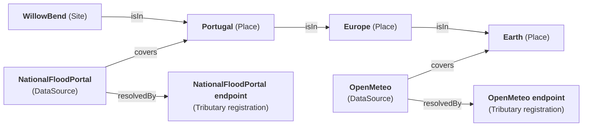

# Confluence

Confluence resolves a site against the outside world. Given a Site, it works out which data
sources cover that site, calls each one through Tributary with the site's coordinates, and
reports what did and did not resolve. The name is where tributaries meet: many Tributary
calls converging on one Site.

It runs **before** the analysis pipeline, never inside it. Discovery populates the Site;
the pipeline reads what discovery wrote. That keeps the pipeline a pure calculation graph
with no network dependency, so a planner adjusting an assumption reruns the analysis
instantly and without touching a public data portal again.

## Coverage is edges, not a word

A source declares where it applies by relating to a **Place** Thing, and a site relates to
the Place it sits in. Places nest, so a source covering a region covers every site within
it without naming any of them:



Both sources above cover `WillowBend`: one directly, one through the nesting.

**Why not a `coverage` string.** The failure this path exists to prevent is a source that
does cover the site being silently skipped because a country was written two ways —
`Portugal` against `PT`, or a difference in case. Matching strings is what causes that;
walking edges makes it impossible rather than merely reported. Adding a country becomes a
model edit with no deployment, and a reader can ask what else is true of a Place. This is
the repository's *things and relations, not strings* rule applied to the one place where
getting it wrong is invisible: a source that is never selected cannot appear in the
unresolved list either, because nothing knew to look for it.

## The three predicates

| Predicate | Reads | Why |
|---|---|---|
| `isIn` | `Site isIn Place`, `Place isIn Place` | Where the site is, and what contains that. Walked to any depth, so nesting can be as deep as a model wants. |
| `covers` | `DataSource covers Place` | Where a source applies. Several `covers` edges are fine; the source is still selected once. |
| `resolvedBy` | `DataSource resolvedBy Endpoint` | Which Tributary registration a call goes through. A relation, not a copied name, so renaming the registration cannot strand the source. |

A `DataSource` with no `resolvedBy` edge is **left out** rather than reported as a failure.
It is not a source that failed — it was never callable, and listing it as unresolved would
blame a provider for a gap in the model.

## Reading the model

One scoped snapshot answers everything: the site's Places, then every source whose coverage
reaches one of them, then those sources' registrations. Traverse rules compose over the set
built so far, so the walk must ask for `isIn` **first** — asking for the incoming `covers`
edges before the Places are in the set finds nothing. That is the same ordering trap the
Tributary endpoint kinds hit; see [`TRIBUTARY.md`](TRIBUTARY.md).

A failed read returns **502**, never an empty list. An unreachable gateway must not read as
"no source covers this site" — the two answers look identical to a caller and only one of
them is true.

## The run

`POST /handle { siteId }` resolves the site against every covering source and answers with both
halves:

```jsonc
{ "siteId": "…",
  "resolved":   ["OpenMeteo", "Copernicus"],
  "unresolved": [ { "source": "NationalFloodPortal",
                    "reason": "503: portal is down for maintenance" } ] }
```

**Partial failure is normal and is tolerated.** Public data portals go down, and an intake that
aborted because one provider was unavailable would be abandoned. A source that fails leaves its
value undiscovered, does not stop the others, and appears in `unresolved` with a reason — carrying
the provider's own words where there are any, because that is the most useful thing a planner can
be told about why a value is missing. Reporting what did *not* resolve matters as much as reporting
what did: a quietly short list is the failure of the tool being replaced.

**The site's own values go to every source.** Whatever the Site carries — coordinates, elevation,
climate zone — is passed as the address parameters of every call. A source's address takes only the
placeholders it names and the fetcher ignores the rest, so one set of values serves a source wanting
coordinates, one wanting elevation, and one wanting neither, with no per-source arrangement here.
Inherited values are left out: a value from an archetype is a default for a *kind* of site, and
calling a provider with a default location would return a confident reading about somewhere else.

**Bounds.** Sources resolve concurrently up to `--maxConcurrentSources`, so a site covered by many
sources cannot open a burst of connections that reads as abuse. Any one source is bounded by
`--sourceTimeoutSeconds`: a provider that accepts the connection and then goes quiet is more common
than one that refuses outright, and it must not hold up the run. A run cancelled by its caller is
never reported as a timeout — that would put a fabricated outage in front of a planner.

**Fetching is not done here.** Confluence asks Mycelium to forward each call to the endpoint service
named by `--fetcherSubdomain`, which resolves the registration, fills the address placeholders,
reshapes the response and writes the observation onto the Site. Which service fetches is
configuration rather than a name in code, so a deployment can point it elsewhere without editing
this service.

## Pointers

- [`TRIBUTARY.md`](TRIBUTARY.md) — the fetcher Confluence calls, its per-call address
  parameters, and how a reshape expression turns a response into an observation on the Site.
- [`LAND_INTAKE.md`](LAND_INTAKE.md) — the intake design this serves, and the model the
  Site, Parcel and DataSource archetypes sit in.
