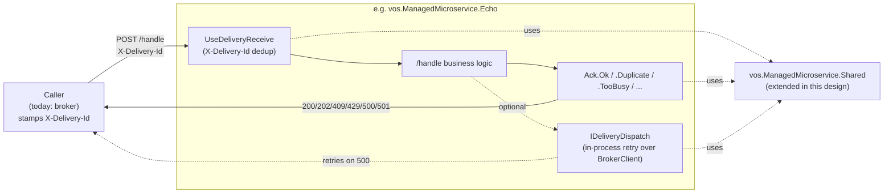

# Delivery — Hosting and Receive-Side Contract for VillageOS-API Microservices

> **Status:** Design proposal. No code yet. The surface described here
> lands inside the existing `vos.ManagedMicroservice.Shared` project — there is
> no new package. When implemented, this supersedes the bootstrap code
> samples in [`MICROSERVICE_GUIDE.md`](MICROSERVICE_GUIDE.md) — that doc
> remains the user-facing guide for writing services; this doc describes
> the framework they will sit on.

## 1. Context — why this doc exists

Every microservice in `VillageOS-API` today
(`vos.ManagedMicroservice.Echo`, `.Tributary`, `.Delta`,
`.Metabolism`) re-implements ~80 lines of host bootstrap, *and* none of
them implement an idempotent delivery contract on the receive side. That
is a real source of silent bugs:

- A caller that retries `POST /handle` with the same intent will register
  the same endpoint twice, produce duplicate observations, or start two
  simulations for one relationship — services cannot tell a retry from a
  fresh request.
- Services can only respond `200` or `500` in practice, with the
  occasional `400`/`404`/`502`. There is no way to express "this was a
  duplicate, do not retry", "I am overloaded, back off", or "I refuse this
  permanently — do not retry".
- The broker's `LivenessMonitor` polls `/health` every 15s and
  auto-deregisters after 3 consecutive failures (per
  `MICROSERVICE_GUIDE.md`). Today's services comply with the polling
  rhythm but not with the response envelope — Echo returns
  `requestsProcessed`, Tributary returns the bare minimum, Metabolism
  returns five fields. The monitor cannot rely on any field beyond
  `status`.
- Services that need to send follow-up work (e.g. Tributary posting
  ingested observations) do so synchronously via `BrokerClientBase` with
  no retry, no buffering, and no visibility into failures.

Bootstrap duplication and missing delivery semantics are the same problem
viewed from two angles: there is no shared place that says *"this is what
a VillageOS-API microservice is."*

## 2. The problem in one line

Every service reimplements its host and none of them speak an idempotent
delivery contract.

## 3. Recommendation — extend `vos.ManagedMicroservice.Shared`

> **Note on naming.** The project is currently named
> `vos.Microservice.Shared`. As part of this work it is renamed to
> `vos.ManagedMicroservice.Shared` so its name matches the consumers it
> exists to serve (`vos.ManagedMicroservice.Echo`, `.Tributary`,
> `.Delta`, `.Metabolism`). Throughout this doc the new
> name is used. The rename is the first step in §6.

`vos.ManagedMicroservice.Shared` (post-rename) already contains
`BrokerClientBase.cs` plus two small validators (`HttpMethodValidator`,
`RequiredPropertyValidator`), and is referenced by every
`vos.ManagedMicroservice.*` project. That makes it the natural home for
the rest of the per-service plumbing: nothing to migrate (every service
already references it), one package to version, and one place where the
rule "if all microservices need it, it lives here" applies.

A new namespace inside the project — `vos.ManagedMicroservice.Shared.Delivery` —
groups the new surface; the existing files (`BrokerClientBase`,
validators) stay where they are (with their namespace updated to match
the project rename).

### 3.1 What gets added

| Concern | Today (per-service) | After |
|---|---|---|
| CLI parsing (port / brokerUrl / token / signingKey) | 4× duplicated `Configuration/CliArgs.cs` | `MicroserviceCliArgs` base record + `CliArgsParser.Parse<T>(args)`; services extend for service-specific flags |
| Serilog file sink + enrichment | 4× duplicated 12-line block | `builder.AddMicroserviceLogging("ServiceName")` |
| JWT auth (`AddBrokerTokenAuth` + `UseAuthentication` + `RequireAuthorization` gating) | 4× duplicated 20-line block | `builder.AddMicroserviceAuth(signingKey)` + `endpoint.RequireBrokerAuth()` (no-op when signingKey absent) |
| `/health`, `/shutdown` endpoints | Each service hand-rolls; shapes drift | `app.MapStandardEndpoints(serviceName, healthExtras: …)` |
| `RegisterAsync` / `DeregisterAsync` lifecycle | Echo only; pattern hand-rolled | `app.UseBrokerLifecycle(serviceName, startCommand)` |
| In-flight request draining on shutdown | Not implemented anywhere | Built into `UseBrokerLifecycle`'s stopping hook |
| Idempotent `X-Delivery-Id` dedup | Not implemented anywhere | `app.UseDeliveryReceive()` middleware + `IDeliveryReceiveCache` |
| ACK status semantics (200/202/409/429/500/501) | Returned ad-hoc as 200/400/500 | `Ack.Ok / Accepted / Duplicate / TooBusy / Failed / Refused` helpers |
| Outbound dispatch with retry | None — pure synchronous broker calls | `IDeliveryDispatch` facade with bounded retry-and-backoff |

### 3.2 What stays per-service

- The actual `/handle` body and business logic. The shared project does
  **not** ship a base "do my work" class — every service's domain is too
  different (Echo reads raw bytes; Tributary calls JSONata;
  Delta walks the broker model; Metabolism runs background
  loops).
- The concrete `BrokerClient` subclass per service. The base
  (`BrokerClientBase`) already lives here; concrete subclasses with
  service-specific calls (`CreateThingAsync`, `ApplyQuantityAsync`, …)
  stay in their own projects.
- Service-specific CLI flags. Metabolism's `--mode=consumes|produces`
  stays in `Metabolism/Configuration/MetabolismCliArgs.cs` as a record
  extending `MicroserviceCliArgs`.

### 3.3 The ACK contract — codified here

Six semantic ACK kinds with fixed HTTP status codes, exposed as typed
result builders so services cannot accidentally return the wrong code:

```csharp
// Sketch — exact shape for the implementing work item
public static class Ack
{
    public static IResult Ok(object? payload = null);          // 200 — processed
    public static IResult Accepted(object? payload = null);    // 202 — accepted async
    public static IResult Duplicate(Guid deliveryId);          // 409 — idempotent replay; do not retry
    public static IResult TooBusy(int retryAfterSeconds);      // 429 — back off
    public static IResult Failed(string detail);               // 500 — transient; caller may retry
    public static IResult Refused(string reason);              // 501 — permanent; do not retry
}
```

Callers (today: the broker) interpret the codes per the contract:

| Code | Meaning | Caller behaviour |
|---|---|---|
| 200 / 202 | Success / accepted async | Done. |
| 409 | Idempotent replay — same `X-Delivery-Id` already processed | Treat as success; do not retry. |
| 429 | Throttled — service is at capacity | Back off `Retry-After` seconds, then retry. |
| 500 | Transient failure | Retry per caller's retry policy. |
| 501 | Permanent refusal — request is malformed or not supported | Do not retry; surface as a permanent failure. |

This contract is owned by the shared project — it is *what microservices
promise to mean*. Any future caller (admin tools, test harnesses, a
hypothetical future dispatcher) opts in by following it.

### 3.4 Receive-side dedup — `UseDeliveryReceive`

A middleware sits before the routing pipeline:

1. Read `X-Delivery-Id` header (a `Guid`). If absent, pass through —
   un-tracked legacy callers still work *only if* the route has not
   opted in via `RequireDeliveryId()`. Once a route opts in, missing
   headers become `400`.
2. Look up the id in `IDeliveryReceiveCache` (default: in-memory LRU,
   configurable size + TTL via `DeliveryReceiveOptions`).
3. **Hit:** return the cached response immediately (status code preserved
   as the original answer). The retry sees the same answer the original
   got. Counter `dedupedRequests++`.
4. **Miss:** invoke the pipeline, capture the response, cache it keyed by
   delivery id.

Per project rule (no backward-compat shims), once the broker side starts
stamping `X-Delivery-Id` consistently, `RequireDeliveryId()` becomes the
default on every route in the same PR — the legacy "no header →
pass-through" path is removed at that point.

### 3.5 In-flight draining on shutdown

`UseBrokerLifecycle`'s `ApplicationStopping` hook does, in order:

1. Calls `DeregisterAsync` on the broker so no new traffic arrives.
2. Waits up to a configurable budget (default 5s) for in-flight `/handle`
   invocations to complete.
3. After the budget, returns `503 Service Unavailable` to anything still
   pending so the caller can dead-letter cleanly rather than hanging.
4. Finally calls `lifetime.StopApplication()`.

The current per-service `/shutdown` endpoint becomes a thin caller that
invokes the same drain path, so admin-initiated shutdown and pod
termination behave identically. This is also what the broker's
`DaemonLifecycleManager` (referenced in `MICROSERVICE_GUIDE.md`)
already expects.

### 3.6 Outbound dispatch — `IDeliveryDispatch`

For services that emit follow-up messages (e.g. Tributary posting
ingested observations, a future audit service fanning out events), expose
a thin facade:

```csharp
public interface IDeliveryDispatch
{
    Task EnqueueAsync(string targetServiceName, object payload, CancellationToken ct);
}
```

**v1 implementation:** in-process queue with bounded retry-and-backoff
over `BrokerClientBase`. No persistence; if the service crashes, anything
not yet delivered is lost — same guarantee as the synchronous calls
services make today, but with retries for transient failures.

**Future (only if a real need surfaces):** a persistent variant of the
queue (file-backed or LiteDB) lands as a second `IDeliveryDispatch`
implementation in the same project. Service code does not change; DI
registration picks the variant.

### 3.7 DI surface — the whole adoption diff

A microservice's `Program.cs` after adoption:

```csharp
// Sketch — the goal is "every microservice looks like this"
var args = MicroserviceCliArgs.Parse<MyArgs>(rawArgs)
    ?? Environment.Exit(1);

var builder = WebApplication.CreateBuilder(rawArgs)
    .AddMicroserviceLogging(serviceName: "MyService")
    .AddMicroserviceAuth(args.SigningKey)
    .AddMicroserviceBrokerClient<MyBrokerClient>(args);

var app = builder.Build()
    .UseBrokerAuth()
    .UseDeliveryReceive()
    .UseBrokerLifecycle(serviceName: "MyService", startCommand: "endpoint-service");

app.MapStandardEndpoints("MyService");

app.MapPost("/handle", async (MyRequest req, MyBrokerClient broker) =>
    await MyService.HandleAsync(req, broker))
   .RequireBrokerAuth()
   .RequireDeliveryId();

app.Run();
```

Compared to today's ~80-line bootstrap, that's roughly 12 lines and the
delivery contract is satisfied for free.

## 4. Why this lives in `vos.ManagedMicroservice.Shared` rather than a new package

- Every `vos.ManagedMicroservice.*` project already references
  `vos.ManagedMicroservice.Shared`. Zero migration friction — no
  `.csproj` reference swaps.
- Total surface stays modest (~700–900 LOC of new code spread across
  middleware, lifecycle, ACK helpers, CLI parser, dedup cache).
  Comfortably small enough that a separate package is overhead, not
  separation.
- One package to version, one to test, one to document. The rule is
  simple: *"if every microservice needs it, it lives in
  `vos.ManagedMicroservice.Shared`."*
- The new `vos.ManagedMicroservice.Shared.Delivery` namespace inside the project
  is enough boundary — the existing files (`BrokerClientBase`,
  validators) keep their current namespaces and are unaffected.

The trade-off: the package surface roughly triples. That is the right
trade for the savings in friction and ceremony.

## 5. Rejected alternative — base class for services

A `MicroserviceProgramBase` with
`protected abstract Task<IResult> HandleAsync(...)` and a `Run()` that
wires everything.

**Why rejected:** ASP.NET Core minimal-host idioms are explicitly *not*
inheritance-based. Forcing services into a class hierarchy fights the
framework, complicates DI registration, and makes the per-service
`/handle` signature inflexible (Echo reads raw bytes; Metabolism takes a
record; Tributary takes a different record). Extension methods
compose; inheritance would force a single shape on everyone. Recorded
here so future readers know it was considered.

## 6. Migration

Per the no-backward-compatibility rule, atomic per-service PRs.

| Phase | What happens | Verifies |
|---|---|---|
| 0 | Rename the project from `vos.Microservice.Shared` to `vos.ManagedMicroservice.Shared`: rename folder, `.csproj`, root namespace; update every `using vos.Microservice.Shared…` and every `<ProjectReference>` in the four `vos.ManagedMicroservice.*` projects, the four matching test projects, and the solution file. No behaviour change. | `dotnet build VillageOS-API.sln` clean; `dotnet test` green; `git grep -i "vos\.Microservice\.Shared"` returns no hits. |
| A | Add the new namespace `vos.ManagedMicroservice.Shared.Delivery` with bootstrap extensions, ACK helpers, dedup middleware, `MicroserviceCliArgs`. No service consumes it yet. | `dotnet build` clean; new unit tests for `Ack.*` and the dedup middleware pass. |
| B | Migrate Echo (smallest, also the only one that already does lifecycle). Echo's `Program.cs` shrinks to the §3.7 shape. Echo's `Configuration/CliArgs.cs` is deleted. Update `MICROSERVICE_GUIDE.md` code samples in the same PR — the doc must not describe a half-truth. | Existing Echo tests pass; new test asserts duplicate `X-Delivery-Id` returns the cached body. `MICROSERVICE_GUIDE.md` builds cleanly. |
| C | Migrate Delta, Tributary, Metabolism — one PR each. Each PR also lands the §3.3 ACK status codes for that service's failure modes (e.g. Delta returns `409` when the requested endpoint thing already exists; Metabolism returns `429` when at simulation cap). | Per-service tests updated. |
| D | `IDeliveryDispatch` lands when a service first needs it (likely Tributary's observation-ingest path). v1 in-process retry implementation. | Contract tests for retry-on-500, no-retry-on-501, no-retry-on-409. |
| E | (Optional, future) Persistent `IDeliveryDispatch` variant if a real durability requirement appears. | New impl passes the same contract tests as v1 plus a crash-recovery test. |

## 7. Cross-repo and dependency posture

VillageOS and VillageOS-API are sibling repos with **independent CI
pipelines** and **no cross-repo project references** today. Everything in
this design lives in `vos.ManagedMicroservice.Shared` inside VillageOS-API and
consumes nothing from VillageOS at build time, today or in any planned
phase.

## 8. Observability — health endpoint envelope

Health endpoint composes a fixed envelope with optional service extras —
matching the 15s polling rhythm and 3-strike failure tolerance documented
in `MICROSERVICE_GUIDE.md` §"Health Monitoring & Auto-Deregistration":

```jsonc
{
  "status": "Healthy",                  // shared — only field LivenessMonitor reads
  "service": "Echo",                    // shared — from serviceName
  "uptimeSeconds": 1234,                // shared
  "requestsReceived": 42,               // shared — incremented by middleware
  "dedupedRequests": 3,                 // shared — from receive cache
  "lastRequestUtc": "2026-05-12T...",   // shared
  "extras": { "activeSimulations": 7 }  // service-supplied callback
}
```

This stops the current shape drift across services (Echo, Tributary,
Delta, and Metabolism each return a different shape today)
and gives the broker's monitor a single shape to scrape — without
breaking the existing `LivenessMonitor`, which only reads `status`.

## 9. Sequence at a glance



## 10. Tests the shared project must ship

- `Ack.*` returns the correct status code, content type, and body shape
  for each of the six ACK kinds.
- `UseDeliveryReceive`: missing header → pass-through (during migration);
  with header & cache miss → invokes pipeline & caches; with header &
  cache hit → returns cached response without invoking pipeline; cache
  honors LRU eviction at configured size; cache honors TTL.
- `RequireDeliveryId()`: returns `400` when header is absent.
- `UseBrokerLifecycle` startup: calls `RegisterAsync`; logs registration
  result.
- `UseBrokerLifecycle` shutdown: calls `DeregisterAsync`; waits for
  in-flight requests; forces `503` past the drain budget; calls
  `StopApplication`.
- `MapStandardEndpoints`: `/health` returns the §8 shape with service
  extras merged in; `/shutdown` triggers the same drain path as pod
  termination.
- `MicroserviceCliArgs.Parse<T>`: validates required flags; rejects bad
  ports; honors service-specific subclass flags (test fixture: a
  `--mode` flag via a `MetabolismCliArgs` subclass).
- `IDeliveryDispatch` (when Phase D lands): retries on `500`, gives up
  on `501`, treats `409` as success.

## 11. Open questions

1. **Receive-side dedup cache pluggability.** In-memory only is fine for
   now (single-process services). Pluggable `IDeliveryReceiveCache` is
   planned but the only adapter shipped in v1 is in-memory LRU.
2. **`/stats` endpoint.** Echo and Metabolism have it; Tributary and
   Delta don't. Drop it from the standard set, or fold it
   into `/health` as `extras`? Recommendation: fold; one less surface.
3. **Cross-service shared `BrokerClient`?** Each service's `BrokerClient`
   today extends `BrokerClientBase` with service-specific calls
   (`CreateThingAsync`, `ApplyQuantityAsync`, …). This design does not
   try to unify these — that's a separate refactor.
4. **When (if ever) does Phase E land?** Persistent outbound queue is
   only worth building if a real durability requirement surfaces. Until
   then, in-process retry is enough. Don't build it speculatively.

## 12. Linked work

This proposal needs a **Feature** work item in Azure Boards before any
code lands. Discussion thread captures: §4 (why it lives in Shared), §5
(rejected base-class alternative), and §11 open questions.

Each migration phase in §6 is a **child Bug or Feature** with its own
Test Cases. Test Case Steps must be populated.
