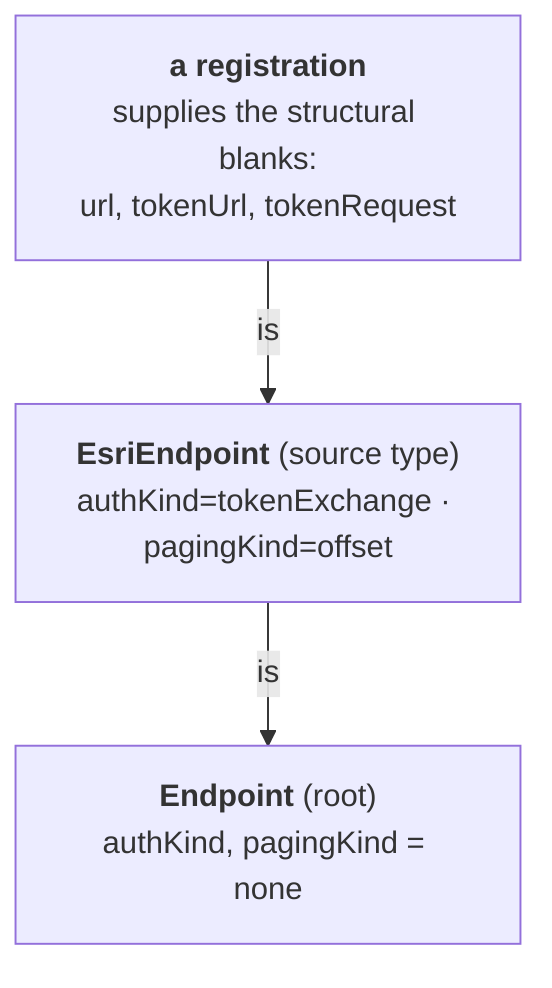

# Delta

Delta is VillageOS's **endpoint-registration service**. It owns two jobs around the
endpoint-template catalog that [Tributary](TRIBUTARY.md) fetches against:

1. **Provision** the endpoint-template catalog into Mycelium at startup — find-or-create
   every template Thing and wire its `is` inheritance edges.
2. **Register** individual endpoints on demand — validate an incoming endpoint against the
   template graph, create the Thing, attach it to its template with an `is` relationship, and
   set its properties.

Delta is the **write/validate** side of the endpoint story; Tributary is the **runtime fetch**
side. Delta decides *what a valid endpoint is and provisions it*; Tributary later *resolves that
endpoint's effective properties and calls it*. Neither contains per-source (ESRI/OAuth/…) code —
a source is expressed entirely as template + registration data. `SERVICES.md` §1 lists
Delta as one of the .NET services; this page is its canonical reference.

## The endpoint-template graph

Endpoints are not free-form. They are governed by a **single-rooted template hierarchy** rooted
at `Endpoint`, where inheritance is expressed model-natively as `is` relationships
(`EsriEndpoint is Endpoint`), never a scalar field. A registration nominates a template via its
own `is` relationship (or defaults to the root); its admissible properties are the **union of
property keys along that template's chain**, and a property's effective value is
**closest-ancestor-wins**.



Delta loads this graph from a `seed.json` document (`EndpointSeedModel` — a `Things[]` +
`Relationships[]` fragment) and builds an `EndpointSeedGraph`. The graph is the same shape
Tributary reads; see [`TRIBUTARY.md`](TRIBUTARY.md) for the `EsriEndpoint` template and the
property-field taxonomy.

### Graph validation — fail fast at boot

`EndpointSeedGraph.Build` validates what Mycelium does **not**, so a misconfigured deployment
fails at boot rather than corrupting the model or stack-overflowing Mycelium's cycle-unsafe
effective-property traversal. Construction throws if the seed graph:

- has no things, or a thing with an empty name;
- has a **duplicate** template name;
- has a relationship referencing an **unknown** template;
- has a template that declares **more than one `is` parent**;
- has **no root** (every template declares `is`) or **more than one root**;
- contains a **cycle**.

An invalid graph throws inside `LoadGraph()` during `app.Build()` wiring — Delta does not start.

## Startup: provisioning the catalog

On `ApplicationStarted`, `TemplateCatalogProvisioner.ProvisionAsync` reflects the seed graph into
Mycelium so registrations never have to create templates lazily. It is **idempotent** by
find-or-create by name:

1. Resolve the `is` predicate Thing (a model primitive — never created; if missing, provisioning
   logs and aborts).
2. Order templates **root-first** (ascending chain length is a valid topological order, so a
   parent is always provisioned before its children).
3. For each template: if a Thing with that name already exists, reuse it; otherwise create it and
   — only for the newly-created Thing — wire its `is` edge to its parent, then write the keys it
   narrows.

**Why a narrowed key is written last.** A template usually restates keys its parent already
declares, with a tighter value (`EsriEndpoint` narrowing `Endpoint`'s `requestContentType`). The
order those two writes happen in decides how Mycelium stores the result:

| Order | What Mycelium stores | Result |
|---|---|---|
| Property first, `is` after | An **own** property — the name was not yet inherited when it was written | The template owns a name it also inherits. The platform forbids that (invariant I1/I2), and the key surfaces **twice** in every descendant's resolved view |
| `is` first, property after | An **override** — the name resolves as inherited, so the write materializes a per-instance override | One key in the resolved view, holding the narrowed value |

So the provisioner splits a template's seed properties: keys no ancestor declares are carried on
the create, and keys some ancestor declares are written after the `is` edge exists. The root
template inherits nothing, so all of its properties stay on the create.

> **Known gap.** If a template Thing was created on a prior run but its `is` edge failed, a later
> run finds the Thing and cannot repair the missing edge — there is no Mycelium relationship-query
> API to detect it. The same run leaves that template's narrowed keys unwritten, so it silently
> keeps the parent's values. Tracked in the code comment on `TemplateCatalogProvisioner`.

Provisioning is best-effort startup work (Mycelium's liveness monitor covers an unusable model)
and is **skipped under the `Testing` environment** so tests make no Mycelium calls at boot.

## Registration: `POST /handle` and `POST /register`

Both routes share one handler. The request body is a `RegisterEndpointRequest` — a Thing-create
shape: a `name`, a flat `properties` bag, and optional `relationships` (where an `is` row names
the template the endpoint descends from; absent → the root `Endpoint`).

```jsonc
POST /handle
{
  "name": "county-parcels",
  "properties": { "url": "https://gis.example.gov/arcgis/rest/…", "httpMethod": "GET" },
  "relationships": [ { "subject": "county-parcels", "predicate": "is", "target": "EsriEndpoint" } ]
}
```

The handler validates, then commits, in this order:

**Validate**
- `name` non-empty and `properties` present (else `400`).
- At most one `is` relationship for the subject (else `400`).
- The named template (or the root, if no `is`) must exist in the graph — i.e. descend from the
  root (else `400`).
- The `is` predicate Thing must exist in Mycelium (else `500`).
- Property keys must be a subset of the template chain's **allowed keys** (else `400` listing the
  unsupported keys).
- `url` must be a non-empty, **absolute** URI (else `400`).
- **Effective** `httpMethod` — the request value, else the closest-ancestor seed value — must be
  present and a supported method (else `400`).
- The template's Thing must already be provisioned in Mycelium (else `500`).

**Commit (with compensation)**
- Create the endpoint Thing.
- Create its `is` relationship to the template Thing. *(Mycelium awaits the `is`-handler
  synchronously, so inherited properties exist once this returns.)*
- Set each **user-supplied** property. Inherited values are **not** materialized — they resolve
  live through the `is`-chain.

If the `is`-wire or any property-set fails, Delta runs a **compensating delete** (`CompensateAsync`)
to remove the orphaned Thing, so a partial registration never lingers. Success returns the new
`registeredThingId`, `endpointTemplateId`, and `predicateId`.

> **Single active model.** Writes target whichever model Delta's `--token` is scoped to. `/handle`
> does not yet propagate a caller-specified model, so per-model routing is deferred (Feature #5478).

## Endpoints

| Route | Purpose |
|---|---|
| `POST /handle` | Register an endpoint (relationship-service dispatch entry point). |
| `POST /register` | Same handler as `/handle` (direct alias). |
| `GET /health` | `{ "status": "Healthy", "service": "Delta" }`. |
| `POST /shutdown` | Graceful stop after a short delay. |

When `--signingKey` is supplied, `/handle`, `/register`, and `/shutdown` require a valid Mycelium
JWT; `/health` stays open. Delta does not expose a `/stats` endpoint today (noted in
[`SERVICE_HOST_ROADMAP.md`](SERVICE_HOST_ROADMAP.md)).

## CLI & configuration

Delta takes the **standard six flags** (see [`SERVICES.md`](SERVICES.md) §4):

```bash
dotnet run -- --port=<port> --myceliumUrl=<url> \
  [--token=<jwt>] [--signingKey=<base64>] [--issuer=<iss>] [--audience=<aud>]
```

`--issuer` / `--audience` must match what Mycelium signed with, or `/handle` auth rejects valid
tokens. Any flag absent from the command line falls back to configuration and the environment under
its Pascal-case name — `Port`, `MyceliumUrl`, `Token`, `SigningKey`, `Issuer`, `Audience` — so Delta
can be launched with no flags at all. A flag always wins over configuration. This is the shared
behaviour every service now has; see `vos.Service.Shared/Configuration/ServiceLaunchSettings.cs`.

## Seed loading

`FileEndpointSeedProvider` (via `EndpointSeedLoader`) loads the first existing `seed.json` from
three candidate paths — the bin output, the current working directory, and the canonical
three-up path relative to a built binary — and builds the validated `EndpointSeedGraph` from it.
A parse failure or a graph-validation failure aborts boot.

## Source & tests

- Registration handler + lifecycle: `vos.Service.Delta/Program.cs`.
- Graph model + validation: `vos.Service.Delta/Models/EndpointSeedGraph.cs`.
- Startup provisioning: `vos.Service.Delta/Services/TemplateCatalogProvisioner.cs`.
- Mycelium client (Thing/relationship CRUD): `vos.Service.Delta/Services/MyceliumClient.cs`.
- Seed loading: `vos.Service.Delta/Helpers/EndpointSeedLoader.cs`,
  `Services/FileEndpointSeedProvider.cs`.
- Launch settings: `vos.Service.Shared/Configuration/ServiceLaunchSettings.cs` (shared).
- Tests: `Tests/vos.Service.Delta.Tests/` (`RegisterEndpointTests`,
  `TemplateCatalogProvisionerTests`, `EndpointSeedGraph*Tests`, `EsriEndpointTemplateTests`,
  `CompensateAsyncTests`, …).
