# The VillageOS Field Guide

> **What VillageOS is, why it is built the way it is, and how to install and use every part of it.**
> It is written for anyone who meets the platform — a landowner, a planner, an investor, an
> operator, a modeller or an engineer — in plain words. It describes the platform as it is today.

<sub>VillageOS is made by ReGen Villages BV. This guide belongs to the public VillageOS-API
repository, beside the console, the command line and the services it describes.</sub>

## How to read this

Find yourself in the left column and read the parts on the right. Every part stands on its own.

| You are | Read | You will come away knowing |
| --- | --- | --- |
| Meeting the platform for the first time | Part I | What it is, the three ideas it rests on, and the words it uses |
| A decision-maker, investor, planner or consultant | Parts I and II | What it does for a project, with a worked example, and what a project sets up without writing any code |
| Curious how it keeps everything judged and up to date | Parts III and IV | The model, and the engine that re-judges every value the moment anything changes |
| An engineer extending it | Parts V, VI and IX | Services in any programming language, pipelines of services drawn on a canvas, and the inside of the console with the page-authoring contract |
| A person who will use it day to day | Part VII | The web console page by page, the command line command by command, land intake, dashboards, and what to do when something looks wrong |
| The person installing and running it | Part VIII | What you need, the first start, giving it a model, serving it to people, and keeping it safe |

## Contents

- Part I — The idea
- Part II — What it does for a project
- Part III — The model
- Part IV — How every change is judged
- Part V — Services: relationships that do work
- Part VI — Pipelines
- Part VII — Using it day to day
- Part VIII — Installing and running it
- Part IX — Inside the console
- Appendix A — Glossary
- Appendix B — The criteria language on one page
- Appendix C — The guides beside this one

Chapters are numbered straight through, so a chapter can be named from anywhere.

---

## Part I — The idea

*For everyone. No technical background needed.*

### 1. In one paragraph
A modern village, campus or building is a web of moving parts. Energy, water, food, waste,
materials, money and the people who use them all change every hour. Most software captures a
snapshot of *now*, and only one of those parts at a time. **VillageOS keeps the whole picture and
its entire history, judges it continuously against the goals you set, and lets the same model that
describes a place be run forward in time by simulation services.** One foundation does the work
usually split across a database of connected records, a store of readings over time, a simulation
tool and a design suite.

### 2. The problem it solves
Four kinds of tool each solve part of the problem, and a project that uses all four spends its time
stitching them together.

| Tool | What it keeps | What it loses |
| --- | --- | --- |
| A database of connected records | How things connect | History. It knows what is true now, not what was true last spring |
| A store of readings over time | Readings, by the second | Connections. A reading is an orphaned number with no building, no system and no goal behind it |
| A simulation platform | How a system behaves | A shared record. The simulated place and the real place are described in two different ways |
| A building design tool | The building as designed | Everything after handover. The model is stranded in a design file |

VillageOS unites the four on one foundation, so history, connections, judgement and simulation are
the *same* system rather than four integrations to maintain. Two rules make that possible, and
every chapter of this guide comes back to them:

- **Nothing is ever silently overwritten or lost.** Every value and every relationship keeps its
  full history, so "how did we get here?" always has an answer.
- **The platform stays small and general.** The specifics of any domain live in the model and in
  small plug-in services, never in the core. That is why it can grow from one sensor to a whole
  village without becoming a tangle.

### 3. Three ideas, and everything else assembled from them
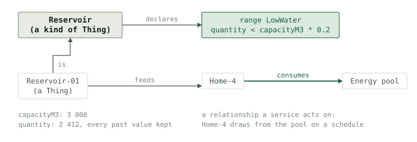

1. **A Thing.** Any entity, from a single sensor to a whole village. A building, a pump, a soil
   probe, a data source, a study, even a *kind* of thing such as "reservoir" — all are Things.
   There are no tables and no classes. A kind is simply a Thing that other Things point to.
2. **A relationship that does work.** A relationship is a named link between two Things:
   *Reservoir-01 feeds Home-4*. The name in the middle is the **predicate**. Most predicates only
   describe structure. Some *do* something: when a home *consumes* from an energy pool, a small
   service wakes up and runs the consumption. Each behaviour is a separate, swappable service that
   can be written in almost any programming language.
3. **A range that judges.** A target, or a healthy band, that a value should stay inside. The
   instant a value drifts outside it, the platform reacts. It does not matter whether the value
   came from a simulation or from a real meter.

Only one predicate is built into the platform: `is`, which says a Thing is a kind of another Thing
and lets it inherit that kind's values and ranges. Every other predicate is data in the model, and
any of them can be bound to a service.

### 4. Two kinds of knowledge
The platform records two different sorts of claim, and keeps them apart because they have
different jobs.

| | A Fact | An Observation |
| --- | --- | --- |
| What it is | A statement that holds until it is withdrawn: this Thing exists, this relationship exists, this parcel is 24 hectares | A value sampled at one instant: the reservoir held 2,412 cubic metres at 14:29 |
| Who writes it | People, importers, and services correcting what they know | Sensors, simulations, fetched data |
| How fast it arrives | At human pace | At machine pace, sometimes thousands a second |
| What it can change | Structure and values | Values only. An Observation can never create or remove a Thing |
| How it is kept | Written to disk before the writer is answered, and never lost | Accepted, queued and written in batches; how much is kept is decided per value |

A planner's statement that a parcel is 24 hectares and a weather service's report of 820
millimetres of rain a year are genuinely different sorts of claim. The platform records which is
which, and a page can say where every figure came from.

### 5. Time is built in
Every value and every relationship carries its history. You can ask what a reservoir held on any
past afternoon, how a property changed between two dates, or what the whole model looked like at a
given moment. Nothing is overwritten: a new value is laid down beside the old one, and a deletion is
recorded as a deletion rather than an erasure. A restart rebuilds the model from that record, so
the answer to "what was true then" is the same before and after one.

### 6. How one change travels
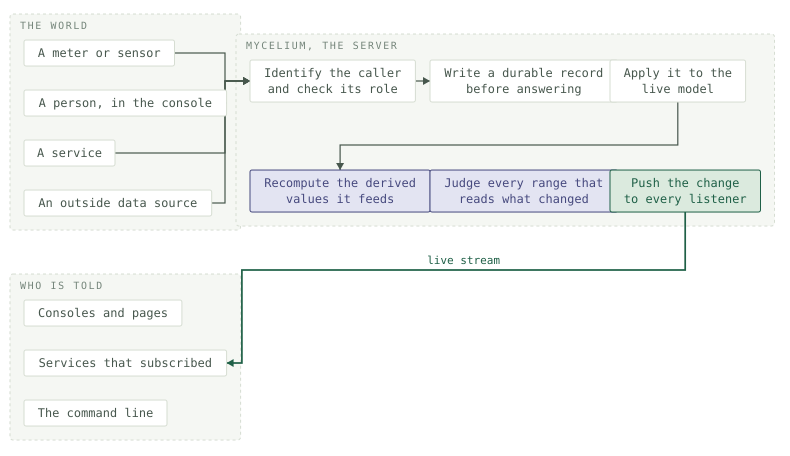

Every piece of information follows the same path, whether it is a temperature, a water level, a
figure typed by a planner or a wall in a building model:

1. **The world produces a change** — a meter, a person in the console, a service, an outside data
   source.
2. **The server identifies the caller** and checks that its role allows the change.
3. **The change is written to a durable record** — for a Fact, before the caller is answered.
4. **The live model is updated.** This is what answers every question about "now".
5. **Derived values are recomputed** — totals and formulas that read what changed.
6. **Every range that reads what changed is judged again**, and anything that starts or stops
   holding changes the Thing's state.
7. **The change is pushed live** to every console, page, command line and service that subscribed.

Part IV walks through steps 5 and 6 in detail, because they are what make the platform *reactive*
rather than a place where data sits.

### 7. One loop, from design to operation
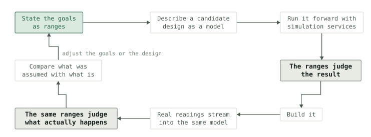

The platform is shaped around one loop. Before a place exists, its goals are stated as ranges, a
candidate design is described as a model, simulation services run it forward, and the ranges judge
the result. Once it is built, real readings stream into the same model, the same ranges judge
them, and the design assumptions can be checked against what actually happened. The thing you
simulated and the thing you operate are described in exactly the same way, so what is learned on
one side flows to the other.

### 8. The names, and why they come from a forest
The platform's parts are named for living systems, because each name says what the part does
better than a technical label would.

| Name | What it is | The picture |
| --- | --- | --- |
| **Mycelium** | The server. It holds the models, answers every request, identifies every caller, and starts and supervises the services | The underground network that connects everything |
| **Trellis** | The web console | The lattice that gives growth a shape you can see and climb |
| **Taproot** | The command line | Direct, deep access straight to the ground |
| **Hyphae** | The reactive engine inside the server, which carries a change through every range that depends on it | The threads along which signals travel through a mycelium |
| **Rings** | The store of every value over time, in three layers: the last minutes in memory, recent months on disk, and the long past in a cold archive | Growth rings: one layer per period, the oldest at the centre |
| **Metabolism** | The service that simulates consumption and production | What a living thing does with what it takes in |
| **Delta** and **Tributary** | The catalogue of outside data sources, and the fetcher that calls one | Channels that bring water in without changing it |
| **Forage** | The service that looks a site up in every source that covers it | Going out to find what the surroundings hold |
| **Phloem** | The orchestrator that runs a pipeline of services drawn on a canvas | The tissue that routes a plant's products from source to sink |
| **Xylem** | The service that takes a building model file and raises it into the model | The tissue that carries water up from the roots |
| **Intake** | The service that takes a description of a piece of land from a member of the public | Kept plain: it is the one door a stranger comes through |

A **seed** is the file a model is first planted from. A **fragment** is a partial model added to a
live one. Both words are used throughout this guide.

---

## Part II — What it does for a project

*For decision-makers, investors, planners and consultants.*

### 9. From a piece of land to a living village
Someone owns a piece of land and wonders whether a regenerative village could work on it.
Answering that means knowing where the land is, how big it is, what the site's climate and hazards
are, and whether the land can plausibly feed, water and power the people you would put on it. The
platform answers it in three phases, each of which can be re-run on its own.

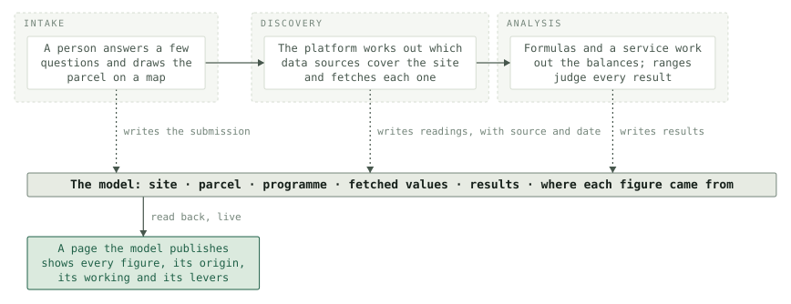

**Intake.** A planner fills in five steps in the console, or a member of the public fills in the
same steps on a public website: the project, a contact, the location, the size and the programme
(how the land divides between homes, growing, restoration, commerce, community and transport), and
the parcel boundary drawn on a map. The submission becomes Things in the model at once: a Site, a
Parcel with its boundary and a record of how the boundary was obtained, the programme as shares of
the parcel, and a Study that will hold the results. A public submission is accepted only from
somebody who answered a code sent to the email address on it, and waits on a review page for a
planner to reject it or promote it into a project of its own.

**Discovery.** The platform works out which open data sources cover the site — by walking the
places the site sits in, never by matching a country name — and calls each one with the site's
coordinates: rainfall, sunlight, a climate classification, elevation, hazard gradings, and ten
years of hourly climate history. Every fetched value is recorded as an Observation with its source
and the date it was fetched, so it can never be mistaken for something a person typed.

**Analysis.** The study inherits the physical assumptions that belong to the technology, such as
what a solar panel delivers per square metre and what one person drinks in a year, and works out
the balances from the site's own figures: how much land each part of the programme takes, how much
energy the site generates against what it consumes, how many days of water it holds in reserve,
how many people its growing land could feed, and how far the rain it captures goes towards each
demand on it. Each balance has three verdicts, so a site nobody has assessed reads as *not
assessed*, never as *failed*.

**The dashboard.** A page the model itself publishes shows every figure with where it came from,
how it was worked out, and what would move it. A shortfall names the levers: raise this input, or
lower that one.

Everything — the answers, the fetched values, the results and the origin of each — lives in the
model and keeps its history. Adjusting an assumption changes one value, and every balance that
depends on it recomputes on its own, without calling a public data portal again.

### 10. A worked example
Alder Hollow is an invented site, but every rule in the example is the platform's. Its building
model carries the solar arrays and wind turbines; everything the model does not hold is declared as
an assumption, in the open, on the study, where a reader can see it and a planner can change it.

| Input | Where it comes from | Value |
| --- | --- | --- |
| Solar array area | Summed live from the building model's panels | 9,400 m² |
| Solar resource | Assumption: sunlight on a tilted surface at this latitude | 1,600 kWh per m² a year |
| Panel efficiency × system losses | Two assumptions: what the panel delivers, and what is lost between panel and meter | 0.17 × 0.77 |
| Wind generation | Summed from the model's turbines at an assumed yield per turbine | 10 turbines × 8 MWh = 80 MWh a year |
| Annual consumption | Assumption: an all-electric settlement at 3.5 MWh per resident | 3,150 MWh a year |
| Population | Assumption | 900 |
| Water per person | Assumption: 150 litres a day | 55 m³ a year |
| Emergency water storage | Assumption, sized for the residents | 3,000 m³ |
| Parcel | Site data | 120 hectares, with a programme of six shares summing to 100 |
| Rainfall | Fetched by discovery, recorded with its source and date | 820 mm a year |

What the model works out from those, and how it judges the result:

| Quantity | Working | Result |
| --- | --- | --- |
| Solar generation | 9,400 × 1,600 × (0.17 × 0.77) ÷ 1,000 | 1,968.7 MWh a year |
| Total generation | solar + wind | 2,048.7 MWh a year |
| Share of consumption | 2,048.7 ÷ 3,150 | 65%, so **short of the energy target** |
| Daily drinking water | 900 × 55 ÷ 365 | 135.6 m³ a day |
| Days of supply | 3,000 ÷ 135.6 | 22.1 days, so **water resilient** (the target is 14) |
| Rain captured | built area × rainfall | served to each water demand in turn: drinking water first, irrigation from what is left |

Two things about the example are the point. **Solar output takes two factors, not one.** Panel
efficiency is measured at the panel under test conditions; the second factor is everything lost
between panel and meter. Keeping them separate makes leaving the losses out a visible omission
rather than a plausible number. **The shortfall is a real result about the site as modelled, not a
defect.** Closing it is a design decision: more array area, less assumed consumption, or more firm
generation. The dashboard names those levers beside the figure, and a planner who changes one sees
every dependent figure move.

### 11. What a project configures without writing code
Almost everything a project differs by is data in its model, not code in the platform. A
consultant configuring a project edits the model and deploys nothing.

| What varies by project | Where it lives | How it is changed |
| --- | --- | --- |
| The kinds of Thing the project has, and what each kind knows | Kind Things, with their properties and defaults | Add or edit a Thing in the seed, or in a running model |
| The physical assumptions the analysis rests on | Properties on shared kinds | Edit one value; every study that inherits it recomputes |
| The goals, and what counts as good | Ranges, each a named condition in a small language | Write a criterion such as `daysOfSupply IS KNOWN AND daysOfSupply >= 14` |
| Figures worked out from other figures | Totals and formulas declared on a Thing | Declare a sum over related Things, or a formula over the Thing's own values |
| Which outside sources the project reads | Data-source Things, related to the places they cover | Add a source Thing and relate it to the places it covers |
| The vocabulary a form offers | Things under a marked kind: programme categories, hazard types, climate zones | Add a term as a Thing; the form and the services find it by its mark |
| The pages people see | Dashboard Things carrying a page description | Author the page as data; the console draws whatever the model publishes |
| Which services run, and what starts them | Connection and Service Things | Declare the service and the relationship that starts it |
| Who may read what | Protected categories marked in the model, and roles on accounts | Mark the category; grant it to the accounts that need it |

The rule behind the table: **Things and relationships, not words.** A value that names a kind is a
Thing, so something can be said about it. A value that names another Thing is a relationship, so it
can be followed, checked, and survives a rename. A plain word is right only for a value nobody will
ever ask a question of, such as a phone number.

### 12. Trust: who can see and do what
- **Every caller is identified.** People sign in with a username and password or hold a key;
  services hold a signed pass the server minted for them. Every pass names the model it may reach.
- **Roles add up.** A viewer reads. An editor also writes values, structure and ranges. An
  administrator also manages accounts, keys and the server. A service writes like an editor within
  the one model its pass names.
- **Some Things are protected.** A model marks the categories only certain accounts may read, such
  as the people who submitted land. A caller without the grant does not see those Things, nor any
  relationship reaching them, and cannot write onto them.
- **Everything is audited.** Every change is a durable, sequenced record carrying who made it.
  There is no way to change a value without leaving that record.
- **Personal data can be cleared.** What a person gave about themselves is declared to keep no
  history, so a rejected submission, once its retention period runs, is gone from disk and not
  merely out of reach.
- **Failed sign-ins are slowed down**, per account and per calling address, and nothing is ever
  locked out permanently.

### 13. Licensing, and the two repositories
The platform is two repositories. **VillageOS** is proprietary and holds the server, the storage
layer and the seed tools; a release archive built from it carries everything a consumer needs to
run the platform. **VillageOS-API** is dual-licensed — free under the AGPL for open-source use, and
available under a commercial licence for proprietary use — and holds everything a consumer builds
against: the web console, the command line, the services, and the contract for writing a service
of your own. This guide lives in the public repository.

---

## Part III — The model

*For modellers, consultants and anyone who wants to know what the platform holds and how.*

### 14. Words used in this guide
| Word | Meaning |
| --- | --- |
| **Thing** | One entity in the model, with a name, an identifier, properties and relationships. Everything is a Thing |
| **Property** | A named value on a Thing, such as `quantity` or `rainfallMillimetresPerYear`, with a type and a history |
| **Relationship** | A directed link from one Thing to another through a predicate: *subject — predicate → target*. A relationship can carry properties and ranges of its own |
| **Predicate** | The name of a relationship's kind. A predicate is itself a Thing |
| **Kind** | A Thing that other Things `is`. It declares defaults and ranges that its members inherit. The platform calls a kind an *archetype*; this guide says *kind* |
| **Model** | One whole graph of Things and relationships, with its own durable record. A server can hold several, each sealed from the others |
| **Seed** | The file a model is first planted from. Also the shape a template takes, and the shape a fragment takes |
| **Fragment** | A partial model — some Things, relationships and values — applied to a live model in one call, creating what is missing and updating what exists |
| **Fact**, **Observation** | The two kinds of write (chapter 4) |
| **Range** | A named condition over a Thing's values, written in the criteria language. A Thing's **states** are the ranges that currently hold for it |
| **Derived value** | A property the platform works out: a total over related Things, or a formula over a Thing's own values |
| **Mark** | A property whose name begins with two underscores, by which the platform finds a Thing's role without knowing its name |
| **Service** | A separate program the server starts and calls, in any programming language, that does the work a relationship, a state or a request asks for |
| **Connection** | The Thing that binds a predicate, a state or a request address to a service |
| **Pipeline** | A drawing of services joined by typed wires, run by the orchestrator |

### 15. Things, kinds and inheritance
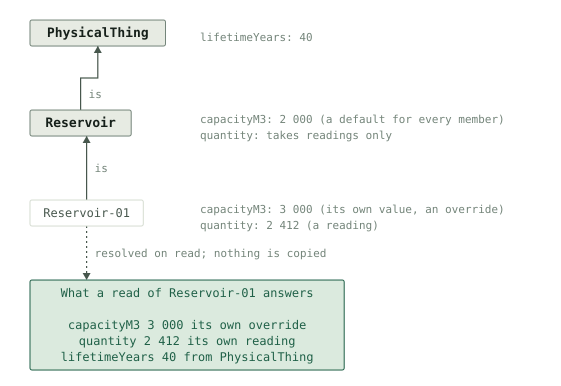

A Thing may `is` another Thing, which makes the second a **kind**. A kind declares the properties
every member shares — as defaults — and the ranges every member is judged by. A member holds only
what is its own.

- **Inherited values are live.** A member reads a default straight off its kind at the moment of
  reading; nothing is copied. Change the default on the kind and every member that has not set its
  own value sees the change at once.
- **The first write makes an override.** When a member sets a value for a name it inherits, the
  member keeps that value and the kind is untouched. Every other member still sees the default.
  Deleting the override gives the default back.
- **Chains run as deep as a model likes.** *Reservoir-01 is Reservoir is PhysicalThing* resolves
  through the whole chain, the nearest declaration winning.
- **A kind is never judged by its own ranges.** It declares the ranges its members are judged by,
  and never enters a state itself.
- **A kind declares itself.** Whether a Thing is a kind is a declaration its author makes, because
  a kind with no members yet has nothing pointing at it to reveal it.

A read of a Thing answers its **effective** properties: its own values plus everything it inherits,
own values winning, each tagged with where it came from.

### 16. Relationships and predicates
A relationship joins a subject to a target through a predicate. All three are Things. The same
pair may be joined by several predicates (*Zone-A has Sensor-1* and *Zone-A monitors Sensor-1*),
but the same triple exists only once, a Thing cannot relate to itself, and the reverse of an
existing relationship under the same predicate is refused.

Predicates come in two flavours:

| Flavour | What it does | Examples |
| --- | --- | --- |
| **Structural** | Describes how things are arranged. The platform reads it, pages draw it, ranges can follow it, and nothing else happens | `contains`, `has`, `feeds`, `powers`, `isIn` |
| **Handled** | Bound to a service. Creating a relationship through it starts that service with the subject and the target | `consumes`, `produces`, `runs` |

`is` is the only predicate with behaviour built into the server, and that behaviour is inheritance.
Every other behaviour is a service (Part V). This is the platform's extension point: a new
capability ships as a service bound to a predicate, and the server does not change.

A model says which of its predicates mean *containment* — one Thing physically inside another — by
marking them. Every read that narrows to "what is within this building" follows those marks, so a
model with its own nesting vocabulary works without telling anyone its predicate names.

### 17. Properties: type, write kind and retention
Every property has a **type** — text, a whole number, a number with a fraction, a yes-or-no, an
instant, an identifier, a shape on the map, or building geometry — and a value it holds only if
the type can hold it. A property may be **declared without a value**: the name is known, the type
is fixed, and a service may fill it in later. That is how an analysis says "this output exists and
nothing has computed it yet", which is a different answer from zero.

Two more settings belong to a property:

| Setting | Choices | Meaning |
| --- | --- | --- |
| **Write kind** | both, Facts only, Observations only | Which of the two kinds of write it accepts. A planner's stated area takes Facts only; a fetched climate zone takes Observations only, so nobody can type one in |
| **Retention** | full history, a ring buffer of the last so-many readings, a sample of every so-many, or the current value only | How much history it keeps, and therefore how far back a question about the past can reach |

Full history is the default. A property keeping only its current value is a deliberate choice —
the contact details on a submission are declared that way, so clearing the submission clears
them.

Property names are letters, digits and underscores, because the criteria language reads anything
else as structure.

### 18. Marks: how the platform finds roles without names
A property whose name begins with two underscores is a **mark**. A model marks the kind every
service `is`, the kind every connection `is`, the predicate a state connection watches through,
the kind that holds programme categories, the kind whose members are protected, and so on. The
platform, the console and the services all find a Thing by its mark and never by its name — so a
model may call its Things whatever suits it, and a project adds a term of its own by adding a Thing
under the marked kind and deploying nothing.

A mark is read as **owned**: the Thing that carries it is the one playing the role, and its members
inherit the mark without becoming roles themselves.

### 19. Seeds, templates and fragments
A **seed** is a text file (in the JSON format, a plain-text way of writing structured data)
describing one whole model: its Things with their properties, ranges and derived values, and the
relationships between them. The server plants a model from it **once**. From then on the model
lives in its own durable record and is rebuilt from that on every restart; the seed is an initial
import, not a settings file that is re-read. A model can be exported back to a seed at any time,
and that export is a complete snapshot that can be planted elsewhere.

The smallest complete seed the platform ships has a predicate, a display-settings Thing, one kind,
one member, and one relationship. The shape of a Thing, with the parts a modeller meets most:

```json
{
  "Id": "b1a73a00-88ab-50ca-b3ad-f0cda8a6da80",
  "Name": "Reservoir-01",
  "Properties": {
    "capacityM3": { "typeInfo": "vos.Decimal", "value": 3000 },
    "quantity":   { "typeInfo": "vos.Decimal", "value": 2412, "writeKind": "ObservationOnly", "mode": "RingBuffer", "ringBufferSize": 500 }
  },
  "OwnRanges": {
    "LowWater": { "Name": "LowWater", "Criteria": "quantity < capacityM3 * 0.2" }
  }
}
```

Every value is written with its type beside it. A relationship names its three Things by
identifier. A kind is declared with `"IsArchetype": true`, and its derived values are declared
under `RollupProperties` (chapter 25 shows one). Every seed carries the `is` predicate and a
`GUI_Settings` Thing through which the model says how it should be displayed.

A **template** is a seed the server creates new models from — one per project, for instance —
rather than loading as a model of its own. A **fragment** is a partial model applied to a live one:
it creates what is missing, updates what exists, never deletes, and is applied whole or not at all,
so posting the same fragment twice leaves one result. Fragments are how a submission enters the
model, how a building-model import lands, and how a service writes structure back.

A **validator** ships beside the seed tools. It reads a seed with the server's own reader, without
starting the server, and reports every problem in one pass: a value the type cannot hold, a
criterion that reads a property nothing can supply, a page that names something the model does not
hold, a missing required predicate. Every generator ends by running it.

### 20. Pages the model publishes
A dashboard is a page the model publishes as data — a Thing carrying a page description — and the
console draws it without knowing what it is about. Every word on the page is the model's; the
widgets are the console's. A page can show:

| On the page | What it means |
| --- | --- |
| A large figure with a unit | A value read off one Thing, a count of Things in a state, or a total over many; a small line under it is its recent history |
| A sentence such as "Energy generation covers 65% of consumption, short of the 100% target" | A **verdict**: the states a balance can hold, read as a sentence, with the target taken from the range itself rather than typed into the page |
| A footnote saying *stated by the submitter*, *fetched from a source on a date*, *the platform's assumption*, or *unrecorded* | The **origin** of a figure, read from how the property is declared, never guessed from its name |
| A figure that opens to show a formula and each input's value | The **working**: how the figure was reached, read from the declaration the model holds |
| "Raise the array area" or "lower the assumed consumption" beside a shortfall | The **levers**: which inputs would move the figure, and in which direction, worked out from the same formula |
| A table, a leaderboard, bars against a band, a funnel, a timeline, a chart over a calendar | The other widget kinds; each row can open the Thing behind it |

A page authored wrong is never blank: a binding that names something the model does not hold draws
*absent* and says why, and the validator refuses the seed before it ships when it can. A page
carries its own translations, so it reads in the reader's language.

---

## Part IV — How every change is judged

*For anyone who wants to understand the engine at the centre of the platform. This is the part to
read slowly.*

### 21. The two engines, in one sentence each
Inside the server two engines watch every model. The **derived-value engine** keeps every total and
formula current. The **range engine** keeps every state current. They run in a fixed order on every
change — derived values first, then ranges — so a judgement is always made on settled figures.

### 22. The journey of one change, in order
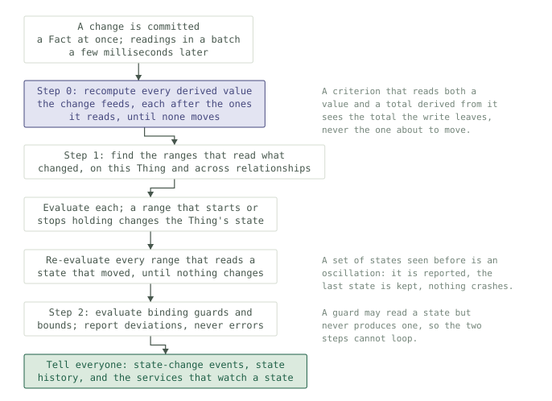

**A change is committed.** A Fact — a person editing a value, a service writing a result, a
relationship created or removed — is written to the durable record and then reacted to at once,
inside the same request, because a Fact can change the very shape of what depends on what.
Observations arrive faster than anything should react to, so they are gathered: the engine collects
every Thing-and-property that received a reading and fires once per short window of about fifty
milliseconds. The current value is written first, newest by observed time, so a late sample updates
history without clobbering a newer reading; the reaction reads it strictly afterwards.

**Step 0: derived values.** Every total and formula the change feeds is recomputed — each after the
ones it reads, so a chain of any depth settles in one pass — until none moves. Only then are ranges
judged. The reason matters: a range that reads both a value and a total derived from it sees the
total the change *leaves*, never the one it is about to move, so a Thing enters a state once
rather than entering on the old total and leaving on the new.

**Step 1: states.** The engine looks up every range that reads what changed — on the Thing itself,
and on any Thing whose range reaches this one across a relationship — and evaluates each. A range
that starts or stops holding changes its Thing's **state**. A state is not stored; it is the set of
ranges that currently hold, kept in an index so "who is in this state?" is answered at once. Since
a range may read another Thing's state, a state change can flip further ranges, so the engine
re-evaluates every dependent range until nothing changes any more.

**Step 2: bindings.** Once states are settled, the engine evaluates each range's **bindings** —
bounds a value should stay inside, with an optional guard saying when the bounds apply — and reports
**deviations**: how far the actual value sits from what was expected. Guards may read states but
never produce them, which is what keeps the two steps from feeding each other.

**Everyone is told.** Every state that changed is recorded in the Thing's state history, published
on the live stream, and — where a connection watches that state — dispatched to a service (chapter
28).

### 23. Ranges: a named condition
A range is a named condition over a Thing's (or a relationship's) values, written in the criteria
language of the next chapter:

```text
LowWater        quantity IS KNOWN AND quantity < capacityM3 * 0.2
NotMeasured     quantity IS UNKNOWN
```

A range is a lens, not a constraint. It never refuses a value; it describes what is true — "this
reservoir is low", "this study is water resilient" — and the platform reacts to the description.
Violations produce deviations, never errors.

Three habits make ranges trustworthy:

- **Name every case.** A value nothing has written is *unknown*, and a range over it answers false
  rather than raising an error. A companion range naming the unknown case is what keeps "not
  measured" from reading as "healthy", and a third range for the middle case is what keeps a judged
  Thing from holding no state at all. Every balance in the site analysis has exactly three: the
  guarded verdict, the shortfall, and the unassessed case.
- **Put the range on the kind.** A range declared on a kind judges every member and never the kind
  itself. Declare `normal_pressure` once on the `Pump` kind and every pump is judged by it; add a
  pump and it is judged the moment it exists.
- **Read across relationships.** A range on a pump may read the reservoir it draws from:
  `[drawsFrom].quantity > 0`. The engine keeps that wiring current: when a relationship along the
  path is added or removed, the ranges that read through it are re-evaluated.

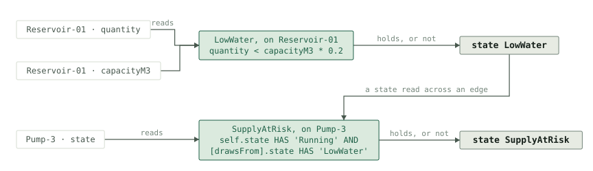

The engine keeps this wiring as a graph: which ranges read each value, which states each range
produces, and which ranges read those states, on this Thing and across relationships. That is what
lets one write re-judge exactly the ranges it touches and nothing else, however large the model.

A range may also carry an **evaluation interval** in seconds, so a criterion that reads the clock is
re-judged on a timer, and **bindings** for deviation reporting (chapter 27).

### 24. The criteria language
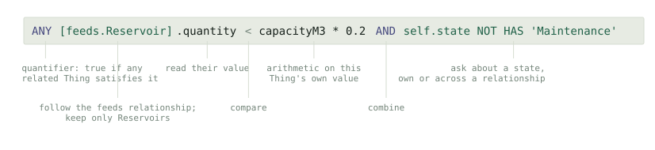

The criteria language is the one small language the platform reads everywhere a condition or a
formula is needed: in ranges, in the guards on bindings, in the conditions that narrow a total, and
in derived formulas. It is written by people and stored as data, so it is kept deliberately small.

**Values.** A property of this Thing by its name (`quantity`); a number (`14`, `0.2`, with a dot
for the decimal point on every machine); text in quotes (`'Running'`); `true` and `false`.

**Comparison.** `=`, `!=`, `<`, `<=`, `>`, `>=`. Numbers compare as numbers; text compares
exactly. `IN ('open', 'held')` tests membership; `MATCHES '^Sensor.*'` tests a text pattern.

**Known or unknown.** `daysOfSupply IS KNOWN` asks whether the value exists at all — a computed
zero is known; a declared-but-unwritten property, a missing property, and a total that could not be
computed are unknown. This is the only way a criterion tells "nothing has answered" from "the
answer is no", and the reason every verdict has an unassessed companion.

**Arithmetic.** `+`, `-`, `*`, `/` and parentheses, between any two values a criterion can read —
so a threshold stored in days can be judged against a clock counting seconds:
`elapsed(lastInspected) > daysBetweenInspections * 86400`.

**Logic.** `AND`, `OR`, `NOT`, and parentheses.

**Across relationships.** `[feeds].quantity` follows the `feeds` relationship and reads the far
Thing's `quantity`. A kind after a step narrows what is reached: `[feeds.Reservoir]`. Steps chain:
`[<-contains.Site.contains]` — the arrow `<-` follows a predicate backwards. A path may reach
several Things, and a **quantifier** says how to judge them: `ANY` (the default), `ALL`, `NONE`.
Over an empty set `ANY` is false and `ALL` and `NONE` are true — unless the path names a
predicate or a kind the model does not hold at all, in which case every quantifier answers false
and the evaluation names what it could not find, because a criterion should not certify that
things are well when it could not look.

**States.** `self.state HAS 'Overheating'`, `[powered_by].state HAS 'Running'`,
`ANY [connected_to].state NOT HAS 'Healthy'`.

**Totals over related Things.** `SUM [feeds.Reservoir].quantity > 5000`, and likewise `MIN`,
`MAX`, `AVG`, `COUNT`. A total in a criterion answers **zero over an empty set**, every one of
them, so a range that must not pass on nothing tests the members:
`COUNT [has.Parcel] >= 1 AND SUM [has.Parcel].area <= 100`.

**A trailing window.** `SUM [feeds].volume OVER flowed_at LAST 3600 < 100` narrows a total to the
members whose event instant falls in the last hour. The window slides with the clock, so a range
using one is re-judged on the timer as well as on a write.

**The clock.** `elapsed(x)` is the seconds since the instant `x`; `Now()` is the current instant.
Both read the **model clock** (chapter 29).

A criterion has one answer: it holds, or it does not. Anything that is not two comparable values —
text against a number, a missing value — makes the comparison false rather than raising, because a
criterion is judged while a model is loading and one bad value must not stop the pass. The
validator refuses a criterion whose property nothing in the model can supply, so a range that
would answer false forever never ships.

A few recipes:

```text
# Three states over one property
nominal    temp >= 50 AND temp <= 100
overheat   temp > 100
critical   temp > 150

# A hub judged by what it connects to
all_connected_healthy   ALL [connected_to].status = 'ok'
any_connection_failed   ANY [connected_to].state HAS 'failed'
isolated                NONE [connected_to].status = 'ok'

# A guarded verdict and its two companions
EnergyNetPositive     pctOfConsumption IS KNOWN AND pctOfConsumption >= 100
EnergyShortOfTarget   pctOfConsumption IS KNOWN AND pctOfConsumption < 100
EnergyNotAssessed     pctOfConsumption IS UNKNOWN

# Recent behaviour
flow_stopped   SUM [feeds].volume OVER flowed_at LAST 3600 < 100
```

Appendix B has the language on one page.

### 25. Derived values: totals and formulas
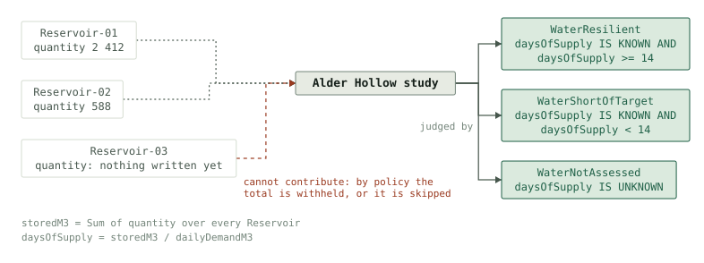

A property may be declared as **worked out** rather than written, in one of two forms:

- **A total over related Things** — a *reduction*: the sum, minimum, maximum, average, count or
  distinct set of one property across the Things a path reaches. `Sum` of `quantity` over every
  Thing that `is Reservoir` is the water a site holds.
- **A formula** over what the owner itself can reach: `storedM3 / dailyDemandM3`. A formula may
  begin with a total, and may fold a property's history — the frost days a year, from ten years of
  hourly temperature readings — with the same calendar folds the temporal reads offer (chapter 30).

A derived value reads like any other property — on a page, in a criterion, from the command line
— and refuses every write, because the platform will only compute it again. It is computed when
the model loads and again whenever a term moves: a member's property changes, a relationship along
its path is added or removed, or a formula term is edited.

The rules a modeller relies on:

| Rule | What it means |
| --- | --- |
| **A total over nothing is nought — unless told otherwise** | `Sum` over an empty set is zero and `Count` is none; `Min`, `Max` and `Average` are unknown, because there is no smallest of nothing. A definition may *require members*, in which case an empty set answers unknown rather than zero, for a model where "none" and "nobody has said" differ |
| **A member that cannot contribute** | A missing value, text where a number belongs, an ambiguous name. The model's policy decides: **withhold** the whole total (the default, because a partial total is a wrong answer presented as a right one), or **skip** the member and total the rest. Withholding one value never stops the pass |
| **A formula with no answer is unknown, never zero** | A term nothing has written, a division by zero, a path reaching several Things — each leaves the figure unknown, which is the one place a formula behaves differently as a value than as a comparison |
| **A condition narrows the members** | A total may carry a criterion each member must satisfy; one that fails it is not a member. This is how the built footprint sums only the programme categories marked as hard surface |
| **Who computes** | The declaring Thing computes one value, or every member computes its own (*per instance*). A formula declared on a kind almost always wants per instance, since the terms it reads sit on the members |
| **Chains settle in one pass** | A round visits a definition after the ones it reads, so a chain of any depth settles at once. Only a graph that feeds itself repeats, up to a limit the model declares, and reaching the limit is logged naming every definition still moving |
| **The derived value comes first** | On every change, derived values are recomputed before the ranges that read the raw change are judged (chapter 22) |

Every derived definition also declares what it **reads**, and which way its result **rises and
falls** with each input. That is what lets a page show a figure's working and its levers without
a second calculator in the page.

### 26. Inheritance and evaluation
Ranges follow the `is` chain the way values do. When *Dog is Mammal is Animal*, a dog is judged by
its own ranges, Mammal's and Animal's, the nearest definition of a name winning. Adding or removing
an `is` relationship, or adding or removing a range on a kind, re-synchronises every member. A kind
never enters the states it defines.

When a **kind's property changes**, every member that inherits it and has not set its own value is
re-judged — recursing down the chain — so correcting one assumption on a shared kind re-judges
every study at once. No value is copied; only the re-judgement is triggered.

Ranges on **relationships** read the relationship's own properties and states only. Relationships
do not inherit.

### 27. Bindings, guards and deviations
A range may say not only *whether* a Thing is in a state but *how far* a value sits from where it
should be. A **binding** names a property and its **bounds** — numeric limits, a set of allowed
words, a text pattern, a comparison with a value reached along a path, or a quantified judgement
over related Things — and an optional **guard**, a criterion that says when the bounds apply. Two
bindings on one range give different bounds by operating mode: temperature in 80–120 while the
motor runs fast, 60–100 while it runs slow. A **deviation** reports the bounds, the actual value,
how far off it is and how severe that is, once the state has settled.

### 28. When a state starts work
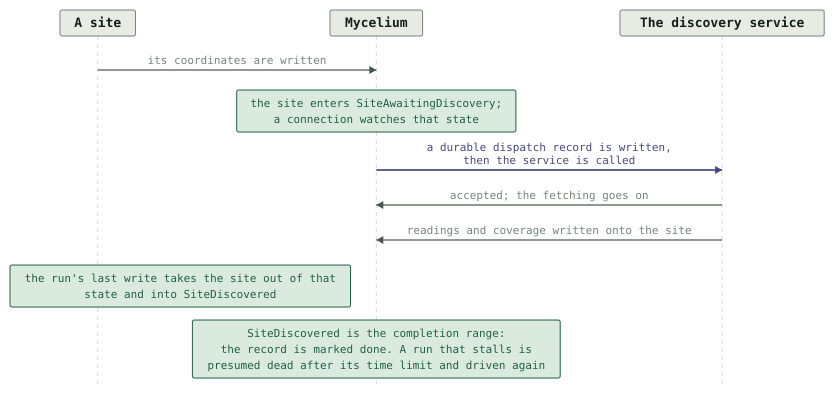

A **state connection** is a connection whose trigger is a state: it watches a range, and every Thing
entering that range is dispatched to the connection's service. Nothing calls the service by hand;
what started a run is a fact in the model afterwards.

- **The dispatch is durable.** Entering the state writes a **dispatch record** — a relationship
  from the Thing to the connection — before the service is called. The record carries how the
  dispatch is going: pending, in flight, done, failed or refused. A record is delivered once while
  its delivery runs, a failed one is driven again, a refused one (the service said the request
  itself was wrong) is not, and a server restart re-identifies every open record and drives it on.
- **Done is proved by the model, not by the reply.** A connection may name a **completion range**:
  the state the Thing must enter for the work to count. The service's reply then means only
  *accepted*, and the record is marked done when the Thing reaches that state — which the
  service's own last write usually causes. A connection also says how long an in-flight dispatch
  may take before it is presumed dead and driven again. Discovery works this way: a site entering
  *awaiting discovery* starts a run that outlasts any single call, and the site reaching
  *discovered* is what closes it.
- **Loops are bounded.** A Thing that is dispatched, written to, re-enters the state and is
  dispatched again is caught after a ceiling of re-entries in a window: the record is marked failed
  with a note, and the loop stops.
- **Several connections may watch one state**; the first by identifier is dispatched and the rest
  are named on the record, so a service that watched and was not called is visible. A more specific
  kind's connection overrides its parent's.

A service that needs to be told once, about one particular Thing reaching one particular state,
places a **vigil**: a Thing the platform writes naming the subject, the range and the connection to
call. When the subject enters the range the connection is dispatched once, the vigil is answered,
and the platform retires it.

### 29. The clock
Everything that judges time reads the **model clock**: `elapsed()` and `Now()` in a criterion, the
timer that re-judges ranges carrying an interval, trailing windows, and every temporal question.
Left alone the model clock is the wall clock. An administrator may **anchor** it to a start instant
and a rate, so a year of a simulation can run in an afternoon and every range judges the
simulated time. Credentials, health checks and cooldowns keep reading the real clock, so anchoring
a run cannot expire a sign-in or make a service look dead.

A range that reads the clock is re-judged on the scheduler's tick at the interval it declares. The
tick visits only the Things that carry such a range, so a model's size does not set what a tick
costs.

### 30. What you can ask afterwards
| Question | Where the answer comes from |
| --- | --- |
| What is true now: a value, a relationship, who is in state S | The live model, at once |
| What was true at instant T; how did X change between T1 and T2 | Rings, the store of every value over time, reading only the layers that hold the span asked for |
| The model, or one Thing, as it stood at T | The model's own history; a Thing not yet created, or already deleted, at T is answered as absent |
| Which states a Thing held, and when; how long it spent in one | The engine's state history, which says how far back it reaches |
| How much happened per slice of time across a kind: units dispatched per quarter hour over the last eight hours | A bucketed reduction over the live model's members and the instant each carries |
| What one property's readings come to by calendar: the monthly mean of the daily high, the frost days a year, the share of hours inside a comfort band | A reduction over the property's retained readings, folded in steps — by day, then by month, then across the years |

A value whose retention cannot reach the instant asked for is left out of the answer, never
answered with what it holds now. An absent property means *no value can be known for that
instant*; a property that genuinely held nothing reports nothing. The two are different answers.

### 31. Where every value comes to rest
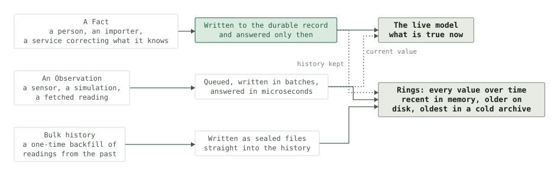

Every change is a durable, sequenced record; nothing is kept only in memory. A Fact is written and
synced to disk before the writer is answered, then applied to the live model and reacted to at
once. An Observation is queued and the writer answered in microseconds; a background worker writes
the queue in batches and applies each batch. Bulk history — a one-time backfill of past readings
for Things that already exist — is written straight into the history as sealed files.

**Rings** holds every value over time in three layers: the most recent buckets in memory, sealed
bucket files on local disk for recent weeks and months, and, when a deployment turns it on, a cold
archive for the long past. A reading ages outwards, and a question about the past reads only the
layers whose span it touches. A Fact-path change to a property that keeps history is projected into
the same store, tagged with the path it came from, so one history read spans both kinds of write.

A **checkpoint** of the model's structure is taken every so often, so a restart loads the newest
checkpoint and replays only the record above it. Older segments of the record are deleted once a
retained checkpoint supersedes them and their readings have reached the on-disk layer.

---

## Part V — Services: relationships that do work

*For engineers, and for anyone who wants to know what a "service" is here.*

### 32. What a service is
A service is a separate program that the server launches, calls and supervises. The contract
between them is deliberately small — plain web requests, plus one signed pass — so a service can be
written in any language with a web server and a mainstream cryptography library. Reference
services ship in C#, Go, Node, Python and Rust; each is an echo service that acknowledges what it
was sent and reflects it back, ready to have its one function replaced.

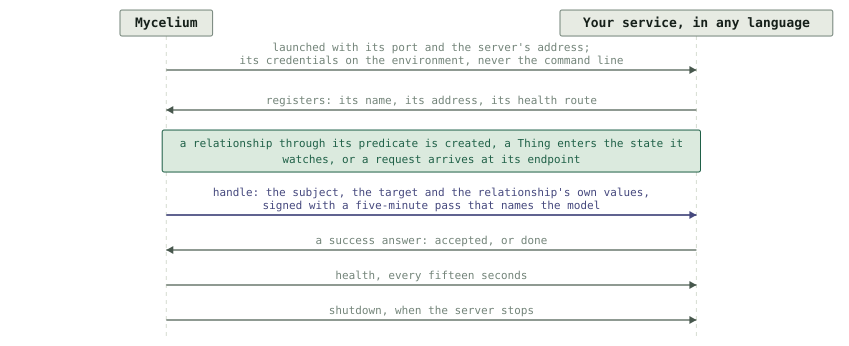

A service must answer three routes: **handle** (do the work), **health** (say it is alive, quickly,
with no dependencies) and **shutdown** (stop gracefully). The server launches it with its port and
the server's own address on the command line, and hands it its two credentials privately, through
settings only that process can read — never on the command line, which every program on the host
can read.

**Identity runs both ways.** The server signs every call to a service with a short-lived pass that
names the model the call is about; the service checks the signature against the server's public
key, so nobody can imitate the server. A service calls the server back with that same pass, so a
service shared between several projects always writes into the project the call was about. A
service that must outlive any pass — one nobody starts on demand — holds a key confined to one
model instead.

**Delivery is at-least-once.** When the server cannot confirm a service finished, it sends the
relationship again, and a service that reconnects after a break is sent what it missed. Every
delivery of one relationship carries the same relationship identifier, so a service does the work
once per identifier and answers "done" to a repeat.

**A fragment is applied whole before any service sees it.** When the relationship that starts a
service arrives inside a fragment, the service is called only after every Thing, relationship and
value in the batch is readable and every derived value has been recomputed.

### 33. Three ways a service is started
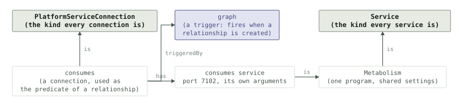

A **connection** is a Thing that routes to a service. It `is` the kind marked as a connection,
`has` a service Thing, and reaches its **trigger** through a relationship. The service Thing `is` a
shared **prototype** — one program with its shared settings — which `is` the kind marked as a
service. Each concrete service overrides only what differs: its port, its arguments, whether it
starts automatically.

| Trigger | What starts the service | What it is sent |
| --- | --- | --- |
| **graph** | Creating a relationship whose predicate is the connection | The relationship's identifier, the subject and target, both names, and the relationship's own values, so the service need not call back for its first look |
| **http** | A request to the server naming the connection's routing label | The request body, forwarded as it is; the reply returned to the caller directly |
| **state** | A Thing entering the range the connection watches | The Thing as subject (chapter 28) |

A connection marked to **start automatically** is launched when the model loads and dispatched for
every relationship already through it, so a simulation resumes on every start. Otherwise a service
is launched lazily, the first time something needs it.

The server probes a service's port before launching: a healthy answer means it is already running;
a refused connection means nothing is bound and it is launched; a timeout means something holds
the port but will not answer, and it is left alone rather than duplicated. A service that fails to
start three times waits out a cooldown. Every launched service runs under a memory ceiling, so one
that allocates without end fails on its own rather than taking the host down. Health is checked
every fifteen seconds; a service the model declares is shown as stopped rather than removed, while
a service that announced itself from outside is removed after three consecutive failures.

### 34. Reading live data: subscriptions
A service that needs live model data does not poll. It opens a **subscription** with a
**selector** saying which slice of the model it wants — everything; particular Things by
identifier or name; every Thing of a kind, found by name or by mark; the neighbours of those along
a predicate; and which relationships should travel with them. The answer is a **snapshot** of that
slice, stamped with the sequence number it was taken at, and from then on a **stream** carries every change to those Things and no
others: created, deleted, a property changed, a relationship added, a Thing entering the slice
because it was later typed into a watched kind.

Every change on the stream carries the sequence number it was committed at, so a client that
drops its connection resumes from the last sequence it applied and misses nothing. A derived
value's change is announced on the stream but never replayed after a reconnect, so a reconnecting
client re-reads the derived values it depends on. The membership of a live subscription can be
widened or narrowed without reconnecting.

A snapshot carries every relationship touching what it selects, so a service that needs only a
Thing's own outgoing relationships names them, and a service handed a subject asks for that subject
rather than its whole kind. Neither mistake shows on a small model.

### 35. Writing back
| Kind | When | What happens |
| --- | --- | --- |
| **Fact** | A structural truth that must survive a restart: a status, a configuration, a corrected value, a computed verdict | Written durably before the reply; every range that reads it is judged at once |
| **Observation** | One sampled reading, or a batch of readings across one Thing's properties | Queued and batched; the reading's own observed time is kept, so late and out-of-order samples are first class |
| **Bulk history** | A one-shot backfill whose Things already exist and whose readings all carry an observed time | Written straight into the history as sealed files |
| **A fragment** | Structure: Things, their relationships including `is`, and their initial values, in one call | Created or updated as one batch, whole or not at all; the server resolves inheritance so a value for an inherited name lands as an override |

A property's write kind gates what it accepts; a value its type cannot hold is refused naming the
property; a derived property refuses every write.

### 36. The services that ship
| Service | Started by | What it does |
| --- | --- | --- |
| **Metabolism** | graph: `consumes`, `produces` | One program, two modes. For each relationship it runs a loop that takes from, or adds to, a numeric property on the target at the relationship's rate, and reconfigures itself live when the relationship's values change (chapter 37) |
| **Delta** | http | Provisions the catalogue of data-source templates into a model on its first registration and validates every registration against it (chapter 38) |
| **Tributary** | http | Fetches a registered source with its resolved settings, reshapes the reply, and writes the readings as Observations onto the Thing the call was about (chapter 38) |
| **Forage** | state | Finds every source covering a site, calls Tributary for each, resolves each fetched word to the Thing it names, and starts the analysis (chapter 39) |
| **EnergyBalance** | graph, and a pipeline node | Reads its inputs off a study, computes the energy verdict a formula cannot express, writes it as a Fact for the judge-ranges, and recomputes whenever an input moves |
| **WaterReserve** | a pipeline node | Reserve figures for a pipeline run |
| **ModelBridge** | a pipeline node | Reads a Thing's property into a pipeline, or writes a pipeline value onto one (chapter 44) |
| **Phloem** | http | The pipeline orchestrator (Part VI) |
| **Xylem** | http | Accepts a building-model upload, runs the importer, and applies the result to the model |
| **Intake** | its own address | Takes a public submission, composes it into the model as one fragment, sends the verification code, keeps shared files, and answers a submitter's findings page. It registers with nothing and holds its own confined key |
| **The echo examples** | graph | The reference service in each of five languages, and the reference pipeline node |

### 37. Metabolism: a simulation that runs in the model
A relationship *Home-4 consumes Energy pool* carries a quantity, a property name on the target, and
a frequency in seconds. Creating it dispatches Metabolism, which runs a loop: every so many
seconds it takes that quantity from the pool's property — through the server, as a durable,
exactly-once change — and adds it to a running total on the relationship itself. `produces` is the
mirror image. Loops start staggered, so a seed with twenty relationships does not hammer the server
the moment it loads; a loop may carry a start delay, a start instant and an end instant.

Metabolism subscribes to its own relationships, so when someone edits the frequency in the console
the running loop picks it up at once, with no restart. Any range on the pool — *low power when
quantity < 50* — is judged on every tick. A decrement that would take a quantity below zero is
refused before anything is written.

### 38. Fetching outside data: Delta and Tributary
There is no code anywhere that knows about any particular data provider. A provider is
**configuration**: a **registration** Thing carrying an address, how to call it, and a small
**reshaping rule** that turns whatever the provider answers into readings.

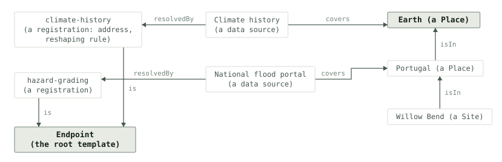

Registrations inherit from a small tree of **templates**, so shared behaviour is declared once: the
root template says a plain call, a child template fixes one provider's field names and says that it
authenticates by exchanging a credential for a token and pages through its results in offsets. How
an endpoint authenticates, pages and reads its body are **kinds it reaches** by relationship, each
declaring the settings it requires — so a registration that cannot satisfy its kind is refused
before anything is called. **Delta** validates every registration against the tree and refuses one
that does not fit.

**Tributary** makes the call. Its address may carry placeholders — `{latitude}`, `{longitude}`, a
map tile's `{z}/{x}/{y}` — filled per call from the values of the Thing the call is about, so one
registration serves every site. The reply is reshaped by the registration's rule (written in a
small expression language for reshaping structured data) into readings: which property, what value,
observed when. Each reading is written as an Observation onto the subject, and the registration is
related to that Thing through `observed`, so every fetched value leads back to what produced it.
Tributary fetches and reshapes; it computes nothing and remembers nothing. A reply the provider
refused is carried back with the provider's own status and words.

Some sources return bytes rather than text — map tiles, imagery — and a registration says so by
reaching the kind that reads its body as bytes; it may also cache the bytes on disk for the life the
provider's terms allow.

**Coverage is edges.** A source relates to a **Place**; a site relates to the Place it sits in;
Places nest. A source covering a region covers every site within it without naming any, and a
country spelled two ways can never hide a source. The registrations every project shares ship as
template data: a climate classification, rainfall and sunlight averaged over twenty years,
elevation, hazard gradings from a public portal, ten years of hourly climate history.

### 39. Discovery: Forage
Nothing calls Forage. A site whose coordinates are known and whose coverage has not yet been
worked out enters a state, and a connection watching that state dispatches the service with the
site as subject (chapter 28). A run:

1. **Reads the site's places, the sources covering them, and their registrations** in one
   snapshot. A failed read writes nothing — an unreachable server must never read as "no source
   covers this site".
2. **Records one coverage per call** it will make: a Thing per site and source that says whether
   the call answered, when, how many attempts, and why not. A call already answered is not made
   again, so a run after a partial failure asks only the sources that failed.
3. **Calls each source through Tributary**, a bounded number at a time, each with a time limit,
   addressing the call from the site's own values outward — its coordinates, then the values of the
   places it sits in, then the source's own settings. A source that grades one hazard per call is
   called once per hazard assessment the site has, with that assessment as the subject.
4. **Resolves the fetched words.** A climate code or a hazard grade arrives as a word; the run
   relates the subject to the vocabulary Thing the word names, reading the declaration the model
   carries, so a project adding a vocabulary edits its model and deploys nothing. A word the
   vocabulary does not hold writes no relationship and is reported.
5. **Starts the analysis** by relating the site's study to each marked compute connection. A
   connection bound to a service is a handled predicate, so creating that relationship is what
   dispatches it — one way to start an analysis, and one answerable from the model afterwards.

Partial failure is normal. A source that fails leaves its value undiscovered and its coverage
outstanding; the site stays in the state and is driven again; and the analysis starts on whatever
resolved, including nothing, because a site whose sources were all unavailable is exactly the case
a planner needs an answer about. A source added to the catalogue later enters a state of its own
and is offered to every site under the places it covers, the same way.

---

## Part VI — Pipelines

*For anyone who wants to chain services together on a canvas, and for engineers making a service a
node.*

### 40. What a pipeline is
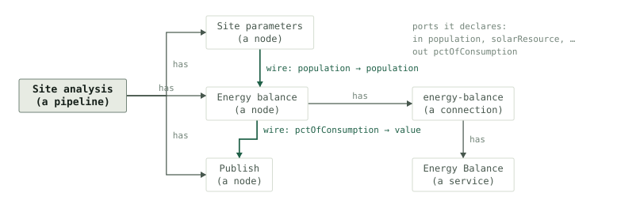

A pipeline is a drawing of services joined by wires: each **node** is a service, each **wire**
carries a value from one node's output **port** to another node's input port, and the drawing runs
from its sources to its sinks with no cycles. A pipeline is nothing but Things and relationships in
the model — the pipeline `has` its nodes, a node `has` the connection it dispatches, a service
declares its typed ports, a wire names the two ports it joins — so there is no second store, and a
pipeline can be read, exported and judged like anything else. Every role is found by a mark, so a
model may name its pipeline vocabulary as it likes.

Pipelines and the reactive engine answer different questions. The engine recomputes and re-judges
on its own every time anything changes. A pipeline runs a chosen set of services in a chosen order
when somebody asks — a batch of enrichment over a list, a report assembled from two analyses, a
value read from the model, transformed and written back.

### 41. Building one on the canvas
The **Pipelines** page in the console is the editor.

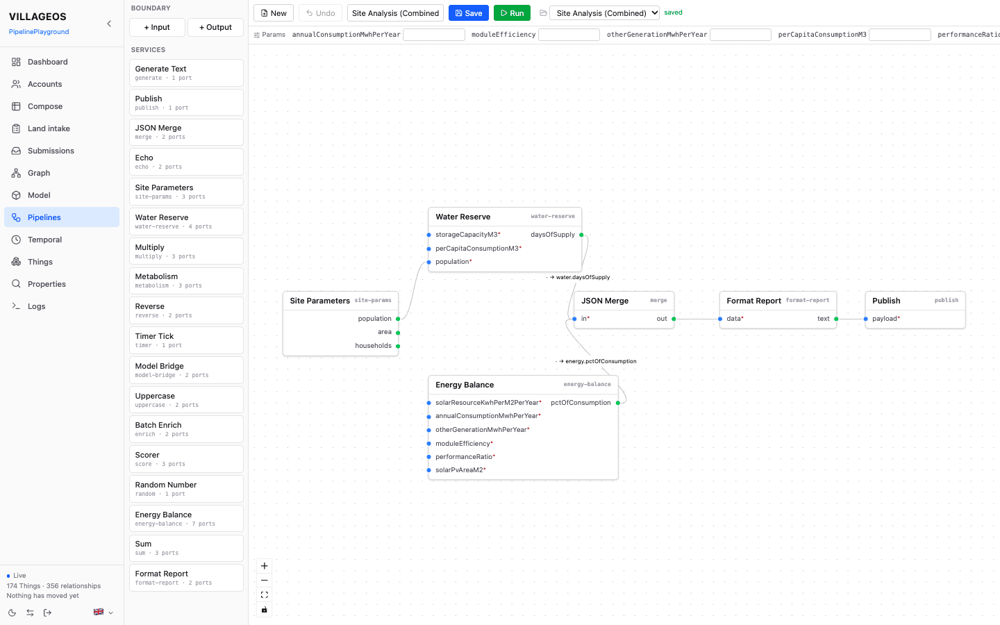

- **The palette** lists every connection in the model that can be dispatched. Clicking one drops a
  node bound to it; its typed ports come from the service it binds. **Input** and **Output**
  buttons drop boundary nodes: an Input's ports are filled from the run's parameters, and the value
  wired into an Output becomes the run's published result.
- **Wiring** is dragging from an output port to an input port. Wires are type-checked; an
  incompatible one is refused.
- **Field mapping** on a wire picks a part of the upstream value and places it at a named part of
  the downstream input, so several wires into one input merge into one composed object.
- **A transform** on a wire reshapes the value in flight, in the same expression language Tributary
  uses. An invalid expression is caught before the run.
- **Parameters.** An unwired input can be bound to a run parameter by name; the parameters appear
  in a bar above the canvas where values are typed at run time.
- **Validation** runs before every run: a required input neither wired nor bound, or a wire with a
  loose end, disables Run and says why.
- **Save, load, undo.** Saving a loaded pipeline updates it in place. Every edit is optimistic and
  can be undone; a save the server refuses rolls the canvas back to the last saved state.
- **History** lists a pipeline's past runs; picking one replays each node's status onto the canvas.

### 42. Running one
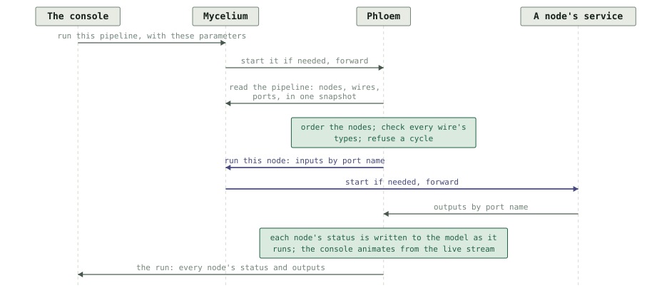

**Phloem** is the orchestrator, a service like any other. A run reads the pipeline in one
snapshot, builds the graph — each node's dispatch address, its ports, its wires — and checks it up
front: the nodes are put in dependency order (a cycle is refused) and every wire's types must
agree. Then it runs the nodes in that order, independent nodes concurrently up to a bound,
dispatching each through the server and routing its outputs to the inputs downstream. A node that
fails halts everything that depends on it.

A run and each node's run are recorded as Things, written *running* before dispatch and their
final status after, so the console animates a run from the ordinary live stream and history is a
read of the model. **Cancel** is cooperative: nodes already running finish, pending ones are marked
cancelled.

**Fan-out.** A node whose service declares a **collection** input runs once per item when that
input receives a list — the other inputs are the same for every item — and each output is gathered
into a list for downstream. The node may continue past a failed item, marking the run partial, or
fail as a whole.

A pipeline can also be started **from the model**: a `runs` predicate bound to Phloem makes
creating *X runs Pipeline* start it, so any service can start a pipeline by creating one
relationship.

### 43. A service becomes a node
A node is an ordinary service that recognises one extra shape of handle request — one carrying a
run identifier and a node identifier, with **inputs by port name** and any fixed parameters — and
answers with **outputs by port name**, or an error. Nothing else about the service changes. A
service advertises its ports (name, direction, type, whether required, whether a collection) so
the editor can check wires.

An input may arrive as a **reference** to a Thing's property rather than the value itself, which
the node resolves before running — the way to hand a large value, or a derived value, into a
pipeline without copying it through every wire. A derived reference may resolve to nothing, and a
node handles that rather than assuming a number.

### 44. Reaching the model from a pipeline: ModelBridge
Phloem assembles a node's inputs from wires and run parameters only. **ModelBridge** is the node
that reaches the model: in *read* mode it outputs a named property of a named Thing — an inherited
value or a derived total resolves like any other — and in *write* mode it writes its input onto a
named Thing's property as a Fact, so every range that reads it is judged. Read, compute, write is
three nodes in a row.

### 45. The playground
A generator produces a small seed of example services and pipelines that exercise every feature
of the editor: the simplest two-node chain, boundary nodes, a three-stage transform, field
merging, a transform on a wire, a fan-out with a partial run already recorded, a numeric chain
mixing wired and parameter-bound inputs, and a site-analysis pipeline running two balances in
parallel into a report. Load the playground seed, or drop the same content into any model, and
open the Pipelines page. Everything on the canvas works from seed data alone; a live run with real
output needs the node's service running.

---

## Part VII — Using it day to day

*For planners, operators and analysts: the web console first, then the command line.*

### 46. Trellis, the web console
Trellis runs in a browser against a Mycelium. In development it is served by its own development
server on port 5173; in a deployment the server serves it from its own address.

```bash
# Terminal 1: the server
dotnet run --project vos.Mycelium

# Terminal 2: the console's development server
cd vos.Trellis
npm run dev
```

Open `http://localhost:5173`. Sign in as `admin` with the password the server wrote to
`bootstrap-credentials.txt` in its data directory on its first start — or the one
`VOS_ADMIN_PASSWORD` held then. There is no default password. A developer may put a key in
`VITE_API_KEY` in a local settings file for automatic sign-in.

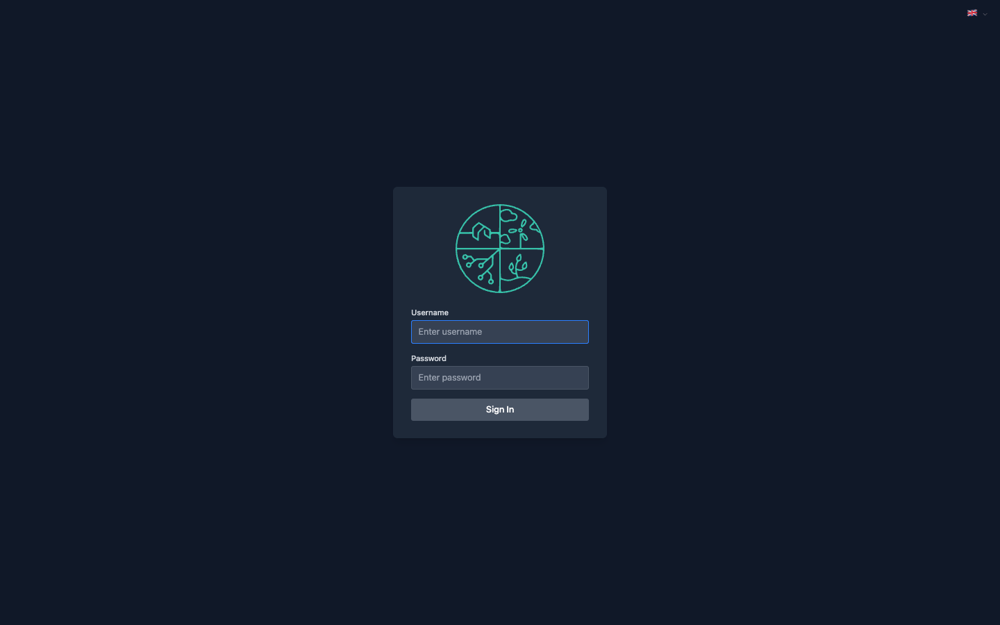

The sign-in and password pages have one look whichever theme the rest of the console is in. With
several models loaded, they are offered by name after sign-in; an account enters only the models it
has been granted, and an administrator every one (chapter 54).

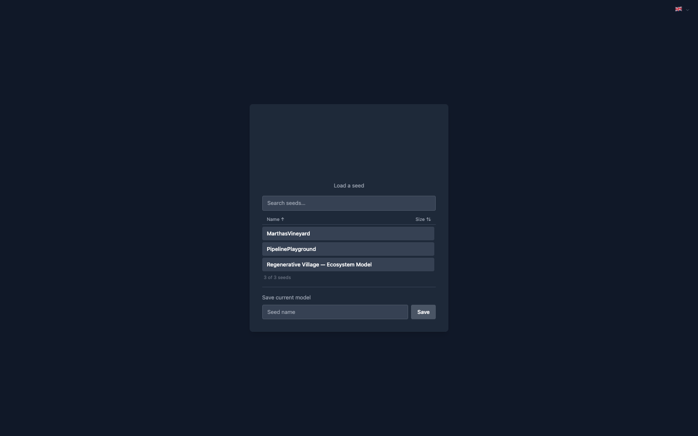

The console keeps your session alive by renewing its pass in the background before it expires. An
account flagged to change its password — one an administrator created, or added or reset from the
Accounts page — is shown the change form first and nothing else until it has.

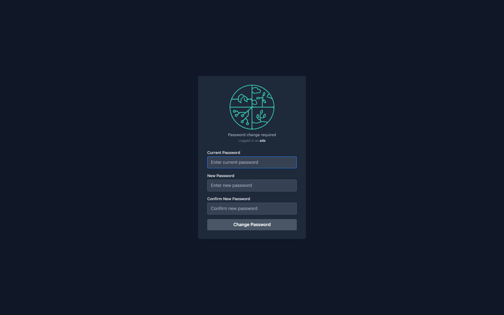

**The pages.** The left rail lists them; it collapses to icons with the chevron at its top.

| Page | What it is for |
| --- | --- |
| **Dashboard** | What the model holds, what the two engines are carrying, which services are registered and healthy, and a live feed of what is happening |
| **Operations**, and the model's own pages | Every page the model publishes, one rail entry each with the icon its description names, in the reader's language; a model that publishes none shows one Operations entry saying so |
| **Accounts** | The page the platform declares for administrators: who may sign in and which models each account may enter (chapter 54). Listed only to an administrator, before the model's own pages |
| **Compose** | A table built from what the model declares for a kind — its properties, its links and its states — kept as a page of the model's own |
| **Land intake** | The five-step wizard that describes a piece of land, shown where an intake service is configured |
| **Submissions** | What has arrived, and what a reviewer decides about it |
| **Graph** | The model as a picture: search, clustering, the 3D view of one building, and every create, edit and delete |
| **Model** | The whole building model in 3D, with filtering by element type and a map of where the site is |
| **Pipelines** | The canvas where a pipeline is drawn, wired, run and watched (Part VI) |
| **Temporal** | Every change to a property over a time range you choose |
| **Things**, **Properties** | Search the whole model by name, or by property name |
| **Logs** | The server's log, live |

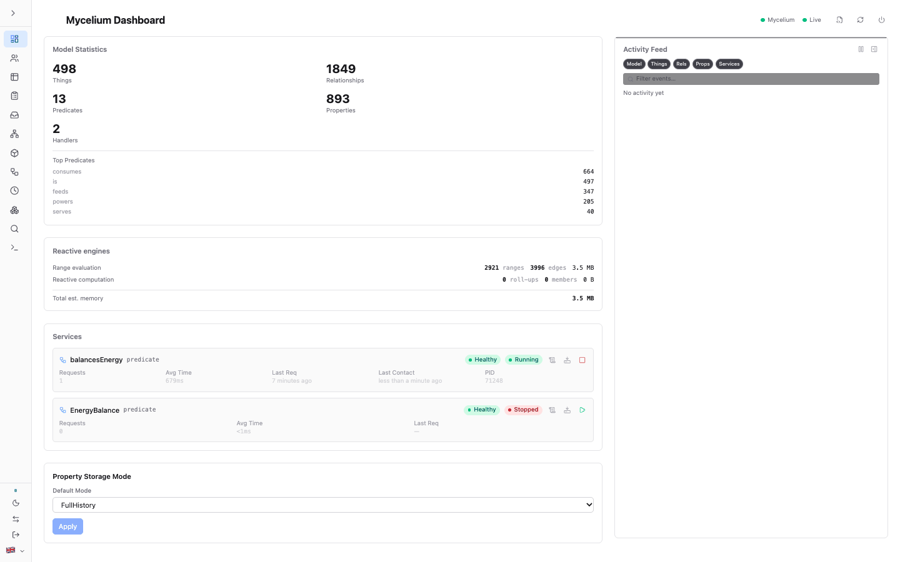

The rail's footer holds what is the same on every page: the light or dark **theme**, **Switch
Model**, **Log Out**, and the **language**. Above the controls a model statement says whether the
stream is live, how many Things and relationships the model holds (*Reading the model…* until it
is loaded), and when the newest event arrived (*Nothing has moved yet* before one). Collapsed, only
the live mark stays, with the statement as its tooltip.

The theme toggle switches the whole console between day and night. Every other picture in this guide
is taken in day mode; here is the Dashboard in both.

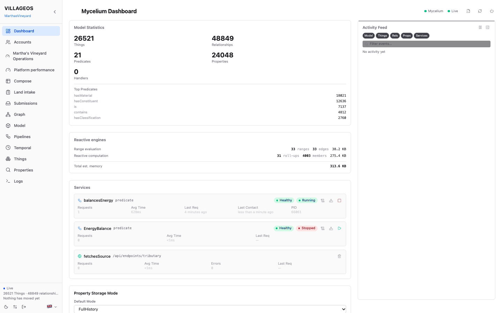

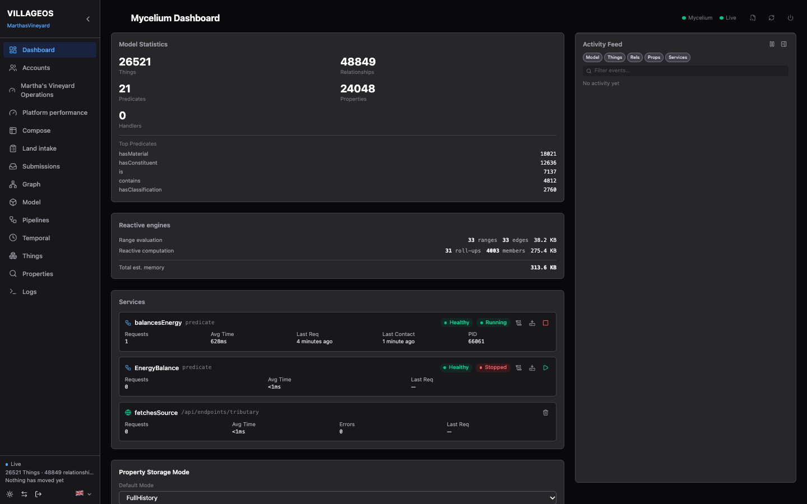

**Switching and saving models.** Switch Model opens the seed library: every seed file in the
server's seeds directory, searchable and sortable by name and size. Choosing one replaces the model
the session is on — the server clears what it holds, loads the seed, and the console re-scopes your
session to the new model; the graph resets and draws it. To move to a model that is already loaded,
sign out and choose it after signing in again. At the bottom of the same picker, type a name and
click **Save** to write the current model to the library; it appears in the list at once.

**A first model.** The console starts with an empty model. Put a seed file in the server's seeds
directory before starting it, or load one from the command line (`deserialize` in Taproot,
chapter 67), then open **Graph**. The shipped village seed is the one to learn
on: it has kinds several levels deep, energy, water, biodiversity and transport relationships, and
building geometry for the 3D views.

### 47. The graph page
The Graph page draws every Thing as a node and every relationship as an arrow, laid out by a force
simulation: Things with many relationships drift to the centre and leaf Things to the edge.

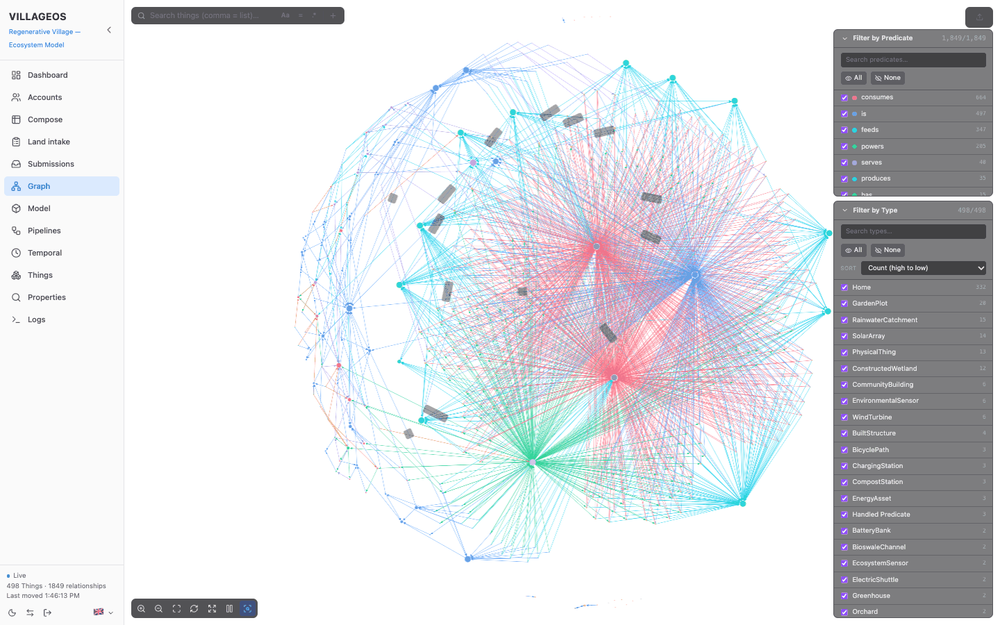

**What you see.**

- **Node size** follows how many relationships point at a Thing, so kinds and hubs are large and
  leaves small.
- **Node colour** is read from the data. Kinds — anything that is the target of an `is` — are blue.
  Predicates — `is`, `has`, `feeds` — are amber. A member is coloured by the property the model's
  display settings name as its classifying property, or by its kind, so every home shares one colour
  and every solar array another; a new kind gets a distinct colour with no configuration. A Thing
  with no kind is grey.
- **Edge colour** is one colour per predicate, so every `consumes` relationship reads the same
  across the graph. A model may name the colour a predicate takes in its display settings; the rest
  are assigned from a fixed palette. The predicate menu uses the same colours.
- **Physical and logical Things.** A Thing carrying geometry — a building, a sensor mounted on one —
  is physical. A Thing without it — a kind, a predicate, an abstract concept — is logical, and is
  gathered under the nearest physical Thing it relates to. Logical Things are revealed by opening
  their parent, by searching, or by zooming in.

**Navigating.** Drag the background to pan; scroll to zoom, centred on the pointer.

| Toolbar control | What it does |
| --- | --- |
| **+** beside the search bar | Create a Thing by name, in place |
| **+** and **−** | Zoom in and out |
| **Fit** | Frame every node |
| **Re-layout** | Nudge every node so the simulation settles into a new arrangement |
| **Spread** | Push nodes apart while keeping their clusters; click again to return |
| **Pause** and **Play** | Freeze the simulation to read the graph as it stands; resume it |
| **Semantic zoom** | Open the logical Things near the pointer as you zoom in; close them all as you zoom out |
| **Layers** | The predicate menu, the same as a right-click on the background |

A top-right control imports a fragment file into the model. When clustering is active, the active
predicate and its relationship count appear on the toolbar with a control to clear it.

### 48. Inspecting a Thing or a relationship
**Click a node** and a panel slides in from the right. Its header carries the Thing's name with a
pencil: rename it in place, and the Thing keeps its identifier and every relationship. The panel
opens on **Ranges**, with **Properties** and **Relationships** beside it, and **3D** for a Thing
with geometry.

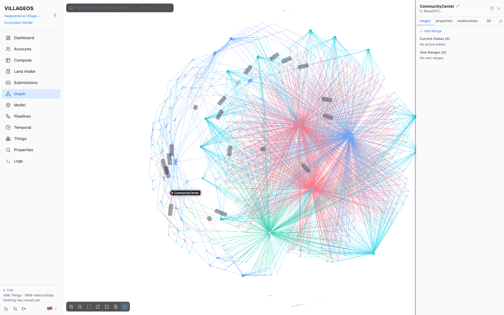

| Tab | What it shows |
| --- | --- |
| **Ranges** | The states the Thing currently holds as coloured badges; its own ranges with their criteria and whether each holds; the ranges it inherits, grouped by the kind that supplies them, each name a link to that kind; the ranges on every relationship it sits on; and, per binding, how far a value sits from its bounds. **Add Range** creates one from a name and a criterion; each own range has a delete control; an inherited range is removed from the kind that declares it. The tab holds a still picture of the world while you read it, so a stream of state changes does not shuffle the panel under you; the refresh control takes a fresh one |
| **Properties** | The Thing's own values, each formatted to its type — a date as a date, an identifier shortened, geometry as a summary, decimals to the precision the model's display settings ask for. Under them, what the Thing inherits, grouped by source, each group a link to that kind. The pencil turns on editing: each value becomes a field that follows its type (a checkbox, a date picker, a number field, a text box), saved on Enter or on clicking away, cancelled with Escape; a value the type cannot hold is refused before it is sent, naming the property. A row at the bottom adds a property with a name, a type and a value. Editing an inherited value creates an override on this Thing. Geometry is not edited here |
| **Relationships** | What points at the Thing and what it points to, each name a link. A chevron opens a relationship's own values for editing; an icon opens the relationship's own panel. In editing mode a row at the bottom of each list adds a relationship from a predicate and a Thing, and a **retype** row repoints the Thing's `is` to another kind in one step |
| **3D** | An auto-rotating view of the element. Drag to orbit, scroll to zoom. A container with no geometry of its own — a building, a storey — shows what it contains, coloured by element class |

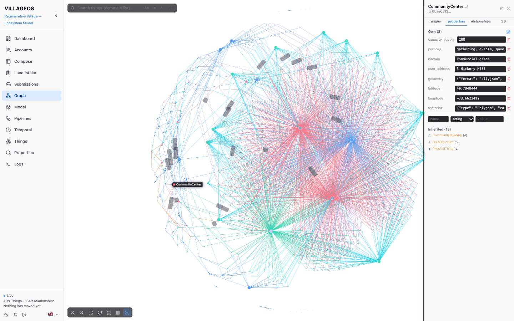

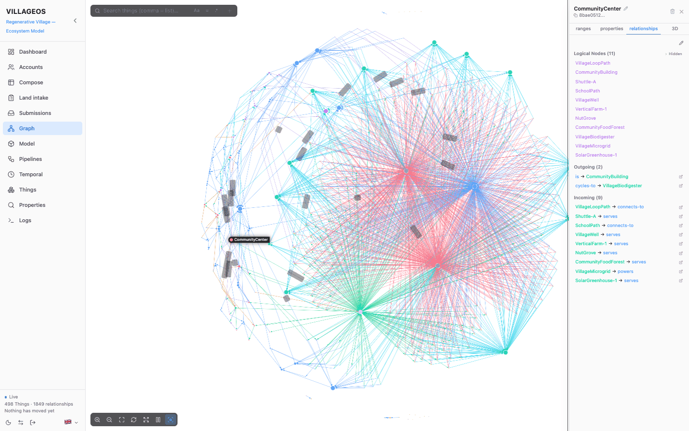

**Click an arrow** for the relationship's panel: its subject, predicate and target as links, its own
values with editing, its ranges and states, and a delete control.

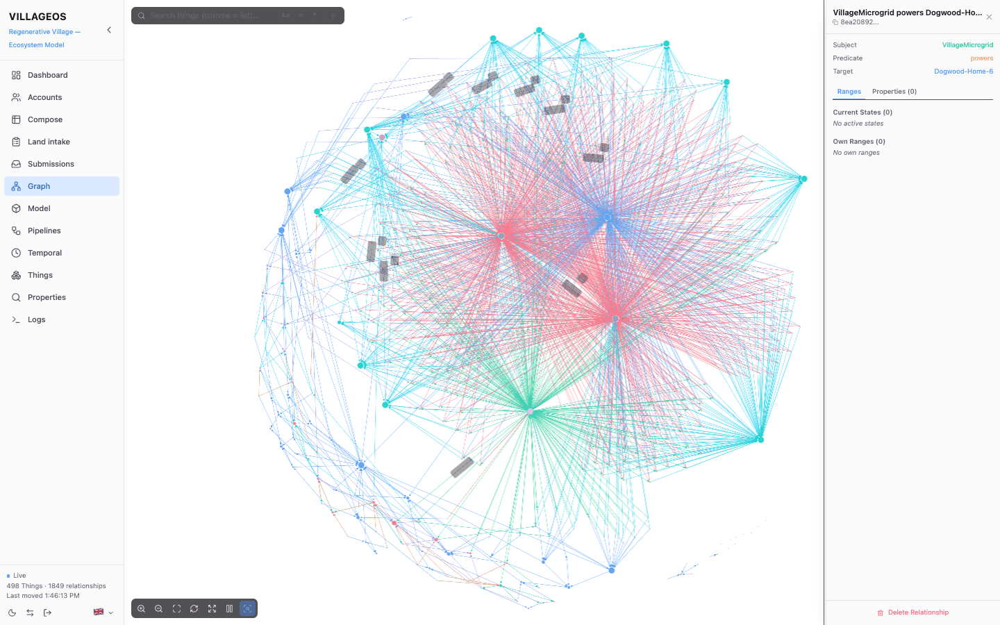

**Right-click a node** for a menu: view details, expand its relationships, show or hide the logical
Things under it, view it in 3D, copy its identifier, and delete it after a confirmation. Right-click
the background for the predicate menu (chapter 50). Click the empty background to
deselect everything and close every panel and menu.

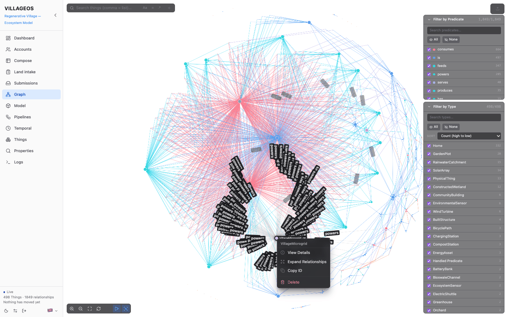

### 49. Searching
**On the graph page.** Type in the search bar and every Thing whose name contains the text stays
bright while the rest dim (physical Things) or hide (logical ones). Relationships are hidden unless
both ends match. The match count appears beside the bar. Three toggles change the matching:
**Aa** for case-sensitive, **=** for the whole name exactly, and **.\*** for a pattern
(`^Solar` for everything starting with Solar; `Sensor|Monitor` for either word). Several names
separated by commas highlight all of them and their neighbourhoods at once — the way to see what two
homes share. Clearing the bar restores the graph.

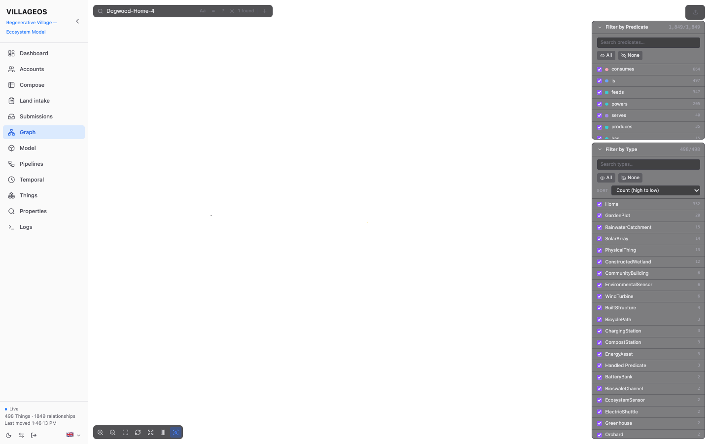

**The Things page** finds Things by name without drawing the graph, which matters on a large
model. Results update as you type and are ranked: an exact match first, then names that begin with
the text, then names that contain it, then Things whose identifier contains it. Each result shows
the name (a link that opens the Thing on the graph), its kind, a few of its own values, and how
many properties and relationships it has. The first hundred are shown, with a control for the next
hundred, and the whole result set can be copied or downloaded as a table.

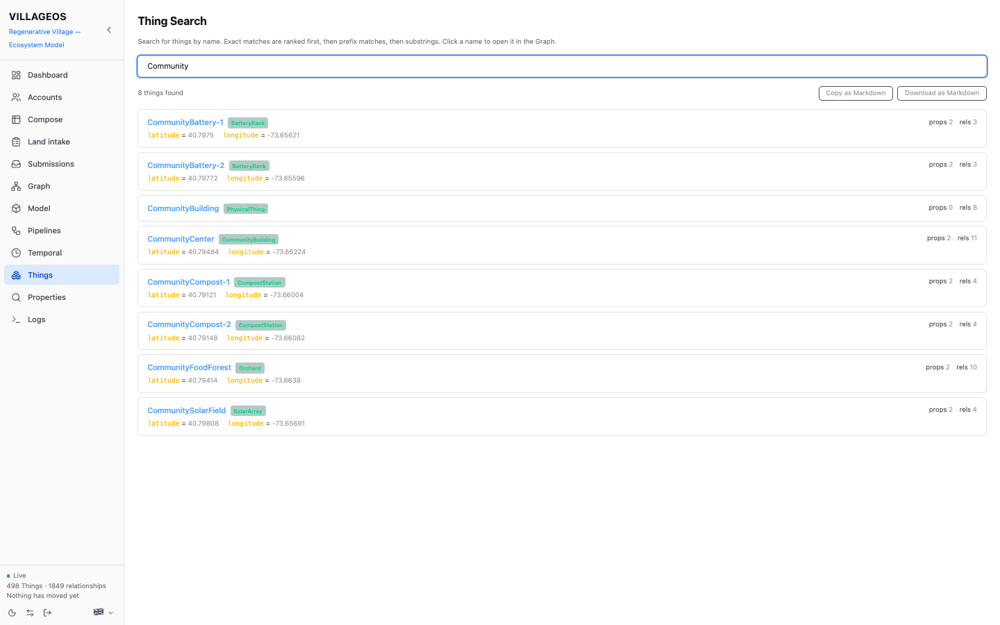

**The Properties page** searches by property name across every Thing and relationship — for when
you know a value exists but not which Things carry it. Results are grouped by property name, each
row naming the owner, whether the value is inherited and from where, and the current value; a row's
**history** control shows every past value.

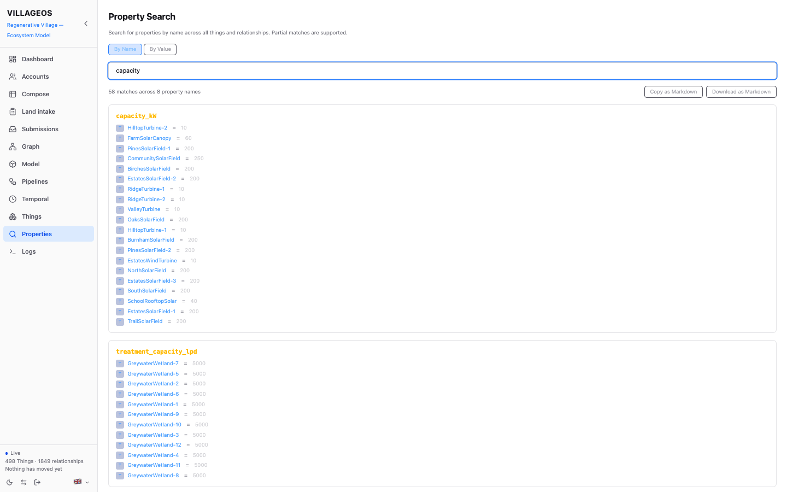

| To find | Use |
| --- | --- |
| The Thing called Building-A | Things |
| Every Thing named something like Sensor | Things |
| Every Thing that has a `temperature` property | Properties |
| Which Things have a `quantity` below target | Properties, then open the owners |

### 50. Clustering by predicate
Right-click the graph background and a radial menu lists every predicate in the model, ordered by
how many relationships use it, each with its colour and count. Click one to cluster on it; click
several to cluster on several. The choice is the same one the **Filter by Predicate** panel on the
right makes: the predicate's entry there follows the menu, and its count of hidden relationships says
how many left the view.

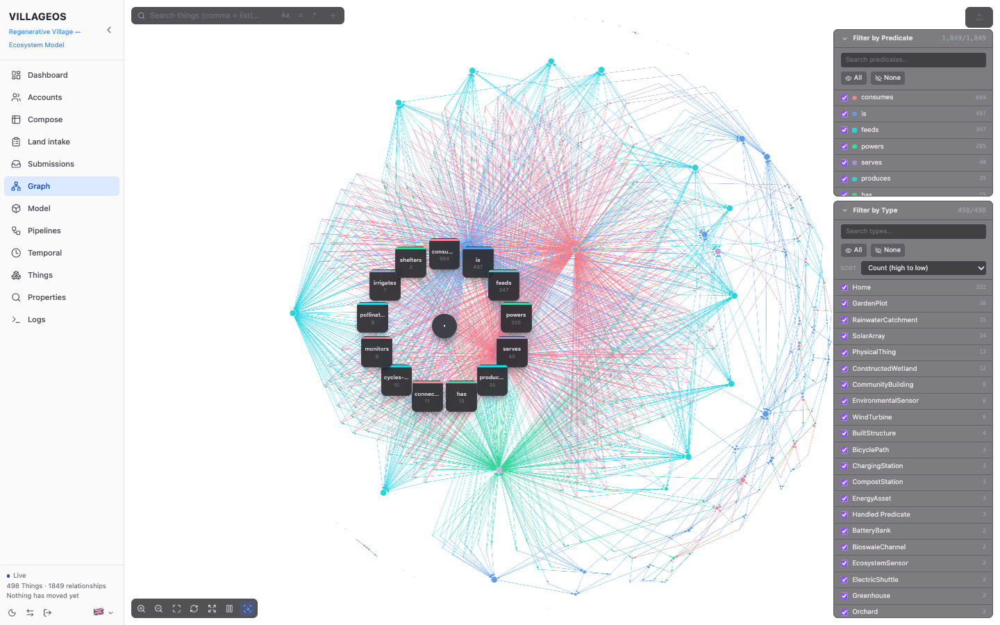

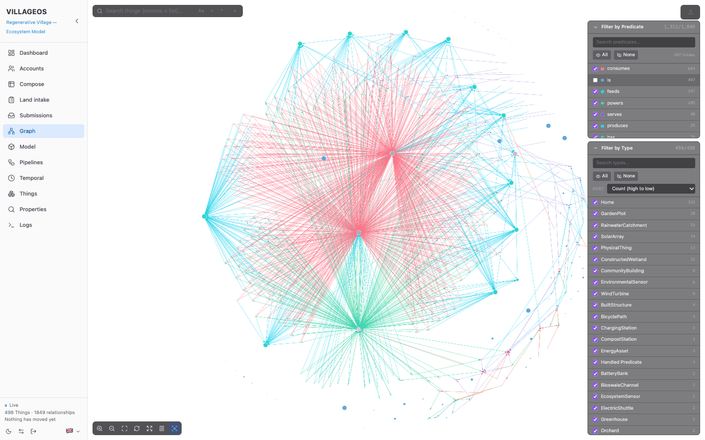

With `is` active, every kind gathers its members around it at full brightness, the predicates
shrink to dots, unclustered Things dim, and the `is` arrows appear. A large cluster starts folded
into one node with a count badge — click it to open. Double-click any node in cluster mode to show
all of its relationships at reduced brightness, not only the clustered ones. The toolbar shows the
active predicate, a control to open or fold every cluster, a toggle to hide rather than dim the other
relationships, and a control to clear clustering.

`is` shows the kind hierarchy; `has` shows containment; `feeds` shows how resources flow.

### 51. The building model in 3D, and the map
There are two 3D views, with different gestures.

**The Model page** draws the whole building model at once, from the render file the importer wrote
beside the seed; a model loaded without one says how to make it.

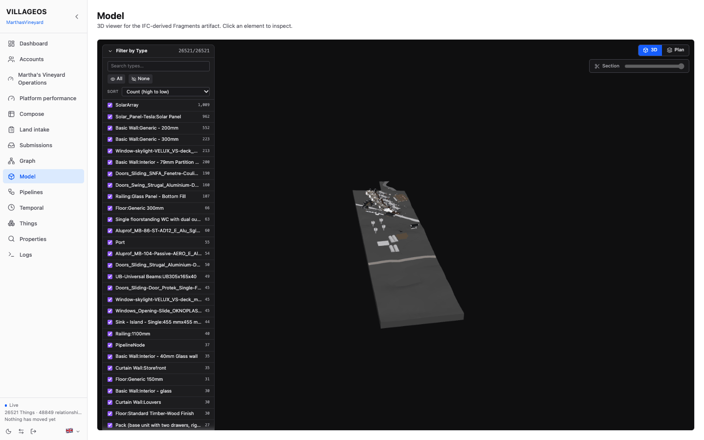

| Gesture | Action |
| --- | --- |
| Left-drag | Orbit around the model |
| Right-drag, or Shift, Cmd or Ctrl with a left-drag | Pan across the screen |
| Scroll, or middle-drag | Zoom |

Click an element to open the same panel the graph page uses. The filter in the corner hides or
shows whole element types; hiding every type empties the view. In the overhead (plan) camera mode
orbiting is off; pan and zoom still work. Dropping a building-model file onto the page posts it to
the Xylem service, which runs the importer and applies the result to the model, so no local tooling
is needed.

A **map** sits in the bottom corner, centred on the average position of the Things that carry a
latitude and longitude, with a marker and the coordinates beside it; **Recentre** returns to the
marker. What the map draws comes from the model: it declares the basemaps it offers, and the map
names each as a button when there is more than one. A model that declares terrain draws the ground
in relief, raises the buildings its basemap carries, and lets the camera tilt to the horizon; a
control shows where north lies as the map turns. A model that declares no basemap says so in place of
the map. Chapter 95 says how a model declares one.

**The 3D tab** on a Thing's panel shows one element, auto-rotating: drag to orbit, scroll to zoom.
Panning is deliberately off, so the element never drifts out of frame.

Safari limits how many drawing surfaces a page may hold, so the 3D tab is hidden there; if the
graph goes blank on Safari, resize the window, or reload the page.

### 52. The Dashboard page
The landing page after sign-in, in four parts.

**Model statistics.** Counts of Things, relationships, distinct predicates, properties and
registered services, and the most-used predicates.

**Reactive engines.** What the two engines are carrying for this model: registered ranges and the
edges they watch, derived-value definitions and the members they reduce over, and an estimated
memory footprint for each. The card refreshes when the model changes and when a range or definition
is registered. Before the first load, or while the connection is down, it reads *Metrics
unavailable* rather than zeros.

**Services.** One card per connection the model routes to — graph connections reached through a
predicate, and request connections reached through an address — each with its request count,
average response time and last request. A graph connection also shows its supervised process: a
health badge (Healthy, Unhealthy, Unreachable, or Unknown before the first check), a running badge,
whether the process was started outside the server, its process identifier and last contact, and
**Start** and **Stop** controls for an administrator. A request connection shows its error count
and a **Delete** control that removes the connection from the model after a confirmation — distinct
from Stop, which only ends the process.

**Activity feed.** Every change to the model, live: a Thing created, a relationship created, a
property changed, a service called, each in its own colour. A *property observed* is a reading
delivered to a subscription that asked for readings — a published page asks, the navigation does
not — so the feed shows one only while such a page is open. The feed keeps the most recent two
hundred. **Pause** freezes it and counts what arrives meanwhile; **Play** shows them. Chips at the
top show or hide the Model, Things, Relationships, Properties and Services categories. The panel
collapses and resizes, and remembers its height.

The top-right controls show whether the server and the live streams are connected, open the
server's interactive route listing, **reload the seeds** (discard the current model and load the
seeds directory again), and **shut the server down** after a confirmation.

### 53. Reading a published page
A dashboard is a page the model publishes, and the console draws it without knowing what it is
about. Every word on it is the model's; the widgets are the console's. Chapter 20 lists what a page
can show. As a reader:

- A **switcher** at the top of a page that compares entities narrows every widget to one site, or
  shows every site side by side.
- A **dotted rule** under a figure means the model derived it, and it opens to show what it is
  made of: the Things counted, the members summed and what each contributed, the buckets a
  trailing-window figure was folded from. A row in the evidence opens that Thing's detail window.
- A figure that reads ***not assessed*** has an input nobody has supplied yet. That is a real
  answer, not a fault, and the page names what is missing.
- A **footnote** under a figure says where it came from — stated by a submitter, fetched from a
  source on a date, assumed by the platform — read from how the property is declared.
- A **Thing detail window** opens from any row: the states it holds, a timeline of its state
  changes with the write that caused each, its properties, the Things involved, and every service
  the platform dispatched on it with how each dispatch ended. The timeline says how far back it
  reaches; an empty one reads as *not retained*, never as *never happened*.

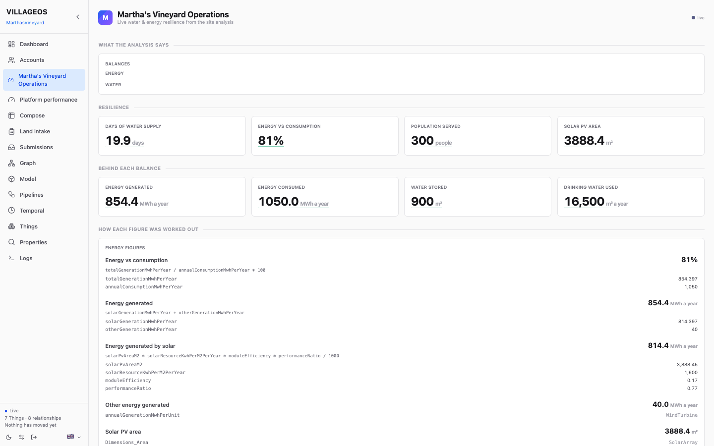

A page refreshes its trailing-window figures on the cadence it declares, and every figure that
depends on a derived state re-reads the moment that state moves.

**Compose** builds a table with no seeding at all. Choose a kind, and the page offers what the model
declares for it: its properties up its `is` chain with an example value, the links its members carry
outward and inward with the kind at the far end, and the states it derives. Every choice becomes a
column, a filter or the sort; a link column shows the name of the Thing at the far end, or a property
of it, or walks on along another link; **In state** keeps only the rows holding a state, and
**Where** keeps only the rows whose property satisfies a comparison. **Keep as a page** writes the
table as a page of the model's own, in the rail at once for everyone; a kept page can be renamed or
removed, and a seeded one cannot. **A moment in time** reads the same table as the model stood at an
instant — with no state column, because a state at an instant is not something the platform
answers.

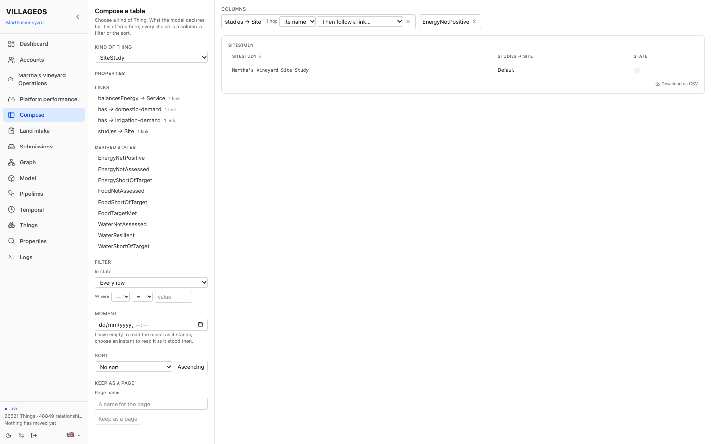

### 54. The Accounts page
**Accounts** is neither a page the console ships nor one a model publishes: the platform declares it,
as a page description, to an administrator, and the console draws it exactly as it draws a model's
own pages. Anyone who is not an administrator sees no such entry.

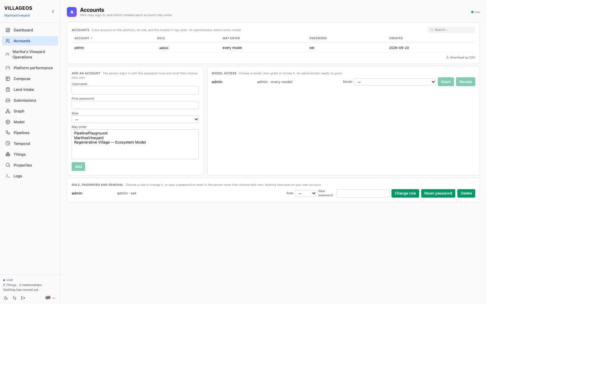

Every read and write on it goes to the platform's administration route. An account added or reset
here signs in with the password typed and must then choose its own. An account holds one role and
enters only the models it is granted; an administrator enters every model and needs no grant.
Nothing on the page acts on the administrator's own account. The same acts are the `user` commands
in Taproot (chapter 68), through the same route, so the two say and refuse the
same things.

### 55. Time and the log
**Temporal** reads the model's past: property changes across the model or for one Thing, the model
as it stood at an instant, one property's history, and which Things held a state. Each tab takes a
time range and asks the platform's temporal reads (chapter 30).

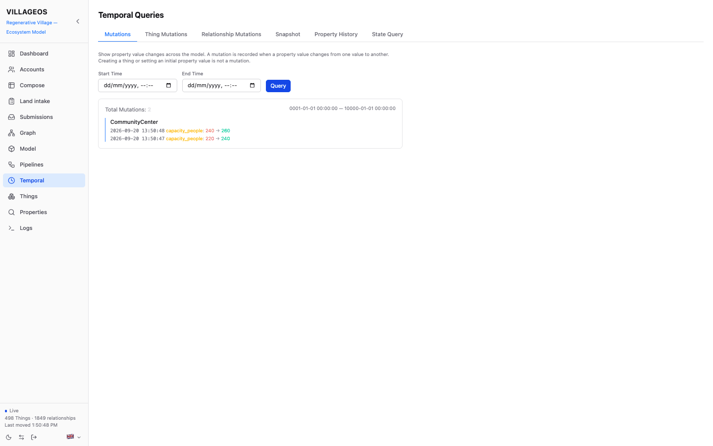

**Logs** tails the server's log as it is written, with a pause, a snapshot, and the whole file to
download.

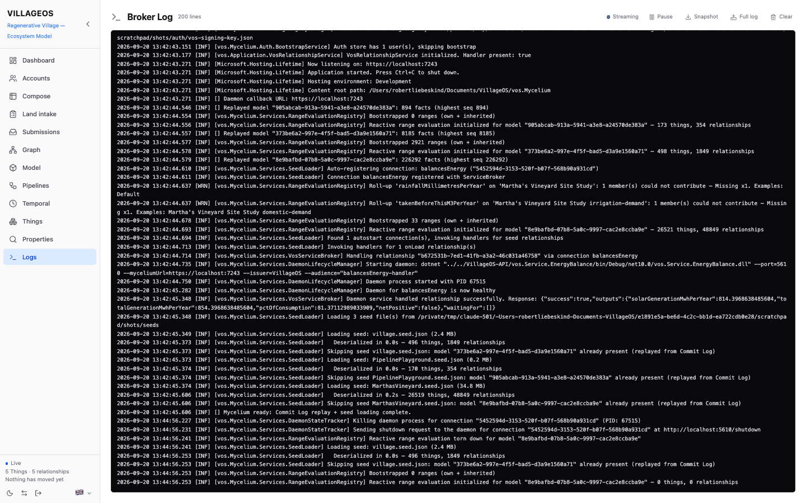

### 56. Creating and changing data
Everything is done in place on the graph page.

| To | Do |
| --- | --- |
| Create a Thing | **+** beside the search bar, type a name, Enter. It appears at once |
| Add a property | Select a node, pencil, the row at the bottom of the property list: name, type, value, Enter. The field stays focused for the next one |
| Edit a property | In editing mode click a value; Enter or click away saves, Escape reverts; a blue border marks an unsaved change. Editing an inherited value creates an override |
| Delete a property | The bin on its row. An inherited property cannot be deleted, only overridden |
| Create a relationship | Select a node, pencil, the row at the bottom of the outgoing or incoming list: pick a predicate (known predicates first) and a Thing, then **+** |
| Edit a relationship's values | Open its chevron, or click the arrow on the graph |
| Delete a relationship | Click the arrow, **Delete Relationship**, confirm |
| Delete a Thing | Right-click, **Delete**, confirm |
| Retype a Thing | In editing mode, the retype row on the Relationships tab |
| Add a range | The Ranges tab, **Add Range**: a name and a criterion |

A change you make appears on every other open console through the live stream, and a deletion you
make comes back to you the same way. Export the model before a destructive change: `serialize` in
Taproot, or the save control in the seed library.

Whole-model operations — export, import, clear — are the command line's (chapter
65).

### 57. Land intake, from either end
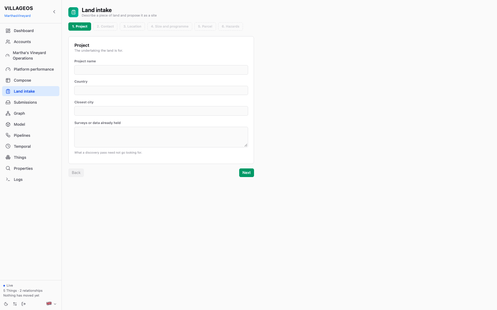

**From the console**, the Land intake page walks five steps: project, contact, location, size and
programme, parcel. You can move between any step already visited, and progress is written to browser
storage on every keystroke, keyed by the model, so closing the tab loses nothing; a posted
submission clears its draft. The page is offered only where the console was built with an intake
service's address; otherwise the submit button says so and stays disabled.

- **Location.** Paste a map link and the coordinates are read out of it — a pinned place, a viewport
  centre, a coordinate pair, a marker, or a bare pair typed by hand. A pair that could not be a
  point on Earth is refused. A shortened link cannot be opened from the page, so it says to open the
  link and copy the numbers. Once both coordinates are given the site appears on the map.
- **Size.** Type an area in hectares or acres; it is stored in hectares and the other unit is shown
  beneath. An area that is not a figure is left out rather than sent as zero.
- **Programme.** The categories come from the model's own vocabulary, so the page cannot offer a
  term the service would refuse. Choosing one takes an equal share and leaves the rest in proportion;
  dropping one gives its share back; setting one moves the difference across the others. The shares
  always describe the whole parcel, as whole numbers that add to a hundred.
- **Parcel.** Place a draft square of the stated area and drag its corners, or click corners onto
  the map. The drawn area is measured on the sphere — flat arithmetic reads a northern parcel at
  nearly twice its size — and compared with the stated area; within tolerance the two read as a
  match, outside it the page says how far apart they are. The boundary is posted with how it was
  obtained, as a term the model declares, so a generated square never reads as a surveyed boundary.
- **Sending.** The submission goes once the contact's address is verified: **Send a code** asks the
  intake service to mail one, and entering it posts the submission.

**From the public site**, a member of the public fills in the same steps on a page that holds no
sign-in and talks to the intake service alone; it is the same wizard, so a field added to one appears
on the other. A second, plot-first page runs beside it: the map comes first with an address search,
the land register's boundary is fetched where one covers the clicked point, the report appears as a
grid of themed tiles before any question is asked, and the programme, population and household size
are dials on the report. A submitter receives a code at the address they gave, answers it, and
afterwards can open a **findings page** to read what the platform worked out about their land — the
model's own dashboard, with every personal detail withheld — share survey files, and open the parcel
on the satellite imagery the model declares with the report's sections as tabs along the bottom.

### 58. Reviewing what has arrived
The **Submissions** page lists what has arrived in this model: when, what it proposes, and what
has been decided about it — **Waiting** for no decision. Decided rows leave the queue; **Show
decided** brings them back. On a model that takes no submissions the page says so rather than
listing nothing.

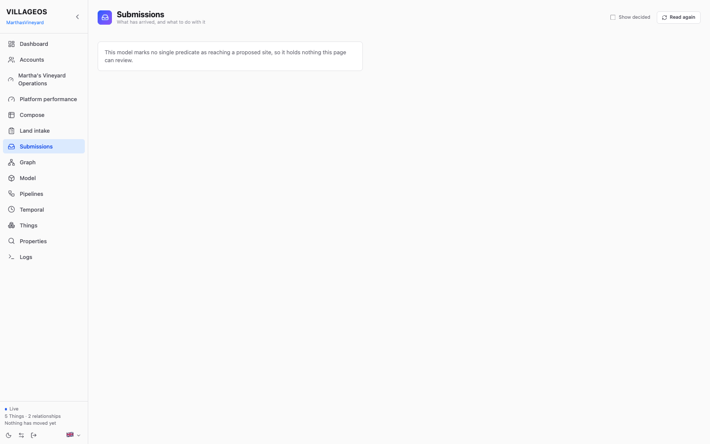

- **Reject** relates the submission to the disposition that names a retention period, and records
  when the decision was made. The row leaves the queue and stays gone, because the decision is in
  the model rather than on the page.
- **Promote** copies the site the submission proposes — never the record of the arrival — into a
  project model built from a template, then marks the submission promoted. The dialog asks for the
  template, what travels with the site (offered from the predicates the model actually asserts
  through), and the project's name. Promoting the same submission twice produces one project,
  because the server derives the project's identifier from the submission; the button stays enabled
  and the server keeps the promise.

The same three actions are `submissions list`, `reject` and `promote` in Taproot, so a staging
model can be worked from a browser or a terminal. Clearing rejected submissions once their period
has run is `submissions dispose`, a retention pass with no page.

The page finds all of this by the marks the model puts on its own vocabulary, never by name. A model
marking none says so in place of the list.

### 59. Keyboard and mouse reference
| Input | Action |
| --- | --- |
| Scroll | Zoom, centred on the pointer |
| Drag the background | Pan |
| Click a node | Select it, open its panel |
| Click an arrow | Select the relationship, open its panel |
| Click the background | Deselect all, close panels and menus |
| Right-click a node | The node menu |
| Right-click the background | The predicate menu |
| Double-click a node | In cluster mode, show all its relationships |
| Hover a node | Brighten its relationships |
| Escape | Close any menu |

Two habits pay off. Start with the whole graph, then cluster by one predicate at a time. Search
`Home-1, Home-5` to see what two Things share. The force layout reads its strength from the model's
display settings, so a model whose graph settles too tightly or too loosely is tuned there rather
than in the console.

### 60. Taproot, the command line
Taproot is an interactive shell with command history and line editing, running against a Mycelium
over its request interface. It needs a key, read from the `VOS_API_KEY` environment variable and
never from the command line: a command line is readable by every program on the host for as long
as the shell runs, and the shell writes it to its history file, while a key keeps working until
somebody revokes it. The first start wrote a key to `bootstrap-credentials.txt`; an administrator
creates more (chapter 74).

```bash
export VOS_API_KEY=vos_ak_...
cd vos.Taproot
dotnet run
```

```text
 __     ___ _ _                   ___  ____
 \ \   / (_) | | __ _  __ _  ___ / _ \/ ___|
  \ \ / /| | | |/ _` |/ _` |/ _ \ | | \___ \
   \ V / | | | | (_| | (_| |  __/ |_| |___) |
    \_/  |_|_|_|\__,_|\__, |\___|\___/|____/
                      |___/
              C L I
VillageOS CLI - Connected to Mycelium at https://localhost:7243
Type 'help' to see available commands.
Successfully authenticated with Mycelium.

>
```

| Setting | How |
| --- | --- |
| The server's address | `--mycelium-url=https://host:7243` on the command line, else `VOS_MYCELIUM_URL`, else `https://localhost:7243` |
| The key | `VOS_API_KEY` only |
| A development server's self-signed certificate | `VOS_INSECURE_TLS=true` — never in production |

The key is exchanged for a short-lived pass, renewed on its own. Up and Down recall earlier commands.
`help` prints the whole reference, grouped as the next chapter groups it; `exit` leaves.

**Naming a Thing.** Wherever a Thing is named you may give its identifier or its name,
case-insensitively. A name shared by two Things is refused with both identifiers listed. Add
`--showguids` (or `-g`) anywhere in a command to print identifiers beside names. Timestamps are
written `2026-01-15T12:30:00Z`, in universal time, or as `now`.

### 61. The commands
| Command | What it does |
| --- | --- |
| `create thing <name>` | Create a Thing |
| `create property <thing> <name> <type> <value>` | Add a property; the types are `string`, `int`, `long`, `double`, `float`, `decimal`, `bool`, `datetime`, `guid` |
| `create rel-property <relationship id> <name> <type> <value>`, `delete rel-property <relationship id> <name>` | Add or remove a property on a relationship |
| `create relation <subject> <predicate> <target>` | Create a relationship |
| `rename <thing> <new name>` | Rename in place, keeping the identifier and every relationship; the name may contain spaces |
| `retype <thing> <kind>` | Repoint a Thing's `is` to another kind |
| `delete thing <thing>`, `delete relationship <id>`, `delete property <thing> <name>` | Remove |
| `get thing <thing>` | The Thing as structured text |
| `set <thing> <name> <value>` | Set a property |
| `find thing <pattern>`, `find relationships <thing>` | Find by name; a Thing's relationships in both directions |
| `list things`, `list relations`, `list predicates` | Everything; predicates with how often each is used |
| `query property <name> <value>`, `query predicate <name>` | Things by property value; relationships by predicate |
| `query stats` | Counts of Things, relationships, properties and predicates |
| `temporal snapshot [instant]` | The whole model at an instant |
| `temporal at <thing> <instant>` | A Thing as it stood then |
| `temporal history <thing> <property> [from] [to]` | Every version of a property |
| `temporal mutations [thing \| rel <id>] [from] [to]` | Every property change, model-wide or for one object |
| `range create <thing> <name> <criterion>` | A range, optionally with `--property`, `--bounds-min`, `--bounds-max` |
| `range list <thing>`, `range get <thing> <name>`, `range delete <thing> <name>` | Own and inherited ranges |
| `range validate <criterion>` | Whether a criterion parses, and where it went wrong |
| `state <thing>` | The states a Thing holds and every range's evaluation |
| `state query <state>` | Every Thing in a state, kinds left out |
| `engines [ranges \| rollups]` | What the two engines carry, and each reactor in detail |
| `snapshots` | What subscription snapshots have cost against the writers |
| `list handlers`, `list services` (`list agents`) | Every connection bound to a service with what the platform resolves for it; every registered service with its health and process |
| `start service <service>`, `stop service <service>` | Start a service's process; stop it |
| `serialize [file]` (`seed`) | Export the model as a seed, to the screen or a file |
| `deserialize <file>` | Replace the model from a seed |
| `plant <file> [mode] [--ringbuffer=N] [--samplerate=N]` | Import a seed and set every property's retention |
| `apply <file>` | Merge a fragment into the live model |
| `ingest <file.ifc> [--new] [--name=] [--url=]` | Upload a building model to Xylem, merging or replacing |
| `seeds list`, `seeds status`, `seeds load <name>`, `seeds save <name>`, `seeds reload` | The seed library and the startup load |
| `model list`, `model switch <id or name>` | The models the server holds; move the session to another |
| `config mode [Mode]`, `config mode get <thing> <property>`, `config mode set <thing> <property> <Mode>` | Retention: the default, and one property's |
| `mycelium status`, `mycelium endpoints` | Startup progress; the request connections the model registers |
| `submissions list`, `submissions reject <id>`, `submissions promote <id> <template> <predicates> <name>`, `submissions dispose <predicates>` | Review, and the retention pass |
| `user list` | Every account, its role, the models it may enter, whether its password must change, and when it was created |
| `user create <username> <role> [<model name>]` | Add an account, prompting for its first password, which the person must change at first sign-in |
| `user grant <username> <model name>`, `user revoke <username> <model name>` | Let an account enter a model, or take one off it; the model's name is the rest of the line |
| `user role <username> <admin\|editor\|viewer>` | Change an account's role |
| `user reset-password <username>` | Set a password the person must then change, prompting for it |
| `user delete <username>` | Remove an account |
| `user change-password <user id>` | Change your own password, prompted for, never on the command line |
| `clear model`, `shutdown` | Remove every Thing and relationship; stop the server and every service |
| `pwd`, `cd <path>` | The working directory files are read from and written to |

### 62. Things, properties and relationships from the shell
```text
> create thing Forest
Created Thing: Forest

> create property Forest biomeType string Temperate
> create property Forest carbonLevel int 30

> get thing Forest
{
  "Id": "3fa85f64-5717-4562-b3fc-2c963f66afa6",
  "Name": "Forest",
  "Properties": { "biomeType": "Temperate", "carbonLevel": 30 }
}

> set Forest carbonLevel 35
Set carbonLevel = 35 on Forest
```

A search over the village seed, as the console printed it:

```text
> find thing Community
Found 8 thing(s) matching 'Community':
  CommunitySolarField
  CommunityBattery-2
  CommunityCompost-2
  CommunityFoodForest
  CommunityCenter
  CommunityBattery-1
  CommunityBuilding
  CommunityCompost-1
```

A relationship joins a subject to a target through a predicate, and the predicate is a Thing you
create first:

```text
> create thing Watershed
> create thing part_of
> create relation Forest part_of Watershed
Created Relationship: Forest --[part_of]--> Watershed

> find relationships Forest
Relationships for thing 'Forest':
  As Subject (1):
    Forest --[part_of]--> Watershed
  As Target (0):
    (none)

> list predicates
Predicates (1):
  part_of (used in 1 relationship(s))
```

A Thing made, related, listed and removed again, as the console printed it:

```text
> create thing Orchard-Test
Created Thing: Orchard-Test
> create relation Orchard-Test feeds CommunityCenter
Created Relationship: Orchard-Test --[feeds]--> CommunityCenter
> find relationships Orchard-Test
Relationships for thing 'Orchard-Test':
  As Subject (1):
    Orchard-Test --[feeds]--> CommunityCenter
> delete thing Orchard-Test
Deleted thing Orchard-Test
```

`query property biomeType Temperate` lists every Thing with that value; `query stats` gives the
model's counts and the relationships per predicate.

### 63. Time from the shell
```text
> temporal snapshot 2026-01-15T12:00:00Z        # the whole model as it stood
> temporal at Forest 2026-01-15T12:00:00Z       # one Thing, with its relationships then
> temporal history Forest carbonLevel           # every version, oldest first
{
  "Versions": [
    {"Timestamp": "2026-01-01T10:00:00Z", "Value": 25},
    {"Timestamp": "2026-01-15T14:30:00Z", "Value": 30},
    {"Timestamp": "2026-02-01T09:00:00Z", "Value": 35}
  ]
}
> temporal mutations Forest 2026-01-01T00:00:00Z 2026-01-31T23:59:59Z
```

`temporal mutations` on its own covers the whole model; `rel <id>` asks about a relationship.
Naming no window asks about everything still kept. A property that keeps only its current value has
no history to answer with. One Thing's changes after a property was edited, as the console printed
it:

```text
> temporal mutations CommunityCenter
{
  "ObjectId": "8bae0512-37ad-4ee1-b33c-4753c8710a5d",
  "ObjectName": "CommunityCenter",
  "Mutations": [
    { "Timestamp": "2026-09-20T12:16:48.691831Z", "PropertyName": "capacity_people",
      "OldValue": "220", "NewValue": "240" }
  ]
}
```

### 64. Ranges and states from the shell
```text
> range create Sensor overheating "temp > 100"
> range create Sensor nominal "temp >= 20 AND temp <= 80" --property temp --bounds-min 20 --bounds-max 80
> range validate "temp >> 100"
Invalid criteria: Parse error at position 5: Unexpected character '>'

> state Sensor
{
  "CurrentStates": ["overheating"],
  "RangeEvaluations": [
    {"RangeName": "overheating", "IsActive": true,  "Criteria": "temp > 100"},
    {"RangeName": "nominal",     "IsActive": false, "Criteria": "temp >= 20 AND temp <= 80"}
  ]
}
> state query overheating
```

A range declared and the Thing's states read back, as the console printed it — the answer carries
the comparison the criterion makes, which is what a page's verdict sentence reads its target from:

```text
> range create Orchard-Test enough-trees trees>=100
{
  "Name": "enough-trees",
  "Criteria": "trees>=100",
  "IsInherited": false,
  "Bindings": [],
  "Comparisons": [ { "PropertyName": "trees", "Operator": ">=", "Value": 100 } ]
}
> state Orchard-Test
{
  "ObjectName": "Orchard-Test",
  "CurrentStates": [],
  "RangeEvaluations": [ { "RangeName": "enough-trees", "IsActive": false, "Criteria": "trees>=100" } ]
}
```

A range on a kind is inherited by every member and appears under **InheritedRanges** in
`range list`, named with the kind that supplies it. Chapter 24 has the language; two habits from it
matter here. Write `MATCHES` patterns with a dot for the decimal point, because a number is turned
into text in one fixed format before the pattern is tried. And guard a verdict with `IS KNOWN` and
give the unanswered case a range of its own, because every other comparison reads an absent value as
*not satisfied*, exactly as it reads a value that fell short:

```text
> range create "Site Study" EnergyNetPositive "pctOfConsumption IS KNOWN AND pctOfConsumption >= 100"
> range create "Site Study" EnergyNotAssessed "pctOfConsumption IS UNKNOWN"
```

### 65. The engines and the cost of reading
`engines` shows what the two engines carry for the current model — counting only; reading it
evaluates nothing:

```text
> engines
Reactive engines — Regenerative Village — Ecosystem Model
  Range evaluation        2924 ranges      3999 edges      3,5 MB
  Reactive computation       0 roll-ups       0 members    0 B
  Total est. memory     3,5 MB

Drill in: engines ranges | engines rollups
```

`engines ranges` lists each range with its owner, what it watches and its footprint; `engines
rollups` lists each derived value with its owner, what it watches and how it is declared — a total
over a path (`Sum(area) over SolarArray reached by <-is`) or a formula. The memory figures are
arithmetic over documented per-unit costs: a trend to watch, not a measurement of the process.

`snapshots` shows what subscription snapshots have cost against the writers: how many were served,
how many had to be taken again because a writer changed the model's structure mid-walk, and how
many gave up and took the lock. The totals run from the server's start and are not per model, so
measuring one run means reading before and after it.

### 66. Services from the shell
```text
> list services
Microservices (2):
  balancesEnergy [Running]
    Endpoint: http://localhost:5610
    Health: Healthy
  EnergyBalance [Stopped]
    Endpoint: http://localhost:5610
    Health: Healthy

> start service EnergyBalance
> stop service EnergyBalance
```

`list handlers` shows every connection bound to a service with the executable, run mode and trigger
the platform resolves for it. A service the model declares is shown stopped rather than removed
while its process is not running; a service that announced itself from outside is removed once its
health check fails three times. `stop service` ends a process the server started, or asks a process
started elsewhere to stop. `shutdown` stops the server and every service, and the shell loses its
connection.

### 67. Import, export, fragments and building models
```text
> serialize backup                # writes backup.json; the .json is added when missing
> deserialize mymodel.json        # replaces the model
Model loaded from mymodel.json
  Things: 15
  Relationships: 8
> plant seed.json RingBuffer --ringbuffer=50    # import and set every property's retention
> apply changes.json              # merge a fragment into the live model
Fragment applied from changes.json: 3 thing(s) created, 1 updated, 2 relationship(s) created.
> ingest building.ifc --url=http://localhost:6100 --name=Village
Ingested building.ifc: 1240 thing(s) created, 0 updated, 3180 relationship(s) created.
```

A fragment file is `{ "Name", "Things": [ … ], "Relationships": [ … ] }`. Applying it is
idempotent — re-applying neither duplicates nor errors — and the server resolves inheritance, so a
Thing may carry a value for a name it will inherit. An exported model carries each Thing's own
properties and its overrides keyed by the kind each overrides; loading one restores inheritance
without re-running any service. `ingest` uploads a building model to the Xylem service, merging by
default and replacing with `--new`. `pwd` and `cd` say where files are read and written.

### 68. Seeds, models, retention and accounts from the shell
```text
> seeds list                 # the seed files in the server's seeds directory
Library seeds:
  {"name":"MarthasVineyard.seed.json","sizeMb":34.8}
  {"name":"PipelinePlayground.seed.json","sizeMb":0.1}
  {"name":"village.seed.json","sizeMb":2.4}
> seeds status               # how far the startup load has got
> seeds load village         # replace the current model with that seed
> seeds save backup          # write the current model there as backup.seed.json
> seeds reload               # discard the current model and load the directory again
> model list                 # every model the server holds
Available models:
  PipelinePlayground (905abcab-913a-5941-a3e8-a24570de383a)
  MarthasVineyard (8e9bafbd-07b8-5a0c-9997-cac2e8ccba9e)
  Regenerative Village — Ecosystem Model (373be6a2-997e-4f5f-bad5-d3a9e1560a71)
> model switch MarthasVineyard
> config mode                # the default retention, its ring-buffer size and sample rate
Property Mode Configuration:
  Default Mode:     FullHistory
  Ring Buffer Size: 100
  Sample Rate:      100
> config mode RingBuffer --ringbuffer=100
> config mode set Home-1 temperature Sampled --samplerate=10
```

**Accounts.** An account holds one role — `admin`, `editor` or `viewer` — and enters only the
models it has been granted; an administrator enters every model and needs no grant. Every `user`
command but `change-password` goes through the platform's administration route, the same door the
console's Accounts page uses (chapter 54), so the command line and the console
say and refuse the same things, and a refusal is written in the route's own words. Every password is
prompted for rather than taken on the command line, so none is left in the shell's history. Nothing
acts on the caller's own account except `change-password`. Keys are still created and revoked over
the request interface. An account added, granted a second model, promoted and removed, with a
refusal, as the console printed it:

```text
> user create bo viewer Regenerative Village — Ecosystem Model
First password: viewer-first
Added bo as viewer; they must choose a password at their first sign-in
> user grant bo MarthasVineyard
bo may now enter MarthasVineyard
> user role bo editor
bo is now editor
> user list
Account   Role     May enter                                                Password                     Created
admin     admin    every model                                              set                          2026-09-20
bo        editor   Regenerative Village — Ecosystem Model, MarthasVineyard  must change at next sign-in  2026-09-20
> user revoke bo MarthasVineyard
bo may no longer enter MarthasVineyard
> user delete nobody
Error: 404 Not Found: {"error":"There is no account named nobody"}
> user delete bo
Deleted bo
```

### 69. Measuring the platform itself
The platform can measure what it costs — processor, memory, request timing, what each engine holds
— as Observations on Things a model marks measurable, shown on a page any model can install by
applying one fragment. Because a reading is an ordinary property value, history, retention,
thresholds and totals come free. Sampling is off until a deployment turns it on, and a server started
without it writes one line saying so; that line is what to search the log for when the page is
empty.

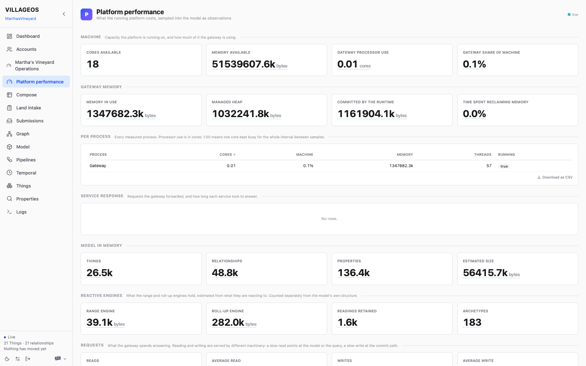

### 70. When something looks wrong
| What you see | Where to look |
| --- | --- |
| Every request is refused as unavailable | The server is still rebuilding from its record or loading seeds; the console shows the progress, and `seeds status` reports it |
| The console says *not signed in* over a plain `http` address | Sessions need a secure `https` origin; use the server's own secure address or the reverse proxy |
| The console's **Live** light is red | The stream has dropped; the console reconnects on its own within half a minute. A red **Mycelium** light means the server itself is down |
| A created Thing never appears on a page | The page's subscription did not cover it. A narrowed page is sent a Thing later typed into one of its kinds, but not one named by identifier or reached by a walk after the page opened; those arrive on the next open |
| The graph never settles | **Pause** it and read it as it stands |
| Search finds nothing | Check the case-sensitive, exact-match and pattern toggles; a pattern gives `.` and `(` special meaning |
| Taproot: *Could not connect* | The server is not running, or the address is wrong: `--mycelium-url=` |
| Taproot: *The SSL connection could not be established* | The server presents a certificate the machine does not trust — a development certificate. Set `VOS_INSECURE_TLS=true` for development only; install a trusted certificate for anything else |
| Taproot: *Unknown command* | Commands are case-insensitive; `help` lists them |
| A refused sign-in or key | Get a fresh key or pass; search the server log for the refusal, which names the key, the reason and the caller |
| A service reads *Unreachable* | Its health check failed three times. Check the service's own log in the server's data directory, that its port answers, and its executable path |
| A dashboard figure reads *absent* | Nothing has written that property yet, or the page names something the model does not hold; the page says which |
| A balance reads *not assessed* | Its input is unknown. Look for the service or discovery run that should have written it |
| The seed will not load | Run the validator (chapter 76): it names every problem in one pass |
| A range never activates | `range validate` the criterion; check the property values and the relationships the path walks. A criterion over a property nothing can supply answers false forever |
| "Unexpected token at position …" | A slip in a criterion: a missing quote, or a missing `AND` between two comparisons |
| "Cannot delete inherited range" | Delete it from the kind that declares it |
| State updates are slow | Many ranges reading one frequently written property, deep paths in criteria, or an oscillation; look for the unresolvable-cycle message in the log |

Every error the server answers carries a title, a status, a plain description and a trace
identifier that matches a line in the server's log.

---

## Part VIII — Installing and running it

*For the person who installs, configures and operates the platform.*

### 71. Two ways to get it
**From a release archive.** A build of the private repository publishes one archive holding the
server with the console already built in, the simulator, and the in-process test host. It needs
only the .NET runtime:

```bash
tar -xzf vos.Mycelium-<version>.tar.gz
cd vos.Mycelium
Seeds__Directory=/path/to/seeds VOS_ADMIN_PASSWORD=... dotnet vos.Mycelium.dll --urls http://localhost:7343
```

**From source.** Clone the two repositories side by side; the shipped seeds reach the services by
a path that climbs out of one repository into the other.

### 72. What you need
| Requirement | Needed for |
| --- | --- |
| The .NET 10 software development kit | The server, the tools, the command line and the C# services |
| Node 20.19 or later | Building the console; the building-model converter the importer calls |
| Python 3 | The seed generators, the simulator, the documentation tools |
| A modern browser | The console. Safari has limits the 3D viewer notes |
| Go, Rust | Only the example services written in those languages |
| Google Chrome | Only for rendering a guide to a printable document |

### 73. Build from source
```bash
# The server and its tools
cd VillageOS
dotnet restore
dotnet build

# The services and the command line
cd ../VillageOS-API
dotnet restore
dotnet build

# The console, built straight into the server's static directory
cd vos.Trellis
npm ci
VOS_MYCELIUM_WWWROOT=/absolute/path/to/VillageOS/vos.Mycelium/wwwroot npm run build

# The building-model converter, once, if you will import building models
cd ../../VillageOS/bim-fragments-converter
npm ci && npm run build
```

Without the console built, the server still answers requests and streams, and answers any other
address with a message saying how to build it. During console development skip the build and run
`npm run dev` in `vos.Trellis`, which serves the console on port 5173 and passes requests through
to the server.

### 74. The first start
```bash
cd VillageOS/vos.Mycelium
VOS_ADMIN_PASSWORD='choose-one' VOS_MASTER_KEY="$(openssl rand -base64 32)" dotnet run
```

The server listens on `https://localhost:7243`. On a first start with no accounts it:

1. Generates the key pair it signs every pass with, and keeps the private half in its data
   directory.
2. Creates the `admin` account. Its password is `VOS_ADMIN_PASSWORD` if set; otherwise a random one
   that must be changed on first sign-in. There is no weak default.
3. Creates a first administrator key.
4. Writes both credentials to `bootstrap-credentials.txt` in the data directory, readable by the
   owner only. Secure the file and delete it.

`VOS_MASTER_KEY` encrypts the account store and the signing key on disk. Without it they are
written in plain text and the server warns at startup. Set it in any real deployment and back it
up in a secret store, because losing it means the encrypted files cannot be read.

Startup continues in the background while the server is already reachable: it rebuilds every model
it finds in its persistence directory, loads every seed file in the seeds directory, and only then
marks itself ready. On a blank system there is nothing to rebuild and, until you add one, nothing
to load. Stop it with `Ctrl+C`, or with the shutdown route, which stops every service first.

### 75. Giving it a model
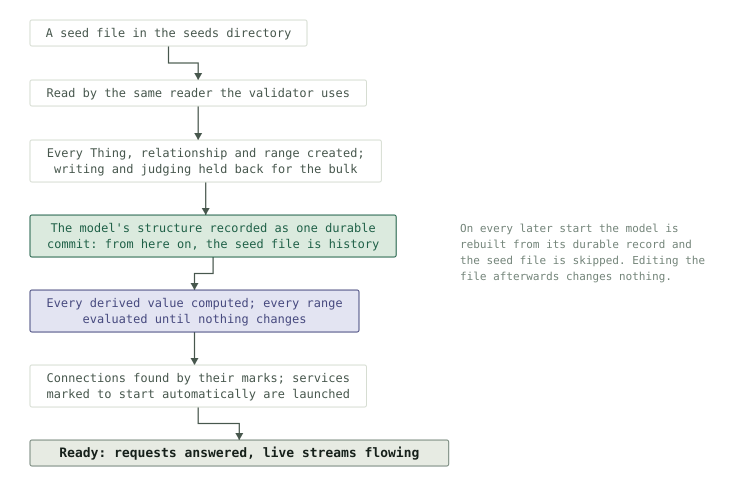

Four ways, all reaching the same loader:

| Way | When |
| --- | --- |
| Put a seed file in the seeds directory and start the server | The usual way; every seed there loads at start, each as a model of its own |
| Load a seed from the library while running: Switch Model in the console | To replace the model without restarting |
| `deserialize` in Taproot | From a terminal or a script |
| Create a model from a template | To add a model beside the ones loaded, built from a template in the `templates` folder under the seeds directory |

The seeds directory holds live models; `templates/` beneath it holds templates, which are copied
rather than loaded.

**The second start, and every one after.** The server finds each model's durable record, loads its
newest checkpoint, replays the record above it, and skips the seed file. Nothing about the seed
file matters any more; editing it changes nothing. To reload a changed seed, move the model's data
aside first.

### 76. Making a seed
| Way | Use it when |
| --- | --- |
| **By hand** (chapter 19) | The model is small, or you are learning what a seed is |
| **The demonstration generator** in the private repository's tools: a regenerative village with homes, energy, water, waste and transport, and a consumption simulation wired to the energy pool | A demonstration, or the pattern to copy for a generator of your own |
| **The building-model importer**: reads a building model in the Industry Foundation Classes format and writes a seed holding its spatial hierarchy, every element, type objects, materials and quantities, and optionally the render file the 3D viewer draws | A project that starts from a building model |
| **The importer with templates**: the same seed with the site analysis merged in — kinds matched onto elements by their class or name, the study with its assumptions, formulas and judge-ranges, the compute connection, the page | A site to be analysed |
| **A template-only import**: the templates as a seed with no building model | A model whose facts arrive from submissions rather than a building model |
| **Export from a running model**: `serialize` in Taproot, or save in the console's seed library | Snapshotting a model you edited by hand, or moving one between servers |
| **The pipeline playground generator** in the public repository's tools | Exercising the pipeline editor |
| **The layout importer** in the public repository's tools: builds a containment tree — a site, its rooms, the places within — from a naming pattern and a list of names, and applies it as one fragment | A physical structure measured off a drawing |
| **The simulator** in the public repository's tools: plays a timeline of changes against a live server at a chosen speed | Animating a model as if people and sensors were acting on it |

```bash
# A seed from a building model, with the site analysis merged in
dotnet run --project vos.Tools.ModelIngest -- --ifc AlderHollow.ifc --name "Alder Hollow" --profile analysis \
  --template vos.Tools.ModelIngest/site-analysis.template.json --template vos.Tools.ModelIngest/alder-hollow.analysis.template.json \
  --seed vos.Mycelium/seeds/AlderHollow.seed.json
dotnet run --project vos.SeedValidate -- --fix vos.Mycelium/seeds/AlderHollow.seed.json
```

Every generator ends with the validator's `--fix`, which normalises inheritance in the file and
then checks everything chapter 19 lists. A seed the validator accepts is a seed the server loads.

**Templates that ship.** The shared site analysis (the study kind with the technology's
assumptions, every output declared with its type and no value, the formulas and totals, the
judge-ranges, the water demands served in turn, the climate zones); the land-intake template (what
a submission is made of, and the vocabularies a form offers); the open-data sources every project
shares; and the basemaps a map may draw on. A project's own template adds its match rules, its
site-specific figures and its page, and is read after the shared one.

Exporting from a design tool: export in the IFC4 Reference View with base quantities, property sets
and type information included. Low coverage in the result almost always means an export setting
left off.

### 77. Services in a deployment
The server launches a service as a child process when something first needs it, or at load when
the service is marked to start automatically. The executable path is stated once on the service
kind as a template with a placeholder for the program's name, and each prototype supplies only its
name; a deployed layout changes that one value and nothing else. Every launched service binds only
the local machine and is reachable only through the server. On shutdown the server stops every
service it started and asks every other known service to stop, and reports any that did not.

### 78. Serving it to people
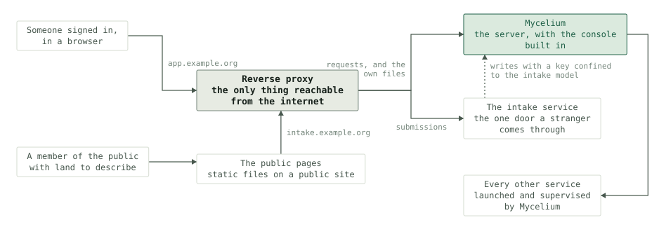

**One host, one proxy.** The reference deployment puts a reverse proxy in front: one hostname
sends requests to the server and every other path to the built console; a second hostname sends
everything to the intake service. The proxy provisions its own certificates. Every service answers only
on the machine itself and is unreachable except through the proxy; the server itself never reads a request's
host name.

**The intake service** is the one service that takes requests from strangers. It is started with
the addresses the public pages are served from, and with a mail host and sender, because a
submission is accepted only from somebody who answered a code sent to their address; it refuses to
start without either. Its credential is a key confined to the intake model, so it never expires and
reaches no project model. The proxy passes the caller's address on, because submissions are rate
limited per source.

**The public pages** — the form, the plot-first page and the findings page — are a build of their
own that carries no sign-in and no part of the signed-in console:

```bash
cd vos.Trellis
VITE_INTAKE_URL=https://intake.example.org npm run build:public
```

The output directory is the whole deliverable and can be placed at any path on a public site. The
address the pages post to is fixed when they are built; the origins the intake service answers are
set when it starts; the two have to agree.

**A machine with no public address** — a laptop behind a router, a workstation on an office
network — serves the same hostnames through a tunnel: a small connector program keeps an outgoing
connection to a tunnel provider, requests for the hostnames come down that connection, and nothing
on the router is opened. The deployment guide beside this one walks the account holder through it.

### 79. What is on disk, and what to protect
| What | Why it matters |
| --- | --- |
| The data directory: the account store, the signing key, the first-start credentials, one log per launched service | Every account and every key that can be trusted |
| The seeds directory, and `templates/` beneath it | The seed a model was planted from is not needed to restart it, but is needed to plant it again elsewhere |
| The persistence directory: per model, its durable record, its checkpoints, and the sealed history files | The record of every Fact, and the only copy of every reading once its record segment has been compacted |
| The master key | Without it the encrypted files above cannot be read |

Back up the data directory, the persistence directory and the master key. The seed file is an
initial import only.

### 80. Hosting the real server in a test
The release carries a test host that starts the real server inside a test process — real routes,
the real engines, real inheritance, real write rules — in milliseconds, over no network, so a
consumer tests against the platform rather than an imitation that encodes what its author believed.
One import wires a test project to it; the host loads a seed you name, creates its own
administrator account, and launches nothing.

### 81. An operating checklist
- [ ] Both repositories cloned side by side and built, or the release archive unpacked; the console built in
- [ ] `VOS_ADMIN_PASSWORD` and `VOS_MASTER_KEY` set; the first-start credentials file secured and deleted
- [ ] The seeds directory holds the models to serve, and `templates/` the templates to create from
- [ ] Every seed passed the validator before it was placed there
- [ ] The service kind's executable-path template matches the deployed layout
- [ ] The reverse proxy routes the server, the console and the intake service, and forwards the caller's address
- [ ] The intake service has its origins, its mail relay and its confined key
- [ ] Backups cover the data directory, the persistence directory and the master key

---

## Part IX — Inside the console

*For engineers working on Trellis, and for anyone authoring the pages a model publishes. Denser by
design; the page-authoring contract is here in full.*

### 82. What it is built with
Trellis is a single-page web application written in TypeScript on React. The graph is drawn with a
WebGL renderer over a directed multigraph — the same pair of Things may be joined by several
relationships — laid out by a force simulation running in a web worker so the page never stalls
while it settles. The building model is drawn with a 3D library over the fragments file the
importer writes. The map is drawn by a vector-tile map library. Page state lives in small stores;
sign-in state in a context. Everything reaches the server through one client that signs in, renews
its pass in the background at four-fifths of its lifetime, and re-scopes the session when the model
changes.

The console reaches three addresses, each from a build-time setting: the server (`VITE_BROKER_URL`,
empty for same-origin through the development server's proxy), the building-model upload service
(`VITE_INGEST_URL`, without which the Model page's upload is hidden and the page points at the
command line), and the intake service (`VITE_INTAKE_URL`, without which the wizard's submit button
stays disabled). Intake has its own address rather than the server's forwarding route on purpose:
that route resolves where to forward from data in the model, so anything the model named would be
within reach of whoever could call it.

### 83. How the code is organised
One directory, one job; tests sit beside the code they test.

```text
vos.Trellis/
├── index.html, vite.config.ts     the signed-in application, and its development proxy
├── public-form.html, findings.html, explore.html, vite.public.config.ts
│                                  the three public pages, built on their own
└── src/
    ├── main.tsx, App.tsx          the root, the router, the sign-in gate, the theme
    ├── types/                     the wire shapes: Things, relationships, ranges,
    │                              temporal answers, page descriptions, basemaps
    ├── api/                       the client, one module per server area, and the
    │                              page-binding resolver
    ├── hooks/                     the stream, the loaded model and its live updates
    ├── stores/                    selection, the live model, the feed, the map, the theme
    ├── utils/                     pure functions: the graph mapper, search, clustering,
    │                              formatters, parcel geometry, map links, the composer
    ├── pages/                     one component per route
    ├── intake/                    the land-intake wizard, shared with the public form
    ├── publicForm/, publicFindings/, explore/
    │                              the three public pages' entries
    ├── pipeline/                  the pipeline editor's model, validation, undo history
    ├── i18n/                      one file per language
    └── components/                layout, graph, panels, dashboard widgets, pipeline,
                                   model viewer, map, auth, common
```

### 84. Drawing the graph
The model is loaded once — the Things, narrowed to the properties the model's display settings say
its pages are drawn with, and the relationships — into the model store, and the stream keeps that
store current. The graph mapper turns the store into the renderer's graph:

- **Classification.** A Thing used as a predicate, or carrying a service's launch settings, is a
  predicate node. A Thing that is the target of an `is` is a kind node. Everything else is a member.
- **Colour** is data-driven throughout. Members are coloured by the classifying property the
  display settings name (the building element class by default) through a curated table, falling
  back to a colour hashed from the kind's name, so a new kind is distinct with no configuration.
  The classifying value is read through the override store, because a member that shares a name
  with its kind holds its value as an override rather than an own property. Edge colours come from
  the display settings' predicate colours, else a hashed palette, through one resolver shared with
  the predicate menu.
- **Size** follows incoming relationships only.
- **Logical Things** — those without geometry — are marked after the graph is built, each with the
  nearest geometry-bearing neighbour as its parent, and revealed on demand.
- **Layout** runs a force simulation in a worker for every graph, whatever its size, with the
  strengths read from the display settings (`LayoutRepulsion`, `LayoutGravity`,
  `ClusterRepulsion`). No simulation runs while the graph is empty: a worker with nothing to place
  exchanges messages as fast as it can and starves the page.
- **Clustering** uses the layout's own primitives: every node outside the active predicate is
  pinned, and only the active predicate's relationships pull, so members gather while the rest hold
  still.
- **Search** dims and hides through the renderer's node and edge reducers; a match is widened to
  its direct neighbours and predicates so every visible arrow has both ends and a name.
- **Removals** are one clear-and-import rather than one drop per node, because the renderer
  re-indexes the whole graph on every single removal; hiding most of a large model one node at a
  time locked the page for long enough to look like a crash.

The display settings live on the `GUI_Settings` Thing every seed carries: the layout strengths,
the predicate colours (a map from predicate name to colour), the classifying property, the flash
effects on a live change, the decimal precisions, and which properties a load sends.

### 85. The pages and their addresses
| Address | Page |
| --- | --- |
| `/` | The Dashboard page |
| `/operations/{page}` | A page the model publishes, one address each — the page's name run together, accents folded, falling back to its identifier where two names collide — and, before them, the pages the platform declares for the signed-in account, read once per account on sign-in and drawn by the same renderer; `/operations` alone settles on the first |
| `/compose` | Compose |
| `/intake` | The land-intake wizard |
| `/submissions` | The review page |
| `/graph`, `/model`, `/temporal`, `/things`, `/properties`, `/pipelines`, `/logs` | As chapter 46 describes them |

Every address renders only after sign-in; an unauthenticated visitor sees the sign-in form whatever
they opened.

**The public pages are a build of their own.** The submission form, the findings page and the
plot-first explore page share this application's wizard, map, widgets and translations, but are
built separately (`npm run build:public`) with their own entries, have no router, and reach the
intake service and nothing else: the form and the explore page draw themselves from the service's
form route, the findings page from its findings route, and the explore page asks it for a place
search and the parcel at a position. A test walks every import of every public entry and fails if
one leads to the server client, the signed-in state, or anything behind sign-in. The findings page
draws the model's own dashboard through the same resolver and widgets the operations page uses;
what makes that possible is that the resolver opens no connection itself — the reads a loaded
model cannot answer (state membership, a Thing's ranges, the two temporal reductions, a service)
are asked of a small interface the application answers from the server and the public pages answer
from the document they were handed, through the intake service under the page's ticket.

### 86. Reading properties in the client
The model store holds each Thing's **own** properties and its **stored overrides** — the shape the
list read returns — and not the inherited defaults a Thing never overrode; those are resolved on the
server.

- **Live pages** read a synchronous client-side merge of own values and overrides, memoised per
  Thing, because it stays live with the stream and costs no request per Thing.
- **The detail panel and the property search** need the complete resolved view, inherited defaults
  included, and read it from the server: one Thing's resolved properties, or every Thing's in one
  call.
- **The declaration travels with the value.** Unwrapping a property keeps the write kind it was
  declared with beside the value, which is the client's only record of how a figure came to be one,
  and what the origin line reads. The server's *inherited* flag does not answer that question: a
  value a Thing wrote onto a name its kind declares is stored as an override and reported inherited.

Three rules a reader of the resolved view has to follow. Never treat the override store as the
whole inherited view — it omits every default the Thing never overrode. A resolved property is keyed
by its qualified path (`Submission.submittedAt`) where it is inherited, so match the last segment.
And where the last segment matches two keys — a name inherited from two kinds — refuse, naming
both, rather than take whichever arrived first; the platform refuses the bare read too.

Every write names a type from the platform's own set, checked when the code compiles; a type a
property *reports* arrives over the network and is narrowed against that set before a write, and a
property outside it is refused naming the type rather than sent for an opaque rejection. An edit
sends the type the platform reports for the property; nothing infers a type from the typed text.

### 87. Live updates
Two streams. The **object stream** carries changes to one subscription's membership, resumable
from the last sequence applied; the **events stream** carries operational events with no resume.
A browser cannot set a header on a stream, so both carry a short-lived **stream pass** in the
address, minted for every open and reconnect — viewer role, minutes of life, refused on every route
that is not a stream — because an address is recorded in logs and history where a header is not.

| Event | Carries | On |
| --- | --- | --- |
| `ThingCreated`, `RelationshipCreated` | The object whole, in the snapshot's shape | Object stream |
| `ThingEntered`, `RelationshipEntered` | A Thing a later `is` typed into a followed kind, and the edges it already held | Object stream |
| `ThingLeft`, `RelationshipLeft`, `ThingDeleted`, `RelationshipDeleted` | The identifier | Object stream |
| `PropertyChanged`, `PropertyDeleted`, and the relationship pair | The name, and the value | Object stream |
| `PropertyObserved` | A reading, delivered to a subscription that asked for readings | Object stream |
| `StatesChanged`, `RelationshipStatesChanged` | The whole set of states the Thing now holds, never a difference | Events stream |
| `ModelChanged`, `ModelCleared` | | Events stream |
| `ServiceHealthChanged`, `DaemonStatusChanged`, `ServiceRequestCompleted`, `EndpointServiceRequestCompleted` | The service, its status, the timing | Events stream |
| `ActivityEvent` | Every notable act, for the feed | Events stream |

**What each page subscribes to.** A subscription says which objects it covers; the platform answers
with a snapshot of them and then streams changes to those and no others. The declaration follows the
page: a page declares what it needs while it is shown and takes the declaration back when it leaves,
and the innermost declaration is the one in force. The application shell always asks for the pages
the navigation lists and the display-settings Thing. The graph, the two searches, the pipeline
editor, the temporal page and the Dashboard read across the model and ask for the whole of it. A
published page asks for what its description implies: the compare entities, the kinds its lists
draw, the Things it names, the selected entity, and one traversal rule per relationship its bindings
walk — asked for in the order the walk takes them, because the platform applies each rule to what
was selected before it — and it asks for readings too, so a figure bound to a reading moves without a
reload, each series held to the platform's cadence. Two platform rules shape this: only the kinds a narrowed subscription names
keep matching Things created later, so the ids, names and walks are refreshed by asking again; and a
derived value's change is announced but never replayed after a reconnect, so a reconnect re-reads.

**How the store applies a change.** Deletions, entries and departures are applied from the event
with no request. A created Thing or relationship arrives whole and is applied from the event, so a
busy simulation costs no request per creation. A property change updates one value in place —
writing a property never reloads the model — and a retraction is its own event, so a deleted
property does not linger as an empty row. Derived states ride beside the model in their own map,
because a state moves far more often than the model's shape does. A flush costs the size of the
batch, not the size of the model: the store keeps identifier-keyed maps outside its state and
rebuilds only the arrays the pages read. Every open — the first, a reconnect, a page changing what
it covers — starts a load: a narrowed page is filled from its snapshot; a whole-model page re-reads
the model, which is the one path that honours the load narrowing the display settings declare. The
stream resumes from the last sequence applied, so a drop replays exactly what was missed; the
position is reset on a model switch and on a change of declaration. Reconnection backs off in
steps up to thirty seconds. A page waits a moment before opening a subscription only when no page
holds a declaration — the hand-over between one page leaving and the next loading — so a subscription
is never opened for a reader that never arrives. Any subscription nothing will read is handed back
to the server, because nothing expires one.

The Dashboard page refetches its service registry once per two-second window when a service event
arrives, the first event claiming the window and the rest absorbed, so it keeps reading while a
simulation keeps completing requests.

### 88. The console and the command line
Almost every command has an equivalent on the graph page; where one has none, the table says why.

| Command | In the console |
| --- | --- |
| `create thing` | The **+** beside the search bar |
| `create property` | Editing mode, the row at the bottom of the property list |
| `create relation` | Editing mode, the row at the bottom of a relationship list |
| `set` on a relationship | Click the arrow, editing mode |
| `delete thing` | Right-click, **Delete** |
| `delete relationship` | The relationship panel, **Delete Relationship** |
| `delete property` | Editing mode, the bin on the row |
| `find thing` | The search bar, with its three toggles |
| `find relationships` | The Relationships tab |
| `query stats` | The Dashboard page's statistics |
| `list things`, `list relations`, `list predicates` | The graph itself |
| `temporal snapshot`, `temporal history`, `temporal mutations` | The Temporal page |
| `range list`, `range get`, `state` | The Ranges tab |
| `list services`, `start service`, `stop service`, `shutdown` | The Dashboard page's services |
| `submissions list` | The Submissions page; **Show decided** widens it |
| `submissions reject` | **Reject** on a row |
| `submissions promote` | **Promote** on a row, with the dialog for the template, what travels, and the name |
| `submissions dispose` | None, by design: the retention pass is not a decision a reviewer makes on a row |
| `serialize`, `deserialize`, `clear model` | None; the command line and the request interface |

A test reads every `submissions` subcommand off the command line's own handler and checks this
table names it, so a command added on one branch cannot leave the table quietly incomplete.

### 89. Authoring a page: the description and its navigation
A page is a `Dashboard` Thing whose `spec` property holds a description in JSON: a title, an
optional subtitle and icon, an optional compare block, sections of widgets, an optional detail
block, and optional translations. The console discovers every such Thing, parses each once, and
draws one rail entry per page labelled with its translated title and the icon its description names
from the icon set the console renders with — any name in that set, with a generic icon for none or
an unknown one.

```jsonc
{ "title": "Catchments", "icon": "droplet",
  "compare": { "label": "site", "archetype": "Site" },
  "sections": [ { "title": "Reserves", "layout": "kpi-strip", "widgets": [ … ] } ] }
```

Pages the platform itself declares for the signed-in account — an administrator's Accounts page —
are read on sign-in and listed before the model's own, each at an address of its own, drawn by the
same widgets.

The widget kinds: a **kpi** figure with a unit, a target and a small trace; **funnel**, **bullet**,
**gantt**, **table**, **leaderboard**; **verdict** and **working** (chapter
90); an **exception bar**; the six chart widgets (chapter 91); and the
two widgets that write (chapter 93). A section may name a **theme** the model
declares and be drawn as a tile, carry `facts: true` to be drawn beside the map, or name a `tab` of
the closing view (chapter 94).

**When a description is wrong**, the reader gets something to act on rather than a blank page: a
`spec` that is not readable is still listed under the Thing's name and says so when opened; a
description with no sections draws its title and says the view is empty; a widget of a kind this
build does not know draws a card naming the kind, and every other widget draws; a binding that
resolves to nothing reads as *absent*, never as zero. The seed validator resolves the model names a
description holds; the set of widget and binding kinds lives in the console and is checked there.
The console holds no domain word of its own — every noun a reader sees is the description's — and a
test over the source fails on a widget named for what one model measures.

**A word this build cannot answer.** A binding naming a kind this build does not implement, or
carrying a field the kind does not read, is not drawn; it renders the notice an unknown widget kind
renders, naming the word. Every field on a binding changes what is being asked, so an unread one
is refused; presentation lives on the widget, so a label or footnote this build does not know is
ignored and gives a plainer card, never a wrong number. The table of fields each kind reads is a
mapping over the binding union, so a kind added and left out of it fails the build.

**Navigation.** Where the rail shows a single **Operations** entry for a model that publishes no
page and the platform declares none, a model that publishes some gets one entry each in its place,
ordered by name. The pages the platform declares for the signed-in account come first — they are
the same whichever model a session opens, and a page that moved when the model changed would be one
a reader loses — and the platform lists such a page only to the accounts it is for.

**Tables.** A `table` given `visibleRows` scrolls under a pinned header and renders only the rows
in view, so what a table puts in the page stops growing with the row count and a roster binding
needs no cap; sorting and searching still run over every row. Every table carries a **Download as
CSV** control beside its footnote, writing the rows as shown — the drawn columns in their order,
labels first, numbers as numbers, in the current sort and under the current search — to a file
named after the table. Every section column and every card declares a minimum width of zero, so a
wide table scrolls inside its card rather than pushing the page off the screen.

### 90. How a binding reads a value
A binding says where a widget's value comes from. Every binding reads **effective properties** —
own values plus inherited overrides, own winning — so a widget reads what a Thing inherits from its
kind. A binding that wants a number takes one only from a value that *is* a number, or a yes-or-no
counted as one or nothing; text is never parsed, however numeric it looks, so a comparison in a
description writes its number as a number.

**The Thing a binding names.** `property`, `related`, `stateOf`, `verdict`, `origin` and `working`
take a `thing`, read as an identifier first and a name second, because two Things may share a
name. `$scope` means the entity selected in the compare switcher, and inside a computed column the
row's own Thing; a binding naming nothing reads `$scope`. A reference matching neither resolves to
nothing.

| Binding | Reads | Costs |
| --- | --- | --- |
| `property` | One property of one Thing | Nothing: the loaded model |
| `const` | A fixed value | Nothing |
| `aggregate` | A function over a property across the members of an archetype, optionally narrowed by a scope and a comparison | Nothing: the loaded model |
| `ratio` | Two bindings divided | Nothing |
| `stateCount`, `stateList` | How many Things hold a state, and which; narrowed by archetype, scope, an excluded state and a cap, all sent on the request so the server answers the question asked | One request per distinct question per refresh, shared across every widget asking it |
| `thingList` | Every Thing of an archetype whatever state it is in, ordered by name | Nothing: the loaded model |
| `related`, `stateOf` | What an edge says; which of several states a Thing holds | Nothing |
| `timeseries`, `latest`, `history` | The two temporal reductions (chapter 91) | One request per distinct question per refresh |
| `verdict`, `working`, `origin` | A judged value as a sentence; a figure's formula and inputs; where a figure came from | One range read per judged Thing; nothing; nothing |
| `service` | A model-side service's answer | One request per distinct question per refresh, shared while in flight and never replayed once settled, because the writing widgets post through the same port and a press answered from an earlier reply would record nothing and say it had |

**When a figure is asked again.** A figure read from the loaded model — `const`, `property`,
`aggregate`, `thingList`, a walk naming no state — resolves again when the model index is rebuilt.
A figure the platform answers — `stateCount`, `stateList`, `stateOf`, `verdict`, `timeseries`,
`latest`, `service`, `history`, a `ratio` with either side among these, a walk step naming a state,
a computed column doing any of these — resolves again when a state change names a state it reads, on
the description's `refreshSeconds`, on a model reload, and after a press one of the page's writing
widgets took; not on a property change. A page stating no cadence keeps the live event as its beat.

**Which Things.** Archetype membership is resolved through the whole `is` chain and counts members
only — a kind declared as a kind never appears as a row, even before it has members. A `stateCount`
sends `countOnly` and gets a number with no member list, so a figure of four hundred costs what a
figure of four costs. A `stateList` names the columns its table draws and the server sends them
beside each identifier, reading each name own-first and then up the `is` chain; a name the Thing
does not hold is absent from the row, and a name held by two inheritance paths fails the read
naming the Thing and the name. An inbound scope — a walk pointing the other way — has no server
expression and is narrowed in the browser, its cap applied afterwards.

**Columns beyond a Thing's own properties.** Every row-producing binding takes `computed`, a list of
`{ key, value }` resolved once per row with that row's Thing as `$scope`. `related` follows `via`,
a path of steps — each a `predicate`, a `direction` (`out` to targets, `in` to subjects), an
`archetype` to keep, an `inState` to keep and a `notInState` to drop — and reads the name of what it
reaches or its `property`; several matches resolve to their names joined, none to nothing. `stateOf`
returns the first of its `states` the Thing holds, in priority order, because derived states nest
and a status cell has to be single-valued.

```jsonc
{ "type": "table",
  "columns": [ { "key": "name", "label": "Unit" }, { "key": "at", "label": "At" },
               { "key": "condition", "label": "Condition", "render": "badge" } ],
  "rows": { "kind": "thingList", "archetype": "Machine",
    "computed": [
      { "key": "at", "value": { "kind": "related", "via": [ { "predicate": "at" } ] } },
      { "key": "condition",
        "value": { "kind": "stateOf", "states": ["blocked", "charging", "idle"] } } ] } }
```

### 91. Series and charts
**`timeseries`** is the bucketed reduction: the members of an archetype folded into fixed time
buckets across a trailing window, with `happenedAt` naming the property each member carries its
instant on and `property` the value reduced (absent for a count). A window one bucket wide is a
number a tile shows; wider, it is the series a chart draws, so a tile and its trace are one
question at two granularities. `buckets` is how many points the line holds and `bucketsPerPoint`
how many buckets each point folds — a figure covering an hour plotted every quarter hour — so the
window is `bucketSeconds × (buckets + bucketsPerPoint − 1)`; an average over several buckets is
refused rather than approximated. **`latest`** holds a series and resolves to its newest point, so
the tile above a line asks the same question as the line. An outgoing `scope` narrows the members;
an inbound one is refused; a refused question resolves to nothing rather than to an empty series.

```json
{ "type": "kpi", "title": "Throughput", "format": "integer",
  "value": { "kind": "latest", "series": { "kind": "timeseries", "archetype": "Reading",
             "happenedAt": "recorded_at", "property": "volume", "op": "sum",
             "bucketSeconds": 900, "buckets": 32, "bucketsPerPoint": 4 } } }
```

**`history`** is the reduction over one property's reading series on the page's scope entity, in
steps: the first step folds the readings, each later one the previous step's groups. A fold is a
calendar period (`hour`, `day`, `month`, `year`), a cycle laid over itself (`hourOfDay`,
`dayOfYear`, `monthOfYear`, `hourOfDay,dayOfYear`, `monthOfYear,hourOfDay`) or `all`; a function is
`Min`, `Max`, `Average`, `Sum`, `Count`, `Percentile`, `ShareWithin` (`from`, `to`), `CountAtOrBelow`
and `CountAbove` (`threshold`), `SumAbove` and `SumBelow` (`threshold`; degree days). A step after a
cyclic fold may only fold by `all`. A parameter may itself be a binding — a study's setpoint read
across `studies`, a class Thing's bound — so a chart's thresholds are the model's; a bound parameter
the model answers nothing for leaves the binding unanswered rather than asking with nought. The
calendar is taken in the offset the scope entity states as `utcOffsetSeconds`.

```json
{ "kind": "history", "property": "temperature", "windowSeconds": 31536000,
  "steps": [ { "fold": "day", "function": "Max" },
             { "fold": "monthOfYear", "function": "Average" } ] }
```

The six chart widgets each draw `history` bindings and share what every chart carries: the window
read off its bindings as the card's hint, a tooltip for the bar or point under the pointer or the
keyboard focus, a legend, colours from the chart tokens validated for both themes, and a hidden
table twin so nothing a chart shows can only be seen.

| Widget | Draws |
| --- | --- |
| `rangeBar` | Twelve monthly bars and one annual bar, each stacked from seven statistics (`recordedHigh`, `designHigh`, `averageHigh`, `mean`, `averageLow`, `designLow`, `recordedLow`) on a diverging scale about the mean, against `bands` whose bounds are bindings; `floor` and `ceiling` fix the axis |
| `lineSeries` | Several `series` on one calendar axis, one scale, up to eight; a series the platform answered nothing for is left out |
| `heatmap` | Every hour of every day as one cell — the `hourOfDay,dayOfYear` fold — painted on a canvas because thousands of drawn rectangles would outweigh the page, with sunrise and sunset curves where `sun` binds the latitude, longitude and offset; no table twin, the keyboard walk stands in |
| `stackedShares` | Twelve bars stacked from the `share` of each of the `classes` listed, each a `ShareWithin` per month, colours and bounds bound to the class Things; nothing is scaled to a hundred, so classes that do not sum to one draw a bar that stops short |
| `divergingBar` | Twelve months, `up` rising and `down` falling from one line on one scale — cooling and heating degree days — each side's `threshold` bound to the model's value for the legend |
| `smallMultiples` | Twelve monthly panels, each `bars` by hour on one scale and a `line` through the hours on another, with a `band` behind the line; each scale shared across the panels |

### 92. Verdicts, levers, origins and working
**A judged value as a sentence.** The `verdict` widget lists rows, each with a `verdicts` binding
naming the states a balance can hold and a wording for each. The target comes from the range that
judges the value — a range written as criteria reports the comparison it makes, and the binding
reads the property, operator and number out of it — so moving a threshold in the model moves the
sentence with no change to the description. The verdict comes from the states the Thing holds;
the binding never compares the value itself, and reports every candidate held. `via` walks from the
scope entity to the judged Thing, since a page about a site is judged on the study that studies it.
A range whose criteria compare nothing reports no comparison, and the row carries no figure, so a
balance nobody assessed reads in its own words and never as zero. Where there is no wording there is
no line.

```jsonc
{ "type": "verdict", "title": "Balances", "rows": [
  { "label": "Water", "format": "decimal1", "unit": "days",
    "verdicts": { "kind": "verdict",
      "via": [ { "predicate": "studies", "direction": "in" } ],
      "states": [
        { "state": "WaterResilient",
          "reads": "{value} of supply — clears the {target} target" },
        { "state": "WaterShortOfTarget",
          "reads": "{value} of supply — short of the {target} target",
          "levers": { "raise": "more {term}", "lower": "less {term}" } },
        { "state": "WaterNotAssessed",
          "reads": "not assessed — no rainfall figure was resolved for this site" } ] } } ] }
```

**Levers.** A state entry with `levers` wording offers, under its sentence, the inputs at the bottom
of the figure's derivation and which way each would have to move. The direction the result must
move comes from the held state's own comparison; the direction each input moves the result comes
from the derived definition, which declares what it rises and falls with. The console composes the
two and parses nothing. Inputs with definitions of their own are expanded to the leaves a person
could actually change; an input whose direction the definition does not settle is dropped with its
subtree, because under a shortfall a wrong direction is worse than none.

**Origins.** The `origin` binding, in a kpi's `origin` slot, says where a figure came from, read
from the declaration and never from the name: `stated` where the Thing holds the value and the
property takes Facts only, `measured` where it takes Observations only, `assumed` where the kind
supplies the value to every member, and `unknown` otherwise. A `source` walk from the Thing holding
the value names what produced the figure and which property records when it was last resolved.
Every origin the description words is drawn in its own tone; one it leaves unworded draws no line;
a placeholder with nothing to fill it is dropped with the space beside it, so write the wording to
read without either. Word only the origins the declaration can produce, and where the model records
provenance per source rather than per property, name no source at all.

**Working.** The `working` widget and binding show the model's own derived definition for a figure
and every input it reads: a formula once per run of rows, with each input's value on the computing
Thing; a reduction with no formula and the archetype its input is read off each member of, because
the members hold it and a same-named property on the computing Thing would be a different property.
An input the Thing does not carry reads as absent; a figure the model does not derive resolves to no
rows and the widget says the model was given the figure. Formula and input names are never
translated. No request: the definition travels with the Thing.

**Who the platform ran on a Thing.** The detail window's *Handled by* section lists every service
dispatched on a Thing — the connection, when the platform last tried, how it ended, and what the
service said — read from the handled edges and dispatch records the platform leaves in the model,
found by the marks it puts on its own wiring. Only the subject of an edge counts as handled. The
platform stamps a dispatch's state onto the edge rather than as a committed Fact, so each dispatched
edge is read back in the same request round as the states.

**A figure opens to show what it is made of.** A dotted rule under a kpi appears only where the
binding's shape says the model derived the figure, and opens to the same narrowed question asked for
its rows: the Things a count counted, the members an aggregate reduced with each one's contribution,
both sides of a ratio, the buckets a window folded. Nothing is resolved until a reader opens it.

### 93. The widgets that write, and translation
Two widgets write, both to the door the description names under the console's session — a service
endpoint by its name through the server's forwarding route, or, written as a path beginning with
`/`, a route on the platform itself: **`action`** decides about a row it lists — a choice names either the
Thing the act is about (a reason, a verdict, a disposition), sent as `reason`, or the act itself,
sent as `view`; a row may ask for a value first, typed (a `secret` is typed masked, for a password) or chosen by
name from a roster, and a row marked `repeatable` can be pressed again, with the answer to the last
press shown beside it — and **`form`** records something nothing on the page lists yet, with typed
or chosen fields and an optional preview act. What is sent is stated purely: a number as a number, a multiple choice as the
names chosen, an optional field left empty not at all, no field naming an actor. A refusal is
shown in the endpoint's own words. A press the door took starts a new generation of platform reads,
so a table on the same page shows what the press changed — a write the platform records outside the
model, an account, announces nothing on the stream. The platform's own administration route,
`POST /api/auth/administration`, takes these bodies for its Accounts page; no shipped service
endpoint does yet, and one a model registers has to accept `{ view | reason, record, …asked }` or
`{ view, …fields }` and answer `{ said }` or `{ error }`.

**Translating a description.** Author in one base language, then add a top-level `translations`
map from language code to base string to translated string, keyed by language rather than region
(a regional block overlays its language's). Resolution is the regional entry, else the language's,
else the base text — never blank, never a raw key. Every human-facing label is looked up: titles,
subtitles, hints, the compare label, units, target labels, footnotes, column and row labels, stage
labels, a verdict's `reads` wording and its lever wordings, an origin's wordings, a form's fields and
submit label, and the detail block's labels. Model vocabulary is never looked up — binding values,
state names, archetypes, property names, predicate names, row keys, colours, formats, the page
Thing's own name — so a translation can never corrupt what a binding resolves; and resolved row data
is model content, shown in the model's own language.

### 94. Tiles, and what a page is sent
A section may name a **theme** the model declares — a Thing under the archetype marked as a theme,
carrying `colour`, `icon` and `order` — and a page that draws themes then draws the section as a
tile: its kpi widgets as the summary shown while the tile is hovered or focused, every other widget
as the gallery a click opens, and a muted *not assessed* tile for a section with no widgets. A
section carrying `facts: true` draws its kpi widgets as cards beside the map on the explore page,
each with its origin line in place of a tick, and leaves the report; the page draws three cards of
its own (the area, the coordinates, the reference), so a facts section carries only what the page
cannot know for itself. A section carrying `tab` becomes a tab of the closing view over the land,
in description order. The signed-in pages draw no tiles today, so a description naming a theme
renders there as the list it always did. The themes reach the public pages through the intake
service's form route, found by the mark.

**What a page is sent.** A page opens the subscription its description implies (chapter
85), so a binding reaches its subject either by naming it or by walking to it; a
Thing the description never mentions is not sent, and a binding over it resolves to nothing. A walk
of two steps is asked for as one path, because the second edge applied to the scope entity would
reach nothing.

### 95. The map and its basemap sources
The console ships the map; the model supplies what it draws. No provider address, tile-server name
or attribution text appears in the console, so changing a deployment's imagery is a model edit.

A model declares Things of archetype `BasemapSource`; the archetype name and the property names are
the whole contract.

| Property | Required | Meaning |
| --- | --- | --- |
| `styleUrl` or `tileUrl` | one of the two | A vector style document the map loads whole, or a raster tile pyramid's address carrying `{z}`, `{x}` and `{y}` |
| `attribution` | yes | The credit the source's licence requires |
| `maximumZoom` | no | The deepest zoom a raster pyramid has tiles for |
| `terrainTileUrl`, `terrainEncoding` | together | An elevation tile pyramid, and how it packs a height into a pixel (`terrarium` or `mapbox`); the encoding is stated, never guessed |
| `terrainExaggeration` | no | How far to raise what the tiles describe |
| `buildingSourceLayer` | no | The layer inside the source's own tiles holding building footprints |

The Thing's name is what the layer switch shows, in name order. A source declaring the terrain
properties draws land in three dimensions — the ground raised, the basemap's buildings raised out
of it, a tilt control offered, the camera lifted far enough to see the horizon — and one declaring
none draws flat. The globe and the sky need no declaration. A source is dropped rather than drawn
when it carries no attribution, no address, or both a style and a tile address. Discovery reads
effective properties, because a normalised seed keeps a source's address one level down as an
override. The platform repository ships a basemap template declaring one keyless street-map source;
there is deliberately no imagery source in it, since no global imagery is free, keyless and licensed
for production, so a site's own model declares the imagery for its country. Anything put onto the
style — the boundary, the ground, the globe, the sky — goes on once the map has settled, and once
only, because each repaints the map. The map library is chunked on its own and loaded when a map
mounts, and its tile worker is named in the source so the bundler emits it; unnamed, no tile is ever
parsed and nothing says so.

### 96. Verifying a change
`npm run dev` serves the console; `npm run lint`, `npm test` and `npm run build` (which
type-checks) are what the build runs, and a failure in any of them fails it. `npm run
test:integration` needs a running server and checks what only one can answer — today, that the
property type names the console holds are the ones the platform's write routes accept. Walk a
change through the model: load a seed, confirm every Thing and relationship draws, search, select a
node and an arrow, create a Thing from the command line and watch it appear without a reload,
cluster by `is`, open a member's inherited properties, and switch seeds.

---

## Appendix A — Glossary

| Term | Meaning |
| --- | --- |
| **Binding** | On a range: a property with bounds and an optional guard, for deviation reporting. On a page: where a widget's value comes from |
| **Checkpoint** | A saved picture of a model's structure that bounds how much of the record a restart replays |
| **Connection** | A Thing that routes to a service: through a predicate, a request address or a state |
| **Criterion** | A condition in the small language ranges, guards, conditions and formulas share |
| **Dashboard** | A page the model publishes as data; the console draws it |
| **Derived value** | A property computed by a total over related Things or a formula over a Thing's own values |
| **Dispatch record** | The durable note of one dispatch, with its state, that the platform drives to completion |
| **Effective properties** | A Thing's own values plus everything it inherits, own values winning |
| **Fact** | A structural claim that holds until withdrawn; written durably before the writer is answered |
| **Fragment** | A partial model applied to a live one, creating and updating, whole or not at all |
| **Kind** (archetype) | A Thing that other Things `is`; declares defaults and ranges its members inherit; never enters a state itself |
| **Mark** | A property whose name begins with two underscores, by which a reader finds a Thing's role |
| **Model** | One whole graph, with its own durable record; a pass names exactly one |
| **Model clock** | The instant the platform judges by; the wall clock unless anchored |
| **Mycelium** | The server |
| **Observation** | A value sampled at one instant; queued, batched, with retention decided per property |
| **Override** | A value a member holds in place of the one it inherits |
| **Step 0, 1, 2** | The three steps of reacting to a change: derived values, then states, then bindings |
| **Predicate** | The name of a relationship's kind; itself a Thing. `is` is the only built-in |
| **Range** | A named condition over a Thing's values; the states a Thing holds are the ranges that hold |
| **Retention** | How much history a property keeps: everything, a ring buffer, a sample, or the current value only |
| **Rings** | The store of every value over time, in three layers |
| **Seed** | The file a model is planted from; also the shape of a template and a fragment |
| **Selector** | What a subscription names: everything, or identifiers, names, kinds, marks and walks, and which relationships travel with them |
| **State** | The set of range names that currently hold for a Thing |
| **Study** | The Thing that holds a site's analysis inputs, outputs and verdicts |
| **Template** | A seed a model is created from; also a seed that declares how to recognise the elements of a building model |
| **Thing** | A node in the graph. Everything is one |
| **Trellis**, **Taproot** | The web console and the command line |
| **Vigil** | A one-time watch a service places over one Thing for one state |
| **Write kind** | Which kinds of write a property accepts: both, Facts only, Observations only |

## Appendix B — The criteria language on one page

| Element | Written as | Example |
| --- | --- | --- |
| A property of this Thing | its name | `quantity` |
| A property across a relationship | `[predicate].property`; steps joined by dots; `<-` walks a predicate backwards; a kind after a step narrows | `[feeds].quantity`, `[<-contains.Site.contains].area` |
| Comparison | `=`, `!=`, `<`, `<=`, `>`, `>=` | `daysOfSupply >= 14` |
| Arithmetic | `+`, `-`, `*`, `/`, parentheses | `storedM3 / dailyDemandM3 > 14` |
| Logic | `AND`, `OR`, `NOT` | `NOT (maintenance = true)` |
| Membership and pattern | `IN (…)`, `MATCHES 'pattern'` | `status IN ('open', 'held')` |
| Known or unknown | `IS KNOWN`, `IS UNKNOWN` | `pctOfConsumption IS UNKNOWN` |
| A state, own or across a relationship | `self.state HAS 'name'`, `[predicate].state HAS 'name'`, `NOT HAS` | `[poweredBy].state HAS 'Running'` |
| Quantifiers over related Things | `ANY` (default), `ALL`, `NONE` | `ALL [feeds].quantity > 0` |
| Totals over related Things | `MIN`, `MAX`, `SUM`, `AVG`, `COUNT` over `[path.Kind].property`, on the left of a comparison | `SUM [<-is.SolarArray].area > 5000` |
| A trailing window | `OVER instant LAST seconds` after a total | `COUNT [feeds] OVER flowed_at LAST 900 > 20` |
| A property's readings, folded (in a formula) | `HISTORY series LAST seconds` then `BY fold function [parameter]` per step, the last `BY all` | `HISTORY [studies].temperature LAST 31536000 BY day Min BY all CountAtOrBelow frostCelsius` |
| The clock | `elapsed(x)` in seconds, `Now()` | `elapsed(lastInspected) > 86400` |

A criterion over a property nothing can supply answers false; the validator refuses it before it
ships. A total in a criterion answers zero over an empty set; `IS KNOWN` answers whether anything
produced a value at all.

## Appendix C — The guides beside this one

| Guide | What it holds |
| --- | --- |
| Pipeline Playground | The example pipelines and how to use the editor |
| Relationship Services | How a relationship triggers a service; the connection and service model; the built-in `is` |
| Authoring a service; the service contract; the C# service host | Writing a service in any language: the routes, the credentials, subscriptions, writing back |
| Metabolism, Delta, Tributary, Forage, ModelBridge | One service each |
| Temporal Reads | How now and then are served, retention, the model clock, the two reductions |
| Land Intake | Taking in a piece of land and analysing it: the model, the intake, discovery, the calculations worked through, the public pages |
| Deployment, and the tunnel | The reverse proxy, what every service must bind, and reaching a machine with no public address |
