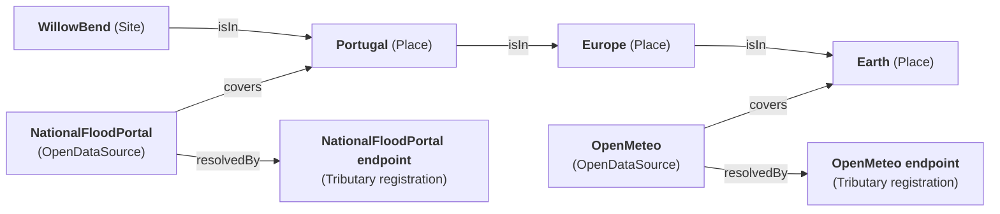

# Forage

Forage resolves a site against the outside world. Given a Site, it works out which data
sources cover that site, calls each one through Tributary with the values the model holds
for the call, and reports what did and did not resolve. The name is what an organism does when it goes out to
find what its surroundings hold and brings it back — which is the whole of this service, and
what `Mycelium` is named for doing underground.

It runs **before** the analysis, never inside it. Discovery populates the Site; the compute
services read what discovery wrote. That keeps the compute free of any network dependency, so
a planner adjusting an assumption sees the balances move without touching a public data portal
again.

## Coverage is edges, not a word

A source declares where it applies by relating to a **Place** Thing, and a site relates to
the Place it sits in. Places nest, so a source covering a region covers every site within
it without naming any of them:



Both sources above cover `WillowBend`: one directly, one through the nesting.

**Where that graph comes from.** The `Place` archetype, the three predicates and the sources every
project shares are seed data: `open-data-sources.template.json` in the platform repository, read
alongside the archetype set (platform User Story #6750). A registration lives in the project's own
model, so a source every project uses belongs in the seed every project is created from — see
[`DELTA.md`](DELTA.md#which-model-a-registration-lives-in). **A site's own `isIn` edge is written by
its producer, not inherited from the archetype.** The submission producer writes one per site, to the
Place carrying `__IsRootPlace` through the predicate carrying `__IsPlaceNestingPredicate` — both found
by mark, because a producer naming `Earth` would relate nothing, and say nothing, in a model that
called its root something else (Bug #6752).

**The root is enough for a source that covers everything, and no more is claimed.** A submitted site
is not related to a country or a region: `country` on a submission is optional and stays text, it
names an open set nobody can enumerate, and the vocabulary pattern used elsewhere here *refuses* a
term the model does not hold — which would turn "we have not declared your country" into "your land
cannot be submitted". The hazard portal covers the root too — it is global — but its address needs an
administrative division code (`hazardPortalDivision`), which a project can put on a Place its sites are
related into and which a run otherwise works out for itself from the site's position — see
[Resolving the hazard division](#resolving-the-hazard-division). A site that reaches no such Place and
whose division could not be resolved has the portal's calls refused before the provider is contacted
and reported with the unfilled placeholder named: the model gap said out loud, where hiding the source
would leave a quietly short report.

**Why not a `coverage` string.** The failure this path exists to prevent is a source that
does cover the site being silently skipped because a country was written two ways —
`Portugal` against `PT`, or a difference in case. Matching strings is what causes that;
walking edges makes it impossible rather than merely reported. Adding a country becomes a
model edit with no deployment, and a reader can ask what else is true of a Place. This is
the repository's *things and relations, not strings* rule applied to the one place where
getting it wrong is invisible: a source that is never selected cannot appear in the
unresolved list either, because nothing knew to look for it.

## The predicates it reads

| Predicate | Reads | Why |
|---|---|---|
| `isIn` | `Site isIn Place`, `Place isIn Place` | Where the site is, and what contains that. Walked to any depth, so nesting can be as deep as a model wants — upwards from a site, and downwards from the Places a source covers when the source is what was dispatched. |
| `covers` | `OpenDataSource covers Place` | Where a source applies. Several `covers` edges are fine; the source is still selected once. |
| `resolvedBy` | `OpenDataSource resolvedBy Endpoint` | Which Tributary registration a call goes through. A relation, not a copied name, so renaming the registration cannot strand the source. |
| `resolvesOnto` | `OpenDataSource resolvesOnto archetype` | What a source's readings are about, where that is not the site itself. A source naming an archetype is called once per Thing the site `has` of it, with that Thing as the call's subject — the hazard portal grades one assessment per call. |
| `studies` | `SiteStudy studies Site` | The study the analysis computes. Read incoming, because the edge runs from the study to the site. |
| `has`, `is` | `Connection has Service`, `Service is prototype`, `Site has HazardAssessment`, `Site is Site` | Which service a connection dispatches, the prototype an analysis edge points at, the Things a per-subject source is called about — and whether a Thing is a site, by the `__IsSiteArchetype` mark on what it `is`. |
| `assesses` | `HazardAssessment assesses HazardType` | What an assessment is about. The type Thing carries the portal's code for it, and a per-assessment call is addressed with what its subject reaches — a second per-subject source whose vocabulary hangs off a different predicate adds that predicate here. |

Connections are **not** read by name. Every connection a site analysis starts `is` an archetype
carrying `__IsSiteAnalysisConnectionArchetype`, and they are asked for by that mark, model-wide —
the study is not related to them yet, because relating it is what the read is for. Adding a fourth
balance is a mark in the model, not a change here.

An `OpenDataSource` with no `resolvedBy` edge is **left out** rather than reported as a failure.
It is not a source that failed — it was never callable, and listing it as unresolved would
blame a provider for a gap in the model. A `Site` with no study, and a model marking no analysis
connection, are treated the same way: the run reports it in `analysis.reason` and logs nothing,
where a service that could not be started logs an error — nothing was ever going to run, so there
is no outage for an operator to look into.

## Reading the model

One scoped snapshot answers each question. **What the dispatch named** is read first: the subject with
its `is` chain, and the site archetype the platform marks with `__IsSiteArchetype` (platform Task
#6811) — asked for on its own, because with its members every site in the model would arrive to
answer a question about one Thing. A subject that `is` that archetype, directly or through
intermediate types, is a site; one that is not and `covers` a Place or is `resolvedBy` a registration
is a source; anything else is neither, and the run writes nothing for it. A model that marks no site
archetype cannot tell the two apart, and every subject in it is taken for a site — such a model cannot
have declared the connection that dispatches a source either.

**A site's read** then answers everything about it: the site's Places, then every source whose coverage
reaches one of them, then those sources' registrations — and, model-wide, the two division lookups, which
no edge reaches because neither covers a Place. Traverse rules compose over the set built so
far, so the walk must ask for `isIn` **first** — asking for the incoming `covers` edges before the
Places are in the set finds nothing. That is the same ordering trap the Tributary endpoint kinds hit;
see [`TRIBUTARY.md`](TRIBUTARY.md). **A source's read** is the same walk from the other end: the Places
it `covers`, then `isIn` walked *downwards* through their nesting, then what each site there `has` —
see [A source added to the catalogue](#a-source-added-to-the-catalogue).

A failed read writes nothing, never an empty answer. An unreachable gateway must not read as
"no source covers this site" — the two answers look identical to a caller and only one of
them is true — nor as a source that reaches no site, which would then be stamped as offered to all
of them.

## What starts a run

**A site entering a state, not a call.** The model declares a range on the `Site` archetype,
`SiteAwaitingDiscovery` — coordinates known, and either the site's coverage never matched or some
coverage of it still outstanding — and a connection bound to this service watches it. A site entering
that state makes the platform write a durable record-edge from the site to the connection and dispatch
it. Nothing in either repository calls Forage, and nothing has to: **what started a run is a fact in
the model afterwards**, which a call over HTTP would have left only in a log.

| | How it happens |
|---|---|
| A run starts | A site's coordinates are written and its coverage has never been matched |
| A run does not start again | The run records each source's answer on that source's own coverage and stamps `coverageMatchedAt` on the site; once no coverage is outstanding the site leaves the state on its own |
| A run in which a source failed | Leaves that source's coverage outstanding, so the site stays in the state; the dispatch record waits out its `done_within`, the run is driven again, and it asks only that source |
| A run whose model read failed | Writes nothing and stamps nothing, so the site stays in the state and the next load dispatches again — bounded by the platform's oscillation guard |
| A source added to the catalogue later | Is dispatched itself, from its own state, and offered to every site under the Places it covers: a coverage minted per call those sites would make, nothing fetched. One outstanding coverage puts each site back in the state, and that site's run asks only this source — see [A source added to the catalogue](#a-source-added-to-the-catalogue) |
| A surveyed site | Enters the same state and is discovered the same way; nothing here is particular to a submission |

**A source has a state of its own.** `SourceAwaitingSites` on the `OpenDataSource` archetype — its
`coverageMatchedAt` unknown — is what dispatches a source, and a source declared in a template is in
it the moment the seed loads, so the sites already in the model are offered it without anything calling
anything. The run stamps the source when it has reached every site, which is what takes it out.

The ranges and the connections are declared in the platform repository — the ranges beside the `Site`
and `OpenDataSource` archetypes in `land-intake.template.json`, the connections beside the sources in
`open-data-sources.template.json` (platform Tasks #6771 and #6790). A deployment that never fetches
reads neither file and runs no discovery service.

## What a run records, and what it therefore skips

**Every call a run makes has a `SourceCoverage` to record what it came to** — one Thing per subject and
source, declared by the platform (Task #6779) and filled here. It carries `resolvedAt` when the answer
landed, and `lastAttemptAt`, `attempts` and `failureReason` when it did not. A run mints one for any call
the model has none for, relating it `appliesTo` the subject and `sourcedFrom` the source.

**A call whose coverage already carries `resolvedAt` is not made again.** That is the point of the
Things: a source answering for one subject and failing for another leaves exactly the second outstanding,
and a run over the same site afterwards calls only that one. A source every one of whose calls has been
answered drops out of the run entirely rather than being called with nothing to fetch.

**The subject, not the site.** A source that `resolvesOnto` an archetype is called once per Thing the
site has of it, so its coverage of one assessment is a different Thing from its coverage of another. A
portal answering for five of a site's assessments and not the sixth records five resolved and one
outstanding; per source, the sixth would either be lost or re-call all six.

**This is where a run's report lives.** It was a response body the broker discarded, then a log line
(Task #6777). On the coverages it is durable and per call, and a planner reaches it from the gap it
explains. `attempts` is added to rather than overwritten, so a provider that has failed every run since
the site was submitted reads differently from one that failed once.

`coverageMatchedAt` is stamped on the site whatever the run found, including nothing: a site no source
covers has been looked at, and saying so is what tells it apart from one still waiting to be.

**A model that declares no coverage vocabulary still fetches.** It records nothing and asks again next
time, which is the behaviour that shipped before these Things existed — discovering nothing at all would
be worse than the once-ever discovery they replace. The archetype is found by the mark the platform
declares it with, never by name.

## A source added to the catalogue

**A source is dispatched too, and its run is the site's run in reverse: it mints and fetches nothing**
(Task #6812). A site's run walks from the site up through its Places to the sources covering them; a
source's run walks from the source through the Places it `covers` and *down* their nesting to every
site in them. Places and sites arrive by the same walk, and the mark the platform puts on the site
archetype (`__IsSiteArchetype`, platform Task #6811) is what tells them apart — the `proposes` edge
could not, because it reaches a submitted site only and a surveyed site has no such edge.

**One coverage per call those sites would make.** The run works out, for each site it reaches, the
calls the source would be asked — one about the site, or one per Thing the site has of what the source
`resolvesOnto` — and mints a coverage for every call the model records none for, relating it
`appliesTo` the subject and `sourcedFrom` the source, exactly as the site's run would. A call already
recorded, answered or not, is left alone: a second coverage would let a site be judged against one and
recorded on the other. A site in a Place the source does not cover is not offered it, however many other
sources cover that Place.

**Nothing is fetched here.** A minted coverage is outstanding, and that is what puts each site back in
`SiteAwaitingDiscovery`; the run that fetches is the site's own, and it asks only this source. Running
the fetches from the source's side would call every site's providers from one dispatch, unbounded by
the concurrency a site's run holds to.

**`coverageMatchedAt` is stamped on the source when the run has reached every site**, including a
source with no registration — offered to nothing, because nothing can call it — so it leaves
`SourceAwaitingSites` rather than being dispatched again on every load. A run whose read failed stamps
nothing and mints nothing: stamped, the source would read as offered to every site it covers while
having reached none, and nothing would offer it again. A model declaring no coverage vocabulary has
nothing to mint, so the run writes nothing and says so.

**A subject that is neither a site nor a source is a dispatch the model got wrong**, and the run says so
by writing nothing — the site's run would stamp a Place as matched, and a source's run would offer it
to nothing and do the same. An archetype is never a site: a stamp on the site archetype itself would be
inherited by every site and take all of them out of the state their runs are dispatched by.

## The run

`POST /handle { subjectId }` **accepts** a run and answers `202` at once; the fetching happens after.
The body is whatever the platform posts for a dispatch — the record-edge's own fields — and the
subject is read from it through the classifier every dispatched service shares, so this service
declares no request shape of its own. The subject is a site or a source, and the model says which (see
[Reading the model](#reading-the-model)); the rest of this section is a site's run.

**The answer says accepted, not done.** A run fetches every covering source before it could say what
it found, and the platform gives a dispatch **15 seconds**; with tens of shared sources, fetched
`--maxConcurrentSources` at a time and each allowed `--sourceTimeoutSeconds`, a run outlasts that call
routinely. Judged by the call, finished work would be recorded Failed and driven again. So what closes
the dispatch is the model: the connection relates to `SiteDiscovered` as what proves a dispatch done,
the record stays in flight until the site's coverage has been matched and no coverage of it is
outstanding — the run's own last write is what closes it — and `done_within` presumes dead a run
nobody will finish. Completion is *observed* rather than *announced* because nothing exposes a route
for a service to announce one.

**A coverage read that fails writes nothing.** It cannot refuse in the answer any more — one has
already been given — so it says so by leaving no trace: no fetch, no analysis started, and the site
still in the state that dispatched it, which is what drives the run again. An unreachable gateway must
never be mistaken for "no source covers this site".

What a run found goes to the log, per source and with the provider's own words. Persisting it where a
planner can read it afterwards is platform Task #6779, which needs it for a different reason.

A run's report, as the log records it:

```jsonc
{ "siteId": "…",
  "resolved":   ["OpenMeteo", "Copernicus"],
  "unresolved": [ { "source": "NationalFloodPortal",
                    "reason": "503: portal is down for maintenance" } ],
  "analysis":   { "started": true, "reason": null } }
```

**Partial failure is normal and is tolerated.** Public data portals go down, and an intake that
aborted because one provider was unavailable would be abandoned. A source that fails leaves its
value undiscovered, does not stop the others, and appears in `unresolved` with a reason — carrying
the provider's own words where there are any, because that is the most useful thing a planner can
be told about why a value is missing. Reporting what did *not* resolve matters as much as reporting
what did: a quietly short list is the failure of the tool being replaced.

**A call is addressed from its subject outward.** Whatever the call's subject carries — coordinates,
elevation, climate zone — is passed as its address parameters, and behind it, layered so the most
specific holder of a name decides it: the subject's own values first, then (for a per-subject call)
the values of the Things it reaches by its own outgoing edges, then the site's, then each Place the
site is in, nearest first. A source's address takes only the placeholders it names and the fetcher
ignores the rest, so one set of values serves a source wanting coordinates, one wanting a division
code, and one wanting neither, with no per-source arrangement here. Inherited values are left out — a
value from an archetype is a default for a *kind* of site, and calling a provider with a default
location would return a confident reading about somewhere else — and so are the double-underscored
marks readers find Things by, and any name that Things standing at the same distance disagree on,
because relationship order is undefined and taking either would address different calls on different
runs.

**A source that declares what it resolves onto is called once per Thing, not once per site.** The
hazard portal grades one assessment per call: its `resolvesOnto` edge names the `HazardAssessment`
archetype, so a run calls it once for each assessment the site `has`, with that assessment as the
call's subject — the reading lands on the assessment it grades, and the division and hazard codes
arrive from the Place and from the type Thing the assessment `assesses`. A declared source on a site
holding nothing of its archetype has nothing to fetch: that is logged and is not a failure, the same
rule a site with no study is reported under. A failed per-subject call names its subject in the
report, because a portal answering for five assessments and not the sixth must not read as a source
that failed outright.

**Bounds.** Calls run concurrently up to `--maxConcurrentSources`, held across every call rather
than per source, so a site covered by many sources — or a source called once per assessment — cannot
open a burst of connections that reads as abuse. Any one source is bounded by
`--sourceTimeoutSeconds`: a provider that accepts the connection and then goes quiet is more common
than one that refuses outright, and it must not hold up the run. A run cancelled by its caller is
never reported as a timeout — that would put a fabricated outage in front of a planner.

**Fetching is not done here.** Forage asks Mycelium to forward each call to the endpoint service
named by `--fetcherSubdomain`, which resolves the registration, fills the address placeholders,
reshapes the response and writes the observation onto the Site. **Each call names the site as its
subject**, so the reading lands on the site the run is for rather than on whatever entity the shared
registration's expression names — see
[`TRIBUTARY.md`](TRIBUTARY.md#naming-the-subject-a-call-is-about). Which service fetches is
configuration rather than a name in code, so a deployment can point it elsewhere without editing
this service.

**Every source that resolved stays reachable from the site.** The fetch relates the registration to
the site through `observed`, so a value on the site leads back to the registration and from there to
the `OpenDataSource` along the `resolvedBy` edge this service already reads. Nothing here writes that edge;
it is the ingest's, and it is written once per registration per site however often discovery runs —
see [`TRIBUTARY.md`](TRIBUTARY.md#which-registration-wrote-a-value). A source that did not resolve
never reaches the ingest, so it leaves no edge suggesting it did.

## Resolving the hazard division

**Before the fetches, a run works out which administrative division the site stands in (#6851).** Every
route the hazard portal serves takes a division code and none takes coordinates, so a site whose model
supplies no code has every grading refused before the provider is contacted — which reaches a planner as
an empty hazards table and reads as "no hazards here".

**It is a step in the run because nothing else can see the site's country.** The portal's own search
takes a *name*, and answers every division of that name in every country: `Santarem` answers one in
Portugal and two in Brazil. A reshape expression sees only the provider's reply, and the provider takes
no country to filter by, so the choosing has to happen where the site's values are known.

Four rules, each of which a wrong answer would break:

- **A model that supplies a code decides.** The site's own value and its Places' are already layered
  into the call's address, so a run resolves only where neither supplies one. A project that coded its
  own Place keeps it, and a site that needs no lookup costs two providers nothing on every run.
- **English is asked for.** Left to a geocoder's default a Dutch site answers `Nederland`, which the
  portal matches to nothing. The address the model holds asks for English.
- **Only the site's own country counts**, and the two providers do not agree on a country's full name —
  the geocoder says `United States` where the portal holds `United States of America` — so they are
  matched by one name starting with the other rather than by equality.
- **The finest division of those left is taken.** The same name exists as a region and as the district
  inside it, graded differently: Portugal / Santarem reads high river flood as the region and medium as
  the district. The district is the land the site is actually in. Two divisions standing equally deep
  are a tie nothing here can settle, so neither is taken — a guessed division reads exactly like a
  resolved one, and telling a landowner their land does not flood is the failure this whole path exists
  to prevent.

**The county is searched before the state that holds it, and the state is searched when the county finds
nothing.** A geocoder answering `Dukes County` where the portal holds `Dukes` finds no division at all,
and the state it also gave is one the portal does hold — so the site is graded at the coarser division
rather than not at all. A search that was *refused* is not a name the portal holds nothing for: the run
stops there rather than asking a coarser question, or one provider's outage would become a coarser
grading nobody chose.

**What it settled on is written onto the site and addresses this run's own calls.** The code first,
because that is what addresses a grading; a name written beside a code that would not go would read on
the page as a division the gradings never came from. Addressing this run rather than the next is what
grades a site on the run that resolved its division instead of after a whole dispatch has been waited
out.

**Both calls go through the fetching service like any other**, at addresses the model holds — the
registrations carry a mark each and no reshape expression, so the provider's own body comes back and
nothing is written from it (see [`TRIBUTARY.md`](TRIBUTARY.md#fetch-and-shape-not-derive--the-metabolism-boundary)).
Neither is an `OpenDataSource`, neither covers a Place, and neither has a coverage: nothing they answer
is a reading about the site. A run that resolves nothing writes nothing, so the gradings stay
outstanding, the site stays in the state that dispatched the run, and the next run tries again.

## Resolving the fetched words

**A fetched word becomes the edge the model declares, inside the run that fetched it (#6809).** Some
vocabularies take their word from a fetch — a site's climate class, an assessment's hazard grade —
and a fetch writes property values, never edges. So after the fetches, the run resolves each written
word against the vocabulary the model declares and relates the subject to the member it names.

**Everything is read from the declaration** (platform User Story 6773): the vocabulary archetype
carries `__IsDiscoveredVocabularyArchetype` and names, in `resolvedFromProperty`, the property its
word arrives under; an archetype-level edge — `Site classifiedAs ClimateZone`,
`HazardAssessment gradedAs HazardLevel` — names the Thing the word is written onto and the predicate
the resolved edge is written through. Nothing here names a vocabulary, an archetype, a predicate or a
property of any model, so a project adding a vocabulary edits its model and deploys nothing.

**That edge has to stay the only one from a subject to its vocabulary.** It is how a run learns which
predicate its own resolution writes through, so a second would leave it unable to tell which was its —
and it could write somebody else's. A vocabulary the submission producer resolves is therefore found by
a mark and declares no edge, which is why `reportedAs` sits beside `gradedAs` carrying
`__IsReportedLevelPredicate` and nothing else. What a submitter reports and what a portal grades are two
predicates to the same Things, and only one of them is a discovery run's.

**The words come from the fetch responses, not from reading the model back.** An observation is
accepted into a queue and applied by the drainer after the write returns, so a read straight after
the call races it; the fetching service reports what each subject call wrote (`written`, see
[`TRIBUTARY.md`](TRIBUTARY.md)), and that report is what is resolved.

**A changed word moves the edge.** An edge already pointing at the named member is left alone; one
pointing elsewhere is removed before its replacement is written, so a re-graded assessment never
carries two levels. A stale edge that will not go blocks its replacement — a reader must never meet
two answers — and the next run resolves again.

**A word the vocabulary does not hold writes no edge and is reported**, naming the source, the
subject, the property, the word and the vocabulary. Writing it would invent a member the scheme does
not hold; refusing the fetch would turn a provider's odd answer into an outage. The word stays on the
subject's series as the record of what the source answered — for these vocabularies the series is the
provenance and the edge is the conclusion, which is why no retired-word rule applies to them. A word
that matches a member only up to case, and a member name two Things carry, are reported the same way
rather than guessed at.

**A failed declaration read resolves nothing and says so.** The observations are already written and
the site has left the state that dispatches runs, so nothing retries by itself; the words stay words
until something runs discovery again.

## Starting the analysis

**When the run finishes, Forage relates the site's study to each compute service** — one
`SiteStudy -connection-> prototype` edge per marked connection. A connection bound to a service is a
handled predicate, so creating that edge is what dispatches it; no compute service is called from
here. The model carries the trigger, which means there is one way to start an analysis rather than
two to keep in step, and what started a given analysis is answerable from the model afterwards rather
than only from a log.

**The subject is the study, never the site.** A compute service reads its inputs off the study, so an
edge naming the site would dispatch the service against a Thing carrying none of them.

**The edge is written once.** Dispatch makes the service compute and start watching the study, so
every later change to an input recomputes on its own. Discovery does not have to run again for a
balance to stay current.

**It starts whatever mixture resolved, including none.** A site whose sources were all unavailable is
exactly the case a planner needs an answer about; an analysis that only ran when everything succeeded
would go quiet precisely when something had gone wrong. The balances report against what discovery
left them, and `unresolved` says what is missing and why.

**Discovery runs before the analysis, never inside it.** That is what keeps the compute free of any
network dependency: a planner adjusting an assumption sees the balances move without touching a
public data portal again, because the values are already on the Site. It matters more here than it
would under a graph run once per request, because a reactive chain re-fires on every input change.

**A failure to start does not lose the report.** The observations are written by the time the
analysis is asked for, so a site with no study, a model marking no analysis connection, or a refused
relationship write are each reported in `analysis.reason` with the discovery report intact beside
them. A write that fails for one connection names that connection.

## Pointers

- [`TRIBUTARY.md`](TRIBUTARY.md) — the fetcher Forage calls, its per-call address
  parameters, and how a reshape expression turns a response into an observation on the Site.
- [`LAND_INTAKE.md`](LAND_INTAKE.md) — the intake design this serves, and the model the
  Site, Parcel and DataSource archetypes sit in.
