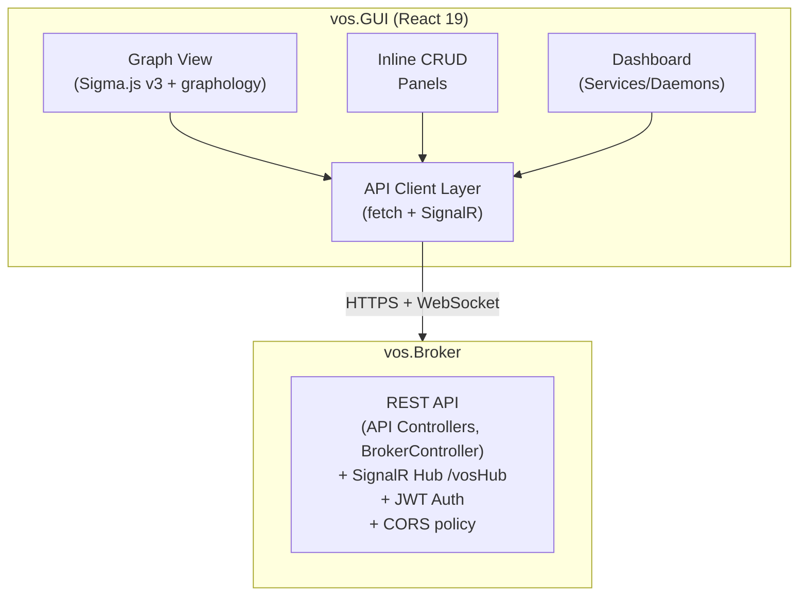

# VillageOS GUI — Technical Specification

## Context

VillageOS is an in-memory temporal graph database built in .NET 10/C#. Users interact with it via a CLI REPL (`vos.CLI`) and a web interface (`vos.GUI`). Both communicate with the REST API server (`vos.Broker`).

**vos.GUI** is a React + TypeScript single-page application that provides:

1. **Interactive graph visualization** — the model rendered as a WebGL force-directed graph using Sigma.js v3
2. **Full CLI parity** — every CLI operation accessible through inline forms, context menus, and detail panels
3. **Broker dashboard** — real-time monitoring of daemons, services/handlers, and model activity via SignalR

---

## Architecture Overview



### Technology Stack

| Layer | Technology | Version |
|-------|-----------|---------|
| **Framework** | React + TypeScript | 19.2 |
| **Build** | Vite | 7.x |
| **Graph renderer** | Sigma.js (WebGL) | 3.0.2 |
| **Graph data** | graphology (multi-directed) | 0.26.0 |
| **React graph bindings** | @react-sigma/core | 5.0.6 |
| **Graph layout (small)** | graphology-layout-force (ForceSupervisor) | 0.2.4 |
| **Graph layout (large)** | graphology-layout-forceatlas2 (FA2 worker) | 0.10 |
| **Styling** | Tailwind CSS | 4.1 |
| **State management** | Zustand | 5.0.11 |
| **Real-time** | @microsoft/signalr | 10.0 |
| **Icons** | lucide-react | 0.563 |
| **Dates** | date-fns | 4.1 |
| **3D renderer** | three (Three.js) | 0.182 |
| **3D React bindings** | @react-three/fiber | 9.5 |
| **3D helpers** | @react-three/drei (OrbitControls) | 10.7 |
| **Auth** | JWT + API key auth (login form, `VITE_API_KEY` env var auto-exchange, `X-API-Key` header, silent token refresh, forced password change) |

---

## Project Structure

```
vos.GUI/
├── package.json
├── vite.config.ts              # Proxy /api + /vosHub → https://localhost:7243
├── tsconfig.json
├── index.html
└── src/
    ├── main.tsx                # React root
    ├── App.tsx                 # Router + theme toggle
    ├── index.css               # Tailwind import + body/root height
    ├── setupTests.ts           # Vitest + testing-library
    │
    ├── types/
    │   ├── vos.ts              # VosThing, VosRelationship, PropertyValue, ranges, temporal types
    │   └── broker.ts           # RegisteredService, ServiceStats, DaemonInfo, ActivityEvent, EndpointServiceInfo
    │
    ├── api/
    │   ├── client.ts           # Singleton API client (fetch + JWT auto-refresh + API key exchange + login/logout/switchModel/changePassword + silent token refresh + AuthRequiredError)
    │   ├── thingApi.ts         # Thing CRUD + property get/set/delete + effective properties
    │   ├── relationshipApi.ts  # Relationship CRUD
    │   ├── modelApi.ts         # Model export/import/clear + temporal snapshots
    │   ├── temporalApi.ts      # Property versions, mutations, recent values
    │   ├── rangeApi.ts         # Composite range summary for things (rangeApi.getSummary), individual range/state queries for relationships (relationshipRangeApi)
    │   ├── brokerApi.ts        # Services, daemons, shutdown, seed library (list/load/save)
    │   └── endpointApi.ts      # Endpoint services listing (GET /api/endpoints)
    │
    ├── hooks/
    │   ├── useSignalR.ts       # SignalR connection singleton + subscription hook
    │   └── useAuth.ts          # AuthContext, useAuth() hook, useAuthState() with login/logout/switchModel/selectModel/saveSeed/changePassword/VITE_API_KEY auto-exchange
    │
    ├── stores/
    │   ├── uiStore.ts          # Selections, panel state, clustering, logical expansion, context-menu state
    │   └── activityStore.ts    # Activity feed events (max 200)
    │
    ├── utils/
    │   ├── graphologyMapper.ts  # VosModel → graphology Graph (nodes + edges)
    │   ├── ifcMeshParser.ts     # IFC pre-tessellated mesh → centroid/SolidMeshData (sole geometry parser)
    │   ├── villageScene.ts      # Batch builder: things → VillageSceneData (3D meshes + bounds, optional relationships for IFC containers)
    │   ├── browserDetect.ts     # Safari detection + canSupport3D() for WebGL context limits
    │   ├── meshHelpers.ts       # Shared 3D mesh constants + crossProduct()
    │   ├── colors.ts            # Shared color palettes + ELEMENT_COLORS + deterministic hashStringToIndex()
    │   ├── reducerHelpers.ts    # Pure styling functions for NodeReducer (selection, cluster styles)
    │   ├── nodeVisibility.ts    # Pure helpers for node/edge visibility + edgeTouchesNode (testable without WebGL)
    │   ├── predicateCluster.ts  # Predicate-based clustering algorithm + stats
    │   ├── searchFilter.ts      # Graph search with case-sensitive, exact-match, and regex options
    │   ├── propertyUpdates.ts   # Pure helpers for incremental SignalR property updates (avoids full reload)
    │   ├── guiSettings.ts       # Extracts GUI settings (flash effects, force layout, predicate colors) from GUI_Settings Thing; extractAllGuiSettings() single-traversal
    │   ├── formatters.ts        # GUID, date, value display helpers
    │   └── constants.ts         # Health colors, property types
    │
    ├── pages/
    │   ├── GraphPage.tsx        # Main graph + search + inline CRUD + detail panels
    │   ├── DashboardPage.tsx    # Services, daemons, model stats, activity feed
    │   └── TemporalPage.tsx     # Time-range mutation explorer
    │
    └── components/
        ├── layout/
        │   ├── AppLayout.tsx    # Root layout: sidebar + main + toast container
        │   └── Sidebar.tsx      # Nav links (Dashboard, Graph, Temporal, Things, Properties) + model name + collapsible
        │
        ├── graph/
        │   ├── SigmaCanvas.tsx            # <SigmaContainer> wrapper with settings + Safari compositing fix
        │   ├── GraphDataLoader.tsx        # Loads graphology graph into Sigma
        │   ├── GraphEvents.tsx            # Click/right-click events → Zustand store (incl. logical node expansion, context menu)
        │   ├── LayoutController.tsx       # ForceSupervisor / FA2 lifecycle
        │   ├── LogicalNodeController.tsx  # Radial positioning of logical children + semantic zoom
        │   ├── NodeReducer.tsx            # Visual filtering: search, clustering, selection reveal
        │   ├── ClusterComputer.tsx        # Computes predicate-based cluster map from graph topology
        │   ├── NodeContextMenu.tsx        # Right-click node context menu (view details, expand, copy ID, delete)
        │   ├── RadialPredicateMenu.tsx    # Right-click background radial menu for predicate selection
        │   ├── WebGLContextGuard.tsx      # WebGL context loss/recovery with MutationObserver for dynamic canvases
        │   └── GraphToolbar.tsx           # Zoom, fit, re-layout, spread, cluster, semantic zoom, expansion controls
        │
        ├── auth/
        │   ├── LoginForm.tsx           # Full-screen login form (username/password) + seed library picker (search, sort by name/size, scrollable list, save-to-library)
        │   ├── ChangePasswordForm.tsx  # Forced password change form (shown when MustChangePassword flag is set)
        │   └── RegenLogo.tsx           # Animated ReGen logo component
        │
        ├── three/
        │   └── BuildingDetail3D.tsx    # Single-building 3D viewer (auto-rotate, orbit controls)
        │
        ├── panels/
        │   ├── ResizablePanel.tsx        # Draggable-width overlay panel
        │   ├── NodeDetailPanel.tsx       # Own properties, inherited properties (flat + tree), relationships, ranges, 3D tab
        │   ├── EdgeDetailPanel.tsx       # Subject-Predicate-Target, properties, ranges (tabbed: Properties | Ranges)
        │   ├── EditablePropertyList.tsx  # Inline property editing with dirty state, save on Enter/blur, type inference, AddPropertyRow for new properties
        │   ├── RelationshipList.tsx      # Expandable relationship list with multi-expand, inline property editing, and AddRelationshipRow
        │   ├── AddRelationshipRow.tsx    # Inline form for creating relationships (predicate + other-thing pickers)
        │   └── RangesTabContent.tsx     # States, own/inherited ranges, relationship ranges, binding evaluations with severity coloring
        │
        ├── dashboard/
        │   ├── ModelStatsCard.tsx          # Thing/relationship/predicate/property counts
        │   ├── ServicesPanel.tsx           # Health status, start/stop, request stats
        │   ├── DaemonsPanel.tsx            # Running status, PID, failures
        │   ├── EndpointServicesPanel.tsx   # Endpoint service traffic/performance metrics
        │   └── ActivityFeed.tsx            # Real-time SignalR event log
        │
        └── common/
            ├── ErrorBoundary.tsx     # React error boundary with stack trace display
            ├── Toast.tsx             # Toast notifications (success/error/warning/info)
            ├── ConfirmDialog.tsx     # Confirmation modal for destructive actions
            ├── Badge.tsx             # Colored status pill
            └── ThingPicker.tsx       # Searchable thing selector with ranked results (exact→starts-with→contains)
```

---

## Graph Visualization

### Component Architecture

All graph components are children of `<SigmaContainer>` and access the Sigma instance via React hooks.

```
<ErrorBoundary>
  <SigmaContainer graph={multiDirectedGraph} settings={SIGMA_SETTINGS}>
    <GraphDataLoader />           ← useLoadGraph: builds & imports graphology graph
    <ClusterComputer />            ← Predicate-based cluster computation
    <GraphEvents />                ← useRegisterEvents: click → Zustand store + logical expansion
    <LayoutController />           ← ForceSupervisor / FA2: force-directed layout
    <LogicalNodeController />      ← Radial positioning of logical children + semantic zoom
    <WebGLContextGuard />          ← Safari WebGL context recovery (MutationObserver for dynamic canvases)
    <NodeReducer />                ← useSetSettings: search, clustering, selection reveal
    <GraphToolbar />               ← useSigma + useCamera: zoom/fit/relayout/semantic zoom
  </SigmaContainer>
</ErrorBoundary>
```

### Multi-Directed Graph

The graphology instance is created as `new Graph({ multi: true, type: 'directed' })` because the same pair of nodes can have multiple relationships with different predicates (e.g., Zone-A →has→ Sensor-1 and Zone-A →monitors→ Sensor-1). This instance is passed to `SigmaContainer` via the `graph` prop to override its default simple graph.

### Data Loading

GraphPage fetches the full thing list (`GET /api/things`) and the relationship list (`GET /api/relationships`) in parallel through a single `loadData()` call. The Fragments-based 3D viewer streams its own geometry separately from `/api/model/fragments`.

### Data Mapping (`graphologyMapper.ts`)

`buildGraph(things, relationships)` transforms VillageOS domain data into a graphology graph:

**Node classification:**
- **Predicate**: has `ExecutablePath`/`ServicePort` property, or is used as a `PredicateId` in any relationship
- **Type**: is the target of an `is` relationship (e.g., "Zone", "Sensor", "AMR")
- **Default**: regular instances

**Node sizing:** `Math.max(3, Math.min(15, 3 + incomingRelationshipCount * 1.5))` — sized by incoming edges only (how many things point at this node), so types and hubs appear larger than leaf nodes

**Color palettes (data-driven, no hardcoding):**
- **Predicate nodes**: amber `#fbbf24` — things used as `PredicateId` or with `ExecutablePath`/`ServicePort`
- **Type nodes**: blue `#60a5fa` — things that are targets of "is" relationships
- **Instance nodes**: color derived from the "is" type name via `hashStringToIndex()` into a 16-color vibrant palette. Every instance of the same type shares the same color (e.g., all "Home" instances are one color, all "SolarArray" another). New types automatically get distinct colors without code changes.
- **Untyped instances** (no "is" relationship): slate `#94a3b8` fallback
- **Edge colors**: Resolved per-predicate via `resolvePredicateColor(name, overrides)`. Explicit name→hex overrides from the `GUI_Settings` Thing's `PredicateColors` JSON property take priority; unlisted predicates fall back to an 8-color palette via `hashStringToIndex()`. The same resolver is used by both `buildGraph()` (edge colors) and `computePredicateStats()` (radial menu colors) so they always match.

**Logical node classification:** After all nodes and edges are added, a second pass marks nodes without geometry as `isLogical: true` and computes `parentGeoNodeId` — the nearest geometry-bearing neighbor (first found by edge traversal). Logical children are revealed on demand via parent expansion, search, or semantic zoom. Helper functions `getLogicalChildren(graph, geoNodeId)` and `countLogicalChildren(graph, geoNodeId)` support the expansion UI.

**Initial layout:** Circular with radius 100, then force-directed

### Force-Directed Layout (`LayoutController.tsx`)

Two layout algorithms selected by graph size:

- **Small graphs (< 2000 nodes)**: `graphology-layout-force/worker` — runs via `requestAnimationFrame` on the main thread. Simple spring-electric model, supports `isNodeFixed` callback
- **Large graphs (≥ 2000 nodes)**: `graphology-layout-forceatlas2/worker` (`FA2Supervisor`) — runs in a **real Web Worker** using Barnes-Hut optimization (O(N log N) vs O(N²)). Provides ~70x speedup at 10K nodes

Layout parameters are read from the model's "GUI Settings" Thing (via `extractLayoutSettings()` in `guiSettings.ts`), stored in `uiStore.layoutSettings`. Defaults when no settings thing is present:
- `attraction: 0.0005`, `repulsion: 0.1` (cluster mode: `clusterRepulsion: 0.4`), `gravity: 0.0001`, `inertia: 0.6`, `maxMove: 200`
- Properties on the "GUI Settings" Thing: `LayoutAttraction`, `LayoutRepulsion`, `LayoutGravity`, `LayoutInertia`, `LayoutMaxMove`, `ClusterRepulsion`, `FlashEdgeSize`, `FlashNodeSizeFactor`, `FlashNodeBrighten`, `PredicateColors` (JSON string: `{"consumes":"#fb7185",...}`)
- **Spread mode**: Toggle via toolbar — boosts repulsion 5x and reduces gravity 10x, causing nodes to push apart while maintaining cluster structure. Toggling off restores normal parameters and nodes re-settle
- Supervisor is recreated when clustering predicates change, spread mode toggles, or layout settings change (tracked via `JSON.stringify(layoutSettings)`)

### Search & Filtering

**GraphPage** provides a search bar with:
- Text search (substring match by default)
- Case-sensitive toggle (`Aa` button)
- Exact-match toggle (`=` button)
- Regex toggle (`.*` button)
- Match count display

Search filtering expands matched nodes to include their direct neighbors and predicate things so edges always have both endpoints and edge labels resolve to names (not GUIDs).

**NodeReducer** installs Sigma `nodeReducer`/`edgeReducer` for visual filtering. Edges are **hidden by default** and only shown when triggered:
- **Hover**: edges touching hovered node are brightened
- **Selection**: edges touching selected node are shown
- **Search**: edges where both endpoints match the query are shown
- **Predicate filter**: edges matching active predicate filters are shown

Node reducers follow two priority modes:
1. **Search active** → dim non-matching physical nodes; hide non-matching logical nodes
2. **Default** → all nodes visible; selection highlight applied (selected node gets `zIndex: 2`); edges follow the unified rules above

Helper functions and constants exported for testability (`nodeVisibility.ts`):
- `isGeoNode(attrs)` — checks if a graph node has geometry metadata
- `hasGeoProperties(props)` — checks if raw `VosThing.Properties` has geometry indicators
- `getFullNeighborSet(graph, nodeId)` — all direct neighbors regardless of predicate filters
- `edgeTouchesNode(graph, edge, nodeId)` — checks if an edge connects to a given node (used for hover/selection edge highlighting)
- `buildLabelMatcher(query, options)` — builds a label matching function for search filtering (supports regex, comma-separated, single-term modes)

### Predicate-Based Clustering

Right-clicking on the graph opens a **RadialPredicateMenu** showing all predicates ordered by relationship count. Selecting a predicate activates clustering mode:

1. **ClusterComputer** analyzes the graph topology and groups nodes connected by the active predicate into clusters
2. **NodeReducer** applies cluster-aware visual filtering:
   - Nodes in the active predicate's clusters shown at full opacity
   - Predicate-type nodes dimmed (structural connectors)
   - Unclustered nodes dimmed and shrunk
   - Collapsed cluster representatives enlarged with member count badge
   - Collapsed cluster members hidden
3. **GraphToolbar** displays the active predicate with:
   - Expand/collapse all cluster controls
   - **Eye/EyeOff toggle** to completely hide non-cluster edges (vs. dimming them)
   - Clear button to exit clustering mode

Double-clicking a node in clustering mode toggles its expanded state, revealing all its edges at reduced opacity.

### Property Inheritance Display

When a node is selected, **NodeDetailPanel** fetches the full thing detail (including `InheritedProperties`) and displays:

1. **Own** — properties directly on this thing. Supports **inline editing** via `EditablePropertyList`: a pencil toggle switches to edit mode where each property becomes an editable input with a delete button. Changes save on Enter or blur, dirty state shown via blue border, Escape reverts. Type is inferred from the existing value (`inferType()`). In edit mode, an **AddPropertyRow** appears at the bottom with name, type dropdown, and value inputs for creating new properties inline (Enter to submit, auto-focuses name input for rapid additions)
2. **Inherited** (flat view) — from the effective-properties API, showing each inherited property with a clickable "← SourceName" link to navigate to the source type. In edit mode, inherited property values are editable (no delete) — saving creates an own property override that shadows the inherited value. After saving, effective properties are re-fetched so the overridden property moves to the Own section. Uses `EditablePropertyList` with `showAddRow={false}` and no `onDeleteProperty`
3. **Inheritance Chain** (tree view) — recursive `InheritedPropertySetView` component rendering the full type hierarchy with nested indentation
4. **Relationships** — `RelationshipList` component showing incoming/outgoing relationships with multi-expand (multiple relationships can be expanded simultaneously). Expanded relationships show their properties via `EditablePropertyList` with inline editing support. Each relationship row has an edge-detail icon that calls `selectEdge(id)` to open the **EdgeDetailPanel** for that relationship. In edit mode, an **AddRelationshipRow** appears at the bottom of each section (outgoing/incoming) with predicate and other-thing pickers for creating new relationships inline. Known predicates are sorted to the top of the predicate picker
5. **Ranges** — `RangesTabContent` showing active states as colored severity badges (green/yellow/red), own ranges with criteria and evaluation status, inherited ranges grouped by source, relationship ranges, and per-binding detail with deviation deltas. Data is fetched via a single composite `GET /api/things/{id}/range-summary` call that returns the thing's ranges, states, and all relationship range data in one response. Uses a **temporal snapshot** approach: `statesVersion` is captured when the tab opens (or when the selected node changes), and all fetches use that snapshot. Continuous SignalR state-change pushes do not trigger re-fetches — the user gets a consistent point-in-time view. A windmill spinner shows while the summary loads. A **refresh button** in the tab bar lets the user manually re-fetch the latest data without navigating away
6. **3D** (conditional) — appears for things with a `geometry` property on non-Safari browsers, or for IFC containers (things with an `ifcClass` property like IfcBuilding/IfcStorey) whose `contains`/`aggregates` children have geometry. Renders a lazy-loaded `BuildingDetail3D` viewer with auto-rotation and OrbitControls. IFC containers pass `childElements` to render all child meshes in a combined scene

The seed data supports multi-level transitive inheritance (e.g., `ConveyorPLC → Controller → SmartAppliance`), rendered as nested tree nodes in the chain view.

### Edge Detail Display

When an edge is selected, **EdgeDetailPanel** shows the relationship in a tabbed layout mirroring NodeDetailPanel:

1. **Properties** — Subject, Predicate, and Target as clickable links to the respective things, own properties with inline editing via `EditablePropertyList`, and a "Delete Relationship" button (with confirmation)
2. **Ranges** — `RangesTabContent` showing active states as colored severity badges (green/yellow/red), own ranges with criteria and evaluation status, and per-binding detail with deviation deltas. Data is fetched via `relationshipRangeApi` (`GET /api/relationships/{id}/ranges`, `GET /api/relationships/{id}/states`). Uses the same temporal snapshot and windmill spinner as NodeDetailPanel

### Sigma Settings

```typescript
{
  renderLabels: true,
  renderEdgeLabels: true,
  defaultEdgeType: 'arrow',
  enableEdgeEvents: true,
  labelColor: { color: '#ffffff' },
  labelSize: 10,
  edgeLabelColor: { color: '#a1a1aa' },
  edgeLabelSize: 11,
  zIndex: true,
  minCameraRatio: 0.02,
  maxCameraRatio: 20,
  hideEdgesOnMove: false,
  hideLabelsOnMove: false,
}
```

### Interactions

- Click node → `uiStore.selectNode(id)` → NodeDetailPanel opens (fetches full thing with inheritance)
- Click geo node with logical children → `toggleLogicalExpansion(id)` → radially position/hide logical children
- Click edge → `uiStore.selectEdge(id)` → EdgeDetailPanel opens (tabbed: Properties | Ranges). Also available via the edge-detail icon on each relationship row in NodeDetailPanel's Relationships tab
- Click background → deselect all, close panels, close radial menu and context menu
- Right-click node → NodeContextMenu dropdown (view details, expand, toggle logical, view in 3D, copy ID, delete)
- Right-click background → RadialPredicateMenu → select predicate for clustering
- Double-click node (in cluster mode) → toggle expanded state (shows all edges at reduced opacity)
- Hover node → `hoveredNodeId` set → edges touching hovered node are brightened
- Scroll to zoom, drag to pan
- Semantic zoom: zoomed in close (ratio < 0.3) → auto-expand nearby logical parents; zoomed out (ratio > 1.5) → collapse all
- Toolbar: zoom in/out, fit to viewport, re-layout, spread mode toggle, freeze/resume layout, semantic zoom toggle, cluster expand/collapse all, expansion count indicator
- Top-right controls: model name, switch model, logout
- **Create Thing**: `+` button in the search bar area toggles an inline form (auto-focused name input, Enter to submit, Escape to cancel). Calls `thingApi.create()` then `loadData()` to refresh the graph

---

## Pages & Routing

All routes are nested under `AppLayout` which provides the sidebar + main content area.

| Route | Page | Description |
|-------|------|-------------|
| `/` | `DashboardPage` | Model stats, services, daemons, activity feed (default landing page) |
| `/graph` | `GraphPage` | Graph visualization with search bar, inline CRUD (create thing, add properties/relationships), detail panels, delete confirmations, lazy-loaded single-building 3D |
| `/temporal` | `TemporalPage` | Time-range mutation explorer with hierarchical diff view |
| `/things` | `ThingSearchPage` | Dedicated thing-name search with ranked results (exact → prefix → substring → ID), type badges from `is` relationships, property preview, markdown export. Pure search logic in `src/utils/thingSearch.ts`. |
| `/properties` | `PropertySearchPage` | Dedicated property-name search across all things and relationships, grouped by property name, inherited property tree walking, temporal history panel, markdown export. |

---

## State Management

Two Zustand stores (plus React Context for auth), all with TypeScript interfaces:

### `uiStore.ts`
| State | Type | Persistence |
|-------|------|-------------|
| `selectedNodeId` | `string \| null` | — |
| `selectedEdgeId` | `string \| null` | — |
| `hoveredNodeId` | `string \| null` | — |
| `detailPanelWidth` | `number` (240–1600) | localStorage |
| `activePredicateIds` | `Set<string>` | — |
| `clusterMap` | `ClusterMap \| null` | — |
| `predicateStats` | `PredicateStats[]` | — |
| `collapsedClusters` | `Set<number>` | — |
| `expandedNodes` | `Set<string>` | — |
| `radialMenuOpen` | `boolean` | — |
| `radialMenuPosition` | `{ x, y } \| null` | — |
| `expandedLogicalParents` | `Set<string>` | — |
| `semanticZoomEnabled` | `boolean` | — |
| `nodeContextMenuOpen` | `boolean` | — |
| `nodeContextMenuPosition` | `{ x, y } \| null` | — |
| `nodeContextMenuNodeId` | `string \| null` | — |
| `isLayoutFrozen` | `boolean` | — |

### Auth State (`useAuth.ts`)

Auth state is managed via React Context (`AuthContext`) and the `useAuth()` hook, not a Zustand store. The `useAuthState()` hook provides `isAuthenticated`, `user`, `modelId`, `modelName`, `availableModels`, and `mustChangePassword` state plus `login()`, `logout()`, `switchModel()`, `selectModel()`, `saveSeed()`, and `changePassword()` actions. The `ApiClient` schedules a background token refresh at 80% of the token's lifetime and notifies the hook via a callback when the user object is updated.

- `switchModel()` — fetches library seeds from the broker and populates `availableModels` to show the seed picker
- `selectModel(seedName)` — loads a library seed via `brokerApi.loadSeed()`, then re-scopes the JWT to the new model via `apiClient.rescopeToModel()` (handles both login-based and API-key auth modes)
- `saveSeed(name)` — saves the current model to the library via `brokerApi.saveSeed()` and refreshes the seed list
- `rescopeToModel(modelId)` on `ApiClient` — for user tokens, calls `switchModel()` to get a new JWT; for API-key tokens, invalidates the cached token and re-exchanges the API key

### `activityStore.ts`
| State | Type |
|-------|------|
| `events` | `ActivityEvent[]` (max 200) |

---

## API Layer

### Client Pattern (`client.ts`)

Singleton `ApiClient` class with:
- `get<T>()`, `getText()`, `post<T>()`, `put<T>()`, `del<T>()`
- `switchModel(modelId)` — calls `POST /api/auth/switch-model` to get a new JWT scoped to a different model without re-entering credentials
- `rescopeToModel(modelId)` — re-scopes the session after a seed switch: for user tokens calls `switchModel()`; for API-key tokens invalidates the cached token and re-exchanges via `ensureToken()`
- `changePassword(userId, newPassword, currentPassword?)` — calls `PUT /api/auth/users/{id}/password`
- Silent token refresh — background `setTimeout` at 80% of token lifetime calls `POST /api/auth/refresh` to get a new JWT with the same identity and model scope; on failure triggers `onAuthRequired` callback
- Auto-fetches JWT Bearer token via API key exchange (4-min client refresh / 5-min server expiry) or login (25-min client refresh / 30-min server expiry)
- Base URL from `VITE_BROKER_URL` env var (defaults to `''` — same origin via Vite proxy)

### API Modules

| Module | Key Endpoints |
|--------|--------------|
| `client.ts` (auth) | `POST /api/auth/login`, `POST /api/auth/token`, `POST /api/auth/refresh`, `POST /api/auth/switch-model`, `PUT /api/auth/users/{id}/password` |
| `thingApi` | CRUD for things, property get/set/delete, effective properties |
| `relationshipApi` | Relationship CRUD + property set (`PUT /api/relationships/{id}/properties`) |
| `modelApi` | Export/import/clear model, temporal snapshots |
| `temporalApi` | Property versions, recent values, thing/model/relationship mutations |
| `rangeApi` | Composite range summary for things (`GET /api/things/{id}/range-summary` — returns thing ranges, states, and all relationship range data in one call) |
| `relationshipRangeApi` | Relationship range listing + state queries (`/api/relationships/{id}/ranges`, `/api/relationships/{id}/states`) |
| `brokerApi` | Service/daemon listing, start/stop, shutdown, seed library management (`getLibrarySeeds`, `loadSeed`, `saveSeed`) |

---

## Real-Time Infrastructure

### SignalR Hub

The Broker exposes a SignalR hub at `/vosHub`. Events are push-only (no client-invoked methods).

**Events:**
| Event | Payload | Triggered By |
|-------|---------|-------------|
| `ThingCreated` | `VosThing` | `POST /api/things` |
| `ThingDeleted` | `thingId` | `DELETE /api/things/{id}` |
| `RelationshipCreated` | `VosRelationship` | `POST /api/relationships` |
| `RelationshipDeleted` | `relId` | `DELETE /api/relationships/{id}` |
| `PropertyChanged` | `thingId, name, value` | `POST /api/things/{id}/properties` |
| `RelationshipPropertyChanged` | `relId, name, value` | `PUT /api/relationships/{id}/properties` |
| `StatesChanged` | `thingId` | Range/state evaluation changes |
| `ModelChanged` | `model` | `POST /api/model` |
| `ModelCleared` | — | `DELETE /api/model` |
| `ServiceHealthChanged` | `handlerId, status, failureCount` | LivenessMonitor health checks |
| `DaemonStatusChanged` | `key, isRunning, processId` | Daemon start/stop |
| `ActivityEvent` | `{ Type, Timestamp, Description, Details }` | All mutations |

### React Hook (`useSignalR.ts`)

- Module-level singleton connection (shared across all hook consumers)
- Auto-reconnect with exponential backoff: [0, 2s, 5s, 10s, 30s]
- `useSyncExternalStore` subscription model for `connected` state
- Ref counting (acquire/release) for connection lifecycle
- Bearer token from `apiClient` for authentication
- Returns: `{ connected, on(event, handler), isConnected() }`

### Integration

- **GraphPage**: Subscribes to structural and property events with a mixed strategy:
  - **Full reload** (`loadData()`): ThingCreated, ThingDeleted, RelationshipCreated, RelationshipDeleted, ModelChanged
  - **Clear**: ModelCleared → empties things and relationships arrays
  - **Incremental O(1) updates** (no reload):
    - `PropertyChanged` → updates `detailThing` in-place via `applyThingPropertyUpdate()`. Only rebuilds the things array when `isGraphAffectingProperty()` returns true (currently only `geometry`). Triggers a visual flash on the node only (500ms duration)
    - `RelationshipPropertyChanged` → updates `detailRelationship` in-place via `applyRelationshipPropertyUpdate()`. Only rebuilds the relationships array when `isVisibleRelationship()` returns true (relationship touches the selected node). Triggers a visual flash on the specific edge (500ms duration)
  - **Counter bump**: StatesChanged → increments `statesVersion` (triggers Ranges tab re-fetch)
- **DashboardPage**: Subscribes to ServiceHealthChanged, DaemonStatusChanged → refreshes panels
- **AppLayout**: Subscribes to ActivityEvent → pushes to `activityStore`

Detail panels use dedicated `detailThing` / `detailRelationship` state (React state in GraphPage, not in Zustand) decoupled from the main `things[]` / `relationships[]` arrays. This prevents O(n) re-renders when only the detail panel content changes.

---

## CLI Command Parity

Every CLI command maps to an inline GUI action — all CRUD operations are performed directly on the Graph page via toolbar buttons, detail panels, and context menus (no separate command page):

### Create Operations (GraphPage)
| CLI Command | GUI Element |
|---|---|
| `create thing <name>` | **+** button in GraphPage toolbar → inline name input (Enter to submit, Escape to cancel) |
| `create property <thing> <name> <type> <value>` | Select node → edit mode (pencil) → `AddPropertyRow` at bottom of property list (name, type dropdown, value) |
| `create relation <subj> <pred> <target>` | Select node → edit mode → `AddRelationshipRow` at bottom of relationship list (predicate + other-thing pickers) |
| `set relationship property <rel> <name> <type> <value>` | Click edge → edit mode → `AddPropertyRow` in EdgeDetailPanel |

### Delete Operations (GraphPage)
| CLI Command | GUI Element |
|---|---|
| `delete thing` | Node context menu (right-click node → Delete) + `ConfirmDialog` |
| `delete relationship` | EdgeDetailPanel → "Delete Relationship" button + `ConfirmDialog` |
| `delete property` | Edit mode → trash icon on each property row |

### Query (GraphPage)
| CLI Command | GUI Element |
|---|---|
| `find thing <pattern>` | Search bar with case-sensitive + exact-match + regex toggles |
| `find relationships <thing>` | Click node → NodeDetailPanel relationships tab |
| `query stats` | `ModelStatsCard` on dashboard |
| `list things` / `list relations` / `list predicates` | Graph view shows all |

### Temporal (TemporalPage)
| CLI Command | GUI Element |
|---|---|
| `temporal snapshot [timestamp]` | Date/time picker → loads model at that time |
| `temporal history <thing> <prop>` | Property version list with time range |
| `temporal mutations` | Mutations query with time range picker |

### Ranges / Services
| CLI Command | GUI Element |
|---|---|
| `range list/get` | Select node → Ranges tab in NodeDetailPanel (own + inherited ranges, active states) |
| `state <thing>` | States section in Ranges tab |
| `list services` / `list daemons` | Dashboard panels |
| `start/stop service` / `stop daemon` | Start/Stop buttons on dashboard |
| `shutdown` | Shutdown action + `ConfirmDialog` |

---

## Dashboard

Four components on `DashboardPage`:

| Component | Data Source | Updates |
|-----------|-----------|---------|
| `ModelStatsCard` | `GET /api/things` + `GET /api/relationships` | SignalR model events |
| `ServicesPanel` | `GET /api/broker/services` | SignalR `ServiceHealthChanged` |
| `DaemonsPanel` | `GET /api/broker/daemons` | SignalR `DaemonStatusChanged` |
| `ActivityFeed` | SignalR `ActivityEvent` only | Real-time (keeps last 200). Pause/resume (buffers new events while paused), category filter chips (Model/Things/Rels/Props/Services), color-coded event types, collapsible panel, resizable height (drag handle, persisted to localStorage) |

### Dashboard Top-Right Controls

- **Swagger** (FileCode2 icon) — opens `/swagger` in a new tab. In dev mode, Vite proxies `/swagger` to the broker. In production, `Program.cs` serves Swagger UI before auth middleware
- **Shutdown** (Power icon) — shuts down broker with confirmation dialog
- **Switch Model** (ArrowLeftRight icon) — opens seed picker
- **Log Out** (LogOut icon) — ends session
- **Show Activity Feed** (PanelRightOpen icon) — only visible when feed is collapsed

### Health Status Indicators

- **Healthy** → Green badge
- **Unhealthy** → Yellow badge
- **Unreachable** → Red badge
- **Unknown** → Gray badge
- **Running** → Green pill
- **Stopped** → Red pill

---

## Common Components

| Component | Purpose |
|-----------|---------|
| `ErrorBoundary` | Catches React render errors, displays error + stack trace, "Try again" button |
| `Toast` | Zustand-backed notification system. Success/info auto-dismiss (3s), warning (5s), error (manual) |
| `ConfirmDialog` | Modal for destructive actions. Danger mode renders red confirm button |
| `Badge` | Colored pill (green/yellow/red/gray/blue/purple) with optional dot indicator |
| `ThingPicker` | Searchable dropdown for selecting a thing by name. Shows up to 50 matches with ranked results (exact match → starts-with → contains, shorter names first). Displays "Type to search more items..." when list is truncated. ID preview shown inline |
| `ResizablePanel` | Overlay panel (top-right) with draggable left-edge resize handle. Width persisted to localStorage |

---

## Seed Files

Seed files live in `vos.Broker/seeds/` and are auto-loaded by the broker on startup. They can also be loaded via the CLI (`deserialize` command), the REST API (`POST /api/model`), or the IFC importer.

**Format:**
```json
{
  "Id": "<uuid>",
  "Name": "<model-name>",
  "Things": [
    {
      "Id": "<uuid>",
      "Name": "<thing-name>",
      "Properties": { ... },
      "InheritedProperties": {
        "<source-thing-id>": {
          "SourceId": "<uuid>",
          "SourceName": "<type-name>",
          "InheritedAt": "<iso-timestamp>",
          "Properties": { ... },
          "Inherited": { ... }
        }
      }
    }
  ],
  "Relationships": [
    {
      "Id": "<uuid>",
      "Name": "<auto-generated>",
      "Subject": "<thing-uuid>",
      "Predicate": "<predicate-uuid>",
      "Target": "<thing-uuid>",
      "Properties": {}
    }
  ]
}
```

Note: The warehouse seed uses UUIDs for relationship Subject/Predicate/Target fields (generated by `generate_warehouse_seed.py`). `InheritedProperties` is optional and supports nested `Inherited` for transitive type hierarchies. The Broker's `SeedLoader` deserializes these via `InheritedPropertySetDto`. Seed generators live in `tools/`.

**Seed generators:** `tools/generate_warehouse_seed.py` and `tools/generate_village_seed.py` — Python scripts that:
- Defines types with inheritable properties (e.g., AMR carries `payload_kg`, `nav_version`)
- Creates instances with per-thing varying state (e.g., `battery_pct`, `status`)
- Builds type hierarchy via "is" relationships (e.g., `Controller is SmartAppliance`)
- Computes transitive `InheritedProperties` automatically from "is" relationships

**Type hierarchy in warehouse seed:**
```
PhysicalAsset ← ConveyorSegment, AMR, StorageRack, ChargingStation, Dock, Workstation, SortationLane
SmartAppliance ← Controller
Sensor ← MeasuringSensor ← (weight, temp, proximity sensors)
       ← DetectionSensor ← (motion, barcode, jam sensors)
```

**Available seeds:**
| File | Domain |
|------|--------|
| `warehouse.seed.json` | Modern warehouse: zones, conveyors, AMRs, pickers, sensors, controllers, abstract types (PhysicalAsset, SmartAppliance, MeasuringSensor, DetectionSensor) |
| `village.seed.json` | Regenerative village: homes, community buildings, energy, water, waste, biodiversity, transport — all with IFC geometry format |

---

## Broker Modifications (for GUI support)

| File | Changes |
|---|---|
| `Program.cs` | CORS policy for `localhost:5173`, JWT auth with SignalR query-string token, SignalR hub registration |
| `Controllers/ThingsController.cs`, `RelationshipsController.cs`, `RangesController.cs`, etc. | `IHubContext<VosHub>` injection, emits events after all mutation endpoints |
| `Controllers/BrokerController.cs` | `IHubContext<VosHub>` injection, emits events after daemon operations |
| `Services/LivenessMonitor.cs` | Emits `ServiceHealthChanged` after health checks |
| `Services/VillageOSServiceBroker.cs` | Emits `DaemonStatusChanged` after daemon start/stop |
| `Hubs/VosHub.cs` | SignalR hub class (push-only) |
| `Hubs/IVosHubClient.cs` | Strongly-typed client interface (10+ event methods) |

---

## Verification

1. **Dev server**: `cd vos.GUI && npm run dev` — Vite serves at `localhost:5173`
2. **Type check**: `npx tsc --noEmit` — no errors
3. **Production build**: `npm run build` — succeeds
4. **Graph renders**: Load a seed model, verify all Things appear as nodes and Relationships as labeled directed edges
5. **Multi-edge**: Verify parallel relationships between same node pair render correctly (not overlapping)
6. **Search**: Type in search bar → matching nodes highlighted, non-matching dimmed. Toggle case-sensitive, exact-match, and regex
7. **Selection**: Click node → NodeDetailPanel with properties/relationships. Click edge → EdgeDetailPanel with Properties and Ranges tabs
8. **Real-time**: Create a thing via CLI → verify it appears in GUI graph without page refresh
9. **Dashboard**: Start broker with seed → services/daemons panels show correct status, health updates flow in real-time
10. **CLI parity**: Walk through each CLI command and verify the equivalent GUI operation produces the same result
11. **Seed loading**: Import `warehouse.seed.json` via REST API or CLI → nodes and edges render
12. **Inheritance**: Click a controller instance → Inheritance Chain shows Controller → SmartAppliance hierarchy
13. **Clustering**: Right-click → select "is" predicate → nodes cluster by type, unclustered nodes dim
14. **Edge visibility**: Edges hidden by default; select a node → its edges appear; activate predicates → matching edges appear
15. **Node sizing**: Type nodes (many incoming "is" edges) appear larger than leaf instances
16. **Logical expansion**: Click geo node with logical children → children appear radially; click again → collapse
18. **Semantic zoom**: Zoom in deeply → nearby logical children auto-expand; zoom out → all collapse
19. **Search finds logical**: Search for a logical node name → appears even if parent collapsed
20. **ThingPicker search**: Type "a" in Subject picker → thing "a" appears at top (exact match), before "WaterAsset" etc.
21. **AddRelationshipRow**: Select a node, toggle edit mode, use AddRelationshipRow with predicate picker (known predicates sorted first) + other-thing picker → relationship created inline
22. **Node colors by type**: Import village seed → all "Home" instances share one color, all "SolarArray" another, predicates amber, types blue
23. **3D detail tab**: Select a geo node → NodeDetailPanel shows "3D" tab → renders auto-rotating single building
24. **3D lazy load**: Check network tab → Three.js chunks only loaded when 3D is first activated
25. **Node context menu**: Right-click a node → dropdown menu appears with View Details, Expand, Copy ID, Delete
26. **Context menu actions**: Click "View Details" → detail panel opens. Click "Copy ID" → ID copied, toast shows. Click "Delete" → confirm dialog
27. **Context menu vs radial**: Right-click node → context menu (not radial). Right-click background → radial predicate menu (not context menu). Only one open at a time
28. **Hover edge highlighting**: Hover over a node → edges touching that node brighten
29. **Seed library picker**: Click "Switch Model" → seed library picker shows with search, sort columns, scrollable list, and result count
30. **Seed switching**: Select a seed from the library → model loads, graph renders correctly with new data, JWT re-scoped
31. **Seed save**: In seed picker, type a name and click Save → seed saved, appears in list immediately
