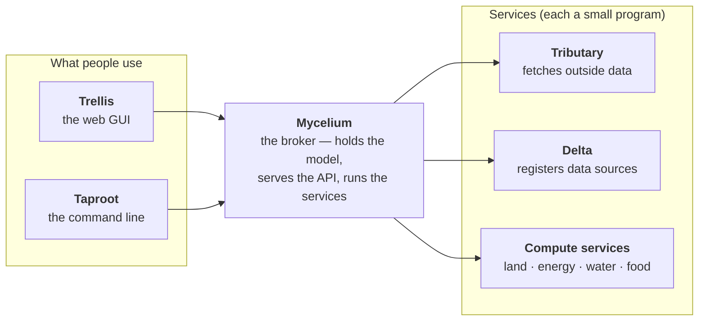
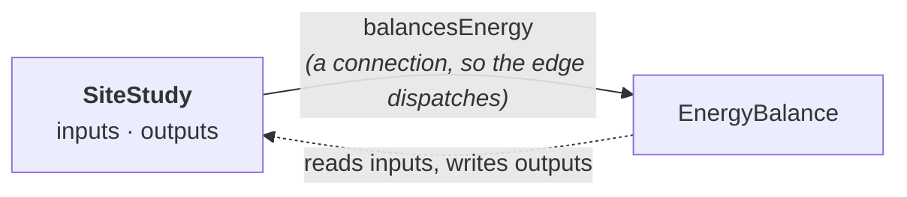
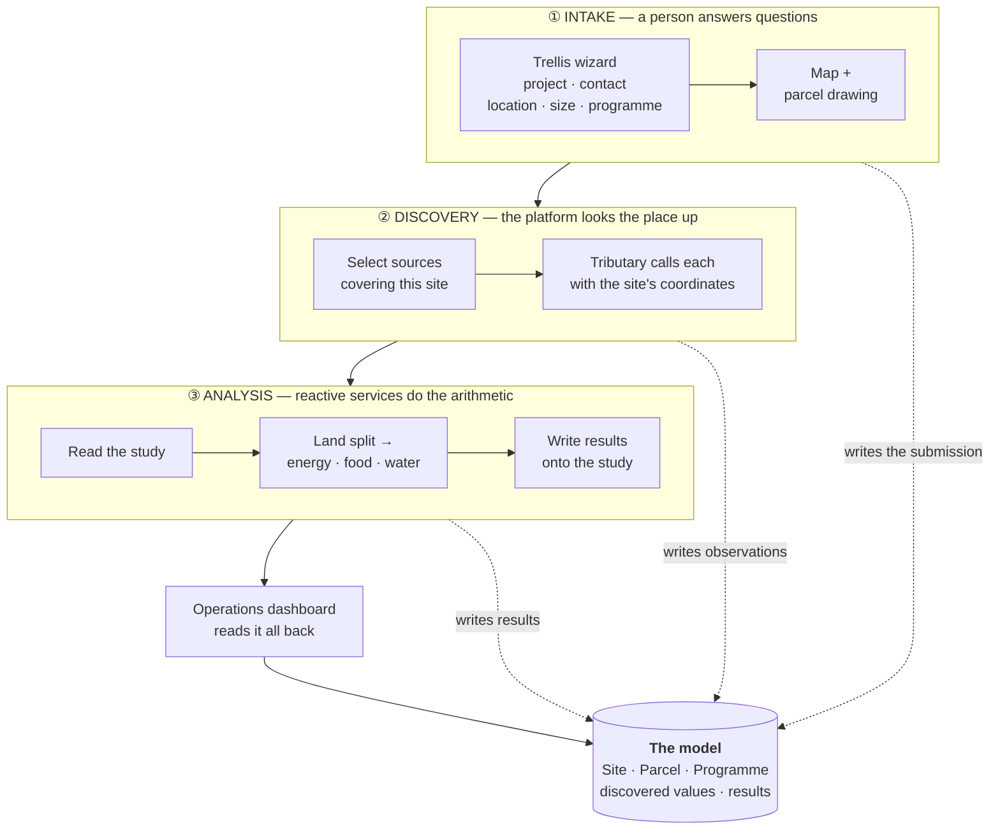
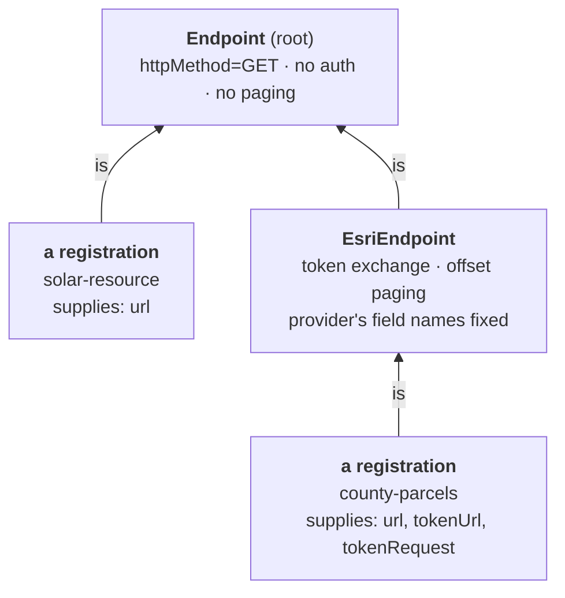
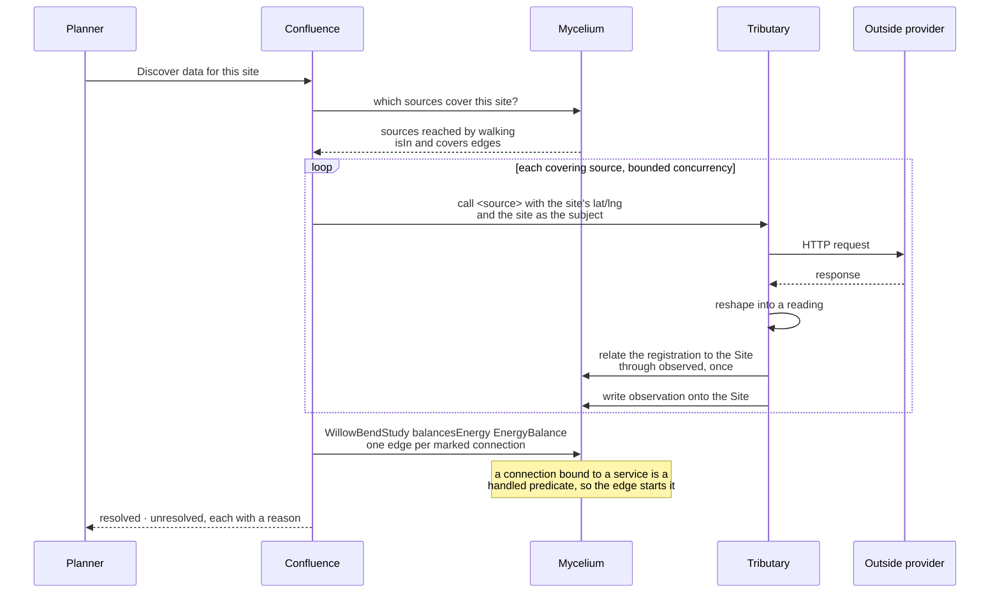
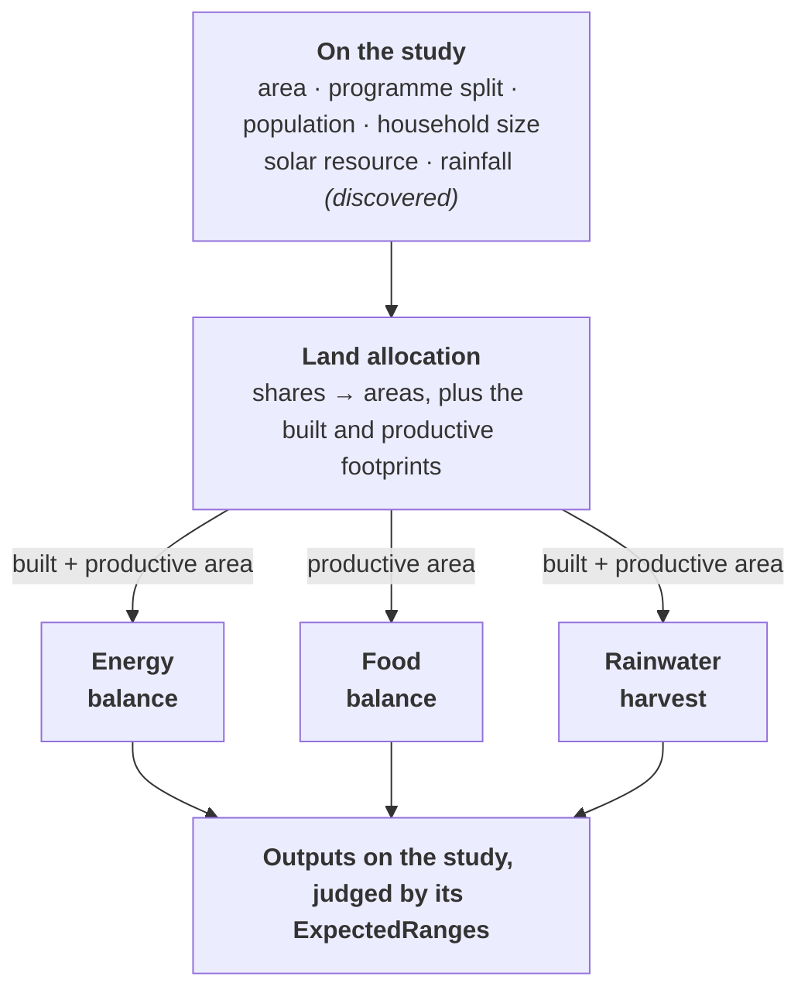
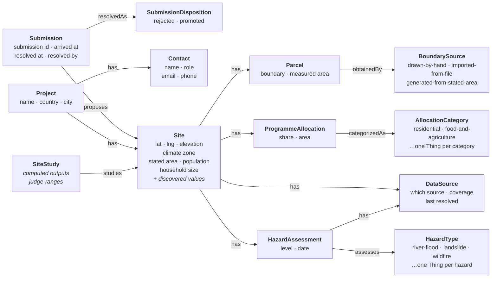
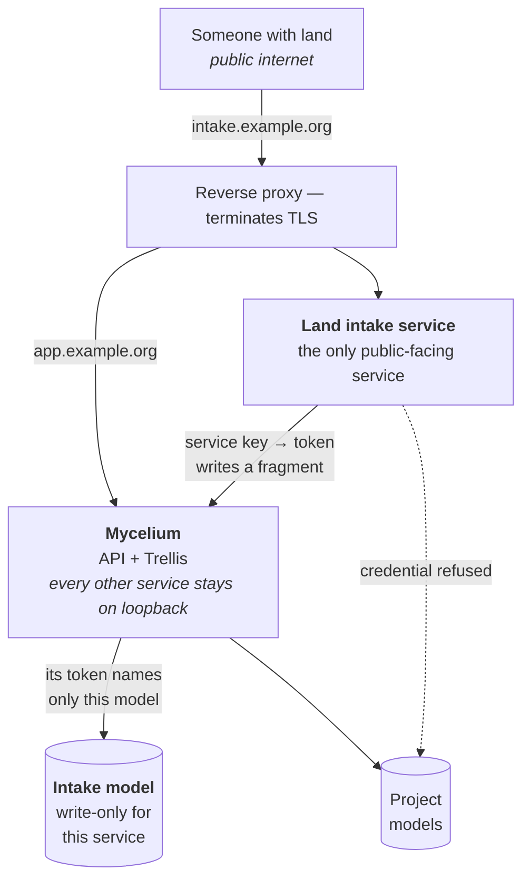
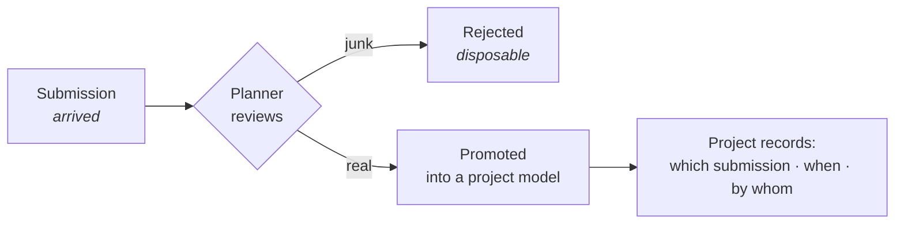

# Land Intake and Site Analysis — Design

> **Status: partly built.** The archetypes exist and a model can be seeded with them, the intake
> service composes a submission into them, and the wizard collects what a planner types and posts it
> (#6016), shows the site on the map as the position is given (#6014), and draws the parcel boundary
> checked against the stated area (#6015). Anonymous submission and open-data discovery are still
> design.
> Tracked as Epic
> [#6012](https://dev.azure.com/ReGenVillages/VillageOS-API/_workitems/edit/6012) (client, services)
> and Epic [#6033](https://dev.azure.com/ReGenVillages/VillageOS/_workitems/edit/6033) (model, broker).
> Where this document says "will", that part is not built yet. Where it says "already", the capability
> exists today and is referenced from the doc that describes it.

## Contents

- [1. The problem](#1-the-problem)
- [2. Vocabulary](#2-vocabulary)
- [3. The design in one picture](#3-the-design-in-one-picture)
- [4. Phase one — intake](#4-phase-one--intake)
- [5. Phase two — discovery](#5-phase-two--discovery)
- [6. Phase three — analysis](#6-phase-three--analysis)
- [7. The model](#7-the-model)
- [8. The calculations, worked through](#8-the-calculations-worked-through)
- [9. Public submissions and the trust boundary](#9-public-submissions-and-the-trust-boundary)
- [10. What exists, what is new](#10-what-exists-what-is-new)
- [11. Gaps found while designing this](#11-gaps-found-while-designing-this)
- [12. Handling personal data](#12-handling-personal-data)
- [13. Decisions still open](#13-decisions-still-open)

---

## 1. The problem

Someone owns a piece of land and wonders whether a regenerative village could work on it. Answering
that means knowing four things: **where the land is**, **how big it is**, **what the site's climate
and hazards are**, and **whether the land can plausibly feed, water and power the people you would
put on it**.

Today that question is answered by a questionnaire and a calculator that produce a JSON file
somebody files by hand. The flow is good — the sequence of questions is the right sequence — but
the output has three problems:

| Problem | What it means in practice |
|---|---|
| **Nothing persists** | The answers live in the browser's memory. A page refresh loses them. |
| **Nothing is fetched** | The "open data sources" step is a list of links. A person opens each one, reads a number off a map, and types it back in. |
| **No number has a source** | The solar figure is a formula applied to latitude. A hazard level is whatever someone typed. Once it is in the file, an estimate and a measurement look identical. |

The design below keeps the sequence and fixes all three, by expressing intake in the platform
VillageOS already has rather than as a standalone tool.

**The one-line version:** a planner draws a parcel, the platform fetches what is publicly known
about that location, reactive services compute the balances, and everything — the answers, the fetched
values, the results, and where each came from — lives in the model.

---

## 2. Vocabulary

VillageOS has its own words for things. This section is the glossary; skip it if you already know
them.

### The model

**Thing** — any object in the model. A site is a Thing. So is a building, a pump, a data source, and
a pipeline. Everything is a Thing.

**Property** — a named value on a Thing. `areaHectares`, `population`, `rainfallMillimetresPerYear`.

**Relationship** — a named, directed link between two Things: `WillowBend has Parcel-01`. The name in
the middle is the **predicate**.

**`is` and archetypes** — `is` is a special predicate meaning "is a kind of". `WillowBend is Site`
makes `Site` an **archetype** — a template Thing whose properties are inherited by everything that
`is` it. Change the archetype, and every instance sees the change.

**Effective properties** — a Thing's own values, plus everything it inherits through its `is` chain,
merged with its own values winning. When code asks "what is this site's rainfall", it asks for the
effective property and does not care whether the value is set directly or inherited.

**Fact vs observation** — the two ways to write a value, chosen by intent:

| | Fact | Observation |
|---|---|---|
| **For** | Structural truth — a stated area, a confirmed boundary, a configuration | A sampled reading — a fetched rainfall figure, a sensor value |
| **Guarantee** | Synchronous, never lossy, survives replay | Queued and batched; retention is bounded |
| **Example here** | "The planner stated 24 hectares" | "The weather service reported 700 mm/yr on this date" |

A property declares which kinds it accepts. Writing the wrong kind is refused. This matters for
intake: a planner's assertion and a fetched measurement are genuinely different sorts of claim, and
the model records which is which.

**Model** — one whole graph of Things. A deployment holds several: one per project, plus special
ones. Every request carries a token naming the model it applies to, so two projects cannot see each
other.

**Fragment** — a partial model posted in one call: some Things, some relationships, some values. It
**upserts** — creating what is missing and updating what exists — so posting the same fragment twice
produces one result, not two. This is how a submission enters the model.

### The parts



**Mycelium** — the broker. It holds the models, serves the API, authenticates every caller, and
starts and supervises the services. Everything goes through it.

**Trellis** — the web GUI. Has a graph view, a 3D building viewer, and a dashboard.

**Taproot** — the command-line client.

**Microservice** — a small program that does one job. Mycelium launches it, hands it a token, and
calls it over plain HTTP. It can be written in any language.

**Endpoint service** — a microservice that exposes its own API through Mycelium. Callers post to
`/api/endpoints/<name>` and Mycelium forwards the body to the service. The `<name>` is a routing
label stored in the model, not a DNS subdomain.

**Tributary** — the service that calls outside data providers. It is deliberately generic: a provider
is described entirely by configuration, never by code written for that provider.

**Delta** — the service that validates and registers those provider descriptions.

**Compute service** — a microservice that reads its inputs off one Thing, computes, and writes its
outputs back onto the same Thing. What is left to one is what a formula on the study cannot express: a
verdict, and anything worked out across a set.

**Derived property** — a formula the study declares and the model computes, over the study's own values
and what it inherits. It refuses every value write, which is why nothing else may assert a figure
declared this way.

### How a calculation is started and kept current

A calculation is **not** a graph of boxes and wires here. It is a service that reads and writes one
Thing, started by an edge and kept current by a subscription.



- **Handled predicate** — a predicate Thing bound to a service. Creating a relationship whose
  predicate is one dispatches that service, handing it the subject. The model carries the trigger.
- **Connection** — the Thing that binds a predicate to a service. It is the predicate in the edge
  above, which is why relating a study to a service is what starts it.
- **Effective properties** — a Thing's own values plus everything it inherits through its `is` chain.
  A service reads these, so an assumption declared once on a shared archetype reaches every study.
- **Input-change subscription** — a service watches the Thing it computed and recomputes when one of
  its *declared inputs* moves. It watches its inputs rather than the Thing itself because it writes
  its outputs there too, and reacting to those would recompute forever.
- **Recompute round limit** — a bound on a chain where one computed value feeds another. Land
  allocation writes footprints that the balances read, so the cascade settles or stops and names what
  was still moving.

Nothing has to be re-run: a planner changing an assumption changes a property, and every balance that
declared it as an input recomputes.

---

## 3. The design in one picture

Three phases, in order. Each is independent of the others and can be re-run on its own.



**Why three phases and not one.** Discovery talks to the outside world; analysis does not. Keeping
them apart means a planner can adjust an assumption and re-run the analysis instantly, without
re-calling a public data provider. It also means one unreachable provider degrades the picture
instead of failing the whole thing.

---

## 4. Phase one — intake

### What is collected

| Step | Questions |
|---|---|
| **Project** | Project name, country, nearest city, notes on any existing surveys or data |
| **Contact** | Name, relationship to the project, email, phone |
| **Location** | Coordinates — typed, or extracted from a pasted map link. Optional elevation and boundary file |
| **Size and programme** | Land area (hectares or acres), population, household size, and which programme categories the village needs with roughly how the land divides between them |
| **Parcel** | The actual boundary, drawn on a map |

The programme categories are residential; food and agriculture; green, water and restoration;
commercial and retail; community, education and health; and mobility and infrastructure. Each is
toggled on or off and given a share.

### The map and the parcel

This is the only genuinely new user-interface capability. Trellis has three canvases already — a
graph view, a 3D building viewer, and a pipeline editor — and none of them can show a map or accept
a geographic coordinate.

Two ways to get a boundary:

1. **Place a draft.** Given a stated area and a location, drop a square of exactly that area centred
   on the point. The planner then drags its corners to the real boundary.
2. **Draw it.** Click points around the perimeter, then adjust.

Either way, the drawn area is measured and compared against the stated area:

```text
  Stated:  24.00 ha        Drawn:  23.4 ha        ✓ within tolerance
  Stated:  24.00 ha        Drawn:  9.7 ha         ✗ 60% smaller
```

That comparison is quietly one of the most valuable things in the whole flow. Someone types "60
acres" off a deed, draws what they believe the boundary is, and the two disagree by half. Catching
that here stops a wrong area propagating into every calculation downstream — because **every**
downstream number is proportional to it.

> **Accuracy note.** The drawn area is computed on the sphere, not by treating latitude and longitude
> as flat coordinates. A flat calculation looks fine near the equator and is meaningfully wrong at
> higher latitudes.

### What gets written

The wizard posts the **submission** — what it has collected so far — to the intake service
(`vos.Service.Intake`). The service composes one **fragment** from it (Things, relationships and values
in a single call) and applies it. Because a fragment upserts, progress can be saved as the planner
goes: the same submission posted again updates rather than duplicating. Closing the tab does not lose
the work.

```jsonc
{
  "submissionId": "9f1c74d6-0b8e-4a52-bd31-6c7e5a92f048",  // every identifier derives from this
  "project": {                                // the undertaking; it holds the site
    "name": "Willow Bend Regeneration",
    "country": "Portugal",
    "nearestCity": "Santarém",
    "existingDataNotes": "Rainfall held from a 2024 survey; no solar measurements."
  },
  "contact": {                                // hangs off the project, so it can change on its own
    "name": "Ana Ferreira",
    "relationshipToProject": "landowner",
    "emailAddress": "ana.ferreira@example.pt",
    "phoneNumber": "+351 200 000 000"
  },
  "site": {
    "name": "Willow Bend",
    "latitude": 39.5012,
    "longitude": -8.4137,
    "statedAreaHectares": 24.0,              // what the planner asserted
    "population": 320,
    "householdSize": 2.4
  },
  "parcel": {                                 // left out until a boundary has been drawn
    "boundarySource": "drawn-by-hand",        // a term the model declares, not free text
    "boundary": [
      { "latitude": 39.4990248, "longitude": -8.4165190 }
      // …at least three corners
    ]
  },
  "allocations": [                            // shares are taken as given and normalised later
    { "category": "residential", "sharePct": 22, "allocatedAreaHectares": 5.28 },
    { "category": "food-and-agriculture", "sharePct": 34, "allocatedAreaHectares": 8.16 }
    // …one entry per category, each naming a category only once
  ],
  "hazards": [                                // no level here: that is read from the source
    {
      "hazardType": "river-flood",       // a term the model declares, not free text
      "source": {                             // becomes a Thing the assessment hangs off
        "name": "National flood portal",
        "coverageDescription": "Mainland river catchments, updated yearly."
      }
    },
    { "hazardType": "wildfire", "source": { "name": "National flood portal" } }
    // …two hazards naming one source share that source
  ]
}
```

`allocatedAreaHectares` is shown above because the wire accepts it, but a submission need not carry it:
land allocation writes that property and `normalisedSharePct` as its own outputs, so a figure submitted
alongside the share is a second answer to a question the analysis already answers. The wizard sends the
share alone.

Each of these rules exists to stop a particular kind of quiet damage:

| Rule | Why |
|---|---|
| **One place composes the fragment** | The signed-in wizard and a public submission post the same document to the same service, so there is one mapping from a submission to the model rather than one per caller. |
| **Identifiers derive from the submission** | A wizard saves as it goes and a planner can double-click. A freshly generated identifier would build a second site beside the first; a derived one lands on the same Things every time, which is also what lets promotion be idempotent later. |
| **A field not filled in yet is left out, not zeroed** | An absent value reads as absent. A zero standing in for one cannot be told from a real answer — the same reason a computed output is declared and left empty. |
| **A field the service does not write is refused** | A submission accepted and quietly dropped leaves the planner believing it was recorded. The refusal names the field. |
| **The submission's identifier is a unique one** | Every Thing derives its identity from it, so two submissions carrying one identifier are one site. On a route anybody may post to, an identifier anybody could arrive at is a way to write over somebody else's submission. |

The **measured area is computed by the service** from the boundary, not submitted alongside it, so the
figure the planner saw and the figure the model holds cannot drift apart. Coordinates arrive as named
`latitude` / `longitude` pairs, because a coordinate pair read in the wrong order is a mistake nothing
downstream can catch; the boundary is stored as a GeoJSON polygon, which is longitude-first.

The body is **capped at a few hundred kilobytes** — far above a form's worth of answers and a drawn
boundary, and low enough that a body cannot cost the service its memory before anything has looked at
it. Every field inside it is bounded too: text has a length, coordinates a range, and areas, populations
and shares a plausible span. `SubmissionLimits` holds the whole set, and each bound refuses by naming the
field and never by quoting what was in it. The cap and the bounds sit under the rate limiting and the
ticket a public endpoint needs, not in place of them
([§9](#9-public-submissions-and-the-trust-boundary)).

**The answer carries a reference and nothing else.** A submitter is told what to quote to whoever
reviews the submission — the identifier the form generated — and not what the model called the Things it
composed. A stranger has no business knowing the shape of the model they submitted into, and the planner
using the wizard has the submissions page for that.

---

## 5. Phase two — discovery

### The idea

Instead of a list of links a person clicks, each data provider is **registered** as a Thing in the
model describing how to call it. Tributary reads that description and makes the call.

There is no code anywhere that knows about any particular provider. A provider is configuration.

### How a registration works

Registrations inherit from a small hierarchy of templates, so shared behaviour is declared once:



A registration's allowed settings are the union of everything declared along its chain, and a value
resolves to the nearest ancestor that sets it. **Delta** validates all of that at registration time
and refuses anything that does not fit, so a broken configuration fails immediately rather than at
3am during a run.

**A registration lives in the project's own model, not in a catalogue shared between projects.** A
model is the boundary of every read, so an endpoint and the Site its readings name have to be in the
same one. [`DELTA.md`](DELTA.md#which-model-a-registration-lives-in) records the decision and what
forces it.

### A registration, in full

```jsonc
{
  "name": "solar-resource",
  "properties": {
    "url": "https://api.open-meteo.com/v1/forecast?latitude={lat}&longitude={lng}&hourly=shortwave_radiation",
    "httpMethod": "GET",
    "coverage": "global",
    "responseTransform": "{ \"name\": $siteName, \"properties\": { \"solarResourceKwhPerM2PerYear\": $round($sum(hourly.shortwave_radiation) / 1000) }, \"observedAt\": hourly.time[0] }"
  },
  "relationships": [ { "subject": "solar-resource", "predicate": "is", "target": "Endpoint" } ]
}
```

Three parts do the work:

- **`url`** with `{lat}` / `{lng}` placeholders, filled in per call from the `addressParameters` the
  caller supplies. One registration serves every site.
- **`coverage`** — where this source applies. `global`, or a set of countries.
- **`responseTransform`** — a **JSONata** expression, which is a small language for reshaping JSON.
  It turns whatever the provider returns into a **reading**.

### What a reading is

A reading is the standard shape Tributary ingests. Three fields:

```jsonc
{
  "name": "Willow Bend",                                  // which Thing this is about
  "properties": { "solarResourceKwhPerM2PerYear": 1750 }, // what was measured
  "observedAt": "2026-07-26T00:00:00Z"                    // when
}
```

Tributary finds the Thing named `Willow Bend` and writes the value onto it as an **observation** at
that time. The site now carries a solar figure that came from somewhere, with a date attached.

> This pattern already works and is proven — the precipitation and solar-resource slices in
> [TRIBUTARY.md](TRIBUTARY.md#example-precipitation-onto-a-site-5805) do exactly this today.

### The discovery run



The analysis starts whatever mixture resolved, including none — a site whose sources were all
unavailable is the case a planner most needs an answer about. Confluence never calls a compute
service: it writes the edges and the platform dispatches, so there is one way to start an analysis
rather than two. The subject is the study, because that is where a service reads its inputs.
See [CONFLUENCE.md](CONFLUENCE.md#starting-the-analysis).

Selection is a **graph walk, not a string match**: a source `covers` a Place, the site `isIn` a
Place, and Places nest. A source cannot be silently skipped because a country was spelled two ways
— see [CONFLUENCE.md](CONFLUENCE.md). Coverage selection lives in a service rather than in Mycelium,
which carries no intake vocabulary.

**Partial failure is normal and must be tolerated.** Public data portals go down. One source failing
leaves its value undiscovered; it does not stop the others and it does not abort the run. The run
reports exactly what did and did not resolve, with a reason — a quietly short list is the failure
mode of the tool being replaced, where an unrecognised country spelling silently hid sources that
did in fact cover the site.

### What to fetch first

| Value | Replaces | State |
|---|---|---|
| Climate zone | A zone nobody could enter, because the property takes observations only | Registered as seed data (#6734) |
| Solar resource | A curve applied to latitude, feeding straight into the energy balance | Reshape proven, not yet seeded |
| Rainfall | A number the planner is asked to type, feeding the water balance | Reshape proven, not yet seeded |
| Hazard levels | Hand transcription of eight levels from a separate portal | Portal identified, not callable per site (#6735) |
| Elevation and terrain | A manually entered value | Nothing registered |

**The registered sources ship in the seed, not in a call.** A registration lives in the project's own
model, so a source every project uses belongs in the seed every project is created from — which is a
template in the platform repository, `open-data-sources.template.json`. That template also declares the
`Place` archetype coverage is walked over and the `isIn`, `covers` and `resolvedBy` predicates. See
[`DELTA.md`](DELTA.md#which-model-a-registration-lives-in) for why a shared catalogue was refused.

**A site's climate zone is a Köppen-Geiger code** — `Csa`, `BSk`, `BWh` and the rest of that scheme.
Naming the scheme is what makes a code mean anything: the provider registered for it answers with a
code from every classification it holds, and several of them use overlapping letters, so a zone read
against the wrong scheme is a plausible value nothing can tell apart from the right one. The
registration selects Köppen-Geiger by the marker the provider gives it; see
[`TRIBUTARY.md`](TRIBUTARY.md#example-a-climate-zone-onto-a-site-6734).

Not every provider can be registered. Some are map portals with no data interface; some are
commercial products behind a licence. Those stay as links — but recorded **as Things in the model**,
flagged as needing a manual read, so the gap is visible rather than implied by absence.

---

## 6. Phase three — analysis

The analysis reads what is in the model and answers back onto the study. It makes no outside calls.

**A figure the study can work out for itself is declared on the study, not asserted by a service.** The
shared `SiteStudy` archetype carries the formula for each one, and the model computes it when the model
loads and again whenever a term moves — so the arithmetic is checked against the properties the study
declares, a page can show a figure's working, and a term with no answer leaves the figure unknown rather
than failing the service that would have written it. That last part is what lets a site nobody surveyed
read as not assessed instead of as a site that failed.

What is left to a service is what a formula over one Thing cannot express: a verdict, which is a boolean
where an expression yields a number, and anything worked out **across a set** — the land shares
apportioned over the allocations, and the harvest apportioned over the demands in serving order.

Each of those is a **reactive service**, not a node in a graph. A relationship whose subject is the
study and whose predicate is the connection bound to the service is what dispatches it: the service
reads the study's effective properties, computes, writes what is its to write back as Facts, and starts
watching the study. Every later change to an input recomputes on its own.



The arrows are property reads and writes on one Thing, not wires. Land allocation writes the two
footprints; the balances read them and re-fire. Nothing sequences them — each recomputes when an
input it declared moves, and the cascade is bounded by the model's recompute round limit.

Two of the boxes need no service any more. Every water-reserve and food-balance figure is a formula on
the study, so both services now assert nothing and their dispatch is waiting to be removed (#6747,
#6748). The energy balance keeps only its verdict, and the rainwater harvest keeps the apportionment
across the demands.

**Assumptions are inherited, not supplied per run.** Yield per hectare, runoff coefficient, energy per
person, water per person — these are judgement calls a planner will want to vary, and they live on the
shared `SiteStudy` archetype. A study inherits them through its `is` edge, so correcting one is an edit
to the model rather than a redeploy, and a planner varying one sees the balances move without asking
for anything to run again. That last point is why this shape was chosen over a graph run once per
request.

**A missing discovered value is reported, not defaulted.** If rainfall did not resolve, the harvest
volume the formula reads it into stays unknown rather than falling to nought, and the study's "not
assessed" range holds. A balance computed against a silently substituted number is worse than no answer,
because it looks like an answer.

### What a service call looks like

A dispatched relationship names the study; the service answers with what it computed:

```jsonc
// Mycelium → the service                   // the service → Mycelium
{                                            {
  "relationshipId": "…",                       "success": true,
  "subjectId": "…",   // the study             "outputs": {
  "targetId":  "…",                              "peopleFed": 20.4,
  "properties": { }                              "pctOfPopulationFed": 6.375
}                                              }
                                             }
```

The inputs are not in the body. The service reads them off the study by name, which is what lets an
assumption declared on the shared archetype resolve without the caller knowing where it came from.

---

## 7. The model

### The archetypes



**A category, a boundary source and a hazard type are Things, and a submission relates to them.** All
three vocabularies are declared in the model, so a project whose programme divides differently, or whose
hazards differ, adds a Thing rather than changing a service. The composer resolves the submitted word against what the model declares and refuses one that
matches nothing, naming the terms the model holds. It finds each vocabulary by a mark its archetype
carries and writes the edge through the predicate the model marks, never by either name — so a model that
renames one keeps working, and land allocation reads the category's footprint flags off the Thing at the
end of the edge. **The edge is the only record**: neither term is also written as a word on the Thing it
came from, because a copy beside the edge can be read but not walked from, and two readings of one value
can come to disagree with nothing to notice.

The design decisions worth stating:

**The parcel is its own Thing, not a property on the site.** A site can be re-surveyed. Keeping the
boundary separate means a new survey is a new Thing with its own history, and the geometry can carry
its own provenance — drawn by hand, imported from a file, or auto-generated from a stated area. That
last one matters: a square generated from a number is not evidence of anything and should not look
identical to a surveyed boundary.

**Everything hangs off its holder by the generic `has` predicate.** Nothing binds a service to these
edges, so a predicate per pair — `hasParcel`, `hasHazard` — would be vocabulary the platform carries for
no behaviour. A reader tells a parcel from a hazard by what the target `is`. Two predicates are named
instead: `studies`, which the site survey already uses to relate a study to the site it is about, and
`proposes`, which the arrival record uses to reach the site — for the reason below.

**The arrival is a Thing of its own, and it does not travel.** A `Submission` holds the identifier the
wizard sent, the time the service accepted it, and — once someone has dealt with it — when and by whom.
It reaches its site through `proposes` rather than `has`, and it asserts that edge itself. Promotion
carries the group reachable from the site through `has` and `studies`, together with every edge a member
of that group asserts; both halves are what leave this record in the staging model where it belongs. A
copy of it in a project model would read as waiting for ever, because the record is resolved after the
copy has landed.

**What was decided is a Thing too.** A `SubmissionDisposition` — `rejected`, `promoted` — reached
through `resolvedAs`, the third declared vocabulary beside the boundary sources and the allocation
categories. A word would say what was decided and nothing else; a Thing carries what follows from it,
which is where the retention period below lives. A submission with no disposition is one nobody has
dealt with, and that is what a reviewer's list is.

**Hazards are Things, not a bag of properties.** There is a fixed vocabulary of hazard types and a
fixed scale of levels, and modelling each assessment as a Thing lets it carry its date and reach the
source that produced it. The current tool stores them as a flat map with no indication where any
level came from.

**The type is a Thing too, reached by an edge.** The eight above are declared in the model under a
`HazardType` archetype, and an assessment `assesses` one of them (Bug #6737). A word could name a hazard
that exists nowhere and nothing would notice; nothing could be asked of it either — what it means, which
other sites carry it. A project whose hazards differ adds a Thing and deploys nothing.

**An assessment reaches its source, rather than naming it.** The source is the `DataSource` Thing the
assessment hangs off, not a name copied onto it. Two hazards read off one portal share one source, so
resolving that source updates both, and a reader can walk from a hazard to what produced it. A copied
name could be walked to by nothing and could disagree with the source's own with nothing to notice —
which is the difference between an assessment and a recollection.

### A site, filled in

Using a synthetic example throughout — **Willow Bend**, a fictional 24-hectare site in Portugal for
320 residents.

| Thing | Property | Value | Written as |
|---|---|---|---|
| Willow Bend *(Site)* | `latitude` | 39.5012 | Fact |
| | `longitude` | −8.4137 | Fact |
| | `statedAreaHectares` | 24.0 | Fact |
| | `population` | 320 | Fact |
| | `householdSize` | 2.4 | Fact |
| | `solarResourceKwhPerM2PerYear` | 1750 | **Observation** — discovered |
| | `rainfallMillimetresPerYear` | 700 | **Observation** — discovered |
| Willow Bend Site Study *(SiteStudy)* | `pctOfConsumption` | 90.8 | Fact — computed |
| Parcel-01 *(Parcel)* | `boundary` | GeoJSON polygon | Fact |
| | `measuredAreaHectares` | 23.4 | Fact |
| | `obtainedBy` → `drawn-by-hand` | an edge to the Thing | Relationship — the only place it is recorded |

The stated area is what the planner asserted. The measured area is what the boundary actually
encloses. The solar figure is an observation because it was sampled from a provider on a date and
will be refreshed. That distinction is the whole point of moving this into the model.

**Computed values belong to the study, not the site.** A `SiteStudy` relates to its `Site` by `studies`,
and it is the study that carries params, computed outputs and judge-ranges — whether the facts came from
a submission or from an imported building model (#6154). The site carries what is true of the land; the
study carries what an analysis made of it. A submission therefore mints both, in the same relationship
shape the IFC ingest already produces, so no reader has to ask where a site's facts came from.

Each computed output is **declared on the study with its type and no value** until something writes it
(#6159). A seeded zero cannot be told from a real result, and a range reading it would report a verdict
about an analysis that never ran.

> **Settled: `pctOfConsumption`.** The shared `SiteStudy` archetype declares the formula for it, the
> model computes it, and that archetype's `EnergyNetPositive` range reads it. A submission's study
> declares no computed output of its own — it `is` the archetype and inherits every one, so there is one
> place the name is answered rather than two that can disagree.

---

## 8. The calculations, worked through

All figures below are for Willow Bend. Every number is derived from the ones above it.

### Land allocation

Shares are normalised across the selected categories, so they always describe the whole parcel even
if the planner's numbers do not add to 100.

| Category | Share | Area |
|---|---|---|
| Residential | 22% | 5.28 ha |
| Food and agriculture | 34% | 8.16 ha |
| Green, water and restoration | 20% | 4.80 ha |
| Commercial and retail | 8% | 1.92 ha |
| Community, education and health | 9% | 2.16 ha |
| Mobility and infrastructure | 7% | 1.68 ha |
| **Total** | **100%** | **24.00 ha** |

Two derived footprints come out of this node, because both balances need them and they must be
defined in exactly one place:

- **Built footprint** = residential + commercial + mobility = **8.88 ha** — the hard surface that
  sheds rainwater.
- **Productive footprint** = food and agriculture = **8.16 ha** — the land that grows food.

Which categories roll into which footprint is **a flag each category carries in the model**, not a list
of names in the service. A category marked `__IsBuiltFootprintCategory` sheds rainwater into the built
footprint and one marked `__IsProductiveFootprintCategory` grows food into the productive one, so a
project whose programme divides differently moves a flag rather than changing a service.

A category may carry both — a roofed growing area is hard surface the rain runs off *and* land that
grows food — so the two footprints can overlap and together exceed the parcel. What must sum to the
parcel is the per-category areas.

### Energy

```text
  PV array         = residential 5.28 ha × 6% array coverage      = 3,168 m²
  Generation       = 3,168 m² × 1,750 kWh/m²/yr × 0.131           = 726 MWh/yr
  Demand           = 320 residents × 2,500 kWh/yr                 = 800 MWh/yr
  Self-sufficiency = 726 ÷ 800                                    = 91%
```

The `0.131` deserves explanation, because it is where two different ways of modelling solar meet.

| Model | Formula | Figure |
|---|---|---|
| Panel-first | installed capacity × irradiation × performance ratio | 0.17 kWp/m² × 0.77 = **0.131** |
| Area-first | area × irradiation × efficiency | efficiency = **0.131** |

The existing energy node takes an efficiency, so it uses the area-first form. Feeding it a module
efficiency of 0.20 would overstate output by about half, because module efficiency ignores inverter
losses, wiring, soiling, heat and downtime. The value the node wants is the **system yield factor** —
module efficiency multiplied by performance ratio. The port name should say so; see
[§13](#13-decisions-still-open).

### Food

```text
  People fed       = 8.16 ha × 2.5 people/ha/yr                   = 20.4 people
  Population fed   = 20.4 ÷ 320                                   = 6.4%
```

The yield is `peopleFedPerHectarePerYear` on the shared study archetype: regenerative mixed farming
producing a full diet supports roughly two to three people per hectare. Correcting it there moves the
answer for every study.

Two lines of arithmetic, and both are declared on the study rather than run by a service. The result
still carries which yield assumption produced it and which parcel area it read, and still moves on its
own when either changes — that is what a declared formula gives, without an executable to deploy. A
number worked out in a page carries neither.

Neither figure is rounded where it is computed. People fed is conceptually a whole number, but rounding
20.4 to 20 leaves it disagreeing with the 6.4% worked out from it, so the rounding belongs where the two
are displayed together.

> Yield-per-hectare is a coarse abstraction that hides crop mix, climate and diet. That is fine for
> an intake-stage estimate and should be labelled as such wherever it is displayed.

### Water

Two different questions, and a service each.

**Catchment — how much rain can we capture?** *(`RainwaterHarvest`)*

```text
  Harvest          = 8.88 ha built × 0.7 m rain × 0.8 runoff      = 49,728 m³/yr

  Domestic demand  = 320 × 55 m³/person/yr                        = 17,600 m³/yr
  Irrigation       = 8.16 ha × 5,000 m³/ha/yr                     = 40,800 m³/yr
  Total demand                                                    = 58,400 m³/yr

  Self-sufficiency = 49,728 ÷ 58,400                              = 85%
```

That single 85% hides the most useful fact on the page. It cannot be split by measuring the harvest
against each demand on its own — one body of water serves both, so that counts the same cubic metre twice
and reports 283% and 122%, which between them claim nearly four times the water there is.

The demands are served in the order the model states: drinking water first, irrigation from what is left.

```text
  Domestic     takes 17,600 of the 49,728        covered 100%,  short      0 m³/yr
  Irrigation   takes the 32,128 left, of 40,800  covered  79%,  short  8,672 m³/yr
```

Willow Bend has abundant drinking water and a marginal irrigation position, and the study now says so
with a figure a planner can act on: 8,672 m³ a year has to come from somewhere else. A site with the same
overall 85% could be the exact opposite.

**Which demands there are, the order they are served in, and the properties each is read from and written
to are Things in the shared analysis template**, not a list inside the service. Every demand is a quantity
times a rate — residents times cubic metres a person, growing hectares times cubic metres a hectare — so a
third demand is a template edit rather than a service change and a redeploy.

The domestic figure is `perCapitaConsumptionM3` on the shared study archetype — the same water-per-person
assumption the storage question reads. Two services asking two questions of one figure is what keeps a
correction to it from having to be made twice.

**Storage — how long does the tank last?** *(`WaterReserve`)*

```text
  Annual consumption = 320 × 55 m³/person/yr                      = 17,600 m³/yr
  Days of supply     = 3,000 m³ storage ÷ (17,600 ÷ 365)          = 62 days
```

Different inputs, different outputs, different question. Hence a sibling service rather than more inputs
on the existing one.

### Hazards

River flood, landslide, wildfire, earthquake, cyclone, extreme heat, water scarcity and urban flood,
each graded on a scale from "no data" to "high". Today these are typed in by hand from a separate
portal. After discovery they arrive as readings with a source and a date, which is
the difference between an assessment and a recollection.

**The portal is ThinkHazard, and its grading is the scale.** No grade is invented to close an item: the
levels are the ones it publishes, and the two ends already named are its own.

| Grade | Means |
|---|---|
| High | Potentially damaging and life-threatening events are expected at least once in the next ten years |
| Medium | Damaging events are expected, less often than that |
| Low | Events are possible but infrequent |
| Very low | No hazard of this kind is expected |
| No data | The portal holds nothing for this place, which is not the same as no hazard |

"No data" is a grade of its own and is the reason an unassessed hazard must not read as a safe one: a
hazard the portal holds nothing about stays unassessed rather than being graded "very low". Those five
are also the vocabulary platform Task 6684 is waiting on for `hazardLevel` — each becomes a Thing, and
the property becomes an edge to one.

**The portal cannot yet be called for a site (#6735).** Every one of its routes takes an administrative
division code, and its per-hazard route takes a two-letter code for the hazard type — `FL`, `LS`, `WF`.
Neither is in the model: a site carries coordinates, and a `HazardAssessment` carries the hazard type as
a word. Two things have to exist before a registration can be written. The Place a site is in has to
carry the portal's division code, which is a natural home for it because the portal's divisions are
exactly what a Place is. And the hazard type has to be a Thing that can carry the portal's own code for
it, which is the migration Bug #6736 begins. Until then the level takes observations only and nothing
can write one, so every hazard a submission mints reads as unassessed.

---

## 9. Public submissions and the trust boundary

A planner using Trellis is signed in. A stranger submitting their land is not. Those are different
situations and the design treats them differently.

### How authentication works today

Every request to the API carries a token, and the token names the model it applies to. There are no
exceptions except signing in itself. That single rule is what keeps two projects from seeing each
other's data.

Callers hold a role — admin, editor, viewer, or service — and endpoints require a named policy such
as "may read the model" or "may modify data".

### The existing route for service endpoints

```mermaid
sequenceDiagram
  participant Trellis
  participant Mycelium
  participant Service
  Trellis->>Mycelium: POST /api/endpoints/&lt;service&gt;<br/>Authorization: Bearer …
  Mycelium->>Mycelium: check token · check policy<br/>resolve the model from the token
  Mycelium->>Mycelium: find the service by its routing label<br/>(read live from the model)
  Mycelium->>Service: start it if not running,<br/>then forward the body to /handle
  Service-->>Mycelium: result
  Mycelium-->>Trellis: result
```

This gives a lot for free: one authentication system, model scoping, services started on demand,
per-route traffic statistics, and — importantly — the services themselves never listen on a public
address. They are reachable only from the machine Mycelium runs on.

**Authenticated planner work needs nothing new.** Trellis posts to this route and the service runs.

**A signed-in submission goes through the intake service too.** Not because it has to — a signed-in
wizard could compose the fragment itself — but because then there would be two mappings from a
submission to the model, and the second one to change would be the one that was wrong. The planner's
wizard and a stranger's form make the same two calls and carry no credential on either, so there is one
path to keep working rather than a guarded one and an unguarded one that only the stranger ever
exercises.

**A refusal says only what the caller can act on.** A submission naming a field wrongly is answered
`400` with the field named, because whoever filled the form in can correct it. Anything wrong with the
deployment — a model that was never seeded with the archetypes, for one — is answered `503` with
nothing in the body, and what is actually wrong goes to the log. A stranger is not told the state of
the model they are submitting into.

### Why public intake gets its own service

The obvious shortcut is to allow anonymous calls on that route for one label. It should not be taken.

The route resolves its routing **from data in the model**. Whatever labels the model happens to
contain are what the route can reach. Allowing anonymous access there means one mistyped or copied
property in a seed file publishes an internal service to the internet. Security that depends on
nobody mistyping a property is not security.

So public submission gets a separate, small program with one job:



| Property | How it is achieved |
|---|---|
| Anonymous in | The service decides; no platform rule is widened |
| Rate limited, size capped, ticket checked | Owned by the service, where the public traffic is — see "What guards the route" below |
| Cannot read project data | Its credential names only the intake model: a key created against a model is exchanged for a token naming that model, and refused one naming any other |
| Writes go through normal auth | It mints a Mycelium token and posts a fragment, like any service |
| Blast radius of a mistake | One service, not every endpoint in the model |

### What guards the route

`POST /submissions` demands no credential of anybody. Four guards stand in place of one, each answering a
different way the route can be abused, and each owned by this service rather than by a platform rule.

| Guard | What it does | What it does not do |
|---|---|---|
| **Body cap** | A body larger than a form's worth of answers is refused on its declared length, before anything reads it | Say anything about a body that fits |
| **Field bounds** | Text has a length, a coordinate a range, an area and a population a plausible span. A refusal names the field | Judge whether the answer is true |
| **Ticket** | `GET /submissions/ticket` hands out a short-lived value this service signed, and a post carries it back in `X-Submission-Ticket`. A post that never asked is refused | Establish that the caller is a person: asking for a ticket costs nothing, so an automated submitter that fetches before each post satisfies it |
| **Rate limit** | One source may make a fixed number of requests in a fixed window, ticket requests included. Over it, `429` with a `Retry-After` telling the caller when to come back | Tell two submitters behind one address apart |

The ticket and the rate limit work as a pair: the ticket makes an automated submitter come and ask, and
the rate limit is what bounds how often it can. Neither is a challenge from a third-party service, and
this platform is meant to run without one — so this is what it can honestly claim, and the staging model
in front of a reviewer is what catches the rest.

**A source is the address the reverse proxy forwards.** Every caller reaches this service through the
proxy, so the connection itself is always from loopback; the caller's own address arrives in
`X-Forwarded-For`, which the service reads and trusts only from loopback. Without that, one budget would
be shared by everybody on the internet. The signing key for tickets is made when the process starts, so a
ticket is only good at the instance that issued it — one service, one hostname, as in
[`deploy/`](../deploy/README.md).

**On "subdomain".** The routing label on an endpoint connection is called a subdomain, but it is a
path segment, not DNS — nothing in the broker reads the request's host name. If you want
`intake.example.org`, that split belongs in the reverse proxy. Do not teach the broker host-header
routing; it currently knows nothing about deployment topology, and that is a feature. The proxy
configuration that makes the split — both hostnames, TLS termination, and the form's cross-origin
allowance — lives in [`deploy/`](../deploy/README.md).

### From submission to project

Submissions land in a staging model. Becoming a project is a deliberate act.



Anything anonymous attracts junk, and junk already sitting in a working model is expensive to remove.
Promotion must be idempotent — a planner double-clicking must not create two projects — which means
deriving the new identifiers from the submission rather than generating fresh ones.

A reviewer does this either from the **Submissions** page in Trellis or from `submissions list`,
`submissions reject` and `submissions promote` in Taproot. Both read the same model the same way — by
the marks it puts on its own vocabulary rather than by any name — and both call the same two actions,
so a staging model can be worked from a browser or a terminal. Clearing the rejected ones once their
period has run is `submissions dispose`, which has no page: it is a retention pass rather than
something a reviewer decides. See [the Trellis guide](TRELLIS.md#87-reviewing-what-has-arrived) and
[the Taproot guide](TAPROOT_USER_GUIDE.md).

---

## 10. What exists, what is new

The main finding from designing this: most of it is already built.

| Capability | Status |
|---|---|
| Energy balance calculation | **Exists** as a reactive service |
| Water storage calculation | **Exists** as a reactive service |
| Land allocation, and the food balance and rainwater harvest above it | **Exists** as reactive services |
| Dispatching a service by relating a Thing to it | **Exists** (handled predicates) |
| Recomputing a service's outputs when its inputs move | **Exists** (input-change subscription) |
| Bounding a chain where one computed value feeds another | **Exists** (recompute round limit) |
| Fetching outside data as configuration, reshaping it, ingesting onto a Thing | **Exists** (Tributary) |
| Validating and registering data sources | **Exists** (Delta) |
| Rendering a report from a spec stored in the model | **Exists** (operations dashboard) |
| Posting a whole submission in one idempotent call | **Exists** (fragments) |
| Authentication, model isolation, service supervision | **Exists** (Mycelium) |
| Composing a submission into the model's own shape | **Exists** (`vos.Service.Intake`) |
| — | |
| A map, and drawing a parcel on it | **Exists** — the map module (#5346), the wizard showing the site on it (#6014), and parcel drawing with the drawn area checked against the stated area (#6015) |
| The intake wizard | **Exists** — what a planner types (#6016), the site on the map (#6014), and the parcel step (#6015) |
| Anonymous submission: rate limits, size caps, field bounds, a ticket | **Exists** (#6026, #6027) — the route takes a submission from someone holding no credential, guarded as [§9](#what-guards-the-route) describes |
| Land-intake archetypes, registrations, compute connections, dashboard spec | **New** — but data, not code |

---

## 11. Gaps found while designing this

Checking the code rather than the documentation changed the design in the places below. Each is
tracked under Feature
[#6050](https://dev.azure.com/ReGenVillages/VillageOS-API/_workitems/edit/6050).

### The fetcher is not a step inside the calculation, and should not be

It was briefly, and that was deliberately reversed. Tributary is a **spawner**: it populates the
model, and the compute services read what it wrote.

The first draft of this design had the analysis fanning out over fetch steps. That was wrong, and the
correction is an improvement: the compute has no network dependency, so varying an assumption costs
nothing and re-hits no public data portal. That matters more under the reactive shape than it would
have under a graph run once per request, because a reactive chain re-fires on every input change.

### The address can now be parameterised per call

It could not. The outbound call resolved its address entirely from the registration, so "fetch the
solar figure at *these* coordinates" could not be expressed and you would have needed one
registration per site, growing the catalogue with every submission.

Feature [#5917](https://dev.azure.com/ReGenVillages/VillageOS-API/_workitems/edit/5917) closed it.
The stored address carries named placeholders and the caller supplies `addressParameters` for them,
per call. The substitution is generic — it knows the names only as text — so the same mechanism
serves a tile pyramid and a point query at a site's coordinates. See
[TRIBUTARY.md](TRIBUTARY.md#per-call-address-parameters).

### A registration's reshape expression now ingests

It did not. The ingest branch was chosen on whether the **request** supplied a reshape expression, so
an expression configured on the registration — the documented, steady-state configuration — returned
a transformed body and wrote nothing. Supplying it on the request did ingest, but that path also
persisted the caller's expression onto the registration, so a read mutated its own configuration and
two consumers of one source overwrote each other.

Bug [#6051](https://dev.azure.com/ReGenVillages/VillageOS-API/_workitems/edit/6051) closed both
halves. The expression **in effect** decides — on the registration or inherited from its template —
and a request-supplied one reshapes that call alone. The design above depends on this: a source
registered once, with its reshape on the registration, writes onto the site every time it is called.

### Only one project could register an endpoint at all — fixed

Delta writes a registration into the model of whoever called it, which is the shape this design
wants. Its **template catalogue** did not follow: it was provisioned once at startup, under the token
Delta was launched with, so it landed in a single model. One Delta process serves every project,
because a second project's call finds the daemon already healthy on the port both models declare — so
a registration from any other model passed every validation step and then failed on its template
being absent, with a 500.

Delta now provisions a model's catalogue on that model's first registration, under the bearer that
named it, and remembers which models it has done. Fixed under Bug
[#6525](https://dev.azure.com/ReGenVillages/VillageOS-API/_workitems/edit/6525).

---

## 12. Handling personal data

Intake collects names, email addresses and phone numbers by design. That makes it the one flow in the
platform where personal data moves through application code, so it carries a standing rule.

**Contact details live in the model, under a retention rule. Nowhere else.**

| Place | Rule |
|---|---|
| Source code | No contact details in constants, examples, presets or defaults |
| Seed and example data | Invented people, invented addresses, invented numbers |
| Test fixtures | Synthetic. Never a copied real submission |
| Logs | A submission may be logged **by reference**, never by content. A refusal is logged by its reason and its source; rejected payloads are not logged verbatim |
| Error responses | Name the field, not the value. Nothing echoes a submitted detail back |
| Documentation and screenshots | Synthetic submissions only — as in this document |

**The model keeps them, and keeps no history of them.** Every property on the `Contact` archetype is
declared to keep only its current value. A property that keeps history is copied out of the commit log
into the storage tiers, where retracting the Thing that owned it removes nothing — so a submission
cleared at the end of its retention period would have left the details behind. Keeping none means the
only copy is the log segment, which is deleted once a snapshot supersedes it. Nothing is lost by it:
nobody asks what a phone number meant last week.

The model is the intended home and is handled by design. The risk is everywhere else — the places
nobody classifies as a data store. An example preset built from a real enquiry because it makes the
demo convincing. A fixture copied from a genuine submission because it was to hand. A log line that
dumps the request body during debugging and stays. A validation error that helpfully quotes the
invalid address back.

Each is reasonable in the moment, and collectively it is how personal data ends up in a repository or
a log aggregator. **One synthetic contact set, defined once and reused,** removes the temptation at
source. Log rules are enforced by test, not convention — a rule survives about as long as the next
debugging session otherwise. `SubmissionEndpointTests` posts a submission carrying a synthetic contact
and reads the service's own log back, both when the submission lands and when it is refused.

---

## 13. Decisions still open

| # | Question | Recommendation |
|---|---|---|
| 1 | **What is the energy node's efficiency port?** Module efficiency and system yield factor differ by about half. | Rename it to say system yield factor, or add a separate performance-ratio input. Either way the port name must state which it is. |
| 2 | ~~**Map library** — Leaflet or MapLibre?~~ **Settled: MapLibre**, added once by the viewer's Phase 0 (#5346) as a component the wizard consumes rather than duplicates. Leaflet cannot tilt or share a WebGL context, so drawing the 3D model on the basemap would have needed a second library. See [TRELLIS.md §22](TRELLIS.md#22-the-map-and-its-basemap-sources). | What remains is not a library question: MapLibre renders tiles, it does not supply them. Imagery for a given site comes from that country's own service and is declared in the model, not chosen here. |
| 3 | ~~**Area match tolerance** — how far apart may stated and drawn be?~~ **Settled: 8%**, loose enough for hand-drawing and tight enough to catch a wrong unit. | **Built** (#6015) as the named constant `AREA_MATCH_TOLERANCE` in `vos.Trellis/src/utils/parcelGeometry.ts`; changing the policy is a one-line edit there. |
| 4 | ~~**Retention** for submissions that are never promoted.~~ **Settled: every submission is retained.** A rejected one moves to cold storage 30 days after it was rejected; one nobody has dealt with is kept indefinitely. The period lives on the disposition Thing (`daysBeforeColdStorage` on `rejected`), so changing it is a model edit, and a disposition naming no period is kept. | **Built.** `POST /api/model/prune` takes a submission and everything it minted out of the live model, retracting each; the nodes are reclaimed once a snapshot covers the retraction. `taproot submissions dispose <predicates>` is the pass that decides which are due, from the period the disposition names and the instant the submission was decided about. The values go with it: contact details are declared to keep no history, so they are never copied out of the commit log, and the platform deletes a log segment once a snapshot supersedes it. What is left is the interval before the next snapshot, and details submitted before the declaration shipped, which need the erase pass filed as platform Task 6672. |
| 5 | **Boundary file upload** — does the intake service accept one at launch? | Inline geometry first; file upload is the reason the service exists as its own public-facing program, so it is a natural follow-up. |
| 6 | **What triggers discovery** — planner action, arrival of a submission, or a schedule? | All three eventually. Build one path and let each be a caller of it, rather than a branch inside it. |

---

## Related documents

| Doc | Why it matters here |
|---|---|
| [TRIBUTARY.md](TRIBUTARY.md) | The fetcher — templates, auth modes, paging, and the proven site-ingest examples |
| [DELTA.md](DELTA.md) | How registrations are validated and provisioned |
| [SERVICES.md](SERVICES.md) | Section 14 for endpoint services and how a handled predicate dispatches one |
| [SERVICE_CONTRACT.md](SERVICE_CONTRACT.md) | The wire contract, and the fact / observation / fragment write kinds |
| [TRELLIS.md](TRELLIS.md) | The GUI — operations dashboard in section 16 |

---

## Diagrams

**Every diagram is written into this page as a `mermaid` block.** The source is the diagram, so
there is nothing to re-render and nothing that can fall behind. A changed picture reads as changed
text in a pull request, so a reviewer can see what moved.

They draw wherever this page is read: Azure DevOps, the wiki generated from it, GitHub, and the PDF.

Written here, a diagram can also be checked. `ArchetypeDiagramTests` reads the archetype diagram in
§7 out of this file and fails when an edge names a predicate the submission service does not write,
so that picture cannot quietly stop describing the model.

### Reading this as a document

`LAND_INTAKE.pdf` is the version to open, print or share. It is not kept in the repository — build it
with [`tools/docs-pdf`](../tools/docs-pdf/README.md) when you need one, and it lands beside this
file. Rebuild it after changing this document, or you are sharing the previous version.

Opening the Markdown directly in a word processor shows the diagrams as their source text. A
`mermaid` block is text until something draws it, and a word processor draws nothing; the PDF is the
path that does.
