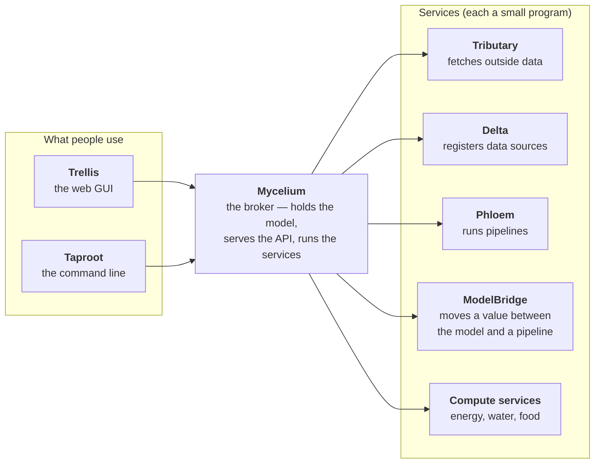
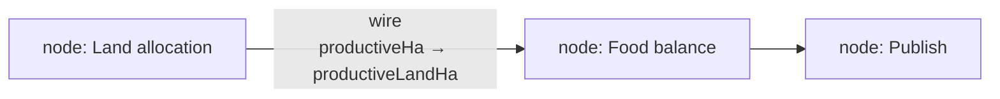
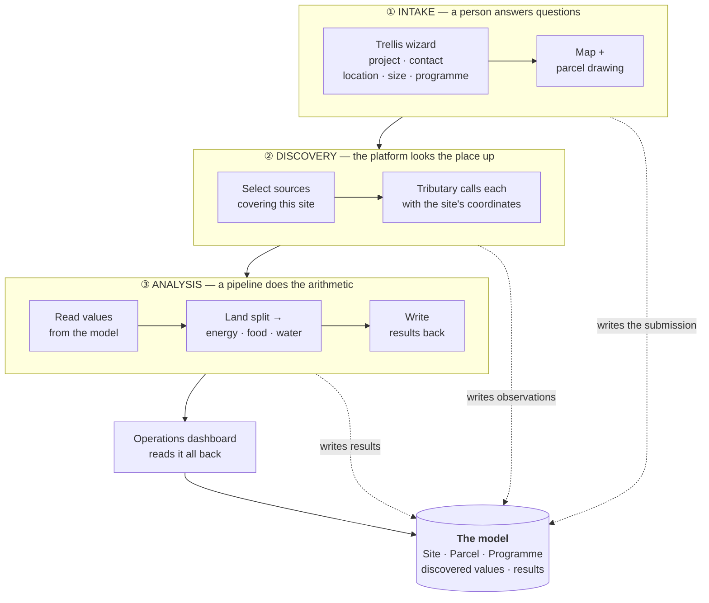
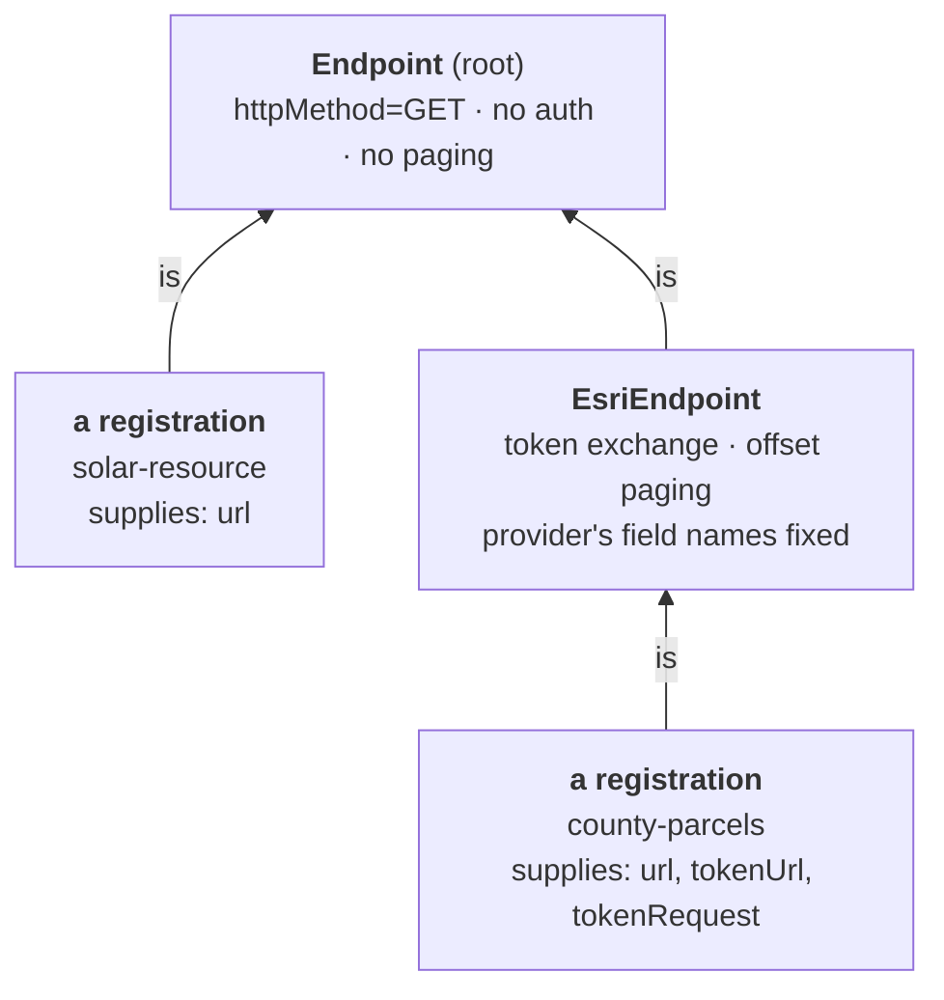
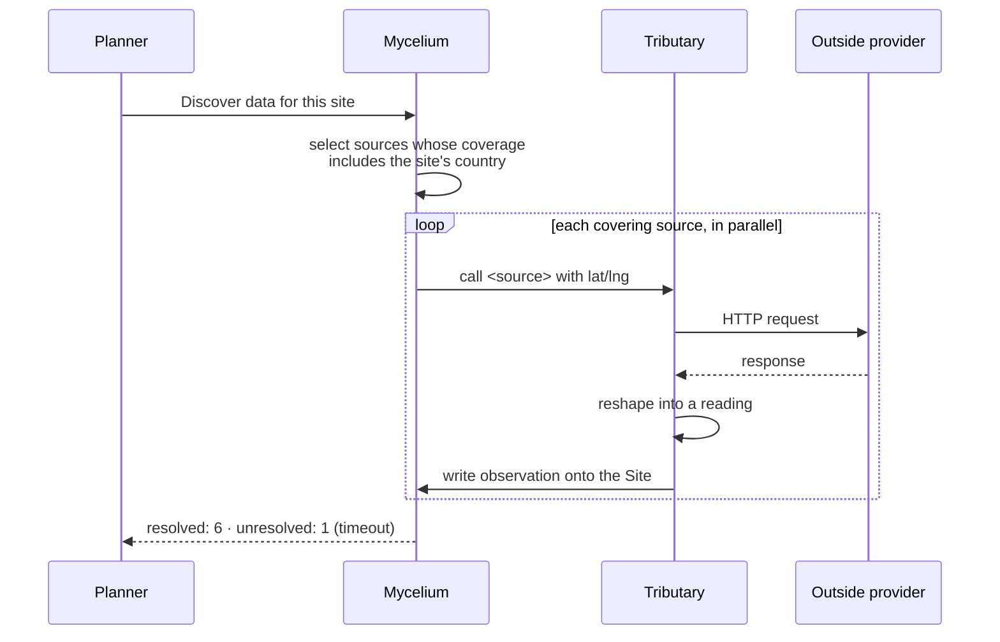
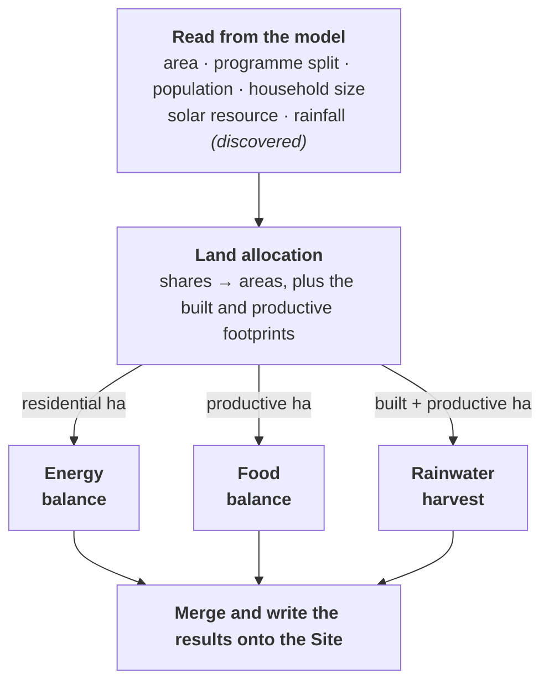
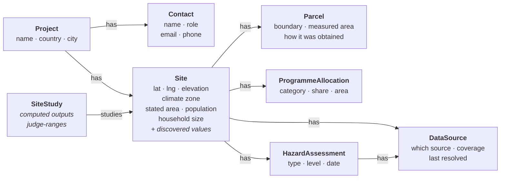
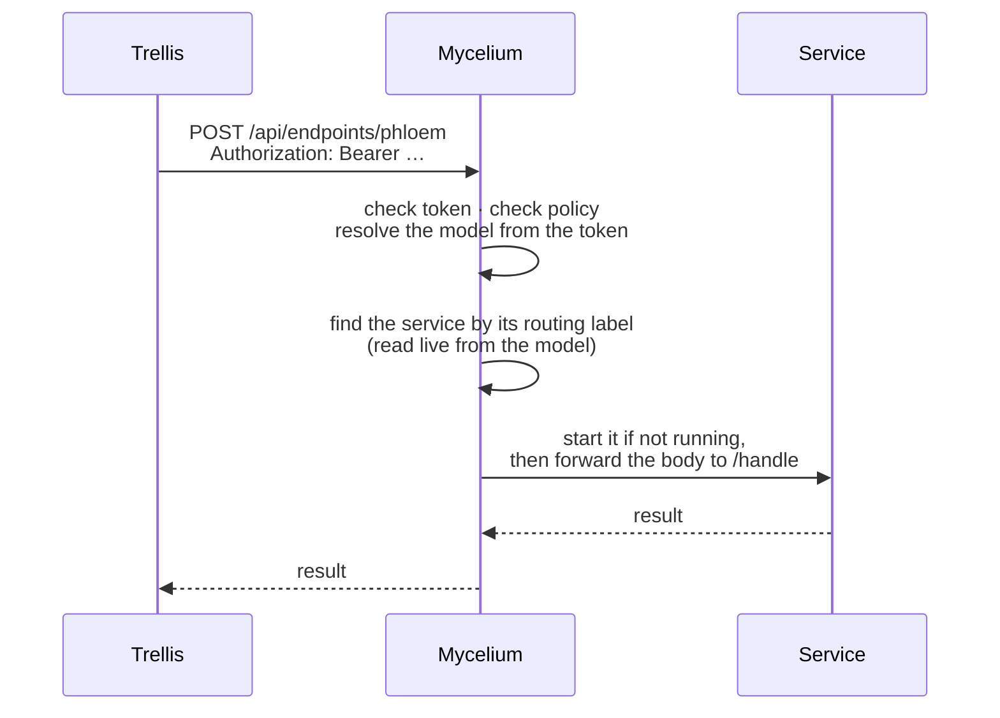
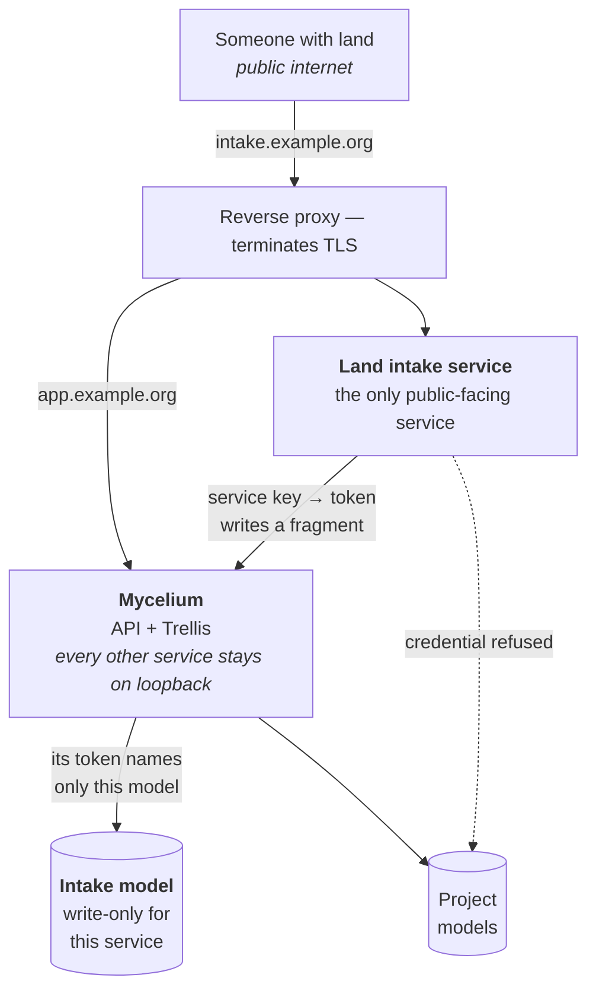
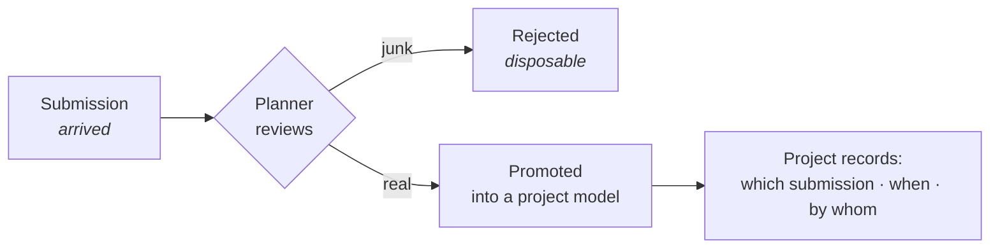

# Land Intake and Site Analysis — Design

> **Status: partly built.** The archetypes exist and a model can be seeded with them, and the intake
> service composes a submission into them. The wizard, the map, anonymous submission and open-data
> discovery are still design. Tracked as Epic
> [#6012](https://dev.azure.com/ReGenVillages/VillageOS-API/_workitems/edit/6012) (client, services)
> and Epic [#6033](https://dev.azure.com/ReGenVillages/VillageOS/_workitems/edit/6033) (model, broker).
> Where this document says "will", that part is not built yet. Where it says "already", the capability
> exists today and is referenced from the doc that describes it.

## Contents

- [1. The problem](#1-the-problem)
- [2. Vocabulary](#2-vocabulary)
- [3. The design in one picture](#3-the-design-in-one-picture)
- [4. Phase one — intake](#4-phase-one--intake)
- [5. Phase two — discovery](#5-phase-two--discovery)
- [6. Phase three — analysis](#6-phase-three--analysis)
- [7. The model](#7-the-model)
- [8. The calculations, worked through](#8-the-calculations-worked-through)
- [9. Public submissions and the trust boundary](#9-public-submissions-and-the-trust-boundary)
- [10. What exists, what is new](#10-what-exists-what-is-new)
- [11. Gaps found while designing this](#11-gaps-found-while-designing-this)
- [12. Handling personal data](#12-handling-personal-data)
- [13. Decisions still open](#13-decisions-still-open)

---

## 1. The problem

Someone owns a piece of land and wonders whether a regenerative village could work on it. Answering
that means knowing four things: **where the land is**, **how big it is**, **what the site's climate
and hazards are**, and **whether the land can plausibly feed, water and power the people you would
put on it**.

Today that question is answered by a questionnaire and a calculator that produce a JSON file
somebody files by hand. The flow is good — the sequence of questions is the right sequence — but
the output has three problems:

| Problem | What it means in practice |
|---|---|
| **Nothing persists** | The answers live in the browser's memory. A page refresh loses them. |
| **Nothing is fetched** | The "open data sources" step is a list of links. A person opens each one, reads a number off a map, and types it back in. |
| **No number has a source** | The solar figure is a formula applied to latitude. A hazard level is whatever someone typed. Once it is in the file, an estimate and a measurement look identical. |

The design below keeps the sequence and fixes all three, by expressing intake in the platform
VillageOS already has rather than as a standalone tool.

**The one-line version:** a planner draws a parcel, the platform fetches what is publicly known
about that location, a pipeline computes the balances, and everything — the answers, the fetched
values, the results, and where each came from — lives in the model.

---

## 2. Vocabulary

VillageOS has its own words for things. This section is the glossary; skip it if you already know
them.

### The model

**Thing** — any object in the model. A site is a Thing. So is a building, a pump, a data source, and
a pipeline. Everything is a Thing.

**Property** — a named value on a Thing. `areaHectares`, `population`, `rainfallMillimetresPerYear`.

**Relationship** — a named, directed link between two Things: `WillowBend has Parcel-01`. The name in
the middle is the **predicate**.

**`is` and archetypes** — `is` is a special predicate meaning "is a kind of". `WillowBend is Site`
makes `Site` an **archetype** — a template Thing whose properties are inherited by everything that
`is` it. Change the archetype, and every instance sees the change.

**Effective properties** — a Thing's own values, plus everything it inherits through its `is` chain,
merged with its own values winning. When code asks "what is this site's rainfall", it asks for the
effective property and does not care whether the value is set directly or inherited.

**Fact vs observation** — the two ways to write a value, chosen by intent:

| | Fact | Observation |
|---|---|---|
| **For** | Structural truth — a stated area, a confirmed boundary, a configuration | A sampled reading — a fetched rainfall figure, a sensor value |
| **Guarantee** | Synchronous, never lossy, survives replay | Queued and batched; retention is bounded |
| **Example here** | "The planner stated 24 hectares" | "The weather service reported 700 mm/yr on this date" |

A property declares which kinds it accepts. Writing the wrong kind is refused. This matters for
intake: a planner's assertion and a fetched measurement are genuinely different sorts of claim, and
the model records which is which.

**Model** — one whole graph of Things. A deployment holds several: one per project, plus special
ones. Every request carries a token naming the model it applies to, so two projects cannot see each
other.

**Fragment** — a partial model posted in one call: some Things, some relationships, some values. It
**upserts** — creating what is missing and updating what exists — so posting the same fragment twice
produces one result, not two. This is how a submission enters the model.

### The parts



**Mycelium** — the broker. It holds the models, serves the API, authenticates every caller, and
starts and supervises the services. Everything goes through it.

**Trellis** — the web GUI. Has a graph view, a 3D building viewer, a dashboard, and a visual pipeline
editor.

**Taproot** — the command-line client.

**Microservice** — a small program that does one job. Mycelium launches it, hands it a token, and
calls it over plain HTTP. It can be written in any language.

**Endpoint service** — a microservice that exposes its own API through Mycelium. Callers post to
`/api/endpoints/<name>` and Mycelium forwards the body to the service. The `<name>` is a routing
label stored in the model, not a DNS subdomain.

**Tributary** — the service that calls outside data providers. It is deliberately generic: a provider
is described entirely by configuration, never by code written for that provider.

**Delta** — the service that validates and registers those provider descriptions.

**Phloem** — the orchestrator that runs pipelines.

**ModelBridge** — a tiny service that reads one property out of the model into a pipeline, or writes
one pipeline value back onto a Thing.

### Pipelines

A **pipeline** (or **DAG**, for directed acyclic graph — a flow chart with no loops) is a calculation
expressed as boxes and arrows.



- **Node** — one box. Each node is a microservice call.
- **Port** — a named, typed input or output socket on a node. `population` in, `daysOfSupply` out.
- **Wire** — an arrow from one node's output port to another's input port. The editor refuses to
  connect ports whose types do not match.
- **Run parameter** — a value supplied when the pipeline is started, rather than coming down a wire.
  Used for assumptions a planner might want to vary.
- **Run** — one execution. Every node's status and outputs are recorded, so you can replay it.

A pipeline is itself stored as Things and relationships, which is why it can be edited visually,
saved, and versioned like any other data.

---

## 3. The design in one picture

Three phases, in order. Each is independent of the others and can be re-run on its own.



**Why three phases and not one.** Discovery talks to the outside world; analysis does not. Keeping
them apart means a planner can adjust an assumption and re-run the analysis instantly, without
re-calling a public data provider. It also means one unreachable provider degrades the picture
instead of failing the whole thing.

---

## 4. Phase one — intake

### What is collected

| Step | Questions |
|---|---|
| **Project** | Project name, country, nearest city, notes on any existing surveys or data |
| **Contact** | Name, relationship to the project, email, phone |
| **Location** | Coordinates — typed, or extracted from a pasted map link. Optional elevation and boundary file |
| **Size and programme** | Land area (hectares or acres), population, household size, and which programme categories the village needs with roughly how the land divides between them |
| **Parcel** | The actual boundary, drawn on a map |

The programme categories are residential; food and agriculture; green, water and restoration;
commercial and retail; community, education and health; and mobility and infrastructure. Each is
toggled on or off and given a share.

### The map and the parcel

This is the only genuinely new user-interface capability. Trellis has three canvases already — a
graph view, a 3D building viewer, and the pipeline editor — and none of them can show a map or accept
a geographic coordinate.

Two ways to get a boundary:

1. **Place a draft.** Given a stated area and a location, drop a square of exactly that area centred
   on the point. The planner then drags its corners to the real boundary.
2. **Draw it.** Click points around the perimeter, then adjust.

Either way, the drawn area is measured and compared against the stated area:

```text
  Stated:  24.00 ha        Drawn:  23.4 ha        ✓ within tolerance
  Stated:  24.00 ha        Drawn:  9.7 ha         ✗ 60% smaller
```

That comparison is quietly one of the most valuable things in the whole flow. Someone types "60
acres" off a deed, draws what they believe the boundary is, and the two disagree by half. Catching
that here stops a wrong area propagating into every calculation downstream — because **every**
downstream number is proportional to it.

> **Accuracy note.** The drawn area is computed on the sphere, not by treating latitude and longitude
> as flat coordinates. A flat calculation looks fine near the equator and is meaningfully wrong at
> higher latitudes.

### What gets written

The wizard posts the **submission** — what it has collected so far — to the intake service
(`vos.Service.Intake`). The service composes one **fragment** from it (Things, relationships and values
in a single call) and applies it. Because a fragment upserts, progress can be saved as the planner
goes: the same submission posted again updates rather than duplicating. Closing the tab does not lose
the work.

```jsonc
{
  "submissionId": "willow-bend-2026-08",     // every identifier derives from this
  "project": {                                // the undertaking; it holds the site
    "name": "Willow Bend Regeneration",
    "country": "Portugal",
    "nearestCity": "Santarém",
    "existingDataNotes": "Rainfall held from a 2024 survey; no solar measurements."
  },
  "contact": {                                // hangs off the project, so it can change on its own
    "name": "Ana Ferreira",
    "relationshipToProject": "landowner",
    "emailAddress": "ana.ferreira@example.pt",
    "phoneNumber": "+351 200 000 000"
  },
  "site": {
    "name": "Willow Bend",
    "latitude": 39.5012,
    "longitude": -8.4137,
    "statedAreaHectares": 24.0,              // what the planner asserted
    "population": 320,
    "householdSize": 2.4
  },
  "parcel": {                                 // left out until a boundary has been drawn
    "boundarySource": "drawn-by-hand",        // or imported-from-file, or generated-from-stated-area
    "boundary": [
      { "latitude": 39.4990248, "longitude": -8.4165190 }
      // …at least three corners
    ]
  },
  "allocations": [                            // shares are taken as given and normalised later
    { "category": "Residential", "sharePct": 22, "allocatedAreaHectares": 5.28 },
    { "category": "Food and agriculture", "sharePct": 34, "allocatedAreaHectares": 8.16 }
    // …one entry per category, each naming a category only once
  ],
  "hazards": [                                // no level here: that is read from the source
    {
      "hazardType": "riverFlood",
      "source": {                             // becomes a Thing the assessment hangs off
        "name": "National flood portal",
        "coverageDescription": "Mainland river catchments, updated yearly."
      }
    },
    { "hazardType": "wildfire", "source": { "name": "National flood portal" } }
    // …two hazards naming one source share that source
  ]
}
```

Each of these rules exists to stop a particular kind of quiet damage:

| Rule | Why |
|---|---|
| **One place composes the fragment** | The signed-in wizard and a public submission post the same document to the same service, so there is one mapping from a submission to the model rather than one per caller. |
| **Identifiers derive from the submission** | A wizard saves as it goes and a planner can double-click. A freshly generated identifier would build a second site beside the first; a derived one lands on the same Things every time, which is also what lets promotion be idempotent later. |
| **A field not filled in yet is left out, not zeroed** | An absent value reads as absent. A zero standing in for one cannot be told from a real answer — the same reason a computed output is declared and left empty. |
| **A field the service does not write is refused** | A submission accepted and quietly dropped leaves the planner believing it was recorded. The refusal names the field. |

The **measured area is computed by the service** from the boundary, not submitted alongside it, so the
figure the planner saw and the figure the model holds cannot drift apart. Coordinates arrive as named
`latitude` / `longitude` pairs, because a coordinate pair read in the wrong order is a mistake nothing
downstream can catch; the boundary is stored as a GeoJSON polygon, which is longitude-first.

The body is **capped at a few hundred kilobytes** — far above a form's worth of answers and a drawn
boundary, and low enough that a body cannot cost the service its memory before anything has looked at
it. That cap is a floor under the rate limiting and bot checks a public endpoint needs, not a
substitute for them ([§9](#9-public-submissions-and-the-trust-boundary)).

---

## 5. Phase two — discovery

### The idea

Instead of a list of links a person clicks, each data provider is **registered** as a Thing in the
model describing how to call it. Tributary reads that description and makes the call.

There is no code anywhere that knows about any particular provider. A provider is configuration.

### How a registration works

Registrations inherit from a small hierarchy of templates, so shared behaviour is declared once:



A registration's allowed settings are the union of everything declared along its chain, and a value
resolves to the nearest ancestor that sets it. **Delta** validates all of that at registration time
and refuses anything that does not fit, so a broken configuration fails immediately rather than at
3am during a run.

**A registration lives in the project's own model, not in a catalogue shared between projects.** A
model is the boundary of every read, so an endpoint and the Site its readings name have to be in the
same one. [`DELTA.md`](DELTA.md#which-model-a-registration-lives-in) records the decision and what
forces it.

### A registration, in full

```jsonc
{
  "name": "solar-resource",
  "properties": {
    "url": "https://api.open-meteo.com/v1/forecast?latitude={lat}&longitude={lng}&hourly=shortwave_radiation",
    "httpMethod": "GET",
    "coverage": "global",
    "responseTransform": "{ \"name\": $siteName, \"properties\": { \"solarResourceKwhPerM2PerYear\": $round($sum(hourly.shortwave_radiation) / 1000) }, \"observedAt\": hourly.time[0] }"
  },
  "relationships": [ { "subject": "solar-resource", "predicate": "is", "target": "Endpoint" } ]
}
```

Three parts do the work:

- **`url`** with `{lat}` / `{lng}` placeholders, filled in per call. One registration serves every
  site. *(This substitution does not exist yet — see [§11](#11-gaps-found-while-designing-this).)*
- **`coverage`** — where this source applies. `global`, or a set of countries.
- **`responseTransform`** — a **JSONata** expression, which is a small language for reshaping JSON.
  It turns whatever the provider returns into a **reading**.

### What a reading is

A reading is the standard shape Tributary ingests. Three fields:

```jsonc
{
  "name": "Willow Bend",                                  // which Thing this is about
  "properties": { "solarResourceKwhPerM2PerYear": 1750 }, // what was measured
  "observedAt": "2026-07-26T00:00:00Z"                    // when
}
```

Tributary finds the Thing named `Willow Bend` and writes the value onto it as an **observation** at
that time. The site now carries a solar figure that came from somewhere, with a date attached.

> This pattern already works and is proven — the precipitation and solar-resource slices in
> [TRIBUTARY.md](TRIBUTARY.md#example-precipitation-onto-a-site-5805) do exactly this today.

### The discovery run



**Partial failure is normal and must be tolerated.** Public data portals go down. One source failing
leaves its value undiscovered; it does not stop the others and it does not abort the run. The run
reports exactly what did and did not resolve, with a reason — a quietly short list is the failure
mode of the tool being replaced, where an unrecognised country spelling silently hid sources that
did in fact cover the site.

### What to fetch first

| Value | Replaces |
|---|---|
| Solar resource | A curve applied to latitude, feeding straight into the energy balance |
| Rainfall | A number the planner is asked to type, feeding the water balance |
| Hazard levels | Hand transcription of eight levels from a separate portal |
| Elevation and terrain | A manually entered value |

Not every provider can be registered. Some are map portals with no data interface; some are
commercial products behind a licence. Those stay as links — but recorded **as Things in the model**,
flagged as needing a manual read, so the gap is visible rather than implied by absence.

---

## 6. Phase three — analysis

The pipeline reads what is in the model, computes, and writes results back. It makes no outside
calls.



The three balances have no dependency on each other, so Phloem runs them at the same time.

**Assumptions are run parameters, not wired values.** Yield per hectare, runoff coefficient, energy
per person, water per person — these are judgement calls a planner will want to vary. Making them run
parameters means trying a different figure is a re-run, not an edit to the graph. Everything derived
from the submission or from discovery arrives over a wire, so it stays traceable.

**A missing discovered value is reported, not defaulted.** If rainfall did not resolve, the water
balance says so. A balance computed against a silently substituted number is worse than no answer,
because it looks like an answer.

### What a node call looks like

Every node speaks the same envelope. Inputs by port name in, outputs by port name back:

```jsonc
// Phloem → the node                        // the node → Phloem
{                                            {
  "runId":  "…",                               "success": true,
  "nodeId": "…",                               "outputs": {
  "inputs": {                                    "peopleFed": 73,
    "productiveLandHa": 8.16,                    "selfSufficiencyPct": 22.9
    "yieldPeoplePerHa": 9,                     },
    "population": 320                          "error": null
  }                                          }
}
```

That is the whole contract. Any language can implement it.

---

## 7. The model

### The archetypes



The design decisions worth stating:

**The parcel is its own Thing, not a property on the site.** A site can be re-surveyed. Keeping the
boundary separate means a new survey is a new Thing with its own history, and the geometry can carry
its own provenance — drawn by hand, imported from a file, or auto-generated from a stated area. That
last one matters: a square generated from a number is not evidence of anything and should not look
identical to a surveyed boundary.

**Everything hangs off its holder by the generic `has` predicate.** Nothing binds a service to these
edges, so a predicate per pair — `hasParcel`, `hasHazard` — would be vocabulary the platform carries for
no behaviour. A reader tells a parcel from a hazard by what the target `is`. The one named predicate is
`studies`, which the site survey already uses to relate a study to the site it is about.

**Hazards are Things, not a bag of properties.** There is a fixed vocabulary of hazard types and a
fixed scale of levels, and modelling each assessment as a Thing lets it carry its date and reach the
source that produced it. The current tool stores them as a flat map with no indication where any
level came from.

**An assessment reaches its source, rather than naming it.** The source is the `DataSource` Thing the
assessment hangs off, not a name copied onto it. Two hazards read off one portal share one source, so
resolving that source updates both, and a reader can walk from a hazard to what produced it. A copied
name could be walked to by nothing and could disagree with the source's own with nothing to notice —
which is the difference between an assessment and a recollection.

### A site, filled in

Using a synthetic example throughout — **Willow Bend**, a fictional 24-hectare site in Portugal for
320 residents.

| Thing | Property | Value | Written as |
|---|---|---|---|
| Willow Bend *(Site)* | `latitude` | 39.5012 | Fact |
| | `longitude` | −8.4137 | Fact |
| | `statedAreaHectares` | 24.0 | Fact |
| | `population` | 320 | Fact |
| | `householdSize` | 2.4 | Fact |
| | `solarResourceKwhPerM2PerYear` | 1750 | **Observation** — discovered |
| | `rainfallMillimetresPerYear` | 700 | **Observation** — discovered |
| Willow Bend Site Study *(SiteStudy)* | `pctOfConsumption` | 90.8 | Fact — computed |
| Parcel-01 *(Parcel)* | `boundary` | GeoJSON polygon | Fact |
| | `measuredAreaHectares` | 23.4 | Fact |
| | `boundarySource` | `drawn-by-hand` | Fact |

The stated area is what the planner asserted. The measured area is what the boundary actually
encloses. The solar figure is an observation because it was sampled from a provider on a date and
will be refreshed. That distinction is the whole point of moving this into the model.

**Computed values belong to the study, not the site.** A `SiteStudy` relates to its `Site` by `studies`,
and it is the study that carries params, computed outputs and judge-ranges — whether the facts came from
a submission or from an imported building model (#6154). The site carries what is true of the land; the
study carries what an analysis made of it. A submission therefore mints both, in the same relationship
shape the IFC ingest already produces, so no reader has to ask where a site's facts came from.

Each computed output is **declared on the study with its type and no value** until something writes it
(#6159). A seeded zero cannot be told from a real result, and a range reading it would report a verdict
about an analysis that never ran.

> **Settled: `pctOfConsumption`.** The reactive energy service writes it, the shared `SiteStudy`
> archetype declares it, and that archetype's `EnergyNetPositive` range reads it. A submission's study
> declares no computed output of its own — it `is` the archetype and inherits every one, so there is one
> place the name is answered rather than two that can disagree.

---

## 8. The calculations, worked through

All figures below are for Willow Bend. Every number is derived from the ones above it.

### Land allocation

Shares are normalised across the selected categories, so they always describe the whole parcel even
if the planner's numbers do not add to 100.

| Category | Share | Area |
|---|---|---|
| Residential | 22% | 5.28 ha |
| Food and agriculture | 34% | 8.16 ha |
| Green, water and restoration | 20% | 4.80 ha |
| Commercial and retail | 8% | 1.92 ha |
| Community, education and health | 9% | 2.16 ha |
| Mobility and infrastructure | 7% | 1.68 ha |
| **Total** | **100%** | **24.00 ha** |

Two derived footprints come out of this node, because both balances need them and they must be
defined in exactly one place:

- **Built footprint** = residential + commercial + mobility = **8.88 ha** — the hard surface that
  sheds rainwater.
- **Productive footprint** = food and agriculture = **8.16 ha** — the land that grows food.

Which categories roll into which footprint is **configuration on the node**, not a hardcoded list of
category names. A different project with a different programme vocabulary must not need a code
change.

### Energy

```text
  PV array         = residential 5.28 ha × 6% array coverage      = 3,168 m²
  Generation       = 3,168 m² × 1,750 kWh/m²/yr × 0.131           = 726 MWh/yr
  Demand           = 320 residents × 2,500 kWh/yr                 = 800 MWh/yr
  Self-sufficiency = 726 ÷ 800                                    = 91%
```

The `0.131` deserves explanation, because it is where two different ways of modelling solar meet.

| Model | Formula | Figure |
|---|---|---|
| Panel-first | installed capacity × irradiation × performance ratio | 0.17 kWp/m² × 0.77 = **0.131** |
| Area-first | area × irradiation × efficiency | efficiency = **0.131** |

The existing energy node takes an efficiency, so it uses the area-first form. Feeding it a module
efficiency of 0.20 would overstate output by about half, because module efficiency ignores inverter
losses, wiring, soiling, heat and downtime. The value the node wants is the **system yield factor** —
module efficiency multiplied by performance ratio. The port name should say so; see
[§13](#13-decisions-still-open).

### Food

```text
  People fed       = 8.16 ha × 9 people/ha                        = 73 people
  Self-sufficiency = 73 ÷ 320                                     = 23%
```

Two lines of arithmetic, and still worth being a node — because as a node the yield assumption is
visible on the canvas, the area is traceable back down the wire to the parcel, and a re-run with a
different assumption is recorded in the run history. A number in a spreadsheet has none of that.

> Yield-per-hectare is a coarse abstraction that hides crop mix, climate and diet. That is fine for
> an intake-stage estimate and should be labelled as such wherever it is displayed.

### Water

Two different questions, and the platform currently answers only the second.

**Catchment — how much rain can we capture?** *(new node)*

```text
  Harvest          = 8.88 ha built × 0.7 m rain × 0.8 runoff      = 49,728 m³/yr

  Domestic demand  = 320 × 120 L/day × 365                        = 14,016 m³/yr
  Irrigation       = 8.16 ha × 5,000 m³/ha/yr                     = 40,800 m³/yr
  Total demand                                                    = 54,816 m³/yr

  Self-sufficiency = 49,728 ÷ 54,816                              = 91%
```

That single 91% hides the most useful fact on the page. Split it:

```text
  Against domestic demand alone   49,728 ÷ 14,016  =  355%   ← comfortable
  Against irrigation alone        49,728 ÷ 40,800  =  122%   ← the constraint
```

Willow Bend has abundant drinking water and a marginal irrigation position. A site with the same
overall 91% could be the exact opposite. **This is why the node reports its demand components
separately** — the combined percentage is not actionable.

**Storage — how long does the tank last?** *(existing node)*

```text
  Annual consumption = 320 × 43.8 m³/person/yr                    = 14,016 m³/yr
  Days of supply     = 3,000 m³ storage ÷ (14,016 ÷ 365)          = 78 days
```

Different inputs, different outputs, different question. Hence a sibling node rather than more ports
on the existing one.

### Hazards

River flood, landslide, wildfire, earthquake, cyclone, extreme heat, water scarcity and urban flood,
each graded on a scale from "no data" to "high". Today these are typed in by hand from a separate
portal. After discovery they arrive as readings with a source and a date, which is
the difference between an assessment and a recollection.

---

## 9. Public submissions and the trust boundary

A planner using Trellis is signed in. A stranger submitting their land is not. Those are different
situations and the design treats them differently.

### How authentication works today

Every request to the API carries a token, and the token names the model it applies to. There are no
exceptions except signing in itself. That single rule is what keeps two projects from seeing each
other's data.

Callers hold a role — admin, editor, viewer, or service — and endpoints require a named policy such
as "may read the model" or "may modify data".

### The existing route for service endpoints



This gives a lot for free: one authentication system, model scoping, services started on demand,
per-route traffic statistics, and — importantly — the services themselves never listen on a public
address. They are reachable only from the machine Mycelium runs on.

**Authenticated planner work needs nothing new.** Trellis posts to this route and the pipeline runs.

**A signed-in submission goes through the intake service too.** Not because it has to — a signed-in
wizard could compose the fragment itself — but because then there would be two mappings from a
submission to the model, and the second one to change would be the one that was wrong. What differs
between a planner and a stranger is what the service demands before it accepts the call, not what it
writes.

**A refusal says only what the caller can act on.** A submission naming a field wrongly is answered
`400` with the field named, because whoever filled the form in can correct it. Anything wrong with the
deployment — a model that was never seeded with the archetypes, for one — is answered `503` with
nothing in the body, and what is actually wrong goes to the log. A stranger is not told the state of
the model they are submitting into.

### Why public intake gets its own service

The obvious shortcut is to allow anonymous calls on that route for one label. It should not be taken.

The route resolves its routing **from data in the model**. Whatever labels the model happens to
contain are what the route can reach. Allowing anonymous access there means one mistyped or copied
property in a seed file publishes an internal service to the internet. Security that depends on
nobody mistyping a property is not security.

So public submission gets a separate, small program with one job:



| Property | How it is achieved |
|---|---|
| Anonymous in | The service decides; no platform rule is widened |
| Rate limited, size capped, bot checked | Owned by the service, where the public traffic is |
| Cannot read project data | Its credential names only the intake model |
| Writes go through normal auth | It mints a Mycelium token and posts a fragment, like any service |
| Blast radius of a mistake | One service, not every endpoint in the model |

**On "subdomain".** The routing label on an endpoint connection is called a subdomain, but it is a
path segment, not DNS — nothing in the broker reads the request's host name. If you want
`intake.example.org`, that split belongs in the reverse proxy. Do not teach the broker host-header
routing; it currently knows nothing about deployment topology, and that is a feature.

### From submission to project

Submissions land in a staging model. Becoming a project is a deliberate act.



Anything anonymous attracts junk, and junk already sitting in a working model is expensive to remove.
Promotion must be idempotent — a planner double-clicking must not create two projects — which means
deriving the new identifiers from the submission rather than generating fresh ones.

---

## 10. What exists, what is new

The main finding from designing this: most of it is already built.

| Capability | Status |
|---|---|
| Energy balance calculation | **Exists** as a pipeline node |
| Water storage calculation | **Exists** as a pipeline node |
| Running a graph of calculations, with live progress and cancel | **Exists** (Phloem) |
| Reading and writing model values from a pipeline | **Exists** (ModelBridge) |
| Fetching outside data as configuration, reshaping it, ingesting onto a Thing | **Exists** (Tributary) |
| Validating and registering data sources | **Exists** (Delta) |
| Rendering a report from a spec stored in the model | **Exists** (operations dashboard) |
| Posting a whole submission in one idempotent call | **Exists** (fragments) |
| Authentication, model isolation, service supervision | **Exists** (Mycelium) |
| Composing a submission into the model's own shape | **Exists** (`vos.Service.Intake`) |
| — | |
| A map, and drawing a parcel on it | **New** — the only new UI capability |
| The intake wizard | **New** |
| Rainwater harvest, food balance, land allocation nodes | **New** — three small services |
| Anonymous submission: rate limits, size caps, bot checks, the staging model | **New** — hardening around the service that already composes |
| Land-intake archetypes, registrations, pipeline, dashboard spec | **New** — but data, not code |

---

## 11. Gaps found while designing this

Checking the code rather than the documentation changed the design in the places below. Each is
tracked under Feature
[#6050](https://dev.azure.com/ReGenVillages/VillageOS-API/_workitems/edit/6050).

### The fetcher is not a pipeline node, and should not be

It was briefly, and that was deliberately reversed. Tributary is a **spawner**: it populates the
model, and pipelines read what it wrote.

The first draft of this design had the pipeline fanning out over fetch nodes. That was wrong, and the
correction is an improvement: the pipeline becomes a pure calculation graph with no network
dependency, so re-running it is instant and free.

### The address cannot be parameterised per call

The outbound call resolves its address entirely from the registration. The only per-call inputs are a
request body — which is only attached for methods that carry one, so not for a plain lookup — and a
transform override.

So "fetch the solar figure at *these* coordinates" cannot currently be expressed. Without generic
placeholder substitution into the address template, you would need one registration per site, and the
catalogue would grow with every submission.

The mechanism is already specified for tile pyramids as Feature
[#5917](https://dev.azure.com/ReGenVillages/VillageOS-API/_workitems/edit/5917). This design depends
on it.

### A registration's reshape expression now ingests

It did not. The ingest branch was chosen on whether the **request** supplied a reshape expression, so
an expression configured on the registration — the documented, steady-state configuration — returned
a transformed body and wrote nothing. Supplying it on the request did ingest, but that path also
persisted the caller's expression onto the registration, so a read mutated its own configuration and
two consumers of one source overwrote each other.

Bug [#6051](https://dev.azure.com/ReGenVillages/VillageOS-API/_workitems/edit/6051) closed both
halves. The expression **in effect** decides — on the registration or inherited from its template —
and a request-supplied one reshapes that call alone. The design above depends on this: a source
registered once, with its reshape on the registration, writes onto the site every time it is called.

### Only one project could register an endpoint at all — fixed

Delta writes a registration into the model of whoever called it, which is the shape this design
wants. Its **template catalogue** did not follow: it was provisioned once at startup, under the token
Delta was launched with, so it landed in a single model. One Delta process serves every project,
because a second project's call finds the daemon already healthy on the port both models declare — so
a registration from any other model passed every validation step and then failed on its template
being absent, with a 500.

Delta now provisions a model's catalogue on that model's first registration, under the bearer that
named it, and remembers which models it has done. Fixed under Bug
[#6525](https://dev.azure.com/ReGenVillages/VillageOS-API/_workitems/edit/6525).

---

## 12. Handling personal data

Intake collects names, email addresses and phone numbers by design. That makes it the one flow in the
platform where personal data moves through application code, so it carries a standing rule.

**Contact details live in the model, under a retention rule. Nowhere else.**

| Place | Rule |
|---|---|
| Source code | No contact details in constants, examples, presets or defaults |
| Seed and example data | Invented people, invented addresses, invented numbers |
| Test fixtures | Synthetic. Never a copied real submission |
| Logs | A submission may be logged **by reference**, never by content. Rejected payloads are not logged verbatim |
| Error responses | Name the field, not the value. Nothing echoes a submitted detail back |
| Documentation and screenshots | Synthetic submissions only — as in this document |

The model is the intended home and is handled by design. The risk is everywhere else — the places
nobody classifies as a data store. An example preset built from a real enquiry because it makes the
demo convincing. A fixture copied from a genuine submission because it was to hand. A log line that
dumps the request body during debugging and stays. A validation error that helpfully quotes the
invalid address back.

Each is reasonable in the moment, and collectively it is how personal data ends up in a repository or
a log aggregator. **One synthetic contact set, defined once and reused,** removes the temptation at
source. Log rules are enforced by test, not convention — a rule survives about as long as the next
debugging session otherwise.

---

## 13. Decisions still open

| # | Question | Recommendation |
|---|---|---|
| 1 | **What is the energy node's efficiency port?** Module efficiency and system yield factor differ by about half. | Rename it to say system yield factor, or add a separate performance-ratio input. Either way the port name must state which it is. |
| 2 | **Map library** — Leaflet or MapLibre? | Leaflet is smaller and is what the current tool uses; MapLibre gives vector tiles and better styling. Story-level decision. |
| 3 | **Area match tolerance** — how far apart may stated and drawn be? | Start at 8%, loose enough for hand-drawing and tight enough to catch a wrong unit. Make it a named constant, not a literal. |
| 4 | **Retention** for submissions that are never promoted. | Decide before there is anything in the intake model, not after. |
| 5 | **Boundary file upload** — does the intake service accept one at launch? | Inline geometry first; file upload is the reason the service exists as its own front door, so it is a natural follow-up. |
| 6 | **What triggers discovery** — planner action, arrival of a submission, or a schedule? | All three eventually. Build one path and let each be a caller of it, rather than a branch inside it. |

---

## Related documents

| Doc | Why it matters here |
|---|---|
| [TRIBUTARY.md](TRIBUTARY.md) | The fetcher — templates, auth modes, paging, and the proven site-ingest examples |
| [DELTA.md](DELTA.md) | How registrations are validated and provisioned |
| [SERVICES.md](SERVICES.md) | Section 14 for endpoint services, section 16 for pipelines and the node envelope |
| [MODELBRIDGE.md](MODELBRIDGE.md) | Moving a value between the model and a pipeline |
| [SERVICE_CONTRACT.md](SERVICE_CONTRACT.md) | The wire contract, and the fact / observation / fragment write kinds |
| [TRELLIS.md](TRELLIS.md) | The GUI — pipeline editor in section 7.4, operations dashboard in section 16 |
| [PIPELINE_PLAYGROUND.md](PIPELINE_PLAYGROUND.md) | Worked example DAGs, including the existing combined site analysis |

---

## Diagrams

**Every diagram is written into this page as a `mermaid` block.** The source is the diagram, so
there is nothing to re-render and nothing that can fall behind. A changed picture reads as changed
text in a pull request, so a reviewer can see what moved.

They draw wherever this page is read: Azure DevOps, the wiki generated from it, GitHub, and the PDF.

Written here, a diagram can also be checked. `ArchetypeDiagramTests` reads the archetype diagram in
§7 out of this file and fails when an edge names a predicate the submission service does not write,
so that picture cannot quietly stop describing the model.

### Reading this as a document

`LAND_INTAKE.pdf` is the version to open, print or share. It is not kept in the repository — build it
with [`tools/docs-pdf`](../tools/docs-pdf/README.md) when you need one, and it lands beside this
file. Rebuild it after changing this document, or you are sharing the previous version.

Opening the Markdown directly in a word processor shows the diagrams as their source text. A
`mermaid` block is text until something draws it, and a word processor draws nothing; the PDF is the
path that does.
