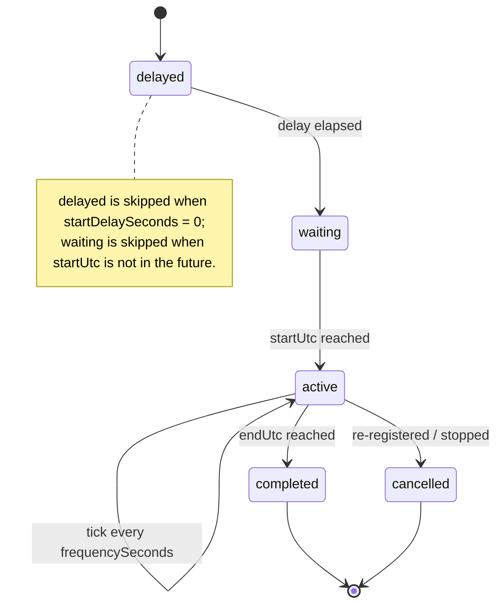

# Metabolism Microservice

## What It Does

The Metabolism service is a persistent daemon that simulates continuous resource flows in a VillageOS graph. It serves two predicates — `consumes` and `produces` — from a single binary, differentiated by a `--mode` CLI argument.

When a relationship like `Cottage-01 --[consumes]--> VillageElectricityPool` is created, Mycelium notifies the Metabolism service. The handler then runs a continuous loop: every N seconds, it decrements (or increments, for `produces`) a numeric property on the target thing. This turns VillageOS's static graph into a live simulation where resource quantities change over time.

**In concrete terms**: if a village has 5 homes that each `consumes` electricity from a shared pool, the Metabolism service runs 5 independent loops, each decrementing the pool's `quantity` property at its own rate. The pool's value drops in real-time, and any ranges defined on it (e.g., "Low Power Alert" when `quantity < 50`) evaluate automatically.

## Why This Architecture

### One binary, two predicates

`consumes` and `produces` are mirror images — one decrements, the other increments. Rather than maintain two nearly-identical projects, a single `Metabolism` binary accepts `--mode=consumes` or `--mode=produces`. The `ServiceArgs` property on the Service each predicate `has` tells Mycelium which mode to pass:

```json
{ "ServiceArgs": "--mode=consumes" }
```

> `ServiceArgs` is plain CLI text passed verbatim to the daemon at launch. (A handler that
> needs startup context subscribes for it over SSE — see `SERVICE_CONTRACT.md` — rather
> than receiving injected IDs; an earlier `{{...}}` template mechanism was retired.)

This means there are two running processes (on ports 7102 and 7103), but built from the same source.

### Daemon mode, not request-response

The handler doesn't do one thing and exit. It stays alive, running simulation loops for every relationship registered with it. This avoids process startup overhead (dotnet cold start is expensive) and lets it maintain in-memory state about all active simulations.

### SSE for live updates

When someone changes a relationship property in the GUI (say, increasing `frequencySeconds` from 30 to 60), the handler hears about it in real-time over a **Server-Sent Events** subscription (`SubscriptionClient`). It cancels the running simulation loop and restarts it with the new config. No Mycelium round-trip, no re-invocation needed. The handler holds one subscription and keeps its membership in step with its simulations — adding a relationship when it registers, removing it when it cancels — so it streams exactly the changes it cares about. The stream auto-reconnects and resumes via `Last-Event-ID`, so no change is missed across drops.

### Staggered ticks

When a seed loads with 20 `consumes` relationships, all 20 get registered within milliseconds. If they all fired their first tick simultaneously, Mycelium would get hammered with 20 concurrent API calls. The handler staggers initial ticks: each simulation waits `(registration_order * 200ms) + random_jitter` before its first tick. After that, each runs on its own independent timer.

## How It Works

### Startup sequence

```text
1. Parse the launch settings (--port, --myceliumUrl and --mode from the command line; Token and VerificationKey from configuration)
2. Use the pre-minted service JWT from the Token setting for Mycelium authentication
3. Start ASP.NET minimal API on the given port (with Mycelium token validation via vos.Auth.Shared)
4. Open an SSE subscription to Mycelium for relationship property-change events
5. Wait for /handle requests from Mycelium (validated via Mycelium-signed request tokens)
```

The handler does **not** register itself with Mycelium: Mycelium launched it, tracks its process under the connection that binds it, and reaches it by calling `/handle` and `/health`.

### The `/handle` request

When a relationship using the `consumes` or `produces` predicate is created (or re-loaded from a seed), Mycelium POSTs to `/handle`:

```json
{
  "relationshipId": "abc-123",
  "subjectId": "cottage-guid",
  "targetId": "electricity-pool-guid",
  "subjectName": "Cottage-01",
  "targetName": "VillageElectricityPool",
  "properties": {
    "quantity": 0.5,
    "unit": "kWh",
    "frequencySeconds": 30,
    "propertyPath": "quantity"
  }
}
```

The `properties` field contains the relationship's own properties, sent inline so the handler doesn't need to call back to Mycelium to read them.

### Simulation lifecycle

Each `/handle` request creates one simulation loop in the `Metabolism` engine:



**delayed**: If `startDelaySeconds > 0`, the loop sleeps for that duration first. Used to stagger different stages of a process (e.g., a greenhouse's water draw starts 10 seconds after its pump comes on).

**waiting**: If `startUtc` is in the future, the loop sleeps until that time.

**active**: The main loop. On each tick:

1. Call Mycelium's `POST /api/things/{targetId}/properties/{propertyPath}/decrements` (or `/increments`) with body `{ "amount": <quantity> }`
2. Increment `total_consumed` (or `total_produced`) on the relationship itself (best-effort)
3. Sleep for `frequencySeconds`

**completed**: The loop exits when `endUtc` is reached or the simulation is cancelled.

If a relationship is registered again (e.g., on seed reload), the previous simulation is cancelled and replaced.

### Live hot-reload

The handler receives `RelationshipPropertyChanged` events over its Mycelium SSE subscription. When a tracked property changes:

| Property | Effect |
|----------|--------|
| `quantity` | Changes the amount applied per tick |
| `frequencySeconds` | Changes the tick interval |
| `unit` | Updates the unit label |
| `propertyPath` | Changes which property on the target is modified |
| `startDelaySeconds` | Changes the initial delay (restarts the loop) |

The `Metabolism.UpdateProperty` method uses a lock to prevent race conditions when multiple properties change in rapid succession (e.g., a user updates both `quantity` and `frequencySeconds` in the GUI). Each change cancels the current loop and starts a fresh one with the updated config.

## Code Structure

```text
vos.Service.Metabolism/
├── Program.cs                          # Entry point, wiring
├── Configuration/
│   ├── MetabolismLaunchSettings.cs     # the shared launch settings plus --mode
│   └── ResourceDirection.cs            # what consuming and producing each mean
├── Models/
│   ├── HandleRequest.cs                # /handle request payload
│   └── SimulationConfig.cs             # Simulation loop parameters
├── Services/
│   ├── MyceliumClient.cs                 # HTTP write calls to Mycelium (quantity/increment)
│   ├── MetabolismSubscriptionService.cs  # SSE subscription: streams changes + manages membership
│   ├── Metabolism.cs                   # Simulation loop engine
│   └── HandleRequestProcessor.cs       # Request validation + config extraction
├── Helpers/
│   └── JsonValueUnwrapper.cs           # Reads a value out of the platform's typed envelope
└── Endpoints/
    └── EndpointMapper.cs               # HTTP endpoint definitions
```

### Key classes

**`Metabolism`** — The simulation engine. Holds a `ConcurrentDictionary<string, SimulationEntry>` keyed by relationship ID. Each entry has its own async loop running in a `Task`. Handles registration, cancellation, property hot-reload, and graceful shutdown.

**`MyceliumClient`** — HTTP communication with Mycelium: the pre-minted service token from the `Token` startup setting (exchanged at the token route when none was given), and the quantity increment and decrement calls.

**`MetabolismSubscriptionService`** — Hosted service owning the SSE subscription: streams `RelationshipPropertyChanged` events into the engine and keeps the subscription's membership in step with registered simulations (add on Register, remove on Cancel).

**`HandleRequestProcessor`** — Pure extraction logic. Takes a `HandleRequest`, extracts a `SimulationConfig` with sensible defaults, and registers it with Metabolism. The `ExtractConfig` method is `internal static` and side-effect-free, making it testable.

**`SimulationEntry`** — Runtime state for one simulation: the config, a `CancellationTokenSource`, tick count, last tick time, status string, and last error message.

## HTTP Endpoints

| Endpoint | Method | Purpose |
|----------|--------|---------|
| `/handle` | POST | Register a relationship for simulation |
| `/simulations` | GET | List all simulations with status and tick counts |
| `/simulations/{relationshipId}` | DELETE | Cancel a specific simulation |
| `/health` | GET | Health check (active/total simulation counts) |
| `/stats` | GET | Service metadata (handler ID, Mycelium URL, version) |
| `/shutdown` | POST | Stop all simulations, exit |

## Relationship Properties

These are set on the relationship (not the things) and control the simulation:

| Property | Type | Default | Description |
|----------|------|---------|-------------|
| `quantity` | number | 1.0 | Amount per tick |
| `propertyPath` | string | `"quantity"` | Which property on the target thing to modify |
| `unit` | string | `""` | Unit label (for logging and display) |
| `frequencySeconds` | number | 60 | Seconds between ticks |
| `startDelaySeconds` | number | 0 | Delay before simulation begins |
| `startUtc` | ISO 8601 | now | When to start ticking |
| `endUtc` | ISO 8601 | 2099-12-31 | When to stop |

> **Typed envelopes, everywhere**: every property value the platform reads — in a seed, a fragment or a write route, on a Thing or a relationship — is a typed envelope, `{"typeInfo": "vos.Decimal", "value": 5.0}`; a bare value is refused. Use `vos.Decimal` for `quantity`, `frequencySeconds` and `startDelaySeconds`, since an integer type truncates a decimal increment to nothing. The platform Field Guide's seed chapter has the envelope in full.

## How to Use

### 1. Define the connections and their services in your seed

Each predicate is a connection that `has` a Service; one shared prototype carries the binary and each
service holds only what differs between the two:

```json
{ "Name": "consumes", "Properties": { } }
{ "Name": "produces", "Properties": { } }

{
  "Name": "Metabolism prototype",
  "IsArchetype": true,
  "Properties": {
    "ServiceAssembly": { "typeInfo": "vos.String", "value": "vos.Service.Metabolism" },
    "TokenScope":      { "typeInfo": "vos.String", "value": "metabolism:quantity,read" }
  }
}

{ "Name": "consumes service", "Properties": {
    "ServicePort": { "typeInfo": "vos.LongInteger", "value": 7102 },
    "ServiceArgs": { "typeInfo": "vos.String", "value": "--mode=consumes" },
    "AutoStart":   { "typeInfo": "vos.Boolean", "value": true } } }
{ "Name": "produces service", "Properties": {
    "ServicePort": { "typeInfo": "vos.LongInteger", "value": 7103 },
    "ServiceArgs": { "typeInfo": "vos.String", "value": "--mode=produces" },
    "AutoStart":   { "typeInfo": "vos.Boolean", "value": true } } }
```

Relationships wire them: `consumes is PlatformServiceConnection`, `consumes triggeredBy graph`,
`consumes has "consumes service"`, `"consumes service" is "Metabolism prototype"`,
`"Metabolism prototype" is Service` — and the same for `produces`. The `Service` archetype carries the
`ExecutablePathTemplate` that turns `ServiceAssembly` into a path, and relates to the `daemon` run
mode; the trigger and the run mode are Things the seed declares, never words on a connection. The full shape, and the marks the platform finds the two archetypes by, are in
[`RELATIONSHIP_SERVICES.md`](RELATIONSHIP_SERVICES.md#platformserviceconnection--service-configuration).

`AutoStart: true` is important — it tells Mycelium to re-invoke the handler for all existing relationships when a seed is loaded. Since simulation state is in-memory (not serialized), simulations must be re-started on every load.

### 2. Create a resource pool

```json
POST /api/things
{
  "Name": "VillageElectricityPool",
  "Properties": {
    "quantity": { "typeInfo": "vos.Decimal", "value": 1000.0 },
    "unit":     { "typeInfo": "vos.String",  "value": "kWh" }
  }
}
```

### 3. Create a consumer

```json
POST /api/relationships
{
  "SubjectId": "{home-id}",
  "PredicateId": "{consumes-predicate-id}",
  "TargetId": "{electricity-pool-id}",
  "Properties": {
    "quantity":         { "typeInfo": "vos.Decimal", "value": 0.5 },
    "unit":             { "typeInfo": "vos.String",  "value": "kWh" },
    "frequencySeconds": { "typeInfo": "vos.Decimal", "value": 10 }
  }
}
```

Mycelium will auto-start the Metabolism service (if not already running), call `/handle`, and the simulation begins. Every 10 seconds, the pool's `quantity` drops by 0.5.

### 4. Run manually (for development/debugging)

```bash
dotnet run --project vos.Service.Metabolism -- \
  --port=7102 --myceliumUrl=https://localhost:7243 --mode=consumes
```

Then check status:

```bash
curl http://localhost:7102/health
curl http://localhost:7102/simulations
```

### 5. Monitor and adjust live

Change a relationship property in the GUI or via API — the handler picks it up over its SSE subscription and adjusts immediately. No restart needed.

## Shutdown

On `ApplicationStopping`:

1. All simulation loops are cancelled via their `CancellationTokenSource`
2. `Task.WhenAll` waits for all loops to finish
3. The SSE subscription is cancelled and unsubscribed

The registration stays with Mycelium until its liveness monitor notices the
handler is gone — the removal route is admin-only, so a handler cannot
withdraw itself.

Mycelium can also trigger shutdown by POSTing to `/shutdown`, which follows the same sequence.

## Logging

Logs go to `logs/metabolism-{mode}-YYYYMMDD.log` (rolling daily). File-only logging — no console sink. Mycelium does **not** redirect stdout (`RedirectStandardOutput = false`), so console output goes to Mycelium's own console or is lost. **Use file-based logging only (Serilog `WriteTo.File`) for reliable diagnostics.**
