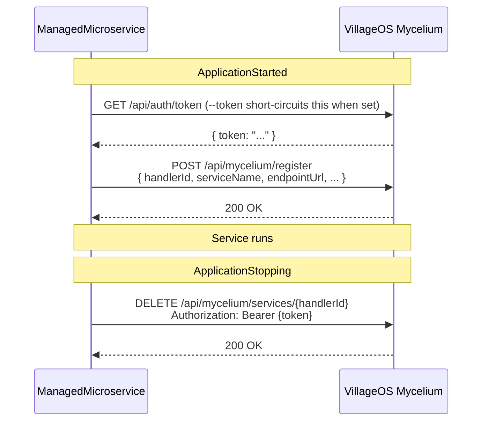

# Microservices

Canonical doc for `ManagedMicroservice` projects. Forward-looking design
(delivery contract, dispatch, ACK envelope) lives in
[`FUTURE_ARCHITECTURE.md`](FUTURE_ARCHITECTURE.md) §1. For the simulation-
specific behavior of Metabolism, see [`METABOLISM.md`](METABOLISM.md).

## 1. What a microservice is in this repo

A `ManagedMicroservice` is a `Microsoft.NET.Sdk.Web` minimal-API binary on
.NET 10 that talks to the **VillageOS Mycelium** (separate repo, default
`https://localhost:7243`). It auto-registers on start, auto-deregisters on
stop, and exposes a `/health` endpoint Mycelium's `LivenessMonitor` polls.

The handler contract is just **HTTP + one HS256 JWT**, so it is not tied to
.NET — a microservice can be written in any language. This doc is the C#
reference; for the **language-agnostic contract** plus runnable reference
handlers in Go, Node/TypeScript, Python, and Rust, see
[`MICROSERVICE_AUTHORING.md`](MICROSERVICE_AUTHORING.md).

Today's .NET services: `Echo`, `Tributary`, `Delta`, `Metabolism`. **Echo is
the canonical reference implementation** — the simplest. When adding a new
microservice, copy Echo's structure and the test patterns in §10.

Project references: `vos.Auth.Shared` (inbound JWT validation) and
`vos.ManagedMicroservice.Shared` (Mycelium-client base, validators, contract-
validation foundation + middleware — see §9). A microservice does **not**
depend on `vos.Core` or `vos.Application`.

## 2. Quick start

```bash
# 1. Start Mycelium (in its own repo, separate clone)
cd ../VillageOS/vos.Mycelium
dotnet run                                  # binds https://localhost:7243

# 2. Start a microservice
cd vos.ManagedMicroservice.Echo
dotnet run -- --port=7245 --myceliumUrl=https://localhost:7243

# 3. Verify health
curl http://localhost:7245/health           # {"status":"Healthy"}

# 4. Verify Mycelium registration
TOKEN=$(curl -s -X POST https://localhost:7243/api/auth/login \
  -H "Content-Type: application/json" \
  -d '{"username":"admin","password":"admin"}' | jq -r '.token')
curl -H "Authorization: Bearer $TOKEN" https://localhost:7243/api/mycelium/services
```

**Multi-model Mycelium instances:** if more than one model is loaded, add
`"modelId":"<guid>"` to the login JSON body, or use `?modelId=<guid>` on
`/api/auth/token`.

## 3. Project shape

```
vos.ManagedMicroservice.<Name>/
├── Configuration/
│   └── CliArgs.cs           ← record + Parse(string[]) + UsageMessage
├── Services/
│   └── MyceliumClient.cs      ← thin subclass of MyceliumClientBase
├── Helpers/                 ← optional: pure functions extracted from Program.cs
│   └── <Name>.cs            ← static class, no AspNetCore dependency, fully unit-tested
└── Program.cs               ← top-level statements: parse args → build app → register endpoints → run
```

## 4. CLI args — the six standard flags

A C# `record` with the standard six fields:

- **Required:** `--port`, `--myceliumUrl`
- **Optional:** `--token` (pre-minted service JWT for **outbound** Mycelium
  calls), `--signingKey` (base64-encoded HMAC key for validating **inbound**
  Mycelium requests), `--issuer`, `--audience`

`Parse(string[])` returns `null` on missing/invalid input. `UsageMessage`
mentions every flag. The reference is
`vos.ManagedMicroservice.Echo/Configuration/CliArgs.cs`.

Service-specific flags extend the standard shape. Metabolism's
`--mode=consumes|produces` lives in
`Metabolism/Configuration/MetabolismCliArgs.cs` and fails parsing for any
other value.

## 5. MyceliumClient subclassing

`vos.ManagedMicroservice.Shared.MyceliumClientBase` owns the
service-agnostic plumbing:

- `HandlerId` (fresh `Guid` per process)
- `MyceliumUrl`
- `GetTokenAsync()` — returns `--token` if set, otherwise hits the legacy
  `/api/auth/token` endpoint
- `CreateAuthenticatedClientAsync(timeout?)` — returns an `HttpClient` with
  Bearer auth
- `RegisterAsync(port, serviceName, startCommand)` — POSTs the registration
  envelope
- `DeregisterAsync()` — `DELETE /api/mycelium/services/{HandlerId}`

The subclass's job is to provide a service-specific `RegisterAsync(port)`
overload that calls the base with the right `(serviceName, startCommand)`,
plus any service-specific calls (`CreateThingAsync`, `ApplyQuantityAsync`, …).
Echo's canonical example:

```csharp
public class MyceliumClient : MyceliumClientBase
{
    public MyceliumClient(IHttpClientFactory http, ILogger<MyceliumClient> log, string myceliumUrl, string? token = null)
        : base(http, log, myceliumUrl, token) { }

    public Task<bool> RegisterAsync(int port)
        => RegisterAsync(port, "Echo", "endpoint-service");
}
```

### Registration sequence



## 6. Helpers — pulling logic out of Program.cs

When `Program.cs` accumulates inline static helpers — JSON-element coercion,
dictionary lookups, file-loading with fallback paths, value-normalization
switches — extract them into `vos.ManagedMicroservice.<Name>/Helpers/<Name>.cs`
as a static class. This pulls the testable surface off the
`WebApplicationFactory` integration-test path and onto fast unit tests.

Worked examples from Feature #5433 / Task #5436:

- `vos.ManagedMicroservice.Delta/Helpers/JsonValueCoercion.cs` —
  `CoerceToString(object?)`, `TryGetPropertyValue(IDictionary, string, out object?)`,
  `TryGetStringProperty(IDictionary, string, out string?)`. Every
  `JsonValueKind` arm + case-insensitive lookup pinned in
  `Tests/.../Helpers/JsonValueCoercionTests.cs`.
- `vos.ManagedMicroservice.Delta/Helpers/EndpointSeedLoader.cs` —
  `LoadGraph(IEnumerable<string>, ILogger)` takes candidate `seed.json` paths as a
  parameter so tests use real temp files (cheap, no I/O mock); it loads the first
  existing model-seed document (a `Things[]` + `Relationships[]` fragment) and
  assembles it via `EndpointSeedGraph.Build`, which derives the template hierarchy
  from the seed's `is` relationships (not a scalar field). `LoadGraphDefault(ILogger)`
  wraps with the canonical three paths.
- `vos.ManagedMicroservice.Metabolism/Helpers/JsonValueUnwrapper.cs` —
  `Unwrap(object?)` maps `JsonElement` to native CLR types with
  `int → long → decimal` width escalation.
- `vos.ManagedMicroservice.Tributary/Helpers/EffectivePropertyResolver.cs` —
  `TryGetEffectiveProperty` with exact-match-preempts-suffix precedence and a
  `conflicts` list for ambiguous suffixes.

What stays in `Program.cs`: DI registration, middleware order, route mapping,
lifetime callbacks, endpoint lambdas with thin call-through bodies.
Composition, not logic. The `coverage.runsettings` exclusion of `Program.cs`
is honest after the extraction; before it, real testable code hid behind the
exclusion.

## 7. Program.cs — the same eleven steps

Every microservice's `Program.cs`:

1. Parses CLI args; `Console.WriteLine(CliArgs.UsageMessage)` +
   `Environment.Exit(1)` on `null`.
2. Configures Serilog file logging under `logs/<service>-.log`.
3. Calls `WebApplication.CreateBuilder(args)`.
4. If `--signingKey` was supplied, calls
   `builder.AddMyceliumTokenAuth(signingKey, issuer, audience)`.
5. Calls `builder.Services.AddContractValidation()` to register the schema
   registry + validator.
6. Registers a singleton `MyceliumClient` (and any service-specific dependencies)
   via DI.
7. Calls `app.UseRouting()`, then `app.UseRequestContractValidation()` (after
   auth if auth is enabled). The middleware reads
   `ContractValidationMetadata` off the matched endpoint, so it must run
   after `UseRouting` and before endpoint dispatch.
8. Maps **POST `/handle`**, **GET `/health`**, **GET `/stats`**, **POST
   `/shutdown`**. Each request DTO that has a JSON Schema is tagged
   `[ContractSchema("<$id>")]`; its route calls `.RequireContract<TRequest>()`
   to opt in to validation.
9. Wires `ApplicationStarted` to call `MyceliumClient.RegisterAsync(port)`
   (best-effort; Mycelium can also discover via `/health`).
10. Wires `ApplicationStopping` to call `MyceliumClient.DeregisterAsync()`.
11. `app.Run()`.

The contract-validation wiring is the canonical reference in
`vos.ManagedMicroservice.Metabolism/Program.cs` +
`Endpoints/EndpointMapper.cs` (Feature #5426). Adopting it in a new
microservice is three local edits: `AddContractValidation()`,
`UseRequestContractValidation()`, and `.RequireContract<HandleRequest>()` on
the route.

## 8. Health & lifecycle

Mycelium's `LivenessMonitor` polls `/health` every 15 seconds. Three
consecutive failures (a 45 s window) trigger auto-deregistration:

```
00:00 - Service registers         (FailureCount = 0)
00:15 - GET /health → 200 OK     (FailureCount = 0)
00:30 - GET /health → 200 OK     (FailureCount = 0)
00:45 - GET /health → Timeout     (FailureCount = 1)
01:00 - GET /health → Timeout     (FailureCount = 2)
01:15 - GET /health → Timeout     (FailureCount = 3) → Auto-deregistered
```

After auto-deregistration the service must restart. The `ApplicationStarted`
hook generates a new `HandlerId` and re-registers.

`ApplicationStopping` calls `DeregisterAsync` as a courtesy. Missing the
deregistration call is recoverable — the monitor's auto-deregistration covers
ungraceful exits.

Today each service hand-rolls the `/health` body shape (Echo returns
`requestsProcessed`; Metabolism returns five fields). The monitor only reads
`status`. The fixed-envelope health shape arrives with the Delivery contract;
see [`FUTURE_ARCHITECTURE.md`](FUTURE_ARCHITECTURE.md) §1.8.

### Deregistration triggers

| Trigger | Mechanism |
|---|---|
| SIGTERM / SIGINT / process-manager shutdown | `ApplicationStopping` lifecycle hook |
| Explicit `POST /shutdown` | Calls `DeregisterAsync()` then exits |
| Mycelium calling `TryStopAsync()` | POSTs to the registered `stopEndpoint` |
| Liveness failure (3× `/health` timeout) | Mycelium auto-deregisters |

## 9. Contract validation

JSON Schema artifacts + a runtime that loads and validates against them.
Schemas pin the wire format of Mycelium ↔ microservice payloads so future
changes are a schema diff in code review rather than a silent runtime
surprise. Phases 1–4 have landed (Features #5419, #5426, #5440, #5445).

Schemas live under `vos.ManagedMicroservice.Shared/Contracts/Schemas/` and are
embedded as resources in the shared assembly. The validator runtime lives in
`vos.ManagedMicroservice.Shared/Contracts/Validation/`.

### 9.1 Schemas in scope

| Schema | Producer → Consumer | Source of truth in code | Phase landed |
|---|---|---|---|
| `mycelium-register-request` | every microservice → Mycelium `POST /api/mycelium/register` | `MyceliumClientBase.RegisterAsync` | 1 (schema) / 3 (wired) |
| `token-response` | Mycelium `POST /api/auth/token` → every microservice | `MyceliumClientBase.GetTokenAsync` | 1 / 3 |
| `handle-request-metabolism` | Mycelium → Metabolism `POST /handle` | `vos.ManagedMicroservice.Metabolism.Models.HandleRequest` | 1 / 2 |
| `relationship-property-changed-event` | Mycelium `/vosHub` → Metabolism (SignalR) | `vos.ManagedMicroservice.Metabolism.Services.MyceliumClient.RaiseRelationshipPropertyChanged` | 1 / 4 |
| `apply-quantity-request` | Metabolism → Mycelium `POST /api/things/{id}/properties/{path}/{decrements\|increments}` | `vos.ManagedMicroservice.Metabolism.Services.MyceliumClient.ApplyQuantityAsync` | 4 |
| `relationship-property-increment-request` | Metabolism → Mycelium `POST /api/relationships/{id}/properties/{path}/increments` | `vos.ManagedMicroservice.Metabolism.Services.MyceliumClient.IncrementRelationshipPropertyAsync` | 4 |

Each schema uses `additionalProperties: false` on every object subschema —
strict by default per the project's pre-release / no-shims convention.

### 9.2 Public API

```csharp
var registry = new SchemaRegistry();
JsonSchema schema     = registry.Get("https://villageos/contracts/mycelium-register-request.schema.json");
JsonSchema sameSchema = registry.Get<MyceliumRegisterRequest>();   // via [ContractSchema]
```

`SchemaRegistry` eagerly loads every embedded schema and exposes them by
`$id`. One instance per process is sufficient. The constructor throws
`InvalidOperationException` at startup if any embedded schema is missing
`$id` or two schemas share an `$id` — design-time mistakes fail closed.

```csharp
[ContractSchema("https://villageos/contracts/mycelium-register-request.schema.json")]
public sealed record MyceliumRegisterRequest(/* ... */);
```

```csharp
var validator = new SchemaValidator();
ContractValidationResult result = validator.Validate(json, schema);

if (!result.IsValid)
    foreach (var e in result.Errors)
        log.LogWarning("contract violation {Path} [{Code}]: {Message}", e.Path, e.Code, e.Message);

validator.ValidateOrThrow(json, schema, schemaId);   // throws ContractValidationException
```

`ContractValidationError.Code` is a stable public code family — decoupled from
NJsonSchema's internal `ValidationErrorKind` enum:

| Code | Meaning |
|---|---|
| `Required` | A `required` property is missing. |
| `AdditionalProperties` | An unknown property is present (strict mode). |
| `Type` | The JSON type does not match `type` (string/integer/number/array/...). |
| `Format` | The value violates `format` (`uuid`, `uri`, `date-time`, …). |
| `ArrayLength` | `minItems` / `maxItems` violated. |
| (other) | Raw NJsonSchema `ValidationErrorKind` name as a fall-through. |

### 9.3 Adding a schema

1. Drop a `.schema.json` file under
   `vos.ManagedMicroservice.Shared/Contracts/Schemas/` with a unique `$id` of
   the form `https://villageos/contracts/<name>.schema.json`.
2. Set `additionalProperties: false` on every object subschema.
3. Add fixtures under
   `Tests/vos.ManagedMicroservice.Shared.Contracts.Tests/Fixtures/<schema-folder>/`:
   - `valid.json` — at least one positive case.
   - `invalid-<reason>.json` — one or more negative cases.
4. Add the schema id to the positive/negative tables in
   `SchemaValidatorTests`. `SchemaSelfValidityTests` discovers it
   automatically.
5. Tag the C# DTO with `[ContractSchema("<$id>")]` and add
   `.RequireContract<TRequest>()` to the route that accepts it.

Schemas are authored against Draft 2020-12 by default. The
`relationship-property-changed-event` schema uses Draft 7 because
NJsonSchema's runtime validator does not implement Draft 2020-12
`prefixItems`; switch back to Draft 2020-12 if NJsonSchema gains support.

### 9.4 Inbound middleware (Phase 2, Feature #5426)

`app.UseRequestContractValidation()` + `endpoint.RequireContract<T>()` gate
the inbound `/handle` body. A schema violation returns `400` with a
`{ schemaId, errors[] }` envelope before the handler runs. Adoption is
per-service: tag the request DTO with `[ContractSchema]` and add
`.RequireContract<T>()` to the route. Today Metabolism is the only adopter.

### 9.5 MyceliumClientBase outbound + response validation (Phase 3, Feature #5440)

`RegisterAsync` body and `GetTokenAsync` response are validated on every call.
Failure policy is per-call via `SchemaViolationMode`:

- **Debug** builds throw `ContractValidationException`.
- **Release** builds emit a single `LogLevel.Warning` and let the call
  through.

Tests pin both paths regardless of build config via a virtual
`OutboundViolationMode` on `MyceliumClientBase`. No metrics infra yet — counter
follow-up tracked separately.

### 9.6 Metabolism hot-path validation (Phase 4, Feature #5445)

`ApplyQuantityAsync`, `IncrementRelationshipPropertyAsync`, and the SignalR
`RelationshipPropertyChanged` event all validate on every tick.
`ValidateOutbound` is promoted to `protected` so service-specific subclasses
can call it. The SignalR callback delegates to an internal
`RaiseRelationshipPropertyChanged` helper tested via `InternalsVisibleTo`, so
the validation path is exercised without a real hub. Same Throw/Log policy as
§9.5.

### 9.7 Tests + coverage

`Tests/vos.ManagedMicroservice.Shared.Contracts.Tests/` runs alongside the
rest of the solution under `dotnet test`. The new assembly is excluded from
coverage measurement via the existing `ModulePath` filter in
`coverage.runsettings`; the production code lands under
`vos.ManagedMicroservice.Shared`'s existing thresholds (unchanged by Phase 1).

The `LoadEmbeddedRawSchemas` host-side enumeration has branches (resource-name
filter, defensive null-stream throw) that are not reachable through the test
surface; the parsing and registration logic it feeds *is* covered, via the
internal `SchemaRegistry` constructor that takes raw `(name, json)` pairs.

Two further phases (GUI runtime validation, CI drift gate) are sketched in
[`FUTURE_ARCHITECTURE.md`](FUTURE_ARCHITECTURE.md) §3 but unscheduled.

## 10. Testing patterns

Every microservice has a sibling test project at
`Tests/vos.ManagedMicroservice.<Name>.Tests/`. Mirrors the production
project's reference graph + adds:

- `Microsoft.NET.Test.Sdk`, `xunit`, `xunit.runner.visualstudio`,
  `coverlet.collector`
- `FluentAssertions`, `Moq` (or NSubstitute — see
  [`TEST-STATE.md`](TEST-STATE.md) "Watch items" #4)
- `Microsoft.AspNetCore.Mvc.Testing` if exercising endpoints via
  `WebApplicationFactory<Program>`
- Project references: the microservice + `vos.Tests.Shared`

Standard test files (one per testable unit):

```
Tests/vos.ManagedMicroservice.<Name>.Tests/
├── CliArgsTests.cs          ← CLI parser contract
├── MyceliumClientTests.cs     ← service-specific RegisterAsync + inherited base behavior
└── <Service>Tests.cs        ← service-specific business logic (handle endpoint, etc.)
```

### 10.1 `CliArgsTests` — pin the standard contract

Tests are named `<Method>_<Scenario>_<Expected>_PerTemplate` so the template
aspect is visible at a glance. Required tests (see
`Tests/vos.ManagedMicroservice.Echo.Tests/CliArgsTests.cs`):

| Test name | What it pins |
|---|---|
| `Parse_RequiredFlagsOnly_ReturnsArgsWithDefaultedOptionals_PerTemplate` | Required `--port` + `--myceliumUrl` are sufficient; optionals default to `null` |
| `Parse_MissingPort_ReturnsNull_PerTemplate` | Required-arg validation fails closed |
| `Parse_MissingMyceliumUrl_ReturnsNull_PerTemplate` | Required-arg validation fails closed |
| `Parse_InvalidPort_ReturnsNull_PerTemplate` (Theory) | Port out of `[1, 65535]` or non-numeric → null |
| `Parse_PortAtBoundaries_Accepted_PerTemplate` (Theory) | 1 and 65535 are valid |
| `Parse_AllOptionalFlags_PopulateRespectiveFields_PerTemplate` | Each optional flag round-trips |
| `Parse_FlagOrderIndependent_PerTemplate` | Args may appear in any order |
| `Parse_UnknownFlag_IgnoredSilently_PerTemplate` | Forward-compat: unknown flags don't crash |
| `UsageMessage_MentionsEverySupportedFlag_PerTemplate` | `--help`-style output stays in sync with `Parse` |

### 10.2 `MyceliumClientTests` — pin inherited + service-specific behavior

Standard helpers (use `vos.Tests.Shared.MockHttpMessageHandler` +
`TestHttpClientFactory`):

```csharp
private static (MyceliumClient client, MockHttpMessageHandler handler) NewClient(
    Func<HttpRequestMessage, HttpResponseMessage> respond,
    string? serviceToken = "svc-jwt-abc")
{
    var handler = new MockHttpMessageHandler(respond);
    var http = new HttpClient(handler);
    var factory = new TestHttpClientFactory(http);
    var client = new MyceliumClient(factory, NullLogger<MyceliumClient>.Instance, "http://localhost:7243", serviceToken);
    return (client, handler);
}
```

Required tests (see
`Tests/vos.ManagedMicroservice.Echo.Tests/MyceliumClientTests.cs`):

| Test name | What it pins |
|---|---|
| `HandlerId_IsUniquePerInstance_PerTemplate` | Two `MyceliumClient` instances have distinct `HandlerId` Guids |
| `MyceliumUrl_PassedThroughFromCtor_PerTemplate` | Constructor wires `MyceliumUrl` |
| `RegisterAsync_Success_PostsServiceIdentity_PerTemplate` | POST body to `/api/mycelium/register` contains the service-specific `serviceName` + `startCommand` plus the standard `handlerId`/`endpointUrl`/`stopEndpoint`/`healthEndpoint` envelope |
| `RegisterAsync_MyceliumReturnsFailure_ReturnsFalse_PerTemplate` | Non-2xx → false |
| `RegisterAsync_AuthFails_ReturnsFalse_PerTemplate` | `CreateAuthenticatedClient` throwing → caught → false |
| `DeregisterAsync_SendsDeleteToMycelium_PerTemplate` | `DELETE /api/mycelium/services/{HandlerId}` with Bearer header |
| `GetTokenAsync_WithProvidedToken_ReturnsItDirectly_PerTemplate` | `--token` short-circuits Mycelium call |

### 10.3 Service-specific endpoint tests

Echo has minimal business logic (echo body + counter) and per
`coverage.runsettings` `Program.cs` is excluded from unit-test coverage — so
Echo's test suite stops at `CliArgs` + `MyceliumClient`.

Microservices with substantial business logic (e.g. Metabolism's simulation
engine, Tributary's `ObservationIngestService`) get a dedicated
`<Service>Tests.cs` exercising that logic directly. When the endpoint surface
needs unit-level coverage, use `WebApplicationFactory<Program>` from
`Microsoft.AspNetCore.Mvc.Testing` and pass empty args + a Configure callback
that injects the args via `WebApplicationFactoryClientOptions`. The `Program`
class is `internal` by default with top-level statements — declare
`public partial class Program { }` at the bottom of `Program.cs` to make it
accessible to the test factory.

### 10.4 Coverage expectations

Per-microservice acceptance: **≥95 % line on `CliArgs` + `MyceliumClient` + any
`<Service>Tests.cs` business-logic class**. `Program.cs` is excluded by
`coverage.runsettings` (integration-test territory).

> The original wildcard `**/vos.ManagedMicroservice.*/Program.cs` was silently
> ignored because Phase 0 used nested `<File>` elements inside
> `<ExcludeByFile>` — coverlet's XPlat data collector expects a single
> comma-separated string. Fixed under Feature #5433 / Task #5435 with explicit
> per-microservice paths. New microservices need to add their own `Program.cs`
> to the comma-separated list in `coverage.runsettings`.

## 11. Adding a new microservice

1. Copy `vos.ManagedMicroservice.Echo/` to `vos.ManagedMicroservice.<Name>/`.
   Rename the namespace, project file, and `MyceliumClient`'s `serviceName` /
   `startCommand`.
2. Add the new project to `VillageOS-API.sln`.
3. Copy `Tests/vos.ManagedMicroservice.Echo.Tests/` to
   `Tests/vos.ManagedMicroservice.<Name>.Tests/`. Update the project reference
   + namespace; the test patterns transfer 1:1.
4. Add the test project to `VillageOS-API.sln`.
5. Run `dotnet test` from the repo root — the new project should be picked up
   automatically by the `**/*Tests.csproj` glob in `azure-pipelines.yml`.
6. Append the new `Program.cs` path to the `<ExcludeByFile>` list in
   `coverage.runsettings`.
7. Add a row to [`TEST-STATE.md`](TEST-STATE.md) under "Where tests live".

## 12. Pointers

Mycelium repo (`ReGenVillages/VillageOS`) owns the REST surface, SignalR
hub, seed-loading, and JWT minting. Quick map for what calls what:

| Area | Endpoint (on Mycelium) | Method |
|---|---|---|
| Login | `/api/auth/login` | POST |
| API-key exchange | `/api/auth/token` | POST (`X-API-Key` header) |
| Session restore | `/api/auth/restore-session` | GET (HttpOnly cookie) |
| Things | `/api/things` | GET, POST, DELETE |
| Properties | `/api/properties` | GET, PUT, DELETE |
| Relationships | `/api/relationships` | GET, POST, DELETE |
| Mycelium registry | `/api/mycelium/register`, `/api/mycelium/services/{id}` | POST, DELETE |
| SignalR Hub | `/vosHub` | WebSocket |

Full reference: the **Mycelium Guide** on Mycelium repo's wiki
(`ReGenVillages/VillageOS` → wiki → Mycelium). Swagger UI is available at
`/swagger` when Mycelium is running (default
`https://localhost:7243/swagger`).

### Creating a service API key

Microservices authenticate with a pre-minted JWT passed via `--token` (the
Mycelium mints and supplies it when it launches the daemon). They do **not**
accept an API key directly — there is no `--api-key` argument or `VOS_API_KEY`
support in the microservice host. A service API key is still useful for
operators/CLI to *obtain* a token; create one like this:

```bash
TOKEN=$(curl -s -X POST https://localhost:7243/api/auth/login \
  -H "Content-Type: application/json" \
  -d '{"username":"admin","password":"admin"}' | jq -r '.token')

curl -s -H "Authorization: Bearer $TOKEN" \
  -X POST https://localhost:7243/api/auth/keys \
  -H "Content-Type: application/json" \
  -d '{"name":"my-service-key","role":"service"}' | jq
```

The response includes a `rawKey` field (e.g. `vos_sk_...`) — store it securely,
it is only shown once. Exchange it for a JWT via `POST /api/auth/token`
(`X-API-Key: <rawKey>`); pass the resulting token to a service with `--token`.

### Related docs

- [`METABOLISM.md`](METABOLISM.md) — Metabolism simulation lifecycle, two-mode
  binary (`--mode=consumes|produces`), tick logic.
- [`TEST-STATE.md`](TEST-STATE.md) — test infrastructure, coverage state,
  watch items.
- [`FUTURE_ARCHITECTURE.md`](FUTURE_ARCHITECTURE.md) — Delivery contract,
  remaining DI refactors, possible contract-validation phases 5+6.

## 13. Common issues

#### "Registration error: Connection refused"

Mycelium is not running or not accessible. Start it
(`cd ../VillageOS/vos.Mycelium && dotnet run`), verify with
`curl https://localhost:7243/api/auth/token`, and check `--myceliumUrl` matches
Mycelium's actual URL.

#### Service shows as "Unreachable" in `/api/mycelium/services`

The `/health` endpoint is not responding. Test directly:
`curl http://localhost:<port>/health`. Check the port is bound
(`netstat -an | findstr :<port>`) and that the handler returns
`{ "status": "Healthy" }` with `200`.

#### Service was auto-deregistered

Three consecutive `/health` failures (45 s window). Fix the health issue,
then restart — the service re-registers with a new `HandlerId`.

#### Port already in use

`Get-Process -Id (Get-NetTCPConnection -LocalPort <port>).OwningProcess | Stop-Process`
(PowerShell), then restart. Or pass `--port=<other>`.

#### Schema validation rejecting valid-looking payloads

Schemas use `additionalProperties: false` strictly. Check that DTO field
casing matches the schema, that no extra fields are present, and that
nullable fields are typed correctly (`{ "type": ["string","null"] }` vs
plain `"string"`).

## 14. Endpoint services

In addition to relationship-service daemons (invoked when relationships are
created), Mycelium supports **endpoint services** — custom HTTP
microservices that expose their own API endpoints through
`POST /api/endpoints/{subdomain}`. They are auto-discovered from seed data
(things with an `EndpointSubdomain` property), use the same daemon lifecycle
as relationship services via `DaemonLifecycleManager`, and act as
pass-through proxies — Mycelium forwards request bodies as-is to the
service's `/handle` endpoint. Per-subdomain request metrics (count, avg
response time, errors) are tracked Mycelium-side.

Full implementation details: the *Endpoint Services* section in the Mycelium
Guide on Mycelium repo's wiki.

### 14.1 Tributary token-exchange auth + offset paging (Task #5470)

> The endpoint-template graph, the property field taxonomy (required-structural /
> canonical-default / sensible-default / optional), and the fetch-and-shape (no derived
> calculation) boundary versus Metabolism are covered in [`TRIBUTARY.md`](TRIBUTARY.md).

Tributary stays source-agnostic: it gained two **generic** capabilities — a
token-exchange auth provider and an offset paginator — both driven entirely by
endpoint-template config. There is no ArcGIS vocabulary in the code; ESRI is just one
configuration (see *The `EsriEndpoint` template* below). No new binary, and no Delta
change — the endpoint-template catalog already resolves multi-level hierarchies.

**Auth kind.** `authKind` is a structural key on the **root `Endpoint`** template, so
it is admissible for every endpoint and carries no inherited default (an unset value is
treated as `none`). Descendant templates (or a registration) resolve the value.
`/handle` branches on it:

- `none` (or unset) — a plain REST call, unchanged. (A *static* key needs no auth kind —
  configure it directly as a `queryParams` entry or header.)
- `tokenExchange` — a pre-minted `token` is used directly; otherwise a token is minted
  by POSTing the configured `tokenRequest` form fields to `tokenUrl`, reading the token
  out at the simple dotted `tokenPath` (and optional `expiryPath` + `expiryUnit` of
  `epochMillis`/`epochSeconds`/`seconds`). Tokens live in a per-process
  `TokenExchangeCache` keyed by `(tokenUrl, request-fields)`, reused until ~75% of
  lifetime elapses (`TimeProvider`-driven), then refreshed. The credential attaches as a
  query param (`tokenParam`, default `token`) or, if `tokenHeader` is set, a request
  header (`tokenScheme` + value). Missing mint config is a 400; a token-endpoint failure
  surfaces as a **generic** 502 (the upstream message may name the credential and is not
  echoed to the caller — it is logged).

**Offset paging.** When `pagingKind = offset`, `OffsetPaginator` loops the query
advancing `offsetParam` (by `pageSize` via `pageSizeParam`, else by the returned item
count) while the page's `hasMorePath` boolean is true, and concatenates every page's
array at `itemsPath` into the first page's body. Aggregation happens **before** the
JSONata `responseTransform` runs, so the transform sees the complete result, not page
one. Paths are simple dotted keys (e.g. `data.features`).

**The `EsriEndpoint` template.** Seeds are deployment-supplied runtime data (not
committed; `seed.json` stores every template as a thing plus the `is` relationships
between them), so the canonical shape lives here. ESRI is expressed purely as config on
a child template that extends `Endpoint` and restates only the keys it narrows:

```json
{
  "things": [
    { "name": "Endpoint", "properties": {
        "url": "", "httpMethod": "GET", "responseTransform": "$",
        "headers": "", "queryParams": "", "requestContentType": "",
        "timeout": "", "authKind": "" } },
    { "name": "EsriEndpoint", "properties": {
        "httpMethod": "POST", "requestContentType": "application/x-www-form-urlencoded",
        "authKind": "tokenExchange",
        "token": "", "tokenUrl": "", "tokenRequest": "",
        "tokenPath": "token", "expiryPath": "expires", "expiryUnit": "epochMillis",
        "pagingKind": "offset", "offsetParam": "resultOffset",
        "pageSizeParam": "resultRecordCount", "hasMorePath": "exceededTransferLimit",
        "itemsPath": "features", "pageSize": "" } }
  ],
  "relationships": [ { "subject": "EsriEndpoint", "predicate": "is", "target": "Endpoint" } ]
}
```

A registration under `EsriEndpoint` supplies the blanks (`url`, `tokenUrl`,
`tokenRequest` = `{username, password, referer, f, client}`, optional `pageSize`). An
OAuth2 source reuses the same code with `tokenPath=access_token`,
`expiryPath=expires_in`, `expiryUnit=seconds`, `tokenHeader=Authorization`,
`tokenScheme=Bearer`. Blank values are structural keys — admissible for a registration
but supplying no inherited default. Graph composition is pinned by
`EsriEndpointTemplateTests` (Delta); behavior by `EsriHandleTests`,
`TokenExchangeCacheTests`, and `OffsetPaginatorTests` (Tributary).
