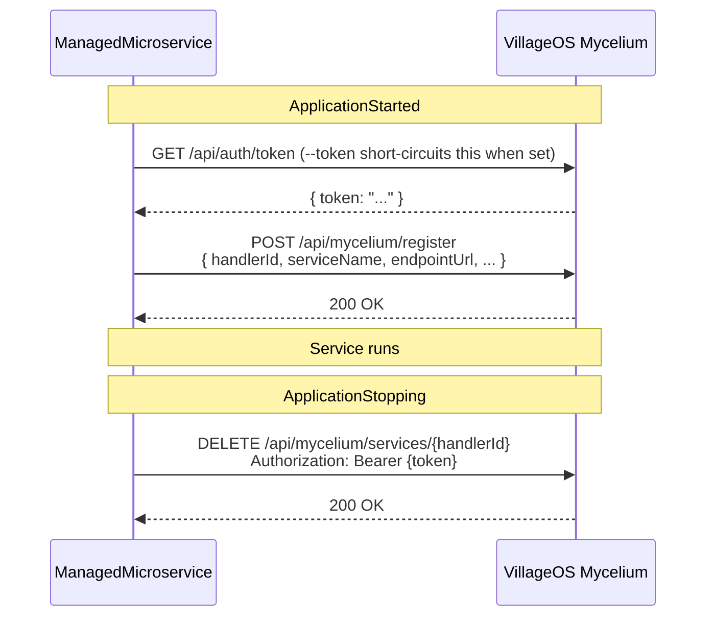
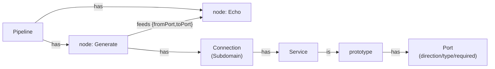
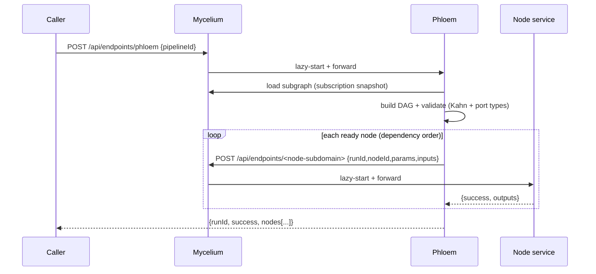

# Microservices

Canonical C# how-to for `ManagedMicroservice` projects. For the **language-agnostic HTTP + SSE
wire contract** (Go/Node/Python/Rust subscribe snippets) see
[`MICROSERVICE_CONTRACT.md`](MICROSERVICE_CONTRACT.md). Forward-looking design (delivery
contract, dispatch, ACK envelope) lives in
[`MICROSERVICE_HOST_ROADMAP.md`](MICROSERVICE_HOST_ROADMAP.md) §1. For the simulation-
specific behavior of Metabolism, see [`METABOLISM.md`](METABOLISM.md).

## 1. What a microservice is in this repo

A `ManagedMicroservice` is a `Microsoft.NET.Sdk.Web` minimal-API binary on
.NET 10 that talks to the **VillageOS Mycelium** (separate repo, default
`https://localhost:7243`). It auto-registers on start, auto-deregisters on
stop, and exposes a `/health` endpoint Mycelium's `LivenessMonitor` polls.

The handler contract is just **HTTP + one HS256 JWT**, so it is not tied to
.NET — a microservice can be written in any language. This doc is the C#
reference; for the **language-agnostic contract** plus runnable reference
handlers in Go, Node/TypeScript, Python, and Rust, see
[`MICROSERVICE_AUTHORING.md`](MICROSERVICE_AUTHORING.md).

Today's .NET services: `Echo`, `Tributary`, `Delta`, `Metabolism`, `Phloem`,
`WaterReserve`, `EnergyBalance`, `ModelBridge`. `Delta` is the endpoint-registration service: it
provisions the endpoint-template catalog into Mycelium at startup and validates every endpoint
registration against that template graph (see [`DELTA.md`](DELTA.md)); `Tributary` is the runtime
fetch side of the same endpoint story. `WaterReserve` (#5805) and `EnergyBalance` (#5806) are
site-analysis nodes: `WaterReserve` computes emergency reserve / days-of-supply / %
consumption (feeding the 14-day resilience range); `EnergyBalance` computes solar + other
generation vs consumption → % of consumption and net-positive. Besides the DAG-node path (wired ports),
both also run **reactively** (#5839) — a graph `/handle` whose subject is the SiteStudy makes the service
read its inputs off the study's effective properties, compute, and write its outputs back as Facts, so the
study's judge ranges re-evaluate (no pipeline). `ModelBridge` (#5866) is a generic
**model⇄DAG bridge** node: with node param `mode:"read"` it outputs a Thing's property value (GET
effective-properties); with `mode:"write"` it writes its `value` input onto a Thing's property (a Fact).
It lets a compute node read a roll-up / SiteStudy param and write its result back over ordinary node→node
wires — the source/target Thing id is baked into the node params (`thingId`, `property`). See
[`MODELBRIDGE.md`](MODELBRIDGE.md) for the full read/write contract and a worked example. **Echo is
the canonical reference implementation** — the simplest. When adding a new
microservice, copy Echo's structure and the test patterns in §10. `Phloem` is the
pipeline/DAG orchestrator and a service becomes a pipeline *node* via an additive `/handle`
envelope — both documented in §16 (Pipelines / DAG orchestration).

**Two kinds of predicates — the extension point.** `is` is the *only* predicate built into
Mycelium; **every other predicate that does work is a _Handled Predicate_** dispatched to a
microservice. That is the platform's extension point: a new capability — simulation, integration,
computation — ships as a microservice bound to a predicate, with no change to Mycelium (Metabolism
backs `consumes`/`produces` today; a pipeline node and the `runs` spawn-trigger are the same
pattern). The dispatch machinery is load-bearing even with a single handler — don't flatten it, and
don't add a second built-in predicate alongside `is`. The full relationship-service handler model, the Mycelium API handlers use, and worked examples are in [`RELATIONSHIP_SERVICES.md`](RELATIONSHIP_SERVICES.md).

Project references: `vos.Auth.Shared` (inbound JWT validation) and
`vos.ManagedMicroservice.Shared` (Mycelium-client base, validators, contract-
validation foundation + middleware — see §9). A microservice does **not**
depend on `vos.Core` or `vos.Application`.

## 2. Quick start

```bash
# 1. Start Mycelium (in its own repo, separate clone)
cd ../VillageOS/vos.Mycelium
dotnet run                                  # binds https://localhost:7243

# 2. Start a microservice
cd vos.ManagedMicroservice.CSharp.Echo
dotnet run -- --port=7245 --myceliumUrl=https://localhost:7243

# 3. Verify health
curl http://localhost:7245/health           # {"status":"Healthy"}

# 4. Verify Mycelium registration
TOKEN=$(curl -s -X POST https://localhost:7243/api/auth/login \
  -H "Content-Type: application/json" \
  -d '{"username":"admin","password":"admin"}' | jq -r '.token')
curl -H "Authorization: Bearer $TOKEN" https://localhost:7243/api/mycelium/services
```

**Multi-model Mycelium instances:** if more than one model is loaded, add
`"modelId":"<guid>"` to the login JSON body, or use `?modelId=<guid>` on
`/api/auth/token`.

## 3. Project shape

```text
vos.ManagedMicroservice.<Name>/
├── Configuration/
│   └── CliArgs.cs           ← record + Parse(string[]) + UsageMessage
├── Services/
│   └── MyceliumClient.cs      ← thin subclass of MyceliumClientBase
├── Helpers/                 ← optional: pure functions extracted from Program.cs
│   └── <Name>.cs            ← static class, no AspNetCore dependency, fully unit-tested
└── Program.cs               ← top-level statements: parse args → build app → register endpoints → run
```

## 4. CLI args — the six standard flags

A C# `record` with the standard six fields:

- **Required:** `--port`, `--myceliumUrl`
- **Optional:** `--token` (pre-minted service JWT for **outbound** Mycelium
  calls), `--signingKey` (base64-encoded HMAC key for validating **inbound**
  Mycelium requests), `--issuer`, `--audience`

`Parse(string[])` returns `null` on missing/invalid input. `UsageMessage`
mentions every flag. The reference is
`vos.ManagedMicroservice.CSharp.Echo/Configuration/CliArgs.cs`.

Service-specific flags extend the standard shape. Metabolism's
`--mode=consumes|produces` lives in
`Metabolism/Configuration/CliArgs.cs` and fails parsing for any
other value.

## 5. MyceliumClient subclassing

`vos.ManagedMicroservice.Shared.MyceliumClientBase` owns the
service-agnostic plumbing:

- `HandlerId` (fresh `Guid` per process)
- `MyceliumUrl`
- `GetTokenAsync()` — returns `--token` if set, otherwise hits the legacy
  `/api/auth/token` endpoint
- `CreateAuthenticatedClientAsync(timeout?)` — returns an `HttpClient` with
  Bearer auth
- `RegisterAsync(port, serviceName, startCommand)` — POSTs the registration
  envelope
- `DeregisterAsync()` — `DELETE /api/mycelium/services/{HandlerId}`

### 5.1 Snapshot subscriptions — startup data + live stream (SSE)

`vos.ManagedMicroservice.Shared.Subscriptions.SubscriptionClient` (also a
`MyceliumClientBase` subclass) is how a service gets its working set **without a
GET storm** and follows changes afterward.

```csharp
var sub = new SubscriptionClient(httpFactory, logger, myceliumUrl, token);

// 1) One call at startup: full objects + a commit-sequence watermark.
var result = await sub.SubscribeAsync(new SubscriptionSelector
{
    Types = new() { "Pump" },
    Traverse = new() { new TraverseRule { Predicate = "produces", Direction = "outgoing", Depth = 1 } },
});
ApplySnapshot(result.Snapshot); // own + inherited properties are kept separate

// 2) Follow live changes; resumes from the watermark and auto-reconnects.
await foreach (var change in sub.StreamAsync(result.SubscriptionId, result.Watermark, ct))
    Apply(change); // change.Sequence is the commit order / Last-Event-ID
```

The stream tracks the last delivered `Sequence` and re-sends it as `Last-Event-ID`
on every reconnect, so delivery is gap-free and exactly-once across drops. Call
`UnsubscribeAsync(subscriptionId)` on shutdown. The wire contract and the resume
semantics are documented in [`MICROSERVICE_CONTRACT.md`](MICROSERVICE_CONTRACT.md) § Subscriptions.

Membership is mutable — no reconnect needed to change what you watch:

```csharp
// Whole-model consumer (e.g. a GUI): one subscription, every change incl. future objects.
var all = await sub.SubscribeAsync(new SubscriptionSelector { All = true });

// Widen / narrow a live subscription as needs change:
var added = await sub.AddObjectsAsync(all.SubscriptionId, new SubscriptionSelector { Ids = new() { relId } });
ApplySnapshot(added.Snapshot); // incremental snapshot hydrates the newly-added objects
await sub.RemoveObjectsAsync(all.SubscriptionId, new[] { relId });
```

The subclass's job is to provide a service-specific `RegisterAsync(port)`
overload that calls the base with the right `(serviceName, startCommand)`,
plus any service-specific calls (`CreateThingAsync`, `ApplyQuantityAsync`, …).
Echo's canonical example:

```csharp
public class MyceliumClient : MyceliumClientBase
{
    public MyceliumClient(IHttpClientFactory http, ILogger<MyceliumClient> log, string myceliumUrl, string? token = null)
        : base(http, log, myceliumUrl, token) { }

    public Task<bool> RegisterAsync(int port)
        => RegisterAsync(port, "Echo", "endpoint-service");
}
```

### Registration sequence



## 6. Helpers — pulling logic out of Program.cs

When `Program.cs` accumulates inline static helpers — JSON-element coercion,
dictionary lookups, file-loading with fallback paths, value-normalization
switches — extract them into `vos.ManagedMicroservice.<Name>/Helpers/<Name>.cs`
as a static class. This pulls the testable surface off the
`WebApplicationFactory` integration-test path and onto fast unit tests.

Worked examples:

- `vos.ManagedMicroservice.Delta/Helpers/JsonValueCoercion.cs` —
  `CoerceToString(object?)`, `TryGetPropertyValue(IDictionary, string, out object?)`,
  `TryGetStringProperty(IDictionary, string, out string?)`. Every
  `JsonValueKind` arm + case-insensitive lookup pinned in
  `Tests/.../Helpers/JsonValueCoercionTests.cs`.
- `vos.ManagedMicroservice.Delta/Helpers/EndpointSeedLoader.cs` —
  `LoadGraph(IEnumerable<string>, ILogger)` takes candidate `seed.json` paths as a
  parameter so tests use real temp files (cheap, no I/O mock); it loads the first
  existing model-seed document (a `Things[]` + `Relationships[]` fragment) and
  assembles it via `EndpointSeedGraph.Build`, which derives the template hierarchy
  from the seed's `is` relationships (not a scalar field). `LoadGraphDefault(ILogger)`
  wraps with the canonical three paths.
- `vos.ManagedMicroservice.Metabolism/Helpers/JsonValueUnwrapper.cs` —
  `Unwrap(object?)` maps `JsonElement` to native CLR types with
  `int → long → decimal` width escalation.
- `vos.ManagedMicroservice.Tributary/Helpers/EffectivePropertyResolver.cs` —
  `TryGetEffectiveProperty` with exact-match-preempts-suffix precedence and a
  `conflicts` list for ambiguous suffixes.

What stays in `Program.cs`: DI registration, middleware order, route mapping,
lifetime callbacks, endpoint lambdas with thin call-through bodies.
Composition, not logic. The `coverage.runsettings` exclusion of `Program.cs`
is honest after the extraction; before it, real testable code hid behind the
exclusion.

## 7. Program.cs — the same eleven steps

Every microservice's `Program.cs`:

1. Parses CLI args; `Console.WriteLine(CliArgs.UsageMessage)` +
   `Environment.Exit(1)` on `null`.
2. Configures Serilog file logging under `logs/<service>-.log`.
3. Calls `WebApplication.CreateBuilder(args)`.
4. If `--signingKey` was supplied, calls
   `builder.AddMyceliumTokenAuth(signingKey, issuer, audience)`.
5. Calls `builder.Services.AddContractValidation()` to register the schema
   registry + validator.
6. Registers a singleton `MyceliumClient` (and any service-specific dependencies)
   via DI.
7. Calls `app.UseRouting()`, then `app.UseRequestContractValidation()` (after
   auth if auth is enabled). The middleware reads
   `ContractValidationMetadata` off the matched endpoint, so it must run
   after `UseRouting` and before endpoint dispatch.
8. Maps **POST `/handle`**, **GET `/health`**, **GET `/stats`**, **POST
   `/shutdown`**. Each request DTO that has a JSON Schema is tagged
   `[ContractSchema("<$id>")]`; its route calls `.RequireContract<TRequest>()`
   to opt in to validation.
9. Wires `ApplicationStarted` to call `MyceliumClient.RegisterAsync(port)`
   (best-effort; Mycelium can also discover via `/health`).
10. Wires `ApplicationStopping` to call `MyceliumClient.DeregisterAsync()`.
11. `app.Run()`.

The contract-validation wiring is the canonical reference in
`vos.ManagedMicroservice.Metabolism/Program.cs` +
`Endpoints/EndpointMapper.cs`. Adopting it in a new
microservice is three local edits: `AddContractValidation()`,
`UseRequestContractValidation()`, and `.RequireContract<HandleRequest>()` on
the route.

## 8. Health & lifecycle

Mycelium's `LivenessMonitor` polls `/health` every 15 seconds. Three
consecutive failures (a 45 s window) trigger auto-deregistration:

```text
00:00 - Service registers         (FailureCount = 0)
00:15 - GET /health → 200 OK     (FailureCount = 0)
00:30 - GET /health → 200 OK     (FailureCount = 0)
00:45 - GET /health → Timeout     (FailureCount = 1)
01:00 - GET /health → Timeout     (FailureCount = 2)
01:15 - GET /health → Timeout     (FailureCount = 3) → Auto-deregistered
```

After auto-deregistration the service must restart. The `ApplicationStarted`
hook generates a new `HandlerId` and re-registers.

`ApplicationStopping` calls `DeregisterAsync` as a courtesy. Missing the
deregistration call is recoverable — the monitor's auto-deregistration covers
ungraceful exits.

Today each service hand-rolls the `/health` body shape (Echo returns
`requestsProcessed`; Metabolism returns five fields). The monitor only reads
`status`. The fixed-envelope health shape arrives with the Delivery contract;
see [`MICROSERVICE_HOST_ROADMAP.md`](MICROSERVICE_HOST_ROADMAP.md) §1.8.

### Deregistration triggers

| Trigger | Mechanism |
|---|---|
| SIGTERM / SIGINT / process-manager shutdown | `ApplicationStopping` lifecycle hook |
| Explicit `POST /shutdown` | Calls `DeregisterAsync()` then exits |
| Mycelium calling `TryStopAsync()` | POSTs to the registered `stopEndpoint` |
| Liveness failure (3× `/health` timeout) | Mycelium auto-deregisters |

## 9. Contract validation

JSON Schema artifacts + a runtime that loads and validates against them.
Schemas pin the wire format of Mycelium ↔ microservice payloads so future
changes are a schema diff in code review rather than a silent runtime
surprise. Phases 1–4 have landed.

Schemas live under `vos.ManagedMicroservice.Shared/Contracts/Schemas/` and are
embedded as resources in the shared assembly. The validator runtime lives in
`vos.ManagedMicroservice.Shared/Contracts/Validation/`.

### 9.1 Schemas in scope

| Schema | Producer → Consumer | Source of truth in code | Phase landed |
|---|---|---|---|
| `mycelium-register-request` | every microservice → Mycelium `POST /api/mycelium/register` | `MyceliumClientBase.RegisterAsync` | 1 (schema) / 3 (wired) |
| `token-response` | Mycelium `POST /api/auth/token` → every microservice | `MyceliumClientBase.GetTokenAsync` | 1 / 3 |
| `handle-request-metabolism` | Mycelium → Metabolism `POST /handle` | `vos.ManagedMicroservice.Metabolism.Models.HandleRequest` | 1 / 2 |
| `apply-quantity-request` | Metabolism → Mycelium `POST /api/things/{id}/properties/{path}/{decrements\|increments}` | `vos.ManagedMicroservice.Metabolism.Services.MyceliumClient.ApplyQuantityAsync` | 4 |
| `relationship-property-increment-request` | Metabolism → Mycelium `POST /api/relationships/{id}/properties/{path}/increments` | `vos.ManagedMicroservice.Metabolism.Services.MyceliumClient.IncrementRelationshipPropertyAsync` | 4 |

Each schema uses `additionalProperties: false` on every object subschema —
strict by default per the project's pre-release / no-shims convention.

### 9.2 Public API

```csharp
var registry = new SchemaRegistry();
JsonSchema schema     = registry.Get("https://villageos/contracts/mycelium-register-request.schema.json");
JsonSchema sameSchema = registry.Get<MyceliumRegisterRequest>();   // via [ContractSchema]
```

`SchemaRegistry` eagerly loads every embedded schema and exposes them by
`$id`. One instance per process is sufficient. The constructor throws
`InvalidOperationException` at startup if any embedded schema is missing
`$id` or two schemas share an `$id` — design-time mistakes fail closed.

```csharp
[ContractSchema("https://villageos/contracts/mycelium-register-request.schema.json")]
public sealed record MyceliumRegisterRequest(/* ... */);
```

```csharp
var validator = new SchemaValidator();
ContractValidationResult result = validator.Validate(json, schema);

if (!result.IsValid)
    foreach (var e in result.Errors)
        log.LogWarning("contract violation {Path} [{Code}]: {Message}", e.Path, e.Code, e.Message);

validator.ValidateOrThrow(json, schema, schemaId);   // throws ContractValidationException
```

`ContractValidationError.Code` is a stable public code family — decoupled from
NJsonSchema's internal `ValidationErrorKind` enum:

| Code | Meaning |
|---|---|
| `Required` | A `required` property is missing. |
| `AdditionalProperties` | An unknown property is present (strict mode). |
| `Type` | The JSON type does not match `type` (string/integer/number/array/...). |
| `Format` | The value violates `format` (`uuid`, `uri`, `date-time`, …). |
| `ArrayLength` | `minItems` / `maxItems` violated. |
| (other) | Raw NJsonSchema `ValidationErrorKind` name as a fall-through. |

### 9.3 Adding a schema

1. Drop a `.schema.json` file under
   `vos.ManagedMicroservice.Shared/Contracts/Schemas/` with a unique `$id` of
   the form `https://villageos/contracts/<name>.schema.json`.
2. Set `additionalProperties: false` on every object subschema.
3. Add fixtures under
   `Tests/vos.ManagedMicroservice.Shared.Contracts.Tests/Fixtures/<schema-folder>/`:
   - `valid.json` — at least one positive case.
   - `invalid-<reason>.json` — one or more negative cases.
4. Add the schema id to the positive/negative tables in
   `SchemaValidatorTests`. `SchemaSelfValidityTests` discovers it
   automatically.
5. Tag the C# DTO with `[ContractSchema("<$id>")]` and add
   `.RequireContract<TRequest>()` to the route that accepts it.

Schemas are authored against Draft 2020-12.

### 9.4 Inbound middleware (Phase 2)

`app.UseRequestContractValidation()` + `endpoint.RequireContract<T>()` gate
the inbound `/handle` body. A schema violation returns `400` with a
`{ schemaId, errors[] }` envelope before the handler runs. Adoption is
per-service: tag the request DTO with `[ContractSchema]` and add
`.RequireContract<T>()` to the route. Today Metabolism is the only adopter.

### 9.5 MyceliumClientBase outbound + response validation (Phase 3)

`RegisterAsync` body and `GetTokenAsync` response are validated on every call.
Failure policy is per-call via `SchemaViolationMode`:

- **Debug** builds throw `ContractValidationException`.
- **Release** builds emit a single `LogLevel.Warning` and let the call
  through.

Tests pin both paths regardless of build config via a virtual
`OutboundViolationMode` on `MyceliumClientBase`. No metrics infra yet — counter
follow-up tracked separately.

### 9.6 Metabolism hot-path validation (Phase 4)

`ApplyQuantityAsync` and `IncrementRelationshipPropertyAsync` validate their
outbound bodies on every tick. `ValidateOutbound` is promoted to `protected` so
service-specific subclasses can call it. Same Throw/Log policy as §9.5. Inbound
`RelationshipPropertyChanged` events arriving over the SSE subscription are not
schema-validated — `MetabolismSubscriptionService` applies them directly.

### 9.7 Tests + coverage

`Tests/vos.ManagedMicroservice.Shared.Contracts.Tests/` runs alongside the
rest of the solution under `dotnet test`. The new assembly is excluded from
coverage measurement via the existing `ModulePath` filter in
`coverage.runsettings`; the production code lands under
`vos.ManagedMicroservice.Shared`'s existing thresholds (unchanged by Phase 1).

The `LoadEmbeddedRawSchemas` host-side enumeration has branches (resource-name
filter, defensive null-stream throw) that are not reachable through the test
surface; the parsing and registration logic it feeds *is* covered, via the
internal `SchemaRegistry` constructor that takes raw `(name, json)` pairs.

Two further phases (GUI runtime validation, CI drift gate) are sketched in
[`MICROSERVICE_HOST_ROADMAP.md`](MICROSERVICE_HOST_ROADMAP.md) §3 but unscheduled.

## 10. Testing patterns

Every microservice has a sibling test project at
`Tests/vos.ManagedMicroservice.<Name>.Tests/`. Mirrors the production
project's reference graph + adds:

- `Microsoft.NET.Test.Sdk`, `xunit`, `xunit.runner.visualstudio`,
  `coverlet.collector`
- `FluentAssertions`, `Moq` (or NSubstitute)
- `Microsoft.AspNetCore.Mvc.Testing` if exercising endpoints via
  `WebApplicationFactory<Program>`
- Project references: the microservice + `vos.Tests.Shared`

Standard test files (one per testable unit):

```text
Tests/vos.ManagedMicroservice.<Name>.Tests/
├── CliArgsTests.cs          ← CLI parser contract
├── MyceliumClientTests.cs     ← service-specific RegisterAsync + inherited base behavior
└── <Service>Tests.cs        ← service-specific business logic (handle endpoint, etc.)
```

### 10.1 `CliArgsTests` — pin the standard contract

Tests are named `<Method>_<Scenario>_<Expected>_PerTemplate` so the template
aspect is visible at a glance. Required tests (see
`Tests/vos.ManagedMicroservice.CSharp.Echo.Tests/CliArgsTests.cs`):

| Test name | What it pins |
|---|---|
| `Parse_RequiredFlagsOnly_ReturnsArgsWithDefaultedOptionals_PerTemplate` | Required `--port` + `--myceliumUrl` are sufficient; optionals default to `null` |
| `Parse_MissingPort_ReturnsNull_PerTemplate` | Required-arg validation fails closed |
| `Parse_MissingMyceliumUrl_ReturnsNull_PerTemplate` | Required-arg validation fails closed |
| `Parse_InvalidPort_ReturnsNull_PerTemplate` (Theory) | Port out of `[1, 65535]` or non-numeric → null |
| `Parse_PortAtBoundaries_Accepted_PerTemplate` (Theory) | 1 and 65535 are valid |
| `Parse_AllOptionalFlags_PopulateRespectiveFields_PerTemplate` | Each optional flag round-trips |
| `Parse_FlagOrderIndependent_PerTemplate` | Args may appear in any order |
| `Parse_UnknownFlag_IgnoredSilently_PerTemplate` | Forward-compat: unknown flags don't crash |
| `UsageMessage_MentionsEverySupportedFlag_PerTemplate` | `--help`-style output stays in sync with `Parse` |

### 10.2 `MyceliumClientTests` — pin inherited + service-specific behavior

Standard helpers (use `vos.Tests.Shared.MockHttpMessageHandler` +
`TestHttpClientFactory`):

```csharp
private static (MyceliumClient client, MockHttpMessageHandler handler) NewClient(
    Func<HttpRequestMessage, HttpResponseMessage> respond,
    string? serviceToken = "svc-jwt-abc")
{
    var handler = new MockHttpMessageHandler(respond);
    var http = new HttpClient(handler);
    var factory = new TestHttpClientFactory(http);
    var client = new MyceliumClient(factory, NullLogger<MyceliumClient>.Instance, "http://localhost:7243", serviceToken);
    return (client, handler);
}
```

Required tests (see
`Tests/vos.ManagedMicroservice.CSharp.Echo.Tests/MyceliumClientTests.cs`):

| Test name | What it pins |
|---|---|
| `HandlerId_IsUniquePerInstance_PerTemplate` | Two `MyceliumClient` instances have distinct `HandlerId` Guids |
| `MyceliumUrl_PassedThroughFromCtor_PerTemplate` | Constructor wires `MyceliumUrl` |
| `RegisterAsync_Success_PostsServiceIdentity_PerTemplate` | POST body to `/api/mycelium/register` contains the service-specific `serviceName` + `startCommand` plus the standard `handlerId`/`endpointUrl`/`stopEndpoint`/`healthEndpoint` envelope |
| `RegisterAsync_MyceliumReturnsFailure_ReturnsFalse_PerTemplate` | Non-2xx → false |
| `RegisterAsync_AuthFails_ReturnsFalse_PerTemplate` | `CreateAuthenticatedClient` throwing → caught → false |
| `DeregisterAsync_SendsDeleteToMycelium_PerTemplate` | `DELETE /api/mycelium/services/{HandlerId}` with Bearer header |
| `GetTokenAsync_WithProvidedToken_ReturnsItDirectly_PerTemplate` | `--token` short-circuits Mycelium call |

### 10.3 Service-specific endpoint tests

Echo has minimal business logic (echo body + counter) and per
`coverage.runsettings` `Program.cs` is excluded from unit-test coverage — so
Echo's test suite stops at `CliArgs` + `MyceliumClient`.

Microservices with substantial business logic (e.g. Metabolism's simulation
engine, Tributary's `ObservationIngestService`) get a dedicated
`<Service>Tests.cs` exercising that logic directly. When the endpoint surface
needs unit-level coverage, use `WebApplicationFactory<Program>` from
`Microsoft.AspNetCore.Mvc.Testing` and pass empty args + a Configure callback
that injects the args via `WebApplicationFactoryClientOptions`. The `Program`
class is `internal` by default with top-level statements — declare
`public partial class Program { }` at the bottom of `Program.cs` to make it
accessible to the test factory.

### 10.4 Coverage expectations

Per-microservice acceptance: **≥95 % line on `CliArgs` + `MyceliumClient` + any
`<Service>Tests.cs` business-logic class**. `Program.cs` is excluded by
`coverage.runsettings` (integration-test territory).

> The original wildcard `**/vos.ManagedMicroservice.*/Program.cs` was silently
> ignored because Phase 0 used nested `<File>` elements inside
> `<ExcludeByFile>` — coverlet's XPlat data collector expects a single
> comma-separated string. Fixed with explicit
> per-microservice paths. New microservices need to add their own `Program.cs`
> to the comma-separated list in `coverage.runsettings`.

## 11. Adding a new microservice

1. Copy `vos.ManagedMicroservice.CSharp.Echo/` to `vos.ManagedMicroservice.<Name>/`.
   Rename the namespace, project file, and `MyceliumClient`'s `serviceName` /
   `startCommand`.
2. Add the new project to `VillageOS-API.sln`.
3. Copy `Tests/vos.ManagedMicroservice.CSharp.Echo.Tests/` to
   `Tests/vos.ManagedMicroservice.<Name>.Tests/`. Update the project reference
   - namespace; the test patterns transfer 1:1.
4. Add the test project to `VillageOS-API.sln`.
5. Run `dotnet test` from the repo root — the new project should be picked up
   automatically by the `**/*Tests.csproj` glob in `azure-pipelines.yml`.
6. Append the new `Program.cs` path to the `<ExcludeByFile>` list in
   `coverage.runsettings`.

## 12. Pointers

Mycelium repo (`ReGenVillages/VillageOS`) owns the REST surface, SSE change
streams, seed-loading, and JWT minting. Quick map for what calls what:

| Area | Endpoint (on Mycelium) | Method |
|---|---|---|
| Login | `/api/auth/login` | POST |
| API-key exchange | `/api/auth/token` | POST (`X-API-Key` header) |
| Session restore | `/api/auth/restore-session` | GET (HttpOnly cookie) |
| Things | `/api/things` | GET, POST, DELETE |
| Properties | `/api/properties` | GET, PUT, DELETE |
| Relationships | `/api/relationships` | GET, POST, DELETE |
| Mycelium registry | `/api/mycelium/register`, `/api/mycelium/services/{id}` | POST, DELETE |
| Subscriptions (SSE) | `/api/subscriptions`, `/api/subscriptions/{id}/stream` | POST, GET (SSE) |
| System events (SSE) | `/api/events/stream` | GET (SSE) |

Full reference: the **Mycelium Guide** on Mycelium repo's wiki
(`ReGenVillages/VillageOS` → wiki → Mycelium). Swagger UI is available at
`/swagger` when Mycelium is running (default
`https://localhost:7243/swagger`).

### Creating a service API key

Microservices authenticate with a pre-minted JWT passed via `--token` (the
Mycelium mints and supplies it when it launches the daemon). They do **not**
accept an API key directly — there is no `--api-key` argument or `VOS_API_KEY`
support in the microservice host. A service API key is still useful for
operators/CLI to *obtain* a token; create one like this:

```bash
TOKEN=$(curl -s -X POST https://localhost:7243/api/auth/login \
  -H "Content-Type: application/json" \
  -d '{"username":"admin","password":"admin"}' | jq -r '.token')

curl -s -H "Authorization: Bearer $TOKEN" \
  -X POST https://localhost:7243/api/auth/keys \
  -H "Content-Type: application/json" \
  -d '{"name":"my-service-key","role":"service"}' | jq
```

The response includes a `rawKey` field (e.g. `vos_sk_...`) — store it securely,
it is only shown once. Exchange it for a JWT via `POST /api/auth/token`
(`X-API-Key: <rawKey>`); pass the resulting token to a service with `--token`.

### Related docs

- [`METABOLISM.md`](METABOLISM.md) — Metabolism simulation lifecycle, two-mode
  binary (`--mode=consumes|produces`), tick logic.
- [`MODELBRIDGE.md`](MODELBRIDGE.md) — ModelBridge model⇄DAG bridge node: the
  `read`/`write` modes, the `thingId`/`property` param contract, and a worked example.
- [`DELTA.md`](DELTA.md) — Delta endpoint-registration service: template-catalog provisioning at
  startup, the graph-validation rules, and the `/handle` registration contract.
- [`MICROSERVICE_HOST_ROADMAP.md`](MICROSERVICE_HOST_ROADMAP.md) — Delivery contract,
  remaining DI refactors, possible contract-validation phases 5+6.

## 13. Common issues

### "Registration error: Connection refused"

Mycelium is not running or not accessible. Start it
(`cd ../VillageOS/vos.Mycelium && dotnet run`), verify with
`curl https://localhost:7243/api/auth/token`, and check `--myceliumUrl` matches
Mycelium's actual URL.

### Service shows as "Unreachable" in `/api/mycelium/services`

The `/health` endpoint is not responding. Test directly:
`curl http://localhost:<port>/health`. Check the port is bound
(`netstat -an | findstr :<port>`) and that the handler returns
`{ "status": "Healthy" }` with `200`.

### Service was auto-deregistered

Three consecutive `/health` failures (45 s window). Fix the health issue,
then restart — the service re-registers with a new `HandlerId`.

### Port already in use

`Get-Process -Id (Get-NetTCPConnection -LocalPort <port>).OwningProcess | Stop-Process`
(PowerShell), then restart. Or pass `--port=<other>`.

### Schema validation rejecting valid-looking payloads

Schemas use `additionalProperties: false` strictly. Check that DTO field
casing matches the schema, that no extra fields are present, and that
nullable fields are typed correctly (`{ "type": ["string","null"] }` vs
plain `"string"`).

## 14. Endpoint services

In addition to relationship-service daemons (invoked when relationships are
created), Mycelium supports **endpoint services** — custom HTTP
microservices that expose their own API endpoints through
`POST /api/endpoints/{subdomain}`. They are auto-discovered from seed data
(things with an `EndpointSubdomain` property), share the same managed daemon
lifecycle as relationship services, and act as pass-through proxies — Mycelium
forwards request bodies as-is to the service's `/handle` endpoint. Mycelium
also exposes per-subdomain request metrics (count, avg response time, errors).

Full implementation details: the *Endpoint Services* section in the Mycelium
Guide on Mycelium repo's wiki.

### 14.1 Tributary token-exchange auth + offset paging

Tributary is an endpoint service that stays source-agnostic: it has two
**generic** capabilities — a token-exchange auth provider and an offset
paginator — both driven entirely by endpoint-template config. There is no
ArcGIS vocabulary in the code; ESRI is just one configuration. No special
binary, and no Delta change — the endpoint-template catalog already resolves
multi-level hierarchies.

At the contract level: `/handle` branches on a template-supplied `authKind`
(`none` for a plain REST call, `tokenExchange` to mint or reuse a credential)
and a `pagingKind` (`offset` to walk an offset-paginated source and aggregate
all pages before transforming). Both default to off on the root `Endpoint`
template, and a source-specific child template selects the mode.

The canonical `EsriEndpoint` template JSON, the token-exchange/caching
mechanics, and the offset-paging mechanics live in
[`TRIBUTARY.md`](TRIBUTARY.md) — the doc for the service that implements them.
The endpoint-template graph, the property field taxonomy, and the
fetch-and-shape (no derived calculation) boundary versus Metabolism are also
covered there.

## 15. Writing data back — Facts, Observations, Sediment

A handler usually reacts to model changes (via subscriptions, §5.1) and writes results back.
`MyceliumClientBase` ships a helper for each of the three write kinds, so every microservice's
`MyceliumClient` inherits them — no per-service plumbing. Each validates its outbound payload against
an embedded contract schema (§9) before the call and surfaces failures as an `HttpRequestException`
carrying the `StatusCode`.

| Helper | Write kind | Route | Returns |
|---|---|---|---|
| `SetFactAsync(thingId, property, value)` | **Fact** — structural, synchronous, never lossy | `POST …/properties/{p}/facts` → 201 | commit `sequenceNumber` |
| `RecordObservationAsync(thingId, property, value, observedAt?)` | **Observation** (single) | `POST …/properties/{p}/observations` → 202 | — |
| `RecordObservationsAsync(thingId, samples)` | **Observation** (batch) | `POST …/{id}/observations` → 202 | accepted count |
| `DepositSedimentAsync(readings)` | **Sediment** — bulk historical, straight to sealed Sapwood | `POST /api/sediment` → 202 | `SedimentDepositResult` |

```csharp
long seq = await mycelium.SetFactAsync(thingId, "status", "active");
await mycelium.RecordObservationAsync(thingId, "temperature", 21.5m, DateTime.UtcNow);
int accepted = await mycelium.RecordObservationsAsync(thingId, new[]
{
    new ObservationSample("temperature", 21.7m),
    new ObservationSample("flow", 3.1m, DateTime.UtcNow), // optional observed-time
});
SedimentDepositResult deposit = await mycelium.DepositSedimentAsync(new[]
{
    new SedimentReading(thingId, "temperature", 19.8m, DateTime.UtcNow.AddDays(-1)), // observedAt required
});
```

**Pick by intent.** A *Fact* is truth that must survive replay (status, configuration, a corrected
value). An *Observation* is sampled telemetry — high-volume, queued, and coalesced. *Sediment* is a
one-shot historical backfill that bypasses the live queue and writes sealed Sapwood buckets directly;
its entities must already exist and every reading must carry an `observedAt`.

**Gating.** A property's `AllowedWriteKinds` (`Both` / `FactOnly` / `ObservationOnly`) decides what it
accepts; the wrong kind returns **405**, an unknown thing/property **404**.

**Reference.** The **Echo** service demonstrates all three in
`Services/WriteKindsDemo.cs`, wired to `POST /demo/write-kinds`. The contract and the per-language
(Go/Node/Python/Rust) snippets are in
[`MICROSERVICE_CONTRACT.md`](MICROSERVICE_CONTRACT.md) § "Writing data back". The schemas live in
`vos.ManagedMicroservice.Shared/Contracts/Schemas/{fact-write,observation-write,observation-batch,sediment-deposit}-request.schema.json`
(§9.3). Tests: `MyceliumClientWriteKindsTests` (Shared) and `WriteKindsDemoTests` (Echo).

---

## 16. Pipelines / DAG orchestration

A **pipeline** is a Directed Acyclic Graph whose **nodes are microservices** and whose **edges are typed
data-flow wires**. You build one visually in **Trellis → Pipelines** (see
[`TRELLIS.md`](TRELLIS.md) §7.4), and the **Phloem** orchestrator microservice executes it — resolving
dependencies, invoking each node through the same `/handle` dispatch every handler already uses, and routing
each node's outputs to its downstream inputs.

It is *lean-on-model*: a pipeline is just **Things + relationships**, so the platform stays generic. Three
pieces hold all the specificity — the model archetypes (seed), the Phloem orchestrator, and the Trellis
editor.

### 16.1 The model



- A **PipelineNode** binds a **Connection** (`node ‑has→ Connection ‑has→ Service`); the Connection's
  `Subdomain` is the dispatch address Phloem forwards to.
- **Ports** are first-class `Port` Things on the service **prototype**, resolved by walking the bound
  service's `is`-chain (relationships do **not** inherit through `is`, so ports resolve at read time).
- A **wire** is a relationship whose predicate **`is PipelineWire`** — identified by archetype, never by the
  name `"feeds"` — carrying `fromPort`/`toPort`.
- Make any seed DAG-ready with the `seed-migrate` tool in the private VillageOS repo (`tools/seed-migrate/pipeline-enable.js`),
  which adds the archetypes, the Phloem Connection, example Echo node services with typed Ports, and a demo Pipeline.

### 16.2 Making a microservice a node — the envelope

A node is just a service that, in addition to its normal graph/http handling, recognises one extra `/handle`
request shape — the **node envelope** — and answers with **outputs**. It is **additive** over the
[Microservice Contract](MICROSERVICE_CONTRACT.md): same `POST /handle`, same JWT, same registration.

```jsonc
// orchestrator → node                          // node → orchestrator
POST /handle                                     {
{                                                  "success": true,
  "runId":  "<guid>",                              "outputs": { "echo": "hello" },  // by OUTPUT-port name
  "nodeId": "<guid>",                              "error": null
  "params": { /* static node params */ },        }
  "inputs": {                  // by INPUT-port name
    "message": "hello",                           // in-band literal, or…
    "geometry": { "ref": { "thingId": "<guid>", "property": "mesh" } }  // …a graph reference
  }
}
```

A request is a node invocation **iff it carries both `runId` and `nodeId`** — anything else is a legacy
graph/http body the service handles exactly as before; the two never collide.

- **Reference inputs.** Large values aren't shipped in-band: an input may be `{ "ref": { "thingId",
  "property" } }`, which the node resolves via `GET /api/things/{id}/effective-properties` before running.
  Return the same shape to hand a large value downstream. The referenced property may be a **roll-up
  property** — a value computed live from an aggregate reduction over related Things (e.g. total PV area
  summed over every element that `is SolarArray`). It resolves as an ordinary effective property, so a
  compute node reads a model-wide roll-up with no special handling.
- **Param-bound inputs.** An input port can be filled from the **run's params** instead of a wire: a
  node's `paramBindings` property maps `inputPort → paramKey`, and Phloem fills that input from the spawn's
  `params` before dispatch (an explicit wire into the same port wins). Lets a source node be parameterized
  per-run without editing the graph; the editor's **Params** form supplies the values.
- **Ports & `/manifest`.** A node advertises typed ports — `{ portName, direction: in|out, type, required }`
  — so the editor can type-check wires; expose them at `GET /manifest`.
- **Collection inputs (fan-out).** A port may be `collection: true`: when that input receives a **list**,
  Phloem runs the node **once per item** (bounded), broadcasts the node's other inputs to every item, and
  **gathers** each output port into a list for downstream. The node service still sees one item per call (a
  scalar on the collection port, plus the item `index` in the envelope). The node property `onItemError`
  chooses `fail` (any item fails → node fails) or `continue` (failed items become null holes → node `partial`).

**.NET SDK base.** `DagNodeService` (`vos.ManagedMicroservice.Shared`, namespace `…Shared.DagNode`) maps the
envelope onto business logic:

```csharp
public sealed class MyNode : DagNodeService
{
    public override IReadOnlyList<PortDescriptor> Ports { get; } = new[]
    {
        PortDescriptor.Input("message", "string", required: true),
        PortDescriptor.Output("echo", "string"),
    };

    protected override Task<NodeResult> ExecuteNodeAsync(NodeContext ctx, CancellationToken ct)
    {
        var message = ctx.Input("message")?.GetString() ?? throw new InvalidOperationException("message required");
        return Task.FromResult(NodeResult.Ok(("echo", message)));
    }
}

// wire into the host's existing /handle:
app.MapPost("/handle", async (HttpContext http, MyNode node) =>
{
    using var doc = await JsonDocument.ParseAsync(http.Request.Body);
    return DagNodeService.IsNodeEnvelope(doc.RootElement)
        ? Results.Ok(await node.HandleNodeAsync(doc.RootElement, http.RequestAborted))
        : Results.Ok(/* … the service's existing handling … */);
});
```

`HandleNodeAsync` parses the envelope, resolves `ref` inputs, runs `ExecuteNodeAsync`, and shapes
`{success,outputs,error}`. A throw becomes `{success:false,error:"…"}` — never an unhandled 500 — so the
orchestrator records the failure and halts dependents cleanly. **Echo** (`EchoNode`) is the reference node
(`message` → `echo`). Non-.NET services implement the same JSON envelope directly.

> **Node vs. spawner.** Being a node is one role; **spawning** a pipeline is a different one. A service that
> *runs* a DAG (e.g. Tributary, or Metabolism's `consumes`/`produces`) is a **spawner** — see §16.3 — not a
> node.

### 16.3 The orchestrator (Phloem)

Phloem is a managed microservice like any other; everything it does goes **through Mycelium**.

**Spawn — http (synchronous).** A caller spawns through endpoint-forward and **blocks for the result**:

```jsonc
POST /api/endpoints/phloem   { "pipelineId": "<guid>", "params": { } }
// → { "runId", "pipelineId", "success", "nodes": [ { "nodeId","name","status","outputs","error" } ], "error" }
```

**Spawn — http (asynchronous).** The Trellis editor spawns with `"async": true` so it gets the run id
**immediately** and animates the run over SSE instead of blocking:

```jsonc
POST /api/endpoints/phloem   { "pipelineId": "<guid>", "params": { }, "async": true }
// → { "success": true, "accepted": true, "runId": "<guid>", "pipelineId": "<guid>" }
```

**Spawn — graph (`X runs Pipeline`, fire-and-forget).** A pipeline can also be spawned **from the model**,
like `consumes`/`produces` drive Metabolism: the seed declares a `runs` predicate that is a **graph
Connection** bound to the Phloem Service. Creating a `<X> runs <Pipeline>` relationship makes Mycelium
forward the relationship envelope (`{relationshipId, subjectId, targetId, properties}`) to the same
`/handle`; `SpawnTrigger.Resolve` keys off shape (`pipelineId` ⇒ http; else `targetId` is the Pipeline,
`properties` are the params). So **any service can spawn a DAG** by creating that relationship. Because a
graph trigger fires during a relationship-create (Mycelium waits ~15s), it is **fire-and-forget**: Phloem
ACKs immediately and runs the DAG in the background, persisting the result to the `PipelineRun`.



**What a run does:** (1) load the pipeline's structural closure in one subscription snapshot; (2) build the
DAG (node→Connection subdomain, ports via the `is`-chain, wires by `PipelineWire`); (3) validate up front —
Kahn topological sort (acyclic, distinct from Hyphae's runtime oscillation) + port-type compatibility;
(4) execute in dependency order (independent nodes concurrently, bounded), dispatching each via
endpoint-forward and routing outputs→inputs; a node failure halts dependents; (5) **persist the run live**,
best-effort — each node is written `running` before dispatch and its terminal status after, on **one
`NodeRun` Thing per node** (deterministic id, so the SSE view sees a property change, not duplicate Things) —
and between dispatches Phloem polls the run's `cancelRequested` flag for **cooperative cancellation**
(already-running nodes finish; pending ones are marked `cancelled`).

*Internals:* `IMyceliumGateway` is the seam between orchestration and HTTP (so `PipelineExecutor` is
unit-tested without a network); `PipelineGraph` + `PipelineDagBuilder` build the `PipelineDag`,
`DagValidator` checks it, `MyceliumGateway` is the HTTP implementation. The archetype vocabulary
(Connection/Service/Pipeline/…) comes from Mycelium's `ServiceModel` config, pushed to Phloem at launch.

### 16.4 Creating & running a pipeline

1. **Enable a seed:** run the `seed-migrate` tool from the private VillageOS repo
   (`node tools/seed-migrate/pipeline-enable.js <seed.json> --write`), then reload the
   broker (clear `vos-data`).
2. **Author:** Trellis → **Pipelines** (`TRELLIS.md` §7.4) — drag services from the palette, wire output→input
   ports (type-checked), **Save**.
3. **Run:** click **Run** — the editor uses the async spawn and **animates each node live over SSE**
   (running → succeeded / failed / skipped); **Cancel** stops an in-flight run, marking pending nodes
   `cancelled`. Or create an `X runs Pipeline` relationship to trigger it from the model (fire-and-forget).

> **Scope.** Synchronous + async spawn with level-by-level concurrency, **live SSE run animation + cancel**,
> run-history replay, **run-level param routing**, and **fan-out over collections** (one collection input per
> node). Incremental rerun/caching, and full list-type validation across the graph, are later phases.
