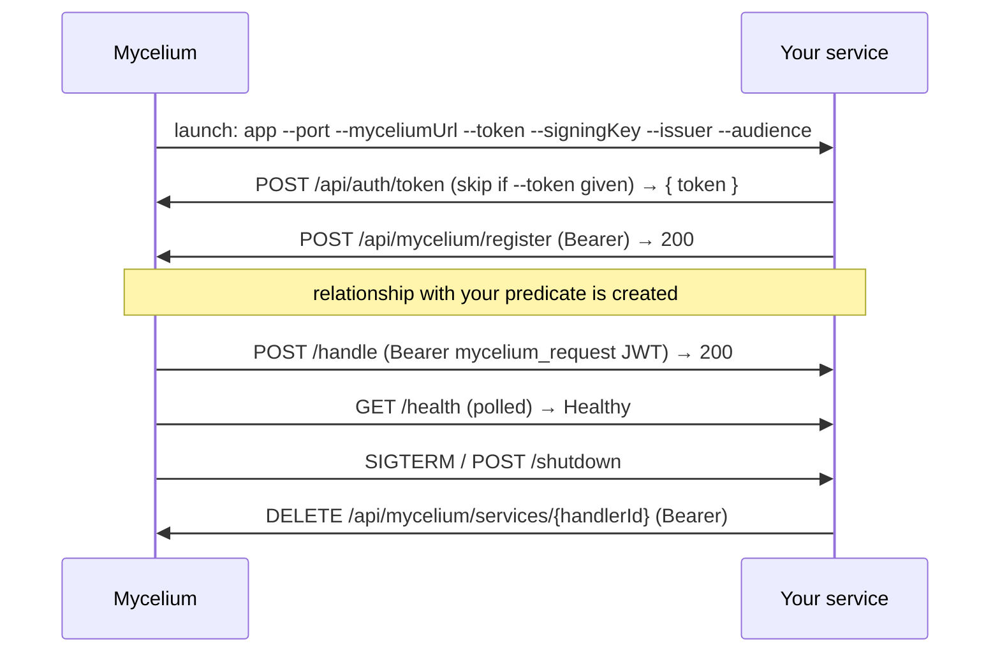

# Authoring a VillageOS managed microservice

A **managed microservice** is an external handler that Mycelium (the VillageOS gateway) launches as a daemon and calls when a relationship using the service's predicate is created. The entire contract is **HTTP + a single HS256 JWT** — so a handler can be written in *any* language with an HTTP server and an HMAC-SHA256 library.

This document is the language-agnostic contract. Working reference implementations live alongside it:

| Language | Project | Style | Verified |
|----------|---------|-------|----------|
| C# / .NET | [`vos.ManagedMicroservice.Echo`](../vos.ManagedMicroservice.Echo) | ASP.NET minimal API (canonical) | ✓ build + tests |
| Go | [`vos.ManagedMicroservice.Go`](../vos.ManagedMicroservice.Go) | standard library, zero deps | ✓ build + tests |
| Node / TypeScript | [`vos.ManagedMicroservice.Node`](../vos.ManagedMicroservice.Node) | built-ins, zero runtime deps | ✓ typecheck + tests |
| Python | [`vos.ManagedMicroservice.Python`](../vos.ManagedMicroservice.Python) | FastAPI | ✓ pytest |
| Rust | [`vos.ManagedMicroservice.Rust`](../vos.ManagedMicroservice.Rust) | Axum | ✓ build + tests + clippy |

Each reference is an **echo handler**: `/handle` acknowledges the relationship and reflects the payload back. Swap that for your predicate logic.

## A note on `is`

`is` is the one **built-in** predicate. Mycelium applies `is` inheritance in-process and **never dispatches it to an external handler** — only predicates like `consumes`/`produces` are mapped to external services. So you cannot write an external "is handler"; register your service for a custom predicate (or `consumes`/`produces`) instead.

## Lifecycle



## CLI arguments

Mycelium launches your binary with `--key=value` flags. `--port` and `--myceliumUrl` are required; the rest are optional.

| Flag | Required | Meaning |
|------|----------|---------|
| `--port` | ✓ | Port to listen on (1–65535) |
| `--myceliumUrl` | ✓ | Base URL of Mycelium, e.g. `https://localhost:7243` |
| `--token` | | Pre-minted service JWT for outbound calls; if omitted, fetch one from `POST /api/auth/token` |
| `--signingKey` | | Base64-encoded HMAC key for validating **inbound** requests. When present, `/handle` and `/shutdown` require auth; when absent, auth is disabled |
| `--issuer` | | JWT issuer to validate against (default `VillageOS`) |
| `--audience` | | JWT audience to validate against (default `VosClients`) |

## Registration

On startup, obtain a bearer token then register.

1. **Token** — use `--token` if provided, else `POST {myceliumUrl}/api/auth/token` (no body) → `{ "token": "<jwt>" }`.
2. **Register** — `POST {myceliumUrl}/api/mycelium/register` with `Authorization: Bearer <token>` and body:

```json
{
  "handlerId": "<uuid generated at startup>",
  "serviceName": "YourService",
  "endpointUrl": "http://localhost:<port>",
  "startCommand": "endpoint-service",
  "stopEndpoint": "http://localhost:<port>/shutdown",
  "healthEndpoint": "http://localhost:<port>/health"
}
```

A 2xx means you're registered.

## Endpoints to expose

| Method | Path | Auth* | Purpose |
|--------|------|-------|---------|
| POST | `/handle` | ✓ | Process a relationship payload |
| GET | `/health` | — | Liveness probe (Mycelium polls during startup; must answer quickly) |
| GET | `/stats` | — | Service metadata |
| POST | `/shutdown` | ✓ | Graceful shutdown trigger |

\* Auth enforced only when `--signingKey` was supplied.

**`POST /handle`** receives (camelCase JSON):

```json
{
  "relationshipId": "<uuid>",
  "subjectId": "<uuid>",
  "targetId": "<uuid>",
  "subjectName": "BuildingA",
  "targetName": "LandParcel1",
  "modelId": "<uuid>",
  "properties": { "...": "predicate-specific" }
}
```

Return any 2xx; Mycelium logs non-2xx and continues. A reasonable body:

```json
{ "success": true, "service": "YourService", "relationshipId": "<uuid>", "status": "handled" }
```

**`GET /health`** → `{ "status": "Healthy", "service": "YourService", "requestsProcessed": <n> }`

**`GET /stats`** → `{ "service": "...", "version": "...", "requestsProcessed": <n>, "handlerId": "<uuid>", "myceliumUrl": "..." }`

**`POST /shutdown`** → `{ "message": "..." }`, then exit (deregister first).

## Inbound JWT validation

When `--signingKey` is supplied, validate the Bearer JWT on `/handle` and `/shutdown`:

1. **Key** = `base64decode(--signingKey)` → use directly as the **HMAC-SHA256** secret.
2. **Algorithm** = HS256.
3. **Claims** — validate `iss == --issuer`, `aud == --audience`, and `exp`/`nbf`, allowing **30 seconds** clock skew.

Mycelium signs `/handle` calls with a 1-minute token carrying `iss`/`aud` and `vos:token_type = "mycelium_request"`; the platform validates this same HS256 JWT before dispatch, so your handler should apply the identical checks. Reject with 401 on any failure.

## Deregistration & health

- On `SIGINT`/`SIGTERM` and on `POST /shutdown`, send `DELETE {myceliumUrl}/api/mycelium/services/{handlerId}` (Bearer) before exiting.
- Keep `/health` fast and dependency-free — Mycelium uses it to decide a daemon started successfully.

## Authoring checklist

- [ ] Parse the six `--key=value` flags; exit with usage if `--port`/`--myceliumUrl` missing
- [ ] Generate a `handlerId` UUID at startup
- [ ] Get a token (`--token` or `/api/auth/token`) and `POST /api/mycelium/register`
- [ ] Serve `/handle`, `/health`, `/stats`, `/shutdown`
- [ ] Validate the inbound HS256 JWT when `--signingKey` is set (iss/aud/exp, 30s skew)
- [ ] Deregister on shutdown
- [ ] Add tests for arg parsing + JWT validation (see any reference example)
