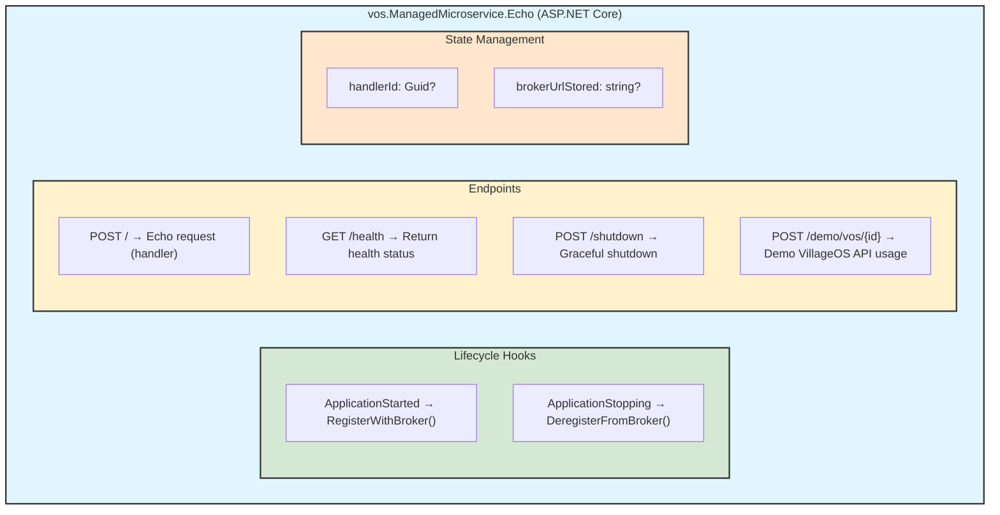
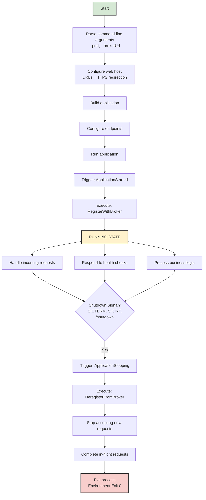
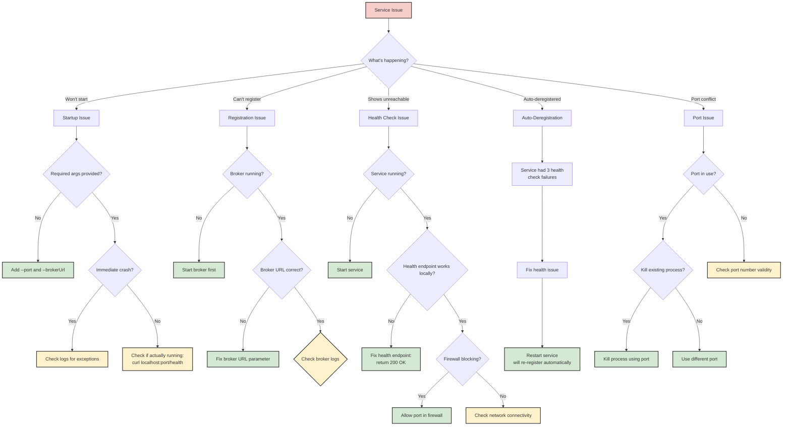

# VillageOS Microservice Guide

## Table of Contents
- [Overview](#overview)
- [Quick Start](#quick-start)
- [Architecture](#architecture)
- [Endpoints](#endpoints)
- [Registration & Deregistration](#registration--deregistration)
- [Configuration](#configuration)
- [Creating Custom Services](#creating-custom-services)
- [Deployment](#deployment)
- [Testing](#testing)
- [Troubleshooting](#troubleshooting)

---

## Overview

The VillageOS ManagedMicroservice is a minimal ASP.NET Core 8.0 web application template for building services that integrate with the VillageOS Broker. It handles the operational boilerplate -- registration, health monitoring, and graceful shutdown -- so you can focus on business logic.

**Capabilities:**
- **Auto-Registration** with the broker on startup (JWT-authenticated)
- **Auto-Deregistration** on shutdown (SIGTERM, SIGINT, or `/shutdown` endpoint)
- **Health Monitoring** via built-in `/health` endpoint (polled by broker every 15s)
- **Graceful Shutdown** with coordinated cleanup before process termination

**Technology Stack:**
- ASP.NET Core 8.0 (Minimal API)
- .NET 10 SDK
- JSON-based configuration
- HTTP for localhost daemon communication; HTTPS for external broker API

---

## Quick Start

### Prerequisites

- .NET 10.0 SDK installed
- VillageOS Broker running (see [Broker Guide](https://dev.azure.com/ReGenVillages/VillageOS/_git/VillageOS?path=/docs/BROKER_GUIDE.md))

### Run the Example Service

1. **Start the broker** (in one terminal):
   ```bash
   cd vos.Broker
   dotnet run
   ```

2. **Start the microservice** (in another terminal):
   ```bash
   cd vos.ManagedMicroservice.Echo
   dotnet run -- --port=7245 --brokerUrl=https://localhost:7243
   ```

3. **Verify health:**
   ```bash
   curl http://localhost:7245/health
   # {"status":"Healthy"}
   ```

4. **Verify broker registration:**
   ```bash
   # Log in to get a token
   TOKEN=$(curl -s -X POST https://localhost:7243/api/auth/login \
     -H "Content-Type: application/json" \
     -d '{"username":"admin","password":"admin"}' | jq -r '.token')

   # Or use an API key (see "Creating an API Key" below)
   TOKEN=$(curl -s -X POST https://localhost:7243/api/auth/token \
     -H "X-API-Key: vos_ak_..." | jq -r '.token')

   curl -H "Authorization: Bearer $TOKEN" https://localhost:7243/api/broker/services
   # Your service appears as "EchoService"
   ```

   > **Multiple models:** If the broker has more than one model loaded, add `"modelId":"<model-guid>"` to the login JSON body, or use `?modelId=<model-guid>` as a query parameter on the token endpoint. See the [Broker Guide — Obtaining a Token](BROKER_GUIDE.md#obtaining-a-token).

---

## Architecture

### Component Structure



### Interaction with Broker

```mermaid
sequenceDiagram
    participant MS as Managed<br/>Microservice
    participant B as VillageOS Broker

    Note over MS,B: 1. ApplicationStarted Lifecycle Hook
    MS->>B: POST /api/auth/token
    B-->>MS: { token: "..." }
    MS->>B: POST /api/broker/register<br/>{ handlerId, serviceName, ... }
    B-->>MS: { registered: true }

    Note over MS,B: Service runs, handles requests

    Note over MS,B: 2. ApplicationStopping Lifecycle Hook
    MS->>B: POST /api/auth/token<br/>X-API-Key: vos_ak_...
    B-->>MS: { token: "..." }
    MS->>B: DELETE /api/broker/services/{id}<br/>Authorization: Bearer {token}
    B-->>MS: { message: "Deregistered" }
    MS->>MS: Environment.Exit(0)

    style MS fill:#d5e8d4,stroke:#333,stroke-width:2px
    style B fill:#dae8fc,stroke:#333,stroke-width:2px
```

### Lifecycle Phases



### State Variables

```csharp
Guid? handlerId = null;       // Unique ID for this service instance (set on registration)
string? brokerUrlStored = null; // Cached broker URL for deregistration
```

These are set during `ApplicationStarted` and consumed during `ApplicationStopping` (or `/shutdown`).

---

## Endpoints

### POST /

Echo/handler endpoint for processing requests forwarded by the broker.

**Request:**
```json
{
  "method": "processOrder",
  "orderId": "ORD-123",
  "customerId": "CUST-456"
}
```

**Response (200 OK):**
```json
{
  "handledBy": "vos.ManagedMicroservice.Echo",
  "payload": {
    "method": "processOrder",
    "orderId": "ORD-123",
    "customerId": "CUST-456"
  }
}
```

**Implementation:**
```csharp
app.MapPost("/", async (HttpContext ctx) =>
{
    var json = await ctx.Request.ReadFromJsonAsync<JsonElement>();
    return Results.Ok(new { handledBy = "vos.ManagedMicroservice.Echo", payload = json });
});
```

### GET /health

Health check endpoint polled by the broker's `LivenessMonitor` every 15 seconds.

**Response (200 OK):**
```json
{ "status": "Healthy" }
```

Three consecutive failures trigger auto-deregistration by the broker.

### POST /shutdown

Graceful shutdown endpoint. The broker calls this via the registered `stopEndpoint`.

**Response (200 OK):**
```json
"Shutting down"
```

**Process:**
1. Calls `DeregisterFromBroker()`
2. Returns success response
3. Waits 300ms (allows response to be sent)
4. Terminates with `Environment.Exit(0)`

### POST /demo/vos/{id}

Demonstration endpoint showing VillageOS API integration. Gets a JWT token, fetches a thing by ID (creates it if missing), updates its `lastUpdatedBy` property, and returns the result.

---

## Registration & Deregistration

### Registration Flow

On `ApplicationStarted`, the service:

1. Requests a JWT from `POST {brokerUrl}/api/auth/token`
2. Generates a new `handlerId` (GUID) and caches `brokerUrl`
3. Sends registration payload to `POST {brokerUrl}/api/broker/register`

```csharp
app.Lifetime.ApplicationStarted.Register(async () =>
{
    try
    {
        using var http = new HttpClient();
        // Exchange API key for JWT (requires X-API-Key header)
        var tokenReq = new HttpRequestMessage(HttpMethod.Post, $"{brokerUrl}/api/auth/token");
        tokenReq.Headers.Add("X-API-Key", apiKey); // from --api-key arg or VOS_API_KEY env var
        var tokenRes = await http.SendAsync(tokenReq);
        tokenRes.EnsureSuccessStatusCode();
        var token = (await tokenRes.Content.ReadFromJsonAsync<JsonElement>())
            .GetProperty("token").GetString();
        http.DefaultRequestHeaders.Authorization =
            new System.Net.Http.Headers.AuthenticationHeaderValue("Bearer", token);

        handlerId = Guid.NewGuid();
        brokerUrlStored = brokerUrl;

        var reg = new {
            handlerId = handlerId,
            serviceName = "EchoService",
            endpointUrl = $"http://localhost:{servicePort}",
            startCommand = $"dotnet run --project ./vos.ManagedMicroservice.Echo",
            stopEndpoint = $"http://localhost:{servicePort}/shutdown",
            healthEndpoint = $"http://localhost:{servicePort}/health"
        };

        var res = await http.PostAsJsonAsync($"{brokerUrl}/api/broker/register", reg);
        Console.WriteLine(res.IsSuccessStatusCode
            ? "Registered with broker."
            : $"Registration failed: {res.StatusCode}");
    }
    catch (Exception ex)
    {
        Console.WriteLine($"Registration error: {ex.Message}");
    }
});
```

### Registration Payload

| Field | Description |
|-------|-------------|
| `handlerId` | Unique GUID generated by the service |
| `serviceName` | Human-readable name (customizable) |
| `endpointUrl` | Where the service accepts requests |
| `startCommand` | Shell command the broker can use to start the service |
| `stopEndpoint` | Endpoint for graceful stop |
| `healthEndpoint` | Endpoint for liveness checks |

### Deregistration Flow

The `DeregisterFromBroker()` function runs on shutdown:

1. Validates `handlerId` and `brokerUrlStored` are set
2. Requests a JWT from the broker
3. Sends `DELETE {brokerUrlStored}/api/broker/services/{handlerId}`

```csharp
async Task DeregisterFromBroker()
{
    if (handlerId == null || string.IsNullOrEmpty(brokerUrlStored))
    {
        Console.WriteLine("Cannot deregister: handler ID or broker URL not set.");
        return;
    }

    try
    {
        using var http = new HttpClient();
        // Exchange API key for JWT (requires X-API-Key header)
        var tokenReq = new HttpRequestMessage(HttpMethod.Post, $"{brokerUrlStored}/api/auth/token");
        tokenReq.Headers.Add("X-API-Key", apiKey);
        var tokenRes = await http.SendAsync(tokenReq);
        if (!tokenRes.IsSuccessStatusCode)
        {
            Console.WriteLine($"Failed to get token for deregistration: {tokenRes.StatusCode}");
            return;
        }

        var token = (await tokenRes.Content.ReadFromJsonAsync<JsonElement>())
            .GetProperty("token").GetString();
        http.DefaultRequestHeaders.Authorization =
            new System.Net.Http.Headers.AuthenticationHeaderValue("Bearer", token);

        var res = await http.DeleteAsync($"{brokerUrlStored}/api/broker/services/{handlerId}");
        Console.WriteLine(res.IsSuccessStatusCode
            ? "Deregistered from broker."
            : $"Deregistration failed: {res.StatusCode}");
    }
    catch (Exception ex)
    {
        Console.WriteLine($"Deregistration error: {ex.Message}");
    }
}
```

### Deregistration Triggers

| Trigger | Mechanism |
|---------|-----------|
| SIGTERM / SIGINT | `ApplicationStopping` lifecycle hook |
| Process manager / OS shutdown | `ApplicationStopping` lifecycle hook |
| Explicit POST to `/shutdown` | Calls `DeregisterFromBroker()` then exits after 300ms |
| Broker calling `TryStopAsync()` | Posts to the registered `stopEndpoint` |

### Error Handling

All registration and deregistration errors are caught, logged, and do not prevent startup or shutdown:

- **Broker unreachable** -- service continues running unregistered; broker's `LivenessMonitor` handles stale entries
- **Token request fails** -- logged, deregistration skipped, shutdown proceeds
- **Handler ID not set** -- early return (service was never registered)

### Health Monitoring & Auto-Deregistration

```
00:00 - Service registers         (FailureCount = 0)
00:15 - GET /health → 200 OK     (FailureCount = 0)
00:30 - GET /health → 200 OK     (FailureCount = 0)
00:45 - GET /health → Timeout     (FailureCount = 1)
01:00 - GET /health → Timeout     (FailureCount = 2)
01:15 - GET /health → Timeout     (FailureCount = 3) → Auto-deregistered
```

After auto-deregistration, the service must restart. The `ApplicationStarted` hook will generate a new `handlerId` and re-register.

---

## Configuration

### Command-Line Arguments (Required)

| Argument | Description | Example |
|----------|-------------|---------|
| `--port=<port>` | Port the service listens on | `--port=7245` |
| `--brokerUrl=<url>` | URL of the VillageOS Broker | `--brokerUrl=https://localhost:7243` |

```bash
dotnet run -- --port=7245 --brokerUrl=https://localhost:7243
```

Both arguments are validated at startup; missing either causes `Environment.Exit(1)`.

### Web Host Configuration

Daemon services use HTTP for localhost communication with the broker:

```csharp
builder.WebHost.UseUrls($"http://localhost:{servicePort}");
```

This avoids SSL certificate complexity for spawned daemon processes. The broker handles HTTPS termination for external clients.

### Environment Variables

```bash
export SERVICE_PORT=7300
export BROKER_URL=https://localhost:7243
dotnet run -- --port=$SERVICE_PORT --brokerUrl=$BROKER_URL
```

### Port Assignment Strategies

1. **Fixed ports** -- pass `--port=7245` directly
2. **Dynamic via environment** -- read `SERVICE_PORT` env var
3. **Broker-assigned** -- seed file defines `ServicePort`; broker passes it as a CLI arg

### Running Multiple Services

Run each on a different port; all register with the same broker:

```bash
# Terminal 1
dotnet run --project Service1 -- --port=7300 --brokerUrl=https://localhost:7243
# Terminal 2
dotnet run --project Service2 -- --port=7301 --brokerUrl=https://localhost:7243
# Terminal 3
dotnet run --project Service3 -- --port=7302 --brokerUrl=https://localhost:7243
```

---

## Creating Custom Services

### C# (copy the template)

**1. Copy and rename:**
```bash
cp -r vos.ManagedMicroservice.Echo MyCustomService
cd MyCustomService
```

**2. Update the service name** in the registration payload:
```csharp
var reg = new {
    handlerId = handlerId,
    serviceName = "MyCustomService",  // <-- change this
    // ...
};
```

**3. Replace the handler logic:**
```csharp
app.MapPost("/", async (HttpContext ctx) =>
{
    var json = await ctx.Request.ReadFromJsonAsync<JsonElement>();

    var result = await ProcessRequest(json);

    return Results.Ok(new {
        handledBy = "MyCustomService",
        payload = json,
        result = result
    });
});
```

**4. Add custom endpoints, DI, error handling as needed** (see the template's `Program.cs` for examples).

**5. Build and run:**
```bash
dotnet build
dotnet run -- --port=7301 --brokerUrl=https://localhost:7243
```

### Python (FastAPI)

The Python implementation lives in `vos.ManagedMicroservice.Python/`.

**Add custom endpoints:**
```python
from fastapi import FastAPI

@app.post("/custom-operation")
async def custom_operation(data: dict):
    result = process_data(data)
    return {"result": result}
```

**Use Pydantic models:**
```python
from pydantic import BaseModel

class OrderRequest(BaseModel):
    order_id: str
    customer_id: str
    amount: float

@app.post("/process-order")
async def process_order(order: OrderRequest):
    return {"status": "processed", "order_id": order.order_id}
```

### Configuration Files (optional)

Add `appsettings.json` for custom settings and read via `builder.Configuration.GetValue<T>("Section:Key")`.

---

## Deployment

> **Note:** These are reference deployment configurations and have not been tested in production. The VillageOS Broker is a stateful process (in-memory model state) and is not designed for horizontal scaling. Use single-replica deployments for the broker.

### Docker

```dockerfile
FROM mcr.microsoft.com/dotnet/sdk:8.0 AS build
WORKDIR /src
COPY . .
RUN dotnet restore
RUN dotnet publish -c Release -o /app/publish

FROM mcr.microsoft.com/dotnet/aspnet:8.0
WORKDIR /app
COPY --from=build /app/publish .

ENV SERVICE_PORT=7300
ENV BROKER_URL=https://broker:7243

ENTRYPOINT dotnet MyService.dll \
    --port=${SERVICE_PORT} \
    --brokerUrl=${BROKER_URL}
```

```bash
docker build -t myservice:1.0 .
docker run -p 7300:7300 \
  -e SERVICE_PORT=7300 \
  -e BROKER_URL=https://broker:7243 \
  myservice:1.0
```

### Docker Compose

```yaml
version: '3.8'

services:
  broker:
    build:
      context: ./vos.Broker
    ports:
      - "7243:7243"
    environment:
      - ASPNETCORE_URLS=https://+:7243

  service1:
    build:
      context: ./MyService1
    ports:
      - "7300:7300"
    environment:
      - SERVICE_PORT=7300
      - BROKER_URL=https://broker:7243
    depends_on:
      - broker

  service2:
    build:
      context: ./MyService2
    ports:
      - "7301:7301"
    environment:
      - SERVICE_PORT=7301
      - BROKER_URL=https://broker:7243
    depends_on:
      - broker
```

```bash
docker-compose up
```

### Kubernetes

```yaml
apiVersion: apps/v1
kind: Deployment
metadata:
  name: myservice
spec:
  replicas: 3
  selector:
    matchLabels:
      app: myservice
  template:
    metadata:
      labels:
        app: myservice
    spec:
      containers:
      - name: myservice
        image: myservice:1.0
        ports:
        - containerPort: 7300
        env:
        - name: SERVICE_PORT
          value: "7300"
        - name: BROKER_URL
          value: "https://broker-service:7243"
        livenessProbe:
          httpGet:
            path: /health
            port: 7300
          initialDelaySeconds: 10
          periodSeconds: 30
```

```bash
kubectl apply -f deployment.yaml
```

### Systemd (Linux)

Create `/etc/systemd/system/myservice.service`:

```ini
[Unit]
Description=My VillageOS Service
After=network.target

[Service]
Type=simple
User=myuser
WorkingDirectory=/opt/myservice
ExecStart=/usr/bin/dotnet /opt/myservice/MyService.dll \
    --port=7300 \
    --brokerUrl=https://localhost:7243
Restart=always
RestartSec=10

[Install]
WantedBy=multi-user.target
```

```bash
sudo systemctl daemon-reload
sudo systemctl enable myservice
sudo systemctl start myservice
sudo systemctl status myservice
```

### Deployment Checklist

- [ ] Service name updated in registration payload
- [ ] Health endpoint returns 200 OK
- [ ] Shutdown endpoint calls `DeregisterFromBroker()`
- [ ] `ApplicationStopping` hook registered
- [ ] Command-line argument validation implemented
- [ ] HTTPS certificate configured (production)
- [ ] Logging configured
- [ ] Error handling implemented
- [ ] Integration tests passing

---

## Testing

### Test Projects

**C# Tests:** `vos.ManagedMicroservice.Echo.Tests/` (if present)
- Handler ID and broker URL storage on registration
- Deregistration endpoint call on shutdown
- `ApplicationStopping` lifecycle hook registration
- JWT authentication during deregistration
- Graceful error handling (null checks, exceptions)
- Shutdown endpoint invokes deregistration

```bash
cd vos.ManagedMicroservice.Echo.Tests
dotnet test
```

**Python Tests:** `vos.ManagedMicroservice.Python/test_basic.py`
- Health endpoint returns correct status
- Main endpoint echoes JSON payload
- Main endpoint handles requests without JSON body
- Shutdown endpoint returns correct response
- API documentation endpoints available (Swagger, ReDoc)
- Demo endpoint has correct path parameter format

```bash
cd vos.ManagedMicroservice.Python
pip install pytest
pytest test_basic.py -v
```

### Test Coverage

| Component | C# Tests | Python Tests |
|-----------|----------|--------------|
| Health endpoint | Yes | Yes |
| Main handler (request/response) | Yes | Yes |
| Shutdown endpoint | Yes | Yes |
| Registration lifecycle | Yes | Partial |
| Deregistration logic | Yes | Partial |
| API documentation (OpenAPI) | -- | Yes |

### Creating an API Key

Microservices use API keys to authenticate with the broker during registration and deregistration. To create one, log in as admin and call the keys endpoint:

```bash
# 1. Log in
TOKEN=$(curl -s -X POST https://localhost:7243/api/auth/login \
  -H "Content-Type: application/json" \
  -d '{"username":"admin","password":"admin"}' | jq -r '.token')

# 2. Create a service API key
curl -s -H "Authorization: Bearer $TOKEN" \
  -X POST https://localhost:7243/api/auth/keys \
  -H "Content-Type: application/json" \
  -d '{"name":"my-service-key","role":"service"}' | jq
```

The response includes a `rawKey` field (e.g. `vos_sk_...`) — store it securely, it is only shown once. Pass it to your microservice via the `--api-key` argument or `VOS_API_KEY` environment variable.

For full details on API key management, see the [Broker Guide — API Key Management](BROKER_GUIDE.md#api-key-management).

### Manual Testing

```bash
# 1. Health
curl http://localhost:7300/health

# 2. Handler
curl -X POST http://localhost:7300/ \
  -H "Content-Type: application/json" \
  -d '{"test": "data"}'

# 3. Registration check
TOKEN=$(curl -s -X POST https://localhost:7243/api/auth/token \
  -H "X-API-Key: vos_ak_..." | jq -r '.token')
curl -H "Authorization: Bearer $TOKEN" https://localhost:7243/api/broker/services
```

### Integration Testing

```bash
# Terminal 1: Start broker
cd vos.Broker && dotnet run

# Terminal 2: Start microservice
cd vos.ManagedMicroservice.Echo
dotnet run -- --port=7245 --brokerUrl=https://localhost:7243

# Terminal 3: Verify
TOKEN=$(curl -s -X POST https://localhost:7243/api/auth/login \
  -H "Content-Type: application/json" \
  -d '{"username":"admin","password":"admin"}' | jq -r '.token')
curl -H "Authorization: Bearer $TOKEN" https://localhost:7243/api/broker/services
# Confirm service is listed, then Ctrl+C the service and verify it deregisters
```

### Writing Tests for Custom Services

**C#:**
```csharp
[Fact]
public void CustomEndpoint_ProcessesDataCorrectly()
{
    // Arrange
    var testData = new { operation = "custom", value = 123 };
    // Act -- call your custom endpoint
    // Assert -- verify expected behavior
}
```

**Python:**
```python
def test_custom_endpoint(client):
    response = client.post("/custom", json={"operation": "custom", "value": 123})
    assert response.status_code == 200
    assert response.json()["result"] == "expected_value"
```

---

## Troubleshooting

### Decision Tree



### Common Issues

#### "Error: --port argument is required"

Pass both required arguments:
```bash
dotnet run -- --port=7300 --brokerUrl=https://localhost:7243
```

#### "Registration error: Connection refused"

The broker is not running or not accessible.
1. Start the broker: `cd vos.Broker && dotnet run`
2. Verify: `curl https://localhost:7243/api/auth/token`
3. Check the `--brokerUrl` value matches the broker's actual URL

#### Service shows as "Unreachable"

Health endpoint is not responding.
1. Test directly: `curl http://localhost:7300/health`
2. Check the port: `lsof -i :7300` (Mac/Linux) or `netstat -an | findstr :7300` (Windows)
3. Verify implementation returns `{ "status": "Healthy" }` with 200 OK

#### Service was auto-deregistered

Health checks failed 3 consecutive times (45 seconds). Fix the health issue, then restart the service -- it will re-register automatically.

#### Port already in use

Use a different port (`--port=7301`) or kill the existing process:
```bash
# Mac/Linux
lsof -ti:7300 | xargs kill
# Windows PowerShell
Get-Process -Id (Get-NetTCPConnection -LocalPort 7300).OwningProcess | Stop-Process
```

#### Deregistration not working on shutdown

1. Verify `ApplicationStopping` hook is registered
2. Check logs for deregistration messages
3. Ensure broker is reachable during shutdown
4. **Workaround:** The broker's health monitor will auto-deregister after 3 failed checks

#### Cannot send JSON to endpoint

Include the Content-Type header:
```bash
curl -X POST http://localhost:7300/ \
  -H "Content-Type: application/json" \
  -d '{"key": "value"}'
```

#### Service starts but crashes immediately

1. Check console output for exceptions
2. Run with verbose logging: `export ASPNETCORE_ENVIRONMENT=Development`
3. Verify both `--port` and `--brokerUrl` are provided
4. Confirm the port is not already in use

---

## Endpoint Services

In addition to relationship service daemons (which are invoked when relationships are created), VillageOS supports **endpoint services** — custom HTTP microservices that expose their own API endpoints through the broker at `POST /api/endpoints/{subdomain}`. Endpoint services:

- Are auto-discovered from seed data (things with an `EndpointSubdomain` property)
- Use the same daemon lifecycle as relationship services (lazy start, health polling, authenticated communication) via the shared `DaemonLifecycleManager`
- Act as pass-through proxies — the broker forwards request bodies as-is to the service's `/handle` endpoint
- Track per-subdomain request metrics (count, avg response time, errors)

For implementation details, see the Endpoint Services section in the [Broker Guide](https://dev.azure.com/ReGenVillages/VillageOS/_git/VillageOS?path=/docs/BROKER_GUIDE.md).

---

**Related Documentation:**
- [Broker Guide](https://dev.azure.com/ReGenVillages/VillageOS/_git/VillageOS?path=/docs/BROKER_GUIDE.md)
- [Relationship Services](RELATIONSHIP_SERVICES.md)
- [Service Registration Flow](SERVICE_REGISTRATION_FLOW.md)
