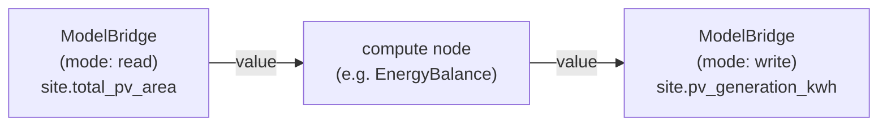

# ModelBridge

ModelBridge is a generic **bridge between a pipeline DAG and the model** (User Story #5866).
It is a pipeline *node* like Echo, but instead of computing anything it moves a single value
across the boundary between the graph and the model: in one direction it **reads** a Thing's
property into the DAG, in the other it **writes** a DAG value back onto a Thing.

It is deliberately generic — there is no per-domain code. The Thing and property it touches
are supplied as node params at seed-build time, so the same binary serves any read/write the
pipeline needs. `SERVICES.md` §1 and §16 introduce ModelBridge as one of the .NET
services and a pipeline node; this page is the canonical reference for how it behaves.

## The gap it fills

Phloem (the pipeline orchestrator, see [`SERVICES.md`](SERVICES.md) §16) assembles
each node's inputs from just two sources: **wires** from upstream nodes and the run's
**params**. There is no built-in path for a node to reach into the model — to read a property
off a Thing, or to write a computed result back. ModelBridge is that path, packaged as an
ordinary node so it composes over the same node→node wires every pipeline already uses. No
orchestrator change is required.

A common shape:



The read node pulls a value out of the model, a compute node transforms it, and the write
node persists the result back — all as plain wires.

## Ports

ModelBridge exposes one input and one output, both named `value` and typed `any`:

| Port | Direction | Used in |
|---|---|---|
| `value` | input | **write** mode — the value to persist |
| `value` | output | **read** mode (the value read) and **write** mode (the written value, echoed) |

## Node params — the contract

Every invocation is configured by three params carried in the node envelope's `params`:

| Param | Required | Meaning |
|---|---|---|
| `mode` | yes | `"read"` or `"write"` — chooses the direction. Any other value fails the node. |
| `thingId` | yes | GUID of the Thing to read from / write to. Baked in at seed-build time (deterministic under `--name`), so no runtime lookup is needed. |
| `property` | yes | Name of the property to read or write. |

A missing or malformed param fails the node cleanly (the throw becomes
`{ success: false, error: "…" }`), never an unhandled 500 — so Phloem records the failure and
halts dependents.

## `mode: "read"`

1. `GET {myceliumUrl}/api/things/{thingId}/properties` — the Thing's resolved properties, own plus inherited.
2. Find `property` on the returned object (case-insensitive).
3. Unwrap its `Value` envelope to a native value (number → `long`/`double`, string, bool, null;
   anything else passes through as JSON).
4. Emit it on the `value` **output**.

Because it reads **effective** properties, the value may be an inherited property or a
**roll-up** — a value computed live from an aggregate over related Things (e.g. total PV area
summed across everything that `is SolarArray`). ModelBridge needs no special handling for that;
it resolves as an ordinary effective property.

A roll-up can resolve to **null**. When a related Thing cannot contribute a number — its property is
missing, unreadable, or not a number — the model decides whether the roll-up skips that Thing or yields
no value at all, and yielding no value is the default. The property is still present, so this emits
`null` on the `value` output rather than failing.

A non-2xx response fails the node with an `HttpRequestException`; a property that isn't present
fails with `KeyNotFoundException`.

## `mode: "write"`

1. Read the value from the `value` **input** (required — missing input fails the node).
2. `POST {myceliumUrl}/api/things/{thingId}/properties/{property}/facts` with body `{ "value": … }`.
3. Echo the written value back on the `value` **output**, so a downstream node can chain off it.

The write is a **Fact** — structural, synchronous truth that survives replay — which is the
right kind for a computed result being committed to the model (see
[`SERVICES.md`](SERVICES.md) §15 for Facts vs Observations vs Sediment). The
target property's `AllowedWriteKinds` gating still applies: a property that only accepts
Observations returns 405, and an unknown thing/property returns 404 — both surface as an
`HttpRequestException` carrying the status code.

## Worked example — read a roll-up, compute, write back

Three nodes wired in series. The read and write nodes are both ModelBridge; only their params
differ.

**Read node** — pull the site's total PV area into the DAG:

```jsonc
// node params
{ "mode": "read", "thingId": "<site-guid>", "property": "total_pv_area" }
// → outputs { "value": 13842.0 }
```

**Compute node** — any node that consumes `value` and produces a `value` (e.g. a generation
estimate).

**Write node** — persist the computed figure back onto the site as a Fact:

```jsonc
// node params
{ "mode": "write", "thingId": "<site-guid>", "property": "pv_generation_kwh" }
// inputs { "value": 24917.6 }  ← wired from the compute node
// → POST /api/things/<site-guid>/properties/pv_generation_kwh/facts { "value": 24917.6 }
```

## CLI & registration

ModelBridge takes only the **standard six flags** — no service-specific args (see
[`SERVICES.md`](SERVICES.md) §4):

```bash
dotnet run -- --port=<port> --myceliumUrl=<url> \
  [--token=<jwt>] [--signingKey=<base64>] [--issuer=<iss>] [--audience=<aud>]
```

It registers with Mycelium as service name `ModelBridge`, start command `endpoint-service`.

## Source & tests

- Node logic: `vos.Service.ModelBridge/Services/ModelBridgeNode.cs`
  (a `DagNodeService` subclass — see [`SERVICES.md`](SERVICES.md) §16.2 for the
  node envelope and SDK base).
- Launch settings: `vos.Service.Shared/Configuration/ServiceLaunchSettings.cs` (shared).
- Mycelium client: `vos.Service.Shared/EndpointServiceMyceliumClient.cs` (shared).
- Tests: `Tests/vos.Service.ModelBridge.Tests/ModelBridgeNodeTests.cs`.
