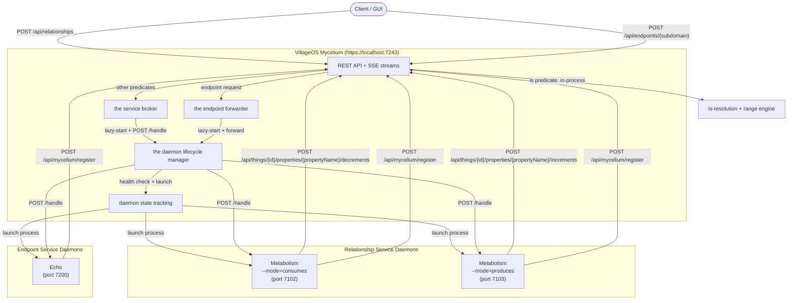

# VillageOS Relationship Services

## Overview

VillageOS supports **built-in predicates** with special semantics through a microservice handler architecture. When a relationship is created using a predicate that has a registered handler, Mycelium automatically launches (or contacts) a persistent daemon process that performs the predicate's custom behavior.

All handlers run as **daemon-mode** microservices -- persistent processes that stay alive across multiple relationship invocations. This eliminates per-request startup overhead and enables continuous operations like resource simulation. Mycelium manages the full daemon lifecycle: lazy startup on first use, health monitoring, and graceful shutdown.

The **active** relationship services currently in the seed are:

| Predicate | Handler | Behavior |
|-----------|---------|----------|
| `consumes` | `vos.Service.Metabolism --mode=consumes` | Continuous resource decrement simulation |
| `produces` | `vos.Service.Metabolism --mode=produces` | Continuous resource increment simulation |

> **Built-in: `is`.** Type inheritance (property + range **resolution**) is handled in-process by Mycelium, not by a microservice. See [Built-in `is` inheritance](#built-in-is-inheritance) below. Previously this was a microservice (`vos.Service.IsHandler`); the round-trip added latency and complexity for what is purely an in-memory graph operation, so it was inlined.

Additionally, VillageOS has **passive (structural) predicates** that have no handler daemon:

| Predicate | Behavior |
|-----------|----------|
| `contains` | Structural containment (e.g., IfcBuilding contains IfcStorey). No handler — relationships are purely structural. Used by the GUI to discover child elements for 3D rendering |
| `aggregates` | Structural aggregation (e.g., IfcSite aggregates IfcBuilding). Same as `contains` — no handler, purely structural |

Passive predicates are created as regular predicate things without `ExecutablePath` or `ServicePort` properties. They participate in graph queries and GUI rendering but do not trigger any microservice behavior.

### PlatformServiceConnection / Service model

A dispatched predicate is a **PlatformServiceConnection** that **has** a **Service**; the Service carries the launch config. Both are ordinary model Things related by the generic `is`/`has` predicates — Mycelium resolves them by walking the `is`-chain and never hardcodes type names (the archetype names come from config: `PrototypeConnectionThingName` / `PrototypeServiceThingName`).

```text
PlatformServiceConnection {trigger}                        ← archetype: a routed connection (graph, http, or state)
  ← is ─ consumes {trigger: graph} ─has→ consumes service ─is→ Metabolism prototype
  ← is ─ produces {trigger: graph} ─has→ produces service ─is→ Metabolism prototype

Service {ExecutablePath, ServicePort, ServiceArgs, AutoStart, RunMode, TokenScope}  ← archetype: the process
  ← is ─ Metabolism prototype {ExecutablePath, RunMode, TokenScope}   ← shared definition (one binary)
            ← is ─ consumes service {ServicePort, ServiceArgs, AutoStart}   ← per-instance overrides
            ← is ─ produces service {ServicePort, ServiceArgs, AutoStart}

is                                          ← built-in; in-process, not a PlatformServiceConnection
has, feeds, powers, ...                     ← passive predicates (not PlatformServiceConnections)
```

- **PlatformServiceConnection** (archetype): a Thing that routes to a service. `trigger` is `graph` (a predicate, fired when a relationship is created), `http` (a subdomain, reached via `POST /api/endpoints/{subdomain}`), or `state` (fired when a Thing enters a state: the connection carries a `state` property naming the range and an edge to the watched archetype whose predicate has the `__IsStateWatchPredicate` flag; subtypes inherit the trigger through the `is` chain). A dispatched predicate like `consumes` `is PlatformServiceConnection`.
- **Service** (archetype): the microservice process. Carries `ExecutablePath`, `ServicePort`, `ServiceArgs`, `AutoStart` (was `onLoad`), `RunMode`, and `TokenScope`.
- **Shared prototype** (e.g. `Metabolism prototype`): a Service holding one binary's shared values (`ExecutablePath`, `RunMode`, `TokenScope`); concrete services `is` it and override only per-instance values (`ServicePort`, `ServiceArgs`, `AutoStart`). So `consumes` and `produces` share one binary definition but bind two distinct services.
- **PlatformServiceConnection `has` Service**: the generic `has` relation; the service is identified as the related Thing that is (transitively) a `Service`, never by predicate name.
- **Built-in `is`**: in-process (Mycelium's `is`-inheritance + the range engine); not a PlatformServiceConnection.
- **Passive predicates** (`contains`, `aggregates`, `has`, …): not PlatformServiceConnections; no service.

At seed load, Mycelium discovers connections by transitive `is`-membership of the `PlatformServiceConnection` archetype and registers graph connections whose bound Service has `AutoStart: true` for auto-invocation. At runtime, the service broker resolves the bound Service to build the daemon config (including `TokenScope`).

---

## Architecture

### System Diagram



### How Relationship Services Work

1. **PlatformServiceConnection + Service definition**: A dispatched predicate `is PlatformServiceConnection` (`trigger: graph`) and `has` a Service Thing carrying the handler configuration properties (typically inherited from a shared prototype):
   - `ExecutablePath` -- path to the handler executable (`.dll` files are run via `dotnet`)
   - `ServicePort` -- port for the daemon to listen on
   - `ServiceArgs` -- extra CLI arguments (e.g., `--mode=consumes`) passed verbatim to the daemon.
   - `RunMode` -- execution mode (only `"daemon"` is supported; defaults to `"daemon"` if unset)
   - `TokenScope` -- the scope minted into the handler's service JWT (defaults to `"{connectionName}:*"`)
   - `AutoStart` -- boolean (default `false`). When `true`, Mycelium registers the handler at seed load and invokes it for all existing relationships using this connection. When `false` or absent, the handler is invoked lazily when new relationships are created at runtime

2. **Lazy Startup**: When a relationship using a handler predicate is created, the service broker delegates to the shared daemon lifecycle manager:
   - Attempts to POST to the daemon's `/handle` endpoint
   - If connection is refused, launches the daemon process automatically
   - Polls the `/health` endpoint with exponential backoff until healthy
   - Retries the original `/handle` call once the daemon is ready

3. **Handler Invocation**: Mycelium POSTs to `/handle` with relationship details:

   ```json
   {
     "relationshipId": "guid",
     "subjectId": "guid",
     "targetId": "guid",
     "subjectName": "Chemistry-Test-Run-1",
     "targetName": "Reagent-Lot-A",
     "properties": { "quantity": 0.01, "unit": "kWh", "frequencySeconds": 30 }
   }
   ```

   The `properties` field contains the relationship's `OwnProperties` so the handler does not need to call back to Mycelium during initial processing.

   When the relationship arrives inside a `POST /api/model/fragment` batch, invocation happens only after the whole fragment is applied — every Thing, edge, and property value in the batch is readable, and roll-ups are recomputed — and multiple handled edges in one fragment are dispatched in creation order. A handler never observes a half-applied fragment.

4. **Registration**: Handlers register with Mycelium on startup and deregister on shutdown. The register / deregister / health-monitoring lifecycle (payloads, health-status state machine, auto-deregistration, error scenarios) is the same for all microservices and is documented authoritatively in the broker's service registration & lifecycle flow (private Mycelium docs) — not repeated here.

### Handler startup context

`ServiceArgs` carries plain CLI flags (e.g. `--mode=consumes`) passed verbatim to the daemon.
A handler obtains the objects it operates on by **subscribing** — snapshot + live SSE stream
(see [`SERVICE_CONTRACT.md`](SERVICE_CONTRACT.md) § Subscriptions) — rather than receiving resolved IDs
at launch. (An earlier `{{…}}` template mechanism for injecting startup IDs was never adopted
and was removed once subscriptions superseded it.)

> **Handler lifecycle internals** — how Mycelium supervises the daemon and invokes the handler
> per relationship — live in the private Mycelium guide (broker internals).

## Built-in `is` inheritance

The `is` predicate is VillageOS's type system. Linking a thing to a type with an `is` relationship copies **nothing**: inheritance is **resolved on read** by walking the `is` chain in-process. No daemon, no HTTP round-trip, and nothing duplicated in memory or on disk.

### How it resolves

- **Inherited properties are live defaults.** An inherited property the instance hasn't set resolves, on read, to the type's *current* value. Change a value on the type and every instance that hasn't set its own sees the new value immediately — there is nothing to re-copy.
- **The first write makes a per-instance override.** When an instance sets a value for an inherited property, VillageOS records a per-instance copy (an *override*) on that instance and leaves the type untouched. Reads then return the override; the type's default still flows to every other instance. This is **write isolation** — one instance can never change the value another instance sees.
- **Ranges resolve the same way.** A type's ranges apply to its instances by walking the `is` chain at evaluation time; they are not stored on the instance. When an inherited value changes, the affected ranges re-evaluate.
- **Transitive.** Resolution follows the whole chain (`Dog is Mammal is Animal`), and type-membership tests walk it too.
- **Classification.** The GUI uses `is` relationships to determine node types and colors.

### Reading properties: own, inherited, effective

Every property a thing exposes falls into one view. To a consumer a thing simply **has properties** — the distinction is provenance carried on each one, not a separate list:

- **Own** — stored directly on the thing.
- **Inherited** — resolved from an ancestor via the `is` chain; a live default the thing never set.
- **Override** — an inherited *name* the thing set its own value for. On read it wins and reads back as own; write isolation keeps the ancestor's default flowing to every other instance.
- **Effective** — the resolved set a read returns: own + inherited, own/overrides winning. This is what a consumer should read.

Two endpoints serve the resolved (effective) view. Both tag each property with `IsInherited` and `InheritedFrom` (the source id), and key inherited properties by qualified path (`Home.energy_rating`) so the lineage is visible:

| Endpoint | Scope | Use |
|----------|-------|-----|
| `GET /api/things/{id}/properties` | one thing | a selected thing's full resolved view (e.g. a detail panel) |
| `GET /api/things/properties?scope={effective\|own\|inherited}` | all things, one call | bulk read-only surfaces (property search) that need the full inherited view without a request per thing. `effective` (default) includes overrides as the winning value. Add `?ids=` with a comma-separated list to narrow the answer to those things. |

Do **not** reconstruct the effective view from a thing's raw stored own + overrides — that misses inherited defaults the instance never set. Read it from these endpoints, which resolve the `is` chain server-side.

`?ids=` pairs with a narrowed model load: a client that asked `GET /api/things` for only the properties it draws with fills in the rest for the things it is actually showing, rather than re-reading the whole model. An identifier matching no thing is absent from the answer rather than failing the call — the set usually comes from a selection, and one deleted thing should not lose the others.

### Naming rules (checked on write)

A name resolves to one property, so a few rules keep resolution unambiguous. A live API write that would break one is rejected:

- A property name may contain **letters, digits and underscore only**. Every other character is read as structure by the criteria language, so a name containing one would be stored where no criteria, roll-up or reference path could name it. A dot is the sharpest case: it separates the parts of a qualified `Type.property` path, so a dotted name and a dotted path would be indistinguishable. Producers that build a name out of source data (the IFC importer, for one) sanitize it — `Dimensions` + `Area` is stored as `Dimensions_Area`.
- A thing may not **own** a property whose name it already **inherits** — set a value instead, which creates an override.
- Establishing `is` may not pull in an inherited property whose name the thing already owns.
- A property name may not equal the name of a type it inherits from (that would make a qualified `Type.property` path ambiguous).

### Example

```text
Patient-123 --[is]--> MalePatient-Type
```

- `Patient-123` immediately resolves `MalePatient-Type`'s property values and ranges — no copy is made.
- Setting a value on `Patient-123` for one of those properties stores an override on `Patient-123`; `MalePatient-Type` is unchanged, and its default still reaches every other patient.
- `Patient-123`'s ranges evaluate against its resolved values and re-evaluate when those values change.
- `Patient-123` is classified as `MalePatient-Type` in the GUI.

### Predicate configuration

```json
{ "Name": "is", "Properties": {} }
```

No `ExecutablePath` or `ServicePort` — `is` is a plain thing; Mycelium recognizes its name and resolves inheritance in-process.

### Seed load

A seed stores only **overrides** in each thing's inherited-property set; unset defaults resolve through the `is` chain at read time. Loading a seed therefore wires the `is` relationships and applies any overrides — it does not copy defaults onto instances, and ranges likewise resolve from the chain.

---

## `consumes` / `produces` Handlers -- Resource Simulation

**Location**: `vos.Service.Metabolism/` in the **VillageOS-API** repo (unified handler). Implementation details live in that repo's `docs/METABOLISM.md`.
**Default Ports**: 7102 (`consumes`), 7103 (`produces`)

Both `consumes` and `produces` are handled by a single `Metabolism` binary, differentiated by the `--mode=consumes` or `--mode=produces` CLI argument. The predicate thing's `ServiceArgs` property passes this mode to Mycelium, which appends it when launching the daemon.

### Built-in Behaviors

- **Continuous Simulation**: Registers relationships for ongoing resource flow (not one-shot)
- **Configurable Frequency**: Each relationship ticks at its own interval
- **Staggered Startup**: Initial ticks are offset by `(registrationOrder * 200ms) + random(0..500ms)` to prevent thundering herd
- **Mode-based Operation**: `consumes` mode calls `decrement-quantity`, `produces` mode calls `increment-quantity`
- **Per-relationship Tracking**: Each tick also increments `total_consumed` or `total_produced` on the relationship itself. Increments are durable, exactly-once `PropertyValueAsserted` Facts (applied under the commit lock), so the running total survives restart and never loses a tick — see [Write model: everything is a Fact](#write-model-everything-is-a-fact).

### Relationship Properties

| Property | Type | Default | Description |
|----------|------|---------|-------------|
| `quantity` | number | 1.0 | Amount per tick |
| `propertyPath` | string | `"quantity"` | Property path to modify on the target |
| `unit` | string | `""` | Unit label for logging |
| `frequencySeconds` | number | 60 | Seconds between ticks |
| `startDelaySeconds` | number | 0 | Initial delay in seconds before `startUtc` is considered. The first tick will not fire until this delay has elapsed |
| `startUtc` | string (ISO 8601) | now | When to begin simulation (evaluated after `startDelaySeconds`) |
| `endUtc` | string (ISO 8601) | 2099-12-31 | When to stop simulation |

> **Typed envelopes in seed files**: When defining metabolism properties in seed JSON, numeric properties (`quantity`, `frequencySeconds`, `startDelaySeconds`, `reorder_point`) **must** use typed envelopes: `{"typeInfo": "vos.Decimal", "value": 5.0}`. Plain numeric values are stored as `vos.Integer`, which truncates decimal increments to 0.

### PlatformServiceConnection + Service Configuration

Each dispatched predicate is a graph `PlatformServiceConnection` that `has` a `Service`; the Service `is` a shared
prototype carrying the binary. The predicate Things hold only `trigger`:

```json
{ "Name": "consumes", "Properties": { "trigger": "graph" } }
{ "Name": "produces", "Properties": { "trigger": "graph" } }
```

One shared prototype carries the binary + token scope (both services `is` it):

```json
{
  "Name": "Metabolism prototype",
  "Properties": {
    "ExecutablePath": "../vos.Service.Metabolism/bin/Debug/net10.0/vos.Service.Metabolism.dll",
    "RunMode": "daemon",
    "TokenScope": "metabolism:quantity,read"
  }
}
```

Each concrete service holds only per-instance overrides:

```json
{ "Name": "consumes service", "Properties": { "ServicePort": 7102, "ServiceArgs": "--mode=consumes", "AutoStart": true } }
{ "Name": "produces service", "Properties": { "ServicePort": 7103, "ServiceArgs": "--mode=produces", "AutoStart": true } }
```

Relationships wire them (per predicate): `consumes is PlatformServiceConnection`, `consumes has "consumes service"`,
`"consumes service" is "Metabolism prototype"`, `"Metabolism prototype" is Service`. `tools/seed-migrate`
produces exactly this shape from the old format.

### Metabolism

The `Metabolism` class manages all active simulation loops using a `ConcurrentDictionary<string, SimulationEntry>`. Each registered relationship gets its own async loop:

1. **Start delay**: If `startDelaySeconds > 0`, the loop waits for that duration first (status: `delayed`). No ticks fire during this phase
2. **Wait for start time**: After the delay, if `startUtc` is still in the future, the loop delays until then (status: `waiting`)
3. **Stagger initial tick**: If `startUtc` is already past, waits `(order * 200ms) + jitter` to prevent all simulations from firing simultaneously
4. **Tick loop**: Calls `MyceliumClient.ApplyQuantityAsync()` at the configured frequency (status: `active`)
5. **Completion**: Loop exits when `endUtc` is reached or the simulation is cancelled
6. **Re-registration**: If a relationship is registered again, the previous simulation is cancelled and replaced

Simulation states: `delayed` -> `waiting` -> `active` -> `completed` (or `cancelled`). The `delayed` state is skipped when `startDelaySeconds` is 0.

### Live Configuration Hot-Reload via SSE

The Metabolism service subscribes to Mycelium's model-change SSE stream
(`GET /api/subscriptions/{id}/stream`) for `RelationshipPropertyChanged` events — via
`MetabolismSubscriptionService`, built on the shared `Subscriptions.SubscriptionClient`. This enables
**live hot-reload of simulation parameters** without restarting the handler:

1. **Connection**: the client opens an SSE subscription with `Authorization: Bearer` auth and automatic reconnection, resuming via `Last-Event-ID` so no change is missed across drops
2. **Event subscription**: listens for `RelationshipPropertyChanged(relId, propertyName, newValue)` and raises a C# event
3. **Metabolism integration**: the engine subscribes to the event and updates running simulation loops when `quantity`, `frequencySeconds`, `startDelaySeconds`, `unit`, or `propertyPath` changes
4. **User workflow**: change a relationship property in the GUI (e.g., increase `frequencySeconds` from 30 to 60) → the handler picks up the change in real-time and adjusts the tick interval

The SSE subscription is independent of handler registration — if registration fails (e.g., Mycelium temporarily unreachable), the stream connection retries separately.

### Handler Endpoints

| Endpoint | Method | Description |
|----------|--------|-------------|
| `/handle` | POST | Register a relationship for continuous simulation |
| `/simulations` | GET | List all simulations with tick counts and status |
| `/simulations/{relationshipId}` | DELETE | Cancel a specific simulation |
| `/health` | GET | Health check with active/total simulation counts |
| `/stats` | GET | Service statistics |
| `/shutdown` | POST | Stop all simulations, deregister, and exit |

### Example

```text
Home-1 --[consumes quantity=0.01, frequencySeconds=30]--> VillageElectricityPool
```

When this relationship is registered:

1. Handler registers it as a continuous simulation
2. Every 30 seconds, decrements `VillageElectricityPool.quantity` by 0.01
3. Simultaneously increments `total_consumed` on the relationship itself
4. Simulation runs until `endUtc` or handler shutdown

---

## Usage Example: Laboratory Workflow Simulation

> **Note on predicate config.** The walkthrough below puts `ExecutablePath`/`ServicePort` directly on the predicate to keep the focus on relationship mechanics. Current seeds instead give the predicate only `trigger` and put the launch config on a bound **Service** — see [PlatformServiceConnection + Service Configuration](#platformserviceconnection--service-configuration) for the shape to use in real seeds.

### Setup

1. **Create Predicate Things**:

```json
POST https://localhost:7243/api/things
{
  "Name": "consumes",
  "Properties": {
    "ExecutablePath": "vos.Service.Metabolism",
    "ServicePort": 7102,
    "ServiceArgs": "--mode=consumes"
  }
}

POST https://localhost:7243/api/things
{
  "Name": "produces",
  "Properties": {
    "ExecutablePath": "vos.Service.Metabolism",
    "ServicePort": 7103,
    "ServiceArgs": "--mode=produces"
  }
}
```

1. **Create Resource Things**:

```json
POST https://localhost:7243/api/things
{
  "Name": "Reagent-Lot-A",
  "Properties": {
    "quantity": 1000.0,
    "unit": "mL",
    "lotNumber": "LOT-2024-001"
  }
}

POST https://localhost:7243/api/things
{
  "Name": "Plasma-Sample-Pool",
  "Properties": {
    "quantity": 0.0,
    "unit": "mL"
  }
}
```

1. **Create Process Things**:

```json
POST https://localhost:7243/api/things
{
  "Name": "Chemistry-Test-Run-1"
}

POST https://localhost:7243/api/things
{
  "Name": "Centrifuge-Process-1"
}
```

### Workflow Execution

1. **Test consumes reagent**:

```json
POST https://localhost:7243/api/relationships
{
  "SubjectId": "{Chemistry-Test-Run-1-Id}",
  "PredicateId": "{consumes-predicate-Id}",
  "TargetId": "{Reagent-Lot-A-Id}",
  "Properties": {
    "quantity": 5.0
  }
}
```

**Result**: `Reagent-Lot-A.quantity` decrements by 5.0 every 60 seconds (default frequency)

1. **Process produces plasma**:

```json
POST https://localhost:7243/api/relationships
{
  "SubjectId": "{Centrifuge-Process-1-Id}",
  "PredicateId": "{produces-predicate-Id}",
  "TargetId": "{Plasma-Sample-Pool-Id}",
  "Properties": {
    "quantity": 3.5
  }
}
```

**Result**: `Plasma-Sample-Pool.quantity` increments by 3.5 every 60 seconds (default frequency)

### Query Results

```bash
GET https://localhost:7243/api/things/{Reagent-Lot-A-Id}
# Returns: { "quantity": 995.0, ... }

GET https://localhost:7243/api/things/{Plasma-Sample-Pool-Id}
# Returns: { "quantity": 3.5, ... }
```

---

## Integration with Ranges / Expected Values

Predicate handlers enable powerful range definitions for simulation monitoring. Ranges evaluate criteria across the graph, and handler-modified properties participate in those evaluations automatically.

### Low Reagent Alert

```json
{
  "Name": "Low Reagent Alert",
  "Criteria": "[reagent].quantity < [reagent].reorder_point"
}
```

Creates an alert state when consumable quantities drop below reorder thresholds.

### Process Ready Check

```json
{
  "Name": "Process Ready",
  "Criteria": "ALL([process]--[consumes]-->[resource]).quantity >= required_qty"
}
```

Validates all required resources are available before starting a process.

### Quality Inheritance

```json
{
  "Name": "Derived Quality Failure",
  "Criteria": "ANY([product]--[derived_from]-->[material]).quality_flag == 'defective'"
}
```

Propagates quality issues through production chains.

### Two-phase Evaluation

VillageOS's evaluation engine runs in two phases:

1. **Phase 1** -- Range criteria evaluate to equilibrium, producing states
2. **Phase 2** -- Binding guards evaluate, referencing states from Phase 1

This prevents circular dependencies: a binding guard can reference a state produced by a range, but ranges cannot reference binding results.

---

## Adding New Relationship Services

Relationship behaviors are a **platform extension point**, not a fixed set. This section explains the platform-side machinery — why it exists and how Mycelium dispatches to a handler. For the actual handler **authoring contract** (project layout, required endpoints, `MyceliumClient`, startup registration), see the API repo's SERVICE_AUTHORING.md:

- **DevOps:** <https://dev.azure.com/ReGenVillages/VillageOS-API/_git/VillageOS-API?path=/docs/SERVICE_AUTHORING.md>
- **Wiki:** <https://dev.azure.com/ReGenVillages/VillageOS-API/_wiki/wikis/VillageOS-API-Wiki?pagePath=%2FServices%2FAuthoring>

### Why the handled-predicate machinery exists

`is` is the only predicate whose semantics are built into Mycelium in-process (see [Built-in `is` inheritance](#built-in-is-inheritance)). Every other behaving predicate is a **plug-in**: its semantics live in an out-of-process microservice that Mycelium discovers and dispatches to. This keeps the platform core minimal — Mycelium owns the graph, the registry, and the dispatch contract, while domain behavior (resource simulation, future predicates) ships independently as daemons. Adding a behavior is therefore a matter of authoring a handler and declaring a predicate that points at it; no change to Mycelium itself is required.

### How the platform dispatches to a handler

The platform side of adding a relationship service is purely declarative — you register the behavior with the graph, and Mycelium does the rest:

1. **Declare the connection + service.** Create a predicate that `is PlatformServiceConnection` (`trigger: graph`) and `has` a Service Thing carrying the handler configuration (`ExecutablePath`, `ServicePort`, optional `ServiceArgs`, `TokenScope`, `AutoStart`) — typically inherited from a shared prototype. See [How Relationship Services Work](#how-relationship-services-work) for each property's meaning. This is the entire contract the platform needs in order to find and launch the handler.
2. **Discovery.** At seed load, Mycelium discovers connections by walking the `is`-chain and registers them with the service broker; those whose Service has `AutoStart: true` are invoked for existing relationships immediately.
3. **Dispatch.** When a relationship using the predicate is created, the service broker delegates to the shared daemon lifecycle manager, which lazily launches the daemon (if needed), waits for health, and POSTs the relationship to the handler's `/handle` endpoint. (The daemon register/deregister/health lifecycle is documented in the broker's service-lifecycle flow — see the note below.)

The handler's own obligations — implementing `/handle`, `/health`, `/shutdown`, and the register/deregister handshake — are the authoring contract documented in the API repo's SERVICE_AUTHORING.md linked above. The register/deregister/health lifecycle itself is documented in the broker's service registration & lifecycle flow (private Mycelium docs).

---

## Mycelium API for Handlers

### Authentication

All handler-to-Mycelium communication authenticates with a short-lived JWT:

```csharp
// Fetch a short-lived JWT (5 min)
var request = new HttpRequestMessage(HttpMethod.Post, $"{myceliumUrl}/api/auth/token");
var token = /* extract .token from response */;
client.DefaultRequestHeaders.Authorization = new AuthenticationHeaderValue("Bearer", token);
```

Mycelium-launched daemons receive a pre-minted service JWT directly via the `--token` CLI argument, so they can authenticate immediately without a token-exchange step. Manually-started services that omit `--token` fetch a JWT via `POST /api/auth/token`. In both cases, JWTs are short-lived (5 minutes), cached for 4 minutes, and refreshed automatically.

### Available Endpoints

| Endpoint | Method | Purpose |
|----------|--------|---------|
| `https://localhost:7243/api/auth/token` | POST | Fetch a short-lived JWT |
| `https://localhost:7243/api/things/{id}` | GET | Get thing with all properties |
| `https://localhost:7243/api/things/{id}/properties/{propertyName}/increments` | POST | Increment numeric property (used by `produces`) |
| `https://localhost:7243/api/things/{id}/properties/{propertyName}/decrements` | POST | Decrement numeric property (used by `consumes`) |
| `https://localhost:7243/api/things/{id}/properties/by-path/{path}` | GET | Get property by path |
| `https://localhost:7243/api/relationships/{id}/properties/{propertyName}/increments` | POST | Increment a relationship property |
| `https://localhost:7243/api/mycelium/register` | POST | Register handler with Mycelium |
| `https://localhost:7243/api/mycelium/services/{handlerId}` | DELETE | Deregister handler |

### Quantity Endpoint Payload

Both `increment-quantity` and `decrement-quantity` accept:

```json
{
  "amount": 5.0,
  "subjectName": "Chemistry-Test-Run-1",
  "unit": "mL"
}
```

The property path is carried in the URL (`.../properties/{propertyName}/{increments|decrements}`), not the body.

---

## Write model: everything is a Fact

Every model mutation is a durable, sequenced **Fact** in the per-tenant Commit Log — there are no ephemeral in-memory writes. This is what lets a handler's effects (and the rest of the model) survive a Mycelium restart and lets the snapshot/stream subscription replay deterministically.

| Mutation | Fact | Notes |
|----------|------|-------|
| Create / delete thing or relationship | `EntityCreated` / `RelationshipCreated` / `…Retracted` | via the commit coordinator |
| Set / add a property (thing or relationship) | `PropertyValueAsserted` | absolute value; replay applies the latest |
| **Increment / decrement** (`produces` / `consumes`, `total_*`) | `PropertyValueAsserted` (absolute) | **exactly-once**: the read-modify-write runs under the commit lock, so concurrent ticks never lose an update; a decrement that would go negative is rejected *before* any record is written |
| Retract a property | `PropertyValueRetracted` | |
| Add / remove a range | `RangeCreated` / `RangeRetracted` | thing or relationship |
| Clear the model | `ModelCleared` | replay drops all things/relationships |

On replay, the model's current value for a property is reconstructed from the **latest** `PropertyValueAsserted` for it, so a stream of increment Facts sums to the correct total. Observations remain a separate, deliberately lossy/coalesced telemetry channel (sampled values; history-only, not replayed into authoritative state) — never used for cumulative deltas. See the persistence design in the platform architecture notes (private).

---

## Debugging and Troubleshooting

### Log Files

Handlers write to daily rolling log files in the project root's `logs/` directory:

- `consumes` handler: `logs/metabolism-consumes-YYYYMMDD.log`
- `produces` handler: `logs/metabolism-produces-YYYYMMDD.log`

`is` runs in-process inside Mycelium, so its diagnostics appear in Mycelium's own log stream rather than a separate handler log.

Log format: `{Timestamp} [{Level}] [{SourceContext}] {Message}`

### Manual Startup

Normally Mycelium auto-starts handler daemons via the daemon lifecycle manager. For development and debugging you can start them manually from the command line.

#### CLI Arguments

| Argument | Required | Description |
|----------|----------|-------------|
| `--port=<port>` | Yes | Port for the service to listen on |
| `--myceliumUrl=<url>` | Yes | URL of the VillageOS Mycelium (e.g., `https://localhost:7243`) |
| `--token=<jwt>` | No | Service JWT for authenticating outbound requests to Mycelium. If omitted, the service attempts to fetch one via `POST /api/auth/token` |
| `--signingKey=<base64>` | No | Base64-encoded Mycelium signing key. Enables the service to validate inbound requests from Mycelium (the `/handle` calls). If omitted, inbound auth is disabled |
| `--mode=<mode>` | Metabolism only | `consumes` or `produces` |

#### Obtaining `--signingKey`

Mycelium's signing key is stored in `data/vos-signing-key.json`. The `--signingKey` argument expects the key value encoded as base64 of its UTF-8 bytes:

```bash
# Read the raw key from Mycelium's key file
KEY=$(python3 -c "import json; print(json.load(open('data/vos-signing-key.json'))['Key'])")

# Base64-encode it (this is what --signingKey expects)
SIGNING_KEY=$(echo -n "$KEY" | base64)
```

If Mycelium uses the `Jwt__Key` environment variable or `Jwt:Key` in appsettings instead of the key file, use that value.

#### Obtaining `--token`

**Option A — Omit it.** The service will call `POST /api/auth/token` on Mycelium at startup to fetch a JWT.

**Option B — Fetch a JWT manually:**

```bash
TOKEN=$(curl -s -X POST "https://localhost:7243/api/auth/token" \
  | python3 -c "import sys,json; print(json.load(sys.stdin)['token'])")
```

#### Example: Start Metabolism (consumes)

```bash
dotnet run --project vos.Service.Metabolism -- \
  --port=7102 \
  --myceliumUrl=https://localhost:7243 \
  --mode=consumes \
  --token=$TOKEN \
  --signingKey=$SIGNING_KEY
```

#### Example: Start Metabolism (produces)

```bash
dotnet run --project vos.Service.Metabolism -- \
  --port=7103 \
  --myceliumUrl=https://localhost:7243 \
  --mode=produces \
  --token=$TOKEN \
  --signingKey=$SIGNING_KEY
```

#### Example: Start Echo Endpoint Service

```bash
dotnet run --project vos.Service.CSharp.Echo -- \
  --port=7200 \
  --myceliumUrl=https://localhost:7243 \
  --token=$TOKEN \
  --signingKey=$SIGNING_KEY
```

#### Quick Development Start (minimal auth)

For local development where security is not a concern, you can start with just the required arguments. The service will attempt to bootstrap authentication automatically:

```bash
dotnet run --project vos.Service.Metabolism -- \
  --port=7102 --myceliumUrl=https://localhost:7243 --mode=consumes
```

### Manual Testing

1. **Check health**:

   ```bash
   curl http://localhost:7102/health
   # {"status":"Healthy","service":"Metabolism-consumes","requestsProcessed":0,"activeSimulations":0,"totalSimulations":0,"uptime":"active"}
   ```

2. **List active simulations** (Metabolism):

   ```bash
   curl http://localhost:7102/simulations
   ```

3. **Cancel a simulation** (Metabolism):

   ```bash
   curl -X DELETE http://localhost:7102/simulations/{relationshipId}
   ```

### Common Issues

| Problem | Cause | Fix |
|---------|-------|-----|
| Handler not starting | Missing `ExecutablePath` or `ServicePort` on predicate thing | Add required properties to the predicate |
| "Connection refused" in Mycelium logs | Daemon not running and auto-start failed | Check `ExecutablePath` is correct; check `logs/` for startup errors |
| Daemon enters cooldown | 3+ consecutive startup failures | Wait 5 minutes or restart Mycelium; check handler logs |
| Simulations not ticking | `startUtc` is in the future | Check the relationship's `startUtc` property |
| Simulation stuck in "delayed" | `startDelaySeconds` is set | Wait for the delay to elapse, or set `startDelaySeconds` to 0 |
| Inherited property not resolving | The `is` relationship isn't wired | Check both subject and target things exist and the `is` relationship was created; check the Mycelium log for range-evaluation errors |
| Status events missing | daemon status events not firing | Ensure the client is connected to `GET /api/events/stream` (system-events SSE) and the system-events SSE stream is wired up |
| Daemon hangs on startup | `Console.WriteLine` fills stdout pipe buffer | Mycelium does **not** redirect stdout (`RedirectStandardOutput = false`), so handler console output goes directly to Mycelium's own console (or nowhere if Mycelium has no visible console). This means `Console.WriteLine` won't cause pipe-buffer hangs, but the output may be lost. **Use file-based logging only (Serilog `WriteTo.File`) for reliable diagnostics** |

### Verifying Daemon State

Mycelium tracks daemon state internally via its daemon state tracking. Key fields per daemon:

- `Process` -- reference to the OS process (null for external daemons)
- `Port` -- the port the daemon listens on
- `IsExternal` -- true if the daemon was already running when Mycelium first contacted it
- `ConsecutiveFailures` -- failure count for cooldown logic
- `LastContactTime` -- last successful health check or handle response

---

## Performance Considerations

1. **Daemon Mode**: All handlers run as persistent daemons -- no per-request process startup overhead
2. **Async Invocation**: Relationship creation returns immediately; the handler runs in the background
3. **Health Check Timeout**: Initial health probe uses 1-second timeout to quickly detect running daemons
4. **Connection Pooling**: Handlers use `IHttpClientFactory` for efficient HTTP connection reuse
5. **Staggered Simulation Ticks**: Resource handlers offset initial ticks by `(order * 200ms) + jitter` to spread load
6. **Concurrent Dictionary**: `Metabolism` uses `ConcurrentDictionary` for thread-safe simulation management

---

## Security

1. **Bidirectional Auth**: Handler → Mycelium uses a short-lived JWT (pre-minted `--token` or fetched via `POST /api/auth/token`); Mycelium → handler signs each `/handle` call with a short-lived, model-scoped service JWT carrying the request's `vos:model_id`, validated via `vos.Auth.Shared`
2. **Short-lived JWTs**: Handlers authenticate with 5-minute JWTs, cached for 4 minutes and refreshed automatically
3. **Per-request model scope**: Mycelium signs each `/handle` call with a 5-minute service JWT carrying the requesting user's `vos:model_id`. The handler reuses this inbound token for its callbacks into Mycelium (via the shared `UseMyceliumRequestToken` middleware), so a daemon shared by several models acts on the model of the current request — never the model that first launched it. The `--token` startup JWT is used only for the daemon's own registration/deregistration.
4. **Localhost Only**: Handlers bind to `http://localhost:{port}` (not exposed externally)
5. **Mycelium Control**: Only Mycelium can launch and stop handler daemons
6. **No Direct Access**: GUI and external users cannot call handler endpoints directly
7. **Startup Lock**: `SemaphoreSlim` prevents race conditions during concurrent daemon startup

---

## Future Predicate Ideas

### Temporal Predicates

- **`supersedes`**: Versioning/replacement with automatic temporal validity
- **`snapshot_of`**: Point-in-time immutable copy

### Structural Predicates

- **`contains`** and **`aggregates`** already exist as passive predicates (see above)
- **`part_of`**: Transitive composition with automatic aggregation
- **`depends_on`**: Dependency tracking with cycle detection
- **`connects`**: Port/flow connectivity (IFC: `IfcRelConnectsPortToElement`)

### Access Control Predicates

- **`can_access`**: Permission propagation (transitive)
- **`delegates_to`**: Authority transfer

### Constraint Predicates

- **`requires`**: Mandatory relationship validation
- **`excludes`**: Mutual exclusion enforcement

---

## Summary

Built-in relationship services give VillageOS powerful semantic capabilities:

- **Type System** (`is`): Runtime inheritance and classification with serialized state
- **Resource Management** (`consumes`, `produces`): Continuous inventory tracking via unified Metabolism service
- **Extensibility**: New predicates follow a clear pattern -- implement `/handle`, `/health`, `/shutdown`
- **Temporal Simulation**: Track resource flows through time with per-relationship cumulative totals
- **Integration**: Works seamlessly with ranges, bindings, and temporal queries

This architecture makes VillageOS ideal for:

- Laboratory workflow simulation
- Supply chain modeling
- Manufacturing process tracking
- Clinical data provenance
- Any domain requiring resource flow semantics
