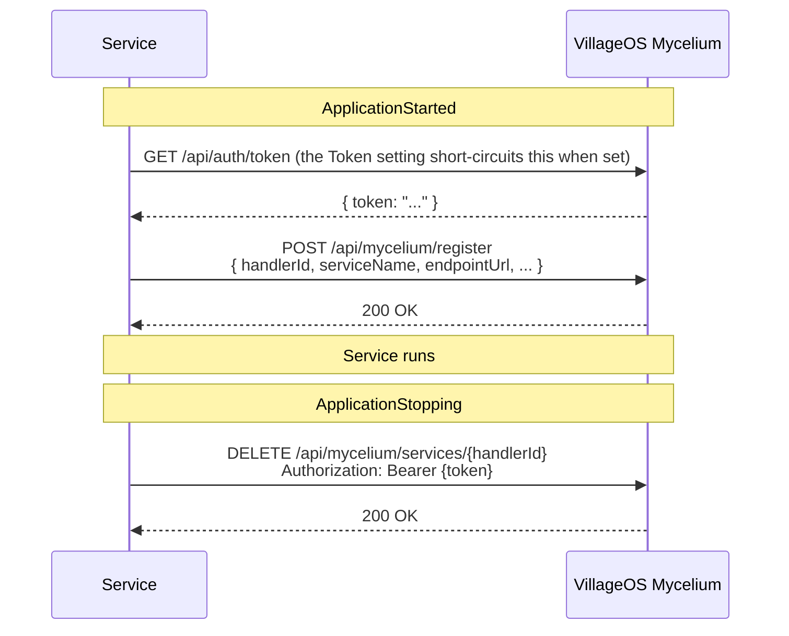
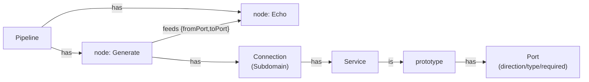
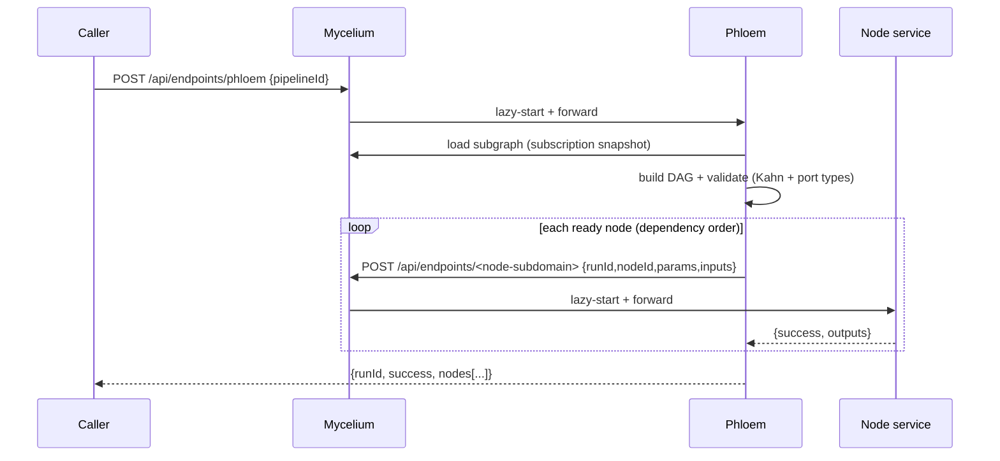

# Microservices

Canonical C# how-to for `Service` projects. For the **language-agnostic HTTP + SSE
wire contract** (Go/Node/Python/Rust subscribe snippets) see
[`SERVICE_CONTRACT.md`](SERVICE_CONTRACT.md). Forward-looking design (delivery
contract, dispatch, ACK envelope) lives in
[`SERVICE_HOST_ROADMAP.md`](SERVICE_HOST_ROADMAP.md) §1. For the simulation-
specific behavior of Metabolism, see [`METABOLISM.md`](METABOLISM.md).

## 1. What a microservice is in this repo

A `Service` is a `Microsoft.NET.Sdk.Web` minimal-API binary on
.NET 10 that talks to the **VillageOS Mycelium** (separate repo, default
`https://localhost:7243`). It auto-registers on start and exposes a `/health`
endpoint Mycelium's `LivenessMonitor` polls; the monitor also removes the
registration of a service that has stopped answering.

The handler contract is just **HTTP + one JWT signed on the P-256 elliptic curve**, so it is not tied to
.NET — a microservice can be written in any language. This doc is the C#
reference; for the **language-agnostic contract** plus runnable reference
handlers in Go, Node/TypeScript, Python, and Rust, see
[`SERVICE_AUTHORING.md`](SERVICE_AUTHORING.md).

Today's .NET services: `Echo`, `Tributary`, `Forage`, `Delta`, `FoodBalance`, `Metabolism`, `Phloem`,
`RainwaterHarvest`, `WaterReserve`, `EnergyBalance`, `ModelBridge`, `Xylem`, `Intake`. `Delta` is the endpoint-registration service: it
provisions the endpoint-template catalog into a model on that model's first registration, and
validates every endpoint
registration against that template graph (see [`DELTA.md`](DELTA.md)); `Tributary` is the runtime
fetch side of the same endpoint story; `Forage` resolves a site against every source
covering it, calls Tributary for each, relates each fetched vocabulary word to the Thing it names,
and then starts the site's analysis by relating its
`SiteStudy` to each marked compute connection (see [`FORAGE.md`](FORAGE.md)). `WaterReserve` (#5805) and `EnergyBalance` (#5806) are
site-analysis nodes: `WaterReserve` computes emergency reserve / days-of-supply / %
consumption (feeding the 14-day resilience range); `EnergyBalance` computes solar + other
generation vs consumption → % of consumption and net-positive. Besides the DAG-node path (wired ports),
both also run **reactively** (#5839) — a graph `/handle` whose subject is the SiteStudy makes the service
read its inputs off the study's effective properties, compute, and write its outputs back as Facts, so the
study's judge ranges re-evaluate (no pipeline). `FoodBalance` (#6022) and `RainwaterHarvest` (#6021) are
the same shape with the reactive half only. Each allocation's area and both of a site's footprints are
figures the model works out for itself, so no service produces them: the food balance reads the
productive footprint and the yield the shared study archetype declares to work out people fed and the
share of the population that is. The rainwater harvest reads the built footprint, the site's rainfall
and the runoff coefficient to work out the volume captured in a year, then serves each demand the
**model** declares in the order it
declares: drinking water first, irrigation from what is left. Each demand reports what it asked for, the
share of it covered and the volume still short. The harvest is one body of water, so measuring it against
each demand on its own would count the same cubic metre twice — and a combined percentage cannot tell a
site with abundant drinking water and a marginal irrigation position from one that is uniformly short.
Which demands there are, their order, and the properties each is read from and written to are Things in
the shared analysis template, not a list in this service. A demand's size is a figure the model works out
for itself, so this service reads one number per demand rather than the two it used to multiply, and a
third demand is a template edit. `ModelBridge` (#5866) is a generic
**model⇄DAG bridge** node: with node param `mode:"read"` it outputs a Thing's property value (GET the
Thing's properties); with `mode:"write"` it writes its `value` input onto a Thing's property (a Fact).
It lets a compute node read a roll-up / SiteStudy param and write its result back over ordinary node→node
wires — the source/target Thing id is baked into the node params (`thingId`, `property`). See
[`MODELBRIDGE.md`](MODELBRIDGE.md) for the full read/write contract and a worked example. **Echo is
the canonical reference implementation** — the simplest. When adding a new
microservice, copy Echo's structure and the test patterns in §10. `Phloem` is the
pipeline/DAG orchestrator and a service becomes a pipeline *node* via an additive `/handle`
envelope — both documented in §16 (Pipelines / DAG orchestration).

**`Intake` is the exception to most of this section.** It takes a land-intake **submission**, composes
the Site, Parcel and SiteStudy it becomes, and applies them as one fragment (#6310). It does **not**
register with Mycelium and is not reachable through the endpoint-forward route — that route resolves
where to forward from data in the model, so a submission path opened there would put whatever the model
happens to name within reach of whoever can call it. So it registers nothing, holds its own credential,
maps `/health` without the `/stats` that would describe a registration it does not keep, and caps the
request body, since it reads a submission into memory whole. It is also the one service that **checks no
inbound credential at all**: its submission route takes a submission from someone who holds none, and a
verified address, a per-source rate limit and bounds on every field stand where a token would. It is
also the one service that sends mail, and it will not start without somewhere to send it. The submission
document is in [`LAND_INTAKE.md`](LAND_INTAKE.md) §4 and what guards the route is in §9.

**Two kinds of predicates — the extension point.** `is` is the *only* predicate built into
Mycelium; **every other predicate that does work is a *Handled Predicate*** dispatched to a
microservice. That is the platform's extension point: a new capability — simulation, integration,
computation — ships as a microservice bound to a predicate, with no change to Mycelium (Metabolism
backs `consumes`/`produces` today; a pipeline node and the `runs` spawn-trigger are the same
pattern). The dispatch machinery is load-bearing even with a single handler — don't flatten it, and
don't add a second built-in predicate alongside `is`. The full relationship-service handler model, the Mycelium API handlers use, and worked examples are in [`RELATIONSHIP_SERVICES.md`](RELATIONSHIP_SERVICES.md).

Project references: `vos.Auth.Shared` (inbound JWT validation) and
`vos.Service.Shared` (Mycelium-client base, validators, contract-
validation foundation + middleware — see §9). A microservice does **not**
depend on `vos.Core` or `vos.Application`.

## 2. Quick start

```bash
# 1. Start Mycelium (in its own repo, separate clone)
cd ../VillageOS/vos.Mycelium
dotnet run                                  # binds https://localhost:7243

# 2. Start a microservice
cd vos.Service.CSharp.Echo
dotnet run -- --port=7245 --myceliumUrl=https://localhost:7243

# 3. Verify health
curl http://localhost:7245/health           # {"status":"Healthy"}

# 4. Verify Mycelium registration
TOKEN=$(curl -s -X POST https://localhost:7243/api/auth/login \
  -H "Content-Type: application/json" \
  -d '{"username":"admin","password":"admin"}' | jq -r '.token')
curl -H "Authorization: Bearer $TOKEN" https://localhost:7243/api/mycelium/services
```

**Multi-model Mycelium instances:** if more than one model is loaded, add
`"modelId":"<guid>"` to the login JSON body, or use `?modelId=<guid>` on
`/api/auth/token`.

## 3. Project shape

```text
vos.Service.<Name>/
├── Configuration/           ← only when the service has settings of its own
│   └── <Name>LaunchSettings.cs  ← wraps ServiceLaunchSettings, adds this service's settings
├── Services/
│   └── <Name>Node.cs        ← the service's own work
├── Helpers/                 ← optional: pure functions extracted from Program.cs
│   └── <Name>.cs            ← static class, no AspNetCore dependency, fully unit-tested
└── Program.cs               ← top-level statements: read settings → build app → map endpoints → run
```

A service with no settings beyond the standard ones has no `Configuration`
folder, and a service that only registers under its own name has no broker
client of its own. Both come from `vos.Service.Shared`.

## 4. Launch settings — the standard flags and the two credentials

`vos.Service.Shared.Configuration.ServiceLaunchSettings` reads the settings
every service needs. There is one implementation; no service writes its own.

- **Required flags:** `--port`, `--myceliumUrl`
- **Optional flags:** `--issuer`, `--audience`
- **Credentials, which are never flags:** `Token` (pre-minted service JWT for
  **outbound** Mycelium calls) and `VerificationKey` (base64 of Mycelium's
  public signing key, for checking **inbound** Mycelium requests)

Every flag can also come from configuration or the environment under its
Pascal-case name — `Port`, `MyceliumUrl` and so on — so a service can be
launched with no flags at all. A flag always wins over configuration.

The two credentials are read from configuration alone. A command line is visible
to every process on the host and is recorded by anything that logs the line a
service was started with, so `--token=` and `--verificationKey=` are ignored if
given. Mycelium sets both on the environment of every daemon it launches.

The rule holds in the other direction too: a service that launches a process of
its own passes any credential on that child's environment, never in its
arguments. Xylem hands the IFC ingest tool its `Token` that way.

`Parse(args, configuration)` returns `null` when a required setting is missing
or the port is not a usable number, which is the signal to print
`UsageMessage` and stop. Flags are matched exactly: a flag name carrying an
invisible character is a different flag, not a near miss.

A service with settings of its own wraps the shared record rather than
reimplementing it, and builds its usage message with
`ServiceLaunchSettings.BuildUsageMessage`. Metabolism's
`--mode=consumes|produces` works this way in
`vos.Service.Metabolism/Configuration/MetabolismLaunchSettings.cs`; Xylem and
Phloem do the same for their own settings.

## 5. Talking to the broker

A service that only needs to register under its own name uses
`vos.Service.Shared.EndpointServiceMyceliumClient` and writes no client of its
own. A service that makes broker calls of its own — Delta, Tributary,
Metabolism, and Phloem's gateway — derives from `MyceliumClientBase` and adds
those calls.

`vos.Service.Shared.MyceliumClientBase` owns the
service-agnostic plumbing:

- `HandlerId` (fresh `Guid` per process)
- `MyceliumUrl`
- `GetTokenAsync()` — returns the `Token` setting if set, otherwise hits the
  legacy `/api/auth/token` endpoint
- `CreateAuthenticatedClientAsync(timeout?)` — returns an `HttpClient` with
  Bearer auth
- `RegisterAsync(port, serviceName, startCommand)` — POSTs the registration
  envelope
- `TryGetPropertyCaseInsensitive(element, name, out value)` — reads a field out
  of an answer. The broker serializes a Thing PascalCase (`Id`, `Name`) even
  though the body you send it is camelCase, so a client that asks for one casing
  reads the field as absent and the call as failed

### 5.1 Snapshot subscriptions — startup data + live stream (SSE)

`vos.Service.Shared.Subscriptions.SubscriptionClient` (also a
`MyceliumClientBase` subclass) is how a service gets its working set **without a
GET storm** and follows changes afterward.

```csharp
var sub = new SubscriptionClient(httpFactory, logger, myceliumUrl, token);

// 1) One call at startup: full objects + a commit-sequence watermark.
var result = await sub.SubscribeAsync(new SubscriptionSelector
{
    Types = new() { "Pump" },
    Traverse = new() { new TraverseRule { Predicate = "produces", Direction = "outgoing", Depth = 1 } },
});
ApplySnapshot(result.Snapshot); // own + inherited properties are kept separate

// 2) Follow live changes; resumes from the watermark and auto-reconnects.
await foreach (var change in sub.StreamAsync(result.SubscriptionId, result.Watermark, ct))
    Apply(change); // change.Sequence is the commit order / Last-Event-ID
```

The stream tracks the last delivered `Sequence` and re-sends it as `Last-Event-ID`
on every reconnect, so delivery is gap-free and exactly-once across drops. Call
`UnsubscribeAsync(subscriptionId)` on shutdown. The wire contract and the resume
semantics are documented in [`SERVICE_CONTRACT.md`](SERVICE_CONTRACT.md) § Subscriptions.

Membership is mutable — no reconnect needed to change what you watch:

```csharp
// Whole-model consumer (e.g. a GUI): one subscription, every change incl. future objects.
var all = await sub.SubscribeAsync(new SubscriptionSelector { All = true });

// Widen / narrow a live subscription as needs change:
var added = await sub.AddObjectsAsync(all.SubscriptionId, new SubscriptionSelector { Ids = new() { relId } });
ApplySnapshot(added.Snapshot); // incremental snapshot hydrates the newly-added objects
await sub.RemoveObjectsAsync(all.SubscriptionId, new[] { relId });
```

The subclass's job is to provide a service-specific `RegisterAsync(port)`
overload that calls the base with the right `(serviceName, startCommand)`,
plus any service-specific calls (`CreateThingAsync`, `ApplyQuantityAsync`, …).
Echo's canonical example:

```csharp
public class MyceliumClient : MyceliumClientBase
{
    public MyceliumClient(IHttpClientFactory http, ILogger<MyceliumClient> log, string myceliumUrl, string? token = null)
        : base(http, log, myceliumUrl, token) { }

    public Task<bool> RegisterAsync(int port)
        => RegisterAsync(port, "Echo", "endpoint-service");
}
```

### Registration sequence



## 6. Helpers — pulling logic out of Program.cs

When `Program.cs` accumulates inline static helpers — JSON-element coercion,
dictionary lookups, file-loading with fallback paths, value-normalization
switches — extract them into `vos.Service.<Name>/Helpers/<Name>.cs`
as a static class. This pulls the testable surface off the
`WebApplicationFactory` integration-test path and onto fast unit tests.

Worked examples:

- `vos.Service.Delta/Helpers/JsonValueCoercion.cs` —
  `CoerceToString(object?)`, `TryGetPropertyValue(IDictionary, string, out object?)`,
  `TryGetStringProperty(IDictionary, string, out string?)`. Every
  `JsonValueKind` arm + case-insensitive lookup pinned in
  `Tests/.../Helpers/JsonValueCoercionTests.cs`.
- `vos.Service.Delta/Helpers/EndpointSeedLoader.cs` —
  `LoadGraph(IEnumerable<string>, ILogger)` takes candidate `seed.json` paths as a
  parameter so tests use real temp files (cheap, no I/O mock); it loads the first
  existing model-seed document (a `Things[]` + `Relationships[]` fragment) and
  assembles it via `EndpointSeedGraph.Build`, which derives the template hierarchy
  from the seed's `is` relationships (not a scalar field). `LoadGraphDefault(ILogger)`
  wraps with the canonical three paths.
- `vos.Service.Metabolism/Helpers/JsonValueUnwrapper.cs` —
  `Unwrap(object?)` maps `JsonElement` to native CLR types with
  `int → long → decimal` width escalation.
- `vos.Service.Tributary/Helpers/EffectivePropertyResolver.cs` —
  `TryGetEffectiveProperty` with exact-match-preempts-suffix precedence and a
  `conflicts` list for ambiguous suffixes.

What stays in `Program.cs`: DI registration, middleware order, route mapping,
lifetime callbacks, endpoint lambdas with thin call-through bodies.
Composition, not logic. The `coverage.runsettings` exclusion of `Program.cs`
is honest after the extraction; before it, real testable code hid behind the
exclusion.

### 6.1 Read and write machine-to-machine values with the invariant culture

Any value that arrives from JSON, from Mycelium, or from a command line and becomes model
data must be parsed with `CultureInfo.InvariantCulture`, and any number rendered back into a
wire payload or a model property must be formatted with it. A regional format describes how
numbers are shown to a person; it must never decide how data is read or stored.

```csharp
double.TryParse(text, NumberStyles.Float, CultureInfo.InvariantCulture, out var seconds)
Convert.ToDecimal(value, CultureInfo.InvariantCulture)
formattable.ToString(null, CultureInfo.InvariantCulture)
```

`Convert.ToDecimal(object)` is the easy one to miss: it is culture-sensitive only when the
boxed value happens to be a string, so it behaves correctly right up until a property arrives
as text.

Leaving it to the machine's setting does not fail loudly — it returns the wrong number. Under
a comma-decimal region such as `nl-NL`, `double.TryParse("30.5", out var v)` yields **305**,
because the dot is read as a thousands separator. A timeout, a site parameter or a range
bound silently changes by a factor of ten with no error anywhere.

**Formatting for a person is the opposite case.** Taproot's own output should follow the
operator's region, so leave display formatting alone. Only values crossing a wire or landing
in the model are invariant.

Tests prove this with `TestCulture` from `vos.Tests.Shared`: `CommaDecimal` forces a
comma-decimal region around a parse so the test fails on any machine rather than only on one
already configured that way, and `Display` pins a rendering assertion to a named culture.

## 7. Program.cs — the same steps, most of them shared

`Program.cs` is wiring. Anything that makes a decision belongs outside it, where
a test can reach it — code inside an entry point cannot be called from a test.

1. Calls `WebApplication.CreateBuilder(args)` first, so the settings reader can
   see configuration and the environment as well as the command line.
2. Reads the launch settings; `Console.WriteLine(<Settings>.UsageMessage)` and
   `Environment.Exit(1)` when `Parse` returns `null`.
3. Calls `ServiceHost.ConfigureLogging(serviceName, logFileName)`. Pass
   `writeToFile: false` under the Testing environment: writing files from shared
   build agents invites flaky tests.
4. If a `VerificationKey` was supplied, calls
   `builder.AddMyceliumTokenAuth(verificationKey, issuer, audience)`. The
   recipient name is this service's own, so a token addressed anywhere else is
   refused before any handler code runs.
5. Calls `builder.Services.AddContractValidation()` to register the schema
   registry and validator.
6. Registers the broker client and the service's own dependencies, then
   `builder.Services.AddMyceliumRegistration(serviceName, port)`.
7. Calls `app.UseRouting()`, then `app.UseRequestContractValidation()` (after
   auth when auth is enabled). The middleware reads
   `ContractValidationMetadata` off the matched endpoint, so it must run after
   `UseRouting` and before endpoint dispatch.
8. Maps **POST `/handle`**, and calls `app.MapHealthAndStats(serviceName,
   myceliumUrl)` and `app.MapShutdown(serviceName)` for the rest. Each request
   type that has a JSON Schema is tagged `[ContractSchema("<$id>")]`; its route
   calls `.RequireContract<TRequest>()` to opt in to validation.
9. `app.Run()`.

Registration and withdrawal are not steps here: `AddMyceliumRegistration` runs
both on the host's own schedule. Registration happens off the startup path, so a
broker that is slow or absent cannot stop the service coming up. Withdrawal is
awaited, so the broker learns the service has gone rather than being left with a
handler that no longer answers.

**What `/handle` receives.** A reactive service is sent either a pipeline node
envelope or a graph relationship naming the Thing to act on.
`vos.Service.Shared.DagNode.HandleRequestRouter.Classify` makes that call and is
covered by its own tests, so the entry point only dispatches on the answer:

```csharp
using var reader = new StreamReader(ctx.Request.Body);
var request = HandleRequestRouter.Classify(await reader.ReadToEndAsync());

switch (request.Kind)
{
    case HandleRequestKind.NodeEnvelope:
        return Results.Ok(await node.HandleNodeAsync(request.Json, ctx.RequestAborted));
    case HandleRequestKind.RelationshipSubject:
        var answer = await reactive.RecomputeAsync(request.SubjectId, ctx.RequestAborted);
        return Results.Ok(new { success = true, answer.Outputs, answer.WaitingFor });
    default:
        return Results.BadRequest(new { error = HandleRequestRouter.DescribeExpectedShapes(serviceName) });
}
```

**The classifier is handed the body text, never a parsed body.** It reads the text itself
so that it can answer `Unrecognised` for a body that is empty or is not JSON at all —
the same answer it gives JSON that names no subject. A service that parsed its own body
would raise on such text instead, and the caller would get a failed request where it
should have had a refusal — which the broker then re-drives, posting the same unusable
body again. No service parses a `/handle` body itself, and a guard in
`vos.ContinuousIntegration.Tests` holds every entry point to that.

**Staying current (#6155).** A dispatch computes once. `InputChangeRecomputeService`
(`vos.Service.Shared.Subscriptions`) keeps the result current afterwards: `/handle` calls
`Watch(subjectId)` for the subject it just computed, and the service recomputes whenever one of its
**input** properties moves on a Thing it follows. The set of subjects grows from the dispatches the
service already receives, so no discovery rule of its own. One line wires it:

```csharp
builder.Services.AddInputChangeRecompute<EnergyBalanceReactiveHandler>(
    "EnergyBalance", myceliumUrl, serviceToken, EnergyBalanceReactiveHandler.InputProperties,
    (handler, studyId, ct) => handler.RecomputeAsync(studyId, ct));
```

Pass the handler's own `InputProperties`, which it derives from the list `Compute` reads, so the filter
cannot come to disagree with the inputs.

What makes it work:

- **Watching the subject is enough when every input is on it.** Mycelium publishes a derived value on the
  Thing that owns it, so a roll-up whose members changed arrives as a property change on the subject,
  exactly like a param someone edited. `EnergyBalance` and `WaterReserve` read nothing else, so they pass
  no second argument.
- **A service computing from other Things names them (#6539).** `Watch(subjectId, readsFrom)` also follows
  the Things the result is computed from, and a change on any of them recomputes **the subject**, never the
  Thing that changed. Land allocation reads the programme split off the allocations beside the study, and
  a roll-up cannot stand in for them: moving share between two categories leaves both a `Sum` and a sorted
  `Set` unchanged while the split they stand for has changed. Re-registering replaces what a subject reads,
  because a planner can add or remove one — so a service passes its current set on every recompute, and a
  Thing no subject reads any more leaves the subscription rather than arriving to be read and dropped.
- **Only inputs trigger it.** A compute service writes its outputs onto the same subject it watches, so
  reacting to every change there would recompute forever. Each handler exposes `InputProperties`, and the
  wiring passes that same set, so the filter cannot drift from what the handler reads.
- **An input that has not arrived is waited for, not failed (#6826).** A study built from a submission
  carries land and a programme and nothing about buildings, so a reservoir capacity or a panel area is
  absent until a building model exists. `StudyInputs.WaitingFor` says which of a handler's inputs the study
  holds no number under — one it does not carry, and one carried with its number withheld — and a handler
  that finds any writes nothing, logs the names, and answers a `RecomputeAnswer` carrying them. The dispatch
  is recorded done and the watch above is what recomputes the study when the figure lands. Throwing instead
  had the dispatch recorded `__DispatchState=Failed` and driven again on every reconciliation for the life
  of the model, which reads in the log exactly like a service that is broken. Text where a number belongs
  is still refused: that is a model to fix rather than a figure to wait for.
- **A reconnect recomputes.** A derived value is published live-only and never enters the journal, so a
  resumed stream does not replay one. `ISubscriptionClient.Reconnected` fires after the stream re-establishes
  a dropped connection, and every watched subject is recomputed rather than trusted — **each subject once**,
  however many Things it reads.
- **Each project is followed separately.** Mycelium binds a subscription to one model when it creates it, and
  a change event names no model — so one subscription cannot carry every project a shared daemon serves. The
  service holds one per model instead. It learns which model a subject belongs to from the bearer on the
  `/handle` call that watched it, trades that bearer at `POST /api/auth/service-token` for one that outlasts
  the subscription, and replaces it before it expires. Every recompute then runs under its own model's token,
  so a handler writes its results back into the project the subject lives in without knowing there is more
  than one. A project whose token cannot be extended does not take the others down with it.

The contract-validation wiring is the canonical reference in
`vos.Service.Metabolism/Program.cs` +
`Endpoints/EndpointMapper.cs`. Adopting it in a new
microservice is three local edits: `AddContractValidation()`,
`UseRequestContractValidation()`, and `.RequireContract<HandleRequest>()` on
the route.

## 8. Health & lifecycle

Mycelium's `LivenessMonitor` polls `/health` every 15 seconds. Three
consecutive failures (a 45 s window) trigger auto-deregistration:

```text
00:00 - Service registers         (FailureCount = 0)
00:15 - GET /health → 200 OK     (FailureCount = 0)
00:30 - GET /health → 200 OK     (FailureCount = 0)
00:45 - GET /health → Timeout     (FailureCount = 1)
01:00 - GET /health → Timeout     (FailureCount = 2)
01:15 - GET /health → Timeout     (FailureCount = 3) → Auto-deregistered
```

After auto-deregistration the service must restart. The `ApplicationStarted`
hook generates a new `HandlerId` and re-registers.

A service does not deregister itself: the removal route is admin-only, so the
call would be refused whatever the service holds. A stopped service stays
listed until the monitor's auto-deregistration removes it.

Today each service hand-rolls the `/health` body shape (Echo returns
`requestsProcessed`; Metabolism returns five fields). The monitor only reads
`status`. The fixed-envelope health shape arrives with the Delivery contract;
see [`SERVICE_HOST_ROADMAP.md`](SERVICE_HOST_ROADMAP.md) §1.8.

### Deregistration triggers

| Trigger | Mechanism |
|---|---|
| Liveness failure (3× `/health` timeout) | Mycelium auto-deregisters |
| An administrator removing the entry | `DELETE /api/mycelium/services/{handlerId}` (admin-only) |

A service that exits — SIGTERM, `POST /shutdown`, or Mycelium calling
`TryStopAsync()` — stays registered until the liveness monitor notices it is
gone.

### A busy service is not a dead one

Before Mycelium launches a daemon it probes the health endpoint, and reads the
answer three ways rather than two:

| Probe result | What it means | What Mycelium does |
|---|---|---|
| Success status | The service is up | Nothing — it is already running |
| Connection refused | Nothing is bound to the port | Launch the daemon |
| Timeout, or an error status | Something holds the port but will not answer | Leave it alone |

This matters when your handler is slow. A service saturated with work can miss
its probe deadline while still holding its port, and a second process launched
there could only fail to bind — while adding the load that makes the next probe
time out too. Your service will not be duplicated for being busy.

Note the difference from the liveness table above: `LivenessMonitor` still
deregisters a service that misses three polls in a row. The probe described
here only decides whether to *launch* a process, never whether to retire one.

### Launched daemons run with a memory ceiling

A daemon Mycelium launches gets a bounded managed heap — `DOTNET_GCHeapHardLimit`
in its environment, set from Mycelium's `DaemonLauncher:MemoryCeilingMegabytes`
(4096 by default, zero to switch it off). A service not on the .NET runtime
ignores it.

**What this means for you.** A handler that allocates without end now raises an
out-of-memory error in your own process, with a stack trace pointing at the
allocation, instead of quietly growing until the host has nothing left for
anything else. If your service dies this way, the fix is in the handler, not the
ceiling. The usual cause is reading more of the model than the work needs — for
example fetching a whole entity type on every dispatch when only a few things
are being acted on. Ask for the slice you need, keep reference data that rarely
changes between calls, and collapse a burst of triggers into one pass.

## 9. Contract validation

JSON Schema artifacts + a runtime that loads and validates against them.
Schemas pin the wire format of Mycelium ↔ microservice payloads so future
changes are a schema diff in code review rather than a silent runtime
surprise. Phases 1–4 have landed.

Schemas live under `vos.Service.Shared/Contracts/Schemas/` and are
embedded as resources in the shared assembly. The validator runtime lives in
`vos.Service.Shared/Contracts/Validation/`.

### 9.1 Schemas in scope

| Schema | Producer → Consumer | Source of truth in code | Phase landed |
|---|---|---|---|
| `mycelium-register-request` | every microservice → Mycelium `POST /api/mycelium/register` | `MyceliumClientBase.RegisterAsync` | 1 (schema) / 3 (wired) |
| `token-response` | Mycelium `POST /api/auth/token` → every microservice | `MyceliumClientBase.GetTokenAsync` | 1 / 3 |
| `handle-request-metabolism` | Mycelium → Metabolism `POST /handle` | `vos.Service.Metabolism.Models.HandleRequest` | 1 / 2 |
| `apply-quantity-request` | Metabolism → Mycelium `POST /api/things/{id}/properties/{path}/{decrements\|increments}` | `vos.Service.Metabolism.Services.MyceliumClient.ApplyQuantityAsync` | 4 |
| `relationship-property-increment-request` | Metabolism → Mycelium `POST /api/relationships/{id}/properties/{path}/increments` | `vos.Service.Metabolism.Services.MyceliumClient.IncrementRelationshipPropertyAsync` | 4 |

Each schema uses `additionalProperties: false` on every object subschema —
strict by default per the project's pre-release / no-shims convention.

### 9.2 Public API

```csharp
var registry = new SchemaRegistry();
JsonSchema schema     = registry.Get("https://villageos/contracts/mycelium-register-request.schema.json");
JsonSchema sameSchema = registry.Get<MyceliumRegisterRequest>();   // via [ContractSchema]
```

`SchemaRegistry` eagerly loads every embedded schema and exposes them by
`$id`. One instance per process is sufficient. The constructor throws
`InvalidOperationException` at startup if any embedded schema is missing
`$id` or two schemas share an `$id` — design-time mistakes fail closed.

```csharp
[ContractSchema("https://villageos/contracts/mycelium-register-request.schema.json")]
public sealed record MyceliumRegisterRequest(/* ... */);
```

```csharp
var validator = new SchemaValidator();
ContractValidationResult result = validator.Validate(json, schema);

if (!result.IsValid)
    foreach (var e in result.Errors)
        log.LogWarning("contract violation {Path} [{Code}]: {Message}", e.Path, e.Code, e.Message);

validator.ValidateOrThrow(json, schema, schemaId);   // throws ContractValidationException
```

`ContractValidationError.Code` is a stable public code family — decoupled from
NJsonSchema's internal `ValidationErrorKind` enum:

| Code | Meaning |
|---|---|
| `Required` | A `required` property is missing. |
| `AdditionalProperties` | An unknown property is present (strict mode). |
| `Type` | The JSON type does not match `type` (string/integer/number/array/...). |
| `Format` | The value violates `format` (`uuid`, `uri`, `date-time`, …). |
| `ArrayLength` | `minItems` / `maxItems` violated. |
| (other) | Raw NJsonSchema `ValidationErrorKind` name as a fall-through. |

### 9.3 Adding a schema

1. Drop a `.schema.json` file under
   `vos.Service.Shared/Contracts/Schemas/` with a unique `$id` of
   the form `https://villageos/contracts/<name>.schema.json`.
2. Set `additionalProperties: false` on every object subschema.
3. Add fixtures under
   `Tests/vos.Service.Shared.Contracts.Tests/Fixtures/<schema-folder>/`:
   - `valid.json` — at least one positive case.
   - `invalid-<reason>.json` — one or more negative cases.
4. Add the schema id to the positive/negative tables in
   `SchemaValidatorTests`. `SchemaSelfValidityTests` discovers it
   automatically.
5. Tag the C# DTO with `[ContractSchema("<$id>")]` and add
   `.RequireContract<TRequest>()` to the route that accepts it.

Schemas are authored against Draft 2020-12.

### 9.4 Inbound middleware (Phase 2)

`app.UseRequestContractValidation()` + `endpoint.RequireContract<T>()` gate
the inbound `/handle` body. A schema violation returns `400` with a
`{ schemaId, errors[] }` envelope before the handler runs. Adoption is
per-service: tag the request DTO with `[ContractSchema]` and add
`.RequireContract<T>()` to the route. Today Metabolism is the only adopter.

### 9.5 MyceliumClientBase outbound + response validation (Phase 3)

`RegisterAsync` body and `GetTokenAsync` response are validated on every call.
Failure policy is per-call via `SchemaViolationMode`:

- **Debug** builds throw `ContractValidationException`.
- **Release** builds emit a single `LogLevel.Warning` and let the call
  through.

Tests pin both paths regardless of build config via a virtual
`OutboundViolationMode` on `MyceliumClientBase`. No metrics infra yet — counter
follow-up tracked separately.

### 9.6 Metabolism hot-path validation (Phase 4)

`ApplyQuantityAsync` and `IncrementRelationshipPropertyAsync` validate their
outbound bodies on every tick. `ValidateOutbound` is promoted to `protected` so
service-specific subclasses can call it. Same Throw/Log policy as §9.5. Inbound
`RelationshipPropertyChanged` events arriving over the SSE subscription are not
schema-validated — `MetabolismSubscriptionService` applies them directly.

### 9.7 Tests + coverage

`Tests/vos.Service.Shared.Contracts.Tests/` runs alongside the
rest of the solution under `dotnet test`. The new assembly is excluded from
coverage measurement via the existing `ModulePath` filter in
`coverage.runsettings`; the production code lands under
`vos.Service.Shared`'s existing thresholds (unchanged by Phase 1).

The `LoadEmbeddedRawSchemas` host-side enumeration has branches (resource-name
filter, defensive null-stream throw) that are not reachable through the test
surface; the parsing and registration logic it feeds *is* covered, via the
internal `SchemaRegistry` constructor that takes raw `(name, json)` pairs.

Two further phases (GUI runtime validation, CI drift gate) are sketched in
[`SERVICE_HOST_ROADMAP.md`](SERVICE_HOST_ROADMAP.md) §3 but unscheduled.

## 10. Testing patterns

Every microservice has a sibling test project at
`Tests/vos.Service.<Name>.Tests/`. Mirrors the production
project's reference graph + adds:

- `Microsoft.NET.Test.Sdk`, `xunit`, `xunit.runner.visualstudio`,
  `coverlet.collector`
- `FluentAssertions`, `Moq` (or NSubstitute)
- `Microsoft.AspNetCore.Mvc.Testing` if exercising endpoints via
  `WebApplicationFactory<Program>`
- Project references: the microservice + `vos.Tests.Shared`

Standard test files:

```text
Tests/vos.Service.<Name>.Tests/
├── <Name>LaunchSettingsTests.cs  ← only when the service has settings of its own
└── <Service>Tests.cs             ← the service's own work (handle endpoint, engine, and so on)
```

There is no per-service settings test or broker-client test for the standard
behaviour, because there is no per-service settings parser or broker client.
Both live in `vos.Service.Shared` and are covered once, thoroughly, in
`Tests/vos.Service.Shared.Tests`:

| Shared test file | What it pins |
|---|---|
| `Configuration/ServiceLaunchSettingsTests.cs` | Required settings, port bounds, every optional flag, configuration and environment fallback, a flag beating configuration, exact flag matching |
| `EndpointServiceMyceliumClientTests.cs` | Registration under each service's name, the endpoints Mycelium is given, refusal and token failure returning false, withdrawal, a supplied token short-circuiting the token call |
| `MyceliumRoutesTests.cs` | The routes every service builds its requests from, and that a property name which would otherwise change the path is escaped into one segment |
| `Hosting/ServiceHostTests.cs` | Health and statistics, shutdown answering before it stops, registration on startup, withdrawal on shutdown, a failing broker not stopping the service serving |
| `DagNode/HandleRequestRouterTests.cs` | Which shape a `/handle` body is, what an unusable one is answered with, and that text which is not JSON is answered rather than raising |

Copying a test is the same problem as copying the code. If a behaviour is the
same in every service, it belongs in the shared suite, not repeated per service.

### 10.1 Testing a service's own settings

Only for a service that adds settings of its own. Cover the settings it adds and
that the shared ones reach the caller — not the shared behaviour again. See
`Tests/vos.Service.Metabolism.Tests/MetabolismLaunchSettingsTests.cs`.

### 10.2 Testing a service's own broker calls

Only for a service that makes broker calls of its own. Build it over
`vos.Tests.Shared.MockHttpMessageHandler` and
`vos.Tests.Shared.PerCallHttpClientFactory`:

```csharp
var handler = new MockHttpMessageHandler(respond);
var client = new MyceliumClient(
    new PerCallHttpClientFactory(handler),
    NullLogger<MyceliumClient>.Instance,
    "http://localhost:7243",
    serviceToken);
```

Use `PerCallHttpClientFactory`, not a single shared client. A client's timeout
cannot be set again once a request is in flight, so a subject that makes more
than one call fails on the second one for a reason that has nothing to do with
the code under test.

`Tests/vos.Service.Phloem.Tests/MyceliumGatewayTests.cs` is the fullest example.

### 10.3 Service-specific endpoint tests

Services with substantial logic of their own — Metabolism's simulation engine,
Tributary's `ObservationIngestService` — get a `<Service>Tests.cs` exercising
that logic directly.

When the endpoint surface itself needs covering, use
`WebApplicationFactory<Program>` from `Microsoft.AspNetCore.Mvc.Testing` and
inject the settings through `UseSetting` on the host builder — the settings
reader falls back to those when no flags are present, which is always the case
under the test host. The `Program` class is `internal` by default with top-level
statements, so declare `public partial class Program { }` at the bottom of
`Program.cs` to make it reachable from the test factory.

### 10.4 Coverage expectations

Aim for **95% line coverage or better** on everything a service owns: its
settings record, its broker calls, and its business-logic classes.

A service entry point is excluded from coverage only once it holds nothing but
wiring — because whatever it used to decide now lives in shared code and is
covered there, or its endpoints are driven end to end through the test host.
An entry point that still handles requests stays counted, so the gap is visible
rather than hidden. Xylem and Phloem are in that position today.

When adding a service, add its `Program.cs` to the comma-separated
`<ExcludeByFile>` list in `coverage.runsettings` only when that is true of it.

> The list is comma-separated on purpose: coverlet's XPlat data collector
> expects a single string there, and nested `<File>` elements are silently
> ignored — which is how an earlier wildcard came to exclude nothing at all.

## 11. Adding a new microservice

1. Copy `vos.Service.CSharp.Echo/` to `vos.Service.<Name>/` and rename the
   namespace and project file. Change the service name passed to
   `EndpointServiceMyceliumClient` and to the `ServiceHost` calls.
2. Add the new project to `VillageOS-API.sln`.
3. Copy `Tests/vos.Service.CSharp.Echo.Tests/` to
   `Tests/vos.Service.<Name>.Tests/` and update the project reference and
   namespace. Only copy tests for what the new service actually owns — the
   standard settings, registration and host behaviour are already covered in
   `Tests/vos.Service.Shared.Tests` and should not be repeated.
4. Add the test project to `VillageOS-API.sln`.
5. Run `dotnet test` from the repo root. The build hands the runner the
   solution, so step 4 is what puts the new tests into it — a test project left
   out of the solution still builds and still passes locally, and is never run
   on the build agent. `Tests/vos.ContinuousIntegration.Tests/` fails when a
   test project on disk is missing from the solution.
6. Add the new `Program.cs` to `<ExcludeByFile>` in `coverage.runsettings` only
   once it holds nothing but wiring. If it still handles requests itself, leave
   it counted and extract the handling instead.
7. Add a row for the service to the microservice table in `README.md`. That table
   is the first list of what this repository runs that anyone reads, and
   `Tests/vos.ContinuousIntegration.Tests/` fails when a service has no row. A project that is not a service anyone runs is named in
   `ReadmeListsEveryServiceTests.ListedElsewhere` with the reason instead.

Only add a `Configuration/` folder if the service has settings beyond the
standard ones, and only add a broker client if it makes broker calls of its own.

## 12. Pointers

Mycelium repo (`ReGenVillages/VillageOS`) owns the REST surface, SSE change
streams, seed-loading, and JWT minting. Quick map for what calls what:

| Area | Endpoint (on Mycelium) | Method |
|---|---|---|
| Login | `/api/auth/login` | POST |
| API-key exchange | `/api/auth/token` | POST (`X-API-Key` header) |
| Session restore | `/api/auth/restore-session` | GET (HttpOnly cookie) |
| Stream token (for `?access_token=` on an SSE address) | `/api/auth/stream-token` | POST |
| Things | `/api/things` | GET, POST, DELETE |
| Properties | `/api/properties` | GET, PUT, DELETE |
| Relationships | `/api/relationships` | GET, POST, DELETE |
| Mycelium registry | `/api/mycelium/register`, `/api/mycelium/services/{id}` | POST, DELETE |
| Subscriptions (SSE) | `/api/subscriptions`, `/api/subscriptions/{id}/stream` | POST, GET (SSE) |
| System events (SSE) | `/api/events/stream` | GET (SSE) |

Full reference: the **Mycelium Guide** on Mycelium repo's wiki
(`ReGenVillages/VillageOS` → wiki → Mycelium). Swagger UI is available at
`/swagger` when Mycelium is running (default
`https://localhost:7243/swagger`).

### Giving a service an API key

Microservices authenticate with a pre-minted JWT supplied through the `Token`
setting (Mycelium mints it and sets it on the daemon's environment when it
launches the daemon). A service nobody launches on demand — the public intake
service most of all — needs a credential that does not expire, so a service can
hold an **API key** instead, supplied through the `ApiKey` setting
(configuration or environment, never the command line). `ServiceCredential`
exchanges it at `POST /api/auth/token` with the `X-API-Key` header, holds the
minted token, and exchanges again shortly before it expires — never per call.
When both `ApiKey` and `Token` are set the key answers, because it is the
durable credential and may be confined to one model; a failed exchange answers
nothing rather than falling back to a broader credential.

Every service presents what `ServiceCredential` answers, whether it calls
through the shared client or builds the request itself, so a service written
either way honours `ApiKey`. Xylem, which reaches the broker directly to clear
a model and to launch the ingest tool, asks the same thing.

Create a key like this:

```bash
TOKEN=$(curl -s -X POST https://localhost:7243/api/auth/login \
  -H "Content-Type: application/json" \
  -d '{"username":"admin","password":"admin"}' | jq -r '.token')

curl -s -H "Authorization: Bearer $TOKEN" \
  -X POST https://localhost:7243/api/auth/keys \
  -H "Content-Type: application/json" \
  -d '{"name":"my-service-key","role":"service"}' | jq
```

The response includes a `rawKey` field (e.g. `vos_sk_...`) — store it securely,
it is only shown once. Give it to a service through the `ApiKey` setting, or
exchange it yourself via `POST /api/auth/token` (`X-API-Key: <rawKey>`) and
hand the short-lived token over through the `Token` setting.

### Related docs

- [`METABOLISM.md`](METABOLISM.md) — Metabolism simulation lifecycle, two-mode
  binary (`--mode=consumes|produces`), tick logic.
- [`MODELBRIDGE.md`](MODELBRIDGE.md) — ModelBridge model⇄DAG bridge node: the
  `read`/`write` modes, the `thingId`/`property` param contract, and a worked example.
- [`DELTA.md`](DELTA.md) — Delta endpoint-registration service: per-model template-catalog
  provisioning, the graph-validation rules, and the `/handle` registration contract.
- [`SERVICE_HOST_ROADMAP.md`](SERVICE_HOST_ROADMAP.md) — Delivery contract,
  remaining DI refactors, possible contract-validation phases 5+6.

## 13. Common issues

### "Registration error: Connection refused"

Mycelium is not running or not accessible. Start it
(`cd ../VillageOS/vos.Mycelium && dotnet run`), verify with
`curl https://localhost:7243/api/auth/token`, and check `--myceliumUrl` matches
Mycelium's actual URL.

### Service shows as "Unreachable" in `/api/mycelium/services`

The `/health` endpoint is not responding. Test directly:
`curl http://localhost:<port>/health`. Check the port is bound
(`netstat -an | findstr :<port>`) and that the handler returns
`{ "status": "Healthy" }` with `200`.

### Service was auto-deregistered

Three consecutive `/health` failures (45 s window). Fix the health issue,
then restart — the service re-registers with a new `HandlerId`.

### Port already in use

`Get-Process -Id (Get-NetTCPConnection -LocalPort <port>).OwningProcess | Stop-Process`
(PowerShell), then restart. Or pass `--port=<other>`.

### Schema validation rejecting valid-looking payloads

Schemas use `additionalProperties: false` strictly. Check that DTO field
casing matches the schema, that no extra fields are present, and that
nullable fields are typed correctly (`{ "type": ["string","null"] }` vs
plain `"string"`).

## 14. Endpoint services

In addition to relationship-service daemons (invoked when relationships are
created), Mycelium supports **endpoint services** — custom HTTP
microservices that expose their own API endpoints through
`POST /api/endpoints/{subdomain}`. They are auto-discovered from seed data
(things with an `EndpointSubdomain` property), share the same managed daemon
lifecycle as relationship services, and act as pass-through proxies — Mycelium
forwards request bodies as-is to the service's `/handle` endpoint. Mycelium
also exposes per-subdomain request metrics (count, avg response time, errors).

Full implementation details: the *Endpoint Services* section in the Mycelium
Guide on Mycelium repo's wiki.

### 14.1 Tributary token-exchange auth + offset paging

Tributary is an endpoint service that stays source-agnostic: it has two
**generic** capabilities — a token-exchange auth provider and an offset
paginator — both driven entirely by endpoint-template config. There is no
ArcGIS vocabulary in the code; ESRI is just one configuration. No special
binary, and no Delta change — the endpoint-template catalog already resolves
multi-level hierarchies.

At the contract level: a template reaches the **kinds** it uses, through
`authenticatesBy`, `pagesBy` and `readsBodyAs`. A kind is a Thing in the seed,
not a word on the endpoint, and it declares the keys it requires — so an
endpoint that cannot satisfy its kind is refused before anything is called,
naming what is missing. `TokenExchangeAuth` mints or reuses a credential;
`OffsetPaging` walks an offset-paginated source and aggregates every page before
transforming; `BinaryResponse` reads the body as bytes.

Reaching no kind for a role is a valid answer meaning the plain behaviour — no
credential, no paging, a text body — and is what the root `Endpoint` template
does. A source-specific child template reaches the kinds it needs, and the
nearest declaration up the `is` chain wins, exactly as a narrowed key does.

Adding an endpoint that uses a kind the platform already implements is a seed
change with no release. Naming a kind nothing implements is refused saying both
what the model asked for and what this service can do.

The canonical `EsriEndpoint` template JSON, the token-exchange/caching
mechanics, and the offset-paging mechanics live in
[`TRIBUTARY.md`](TRIBUTARY.md) — the doc for the service that implements them.
The endpoint-template graph, the property field taxonomy, and the
fetch-and-shape (no derived calculation) boundary versus Metabolism are also
covered there.

## 15. Writing data back — Facts, Observations, Sediment

A handler usually reacts to model changes (via subscriptions, §5.1) and writes results back.
`MyceliumClientBase` ships a helper for each of the three write kinds, so every microservice's
`MyceliumClient` inherits them — no per-service plumbing. Each validates its outbound payload against
an embedded contract schema (§9) before the call and surfaces failures as an `HttpRequestException`
carrying the `StatusCode`.

| Helper | Write kind | Route | Returns |
|---|---|---|---|
| `SetFactAsync(thingId, property, value)` | **Fact** — structural, synchronous, never lossy | `POST …/properties/{p}/facts` → 201 | commit `sequenceNumber` |
| `RecordObservationAsync(thingId, property, value, observedAt?)` | **Observation** (single) | `POST …/properties/{p}/observations` → 202 | — |
| `RecordObservationsAsync(thingId, samples)` | **Observation** (batch) | `POST …/{id}/observations` → 202 | accepted count |
| `DepositSedimentAsync(readings)` | **Sediment** — bulk historical, straight to sealed Sapwood | `POST /api/sediment` → 202 | `SedimentDepositResult` |

```csharp
long seq = await mycelium.SetFactAsync(thingId, "status", "active");
await mycelium.RecordObservationAsync(thingId, "temperature", 21.5m, DateTime.UtcNow);
int accepted = await mycelium.RecordObservationsAsync(thingId, new[]
{
    new ObservationSample("temperature", 21.7m),          // no time → Mycelium stamps the batch
    new ObservationSample("flow", 3.1m, DateTime.UtcNow), // or name the observed-time yourself
});
SedimentDepositResult deposit = await mycelium.DepositSedimentAsync(new[]
{
    new SedimentReading(thingId, "temperature", 19.8m, DateTime.UtcNow.AddDays(-1)), // observedAt required
});
```

**Pick by intent.** A *Fact* is truth that must survive replay (status, configuration, a corrected
value). An *Observation* is sampled telemetry — high-volume, queued, and coalesced. *Sediment* is a
one-shot historical backfill that bypasses the live queue and writes sealed Sapwood buckets directly;
its entities must already exist and every reading must carry an `observedAt`.

**Gating.** A property's `AllowedWriteKinds` (`Both` / `FactOnly` / `ObservationOnly`) decides what it
accepts; the wrong kind returns **405**, an unknown thing/property **404**.

**Reference.** The **Echo** service demonstrates all three in
`Services/WriteKindsDemo.cs`, wired to `POST /demo/write-kinds`. The contract and the per-language
(Go/Node/Python/Rust) snippets are in
[`SERVICE_CONTRACT.md`](SERVICE_CONTRACT.md) § "Writing data back". The schemas live in
`vos.Service.Shared/Contracts/Schemas/{fact-write,observation-write,observation-batch,sediment-deposit}-request.schema.json`
(§9.3). Tests: `MyceliumClientWriteKindsTests` (Shared) and `WriteKindsDemoTests` (Echo).

---

## 16. Pipelines / DAG orchestration

A **pipeline** is a Directed Acyclic Graph whose **nodes are microservices** and whose **edges are typed
data-flow wires**. You build one visually in **Trellis → Pipelines** (see
[`TRELLIS.md`](TRELLIS.md) §7.4), and the **Phloem** orchestrator microservice executes it — resolving
dependencies, invoking each node through the same `/handle` dispatch every handler already uses, and routing
each node's outputs to its downstream inputs.

It is *lean-on-model*: a pipeline is just **Things + relationships**, so the platform stays generic. Three
pieces hold all the specificity — the model archetypes (seed), the Phloem orchestrator, and the Trellis
editor.

### 16.1 The model



- A **PipelineNode** binds a **Connection** (`node ‑has→ Connection ‑has→ Service`); the Connection's
  `Subdomain` is the dispatch address Phloem forwards to.
- **Ports** are first-class `Port` Things on the service **prototype**, resolved by walking the bound
  service's `is`-chain (relationships do **not** inherit through `is`, so ports resolve at read time).
- A **wire** is a relationship whose predicate `is` the wire archetype — identified by the role that
  archetype is marked with, never by the predicate name `"feeds"` — carrying `fromPort`/`toPort`.
- **Every role is a flag the archetype carries**, not a name: `__IsPipelineArchetype`,
  `__IsPipelineNodeArchetype`, `__IsConnectionArchetype`, `__IsServiceArchetype`, `__IsPortArchetype`,
  `__IsPipelineWireArchetype`, `__IsPipelineInputArchetype`, `__IsPipelineOutputArchetype`,
  `__IsPipelineRunArchetype`, `__IsNodeRunArchetype`. The names below are only what the seed tool happens
  to choose. Phloem asks for the marked archetypes through the subscription selector (`markedTypes` for a
  role's members, `markedArchetypes` for the archetype alone), and the Trellis pipeline editor reads the same
  marks off the model it has loaded, so renaming any of them changes nothing on either side.
- Make any seed DAG-ready with the `seed-migrate` tool in the private VillageOS repo (`tools/seed-migrate/pipeline-enable.js`),
  which adds the archetypes, the Phloem Connection, example Echo node services with typed Ports, and a demo Pipeline.

### 16.2 Making a microservice a node — the envelope

A node is just a service that, in addition to its normal graph/http handling, recognises one extra `/handle`
request shape — the **node envelope** — and answers with **outputs**. It is **additive** over the
[Service Contract](SERVICE_CONTRACT.md): same `POST /handle`, same JWT, same registration.

```jsonc
// orchestrator → node                          // node → orchestrator
POST /handle                                     {
{                                                  "success": true,
  "runId":  "<guid>",                              "outputs": { "echo": "hello" },  // by OUTPUT-port name
  "nodeId": "<guid>",                              "error": null
  "params": { /* static node params */ },        }
  "inputs": {                  // by INPUT-port name
    "message": "hello",                           // in-band literal, or…
    "geometry": { "ref": { "thingId": "<guid>", "property": "mesh" } }  // …a graph reference
  }
}
```

A request is a node invocation **iff it carries both `runId` and `nodeId`** — anything else is a legacy
graph/http body the service handles exactly as before; the two never collide.

- **Reference inputs.** Large values aren't shipped in-band: an input may be `{ "ref": { "thingId",
  "property" } }`, which the node resolves via `GET /api/things/{id}/properties` before running.
  Return the same shape to hand a large value downstream. The referenced property may be a **roll-up
  property** — a value computed live from an aggregate reduction over related Things (e.g. total PV area
  summed over every element that `is SolarArray`). It resolves as an ordinary effective property, so a
  compute node reads a model-wide roll-up with no special handling. Such a property can be **null**: when a
  related Thing cannot contribute a number, the model decides whether the roll-up skips it or yields no
  value at all, and yielding no value is the default. Handle a null reference input rather than assuming
  a number.
- **Param-bound inputs.** An input port can be filled from the **run's params** instead of a wire: a
  node's `paramBindings` property maps `inputPort → paramKey`, and Phloem fills that input from the spawn's
  `params` before dispatch (an explicit wire into the same port wins). Lets a source node be parameterized
  per-run without editing the graph; the editor's **Params** form supplies the values.
- **Ports & `/manifest`.** A node advertises typed ports — `{ portName, direction: in|out, type, required }`
  — so the editor can type-check wires; expose them at `GET /manifest`.
- **Collection inputs (fan-out).** A port may be `collection: true`: when that input receives a **list**,
  Phloem runs the node **once per item** (bounded), broadcasts the node's other inputs to every item, and
  **gathers** each output port into a list for downstream. The node service still sees one item per call (a
  scalar on the collection port, plus the item `index` in the envelope). The node property `onItemError`
  chooses `fail` (any item fails → node fails) or `continue` (failed items become null holes → node `partial`).

**.NET SDK base.** `DagNodeService` (`vos.Service.Shared`, namespace `…Shared.DagNode`) maps the
envelope onto business logic:

```csharp
public sealed class MyNode : DagNodeService
{
    public override IReadOnlyList<PortDescriptor> Ports { get; } = new[]
    {
        PortDescriptor.Input("message", "string", required: true),
        PortDescriptor.Output("echo", "string"),
    };

    protected override Task<NodeResult> ExecuteNodeAsync(NodeContext ctx, CancellationToken ct)
    {
        var message = ctx.Input("message")?.GetString() ?? throw new InvalidOperationException("message required");
        return Task.FromResult(NodeResult.Ok(("echo", message)));
    }
}

// wire into the host's existing /handle:
app.MapPost("/handle", async (HttpContext http, MyNode node) =>
{
    using var doc = await JsonDocument.ParseAsync(http.Request.Body);
    return DagNodeService.IsNodeEnvelope(doc.RootElement)
        ? Results.Ok(await node.HandleNodeAsync(doc.RootElement, http.RequestAborted))
        : Results.Ok(/* … the service's existing handling … */);
});
```

`HandleNodeAsync` parses the envelope, resolves `ref` inputs, runs `ExecuteNodeAsync`, and shapes
`{success,outputs,error}`. A throw becomes `{success:false,error:"…"}` — never an unhandled 500 — so the
orchestrator records the failure and halts dependents cleanly. **Echo** (`EchoNode`) is the reference node
(`message` → `echo`). Non-.NET services implement the same JSON envelope directly.

> **Node vs. spawner.** Being a node is one role; **spawning** a pipeline is a different one. A service that
> *runs* a DAG (e.g. Tributary, or Metabolism's `consumes`/`produces`) is a **spawner** — see §16.3 — not a
> node.

### 16.3 The orchestrator (Phloem)

Phloem is a managed microservice like any other; everything it does goes **through Mycelium**.

**Spawn — http (synchronous).** A caller spawns through endpoint-forward and **blocks for the result**:

```jsonc
POST /api/endpoints/phloem   { "pipelineId": "<guid>", "params": { } }
// → { "runId", "pipelineId", "success", "nodes": [ { "nodeId","name","status","outputs","error" } ], "error" }
```

**Spawn — http (asynchronous).** The Trellis editor spawns with `"async": true` so it gets the run id
**immediately** and animates the run over SSE instead of blocking:

```jsonc
POST /api/endpoints/phloem   { "pipelineId": "<guid>", "params": { }, "async": true }
// → { "success": true, "accepted": true, "runId": "<guid>", "pipelineId": "<guid>" }
```

**Spawn — graph (`X runs Pipeline`, fire-and-forget).** A pipeline can also be spawned **from the model**,
like `consumes`/`produces` drive Metabolism: the seed declares a `runs` predicate that is a **graph
Connection** bound to the Phloem Service. Creating a `<X> runs <Pipeline>` relationship makes Mycelium
forward the relationship envelope (`{relationshipId, subjectId, targetId, properties}`) to the same
`/handle`; `SpawnTrigger.Resolve` keys off shape (`pipelineId` ⇒ http; else `targetId` is the Pipeline,
`properties` are the params). So **any service can spawn a DAG** by creating that relationship. Because a
graph trigger fires during a relationship-create (Mycelium waits ~15s), it is **fire-and-forget**: Phloem
ACKs immediately and runs the DAG in the background, persisting the result to the `PipelineRun`.



**What a run does:** (1) load the pipeline's structural closure in one subscription snapshot; (2) build the
DAG (node→Connection subdomain, ports via the `is`-chain, wires by `PipelineWire`); (3) validate up front —
Kahn topological sort (acyclic, distinct from Hyphae's runtime oscillation) + port-type compatibility;
(4) execute in dependency order (independent nodes concurrently, bounded), dispatching each via
endpoint-forward and routing outputs→inputs; a node failure halts dependents; (5) **persist the run live**,
best-effort — each node is written `running` before dispatch and its terminal status after, on **one
`NodeRun` Thing per node** (deterministic id, so the SSE view sees a property change, not duplicate Things) —
and between dispatches Phloem polls the run's `cancelRequested` flag for **cooperative cancellation**
(already-running nodes finish; pending ones are marked `cancelled`).

*Internals:* `IMyceliumGateway` is the seam between orchestration and HTTP (so `PipelineExecutor` is
unit-tested without a network); `PipelineGraph` + `PipelineDagBuilder` build the `PipelineDag`,
`DagValidator` checks it, `MyceliumGateway` is the HTTP implementation. Which archetype plays which role
is read from the flag each one carries (`PipelineArchetypes`), so Phloem takes no archetype name at launch
and a model may call its archetypes anything.

### 16.4 Creating & running a pipeline

1. **Enable a seed:** run the `seed-migrate` tool from the private VillageOS repo
   (`node tools/seed-migrate/pipeline-enable.js <seed.json> --write`), then reload the
   broker (clear `vos-data`).
2. **Author:** Trellis → **Pipelines** (`TRELLIS.md` §7.4) — drag services from the palette, wire output→input
   ports (type-checked), **Save**.
3. **Run:** click **Run** — the editor uses the async spawn and **animates each node live over SSE**
   (running → succeeded / failed / skipped); **Cancel** stops an in-flight run, marking pending nodes
   `cancelled`. Or create an `X runs Pipeline` relationship to trigger it from the model (fire-and-forget).

> **Scope.** Synchronous + async spawn with level-by-level concurrency, **live SSE run animation + cancel**,
> run-history replay, **run-level param routing**, and **fan-out over collections** (one collection input per
> node). Incremental rerun/caching, and full list-type validation across the graph, are later phases.
