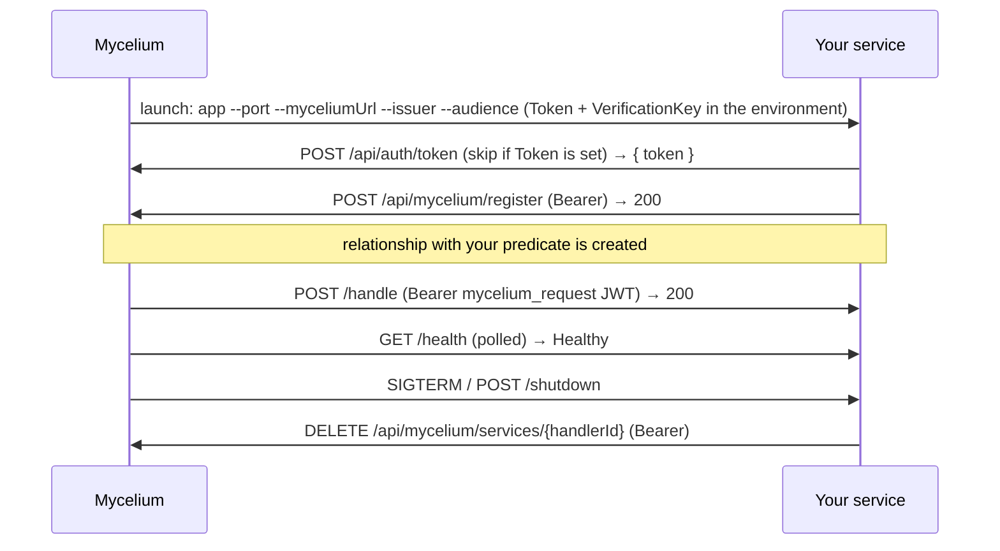

# Authoring a VillageOS managed microservice

A **managed microservice** is an external handler that Mycelium (the VillageOS gateway) launches as a daemon and calls when a relationship using the service's predicate is created. The entire contract is **HTTP + a single JWT signed on the P-256 elliptic curve** — so a handler can be written in *any* language with an HTTP server and a mainstream cryptography library.

This document is the language-agnostic contract. Working reference implementations live alongside it:

| Language | Project | Style | Verified |
|----------|---------|-------|----------|
| C# / .NET | [`vos.Service.CSharp.Echo`](../vos.Service.CSharp.Echo) | ASP.NET minimal API (canonical) | ✓ build + tests |
| Go | [`vos.Service.Go.Echo`](../vos.Service.Go.Echo) | standard library, zero deps | ✓ build + tests |
| Node / TypeScript | [`vos.Service.Node.Echo`](../vos.Service.Node.Echo) | built-ins, zero runtime deps | ✓ typecheck + tests |
| Python | [`vos.Service.Python.Echo`](../vos.Service.Python.Echo) | FastAPI | ✓ pytest |
| Rust | [`vos.Service.Rust.Echo`](../vos.Service.Rust.Echo) | Axum | ✓ build + tests + clippy |

Each reference is an **echo handler**: `/handle` acknowledges the relationship and reflects the payload back. Swap that for your predicate logic.

## A note on `is`

`is` is the one **built-in** predicate. Mycelium applies `is` inheritance in-process and **never dispatches it to an external handler** — only predicates like `consumes`/`produces` are mapped to external services. So you cannot write an external "is handler"; register your service for a custom predicate (or `consumes`/`produces`) instead.

## Things and relations, not strings

When something could be a Thing in the model or a string on one, make it a Thing. When a value names
another Thing, relate to it instead of copying its name into a string.

A string is a dead end. Nothing can walk to it, nothing can hang a property off it, no range can judge
it, and no reader can ask what else is true of it. A Thing can be extended by editing the model; a
string can only be extended by editing a service and deploying it — in a platform whose whole point is
that the specifics live in the model rather than in code.

**A value that names a kind is a Thing.** If you would ever want to say something *about* the value —
what it means, what it maps to, who may use it — it is a Thing, not a word.

**A value that names another Thing is a relation.** If the model already holds what the value refers
to, write an edge to it. A name copied into a property cannot be traversed, cannot be checked, and goes
stale the moment the Thing it names is renamed.

**A string is right for a scalar datum about one Thing** that nothing else needs to reason about: a
phone number, an email address, free prose a person wrote. The test is whether anything would ever ask
a question *of* the value. Nobody asks what a phone number means. Names from a standard a service reads
— the building-model type names, for instance — stay as they are; they are that standard's vocabulary,
not the model's.

A worked example of each, one already put right and one not:

| Where | What it does | What it costs |
|-------|--------------|---------------|
| `SubmissionFragmentComposer` | Holds the allowed boundary sources as a list in C# and refuses anything else | Adding a way of obtaining a boundary means changing a service and deploying it |
| `HazardAssessment` — **fixed** | Named its source in a string while `DataSource` was a Thing in the same model. It now hangs off that Thing instead | Before: nothing could walk from a hazard to what produced it, and the two could disagree with nothing to notice |

The hazard is what the rule looks like applied. Two hazards read off one portal share one `DataSource`, the planner asserts what it covers, and discovery later writes the date it was resolved onto that same Thing — which a name copied onto each hazard could never have supported.

The boundary sources are still wrong. That is not a reason to rewrite them on sight; fix a breach when the work is already in that file.

## Lifecycle



## CLI arguments

Mycelium launches your binary with `--key=value` flags. `--port` and `--myceliumUrl` are required; the rest are optional.

| Flag | Required | Meaning |
|------|----------|---------|
| `--port` | ✓ | Port to listen on (1–65535) |
| `--myceliumUrl` | ✓ | Base URL of Mycelium, e.g. `https://localhost:7243` |
| `--issuer` | | JWT issuer to check against. **Required when `VerificationKey` is set** (startup fails otherwise); must match what Mycelium signs |
| `--audience` | | **Your service's own name**, which an inbound token must carry as its recipient. **Required when `VerificationKey` is set** (startup fails otherwise). There is no shared default: a token addressed to another service, or to a signed-in person's browser, must not be accepted here. Mycelium works the name out from the connection that dispatches to you — treat it as opaque and check the value you were given |

### Credentials

Read these from configuration or the environment, **never** from the command line. Mycelium sets both
on the environment of the daemon it launches. A command line is readable by every process on the host
and is recorded by anything that logs the line a service was started with.

Launch a process of your own and the same rule applies to what you hand it: set the credential on the
child's environment, not in its arguments. Xylem hands the IFC ingest tool its `Token` that way.

| Setting | Meaning |
|---------|---------|
| `Token` | Pre-minted service JWT for outbound calls; if unset, fetch one from `POST /api/auth/token` |
| `VerificationKey` | Base64 of Mycelium's **public** signing key (its SubjectPublicKeyInfo encoding), for checking **inbound** requests. When present, `/handle` and `/shutdown` require auth; when absent, auth is disabled |

`VerificationKey` checks a signature and cannot produce one. Mycelium keeps the private half and
never releases it, so no handler — yours included — can mint a token Mycelium would accept.

## Registration

On startup, obtain a bearer token then register.

1. **Token** — use the `Token` setting if provided, else `POST {myceliumUrl}/api/auth/token` (no body) → `{ "token": "<jwt>" }`.
2. **Register** — `POST {myceliumUrl}/api/mycelium/register` with `Authorization: Bearer <token>` and body:

```json
{
  "handlerId": "<uuid generated at startup>",
  "serviceName": "YourService",
  "endpointUrl": "http://localhost:<port>",
  "startCommand": "endpoint-service",
  "stopEndpoint": "http://localhost:<port>/shutdown",
  "healthEndpoint": "http://localhost:<port>/health"
}
```

A 2xx means you're registered.

## Endpoints to expose

| Method | Path | Auth* | Purpose |
|--------|------|-------|---------|
| POST | `/handle` | ✓ | Process a relationship payload |
| GET | `/health` | — | Liveness probe (Mycelium polls during startup; must answer quickly) |
| GET | `/stats` | — | Service metadata |
| POST | `/shutdown` | ✓ | Graceful shutdown trigger |

\* Auth enforced only when a `VerificationKey` was supplied.

**Timing guarantee.** When the trigger relationship arrives inside a `POST /api/model/fragment`
batch, `/handle` is called only after the whole fragment is applied — every Thing, edge, and
property value in the batch is readable, and roll-ups are recomputed. A handler never observes a
half-applied fragment. Multiple handled edges in one fragment are dispatched in creation order.

**`POST /handle`** receives (camelCase JSON):

```json
{
  "relationshipId": "<uuid>",
  "subjectId": "<uuid>",
  "targetId": "<uuid>",
  "subjectName": "BuildingA",
  "targetName": "LandParcel1",
  "properties": { "...": "predicate-specific" }
}
```

Return any 2xx; Mycelium logs non-2xx and continues. A reasonable body:

```json
{ "success": true, "service": "YourService", "relationshipId": "<uuid>", "status": "handled" }
```

**`GET /health`** → `{ "status": "Healthy", "service": "YourService", "requestsProcessed": <n> }`

**`GET /stats`** → `{ "service": "...", "version": "...", "requestsProcessed": <n>, "handlerId": "<uuid>", "myceliumUrl": "..." }`

**`POST /shutdown`** → `{ "message": "..." }`, then exit (deregister first).

## Inbound JWT validation

When a `VerificationKey` is supplied, validate the Bearer JWT on `/handle` and `/shutdown`:

1. **Key** = `base64decode(VerificationKey)` → an elliptic-curve **public** key on the P-256 curve, in its SubjectPublicKeyInfo encoding. Most libraries read that directly; some want it wrapped in the `-----BEGIN PUBLIC KEY-----` envelope first.
2. **Algorithm** = ES256, and **name it**. Tell your library that ES256 is the only algorithm you accept rather than letting it honour whatever the token's header claims. See the warning below.
3. **Claims** — check `iss` against the `--issuer` flag and `aud` against the `--audience` flag, and check `exp`/`nbf`, allowing **30 seconds** clock skew.

The header also carries `kid`, the name of the key that signed the token. A handler holds one key and can ignore it; it is there so Mycelium can accept a token signed by a previous key while a new one takes over.

**Name the algorithm, or the key you were given becomes a signing key.** Every handler holds the
verification key, and it is not a secret. A library that takes a raw key and trusts the token's own
`alg` header will happily check an `HS256` token using those same bytes as a shared secret — so
anyone holding the public key can mint a token that such a handler accepts. Several mainstream
libraries behave this way unless told otherwise. Pin ES256 explicitly; a token claiming any other
algorithm, `none` included, must be refused.

Mycelium signs each `/handle` call with a short-lived (5-minute) service JWT carrying `iss`/`aud` and the request's `vos:model_id`; the platform validates this same token before dispatch, so your handler should apply the identical checks. Reject with 401 on any failure.

**Calling back into Mycelium.** If your handler writes back during `/handle` (Facts, Observations, relationships), authenticate those calls with the **inbound** request token, not the startup JWT from `Token` — otherwise a daemon shared by several models writes to whichever model launched it. Handlers built on `MyceliumClientBase` get this for free: add `app.UseMyceliumModelToken()` after `UseAuthorization()`, and `GetTokenAsync()` prefers the bearer of the work in hand.

**Work that outlives the request.** A request bearer expires in 5 minutes, so anything you keep open past the call — a change subscription, most obviously — cannot lean on it. Exchange it at `POST /api/auth/service-token` for one naming the same model with a full lifetime, and replace that before it expires; a subscription can sit quiet for longer than a token lives, and once it has lapsed there is no valid token left to ask with. `AddInputChangeRecompute` does all of this for you, including running each recompute under its own model's token so your handler writes back where the subject actually lives.

## Deregistration & health

- On `SIGINT`/`SIGTERM` and on `POST /shutdown`, send `DELETE {myceliumUrl}/api/mycelium/services/{handlerId}` (Bearer) before exiting.
- Keep `/health` fast and dependency-free — Mycelium uses it to decide a daemon started successfully.

## Authoring checklist

- [ ] Parse the `--key=value` flags; exit with usage if `--port`/`--myceliumUrl` missing
- [ ] Read `Token` (or `ApiKey`) and `VerificationKey` from configuration or the environment, not from the command line
- [ ] Generate a `handlerId` UUID at startup
- [ ] Get a token (the `Token` setting or `/api/auth/token`) and `POST /api/mycelium/register`
- [ ] Serve `/handle`, `/health`, `/stats`, `/shutdown`
- [ ] Validate the inbound JWT when a `VerificationKey` is set (ES256 named explicitly, iss/aud/exp, 30s skew)
- [ ] Refuse a token whose recipient is not your own `--audience`, and one claiming any algorithm other than ES256
- [ ] Add `app.UseMyceliumModelToken()` so `/handle` callbacks use the request's model token
- [ ] Deregister on shutdown
- [ ] Add tests for arg parsing + JWT validation (see any reference example)
