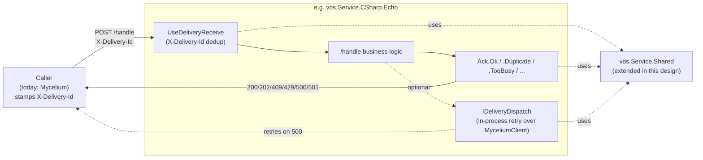

# Microservice host roadmap

This file collects design proposals and roadmap items for the open-source
microservice host and delivery-contract framework that have **not yet been
implemented**. Each section opens with a status line. Once a section ships, move
its description to the relevant topic file (`SERVICES.md`, …) and delete
the entry here.

> **Status legend:** `PROPOSED` (idea, no work item) · `PLANNED` (Feature exists,
> not started) · `IN PROGRESS` (Phase N landing) · `BLOCKED` (waiting on X) ·
> `POSSIBLE` (sketch only, may never happen).

---

## 1. Delivery contract — shared host bootstrap + idempotent receive

> **Status:** `PARTLY SHIPPED`. The host-bootstrap half landed under Feature
> #6167; the delivery-contract half is still `PROPOSED` and needs its own
> Feature before any code lands.
>
> **What shipped**, with the names actually used — the sketch below proposed
> different ones:
>
> | Concern | Shipped as |
> |---|---|
> | Launch settings | `vos.Service.Shared.Configuration.ServiceLaunchSettings`, plus a per-service record for a service's own settings |
> | Serilog file sink | `ServiceHost.ConfigureLogging(serviceName, logFileName, writeToFile)` |
> | `/health`, `/stats`, `/shutdown` | `app.MapHealthAndStats(...)` and `app.MapShutdown(...)` |
> | Registration lifecycle | `builder.Services.AddMyceliumRegistration(serviceName, port)` |
> | `/handle` request routing | `vos.Service.Shared.DagNode.HandleRequestRouter` |
>
> The launch settings also gained something the sketch did not name: every
> setting reads from configuration and the environment, not just the command
> line. Six of the nine services could not do that, which was Bug #6168.
>
> **What has not shipped:** the shared auth extension, in-flight request
> draining on shutdown, `X-Delivery-Id` dedup, the common response envelope,
> and the outbox. Those are what the rest of this section is about.

Every microservice in `VillageOS-API` today (`vos.Service.CSharp.Echo`,
`.Tributary`, `.Delta`, `.Metabolism`) re-implements ~80 lines of host
bootstrap, *and* none of them implement an idempotent delivery contract on the
receive side. That is a real source of silent bugs:

- A caller that retries `POST /handle` with the same intent will register the
  same endpoint twice, produce duplicate observations, or start two simulations
  for one relationship — services cannot tell a retry from a fresh request.
- Services can only respond `200` or `500` in practice, with the occasional
  `400`/`404`/`502`. There is no way to express "this was a duplicate, do not
  retry", "I am overloaded, back off", or "I refuse this permanently".
- The platform polls each handler's `/health` endpoint and may deregister a
  handler it judges unhealthy. Today's services comply with liveness polling
  but not with a common response envelope — Echo returns `requestsProcessed`,
  Tributary returns the bare minimum, Metabolism returns five fields. The
  platform cannot rely on any field beyond `status`.
- Services that need to send follow-up work (e.g. Tributary posting ingested
  observations) do so synchronously via `MyceliumClientBase` with no retry, no
  buffering, and no visibility into failures.

Bootstrap duplication and missing delivery semantics are the same problem
viewed from two angles: there is no shared place that says *"this is what a
VillageOS-API microservice is."*

### 1.1 The recommendation in one line

Extend `vos.Service.Shared` with a new namespace
`vos.Service.Shared.Delivery` that owns the host shape and the
delivery contract. Every `vos.Service.*` project already references
the shared assembly — zero migration friction.

### 1.2 What gets added

| Concern | Today (per-service) | After |
|---|---|---|
| ~~CLI parsing~~ | ~~duplicated `Configuration/CliArgs.cs`~~ | **Shipped** as `ServiceLaunchSettings` — see the status note above |
| ~~Serilog file sink + enrichment~~ | ~~duplicated 12-line block~~ | **Shipped** as `ServiceHost.ConfigureLogging` |
| JWT auth (`AddMyceliumTokenAuth` + `UseAuthentication` + `RequireAuthorization` gating) | 4× duplicated 20-line block | `builder.AddMicroserviceAuth(verificationKey)` + `endpoint.RequireMyceliumAuth()` (no-op when the verification key is absent) |
| ~~`/health`, `/shutdown` endpoints~~ | ~~each service hand-rolls; shapes drift~~ | **Shipped** as `MapHealthAndStats` and `MapShutdown` |
| ~~`RegisterAsync` / `DeregisterAsync` lifecycle~~ | ~~Echo only; pattern hand-rolled~~ | **Shipped** as `AddMyceliumRegistration` |
| In-flight request draining on shutdown | Not implemented anywhere | Built into `UseMyceliumLifecycle`'s stopping hook |
| Idempotent `X-Delivery-Id` dedup | Not implemented anywhere | `app.UseDeliveryReceive()` middleware + `IDeliveryReceiveCache` |
| ACK status semantics (200/202/409/429/500/501) | Returned ad-hoc as 200/400/500 | `Ack.Ok / Accepted / Duplicate / TooBusy / Failed / Refused` helpers |
| Outbound dispatch with retry | None — pure synchronous Mycelium calls | `IDeliveryDispatch` facade with bounded retry-and-backoff |

### 1.3 What stays per-service

- The actual `/handle` body and business logic. The shared project does **not**
  ship a base "do my work" class — every service's domain is too different
  (Echo reads raw bytes; Tributary calls JSONata; Delta walks Mycelium model;
  Metabolism runs background loops).
- The concrete `MyceliumClient` subclass per service. The base
  (`MyceliumClientBase`) already lives in the shared project; concrete subclasses
  with service-specific calls (`CreateThingAsync`, `ApplyQuantityAsync`, …)
  stay in their own projects.
- Service-specific CLI flags. Metabolism's `--mode=consumes|produces` stays in
  `Metabolism/Configuration/MetabolismCliArgs.cs` as a record extending
  `MicroserviceCliArgs`.

### 1.4 The ACK contract

Six semantic ACK kinds with fixed HTTP status codes, exposed as typed result
builders so services cannot accidentally return the wrong code:

```csharp
// Sketch — exact shape for the implementing work item
public static class Ack
{
    public static IResult Ok(object? payload = null);          // 200 — processed
    public static IResult Accepted(object? payload = null);    // 202 — accepted async
    public static IResult Duplicate(Guid deliveryId);          // 409 — idempotent replay; do not retry
    public static IResult TooBusy(int retryAfterSeconds);      // 429 — back off
    public static IResult Failed(string detail);               // 500 — transient; caller may retry
    public static IResult Refused(string reason);              // 501 — permanent; do not retry
}
```

Callers (the platform) interpret the codes per the contract:

| Code | Meaning | Caller behaviour |
|---|---|---|
| 200 / 202 | Success / accepted async | Done. |
| 409 | Idempotent replay — same `X-Delivery-Id` already processed | Treat as success; do not retry. |
| 429 | Throttled — service is at capacity | Back off `Retry-After` seconds, then retry. |
| 500 | Transient failure | Retry per caller's retry policy. |
| 501 | Permanent refusal — request malformed or not supported | Do not retry; surface as permanent failure. |

The schema-validation middleware that already landed currently returns
a generic `{ schemaId, errors[] }` envelope on schema failure. When the Ack
contract here ships, that response shape collapses into `Ack.Refused(...)` (the
501 kind — schema violation is non-retryable by definition). A one-line change
inside the middleware's failure path; no per-service work needed.

### 1.5 Receive-side dedup — `UseDeliveryReceive`

A middleware that sits before the routing pipeline:

1. Read `X-Delivery-Id` header (a `Guid`). If absent, pass through —
   un-tracked legacy callers still work *only if* the route has not opted in via
   `RequireDeliveryId()`. Once a route opts in, missing headers become `400`.
2. Look up the id in `IDeliveryReceiveCache` (default: in-memory LRU,
   configurable size + TTL via `DeliveryReceiveOptions`).
3. **Hit:** return the cached response immediately (status code preserved as
   the original answer). The retry sees the same answer the original got.
   Counter `dedupedRequests++`.
4. **Miss:** invoke the pipeline, capture the response, cache it keyed by
   delivery id.

Per the project's no-backward-compat rule, once Mycelium side starts stamping
`X-Delivery-Id` consistently, `RequireDeliveryId()` becomes the default on
every route in the same PR — the legacy "no header → pass-through" path is
removed at that point.

### 1.6 In-flight draining on shutdown

`UseMyceliumLifecycle`'s `ApplicationStopping` hook does, in order:

1. Waits up to a configurable budget (default 5 s) for in-flight `/handle`
   invocations to complete. New traffic can still arrive during the drain —
   the registration is the broker's to remove, its route being admin-only.
2. After the budget, returns `503 Service Unavailable` to anything still
   pending so the caller can dead-letter cleanly rather than hanging.
3. Finally calls `lifetime.StopApplication()`.

The current per-service `/shutdown` endpoint becomes a thin caller that invokes
the same drain path, so admin-initiated shutdown and pod termination behave
identically.

### 1.7 Outbound dispatch — `IDeliveryDispatch`

For services that emit follow-up messages (e.g. Tributary posting ingested
observations), expose a thin facade:

```csharp
public interface IDeliveryDispatch
{
    Task EnqueueAsync(string targetServiceName, object payload, CancellationToken ct);
}
```

**v1 implementation:** in-process queue with bounded retry-and-backoff over
`MyceliumClientBase`. No persistence; if the service crashes, anything not yet
delivered is lost — same guarantee as synchronous calls today, but with
retries for transient failures.

**Future (only if a real need surfaces):** a persistent variant of the queue
(file-backed or LiteDB) lands as a second `IDeliveryDispatch` implementation in
the same project. Service code does not change; DI registration picks the
variant.

### 1.8 Health envelope (fixed shape)

Health endpoint composes a fixed envelope with optional service extras,
suitable for the platform's liveness polling:

```jsonc
{
  "status": "Healthy",                  // shared — only field the platform reads
  "service": "Echo",                    // shared — from serviceName
  "uptimeSeconds": 1234,                // shared
  "requestsReceived": 42,               // shared — incremented by middleware
  "dedupedRequests": 3,                 // shared — from receive cache
  "lastRequestUtc": "2026-05-12T...",   // shared
  "extras": { "activeSimulations": 7 }  // service-supplied callback
}
```

Stops the current shape drift across Echo, Tributary, Delta, and Metabolism
and gives the platform's liveness polling a single shape to scrape — without
breaking existing pollers, which only read `status`.

### 1.9 DI surface — the whole adoption diff

A microservice's `Program.cs` after adoption:

```csharp
// Sketch — the goal is "every microservice looks like this"
var args = MicroserviceCliArgs.Parse<MyArgs>(rawArgs)
    ?? Environment.Exit(1);

var builder = WebApplication.CreateBuilder(rawArgs)
    .AddMicroserviceLogging(serviceName: "MyService")
    .AddMicroserviceAuth(args.VerificationKey)
    .AddMicroserviceBrokerClient<MyMyceliumClient>(args);
builder.Services.AddContractValidation();   // already landed

var app = builder.Build()
    .UseMyceliumAuth()
    .UseRequestContractValidation()         // already landed
    .UseDeliveryReceive()
    .UseMyceliumLifecycle(serviceName: "MyService", startCommand: "endpoint-service");

app.MapStandardEndpoints("MyService");

app.MapPost("/handle", async (MyRequest req, MyMyceliumClient Mycelium) =>
    await MyService.HandleAsync(req, Mycelium))
   .RequireMyceliumAuth()
   .RequireContract<MyRequest>()             // already landed
   .RequireDeliveryId();

app.Run();
```

Compared to today's ~80-line bootstrap, that's roughly 12 lines and the
delivery contract is satisfied for free.

### 1.10 Migration phases

Per the no-backward-compatibility rule, atomic per-service PRs.

| Phase | What happens | Verifies |
|---|---|---|
| A | Add the new namespace `vos.Service.Shared.Delivery` with bootstrap extensions, ACK helpers, dedup middleware, `MicroserviceCliArgs`. No service consumes it yet. | `dotnet build` clean; new unit tests for `Ack.*` and the dedup middleware pass. |
| B | Migrate Echo (smallest, also the only one that already does lifecycle). Echo's `Program.cs` shrinks to the §1.9 shape. Echo's `Configuration/CliArgs.cs` is deleted. Update `SERVICES.md` code samples in the same PR — the doc must not describe a half-truth. | Existing Echo tests pass; new test asserts duplicate `X-Delivery-Id` returns the cached body. |
| C | Migrate Delta, Tributary, Metabolism — one PR each. Each PR also lands the §1.4 ACK status codes for that service's failure modes (e.g. Delta returns `409` when the requested endpoint thing already exists; Metabolism returns `429` when at simulation cap). | Per-service tests updated. |
| D | `IDeliveryDispatch` lands when a service first needs it (likely Tributary's observation-ingest path). v1 in-process retry implementation. | Contract tests for retry-on-500, no-retry-on-501, no-retry-on-409. |
| E | (Optional, future) Persistent `IDeliveryDispatch` variant if a real durability requirement appears. | New impl passes the same contract tests as v1 plus a crash-recovery test. |

### 1.11 Rejected alternative — base class for services

A `MicroserviceProgramBase` with `protected abstract Task<IResult> HandleAsync(...)`
and a `Run()` that wires everything.

**Why rejected:** ASP.NET Core minimal-host idioms are explicitly *not*
inheritance-based. Forcing services into a class hierarchy fights the framework,
complicates DI registration, and makes the per-service `/handle` signature
inflexible (Echo reads raw bytes; Metabolism takes a record; Tributary takes a
different record). Extension methods compose; inheritance would force a single
shape on everyone. Recorded so future readers know it was considered.

### 1.12 Tests the shared project must ship

- `Ack.*` returns the correct status code, content type, and body shape for each
  of the six ACK kinds.
- `UseDeliveryReceive`: missing header → pass-through (during migration); with
  header & cache miss → invokes pipeline & caches; with header & cache hit →
  returns cached response without invoking pipeline; cache honors LRU eviction
  at configured size; cache honors TTL.
- `RequireDeliveryId()`: returns `400` when header is absent.
- `UseMyceliumLifecycle` startup: calls `RegisterAsync`; logs registration result.
- `UseMyceliumLifecycle` shutdown: waits for in-flight requests; forces `503`
  past the drain budget; calls `StopApplication`.
- `MapStandardEndpoints`: `/health` returns the §1.8 shape with service extras
  merged in; `/shutdown` triggers the same drain path as pod termination.
- `MicroserviceCliArgs.Parse<T>`: validates required flags; rejects bad ports;
  honors service-specific subclass flags (test fixture: a `--mode` flag via a
  `MetabolismCliArgs` subclass).
- `IDeliveryDispatch` (when Phase D lands): retries on `500`, gives up on `501`,
  treats `409` as success.

### 1.13 Sequence at a glance



### 1.14 Open questions

1. **Receive-side dedup cache pluggability.** In-memory only is fine for now
   (single-process services). Pluggable `IDeliveryReceiveCache` is planned but
   the only adapter shipped in v1 is in-memory LRU.
2. **`/stats` endpoint.** Echo and Metabolism have it; Tributary and Delta
   don't. Drop it from the standard set, or fold it into `/health` as `extras`?
   Recommendation: fold; one less surface.
3. **Cross-service shared `MyceliumClient`?** Each service's `MyceliumClient` today
   extends `MyceliumClientBase` with service-specific calls. This design does not
   try to unify these — that's a separate refactor.
4. **When (if ever) does Phase E land?** Persistent outbound queue is only
   worth building if a real durability requirement surfaces. Until then,
   in-process retry is enough. Don't build it speculatively.

---

## 2. DI refactors still on the table

Two of the three targeted DI items shipped and are no longer roadmap items:
item 1 (Metabolism `Program.cs` DI alignment) and item 3
(`IEndpointSeedProvider` for Delta).

### 2.1 Metabolism live-change consumption (done)

> **Status:** `DONE`. Metabolism consumes live changes over the shared
> `SubscriptionClient` (SSE), driven by `MetabolismSubscriptionService` — plain
> `HttpClient` + an `IAsyncEnumerable` change stream, directly testable by feeding
> events through the hosted service. See `docs/METABOLISM.md` for the design.

### 2.2 `vos.Taproot` gets a `HostBuilder`

> **Status:** `PROPOSED` for discussion — not to be implemented yet. This is a
> significant refactor. Captured here so the option is documented and the
> rationale is preserved; implementation should be its own Feature with its own
> Tasks.

**Today.** `vos.Taproot` uses a plain `static void Main` entry point with manual
command-handler construction. Several rough edges fall out of that:

- `vos.Taproot.MyceliumClient` is unit-testable only via an `internal`
  HttpClient-injection constructor plus `InternalsVisibleTo`.
- `Program` shows 0 % coverage in the snapshot. The entry-point exclusion is
  honest — there's no shell to test, just a `Main` that wires things up — but
  a `HostBuilder` makes `Program` a thin bootstrap that *can* be touched by
  integration tests if the bootstrap logic ever becomes non-trivial.
- Configuration is parsed by hand. `ConsoleOptions.Parse` reads
  `VOS_MYCELIUM_URL` / `VOS_API_KEY` env vars directly via
  `Environment.GetEnvironmentVariable`.
- Logging happens through `Console.WriteLine` rather than `ILogger`, so output
  is hard to capture or route in tests.
- `vos.Taproot.Tests/CliEnvVarCollection.cs` exists exclusively to serialize tests
  that mutate those env vars — the same family of problem that microservice
  `EnvVarScope` helpers solved, but rooted in the CLI's own production
  interface.

**Sketch.**

```csharp
public static async Task<int> Main(string[] args)
{
    var builder = Host.CreateApplicationBuilder(args);
    builder.Services.AddHttpClient();
    builder.Services.AddSingleton<IMyceliumClient, MyceliumClient>();
    builder.Services.AddSingleton<CommandHandler>();
    builder.Services.AddSingleton<CommandParser>();
    // ... etc per command handler

    var host = builder.Build();
    var repl = ActivatorUtilities.CreateInstance<Repl>(host.Services);
    return await repl.RunAsync();
}
```

`Repl` becomes a real testable type that takes its dependencies via
constructor; the REPL loop runs on the main thread after `host.Start()` (host
services live for the duration of the REPL).

**Benefits.**

- Drops the `InternalsVisibleTo` + internal-ctor hack on `MyceliumClient`.
- `IConfiguration` picks up env vars automatically — `VOS_MYCELIUM_URL` /
  `VOS_API_KEY` continue to work without `ConsoleOptions` parsing them by hand.
  Tests inject overrides via `host.Services.GetRequiredService<IConfiguration>`
  substitution, no process-environment mutation.
- `CliEnvVarCollection` can be deleted. `WorkingDirectoryCollection` cannot: `pwd` and `cd` move the
  real process working directory, which is one value per process and reachable through no
  configuration a test could substitute, so the classes exercising them stay serialized.
- `ILogger<T>` replaces `Console.WriteLine` everywhere output is structured
  (errors, diagnostics). Direct `Console.WriteLine` stays only where the REPL
  is writing user-visible prompts.

**Costs and open questions.**

- The REPL is interactive — `Host.Run()` blocks, so the REPL has to be either
  a hosted service or run on the main thread after `host.Start()` with
  `host.StopAsync()` on exit. Both work; need to pick one.
- The existing CLI test suite constructs handlers directly with `new`.
  Migrating each to DI is mechanical but touches many files.
- Public API decision: should `MyceliumClient` get an `IMyceliumClient` interface?
  Today tests Moq the concrete class.
- `ConsoleOptions` has its own test suite. Decide whether to keep it as a thin
  façade over `IConfiguration` or replace it entirely.

**When to do this.** Don't bundle — this Feature stands alone
and reviewers should evaluate it on its own merits.

---

## 3. Contract validation — possible later phases

Phases 1–4 of contract validation have shipped. See `SERVICES.md` §9 for
the landed surface. Two further phases were sketched but not scheduled:

### 3.1 Phase 5 — GUI runtime validation

> **Status:** `POSSIBLE`. No work item.

TS types generated from the same JSON Schemas; opt-in dev-only validation in
the React app. Would catch Mycelium-shape regressions before they reach the
user; the cost is a TS codegen step in the GUI build and a runtime dependency
on a JSON-Schema validator (e.g. `ajv`).

### 3.2 Phase 6 — CI drift gate

> **Status:** `POSSIBLE`. No work item.

`Tools/Test-ContractDrift.ps1` would fail the build if any DTO drifts from its
schema (C# record fields ↔ schema `properties` + `required` out of sync).
Catches the mismatch at PR review time instead of at runtime; replaces today's
"the test that loads the schema happens to pass" implicit check.

---

## 4. What is deliberately NOT here

The codebase has several static helpers (`JsonValueCoercion`,
`JsonValueUnwrapper`, `EffectivePropertyResolver`, `EndpointSeedLoader.LoadGraph`)
that look DI-shaped but shouldn't be. They're pure functions with no
dependencies and no lifetime, already 100 % covered by direct unit tests;
turning them into services would add ceremony with no testing benefit.

`Serilog.Log.Logger` is intentionally a static global for bootstrap logging
(before the host is built and `ILogger<T>` is available). It coexists with
`Microsoft.Extensions.Logging` once the host is up. No change needed.

`CliArgs` is a static `Parse` — input goes in, output comes out, no
dependencies. Routed through `IConfiguration` for the env-var fallback, which
is the right shape; the `Parse` method itself is correctly a pure static.

## 5. Multi-tenant model routing for endpoint daemons (out of scope)

How a hosted endpoint service's write-backs are routed to the correct tenant
model is a private platform (Mycelium-side) concern, not part of the
open-source microservice-host contract. The delivery contract a microservice
implements is identical regardless of how the platform isolates tenants, so the
routing mechanism is deliberately out of scope for this roadmap.
