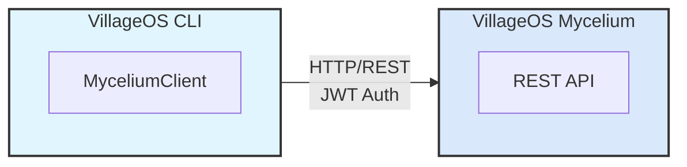

# VillageOS Taproot (CLI) — User Guide

## Table of Contents

- [Introduction](#introduction)
- [Getting Started](#getting-started)
- [Configuration](#configuration)
- [Command Reference](#command-reference)
- [Working with Things](#working-with-things)
- [Working with Relationships](#working-with-relationships)
- [Querying the Model](#querying-the-model)
- [Reactive-Engine Capacity](#reactive-engine-capacity)
- [Snapshot Read Cost](#snapshot-read-cost)
- [Microservice Management](#microservice-management)
- [Model Import/Export](#model-importexport)
- [Testing](#testing)
- [Troubleshooting](#troubleshooting)

## Introduction

The VillageOS CLI is an interactive command-line interface for managing VillageOS temporal graph models. It communicates with the VillageOS Mycelium via HTTP API, providing a convenient way to:

- Create and manage Things (entities) and their properties
- Define Relationships between Things
- Query the model for statistics and data
- Import/export model data as JSON

### Architecture

The CLI operates as a remote client to the VillageOS Mycelium:



All operations are performed remotely on the Mycelium's model.

## Getting Started

### Prerequisites

- .NET 10.0 SDK or later
- A running VillageOS Mycelium instance

### Starting the CLI

**1. Start the Mycelium first.** Mycelium (`vos.Mycelium`) lives in the **VillageOS** repository, not this one — run it from there (see the [VillageOS API Wiki](https://dev.azure.com/ReGenVillages/VillageOS-API/_wiki) for the Mycelium Guide). It listens on `https://localhost:7243` by default.

**2. In a new terminal, start the CLI.** It needs an API key, which it reads from `VOS_API_KEY` — see [Authentication](#authentication) for where to get one:

```bash
export VOS_API_KEY=vos_ak_...
cd vos.Taproot
dotnet run
```

**Expected output:**

```text
VillageOS CLI - Connected to Mycelium at https://localhost:7243
Type 'help' to see available commands.
Successfully authenticated with Mycelium.

>
```

### Interactive Features

The CLI runs in interactive mode with the following features:

- **Command History**: Use the **Up/Down arrow keys** to recall previous commands
- **Line Editing**: Standard line editing with arrow keys, backspace, delete, home, end
- **Command history persists** during your session (cleared when you exit)

### Your First Commands

```bash
# Create a thing
> create thing Forest

# List all things
> list things

# Get help
> help

# Exit the CLI
> exit
```

## Configuration

### Authentication

The CLI requires an API key to communicate with Mycelium. On first Mycelium start, the admin user and a default API key are written to `bootstrap-credentials.txt` (mode 0600) in Mycelium's data directory — credentials are **never** logged. Copy the API key from that file. You can create additional keys via the `POST /api/auth/keys` endpoint after signing in as `admin` (its password comes from `VOS_ADMIN_PASSWORD`, or is the random one recorded in `bootstrap-credentials.txt`).

Provide the API key in the `VOS_API_KEY` environment variable:

```bash
export VOS_API_KEY=vos_ak_...
dotnet run
```

There is no command-line argument for the key, and passing one authenticates nothing. A command line is readable by every process on the host for as long as the program runs, and the shell writes it to its history file — an interactive session lasts as long as you are working, and an API key keeps working until somebody revokes it.

The API key is exchanged for a short-lived JWT via `POST /api/auth/token` with `X-API-Key` header. Tokens are cached for 4 minutes and refreshed automatically.

### Mycelium URL

The CLI needs to know where the Mycelium is running. You can configure this in three ways:

**1. Command-line argument (highest priority):**

```bash
dotnet run -- --mycelium-url=https://mybroker:8443
# or
dotnet run -- --mycelium=https://mybroker:8443
```

**2. Environment variable:**

```bash
export VOS_MYCELIUM_URL=https://mybroker:8443
dotnet run
```

**3. Default:**
If neither is specified, the CLI uses `https://localhost:7243`

### Priority Order

For the Mycelium URL: command-line args > environment variable > default. The API key has no command-line form, so `VOS_API_KEY` is the only source.

### TLS Validation

The CLI validates the broker's TLS certificate by default. For local development against a
self-signed certificate, set `VOS_INSECURE_TLS=true` to bypass validation. **Never set this in
production** — it disables protection against man-in-the-middle attacks.

## Command Reference

### Quick Reference

| Command | Description |
|---------|-------------|
| `help` | Show available commands |
| `exit` | Exit the CLI |
| `create thing <name>` | Create a new thing |
| `create property <thing> <name> <type> <value>` | Add property |
| `create relation <subj> <pred> <target>` | Create relationship |
| `retype <thing> <new-archetype>` | Repoint a Thing's `is`-edge to a different archetype |
| `rename <thing> <new-name>` | Rename a Thing in place, keeping its Id and all edges (the new name may contain spaces) |
| `delete thing <thing>` | Delete a thing |
| `delete relationship <id>` | Delete a relationship |
| `delete property <thing> <name>` | Delete a property |
| `get thing <thing>` | Get thing details |
| `set <thing> <name> <value>` | Set property value |
| `find thing <pattern>` | Find things by name |
| `find relationships <thing>` | Find relationships for thing |
| `list things` | List all things |
| `list relations` | List all relationships |
| `list predicates` | List all predicates |
| `list handlers` | List every connection bound to a service, with the executable, run mode and trigger the platform resolves for it |
| `list services` | List all registered services (running state, health, and daemon PID shown inline) |
| `list agents` | Alias for `list services` |
| `start service <handler>` | Start a registered microservice's daemon |
| `stop service <handlerId>` | Stop a running microservice's daemon |
| `clear model` | Clear all things and relationships |
| `shutdown` | Shut down Mycelium |
| `query property <name> <value>` | Find by property |
| `query predicate <name>` | Find relationships by predicate |
| `query stats` | Show statistics |
| `temporal snapshot [timestamp]` | Get model snapshot at time |
| `temporal at <thing> <timestamp>` | Get thing state at time |
| `temporal history <thing> <prop>` | Get property version history |
| `temporal mutations [target] [start] [end]` | Get property mutations |
| `range create <thing> <name> <criteria>` | Create an expected range |
| `range list <thing>` | List ranges for a thing |
| `range get <thing> <name>` | Get a specific range |
| `range delete <thing> <name>` | Delete a range |
| `range validate <criteria>` | Validate criteria syntax |
| `state <thing>` | Get current states for a thing |
| `state query <state-name>` | Find the things in a state (the kinds they `is` are left out) |
| `engines [ranges\|rollups]` | Reactive-engine totals; drill in to per-reactor detail |
| `snapshots` | What snapshot reads cost against the writers: resolutions served, taken again, and forced to take the lock |
| `serialize [file]` | Export model to JSON |
| `seed [file]` | Alias for serialize |
| `deserialize <file>` | Import model from JSON |
| `plant <file>` | Alias for deserialize |
| `apply <file.json>` | Upsert a fragment (Things + Relationships) into the live model |
| `submissions list` | What has arrived in this model: when, what it proposes, and what has been decided about it |
| `submissions reject <submission>` | Move a submission to a disposable state |
| `submissions promote <submission> <template> <predicates> <project name>` | Copy a submission into a project model of its own, built from a template. `<predicates>` is a comma-separated list saying what belongs with the site — the model's vocabulary, named rather than assumed. The project name takes the rest of the line, so it may contain spaces; the submission must therefore be given as an identifier here. Promoting twice produces one project |
| `submissions dispose <predicates>` | The retention pass: clear every rejected submission whose period has run, taking everything it minted with it. The period is the disposition's (`daysBeforeColdStorage`), counted from when the submission was decided about. One nobody has decided about is kept indefinitely, and so is one resolved to a disposition naming no period. `<predicates>` is the same list `promote` takes; the predicate reaching the proposed site is added to it |
| `ingest <file.ifc> [--new]` | Upload an IFC to the Xylem service to build or merge the model |
| `pwd` | Show current directory |
| `cd <path>` | Change directory |

**Note:** Where `<thing>`, `<subj>`, `<pred>`, or `<target>` appears, you can use either a GUID or a unique name. Names are case-insensitive. If a name is ambiguous (multiple things have the same name), you must use the GUID.

**Note:** The review commands — `list`, `reject` and `promote` — have a page of their own in Trellis, [Reviewing what has arrived](TRELLIS.md#87-reviewing-what-has-arrived). It reads the same model the same way and calls the same two actions, so a staging model can be worked from a browser or from here. `submissions dispose` has no page: the retention pass is run from here.

### Output Options

All commands support the `--showguids` (or `-g`) flag to include GUIDs in the output. By default, output shows human-friendly names only.

| Flag | Description |
|------|-------------|
| `--showguids` | Show GUIDs alongside names in command output |
| `-g` | Short form of `--showguids` |

**Examples:**

```bash
# Default output (names only)
> list things
Things (3):
  Forest
  Watershed
  part_of

# With --showguids flag
> list things --showguids
Things (3):
  Forest (3fa85f64-5717-4562-b3fc-2c963f66afa6)
  Watershed (7c9e6679-7425-40de-944b-e07fc1f90ae7)
  part_of (9b1deb4d-3b7d-4bad-9bdd-2b0d7b3dcb6d)

# Short form works too
> list things -g
```

The flag can be placed anywhere in the command:

```bash
> list --showguids things
> --showguids list things
> list things --showguids
```

All commands that display things, relationships, or services support this flag:

- `list things`, `list relations`, `list predicates`, `list handlers`, `list services`
- `find thing`, `find relationships`
- `create thing`, `create relation`, `create property`
- `delete thing`, `delete relationship`, `delete property`
- `get thing`
- `set`
- `query property`, `query predicate`
- `start service`, `stop service`

### Name Resolution

Most commands that accept a thing ID also accept a thing name. The CLI resolves names as follows:

1. **GUID Check**: If the input is a valid GUID, it's used directly
2. **Name Lookup**: Otherwise, the CLI searches for things with that exact name (case-insensitive)
3. **Uniqueness Check**: If multiple things have the same name, an error is shown listing the matching IDs

**Examples:**

```bash
# Using GUID (always works)
> get thing 3fa85f64-5717-4562-b3fc-2c963f66afa6

# Using unique name (convenient)
> get thing Forest

# When a name is ambiguous
> get thing Tree
Error: Ambiguous name 'Tree': found 2 things with this name. Use the ID instead:
  3fa85f64-5717-4562-b3fc-2c963f66afa6 - Tree
  7c9e6679-7425-40de-944b-e07fc1f90ae7 - Tree
```

### Property Types

When creating properties, use these type names:

| Type | VOS Type | Example |
|------|----------|---------|
| `string` | vos.String | "Hello" |
| `int` | vos.Integer | 42 |
| `long` | vos.LongInteger | 9999999999 |
| `double` | vos.Double | 3.14 |
| `float` | vos.Float | 2.5 |
| `decimal` | vos.Decimal | 99.99 |
| `bool` | vos.Boolean | true |
| `datetime` | vos.DateTime | "2025-01-30" |
| `guid` | vos.Guid | "550e8400-e29b-41d4-a716-446655440000" |

## Working with Things

### Creating Things

```bash
# Create a simple thing
> create thing Forest
Created Thing: Forest

# Create another thing
> create thing Watershed
Created Thing: Watershed

# With --showguids to see the ID
> create thing Meadow --showguids
Created Thing: Meadow (aabbccdd-1122-3344-5566-778899aabbcc)
```

### Adding Properties

```bash
# Using the thing name
> create property Forest biomeType string Temperate

# Using the thing GUID
> create property 3fa85f64-5717-4562-b3fc-2c963f66afa6 carbonLevel int 30
```

### Getting Thing Details

```bash
# Using name — prints the thing as indented JSON
> get thing Forest
{
  "Id": "3fa85f64-5717-4562-b3fc-2c963f66afa6",
  "Name": "Forest",
  "Properties": {
    "biomeType": "Temperate",
    "carbonLevel": 30
  }
}

# Using GUID also works
> get thing 3fa85f64-5717-4562-b3fc-2c963f66afa6
```

### Setting Property Values

```bash
# Using name
> set Forest carbonLevel 35
Set carbonLevel = 35 on Forest

# Using GUID
> set 3fa85f64-5717-4562-b3fc-2c963f66afa6 carbonLevel 40

# With --showguids
> set Forest carbonLevel 45 --showguids
Set carbonLevel = 45 on Forest (3fa85f64-5717-4562-b3fc-2c963f66afa6)
```

### Finding Things

```bash
# Find by name pattern (case-insensitive)
> find thing forest
Found 1 thing(s) matching 'forest':
  Forest

# Find with partial match
> find thing For
Found 1 thing(s) matching 'For':
  Forest

# With --showguids to see IDs
> find thing For --showguids
Found 1 thing(s) matching 'For':
  Forest (3fa85f64-5717-4562-b3fc-2c963f66afa6)
```

### Listing Things

```bash
# Default output (names only)
> list things
Things (3):
  Forest
  Watershed
  part_of

# With --showguids to see IDs
> list things --showguids
Things (3):
  Forest (3fa85f64-5717-4562-b3fc-2c963f66afa6)
  Watershed (7c9e6679-7425-40de-944b-e07fc1f90ae7)
  part_of (9b1deb4d-3b7d-4bad-9bdd-2b0d7b3dcb6d)
```

### Deleting Things

```bash
# Using name
> delete thing Forest
Deleted thing Forest

# Using GUID
> delete thing 3fa85f64-5717-4562-b3fc-2c963f66afa6
Deleted thing Forest

# With --showguids
> delete thing Forest --showguids
Deleted thing Forest (3fa85f64-5717-4562-b3fc-2c963f66afa6)
```

### Deleting Properties

```bash
# Using name for thing
> delete property Forest carbonLevel
Deleted property 'carbonLevel' from thing 'Forest'

# Using GUID for thing
> delete property 3fa85f64-5717-4562-b3fc-2c963f66afa6 carbonLevel
Deleted property 'carbonLevel' from thing 'Forest'

# With --showguids
> delete property Forest carbonLevel --showguids
Deleted property 'carbonLevel' from thing 'Forest' (3fa85f64-5717-4562-b3fc-2c963f66afa6)
```

## Working with Relationships

### Understanding Relationships

Relationships in VillageOS follow the Subject-Predicate-Target pattern:

```text
Subject --[Predicate]--> Target
Forest  --[part_of]-->   Watershed
```

All three parts (Subject, Predicate, Target) are Things. The Predicate defines the type of relationship.

### Creating Relationships

**Step 1: Create the predicate thing:**

```bash
> create thing part_of
Created thing: part_of (id: 9b1deb4d-3b7d-4bad-9bdd-2b0d7b3dcb6d)
```

**Step 2: Create the relationship using names:**

```bash
# Using names (convenient)
> create relation Forest part_of Watershed
Created Relationship: Forest --[part_of]--> Watershed

# Using GUIDs (also works)
> create relation 3fa85f64-5717-4562-b3fc-2c963f66afa6 9b1deb4d-3b7d-4bad-9bdd-2b0d7b3dcb6d 7c9e6679-7425-40de-944b-e07fc1f90ae7
Created Relationship: Forest --[part_of]--> Watershed
```

### Listing Relationships

```bash
# Default output (names only)
> list relations
Relationships (1):
  Forest --[part_of]--> Watershed

# With --showguids
> list relations --showguids
Relationships (1):
  Forest (3fa85f64-5717-4562-b3fc-2c963f66afa6) --[part_of]--> Watershed (7c9e6679-7425-40de-944b-e07fc1f90ae7)
  [rel: abc123ef-5678-4321-abcd-ef1234567890]
```

### Finding Relationships

```bash
# Find all relationships for a thing by name
> find relationships Forest
Relationships for thing 'Forest':
  As Subject (1):
    Forest --[part_of]--> Watershed
  As Target (0):
    (none)

# Using GUID also works
> find relationships 3fa85f64-5717-4562-b3fc-2c963f66afa6

# With --showguids for full details
> find relationships Forest --showguids
Relationships for thing 'Forest' (3fa85f64-5717-4562-b3fc-2c963f66afa6):
  As Subject (1):
    Forest (3fa85f64-5717-4562-b3fc-2c963f66afa6) --[part_of]--> Watershed (7c9e6679-7425-40de-944b-e07fc1f90ae7)
  As Target (0):
    (none)
```

### Listing Predicates

```bash
# list predicates reports usage counts; it does not take --showguids
> list predicates
Predicates (3):
  part_of (used in 2 relationship(s))
  adjacent_to (used in 1 relationship(s))
  contains (used in 1 relationship(s))
```

### Deleting Relationships

```bash
> delete relationship <relationship-id>
Deleted relationship

# With --showguids the deleted ID is printed
> delete relationship <relationship-id> --showguids
Deleted <relationship-id>
```

## Querying the Model

### Query by Property Value

```bash
# Find all things with a specific property value
> query property biomeType Temperate
Found 2 thing(s) with biomeType = 'Temperate':
  Forest
  Meadow

# With --showguids
> query property biomeType Temperate --showguids
Found 2 thing(s) with biomeType = 'Temperate':
  Forest (3fa85f64-5717-4562-b3fc-2c963f66afa6)
  Meadow (aabbccdd-1122-3344-5566-778899aabbcc)
```

### Model Statistics

```bash
> query stats
Model Statistics:
  Things: 15
  Relationships: 8
  Properties: 42
  Predicates: 4
    - part_of: 3 relationships
    - adjacent_to: 2 relationships
    - contains: 2 relationships
    - is: 1 relationship
```

### Temporal Queries

The CLI provides commands to query the temporal state of the model—viewing data as it existed at specific points in time.

#### Getting a Model Snapshot

Get the complete model state at a specific point in time:

```bash
# Current snapshot (equivalent to 'now')
> temporal snapshot
{
  "Timestamp": "2026-02-06T12:00:00Z",
  "Things": [...],
  "Relationships": [...]
}

# Snapshot at specific time
> temporal snapshot 2026-01-15T12:00:00Z

# Using 'now' explicitly
> temporal snapshot now
```

#### Getting a Thing's State at a Time

View a thing's properties and relationships as they existed at a specific time:

```bash
# Current state (using name)
> temporal at Forest now
{
  "Id": "3fa85f64-5717-4562-b3fc-2c963f66afa6",
  "Name": "Forest",
  "Timestamp": "2026-02-06T12:00:00Z",
  "Properties": {"carbonLevel": 30, "biomeType": "Temperate"},
  "OutgoingRelationships": [...],
  "IncomingRelationships": [...]
}

# State at specific time (using ID)
> temporal at 3fa85f64-5717-4562-b3fc-2c963f66afa6 2026-01-15T12:00:00Z
```

#### Viewing Property Version History

Get the change history of a property. Naming no time range asks for everything still kept:

```bash
# Full history using thing name
> temporal history Forest carbonLevel
{
  "ObjectId": "3fa85f64-5717-4562-b3fc-2c963f66afa6",
  "PropertyName": "carbonLevel",
  "StartTime": "0001-01-01T00:00:00",
  "EndTime": "9999-12-31T23:59:59.9999999",
  "Versions": [
    {"Timestamp": "2026-01-01T10:00:00Z", "Value": 25},
    {"Timestamp": "2026-01-15T14:30:00Z", "Value": 30},
    {"Timestamp": "2026-02-01T09:00:00Z", "Value": 35}
  ]
}

# History within specific time range (using ID)
> temporal history 3fa85f64-5717-4562-b3fc-2c963f66afa6 carbonLevel 2026-01-01T00:00:00Z 2026-01-31T23:59:59Z
```

#### Viewing Property Mutations

Get a log of all property value changes (mutations) across the model, for a specific thing, or for a relationship:

```bash
# All mutations in the model — naming no window asks about every instant on both sides
> temporal mutations
{
  "StartTime": "0001-01-01T00:00:00",
  "EndTime": "9999-12-31T23:59:59.9999999",
  "ThingMutations": {
    "3fa85f64-5717-4562-b3fc-2c963f66afa6": {
      "ObjectId": "3fa85f64-5717-4562-b3fc-2c963f66afa6",
      "ObjectName": "Forest",
      "Mutations": [
        {"Timestamp": "2026-01-15T10:00:00Z", "PropertyName": "carbonLevel", "OldValue": 25, "NewValue": 30}
      ]
    }
  },
  "TotalMutations": 5
}

# Mutations for a specific thing (by name or ID)
> temporal mutations Forest
> temporal mutations thing Forest
> temporal mutations 3fa85f64-5717-4562-b3fc-2c963f66afa6
> temporal mutations thing 3fa85f64-5717-4562-b3fc-2c963f66afa6

# Mutations for a relationship (by ID only)
> temporal mutations rel 7c9e6679-7425-40de-944b-e07fc1f90ae7
> temporal mutations relationship 7c9e6679-7425-40de-944b-e07fc1f90ae7

# Mutations within a time range
> temporal mutations 2026-01-01T00:00:00Z 2026-01-31T23:59:59Z
> temporal mutations thing Forest 2026-01-01T00:00:00Z 2026-01-31T23:59:59Z
```

**Mutation targets:**

- `model` (or omit) - All mutations across the entire model
- `<name>` or `<guid>` - Mutations for a thing by name or ID
- `thing <name>` - Explicit thing mutations (by name or ID)
- `rel <id>` or `relationship <id>` - Mutations for a relationship (ID only)

#### Timestamp Format

All timestamps use ISO 8601 format: `YYYY-MM-DDTHH:mm:ssZ`

Examples:

- `2026-01-15T12:30:00Z` (UTC)
- `2026-01-15T12:30:00-05:00` (with timezone offset)
- `now` (current time)

**Important:** All timestamps in VillageOS are stored and compared using UTC. When querying without explicit timestamps, the default range is one year ago (UTC) to now (UTC). This ensures consistent behavior regardless of the server's local timezone.

**Note:** Property history requires properties to be in `FullHistory` mode. Properties in `CurrentOnly` mode do not maintain history.

## Expected Ranges & States

Expected ranges are named predicates that describe conditions on a thing's properties. When a range's criteria evaluates to true, the thing is considered to be "in that state". This enables emergent state tracking based on property values.

### Creating Ranges

Create an expected range on a thing with the `range create` command:

```bash
# Basic range with criteria
> range create Sensor overheating "temp > 100"
{
  "Name": "overheating",
  "Criteria": "temp > 100",
  "IsInherited": false
}

# Range with property and bounds
> range create Sensor nominal "temp >= 20 AND temp <= 80" --property temp --bounds-min 20 --bounds-max 80
{
  "Name": "nominal",
  "Criteria": "temp >= 20 AND temp <= 80",
  "Property": "temp",
  "BoundsDescription": "[20, 80]",
  "IsInherited": false
}
```

**Options:**

- `--property <name>` - Property this range describes (for deviation reporting)
- `--bounds-min <val>` - Minimum numeric bound
- `--bounds-max <val>` - Maximum numeric bound

### Criteria DSL

The criteria DSL supports various expressions:

| Expression | Example | Description |
|------------|---------|-------------|
| Comparison | `temp > 100` | Compare property to value |
| AND/OR | `temp > 100 AND rpm < 5000` | Logical operators |
| NOT | `NOT status = 'off'` | Negation |
| IN | `status IN ('active', 'pending')` | Membership test |
| MATCHES | `name MATCHES '^Sensor.*'` | Regex pattern match |
| IS KNOWN | `pctOfConsumption IS KNOWN` | The reference produced a value — any value, including zero |
| IS UNKNOWN | `pctOfConsumption IS UNKNOWN` | It produced none: no value, no such property, or an empty collection |
| Related ref | `[connected_to.Generator].temp > 50` | Related thing property |
| State check | `[powered_by].state HAS 'running'` | Check related thing's state |

`MATCHES` against a number turns the value into text in one fixed format first, so write the pattern with a
dot decimal separator — `area MATCHES '^120\.5$'`. A comma never appears, whatever regional settings the
server runs under.

`IS KNOWN` is the only test that asks whether a value is there rather than what it is. Every other
comparison reads an absent value as not satisfied, so a range over a property nothing has written reports the
same definite negative as one over a property that was written and fell short. Where that distinction
matters, guard the verdict and give the unanswered case a range of its own, so it becomes a state a reader
can see:

```bash
> range create "Site Study" EnergyNetPositive "pctOfConsumption IS KNOWN AND pctOfConsumption >= 100"
> range create "Site Study" EnergyNotAssessed "pctOfConsumption IS UNKNOWN"
```

**Examples:**

```bash
# Simple comparison
> range create Motor running "rpm > 0"

# Compound expression
> range create Motor stressed "temp > 80 AND rpm > 5000"

# Using related things
> range create Pump overloaded "[powered_by.Motor].stressed = true"

# State inheritance check
> range create System healthy "ALL [contains].state HAS 'nominal'"
```

### Validating Criteria

Validate criteria syntax without creating a range:

```bash
> range validate "temp > 100 AND rpm < 5000"
Criteria is valid.

> range validate "temp >> 100"
Invalid criteria: Parse error at position 5: Unexpected character '>'
```

### Listing Ranges

```bash
> range list Sensor
{
  "ObjectId": "3fa85f64-5717-4562-b3fc-2c963f66afa6",
  "ObjectName": "Sensor",
  "OwnRanges": [
    {"Name": "overheating", "Criteria": "temp > 100"},
    {"Name": "nominal", "Criteria": "temp >= 20 AND temp <= 80"}
  ],
  "InheritedRanges": []
}
```

### Getting a Specific Range

```bash
> range get Sensor overheating
{
  "Name": "overheating",
  "Criteria": "temp > 100",
  "IsInherited": false
}
```

### Deleting Ranges

```bash
> range delete Sensor overheating
Deleted range 'overheating'
```

### Getting Current States

Evaluate all ranges and see which are currently active:

```bash
> state Sensor
{
  "ObjectId": "3fa85f64-5717-4562-b3fc-2c963f66afa6",
  "ObjectName": "Sensor",
  "CurrentStates": ["overheating"],
  "RangeEvaluations": [
    {"RangeName": "overheating", "IsActive": true, "Criteria": "temp > 100"},
    {"RangeName": "nominal", "IsActive": false, "Criteria": "temp >= 20 AND temp <= 80"}
  ]
}

# Explicit get subcommand works too
> state get Sensor
```

The `CurrentStates` array shows which ranges currently evaluate to true. `RangeEvaluations` shows the evaluation result for each range.

### Querying by State

Find all things currently in a specific state:

```bash
> state query overheating
{
  "StateName": "overheating",
  "Things": [
    {"Id": "3fa85f64-5717-4562-b3fc-2c963f66afa6", "Name": "Sensor1"},
    {"Id": "7c9e6679-7425-40de-944b-e07fc1f90ae7", "Name": "Sensor3"}
  ]
}

# Using find alias
> state find nominal
```

### Range Inheritance

Ranges can be inherited from parent things via "is" relationships, similar to property inheritance:

```bash
# Create type with a range
> create thing SensorType
> range create SensorType nominal "temp >= 0 AND temp <= 100"

# Create instance that inherits
> create thing Sensor1
> create thing is
> create relation Sensor1 is SensorType

# Sensor1 now inherits ranges from SensorType (resolved at query time via "is" relationship)
> range list Sensor1
{
  "OwnRanges": [],
  "InheritedRanges": [
    {
      "SourceName": "SensorType",
      "Ranges": [{"Name": "nominal", "Criteria": "temp >= 0 AND temp <= 100", "IsInherited": true}]
    }
  ]
}
```

## Reactive-Engine Capacity

`engines` shows what the platform's two reactive engines are carrying for the current model,
from `GET /api/engines/metrics` — counting only; reading the numbers never evaluates a range or
a reduction.

```
> engines
Reactive engines — MarthasVineyard
  Range evaluation          14 ranges        41 edges      20.4 KB
  Reactive computation       6 roll-ups      52 members     6.3 KB
  Total est. memory     26.7 KB

Drill in: engines ranges | engines rollups
```

Drill in to per-reactor detail — each range reactor with its owner, what it watches, its wired
edges, and its footprint; each roll-up reactor with its owner and the definition as declared:

```
> engines ranges
Range reactors (14)
  Basin-1 · low_quantity
    watches: quantity   edges: 1 (+0 binding)   est. 1.2 KB
  ...

> engines rollups
Roll-up reactors (6)
  SolarArray · total_pv_area = Sum(area) over Incoming is from SolarArray
    members: 3   est. 704 B
  ...
```

The estimated memory is deterministic arithmetic over documented per-unit costs — a capacity
trend, not heap accounting. The same numbers appear on the Trellis dashboard's Reactive engines
card; the drill-in is unique to the CLI.

## Snapshot Read Cost

`snapshots` shows what the snapshot read path has cost against the writers, from
`GET /api/snapshots/resolution/metrics` — counting only; asking never resolves a selector.

A snapshot's membership is resolved without a lock, then checked: if a writer changed the model's
structure mid-walk the resolution is taken again, and one that runs out of attempts takes the lock.
These three numbers say how often that happens.

```
> snapshots
Snapshot resolution — since Mycelium started
  Resolutions served          8421
  Taken again                   17   0.2% of resolutions
  Took the lock                  0   0.0% of resolutions

Totals include the seed load's structural writes. For one run's rate,
read before and after it and difference the two.
```

The totals run from process start and are not per model — one resolver serves whatever model is
loaded, so a seed reload does not reset them. That is why measuring one run means two readings and a
subtraction rather than a single look.

What the numbers decide: the retry share is the evidence for or against
`SnapshotResolution:AttemptsBeforeLocking`. Retries near zero means the unlocked attempts are never
needed; locked passes close to the retry count means they are not earning their keep.

## Microservice Management

The CLI provides commands to monitor and manage microservices registered with the Mycelium.

### Understanding Services vs Daemons

VillageOS has two types of running processes:

| Type | Description | How Started |
|------|-------------|-------------|
| **Registered Services** | Explicitly registered with the Mycelium via the register endpoint | `POST /api/mycelium/register` |
| **Lazy-started Daemons** | Auto-started when relationships are created with predicates that have handlers | Triggered by relationship creation |

Use `list agents` to see both types together.

### Listing Running Services

```bash
# Default output (names only)
> list services
Microservices (2):
  Metabolism [Running]
    Endpoint: https://localhost:5100
    Health: Healthy
  PythonHandler [Stopped]
    Endpoint: https://localhost:5200
    Health: Unknown

# With --showguids to see handler IDs
> list services --showguids
Microservices (2):
  Metabolism (3fa85f64-5717-4562-b3fc-2c963f66afa6) [Running]
    Endpoint: https://localhost:5100
    Health: Healthy
  PythonHandler (7c9e6679-7425-40de-944b-e07fc1f90ae7) [Stopped]
    Endpoint: https://localhost:5200
    Health: Unknown
```

### Listing Agents

`list agents` is an alias for `list services`. Each registered service is shown with its supervised daemon's live state inline — there is no separate "daemons" view, so health and running state can never disagree.

```bash
> list agents
Registered Services (1):
  Metabolism [Running]
    Endpoint: https://localhost:5100
    Health: Healthy

# With --showguids
> list agents --showguids
Registered Services (1):
  Metabolism (3fa85f64-5717-4562-b3fc-2c963f66afa6) [Running]
    ...
```

### Starting a Service

```bash
# Start a service by handler name
> start service Metabolism
Service Metabolism started successfully

# Or by handler ID
> start service 3fa85f64-5717-4562-b3fc-2c963f66afa6
Service Metabolism started successfully

# With --showguids
> start service Metabolism --showguids
Service Metabolism (3fa85f64-5717-4562-b3fc-2c963f66afa6) started successfully
```

The handler must be registered with the Mycelium and have a valid `ExecutablePath` property.

### Stopping a Service

```bash
# Stop a service by name
> stop service Metabolism
Stop request sent to service 'Metabolism'

# Or by its handler ID
> stop service 3fa85f64-5717-4562-b3fc-2c963f66afa6
Stop request sent to service 'Metabolism'

# With --showguids
> stop service Metabolism --showguids
Stop request sent to service 'Metabolism' (3fa85f64-5717-4562-b3fc-2c963f66afa6)
```

`stop service` stops the service's backing daemon — it kills the Mycelium-launched process, or sends a cooperative `/shutdown` to an externally-started one.

### Clearing the Model

```bash
> clear model
Model cleared. All things and relationships have been removed.
```

This removes all things and relationships from the current model. Use with caution - this operation cannot be undone. The model structure remains, but all data is removed.

### Shutting Down the Mycelium

```bash
> shutdown
Mycelium shutdown initiated.
```

This gracefully shuts down the Mycelium and all registered services. The CLI will lose its connection after this command.

## Model Import/Export

### Exporting the Model

```bash
# Export to console
> serialize
{
  "Id": "abc123...",
  "Name": "MyModel",
  "Things": [...],
  "Relationships": [...]
}

# Export to file
> serialize mymodel.json
Model saved to mymodel.json

# Export without extension (automatically adds .json)
> serialize backup
Model saved to backup.json

# Using seed alias
> seed mymodel.json
Model saved to mymodel.json
```

### Importing a Model

```bash
# Import from file
> deserialize mymodel.json
Model loaded from mymodel.json
  Things: 15
  Relationships: 8

# Import without extension (automatically adds .json)
> deserialize mymodel
Model loaded from mymodel.json

# Using plant alias (also auto-adds .json)
> plant seed
Model loaded from seed.json
```

**Note:** The `serialize`, `seed`, `deserialize`, and `plant` commands automatically append `.json` to the file path if no extension is provided. Files with other extensions (e.g., `.txt`) are used as-is.

### Applying a Fragment

Where `deserialize`/`plant` load a **whole model**, `apply` merges a **fragment** — a partial-model batch of Things and Relationships — into the model that is already live:

```bash
> apply changes.json
Fragment applied from changes.json: 3 thing(s) created, 1 updated, 2 relationship(s) created.
```

The file is a `{ "Name", "Things": [ … ], "Relationships": [ … ] }` batch:

```json
{
  "Name": "add a room",
  "Things": [
    { "Id": "…", "Name": "Room 3", "Properties": { "area": { "typeInfo": "vos.Decimal", "value": 24.5 } } }
  ],
  "Relationships": [
    { "Name": "contains", "Subject": "<storey-id>", "Predicate": "<contains-id>", "Target": "…" }
  ]
}
```

Key differences from a whole-model import:

- **Idempotent** — re-applying the same fragment neither duplicates nor errors; existing Things/edges are updated in place, keyed by `Id`.
- **Inheritance-safe** — the server resolves lazy inheritance (a value for an inherited name becomes an override), so you send the natural `{Thing-with-Properties} + {Thing is Archetype}` shape.
- **Incremental** — it merges into the live model rather than replacing it. This is the same write the IFC ingester uses, so hand edits and ingestion share one path.

### Ingesting an IFC

Where `apply` takes a ready-made fragment, `ingest` takes a raw **IFC (BIM) file** and lets the platform build the model for you — no local ingest toolchain required:

```bash
> ingest building.ifc --url=http://localhost:6100 --name=Village
Ingested building.ifc: 1240 thing(s) created, 0 updated, 3180 relationship(s) created.
```

The file is uploaded to the **Xylem** ingestion service, which parses it, classifies the elements, and applies the graph to the model.

- **`--new`** replaces the model with a fresh one built from the IFC; the default **merges** (idempotent upsert by stable id, so re-ingesting the same file updates in place).
- **`--name=<model>`** names the model (defaults to the file name); **`--url=<xylem-url>`** points at the ingestion service (or set `VOS_INGEST_URL`).

### Model JSON Format

Exported models include full inheritance metadata:

```json
{
  "Id": "model-guid",
  "Name": "MyModel",
  "Things": [
    {
      "Id": "thing-guid",
      "Name": "Habitat",
      "Properties": { "size": 100 },
      "InheritedOverrides": {
        "parent-guid": {
          "SourceId": "parent-guid",
          "SourceName": "Biome",
          "InheritedAt": "2025-01-30T10:00:00Z",
          "Properties": { "biodiversity": "High" },
          "Inherited": null
        }
      }
    }
  ],
  "Relationships": [...]
}
```

**Key points:**

- `Properties` contains only own properties (directly set on the thing)
- `InheritedOverrides` contains property sets copied via "is" relationships
- When deserializing, relationship services do NOT re-run (inheritance is restored from JSON)
- This ensures models survive round-trips without re-triggering handler side effects

### Working Directory

```bash
# Show current directory
> pwd
Current directory: /Users/name/projects/villageos

# Change directory
> cd /tmp
Changed directory to: /tmp

# Now serialize will save here
> serialize backup.json
Model saved to /tmp/backup.json
```

## Testing

The CLI includes comprehensive tests covering all command handlers.

### Running Tests

```bash
cd vos.Taproot.Tests
dotnet test
```

**Expected output:** all tests pass (`Failed: 0`). Run `dotnet test` for the current totals rather than relying on a number here.

### Test Files

| Test File | Coverage |
|-----------|----------|
| `CommandHandlerTests.cs` | Main command dispatcher |
| `CreateCommandHandlerTests.cs` | Create operations |
| `DeleteCommandHandlerTests.cs` | Delete operations |
| `GetCommandHandlerTests.cs` | Get operations |
| `SetCommandHandlerTests.cs` | Set operations |
| `FindCommandHandlerTests.cs` | Find operations |
| `ListCommandHandlerTests.cs` | List operations (including services) |
| `StopCommandHandlerTests.cs` | Microservice stop operations |
| `QueryCommandHandlerTests.cs` | Query operations |
| `FileSystemCommandHandlerTests.cs` | File operations |
| `TemporalCommandHandlerTests.cs` | Temporal commands |
| `NameResolverTests.cs` | Name-to-ID resolution |
| `OutputOptionsTests.cs` | Output formatting and `--showguids` flag |
| `IntegrationTests.cs` | End-to-end scenarios |

### Test Architecture

Tests use Moq to mock the `MyceliumClient`, enabling isolated unit testing without a running Mycelium:

```csharp
var myceliumMock = new Mock<MyceliumClient>("https://localhost:7243") { CallBase = false };
myceliumMock.Setup(b => b.GetAllThingsAsync())
    .ReturnsAsync(JsonDocument.Parse("[...]").RootElement);

var handler = new ListCommandHandler("things", writer, myceliumMock.Object);
await handler.ExecuteAsync();
```

## Troubleshooting

### Connection Issues

**Error:** `Could not connect to Mycelium: Connection refused`

**Solutions:**

1. Ensure the Mycelium is running:

   ```bash
   curl https://localhost:7243/api/auth/token -k
   ```

2. Check Mycelium URL:

   ```bash
   dotnet run -- --mycelium-url=https://localhost:7243
   ```

3. Verify network connectivity

### Authentication Issues

**Error:** `401 Unauthorized`

**Solutions:**

1. The CLI handles token refresh automatically
2. If persistent, restart the CLI
3. Check Mycelium logs for authentication errors

### Certificate Issues

**Error:** `The SSL connection could not be established, see inner exception. (The remote certificate is invalid because of errors in the certificate chain: UntrustedRoot)`

The CLI checks the Mycelium's TLS certificate and refuses one the machine does not trust — a self-signed development certificate, for example. The reason is the part in brackets; the exact wording depends on what is wrong with the certificate.

You will see it as `Warning: Could not connect to Mycelium: …` when the CLI starts, and after an `Error` prefix from a command you run afterwards.

**Solutions:**

1. For local development against a self-signed certificate, set `VOS_INSECURE_TLS=true` — see [TLS Validation](#tls-validation)
2. **Never set that in production.** Install a certificate the client already trusts on the Mycelium instead

### Command Not Found

**Error:** `Unknown command; type help for list of commands.`

**Solutions:**

1. Check spelling
2. Commands are case-insensitive
3. Use `help` to see available commands

### Mycelium Errors

**Error:** `Error communicating with Mycelium: ...`

**Solutions:**

1. Check if the Mycelium is still running
2. Review Mycelium logs for errors
3. Ensure the model hasn't been cleared

## Getting Help

- **CLI Help:** Type `help` at the prompt
- **Mycelium Documentation:** See the Mycelium Guide in the [VillageOS API Wiki](https://dev.azure.com/ReGenVillages/VillageOS-API/_wiki)
- **Platform Documentation:** See the [VillageOS API Wiki](https://dev.azure.com/ReGenVillages/VillageOS-API/_wiki)

---

**Next Steps:**

- See [`SERVICES.md`](SERVICES.md) to build relationship or endpoint services.
- The Mycelium REST + SSE reference lives on Mycelium repo's wiki (`ReGenVillages/VillageOS`).
