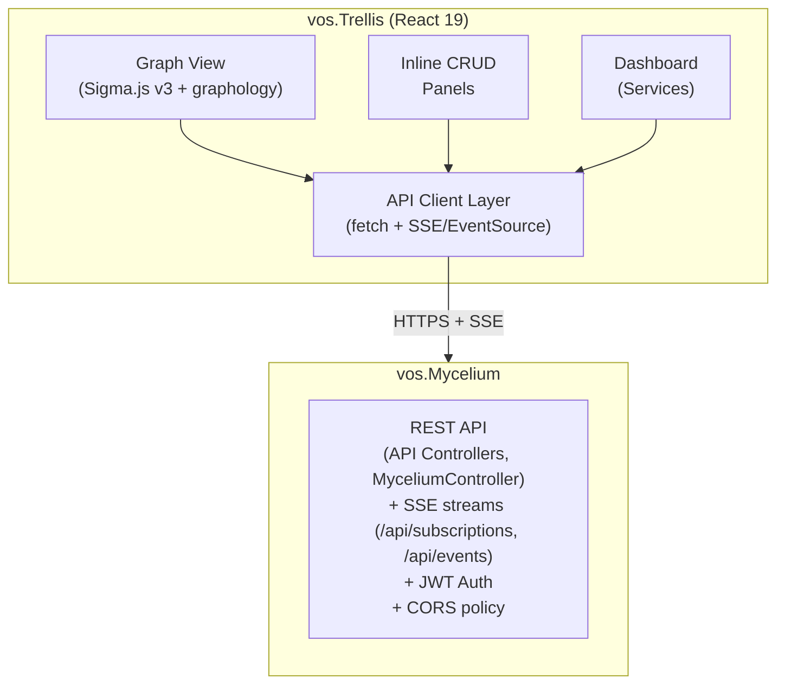

<!-- markdownlint-disable-file MD025 -->
<!-- Intentional two-part document: a top-level title plus "Part 1 — User Guide"
     and "Part 2 — Technical Specification", each authored as its own H1. -->
# VillageOS Trellis (GUI)

VillageOS Trellis is the web-based GUI for the VillageOS temporal graph
database. It lets you visually explore your model as an interactive graph,
monitor Mycelium in real time, and perform every CLI operation through
graphical forms — all from your browser.

This doc has two parts. **[Part 1 — User Guide](#part-1--user-guide)** is a
how-to for someone clicking around the app: navigating, searching, the
dashboard, creating data. **[Part 2 — Technical Specification](#part-2--technical-specification)**
is reference material for someone writing GUI code: architecture, component
structure, state management, and the API and SSE (Server-Sent Events) layer.

> **Screenshots**: Re-capture screenshots with the Mycelium and GUI dev server
> running.

---

## Table of contents

**[Part 1 — User Guide](#part-1--user-guide)**

1. [Getting Started](#1-getting-started)
2. [The Graph View](#2-the-graph-view)
3. [Selecting and Inspecting Things](#3-selecting-and-inspecting-things)
4. [Searching](#4-searching)
5. [Predicate-Based Clustering](#5-predicate-based-clustering)
6. [Single-Building 3D View](#6-single-building-3d-view)
7. [Dashboard](#7-dashboard)
8. [Creating and Modifying Data](#8-creating-and-modifying-data)
9. [Keyboard and Mouse Reference](#9-keyboard-and-mouse-reference)
10. [Troubleshooting](#10-troubleshooting)
11. [Tips and Best Practices](#11-tips-and-best-practices)

**[Part 2 — Technical Specification](#part-2--technical-specification)**

1. [Context](#12-context)
2. [Architecture Overview](#13-architecture-overview)
3. [Project Structure](#14-project-structure)
4. [Graph Visualization](#15-graph-visualization)
5. [Pages & Routing](#16-pages--routing)
6. [State Management](#17-state-management)
7. [API Layer](#18-api-layer)
8. [Real-Time Infrastructure](#19-real-time-infrastructure)
9. [CLI Command Parity](#20-cli-command-parity)
10. [Dashboard internals](#21-dashboard-internals)
11. [Common Components](#22-common-components)
12. [Seed Files](#23-seed-files)
13. [Verification](#24-verification)

---

# Part 1 — User Guide

## 1. Getting Started

### 1.1 Prerequisites

- **VillageOS Mycelium** running (provides the REST API and SSE streams)
- **Node.js 20+** installed (for the Vite dev server)
- A modern browser — Chrome, Firefox, or Safari (Safari has some WebGL limitations, see [Section 6](#6-single-building-3d-view))

### 1.2 Launching the GUI

Open two terminals:

```bash
# Terminal 1: Start the Mycelium
dotnet run --project vos.Mycelium

# Terminal 2: Start the GUI dev server
cd vos.Trellis
npm run dev
```

Open `http://localhost:5173` in your browser. You'll see a login form. Sign in with `admin` / `admin` (the default credentials, overridable via `VOS_ADMIN_PASSWORD` env var before first Mycelium run). If multiple models exist, you'll be prompted to select one. Alternatively, set `VITE_API_KEY` in `.env.local` for auto-login during development.

If your account has been flagged for a password change (e.g., created by an admin with `MustChangePassword: true`), you'll see a password change form after login. Enter your current password and choose a new one — the app won't be accessible until the password is changed.

Your session stays alive automatically — the GUI silently refreshes your authentication token in the background before it expires, so you won't be logged out unexpectedly during normal use.

After login, the **Dashboard** is the default landing page. The sidebar on the left provides six navigation items:

| Icon | Page | Purpose |
|------|------|---------|
| Grid | **Dashboard** | Model statistics, service health & daemon state, and live activity feed |
| Network | **Graph** | Interactive graph visualization with search, clustering, 3D building view, and CRUD |
| Box | **Model** | IFC-based 3D model viewer (Fragments) with type filtering and element selection |
| Clock | **Temporal** | Time-range mutation explorer for viewing property change history |
| Boxes | **Things** | Dedicated search page — find things by name across the entire model |
| Search | **Properties** | Dedicated search page — find things and relationships by property name |

The sidebar can be collapsed to icon-only mode by clicking the chevron button at the top-right of the sidebar panel.

Both the Dashboard and Graph pages include **Logout** and **Switch Model** buttons in their headers, allowing you to sign out or change models without re-entering credentials.

### 1.2a Switching Seeds (Models)

Click the **Switch Model** button in the Dashboard or Graph header to open the seed library picker. This shows all seed files available in Mycelium's `seeds/library/` folder.

The seed picker provides:

- **Search bar** — type to filter seeds by name
- **Sortable columns** — click "Name" or "Size" headers to sort ascending/descending
- **Scrollable list** — handles large numbers of seeds with a fixed-height scrollable area
- **Result count** — shows "N of M seeds" when filtering

Click any seed to load it. The current model is replaced — Mycelium clears the existing data, loads the seed file, and the GUI automatically re-scopes your authentication to the new model. The graph page resets and renders the new model.

**Saving a seed:** At the bottom of the seed picker, type a name in the "Save current model" input and click **Save** to snapshot the current model to the library folder. It appears immediately in the seed list above.

### 1.3 Loading Your First Model

The GUI starts with an empty model. To load sample data, use one of these methods:

**Via CLI:**

```bash
cd vos.Taproot
dotnet run -- deserialize ../vos.Mycelium/seeds/village.seed.json
```

**Via REST API:**

```bash
curl -X POST https://localhost:7243/api/model \
  -H "Content-Type: application/json" \
  -H "X-API-Key: <your-api-key>" \
  -d @vos.Mycelium/seeds/village.seed.json
```

**Via auto-load:** Place seed files in `vos.Mycelium/seeds/` — they are loaded automatically on Mycelium startup.

After loading, click **Graph** in the sidebar to see your model rendered as an interactive graph.

### 1.4 Available Seed Models

| Seed File | Best For |
|-----------|----------|
| `village.seed.json` | Full-featured demo: type hierarchies with multi-level inheritance, multi-domain relationships (energy, water, biodiversity, transport), IFC geometry for single-building 3D views |
| IFC-imported seeds | Ingest IFC (BIM) files in-app — drop or pick an `.ifc` on the **Model** page (posts to the Xylem service, `VITE_INGEST_URL`) — or from the CLI with `vos.Taproot` (`ingest <file.ifc>`). See the IFC import documentation in the [VillageOS API wiki](https://dev.azure.com/ReGenVillages/VillageOS-API/_wiki). |

The **village seed** is recommended for this guide because it demonstrates all features including per-building 3D views.

---

## 2. The Graph View

The Graph page is where you'll spend most of your time. It renders every thing in your model as a node and every relationship as a directed edge, using a WebGL-accelerated force-directed layout powered by Sigma.js and graphology.

### 2.1 Understanding What You See

After loading the village seed, you'll see the model rendered as nodes connected by directed edges. The force-directed layout automatically organizes nodes — things with many relationships gravitate toward the center, while leaf nodes drift to the periphery.

**Node size** reflects importance: nodes with more incoming relationships appear larger. The "PhysicalThing" type node, for example, is one of the largest because many things in the village have an "is PhysicalThing" relationship.

**Node colors** are derived from the data — no hardcoded color assignments:

- **Blue (large)** — Type definitions like "Home", "Sensor", "PhysicalThing" — anything that is a target of "is" relationships
- **Gold/amber (small)** — Predicate things like "is", "has", "feeds", "powers" — these define relationship types
- **Vibrant colors (medium)** — Instance nodes are colored by their type via "is" relationships. Every "Home" instance shares one color, every "SolarArray" shares another, every "GardenPlot" yet another. This happens automatically — adding new types gets them distinct colors without any configuration
- **Slate grey** — Instances with no "is" relationship (untyped things)

**Edge colors** are assigned per predicate type. Explicit color mappings can be configured via the `PredicateColors` property on the `GUI_Settings` Thing (a JSON object like `{"consumes":"#fb7185","produces":"#22d3ee"}`). Predicates without an explicit mapping get a deterministic color from an 8-color palette. This makes it easy to trace, say, all "consumes" relationships (one color) versus all "produces" relationships (another color) across the graph. The radial predicate menu uses the same colors as the edges.

**Logical vs. physical nodes**: In the village seed, nodes with IFC geometry (buildings, sensors mounted on buildings, etc.) are "physical" — they have a real-world shape. Nodes without geometry (types like "Home", predicates like "powers", abstract concepts) are "logical" — they exist only in the graph layout. This distinction drives the toolbar's Semantic Zoom feature, which auto-expands/collapses logical node groups based on zoom level.

### 2.2 Navigating the Graph

**Pan**: Click and drag anywhere on the background to move the view.

**Zoom**: Use the scroll wheel to zoom in and out. Zooming is centered on your cursor position, so point at the area you want to examine and scroll in.

**Fit to viewport**: If you get lost or want to see the full graph, click the **Fit** button (the square-with-arrows icon in the toolbar). This animates the camera to frame all nodes.

**Re-layout**: If the force layout has settled into an arrangement you don't like, click the **Re-layout** button (circular arrow icon). This perturbs all node positions slightly, causing the force simulation to re-settle into a new arrangement. Each click produces a different layout.

**Spread mode**: If nodes are too tightly clustered, click the **Spread** button (expand icon) to enter spread mode. This boosts the repulsion force so nodes push apart while maintaining their cluster structure. Click again to return to normal layout. The button is highlighted blue when active.

**Freeze/Resume**: Click the **Pause** button to freeze the force simulation. Nodes stop moving and you can examine the graph in its current state. Click **Play** to resume. This is useful when the layout is "good enough" and you want to stop the jittering.

### 2.3 The Toolbar

The toolbar sits at the bottom-left of the graph canvas. From left to right:

| Icon | Name | What it does |
|------|------|-------------|
| **+** (search bar) | Create Thing | Opens inline form to create a new thing by name |
| **+** | Zoom In | Animated zoom toward center |
| **−** | Zoom Out | Animated zoom away from center |
| ⛶ | Fit | Reset camera to show all nodes |
| ↻ | Re-layout | Perturb positions to re-settle force layout |
| ⤢ | Spread | Toggle spread mode — boosts repulsion to push nodes apart (blue when active) |
| ⏸/▶ | Freeze/Resume | Stop or start the force simulation |
| 🔍 | Semantic Zoom | Auto-expand/collapse logical nodes based on zoom level |
| ☰ | Layers | Open predicate selection menu (same as right-click) |

**Top-right controls** (next to model name):

| Icon | Name | What it does |
|------|------|-------------|
| ⇄ | Switch Model | Switch to a different seed/model |
| ⎋ | Log Out | End the current session |

When clustering is active, additional controls appear to the right: the active predicate name with edge count, and an X button to clear clustering.

---

## 3. Selecting and Inspecting Things

### 3.1 Selecting a Node

Click any node in the graph. A **detail panel** slides in from the right showing everything about that thing.

**Rename in place** — the thing's name in the panel header has a **pencil icon**; click it to edit the name inline. Press **Enter** (or click away) to save, **Escape** to cancel; a blank or unchanged name is a no-op. The rename keeps the thing's Id and all of its edges — unlike delete-and-recreate — and the new name may contain spaces. The change is persisted by the broker as a `NameSet` Fact, so it streams over SSE and stays temporally reconstructable.

The detail panel has three tabs (four for things with geometry):

**Properties** — Shows the thing's own properties (name, value, type). Click the **pencil icon** to toggle inline editing mode: each property value becomes an editable input field with a delete button (trash icon). Edit a value and press **Enter** or click away to save; press **Escape** to cancel. A blue border indicates unsaved changes. The property type is automatically preserved (a number stays a number, a boolean stays a boolean). In edit mode, an **Add Property** row appears at the bottom with name, type dropdown, and value inputs — press Enter or click "+" to add a new property. Below the own properties, inherited properties are displayed with a clickable "← SourceName" link showing which type they come from. For example, clicking a "Serpentine-Home-4" node might show properties like `energy_rating: A+` inherited from the "Home" type. Clicking the source link navigates you to that type node. In edit mode, inherited property values are also editable (but cannot be deleted) — editing an inherited property creates an own property override that shadows the inherited value.

**Relationships** — Lists all incoming and outgoing relationships. Each row shows the other thing's name and the predicate. For example, "Serpentine-Home-4" might show:

- Outgoing: `→ is → Home` (this is a Home)
- Outgoing: `→ has → SerpentineRoofSolar-4` (has a solar panel)
- Incoming: `← feeds ← VillageMicrogrid` (fed by the microgrid)

Each thing name is a clickable link — clicking it navigates to that node, selecting it and scrolling the graph to center on it. Click the **chevron** next to a relationship to expand it and see its properties. Multiple relationships can be expanded simultaneously. Relationship properties also support inline editing (pencil toggle, same as own properties). Each relationship row also has an **edge-detail icon** — clicking it opens the **EdgeDetailPanel** for that relationship, where you can view and edit its properties and ranges without having to click the edge in the graph. In edit mode, an **Add Relationship** row appears at the bottom of each section (outgoing/incoming) with predicate and other-thing pickers — select both and click "+" to create a new relationship inline.

**Ranges** — Shows any active ranges defined on this thing with their current state. A windmill spinner appears while data loads. Own ranges, inherited ranges, current states, and relationship ranges are all fetched in a single composite API call for efficiency. The tab uses a temporal snapshot approach — data reflects a point-in-time view when the tab was opened, and is not disrupted by ongoing SSE state-change events. Click the **refresh icon** in the tab bar to re-fetch the latest data without navigating away.

**3D** (conditional) — For things with IFC mesh geometry, a "3D" tab appears showing an interactive 3D view of the element. The model auto-rotates slowly. You can drag to orbit, scroll to zoom, and examine the element from any angle. For IFC container things (e.g., IfcBuilding, IfcBuildingStorey) that have no own geometry but contain child elements via `contains`/`aggregates` relationships, the 3D view renders all child meshes together, colored by IFC class. This tab is hidden on Safari due to WebGL context limits.

### 3.2 Selecting an Edge

Click any edge (relationship line) in the graph. The detail panel opens with two tabs:

**Properties** — Shows the relationship's Subject, Predicate, and Target — each as a clickable link to the respective thing. Any properties on the relationship are also displayed with inline editing. A "Delete Relationship" button at the bottom allows removal (with confirmation).

**Ranges** — Shows any ranges defined directly on this relationship, mirroring the Ranges tab on nodes. Active states appear as colored severity badges (green for nominal, yellow for warning, red for critical). Own ranges list their criteria expressions and current evaluation status. If bounds are defined, per-binding deviation details show how far actual values are from expected.

### 3.3 Right-Click Context Menu

**Right-click any node** to open a context menu with quick actions:

- **View Details** — Opens the detail panel for that node (same as clicking it)
- **Expand Relationships** — Reveals all of that node's edges in cluster mode
- **Toggle Logical Nodes** — Shows/hides logical children (only for geo nodes)
- **View in 3D** — Opens the detail panel on the 3D tab (only for nodes with geometry, not on Safari)
- **Copy ID** — Copies the node's GUID to your clipboard (shows a toast notification)
- **Delete** — Removes the thing after a confirmation dialog (shown in red, separated by a divider)

The context menu closes when you press Escape, click outside it, or select an action. Only one menu can be open at a time — right-clicking a node closes the radial predicate menu, and vice versa.

### 3.4 Deselecting

Click the empty background (not on any node or edge) to deselect everything. The detail panel closes and the graph returns to its default state.

---

## 4. Searching

The search bar at the top of the Graph page provides powerful filtering.

### 4.1 Basic Search

Start typing in the search bar. As you type, nodes whose names contain your text remain at full opacity, while non-matching nodes are dimmed (physical nodes) or hidden entirely (logical nodes). Edges are hidden by default — only edges where **both** endpoints match the search remain visible. The match count appears to the right of the search options (e.g., "5 found").

**Example**: Type `Home` in the village seed — you'll see "Home" (the type), "Home-1", "Home-2", etc. light up while everything else dims. Only edges connecting two matched nodes are visible.

### 4.2 Search Modes

Three toggle buttons next to the search bar modify matching behavior:

- **Aa** (Case-Sensitive): When active, "home" won't match "Home". Off by default.
- **=** (Exact Match): When active, only nodes whose name exactly equals your query match. "Home" matches the type but not "Home-1".
- **.\*** (Regex): When active, your query is treated as a regular expression. Type `^Solar` to find all things starting with "Solar", or `Sensor|Monitor` to find things containing either word.

### 4.3 Comma-Separated Search

Type multiple names separated by commas to find several things at once:

```text
Home-1, SolarGreenhouse-1, VillageMicrogrid
```

This highlights all three nodes and their neighborhoods simultaneously — useful for comparing how different things relate to each other.

### 4.4 Clearing Search

Delete the text in the search bar (or select all and press Backspace) to return the graph to its unfiltered state. Nodes return to full visibility; edges return to the default hidden state (they appear when you select or hover a node, or activate predicate filters).

### 4.5 Thing Search Page

Click **Things** in the sidebar to open the dedicated thing search page (`/things`). Unlike the Graph search bar (which filters the live graph visualization), this page lets you find things by name without the graph rendering overhead — useful for large models.

**How to use it:**

1. Type any part of a thing's name in the search field. Results update automatically after 250 ms.
2. Each result card shows:
   - **Name** (blue link) — click to navigate directly to that thing in the Graph with its detail panel open
   - **Type badge** (green) — the type name from the thing's `is` relationship, if one exists
   - **Property preview** — up to four key=value pairs from the thing's own properties
   - **Props / Rels counters** — total own-property count and relationship count

**Result ranking:** Results are sorted by match quality before alphabetically within each tier:

| Tier | Description | Example (query: `"building"`) |
|------|-------------|-------------------------------|
| 0 — Exact | Name equals query (case-insensitive) | `building` |
| 1 — Prefix | Name starts with query | `Building-A`, `BuildingType` |
| 2 — Substring | Name contains query | `New-Building`, `OldBuilding-2` |
| 3 — ID | Thing's UUID contains query (ID search) | any thing whose ID includes `building` |

**Pagination:** The first 100 results are shown. Click **Show more** to load the next 100.

**Export:** Use **Copy as Markdown** or **Download as Markdown** to export the full result set as a markdown table (`| Name | Type | Properties | Relationships |`), regardless of how many results are paginated.

### 4.6 Property Search Page

Click **Properties** in the sidebar to open the property search page (`/properties`). This searches across all thing and relationship properties by **property name** — useful when you know a field exists but not which things have it.

**How to use it:**

1. Type any part of a property name (e.g. `quantity`, `temperature`, `pool`). Results update after 250 ms.
2. Results are grouped by property name. Each entry shows:
   - **T** badge (blue) for thing properties, **R** badge (purple) for relationship properties
   - The owner's name — click a thing name to navigate to it in the Graph
   - **via SourceName** in green if the property is inherited from a parent type
   - The current value

3. Hover any row and click **history** to view all past values for that property (thing properties only).

**Export:** Supports **Copy as Markdown** and **Download as Markdown** in the same table format as the Thing Search page.

**When to use Things vs. Properties search:**

| Use | Page |
|-----|------|
| "Find the thing called Building-A" | Things (`/things`) |
| "Find all things named something like 'Sensor'" | Things (`/things`) |
| "Find all things that have a `temperature` property" | Properties (`/properties`) |
| "Which things have a `quantity` below reorder point?" | Properties (`/properties`) — search `quantity` to surface all owners |

---

## 5. Predicate-Based Clustering

When you have a large graph with many relationship types, clustering helps you focus on specific patterns.

### 5.1 Opening the Predicate Menu

**Right-click** anywhere on the graph background (not on a node). A radial menu appears showing all predicates in your model, ordered by relationship count. Each predicate has a colored dot matching its edge color and a count showing how many relationships use it.

In the village seed you'll see predicates like **is** (type classification), **feeds** (energy/resource flow), **powers** (power supply), **serves** (service relationships), and **has** (containment/ownership).

Click a predicate to activate clustering on that relationship type. Click multiple predicates to cluster on several types simultaneously.

### 5.2 What Clustering Looks Like

When you activate "is" clustering, for example:

- Nodes connected by "is" relationships group together and appear at full opacity — you'll see "Home" surrounded by Home-1 through Home-N, "GardenPlot" surrounded by its instances, etc.
- Predicate nodes ("is", "has", "feeds") become tiny and dimmed — they're structural connectors, not interesting in this view
- Unclustered nodes (things not connected by "is") dim to dark gray and shrink
- "is" edges become visible (edges are hidden by default and only appear when triggered by selection, hover, or predicate filter)

The toolbar updates to show the active predicate with a colored dot and edge count. An **X** button clears all clustering and returns to normal view.

### 5.3 Collapsed Clusters

Large clusters (e.g., "Home" with many instances) initially collapse to save space. The representative node shows an enlarged badge like "Home (7)". Click the representative to expand the cluster, revealing all member nodes.

### 5.4 Expanded Node Exploration

**Double-click** any node in cluster mode to toggle its expanded state. When expanded, all of that node's edges (not just cluster edges) appear at reduced opacity, letting you see its full relationship neighborhood in context.

---

## 6. Single-Building 3D View

Things with IFC mesh geometry can be viewed in an interactive 3D panel.

### 6.1 Opening the 3D View

Select any thing with geometry (building, greenhouse, etc.) and click the **3D** tab in the detail panel. You can also right-click a geo node and choose **View in 3D**.

The 3D view shows an auto-rotating model of just that element with OrbitControls:

- **Zoom**: Scroll wheel to move closer or farther
- **Orbit**: Click and drag to rotate around the model
- **Pan**: Right-click and drag to shift the view

For IFC containers (IfcBuilding, IfcStorey) that have child elements via `contains`/`aggregates`, all child geometry is rendered together, colored by IFC class. Containers don't have their own mesh — the 3D view assembles children's geometry on demand.

> **Note**: The 3D tab is hidden on Safari because Safari's WebGL context limit is too low to run the 3D viewer alongside the graph canvases.

---

## 7. Dashboard

The Dashboard page provides real-time monitoring of the VillageOS Mycelium. Its main sections are model statistics, registered services (with their daemon state inline), endpoint services, and the activity feed:

### 7.1 Model Statistics

The top-left card shows at-a-glance counts for your model:

- **Things** — total count
- **Relationships** — total count
- **Predicates** — number of distinct predicate things
- **Properties** — total property count across all things
- **Handlers** — registered service handler count

Below the counts, a **Top Predicates** list shows the most-used relationship types ranked by count.

### 7.2 Services

Shows every service the model routes to — both **graph** connections (predicate handlers, reached when a relationship is created) and **http** connections (endpoint services, reached via `POST /api/endpoints/{subdomain}`) — in one unified list. They are the same kind of thing, distinguished only by how requests reach them, so each card carries a trigger icon (a workflow glyph for graph, a globe for http) and a route label (`predicate`, or the `/api/endpoints/{subdomain}` path).

Every card shows request statistics (total requests, average response time, last request). Beyond that:

- **Graph connections** also show their supervised daemon's live state — a single source of truth, so health and running can never disagree:
  - **Health badge** — **Healthy** (green), **Unhealthy** (yellow), **Unreachable** (red), or **Unknown** (gray, not yet probed)
  - **Running badge** — green "Running" / red "Stopped", derived from the daemon supervisor
  - **External badge** — shown when the daemon was started outside Mycelium
  - **Process ID** and **last contact time** when running; **failure count** when non-zero
  - **Start/Stop buttons** (admin only) that launch or stop the backing daemon through Mycelium
- **HTTP connections** additionally show an **error count** (non-2xx responses) and a **Delete (retract)** button that removes the connection from the model (`DELETE /api/things/{id}`) after a confirm — distinct from **Stop** (which only kills the process; the service stays registered to lazy-start again). The connection still exists in the seed, so a seed reload restores it.

### 7.3 Activity Feed

The right column shows a real-time log of all model mutations, streamed via Server-Sent Events (SSE). Events include "ThingCreated", "RelationshipCreated", "PropertyChanged", etc. The feed keeps the most recent 200 events. Each event type has a distinct color (green for created, red for deleted, amber for property changes, purple/cyan for services).

**Pause/Resume** — Click the pause button to freeze the feed at its current snapshot. New events are buffered in the background and a badge shows how many are waiting. Click play to resume and see all buffered events.

**Category Filters** — Five filter chips at the top of the feed let you show/hide event categories: Model, Things, Rels, Props, Services. Click a chip to toggle it. Only events matching at least one enabled category are shown.

**Collapsible & Resizable** — The feed panel can be collapsed via the header button. When expanded, drag the top edge to resize the panel height. The height is persisted to localStorage.

The top-right controls include:

- **Mycelium** (green dot) — REST API connection active
- **Live** (green dot) — SSE streams connected and receiving events
- **Swagger** (document icon) — Opens the Mycelium API documentation (Swagger UI) in a new tab
- **Shutdown** (power icon) — Shuts down Mycelium (with confirmation dialog)
- **Switch Model** (arrows icon) — Switch to a different seed/model
- **Log Out** (exit icon) — End the current session

If either status indicator turns red, Mycelium may be down or unreachable.

### 7.4 Pipelines (DAG editor)

The **Pipelines** page (`/pipelines`) is a Grasshopper/Dynamo-style visual editor for building and running
DAGs whose nodes are microservices, on `@xyflow/react` (the Sigma graph view stays for the model). A pipeline
is just model data — the editor is CRUD over `thingApi`/`relationshipApi`, no new storage.

- **Palette** — every dispatchable **Connection** in the model (an http connection with a `Subdomain` and a
  bound Service). Click one to drop a node bound to it; its typed input/output **ports** resolve from the
  bound service's `is`-chain (the same resolution Phloem does).
- **Boundary nodes** (#5873) — the palette's **Input** and **Output** buttons drop a pipeline's external
  edges: an **Input** node ("from the start") whose output ports are filled from the run's parameters, and an
  **Output** node ("at the end") whose wired-in value becomes the run's published **result** (stored as a
  `result` property on the `PipelineRun` Thing). Boundary nodes bind no Connection — their ports are
  user-declared: select the node and add / rename / remove ports in the inspector. They persist as
  `PipelineInput` / `PipelineOutput` Things (each also a `PipelineNode`) with their own `Port` children.
- **Wiring** — drag from an output port to an input port. Wires are **type-checked**; incompatible types are
  refused.
- **Field mapping** (#5874) — click a wire to open its inspector and set an optional **from-path** and
  **to-path** (dotted field paths, e.g. `user.id` → `a`); blank means the whole payload. Phloem extracts the
  from-path of the upstream output and places it at the to-path of the downstream input, so **several wires
  into one input deep-merge** into a composed object (a leaf clash resolves last-wire-wins) instead of one
  overwriting another. The mapping shows as the wire's label; paths persist as `fromPath`/`toPath` properties
  on the wire.
- **New / Save / Load** — **New** clears the canvas; **Save** writes a `Pipeline` + `PipelineNode` Things and
  `has`/`feeds` relationships (node `‑has→ Connection`, positions round-trip as x/y); **Load** picks an
  existing pipeline from the model. **Editing is in place**: saving a loaded pipeline **updates it** rather
  than forking a duplicate — the Thing graph (pipeline + nodes + `is`/`has` edges) rides one idempotent
  fragment upsert (existing nodes keep their Ids), and nodes or wires removed on the canvas are retracted on
  save. Wire `fromPort`/`toPort` are written per-edge (the fragment endpoint does not carry relationship
  properties). A node can also be deleted from its detail panel.
- **Undo & optimistic rollback** (#5872) — the toolbar **Undo** button (or **Ctrl/Cmd+Z**) reverses the last
  edit: add / move / delete a node, add / delete a wire, or change a param binding. Editing is **optimistic** —
  changes show immediately and an **unsaved changes** indicator appears; on a successful save (or load, or New)
  the saved canvas becomes the new baseline and the undo history clears. If a **save is rejected** by the
  server, the canvas **rolls back** to the last server-confirmed state and the error explains why (a canvas
  that has never been saved keeps the user's work instead). The history is a bounded stack of editor snapshots
  in `pipeline/history.ts` (`EditorHistory`), kept pure and unit-tested; the page records a snapshot before
  each mutation and holds the last saved state as the rollback baseline.
- **Validation** — before Run, the toolbar flags why a pipeline will not run — a **required input** that is
  neither wired nor param-bound, or a **dangling wire** — and **Run is disabled** until the issues are
  resolved, so a broken DAG fails loud rather than silently at dispatch.
- **Run** — spawns the **Phloem** orchestrator (`POST /api/endpoints/phloem`, async) and **animates the run
  live**: each node lights up `running` (pulsing blue) → `succeeded` (green) / `failed` (red), nodes downstream
  of a failure show `skipped`, and the panel tracks the overall run. The animation is driven by the model SSE
  stream — Phloem writes each node's status as it goes, the editor paints it — not a separate channel. Running
  lazy-starts Phloem and each node's service through Mycelium.
- **Cancel** — while a run is in flight the Run button becomes **Cancel**; clicking it requests cooperative
  cancellation (already-running nodes finish, pending nodes are marked `cancelled`, amber).
- **History** — for a loaded pipeline, the **History** dropdown lists its past runs (status + start time,
  newest first); picking one **replays** that run's per-node statuses onto the canvas via the same animation
  path. Runs are read straight from the model (`PipelineRun -of-> Pipeline`), no extra storage.
- **Param binding** — click a node to open its inspector; each **unwired input port** can be bound to a
  **run param** by name (stored as the node's `paramBindings`). Bound params appear in a **Params** bar above
  the canvas where you supply values at Run time — so a source node can be parameterized per run without
  rewiring. Phloem fills bound inputs from the run's `params` (an explicit wire into the same port wins).
- **Fan-out** — a node whose service declares a **collection input** (`collection:true` on the port) runs once
  per item when that input receives a list. The canvas node shows a **`k/n`** progress badge as items run and an
  aggregate ring — `partial` (orange) when `onItemError:continue` and some items failed. Each output port is
  gathered into a list for downstream: chain another fan-out, or feed an aggregator node.
- **Empty state** — with no nodes, the canvas points you to the palette; if the model has no dispatchable
  Connections it says so (load a model whose seed has pipeline Connections — use the `seed-migrate` tool
  in the private VillageOS repo to add them).

The model side (archetypes, node-binds-Connection, the `PipelineWire` predicate) and the orchestrator are
documented in [`MICROSERVICES.md` §16 (Pipelines / DAG orchestration)](MICROSERVICES.md).

---

## 8. Creating and Modifying Data

All CRUD operations are performed inline on the Graph page — no separate command page is needed.

### 8.1 Creating Things

Click the **+** button next to the search bar at the top of the Graph page. An inline form appears:

1. Type a name for the new thing
2. Press **Enter** or click the **+** submit button
3. The new thing appears immediately in the graph (via SSE push)
4. Press **Escape** to cancel

### 8.2 Adding Properties

1. **Select a node** by clicking it — the detail panel opens
2. Click the **pencil icon** to enter edit mode
3. Scroll to the bottom of the property list — an **Add Property** row appears
4. Enter a **name**, select a **type** (string, number, boolean, datetime), and enter a **value**
5. Press **Enter** or click **+** to add the property
6. The input auto-focuses for rapid successive additions

### 8.3 Creating Relationships

1. **Select a node** and enter edit mode (pencil icon)
2. In the **Relationships** section, scroll to the bottom of either the outgoing or incoming list
3. An **Add Relationship** row appears with two pickers:
   - **Predicate**: Dropdown with known predicate things sorted to the top
   - **Other thing**: Dropdown showing non-predicate things
4. Select both and click **+** to create the relationship

### 8.4 Editing Properties

1. **Select a node or edge** and enter edit mode (pencil icon)
2. Click any property value to edit it inline — this works for both own and inherited properties
3. Press **Enter** or click away to save; **Escape** to revert
4. A blue border indicates unsaved changes
5. Click the **trash icon** to delete an own property (inherited properties cannot be deleted)
6. Editing an inherited property creates an own property override that shadows the inherited value

### 8.5 Deleting Things and Relationships

- **Delete a thing**: Right-click a node → **Delete** (confirmation dialog)
- **Delete a relationship**: Select an edge → **Delete Relationship** button in the detail panel (confirmation dialog)

### 8.6 Model Operations

Model-level operations (import/export/clear) are available via the CLI or REST API:

- **Export**: `serialize` CLI command or `GET /api/model`
- **Import**: `deserialize` CLI command or `POST /api/model`
- **Clear**: `clear model` CLI command or `DELETE /api/model`

---

## 9. Keyboard and Mouse Reference

| Input | Action |
|-------|--------|
| **Scroll wheel** | Zoom in/out (centered on cursor) |
| **Click + drag background** | Pan the view |
| **Click node** | Select node, open detail panel |
| **Click edge** | Select relationship, open detail panel |
| **Click background** | Deselect all, close detail panel and menus |
| **Right-click node** | Open node context menu (view details, expand, copy ID, delete) |
| **Right-click background** | Open radial predicate menu for clustering |
| **Double-click node** | Toggle expanded state (shows all edges in cluster mode) |
| **Hover over node** | Brightens edges connected to that node |
| **Escape** | Close any open context or radial menu |

---

## 10. Troubleshooting

### Layout won't settle / nodes keep moving

Click the **Freeze** (pause) button to stop the force simulation. You can then manually inspect the graph. Click **Play** to resume.

### Safari: blank canvas in the 3D tab

Safari limits the number of simultaneous WebGL contexts, and the graph already uses several. The 3D tab is hidden on Safari for this reason. If the main graph canvas goes blank:

1. Try resizing the browser window (triggers a refresh)
2. As a last resort, reload the page

### Real-time updates not appearing

Check the connection indicators on the Dashboard page. If "Live" shows red, the SSE connection has dropped. This usually recovers automatically within 30 seconds (exponential backoff). If "Mycelium" shows red, Mycelium process may have stopped.

### Search finds nothing

- Check if case-sensitive mode (**Aa**) is accidentally active
- Check if exact-match (**=**) is active — this requires the full name, not a substring
- Check if regex mode (**.\***) is active — special characters like `.` or `(` have regex meaning

---

## 11. Tips and Best Practices

**Start with the big picture, then drill down.** Load a seed, look at the full graph, then use clustering to focus on one relationship type at a time. "is" clustering shows the type hierarchy. "has" shows containment. "feeds" shows resource flow.

**Use predicate filtering for precise exploration.** Instead of seeing every relationship of a building, activate just "has" to see only what it contains, or "powers" to see only its power connections.

**Comma search for comparison.** Type `Home-1, Home-5` to highlight two homes and their neighborhoods simultaneously. This reveals shared connections (e.g., both fed by the same microgrid).

**Right-click for quick actions.** Right-click any node for a context menu with view details, expand relationships, copy ID, and delete. This is faster than opening the detail panel for common operations.

**Export before destructive changes.** Use the CLI `serialize` command or `GET /api/model` to export the model as JSON before clearing or deleting things. The exported file can be re-imported later.

**Tune the force layout.** The force-directed layout reads parameters from the "GUI_Settings" thing in your model. You can modify these properties via the CLI or REST API to control how tightly or loosely nodes arrange: `LayoutAttraction` (edge pull, default 0.0005), `LayoutRepulsion` (node push, default 0.1), `LayoutGravity` (center pull, default 0.0001), `LayoutInertia` (momentum, default 0.6), `LayoutMaxMove` (max pixels/tick, default 200), `ClusterRepulsion` (push when clustering, default 0.4).

**Temporal exploration.** After making changes over time, use the Temporal page to view the model at any past timestamp, or see the version history of a specific property.

---

# Part 2 — Technical Specification

## 12. Context

VillageOS is an in-memory temporal graph database built in .NET 10/C#. Users interact with it via a CLI REPL (`vos.Taproot`) and a web interface (`vos.Trellis`). Both communicate with the REST API server (`vos.Mycelium`).

**vos.Trellis** is a React + TypeScript single-page application that provides:

1. **Interactive graph visualization** — the model rendered as a WebGL force-directed graph using Sigma.js v3
2. **Full CLI parity** — every CLI operation accessible through inline forms, context menus, and detail panels
3. **Mycelium dashboard** — real-time monitoring of services/handlers (with daemon state) and model activity via SSE

---

## 13. Architecture Overview



### Technology Stack

| Layer | Technology | Version |
|-------|-----------|---------|
| **Framework** | React + TypeScript | 19.2 |
| **Build** | Vite | 7.x |
| **Graph renderer** | Sigma.js (WebGL) | 3.0.2 |
| **Graph data** | graphology (multi-directed) | 0.26.0 |
| **React graph bindings** | @react-sigma/core | 5.0.6 |
| **Graph layout (small)** | graphology-layout-force (ForceSupervisor) | 0.2.4 |
| **Graph layout (large)** | graphology-layout-forceatlas2 (FA2 worker) | 0.10 |
| **Styling** | Tailwind CSS | 4.1 |
| **State management** | Zustand | 5.0.11 |
| **Real-time** | EventSource (SSE) | native |
| **Icons** | lucide-react | 0.563 |
| **Dates** | date-fns | 4.1 |
| **3D renderer** | three (Three.js) | 0.182 |
| **3D React bindings** | @react-three/fiber | 9.5 |
| **3D helpers** | @react-three/drei (OrbitControls) | 10.7 |
| **Auth** | JWT + API key auth (login form, `VITE_API_KEY` env var auto-exchange, `X-API-Key` header, silent token refresh, forced password change) | — |

---

## 14. Project Structure

```text
vos.Trellis/
├── package.json
├── vite.config.ts              # Proxy /api → https://localhost:7243
├── tsconfig.json
├── index.html
└── src/
    ├── main.tsx                # React root
    ├── App.tsx                 # Router + theme toggle
    ├── index.css               # Tailwind import + body/root height
    ├── setupTests.ts           # Vitest + testing-library
    │
    ├── types/
    │   ├── vos.ts              # VosThing, VosRelationship, PropertyValue, ranges, temporal types
    │   └── Mycelium.ts           # RegisteredService, ServiceStats, ActivityEvent, EndpointServiceInfo
    │
    ├── api/
    │   ├── client.ts           # Singleton API client (fetch + JWT auto-refresh + API key exchange + login/logout/switchModel/changePassword + silent token refresh + AuthRequiredError)
    │   ├── thingApi.ts         # Thing CRUD + property get/set/delete + effective properties
    │   ├── relationshipApi.ts  # Relationship CRUD
    │   ├── modelApi.ts         # Model export/import/clear + temporal snapshots
    │   ├── temporalApi.ts      # Property versions, mutations, recent values
    │   ├── rangeApi.ts         # Composite range summary for things (rangeApi.getSummary), individual range/state queries for relationships (relationshipRangeApi)
    │   ├── myceliumApi.ts        # Services (start/stop), shutdown, seed library (list/load/save)
    │   └── endpointApi.ts      # Endpoint services listing (GET /api/endpoints)
    │
    ├── hooks/
    │   ├── useSse.ts          # SSE connection singleton + subscription hook
    │   └── useAuth.ts          # AuthContext, useAuth() hook, useAuthState() with login/logout/switchModel/selectModel/saveSeed/changePassword/VITE_API_KEY auto-exchange
    │
    ├── stores/
    │   ├── uiStore.ts          # Selections, panel state, clustering, logical expansion, context-menu state
    │   └── activityStore.ts    # Activity feed events (max 200)
    │
    ├── utils/
    │   ├── graphologyMapper.ts  # VosModel → graphology Graph (nodes + edges)
    │   ├── ifcMeshParser.ts     # IFC pre-tessellated mesh → centroid/SolidMeshData (sole geometry parser)
    │   ├── villageScene.ts      # Batch builder: things → VillageSceneData (3D meshes + bounds, optional relationships for IFC containers)
    │   ├── browserDetect.ts     # Safari detection + canSupport3D() for WebGL context limits
    │   ├── meshHelpers.ts       # Shared 3D mesh constants + crossProduct()
    │   ├── colors.ts            # Shared color palettes + ELEMENT_COLORS + deterministic hashStringToIndex()
    │   ├── reducerHelpers.ts    # Pure styling functions for NodeReducer (selection, cluster styles)
    │   ├── nodeVisibility.ts    # Pure helpers for node/edge visibility + edgeTouchesNode (testable without WebGL)
    │   ├── predicateCluster.ts  # Predicate-based clustering algorithm + stats
    │   ├── searchFilter.ts      # Graph search with case-sensitive, exact-match, and regex options
    │   ├── propertyUpdates.ts   # Pure helpers for incremental SSE property updates (avoids full reload)
    │   ├── guiSettings.ts       # Extracts GUI settings (flash effects, force layout, predicate colors) from GUI_Settings Thing; extractAllGuiSettings() single-traversal
    │   ├── formatters.ts        # GUID, date, value display helpers
    │   └── constants.ts         # Health colors, property types
    │
    ├── pages/
    │   ├── GraphPage.tsx        # Main graph + search + inline CRUD + detail panels
    │   ├── DashboardPage.tsx    # Services (with daemon state), endpoint services, model stats, activity feed
    │   ├── TemporalPage.tsx     # Time-range mutation explorer
    │   ├── ModelPage.tsx        # Fragments-based 3D model viewer
    │   ├── PipelinePage.tsx     # Pipeline / DAG editor (Phloem orchestration)
    │   ├── ThingSearchPage.tsx  # Thing search
    │   └── PropertySearchPage.tsx # Property search
    │
    └── components/
        ├── layout/
        │   ├── AppLayout.tsx    # Root layout: sidebar + main + toast container
        │   └── Sidebar.tsx      # Nav links (Dashboard, Graph, Model, Temporal, Things, Properties) + model name + collapsible
        │
        ├── graph/
        │   ├── SigmaCanvas.tsx            # <SigmaContainer> wrapper with settings + Safari compositing fix
        │   ├── GraphDataLoader.tsx        # Loads graphology graph into Sigma
        │   ├── GraphSearchBar.tsx         # Search input with case-sensitive / exact-match / regex toggles + match count
        │   ├── GraphEvents.tsx            # Click/right-click events → Zustand store (incl. logical node expansion, context menu)
        │   ├── LayoutController.tsx       # ForceSupervisor / FA2 lifecycle
        │   ├── LogicalNodeController.tsx  # Radial positioning of logical children + semantic zoom
        │   ├── NodeReducer.tsx            # Visual filtering: search, clustering, selection reveal
        │   ├── ClusterComputer.tsx        # Computes predicate-based cluster map from graph topology
        │   ├── NodeContextMenu.tsx        # Right-click node context menu (view details, expand, copy ID, delete)
        │   ├── RadialPredicateMenu.tsx    # Right-click background radial menu for predicate selection
        │   ├── WebGLContextGuard.tsx      # WebGL context loss/recovery with MutationObserver for dynamic canvases
        │   └── GraphToolbar.tsx           # Zoom, fit, re-layout, spread, cluster, semantic zoom, expansion controls
        │
        ├── auth/
        │   ├── LoginForm.tsx           # Full-screen login form (username/password) + seed library picker (search, sort by name/size, scrollable list, save-to-library)
        │   ├── ChangePasswordForm.tsx  # Forced password change form (shown when MustChangePassword flag is set)
        │   └── RegenLogo.tsx           # Animated ReGen logo component
        │
        ├── three/
        │   └── BuildingDetail3D.tsx    # Single-building 3D viewer (auto-rotate, orbit controls)
        │
        ├── model/
        │   ├── FragmentsViewer.tsx     # Fragments-based 3D viewer (WebGL rendering, element picking) — backs the Model page
        │   ├── LoadingOverlay.tsx      # Loading-state overlay for the viewer
        │   └── ViewerToolbar.tsx       # 3D viewer toolbar controls
        │
        ├── panels/
        │   ├── ResizablePanel.tsx        # Draggable-width overlay panel
        │   ├── NodeDetailPanel.tsx       # Own properties, inherited properties (flat + tree), relationships, ranges, 3D tab
        │   ├── EditableThingName.tsx     # Inline rename in the panel header (pencil → edit, Enter/blur saves, Escape cancels) via thingApi.rename
        │   ├── EdgeDetailPanel.tsx       # Subject-Predicate-Target, properties, ranges (tabbed: Properties | Ranges)
        │   ├── EditablePropertyList.tsx  # Inline property editing with dirty state, save on Enter/blur, type inference, AddPropertyRow for new properties
        │   ├── RelationshipList.tsx      # Expandable relationship list with multi-expand, inline property editing, and AddRelationshipRow
        │   ├── AddRelationshipRow.tsx    # Inline form for creating relationships (predicate + other-thing pickers)
        │   ├── RangesTabContent.tsx     # States, own/inherited ranges, relationship ranges, binding evaluations with severity coloring
        │   ├── TypeFilterPanel.tsx       # Type-visibility toggles with instance counts + sort options
        │   └── PredicateFilterPanel.tsx  # Edge-visibility filter by predicate (bottom-right panel)
        │
        ├── dashboard/
        │   ├── ModelStatsCard.tsx          # Thing/relationship/predicate/property counts
        │   ├── ServicesPanel.tsx           # Unified services: graph (predicate) + http (endpoint) connections
        │   └── ActivityFeed.tsx            # Real-time SSE event log
        │
        └── common/
            ├── ErrorBoundary.tsx     # React error boundary with stack trace display
            ├── Toast.tsx             # Toast notifications (success/error/warning/info)
            ├── ConfirmDialog.tsx     # Confirmation modal for destructive actions
            ├── Badge.tsx             # Colored status pill
            ├── ThingPicker.tsx       # Searchable thing selector with ranked results (exact→starts-with→contains)
            ├── ThemeToggleButton.tsx # Dark/light theme toggle with OS-preference detection
            └── WindmillSpinner.tsx   # Loading spinner (rotating windmill animation)
```

---

## 15. Graph Visualization

### Component Architecture

All graph components are children of `<SigmaContainer>` and access the Sigma instance via React hooks.

```text
<ErrorBoundary>
  <SigmaContainer graph={multiDirectedGraph} settings={SIGMA_SETTINGS}>
    <GraphDataLoader />           ← useLoadGraph: builds & imports graphology graph
    <ClusterComputer />            ← Predicate-based cluster computation
    <GraphEvents />                ← useRegisterEvents: click → Zustand store + logical expansion
    <LayoutController />           ← ForceSupervisor / FA2: force-directed layout
    <LogicalNodeController />      ← Radial positioning of logical children + semantic zoom
    <WebGLContextGuard />          ← Safari WebGL context recovery (MutationObserver for dynamic canvases)
    <NodeReducer />                ← useSetSettings: search, clustering, selection reveal
    <GraphToolbar />               ← useSigma + useCamera: zoom/fit/relayout/semantic zoom
  </SigmaContainer>
</ErrorBoundary>
```

### Multi-Directed Graph

The graphology instance is created as `new Graph({ multi: true, type: 'directed' })` because the same pair of nodes can have multiple relationships with different predicates (e.g., Zone-A →has→ Sensor-1 and Zone-A →monitors→ Sensor-1). This instance is passed to `SigmaContainer` via the `graph` prop to override its default simple graph.

### Data Loading

GraphPage fetches the full thing list (`GET /api/things`) and the relationship list (`GET /api/relationships`) in parallel through a single `loadData()` call. The Fragments-based 3D viewer streams its own geometry separately from `/api/model/fragments`.

### Data Mapping (`graphologyMapper.ts`)

`buildGraph(things, relationships)` transforms VillageOS domain data into a graphology graph:

**Node classification:**

- **Predicate**: has `ExecutablePath`/`ServicePort` property, or is used as a `PredicateId` in any relationship
- **Type**: is the target of an `is` relationship (e.g., "Zone", "Sensor", "AMR")
- **Default**: regular instances

**Node sizing:** `Math.max(3, Math.min(15, 3 + incomingRelationshipCount * 1.5))` — sized by incoming edges only (how many things point at this node), so types and hubs appear larger than leaf nodes

**Color palettes (data-driven, no hardcoding):**

- **Predicate nodes**: amber `#fbbf24` — things used as `PredicateId` or with `ExecutablePath`/`ServicePort`
- **Type nodes**: blue `#60a5fa` — things that are targets of "is" relationships
- **Instance nodes**: color derived from the "is" type name via `hashStringToIndex()` into a 16-color vibrant palette. Every instance of the same type shares the same color (e.g., all "Home" instances are one color, all "SolarArray" another). New types automatically get distinct colors without code changes.
- **Untyped instances** (no "is" relationship): slate `#94a3b8` fallback
- **Edge colors**: Resolved per-predicate via `resolvePredicateColor(name, overrides)`. Explicit name→hex overrides from the `GUI_Settings` Thing's `PredicateColors` JSON property take priority; unlisted predicates fall back to an 8-color palette via `hashStringToIndex()`. The same resolver is used by both `buildGraph()` (edge colors) and `computePredicateStats()` (radial menu colors) so they always match.

**Logical node classification:** After all nodes and edges are added, a second pass marks nodes without geometry as `isLogical: true` and computes `parentGeoNodeId` — the nearest geometry-bearing neighbor (first found by edge traversal). Logical children are revealed on demand via parent expansion, search, or semantic zoom. Helper functions `getLogicalChildren(graph, geoNodeId)` and `countLogicalChildren(graph, geoNodeId)` support the expansion UI.

**Initial layout:** Circular with radius 100, then force-directed

### Force-Directed Layout (`LayoutController.tsx`)

Two layout algorithms selected by graph size:

- **Small graphs (< 2000 nodes)**: `graphology-layout-force/worker` — runs via `requestAnimationFrame` on the main thread. Simple spring-electric model, supports `isNodeFixed` callback
- **Large graphs (≥ 2000 nodes)**: `graphology-layout-forceatlas2/worker` (`FA2Supervisor`) — runs in a **real Web Worker** using Barnes-Hut optimization (O(N log N) vs O(N²)). Provides ~70x speedup at 10K nodes

Layout parameters are read from the model's "GUI Settings" Thing (via `extractLayoutSettings()` in `guiSettings.ts`), stored in `uiStore.layoutSettings`. Defaults when no settings thing is present:

- `attraction: 0.0005`, `repulsion: 0.1` (cluster mode: `clusterRepulsion: 0.4`), `gravity: 0.0001`, `inertia: 0.6`, `maxMove: 200`
- Properties on the "GUI Settings" Thing: `LayoutAttraction`, `LayoutRepulsion`, `LayoutGravity`, `LayoutInertia`, `LayoutMaxMove`, `ClusterRepulsion`, `FlashEdgeSize`, `FlashNodeSizeFactor`, `FlashNodeBrighten`, `PredicateColors` (JSON string: `{"consumes":"#fb7185",...}`)
- **Spread mode**: Toggle via toolbar — boosts repulsion 5x and reduces gravity 10x, causing nodes to push apart while maintaining cluster structure. Toggling off restores normal parameters and nodes re-settle
- Supervisor is recreated when clustering predicates change, spread mode toggles, or layout settings change (tracked via `JSON.stringify(layoutSettings)`)

### Search & Filtering

**GraphPage** provides the search bar described in [Section 4](#4-searching)
(substring/case-sensitive/exact-match/regex toggles plus a match count). The
technical notes below cover how that search drives the renderer.

Search filtering expands matched nodes to include their direct neighbors and predicate things so edges always have both endpoints and edge labels resolve to names (not GUIDs).

**NodeReducer** installs Sigma `nodeReducer`/`edgeReducer` for visual filtering. Edges are **hidden by default** and only shown when triggered:

- **Hover**: edges touching hovered node are brightened
- **Selection**: edges touching selected node are shown
- **Search**: edges where both endpoints match the query are shown
- **Predicate filter**: edges matching active predicate filters are shown

Node reducers follow two priority modes:

1. **Search active** → dim non-matching physical nodes; hide non-matching logical nodes
2. **Default** → all nodes visible; selection highlight applied (selected node gets `zIndex: 2`); edges follow the unified rules above

Helper functions and constants exported for testability (`nodeVisibility.ts`):

- `isGeoNode(attrs)` — checks if a graph node has geometry metadata
- `hasGeoProperties(props)` — checks if raw `VosThing.Properties` has geometry indicators
- `getFullNeighborSet(graph, nodeId)` — all direct neighbors regardless of predicate filters
- `edgeTouchesNode(graph, edge, nodeId)` — checks if an edge connects to a given node (used for hover/selection edge highlighting)
- `buildLabelMatcher(query, options)` — builds a label matching function for search filtering (supports regex, comma-separated, single-term modes)

### Predicate-Based Clustering

Right-clicking on the graph opens a **RadialPredicateMenu** showing all predicates ordered by relationship count. Selecting a predicate activates clustering mode:

1. **ClusterComputer** analyzes the graph topology and groups nodes connected by the active predicate into clusters
2. **NodeReducer** applies cluster-aware visual filtering:
   - Nodes in the active predicate's clusters shown at full opacity
   - Predicate-type nodes dimmed (structural connectors)
   - Unclustered nodes dimmed and shrunk
   - Collapsed cluster representatives enlarged with member count badge
   - Collapsed cluster members hidden
3. **GraphToolbar** displays the active predicate with:
   - Expand/collapse all cluster controls
   - **Eye/EyeOff toggle** to completely hide non-cluster edges (vs. dimming them)
   - Clear button to exit clustering mode

Double-clicking a node in clustering mode toggles its expanded state, revealing all its edges at reduced opacity.

### Property Inheritance Display

When a node is selected, **NodeDetailPanel** fetches the full thing detail (including `InheritedProperties`) and displays:

1. **Own** — properties directly on this thing. Supports **inline editing** via `EditablePropertyList`: a pencil toggle switches to edit mode where each property becomes an editable input with a delete button. Changes save on Enter or blur, dirty state shown via blue border, Escape reverts. Type is inferred from the existing value (`inferType()`). In edit mode, an **AddPropertyRow** appears at the bottom with name, type dropdown, and value inputs for creating new properties inline (Enter to submit, auto-focuses name input for rapid additions)
2. **Inherited** (flat view) — from the effective-properties API, showing each inherited property with a clickable "← SourceName" link to navigate to the source type. In edit mode, inherited property values are editable (no delete) — saving creates an own property override that shadows the inherited value. After saving, effective properties are re-fetched so the overridden property moves to the Own section. Uses `EditablePropertyList` with `showAddRow={false}` and no `onDeleteProperty`
3. **Inheritance Chain** (tree view) — recursive `InheritedPropertySetView` component rendering the full type hierarchy with nested indentation
4. **Relationships** — `RelationshipList` component showing incoming/outgoing relationships with multi-expand (multiple relationships can be expanded simultaneously). Expanded relationships show their properties via `EditablePropertyList` with inline editing support. Each relationship row has an edge-detail icon that calls `selectEdge(id)` to open the **EdgeDetailPanel** for that relationship. In edit mode, an **AddRelationshipRow** appears at the bottom of each section (outgoing/incoming) with predicate and other-thing pickers for creating new relationships inline. Known predicates are sorted to the top of the predicate picker. Also in edit mode, a **RetypeRow** repoints the Thing's `is`-edge to a different archetype in one action (`retypeThing` removes the current type edges and adds the new one) — the human-in-the-loop reclassification
5. **Ranges** — `RangesTabContent` showing active states as colored severity badges (green/yellow/red), own ranges with criteria and evaluation status, inherited ranges grouped by source, relationship ranges, and per-binding detail with deviation deltas. Data is fetched via a single composite `GET /api/things/{id}/range-summary` call that returns the thing's ranges, states, and all relationship range data in one response. Uses a **temporal snapshot** approach: `statesVersion` is captured when the tab opens (or when the selected node changes), and all fetches use that snapshot. Continuous SSE state-change pushes do not trigger re-fetches — the user gets a consistent point-in-time view. A windmill spinner shows while the summary loads. A **refresh button** in the tab bar lets the user manually re-fetch the latest data without navigating away
6. **3D** (conditional) — appears for things with a `geometry` property on non-Safari browsers, or for IFC containers (things with an `ifcClass` property like IfcBuilding/IfcStorey) whose `contains`/`aggregates` children have geometry. Renders a lazy-loaded `BuildingDetail3D` viewer with auto-rotation and OrbitControls. IFC containers pass `childElements` to render all child meshes in a combined scene

The seed data supports multi-level transitive inheritance (e.g., `ConveyorPLC → Controller → SmartAppliance`), rendered as nested tree nodes in the chain view.

### Edge Detail Display

When an edge is selected, **EdgeDetailPanel** shows the relationship in a tabbed layout mirroring NodeDetailPanel:

1. **Properties** — Subject, Predicate, and Target as clickable links to the respective things, own properties with inline editing via `EditablePropertyList`, and a "Delete Relationship" button (with confirmation)
2. **Ranges** — `RangesTabContent` showing active states as colored severity badges (green/yellow/red), own ranges with criteria and evaluation status, and per-binding detail with deviation deltas. Data is fetched via `relationshipRangeApi` (`GET /api/relationships/{id}/ranges`, `GET /api/relationships/{id}/states`). Uses the same temporal snapshot and windmill spinner as NodeDetailPanel

### Sigma Settings

```typescript
{
  renderLabels: true,
  renderEdgeLabels: true,
  defaultEdgeType: 'arrow',
  enableEdgeEvents: true,
  labelColor: { color: '#ffffff' },
  labelSize: 10,
  edgeLabelColor: { color: '#a1a1aa' },
  edgeLabelSize: 11,
  zIndex: true,
  minCameraRatio: 0.02,
  maxCameraRatio: 20,
  hideEdgesOnMove: false,
  hideLabelsOnMove: false,
}
```

### Interactions

- Click node → `uiStore.selectNode(id)` → NodeDetailPanel opens (fetches full thing with inheritance)
- Click geo node with logical children → `toggleLogicalExpansion(id)` → radially position/hide logical children
- Click edge → `uiStore.selectEdge(id)` → EdgeDetailPanel opens (tabbed: Properties | Ranges). Also available via the edge-detail icon on each relationship row in NodeDetailPanel's Relationships tab
- Click background → deselect all, close panels, close radial menu and context menu
- Right-click node → NodeContextMenu dropdown (view details, expand, toggle logical, view in 3D, copy ID, delete)
- Right-click background → RadialPredicateMenu → select predicate for clustering
- Double-click node (in cluster mode) → toggle expanded state (shows all edges at reduced opacity)
- Hover node → `hoveredNodeId` set → edges touching hovered node are brightened
- Scroll to zoom, drag to pan
- Semantic zoom: zoomed in close (ratio < 0.3) → auto-expand nearby logical parents; zoomed out (ratio > 1.5) → collapse all
- Toolbar: zoom in/out, fit to viewport, re-layout, spread mode toggle, freeze/resume layout, semantic zoom toggle, cluster expand/collapse all, expansion count indicator
- Top-right controls: model name, switch model, logout
- **Create Thing**: `+` button in the search bar area toggles an inline form (auto-focused name input, Enter to submit, Escape to cancel). Calls `thingApi.create()` then `loadData()` to refresh the graph

---

## 16. Pages & Routing

All routes are nested under `AppLayout` which provides the sidebar + main content area.

| Route | Page | Description |
|-------|------|-------------|
| `/` | `DashboardPage` | Model stats, services (with daemon state), activity feed (default landing page) |
| `/graph` | `GraphPage` | Graph visualization with search bar, inline CRUD (create thing, add properties/relationships), detail panels, delete confirmations, lazy-loaded single-building 3D |
| `/model` | `ModelPage` | Fragments-based 3D viewer of IFC geometry, with type filtering and element selection |
| `/temporal` | `TemporalPage` | Time-range mutation explorer with hierarchical diff view |
| `/things` | `ThingSearchPage` | Dedicated thing-name search with ranked results (exact → prefix → substring → ID), type badges from `is` relationships, property preview, markdown export. Pure search logic in `src/utils/thingSearch.ts`. |
| `/properties` | `PropertySearchPage` | Dedicated property-name search across all things and relationships, grouped by property name, inherited property tree walking, temporal history panel, markdown export. |
| `/pipelines` | `PipelinePage` | Visual DAG editor (react-flow) for pipeline/orchestration. Palette of dispatchable Connections (subdomain + typed ports), type-checked wiring, save/load as Things+relationships, and **Run** (async spawn with live SSE node animation + **Cancel**). See §7.4. |

---

## 17. State Management

Two Zustand stores (plus React Context for auth), all with TypeScript interfaces:

### `uiStore.ts`

| State | Type | Persistence |
|-------|------|-------------|
| `selectedNodeId` | `string \| null` | — |
| `selectedEdgeId` | `string \| null` | — |
| `hoveredNodeId` | `string \| null` | — |
| `detailPanelWidth` | `number` (240–1600) | localStorage |
| `activePredicateIds` | `Set<string>` | — |
| `clusterMap` | `ClusterMap \| null` | — |
| `predicateStats` | `PredicateStats[]` | — |
| `collapsedClusters` | `Set<number>` | — |
| `expandedNodes` | `Set<string>` | — |
| `radialMenuOpen` | `boolean` | — |
| `radialMenuPosition` | `{ x, y } \| null` | — |
| `expandedLogicalParents` | `Set<string>` | — |
| `semanticZoomEnabled` | `boolean` | — |
| `nodeContextMenuOpen` | `boolean` | — |
| `nodeContextMenuPosition` | `{ x, y } \| null` | — |
| `nodeContextMenuNodeId` | `string \| null` | — |
| `isLayoutFrozen` | `boolean` | — |

### Auth State (`useAuth.ts`)

Auth state is managed via React Context (`AuthContext`) and the `useAuth()` hook, not a Zustand store. The `useAuthState()` hook provides `isAuthenticated`, `user`, `modelId`, `modelName`, `availableModels`, and `mustChangePassword` state plus `login()`, `logout()`, `switchModel()`, `selectModel()`, `saveSeed()`, and `changePassword()` actions. The `ApiClient` schedules a background token refresh at 80% of the token's lifetime and notifies the hook via a callback when the user object is updated.

- `switchModel()` — fetches library seeds from Mycelium and populates `availableModels` to show the seed picker
- `selectModel(seedName)` — loads a library seed via `myceliumApi.loadSeed()`, then re-scopes the JWT to the new model via `apiClient.rescopeToModel()` (handles both login-based and API-key auth modes)
- `saveSeed(name)` — saves the current model to the library via `myceliumApi.saveSeed()` and refreshes the seed list
- `rescopeToModel(modelId)` on `ApiClient` — for user tokens, calls `switchModel()` to get a new JWT; for API-key tokens, invalidates the cached token and re-exchanges the API key

### `activityStore.ts`

| State | Type |
|-------|------|
| `events` | `ActivityEvent[]` (max 200) |

---

## 18. API Layer

### Client Pattern (`client.ts`)

Singleton `ApiClient` class with:

- `get<T>()`, `getText()`, `post<T>()`, `put<T>()`, `del<T>()`
- `switchModel(modelId)` — calls `POST /api/auth/switch-model` to get a new JWT scoped to a different model without re-entering credentials
- `rescopeToModel(modelId)` — re-scopes the session after a seed switch: for user tokens calls `switchModel()`; for API-key tokens invalidates the cached token and re-exchanges via `ensureToken()`
- `changePassword(userId, newPassword, currentPassword?)` — calls `PUT /api/auth/users/{id}/password`
- Silent token refresh — background `setTimeout` at 80% of token lifetime calls `POST /api/auth/refresh` to get a new JWT with the same identity and model scope; on failure triggers `onAuthRequired` callback
- Auto-fetches JWT Bearer token via API key exchange (4-min client refresh / 5-min server expiry) or login (25-min client refresh / 30-min server expiry)
- Base URL from `VITE_BROKER_URL` env var (defaults to `''` — same origin via Vite proxy)
- IFC ingestion service URL from `VITE_INGEST_URL` env var — the **Xylem** endpoint the Model-page upload posts to (`ingestApi`, `POST <VITE_INGEST_URL>/ingest`, authenticated with the current JWT). Unset ⇒ the in-app upload is hidden and the page points at the CLI instead.

### API Modules

| Module | Key Endpoints |
|--------|--------------|
| `client.ts` (auth) | `POST /api/auth/login`, `POST /api/auth/token`, `POST /api/auth/refresh`, `POST /api/auth/switch-model`, `POST /api/auth/restore-session`, `POST /api/auth/session/logout`, `PUT /api/auth/users/{id}/password`, `GET /api/models` |
| `thingApi` | CRUD for things, property get/set/delete, effective properties |
| `relationshipApi` | Relationship CRUD + property set (`PUT /api/relationships/{id}/properties`) |
| `modelApi` | Export/import/clear model, temporal snapshots |
| `temporalApi` | Property versions, recent values, thing/model/relationship mutations |
| `rangeApi` | Composite range summary for things (`GET /api/things/{id}/range-summary` — returns thing ranges, states, and all relationship range data in one call) |
| `relationshipRangeApi` | Relationship range listing + state queries (`/api/relationships/{id}/ranges`, `/api/relationships/{id}/states`) |
| `myceliumApi` | Service listing (with daemon state), start/stop, shutdown, seed library management (`getLibrarySeeds`, `loadSeed`, `saveSeed`), startup progress (`GET /api/mycelium/startup-status`) |

---

## 19. Real-Time Infrastructure

### SSE Streams

The Mycelium exposes two **Server-Sent Events** streams (push-only): the per-subscription
object change stream (`GET /api/subscriptions/{id}/stream`, opened after `POST /api/subscriptions {all:true}`)
and the system/operational events stream (`GET /api/events/stream`). The object stream is
resumable via `Last-Event-ID`; both authenticate via `?access_token` (EventSource can't set the
Authorization header). The first six events below ride the object stream; the rest ride the
system stream.

**Events:**

| Event | Payload | Triggered By |
|-------|---------|-------------|
| `ThingCreated` | `{ EntityId }` (id only — client hydrates via `GET /api/things/{id}`) | `POST /api/things` |
| `ThingDeleted` | `{ EntityId }` | `DELETE /api/things/{id}` |
| `RelationshipCreated` | `{ EntityId }` (id only — client hydrates via `GET /api/relationships/{id}`) | `POST /api/relationships` |
| `RelationshipDeleted` | `{ EntityId }` | `DELETE /api/relationships/{id}` |
| `PropertyChanged` | `thingId, name, value` | `POST /api/things/{id}/properties` |
| `RelationshipPropertyChanged` | `relId, name, value` | `PUT /api/relationships/{id}/properties` |
| `StatesChanged` | `thingId` | Range/state evaluation changes |
| `ModelChanged` | `model` | `POST /api/model` |
| `ModelCleared` | — | `DELETE /api/model` |
| `ServiceHealthChanged` | `handlerId, status, failureCount` | LivenessMonitor health checks |
| `DaemonStatusChanged` | `key, isRunning, processId` | Daemon start/stop |
| `EndpointServiceRequestCompleted` | `subdomain, statusCode, elapsedMs` | HTTP endpoint request forwarded |
| `ServiceRequestCompleted` | `handlerId, success, elapsedMs` | Graph/predicate service request completed |
| `ActivityEvent` | `{ Type, Timestamp, Description, Details }` | All mutations |

### React Hook (`useSse.ts`)

- Module-level singleton managing both EventSources (shared across all hook consumers)
- Manual reconnect with backoff [1s, 2s, 5s, 10s, 30s], reopening with a fresh `?access_token`
  (EventSource can't refresh the token on its own retry); the object stream resumes via Last-Event-ID
- `useSyncExternalStore` subscription model for `connected` state
- Ref counting (acquire/release) for stream lifecycle
- Token from `apiClient.ensureToken()` for authentication
- Maps each event's SSE `data` to the handler args (property changes → `(id, name, value)`;
  others → the data object), so consumers stay decoupled from the transport
- Returns: `{ connected, on(event, handler) }`

### Integration

- **useModelData** (app-shell hook): Subscribes to structural and property events and keeps the `modelStore` current with an incremental strategy — no event triggers a full-model refetch:
  - **Delete → local removal** (zero network): ThingDeleted / RelationshipDeleted read the event's `EntityId` and drop that element from the store via `removeThing` / `removeRelationship`. Unknown ids are a no-op.
  - **Create → single-object hydrate**: ThingCreated / RelationshipCreated carry only an id (the broker deliberately does not stream a new object's properties), so the handler fetches just that one object (`GET /api/things/{id}` or `/api/relationships/{id}`) and `upsert`s it. Upsert is idempotent, so duplicate events don't double-add; a failed hydrate (create raced with a delete) is ignored and reconciled by the next `ModelChanged`/reload.
  - **Full reload** (`reloadModelData()`): only on mount and `ModelChanged`.
  - **Clear**: ModelCleared → empties things and relationships arrays.
  - **Incremental O(1) property updates** (no reload):
    - `PropertyChanged` → only rebuilds the things array when `isGraphAffectingProperty()` returns true (currently only `geometry`). Triggers a visual flash on the node only (500ms duration).
    - `RelationshipPropertyChanged` → only rebuilds the relationships array when `isVisibleRelationship()` returns true (relationship touches the selected node). Triggers a visual flash on the specific edge (500ms duration).
  - **Counter bump**: StatesChanged → increments `statesVersion` (triggers Ranges tab re-fetch).
- **GraphDataLoader** (renderer sync): mirrors the `modelStore` into the Sigma graph. The first load (empty graph) does a full `loadGraph()` and fits the camera; every later change — including creates and deletes — is applied by `reconcileGraph()`, which adds/drops/patches nodes and edges in place, skips existing nodes' `x`/`y` so the running force layout is undisturbed, and never resets the camera. Net effect: created and deleted Things and Relationships appear on the graph immediately, without a rebuild or camera jump.
- **DashboardPage**: Subscribes to ServiceHealthChanged, DaemonStatusChanged, ServiceRequestCompleted → refetches `/api/mycelium/services`; EndpointServiceRequestCompleted → refetches `/api/endpoints` (this is what keeps each service row's "Last Req" current)
- **AppLayout**: Subscribes to ActivityEvent → pushes to `activityStore`

Detail panels use dedicated `detailThing` / `detailRelationship` state (React state in GraphPage, not in Zustand) decoupled from the main `things[]` / `relationships[]` arrays. This prevents O(n) re-renders when only the detail panel content changes.

---

## 20. CLI Command Parity

Every CLI command maps to an inline GUI action — all CRUD operations are performed directly on the Graph page via toolbar buttons, detail panels, and context menus (no separate command page):

### Create Operations (GraphPage)

| CLI Command | GUI Element |
|---|---|
| `create thing <name>` | **+** button in GraphPage toolbar → inline name input (Enter to submit, Escape to cancel) |
| `create property <thing> <name> <type> <value>` | Select node → edit mode (pencil) → `AddPropertyRow` at bottom of property list (name, type dropdown, value) |
| `create relation <subj> <pred> <target>` | Select node → edit mode → `AddRelationshipRow` at bottom of relationship list (predicate + other-thing pickers) |
| `set relationship property <rel> <name> <type> <value>` | Click edge → edit mode → `AddPropertyRow` in EdgeDetailPanel |

### Delete Operations (GraphPage)

| CLI Command | GUI Element |
|---|---|
| `delete thing` | Node context menu (right-click node → Delete) + `ConfirmDialog` |
| `delete relationship` | EdgeDetailPanel → "Delete Relationship" button + `ConfirmDialog` |
| `delete property` | Edit mode → trash icon on each property row |

### Query (GraphPage)

| CLI Command | GUI Element |
|---|---|
| `find thing <pattern>` | Search bar with case-sensitive + exact-match + regex toggles |
| `find relationships <thing>` | Click node → NodeDetailPanel relationships tab |
| `query stats` | `ModelStatsCard` on dashboard |
| `list things` / `list relations` / `list predicates` | Graph view shows all |

### Temporal (TemporalPage)

| CLI Command | GUI Element |
|---|---|
| `temporal snapshot [timestamp]` | Date/time picker → loads model at that time |
| `temporal history <thing> <prop>` | Property version list with time range |
| `temporal mutations` | Mutations query with time range picker |

### Ranges / Services

| CLI Command | GUI Element |
|---|---|
| `range list/get` | Select node → Ranges tab in NodeDetailPanel (own + inherited ranges, active states) |
| `state <thing>` | States section in Ranges tab |
| `list services` / `list agents` | Dashboard Services panel |
| `start/stop service` | Start/Stop buttons on dashboard |
| `shutdown` | Shutdown action + `ConfirmDialog` |

---

## 21. Dashboard internals

Four components on `DashboardPage`:

| Component | Data Source | Updates |
|-----------|-----------|---------|
| `ModelStatsCard` | `GET /api/things` + `GET /api/relationships` | SSE model events |
| `ServicesPanel` | `GET /api/mycelium/services` + `GET /api/endpoints` | SSE `ServiceHealthChanged`, `DaemonStatusChanged`, `ServiceRequestCompleted`, `EndpointServiceRequestCompleted` |
| `ActivityFeed` | SSE `ActivityEvent` only | Real-time (keeps last 200). Pause/resume (buffers new events while paused), category filter chips (Model/Things/Rels/Props/Services), color-coded event types, collapsible panel, resizable height (drag handle, persisted to localStorage) |

### Dashboard Top-Right Controls

- **Swagger** (FileCode2 icon) — opens `/swagger` in a new tab. In dev mode, Vite proxies `/swagger` to Mycelium. In production, `Program.cs` serves Swagger UI before auth middleware
- **Shutdown** (Power icon) — shuts down Mycelium with confirmation dialog
- **Switch Model** (ArrowLeftRight icon) — opens seed picker
- **Log Out** (LogOut icon) — ends session
- **Show Activity Feed** (PanelRightOpen icon) — only visible when feed is collapsed

### Health Status Indicators

Service health badges (Healthy/Unhealthy/Unreachable/Unknown) and the
running/stopped pill follow the color scheme documented in
[Section 7.2](#72-registered-services).

---

## 22. Common Components

| Component | Purpose |
|-----------|---------|
| `ErrorBoundary` | Catches React render errors, displays error + stack trace, "Try again" button |
| `Toast` | Zustand-backed notification system. Success/info auto-dismiss (3s), warning (5s), error (manual) |
| `ConfirmDialog` | Modal for destructive actions. Danger mode renders red confirm button |
| `Badge` | Colored pill (green/yellow/red/gray/blue/purple) with optional dot indicator |
| `ThingPicker` | Searchable dropdown for selecting a thing by name. Shows up to 50 matches with ranked results (exact match → starts-with → contains, shorter names first). Displays "Type to search more items..." when list is truncated. ID preview shown inline |
| `ResizablePanel` | Overlay panel (top-right) with draggable left-edge resize handle. Width persisted to localStorage |

---

## 23. Seed Files

Seed files live in `vos.Mycelium/seeds/` and are auto-loaded by Mycelium on startup. They can also be loaded via the CLI (`deserialize` command), the REST API (`POST /api/model`), or the IFC importer.

**Format:**

```json
{
  "Id": "<uuid>",
  "Name": "<model-name>",
  "Things": [
    {
      "Id": "<uuid>",
      "Name": "<thing-name>",
      "Properties": { ... },
      "InheritedProperties": {
        "<source-thing-id>": {
          "SourceId": "<uuid>",
          "SourceName": "<type-name>",
          "InheritedAt": "<iso-timestamp>",
          "Properties": { ... },
          "Inherited": { ... }
        }
      }
    }
  ],
  "Relationships": [
    {
      "Id": "<uuid>",
      "Name": "<auto-generated>",
      "Subject": "<thing-uuid>",
      "Predicate": "<predicate-uuid>",
      "Target": "<thing-uuid>",
      "Properties": {}
    }
  ]
}
```

Note: Seeds use UUIDs for relationship Subject/Predicate/Target fields (generated by `generate_village_seed.py`). `InheritedProperties` is optional and supports nested `Inherited` for transitive type hierarchies. The Mycelium's `SeedLoader` deserializes these via `InheritedPropertySetDto`. Seed generators live in `tools/`.

**Seed generator:** `tools/generate_village_seed.py` — a Python script that:

- Defines types with inheritable properties
- Creates instances with per-thing varying state (e.g., `battery_pct`, `status`)
- Builds type hierarchy via "is" relationships (e.g., `EnvironmentalSensor is Sensor`)
- Computes transitive `InheritedProperties` automatically from "is" relationships

**Available seed:**

| File | Domain |
|------|--------|
| `village.seed.json` | Regenerative village: homes, community buildings, energy, water, waste, biodiversity, transport — all with IFC geometry format |

---

## 24. Verification

1. **Dev server**: `cd vos.Trellis && npm run dev` — Vite serves at `localhost:5173`
2. **Type check**: `npx tsc --noEmit` — no errors
3. **Production build**: `npm run build` — succeeds
4. **Graph renders**: Load a seed model, verify all Things appear as nodes and Relationships as labeled directed edges
5. **Multi-edge**: Verify parallel relationships between same node pair render correctly (not overlapping)
6. **Search**: Type in search bar → matching nodes highlighted, non-matching dimmed. Toggle case-sensitive, exact-match, and regex
7. **Selection**: Click node → NodeDetailPanel with properties/relationships. Click edge → EdgeDetailPanel with Properties and Ranges tabs
8. **Real-time**: Create a thing via CLI → verify it appears in GUI graph without page refresh
9. **Dashboard**: Start Mycelium with seed → Services panel shows correct status (health + daemon liveness together), updates flow in real-time
10. **CLI parity**: Walk through each CLI command and verify the equivalent GUI operation produces the same result
11. **Seed loading**: Import `village.seed.json` via REST API or CLI → nodes and edges render
12. **Inheritance**: Click a typed instance → Inheritance Chain shows its type hierarchy
13. **Clustering**: Right-click → select "is" predicate → nodes cluster by type, unclustered nodes dim
14. **Edge visibility**: Edges hidden by default; select a node → its edges appear; activate predicates → matching edges appear
15. **Node sizing**: Type nodes (many incoming "is" edges) appear larger than leaf instances
16. **Logical expansion**: Click geo node with logical children → children appear radially; click again → collapse
17. **Semantic zoom**: Zoom in deeply → nearby logical children auto-expand; zoom out → all collapse
18. **Search finds logical**: Search for a logical node name → appears even if parent collapsed
19. **ThingPicker search**: Type "a" in Subject picker → thing "a" appears at top (exact match), before "WaterAsset" etc.
20. **AddRelationshipRow**: Select a node, toggle edit mode, use AddRelationshipRow with predicate picker (known predicates sorted first) + other-thing picker → relationship created inline
21. **Node colors by type**: Import village seed → all "Home" instances share one color, all "SolarArray" another, predicates amber, types blue
22. **3D detail tab**: Select a geo node → NodeDetailPanel shows "3D" tab → renders auto-rotating single building
23. **3D lazy load**: Check network tab → Three.js chunks only loaded when 3D is first activated
24. **Node context menu**: Right-click a node → dropdown menu appears with View Details, Expand, Copy ID, Delete
25. **Context menu actions**: Click "View Details" → detail panel opens. Click "Copy ID" → ID copied, toast shows. Click "Delete" → confirm dialog
26. **Context menu vs radial**: Right-click node → context menu (not radial). Right-click background → radial predicate menu (not context menu). Only one open at a time
27. **Hover edge highlighting**: Hover over a node → edges touching that node brighten
28. **Seed library picker**: Click "Switch Model" → seed library picker shows with search, sort columns, scrollable list, and result count
29. **Seed switching**: Select a seed from the library → model loads, graph renders correctly with new data, JWT re-scoped
30. **Seed save**: In seed picker, type a name and click Save → seed saved, appears in list immediately
