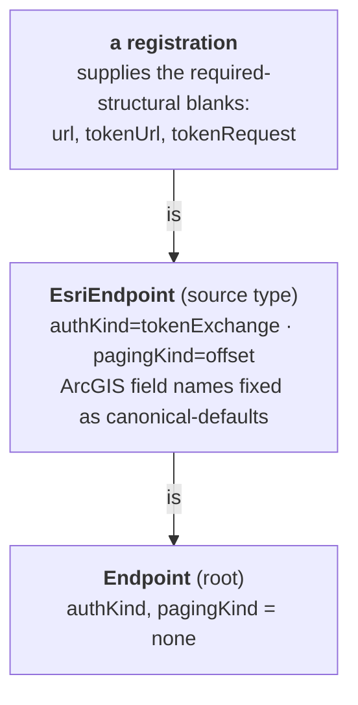

# Tributary

Tributary is VillageOS's generic outbound HTTP fetcher. Given an endpoint registered
in Mycelium, it resolves that endpoint's effective properties, performs the HTTP call
(with optional auth and pagination), optionally reshapes the response with a JSONata
expression, and ingests the readings as time-series observations on each entity's series.

It is deliberately **source-agnostic** — there is no per-API code. A specific source
(ArcGIS/ESRI, an OAuth2 REST API, a plain JSON endpoint) is expressed entirely as an
endpoint *template* plus a registration, never as a branch in Tributary. This page is
the canonical reference for the token-exchange and offset-paging *mechanics* and the
`EsriEndpoint` template, alongside the model the service sits on and the boundary it
respects. `MICROSERVICES.md` section 14 summarizes how Mycelium hosts Tributary as an
endpoint service and points back here.

## The endpoint-template graph

Endpoints are not free-form. Delta provisions a **single-rooted template hierarchy**
into Mycelium at boot and validates every registration against it (see the *Delta*
service docs and `MICROSERVICES.md`). A registration `is` a template, which `is` the
root — admissible properties are the union of keys along that chain, and a value
resolves to the closest ancestor that declares it:



The shape:

- Templates are Things; inheritance is expressed model-natively as `is` relationships
  (`EsriEndpoint is Endpoint`), never a scalar field.
- The graph is single-rooted (`Endpoint`), acyclic, and closed. A registration nominates
  a template via an `is` relationship (or defaults to the root); its admissible
  properties are the **union of property keys along that template's chain**
  (`AllowedKeys`).
- A property's effective value is **closest-ancestor-wins**: the nearest template in the
  chain that declares a non-blank value for the key. A blank value is *structural* — it
  makes the key admissible without supplying an inherited default.
- Tributary never walks the template graph itself. It reads Mycelium's
  **effective-properties** for the endpoint Thing (Mycelium merges the `is`-chain) and
  resolves each property by suffix-aware name match (`EffectivePropertyResolver`, so a
  Mycelium key like `Esri.itemsPath` matches a lookup for `itemsPath`).

## The field taxonomy

Every endpoint property falls into one of four roles. The role says who supplies the
value and whether it is expected to be overridden.

| Role | Meaning | Examples |
|------|---------|----------|
| **required-structural** | A structural key (declared blank on a template) that a registration MUST fill. Admissible via `AllowedKeys`; rejected if missing at use. | `url`; `tokenUrl`, `tokenRequest` (when minting a token) |
| **canonical-default** | A value a *child* template fixes to define a source type's identity — not normally overridden per registration. | `tokenPath`, `expiryPath`, `expiryUnit`; `offsetParam`, `pageSizeParam`, `hasMorePath`, `itemsPath`; a child's `authKind` / `pagingKind` |
| **sensible-default** | Has a built-in fallback (in code or a generic template default); commonly overridden per endpoint. | `httpMethod` (GET), `requestContentType` (application/json), `timeout` (30s), `tokenParam` (token), `responseTransform` ($) |
| **optional** | May be absent entirely; the feature is simply off. | `headers`, `queryParams`, `token` (pre-minted), `tokenHeader` / `tokenScheme`, `pageSize` |

`authKind` and `pagingKind` are *sensible-default* on the root `Endpoint` (unset → `none`,
i.e. off) and become *canonical-default* on a source child that selects a mode
(`tokenExchange` / `offset`).

The `EsriEndpoint` template is the worked example: it restates only the keys it narrows
(`httpMethod=POST`, form-encoded `requestContentType`), selects `authKind=tokenExchange`
and `pagingKind=offset`, and fixes the ArcGIS field names as canonical-defaults
(`tokenPath=token`, `expiryUnit=epochMillis`, `hasMorePath=exceededTransferLimit`,
`itemsPath=features`, …). A registration then supplies only the required-structural
blanks (`url`, `tokenUrl`, `tokenRequest`). The full template JSON is below.

## Token-exchange auth + offset paging

Tributary stays source-agnostic: it has two **generic** capabilities — a
token-exchange auth provider and an offset paginator — both driven entirely by
endpoint-template config. There is no ArcGIS vocabulary in the code; ESRI is just one
configuration (see *The `EsriEndpoint` template* below). No special binary, and no Delta
change — the endpoint-template catalog already resolves multi-level hierarchies.

**Auth kind.** `authKind` is a structural key on the **root `Endpoint`** template, so
it is admissible for every endpoint and carries no inherited default (an unset value is
treated as `none`). Descendant templates (or a registration) resolve the value.
`/handle` branches on it:

- `none` (or unset) — a plain REST call, unchanged. (A *static* key needs no auth kind —
  configure it directly as a `queryParams` entry or header.)
- `tokenExchange` — a pre-minted `token` is used directly; otherwise a token is minted
  by POSTing the configured `tokenRequest` form fields to `tokenUrl`, reading the token
  out at the simple dotted `tokenPath` (and optional `expiryPath` + `expiryUnit` of
  `epochMillis`/`epochSeconds`/`seconds`). Tokens live in a per-process
  `TokenExchangeCache` keyed by `(tokenUrl, request-fields)`, reused until ~75% of
  lifetime elapses (`TimeProvider`-driven), then refreshed. The credential attaches as a
  query param (`tokenParam`, default `token`) or, if `tokenHeader` is set, a request
  header (`tokenScheme` + value). Missing mint config is a 400; a token-endpoint failure
  surfaces as a **generic** 502 (the upstream message may name the credential and is not
  echoed to the caller — it is logged).

**Offset paging.** When `pagingKind = offset`, `OffsetPaginator` loops the query
advancing `offsetParam` (by `pageSize` via `pageSizeParam`, else by the returned item
count) while the page's `hasMorePath` boolean is true, and concatenates every page's
array at `itemsPath` into the first page's body. Aggregation happens **before** the
JSONata `responseTransform` runs, so the transform sees the complete result, not page
one. Paths are simple dotted keys (e.g. `data.features`).

**The `EsriEndpoint` template.** Seeds are deployment-supplied runtime data (not
committed; `seed.json` stores every template as a thing plus the `is` relationships
between them), so the canonical shape lives here. ESRI is expressed purely as config on
a child template that extends `Endpoint` and restates only the keys it narrows:

```json
{
  "things": [
    { "name": "Endpoint", "properties": {
        "url": "", "httpMethod": "GET", "responseTransform": "$",
        "headers": "", "queryParams": "", "requestContentType": "",
        "timeout": "", "authKind": "" } },
    { "name": "EsriEndpoint", "properties": {
        "httpMethod": "POST", "requestContentType": "application/x-www-form-urlencoded",
        "authKind": "tokenExchange",
        "token": "", "tokenUrl": "", "tokenRequest": "",
        "tokenPath": "token", "expiryPath": "expires", "expiryUnit": "epochMillis",
        "pagingKind": "offset", "offsetParam": "resultOffset",
        "pageSizeParam": "resultRecordCount", "hasMorePath": "exceededTransferLimit",
        "itemsPath": "features", "pageSize": "" } }
  ],
  "relationships": [ { "subject": "EsriEndpoint", "predicate": "is", "target": "Endpoint" } ]
}
```

A registration under `EsriEndpoint` supplies the blanks (`url`, `tokenUrl`,
`tokenRequest` = `{username, password, referer, f, client}`, optional `pageSize`). An
OAuth2 source reuses the same code with `tokenPath=access_token`,
`expiryPath=expires_in`, `expiryUnit=seconds`, `tokenHeader=Authorization`,
`tokenScheme=Bearer`. Blank values are structural keys — admissible for a registration
but supplying no inherited default. Graph composition is pinned by
`EsriEndpointTemplateTests` (Delta); behavior by `EsriHandleTests`,
`TokenExchangeCacheTests`, and `OffsetPaginatorTests` (Tributary).

## Fetch-and-shape, not derive — the Metabolism boundary

Tributary's contract is **fetch-and-shape**:

1. **Fetch** — one outbound HTTP call (auth + pagination as configured), aggregating any
   pages into a single body.
2. **Shape** — an optional JSONata `responseTransform` projects the response into the
   reading shape (`[{ name, properties, observedAt? }]`). JSONata here is *structural* —
   selecting, renaming, and restructuring fields — not a place to compute new domain quantities.
3. **Ingest** (hybrid ingest) — readings are grouped by entity `name`. Each entity is a
   Thing created **once** (its first reading seeds the observable properties, each bounded to
   `Sampled` PropertyMode) and linked to the endpoint **once** via an `observed` relationship;
   every reading's values are then written as **observations** on that entity's property series
   (`POST /api/things/{id}/observations`). So Things scale with the number of entities, not
   readings — the readings live in the time-series tier (Canopy → Sapwood), not the structural graph.

Tributary keeps **no state about the data** and computes **no derived values**. Anything
time-evolving or calculated — simulations, rates, accumulations, consumes/produces
dynamics — is **Metabolism's** job: a stateful daemon running persistent loops over
relationships (see `METABOLISM.md`). The dividing line: if it can be expressed as "fetch
this URL and rename its fields," it is Tributary; if it requires remembering prior values
or computing over time, it is Metabolism. That is why Tributary is stateless and
idempotent per call, and why the JSONata step is constrained to reshaping — derived
calculation deliberately lives on the other side of the boundary.

## Example: precipitation onto a Site (#5805)

Plane A of the site-analysis Water slice. A weather endpoint (e.g. Open-Meteo) is registered
with a `responseTransform` that reshapes the hourly response into a reading on the Site Thing —
no Tributary code changes, just config:

```jsonc
// endpoint registration (descends from the root Endpoint template)
{ "name": "JosudanPrecipitation",
  "properties": {
    "url": "https://api.open-meteo.com/v1/forecast?latitude=-25.75&longitude=28.19&hourly=precipitation",
    "responseTransform":
      "{\"name\": \"JosudanSite\", \"properties\": {\"precipitation\": hourly.precipitation[0]}, \"observedAt\": hourly.time[0]}"
  } }
```

Tributary fetches it and ingests `precipitation` (mm) as an observation on `JosudanSite` at the
observed time (see `PrecipitationEndpointTests`). That rainfall series feeds the catchment/reserve
the `WaterReserve` node computes over — real discovered data instead of a run param.

## Pointers

- `MICROSERVICES.md` section 14 — how Mycelium hosts Tributary as an endpoint service
  (auto-discovery, daemon lifecycle, pass-through proxying).
- *Delta* service docs (DevOps wiki) — how the template catalog is provisioned and how
  registrations are validated against it.
- `METABOLISM.md` — the derived-calculation engine on the other side of the
  fetch-and-shape boundary.
