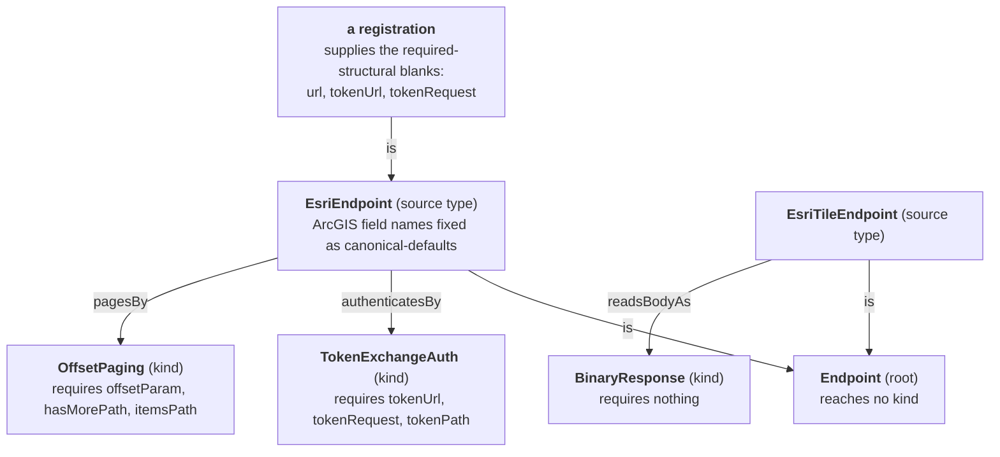

# Tributary

Tributary is VillageOS's generic outbound HTTP fetcher. Given an endpoint registered
in Mycelium, it resolves that endpoint's effective properties, performs the HTTP call
(with optional auth and pagination), optionally reshapes the response with a JSONata
expression, and ingests the readings as time-series observations on each entity's series.

It is deliberately **source-agnostic** — there is no per-API code. A specific source
(ArcGIS/ESRI, an OAuth2 REST API, a plain JSON endpoint, a map-tile server) is expressed
entirely as an endpoint *template* plus a registration, never as a branch in Tributary.
This page is the canonical reference for the token-exchange, offset-paging, and
non-text-payload *mechanics* and the `EsriEndpoint` / `EsriTileEndpoint` templates,
alongside the model the service sits on and the boundary it respects. `SERVICES.md`
section 14 summarizes how Mycelium hosts Tributary as an endpoint service and points
back here.

## The endpoint-template graph

Endpoints are not free-form. Delta provisions a **single-rooted template hierarchy**
into Mycelium at boot and validates every registration against it (see
[`DELTA.md`](DELTA.md) and `SERVICES.md`). A registration `is` a template, which `is` the
root — admissible properties are the union of keys along that chain, and a value
resolves to the closest ancestor that declares it:



The shape:

- **How an endpoint authenticates, pages, and reads its body is not a property — it is a
  kind the endpoint reaches.** A kind is a Thing related through a role edge
  (`authenticatesBy`, `pagesBy`, `readsBodyAs`); its own property keys are what an
  endpoint using it must supply, checked before anything is called. A role reaching no
  kind means the plain behaviour; the nearest declaration up the `is` chain wins; and the
  superseded property spellings (`authKind`, `pagingKind`, `responseKind`) are refused at
  provisioning (see [`DELTA.md`](DELTA.md)).

- Templates are Things; inheritance is expressed model-natively as `is` relationships
  (`EsriEndpoint is Endpoint`), never a scalar field.
- The graph is single-rooted (`Endpoint`), acyclic, and closed. A registration nominates
  a template via an `is` relationship (or defaults to the root); its admissible
  properties are the **union of property keys along that template's chain**
  (`AllowedKeys`).
- A property's effective value is **closest-ancestor-wins**: the nearest template in the
  chain that declares a non-blank value for the key. A blank value is *structural* — it
  makes the key admissible without supplying an inherited default.
- Tributary never walks the template graph itself. It reads the **resolved properties** for
  the endpoint Thing (Mycelium merges the `is`-chain) and resolves each property by
  suffix-aware name match (`EffectivePropertyResolver`, so a Mycelium key like
  `Esri.itemsPath` matches a lookup for `itemsPath`).
- Mycelium's resolved view reports a key **once per declaring template**, qualified by the path
  from the endpoint Thing. A key a descendant narrows appears **once**, at the ancestor that
  declares it, holding the narrowed value — Delta writes a narrowing after the template's `is`
  edge exists, so Mycelium stores it as an override rather than an own property (see
  [`DELTA.md`](DELTA.md)), and the platform refuses a Thing owning a name it also inherits.
- A key therefore reaches Tributary once. Two matches mean two genuinely different declarations
  (`http.url` against `resource.url`), and the call fails with a `conflicts` list rather than
  picking one arbitrarily.

## The field taxonomy

Every endpoint property falls into one of four roles. The role says who supplies the
value and whether it is expected to be overridden.

| Role | Meaning | Examples |
|------|---------|----------|
| **required-structural** | A structural key (declared blank on a template) that a registration MUST fill. Admissible via `AllowedKeys`; rejected if missing at use. | `url`; `tokenUrl`, `tokenRequest` (when minting a token) |
| **canonical-default** | A value a *child* template fixes to define a source type's identity — not normally overridden per registration. | `tokenPath`, `expiryPath`, `expiryUnit`; `offsetParam`, `pageSizeParam`, `hasMorePath`, `itemsPath` |
| **sensible-default** | Has a built-in fallback (in code or a generic template default); commonly overridden per endpoint. | `httpMethod` (GET), `requestContentType` (application/json), `timeout` (30s), `tokenParam` (token) |
| **optional** | May be absent entirely; the feature is simply off. | `responseTransform` (absent → the body is returned unchanged, nothing is ingested), `headers`, `queryParams`, `acceptHeader`, `token` (pre-minted), `tokenHeader` / `tokenScheme`, `pageSize` |

Which *mechanisms* apply is not in the table because it is not a property: an endpoint
reaches `TokenExchangeAuth`, `OffsetPaging`, or `BinaryResponse` through its template's
role edges, and the kinds themselves name the required-structural keys above.

The `EsriEndpoint` template is the worked example: it restates only the keys it narrows
(`httpMethod=POST`, form-encoded `requestContentType`), reaches `TokenExchangeAuth` and
`OffsetPaging`, and fixes the ArcGIS field names as canonical-defaults
(`tokenPath=token`, `expiryUnit=epochMillis`, `hasMorePath=exceededTransferLimit`,
`itemsPath=features`, …). A registration then supplies only the required-structural
blanks (`url`, `tokenUrl`, `tokenRequest`). The full template JSON is below.

## Per-call address parameters

A `url` may carry named placeholders in braces, which the caller fills through
`addressParameters` on the `/handle` request. One registration then serves every address in a
set — a tile pyramid, or a point query at each site's coordinates — instead of one registration
per address:

```jsonc
// registration:  "url": "https://tiles.example/tile/{z}/{y}/{x}.png"
{ "endpointName": "ExampleTiles",
  "addressParameters": { "z": "9", "y": "271", "x": "301" } }
// called:  https://tiles.example/tile/9/271/301.png
```

The substitution is **generic**: it knows the placeholder names only as text, so nothing about
tiles, zoom levels or coordinates appears in the code. The rules:

- A placeholder with no supplied value **refuses the call before the source is contacted**, naming
  every unfilled placeholder rather than the first. An address still carrying a placeholder is
  never called — the fill runs before the address is parsed, so it cannot become a URL that merely
  looks valid.
- A supplied value that no placeholder names is **ignored**. One caller passes a shared set of
  values to sources whose addresses take different placeholders, so an unused value is ordinary
  rather than a mistake.
- Names match case-insensitively, like every other property map here.
- Values are **escaped as they are substituted**, so a value carrying a reserved character cannot
  add a query parameter or a path segment of its own.
- Like the reshape override, parameters belong to **that call alone** — nothing is written back, and
  the catalogue does not grow a registration per address.
- Paging walks the *filled* address, so placeholders compose with `OffsetPaging`.

## Token-exchange auth + offset paging

Tributary stays source-agnostic: it has **generic** capabilities — a token-exchange
auth provider, an offset paginator, and a binary body reader — each selected by the
kind an endpoint reaches and driven entirely by endpoint-template config. There is no
ArcGIS vocabulary in the code; ESRI is just one configuration (see *The `EsriEndpoint`
template* below).

**Authentication.** An endpoint that reaches no kind through `authenticatesBy` makes a
plain REST call (a *static* key needs no auth kind — configure it directly as a
`queryParams` entry or header). Reaching **`TokenExchangeAuth`** selects the
token-exchange mechanism:

- a pre-minted `token` is used directly; otherwise a token is minted
  by POSTing the configured `tokenRequest` form fields to `tokenUrl`, reading the token
  out at the simple dotted `tokenPath` (and optional `expiryPath` + `expiryUnit` of
  `epochMillis`/`epochSeconds`/`seconds`). Tokens live in a per-process
  `TokenExchangeCache` keyed by `(tokenUrl, request-fields)`, reused until ~75% of
  lifetime elapses (`TimeProvider`-driven), then refreshed. The credential attaches as a
  query param (`tokenParam`, default `token`) or, if `tokenHeader` is set, a request
  header (`tokenScheme` + value). Missing mint config is a 400; a token-endpoint failure
  surfaces as a **generic** 502 (the upstream message may name the credential and is not
  echoed to the caller — it is logged).

**Offset paging.** When the endpoint reaches **`OffsetPaging`** through `pagesBy`,
`OffsetPaginator` loops the query
advancing `offsetParam` (by `pageSize` via `pageSizeParam`, else by the returned item
count) while the page's `hasMorePath` boolean is true, and concatenates every page's
array at `itemsPath` into the first page's body. Aggregation happens **before** the
JSONata `responseTransform` runs, so the transform sees the complete result, not page
one. Paths are simple dotted keys (e.g. `data.features`).

**The `EsriEndpoint` template.** Seeds are deployment-supplied runtime data (not
committed; `seed.json` stores every template as a thing plus the `is` relationships
between them), so the canonical shape lives here. ESRI is expressed purely as config on
a child template that extends `Endpoint` and restates only the keys it narrows:

```json
{
  "things": [
    { "name": "Endpoint", "properties": {
        "url": "", "httpMethod": "GET", "responseTransform": "",
        "headers": "", "queryParams": "", "requestContentType": "",
        "timeout": "" } },
    { "name": "EsriEndpoint", "properties": {
        "httpMethod": "POST", "requestContentType": "application/x-www-form-urlencoded",
        "token": "", "tokenUrl": "", "tokenRequest": "",
        "tokenPath": "token", "expiryPath": "expires", "expiryUnit": "epochMillis",
        "offsetParam": "resultOffset",
        "pageSizeParam": "resultRecordCount", "hasMorePath": "exceededTransferLimit",
        "itemsPath": "features", "pageSize": "" } }
  ],
  "kinds": [
    { "name": "TokenExchangeAuth", "requires": ["tokenUrl", "tokenRequest", "tokenPath"] },
    { "name": "OffsetPaging", "requires": ["offsetParam", "hasMorePath", "itemsPath"] }
  ],
  "relationships": [
    { "subject": "EsriEndpoint", "predicate": "is", "target": "Endpoint" },
    { "subject": "EsriEndpoint", "predicate": "authenticatesBy", "target": "TokenExchangeAuth" },
    { "subject": "EsriEndpoint", "predicate": "pagesBy", "target": "OffsetPaging" }
  ]
}
```

A registration under `EsriEndpoint` supplies the blanks (`url`, `tokenUrl`,
`tokenRequest` = `{username, password, referer, f, client}`, optional `pageSize`). An
OAuth2 source reuses the same code with `tokenPath=access_token`,
`expiryPath=expires_in`, `expiryUnit=seconds`, `tokenHeader=Authorization`,
`tokenScheme=Bearer`. Blank values are structural keys — admissible for a registration
but supplying no inherited default. Graph composition is pinned by
`EsriEndpointTemplateTests` (Delta); behavior by `EsriHandleTests`,
`TokenExchangeCacheTests`, and `OffsetPaginatorTests` (Tributary).

## Non-text payloads and map tiles

Endpoints are not all JSON. ESRI/ArcGIS map tiles and imagery — PNG/JPEG cached tiles,
`image/tiff` from an ImageServer, LERC elevation, PBF vector tiles, WebP — are binary
payloads a text read would destroy: decoding non-UTF-8 bytes to a string replaces byte
sequences with U+FFFD, which is lossy and irreversible. An endpoint whose body is bytes
therefore reaches the **`BinaryResponse`** kind through `readsBodyAs`, which selects a
byte-level read (`ReadAsByteArrayAsync`) wrapped in a base64 JSON envelope:

```json
{ "contentType": "image/jpeg", "dataBase64": "/9j/4AAQSkZJRg…", "byteLength": 14401 }
```

- The upstream `Content-Type` is carried through verbatim (absent → `application/octet-stream`),
  and `byteLength` equals the decoded length — the bytes round-trip exactly.
- The envelope itself stays `application/json`, so it flows through Mycelium's
  pass-through endpoint proxying with **no broker change**. Decoding is the caller's move
  (`Convert.FromBase64String` and write the file).
- Combinations that presuppose a decodable string body are rejected up front with a 400:
  a binary body cannot be combined with a `responseTransform` (declared on the endpoint
  or supplied on the request), nor with `OffsetPaging`. The root template leaves
  `responseTransform` blank, so a tile registration inherits no expression to clash with.
- Reaching no kind through `readsBodyAs` keeps the plain text body; `JsonResponse` is the
  explicit spelling of the same default.

**Accept negotiation.** The optional `acceptHeader` key sets the outbound `Accept`
header for upstreams that content-negotiate (an ImageServer answering `image/tiff`, or
`https://httpbin.org/image` answering with the format the caller asks for). The dedicated
key wins over any `Accept` in the generic `headers` map — exactly one value goes on the
wire — and q-value lists (`image/tiff, image/png;q=0.8`) are carried intact. It composes
with `BinaryResponse`: negotiate the format, carry the bytes home.

**The `EsriTileEndpoint` template.** A map tile is a plain unauthenticated GET whose body
is bytes, so the template descends from the root directly — none of `EsriEndpoint`'s
token exchange or paging — and adds only the kind edge and the optional negotiation blank:

```json
{
  "things": [
    { "name": "EsriTileEndpoint", "properties": { "acceptHeader": "" } }
  ],
  "kinds": [ { "name": "BinaryResponse", "requires": [] } ],
  "relationships": [
    { "subject": "EsriTileEndpoint", "predicate": "is", "target": "Endpoint" },
    { "subject": "EsriTileEndpoint", "predicate": "readsBodyAs", "target": "BinaryResponse" }
  ]
}
```

`BinaryResponse` requires nothing — reading bytes needs no configuration — so a
registration owes only the `url`, whose `{z}/{y}/{x}` placeholders the caller fills per
request (see *Per-call address parameters*), so one registration serves the whole
pyramid. Tile **metadata** endpoints (`f=json` service descriptions) are ordinary JSON
endpoints and need none of this.

**Model placement: transient passthrough.** A tile is a stateless fetch response. It is
never persisted as a Thing, an observation, or a Fact — binary cannot be a scalar
observation, and a base64 Fact would bloat the replay log. The envelope is returned and
forgotten; the same request refetches upstream. Keeping fetched responses on local disk
(config-driven, TTL-bounded) is the planned fast-follow #5918.

Graph composition is pinned by `EsriTileEndpointTemplateTests` (Delta); behavior by
`BinaryResponseKindTests` and `AcceptHeaderTests` (Tributary).

## Fetch-and-shape, not derive — the Metabolism boundary

Tributary's contract is **fetch-and-shape**:

1. **Fetch** — one outbound HTTP call (auth + pagination as configured), aggregating any
   pages into a single body.
2. **Shape** — an optional JSONata `responseTransform` projects the response into the
   reading shape (`[{ name, properties, observedAt? }]`). JSONata here is *structural* —
   selecting, renaming, and restructuring fields — not a place to compute new domain quantities.
   A reading that names no `observedAt` is forwarded without one, so Mycelium stamps the batch
   from the model clock. Tributary never supplies its own: its wall clock is not the model's
   whenever a run has anchored time away from real time.
3. **Ingest** (hybrid ingest) — readings are grouped by entity `name`. Each entity is a
   Thing created **once** (its first reading seeds the observable properties, each bounded to
   `Sampled` PropertyMode) and linked to the endpoint **once** via an `observed` relationship;
   every reading's values are then written as **observations** on that entity's property series
   (`POST /api/things/{id}/observations`). So Things scale with the number of entities, not
   readings — the readings live in the time-series tier (Canopy → Sapwood), not the structural graph.

**What decides ingest** is the expression *in effect*: the one on the registration, or the one it
inherits from its template. An endpoint with none fetches and returns the body unchanged — a plain
pass-through registration is a legitimate use, not a misconfiguration. A `responseTransform` on the
`/handle` request reshapes **that call only** and is never written back to the endpoint Thing, so one
caller's reshape cannot change what a later caller of the same source receives. Either way the
expression is compiled before the outbound call, so one that cannot parse costs the source nothing.

Every step runs under one token, so the endpoint Thing and the entities its readings name are always
in the same model. That is why a registration belongs to the project that fetches against it, and why
there is no catalogue shared between projects — see
[`DELTA.md`](DELTA.md#which-model-a-registration-lives-in).

Tributary keeps **no state about the data** and computes **no derived values**. Anything
time-evolving or calculated — simulations, rates, accumulations, consumes/produces
dynamics — is **Metabolism's** job: a stateful daemon running persistent loops over
relationships (see `METABOLISM.md`). The dividing line: if it can be expressed as "fetch
this URL and rename its fields," it is Tributary; if it requires remembering prior values
or computing over time, it is Metabolism. That is why Tributary is stateless and
idempotent per call, and why the JSONata step is constrained to reshaping — derived
calculation deliberately lives on the other side of the boundary.

## Example: precipitation onto a Site (#5805)

Plane A of the site-analysis Water slice. A weather endpoint (e.g. Open-Meteo) is registered
with a `responseTransform` that reshapes the hourly response into a reading on the Site Thing —
no Tributary code changes, just config:

```jsonc
// endpoint registration (descends from the root Endpoint template)
{ "name": "ExamplePrecipitation",
  "properties": {
    "url": "https://api.open-meteo.com/v1/forecast?latitude=<lat>&longitude=<lon>&hourly=precipitation",
    "responseTransform":
      "{\"name\": \"ExampleSite\", \"properties\": {\"precipitation\": hourly.precipitation[0]}, \"observedAt\": hourly.time[0]}"
  } }
```

Tributary fetches it and ingests `precipitation` (mm) as an observation on `ExampleSite` at the
observed time (see `PrecipitationEndpointTests`). That rainfall series feeds the catchment/reserve
the `WaterReserve` node computes over — real discovered data instead of a run param.

The **Energy** slice (#5806) discovers the same way — a solar-resource endpoint reshaping
`hourly.shortwave_radiation` onto the Site (see `SolarResourceEndpointTests`). Its two solar inputs
come from different sources that meet at the `EnergyBalance` node: the **solar resource** (annualized to
GTI) is *discovered* here, while the **PV area** is *rolled up* reactively over the classified
`SolarArray` `is`-edges — an `AggregateBounds` `Sum` over the ingester's classification (#5796) and roll-up
(#5797). Discovery (fetch a resource) and the ingester's structural knowledge (aggregate the assets) both
feed the same compute node.

## Pointers

- `SERVICES.md` section 14 — how Mycelium hosts Tributary as an endpoint service
  (auto-discovery, daemon lifecycle, pass-through proxying).
- [`DELTA.md`](DELTA.md) — how the template catalog is provisioned and how
  registrations are validated against it.
- `METABOLISM.md` — the derived-calculation engine on the other side of the
  fetch-and-shape boundary.
- [`TEMPORAL_READS.md`](TEMPORAL_READS.md) — the tiered time-series store the ingested
  observations land in, and how historical / as-of reads are served from it.
